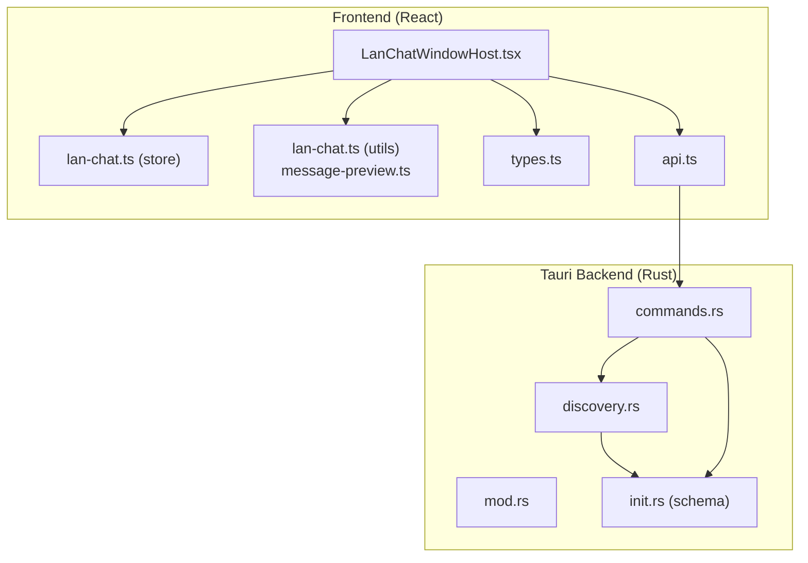
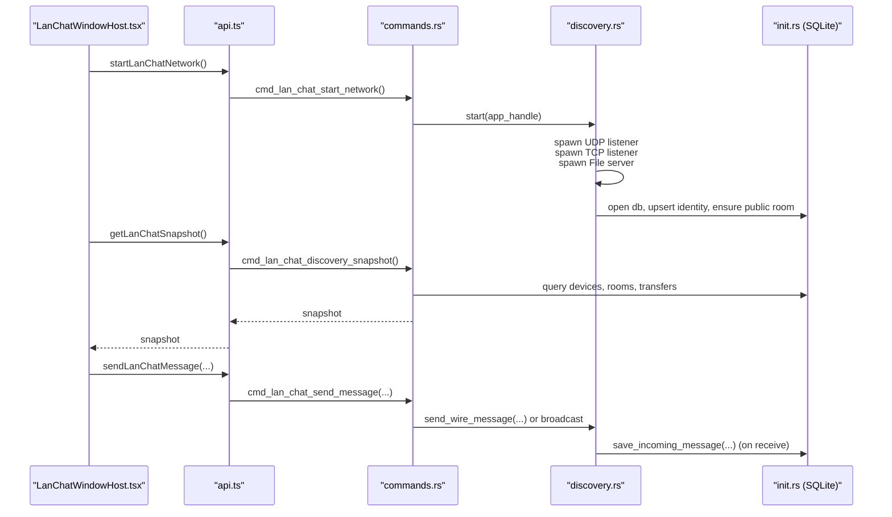
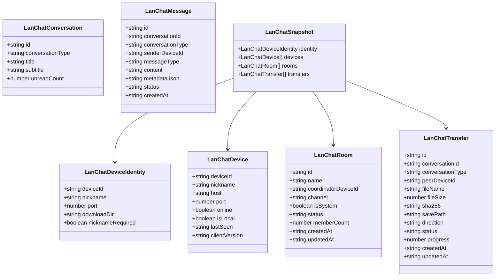
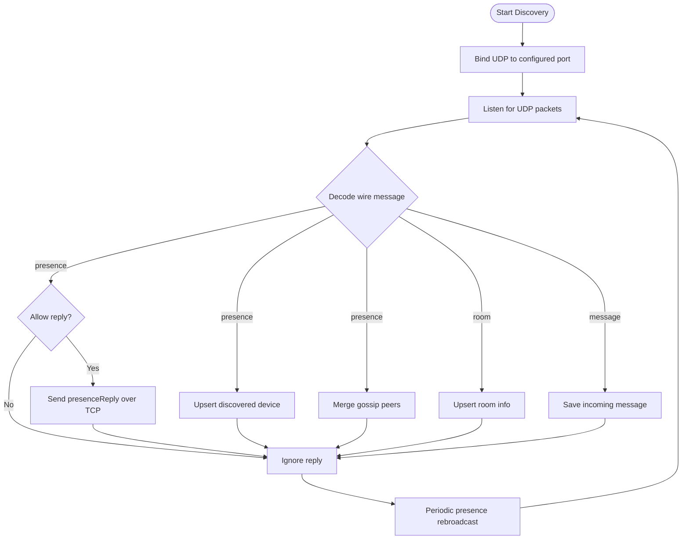
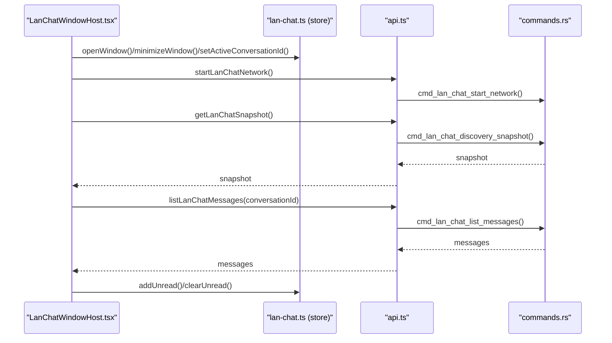
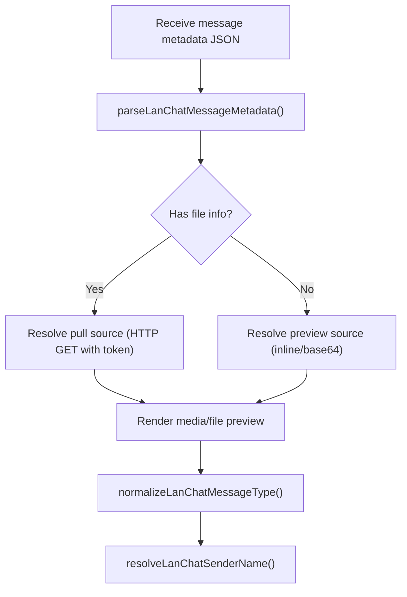
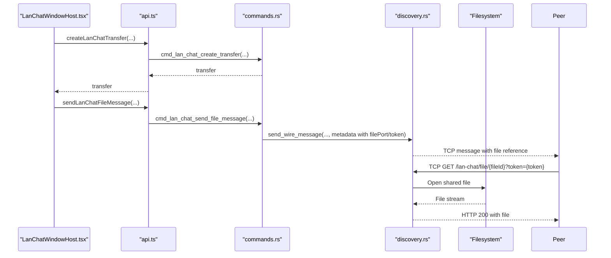
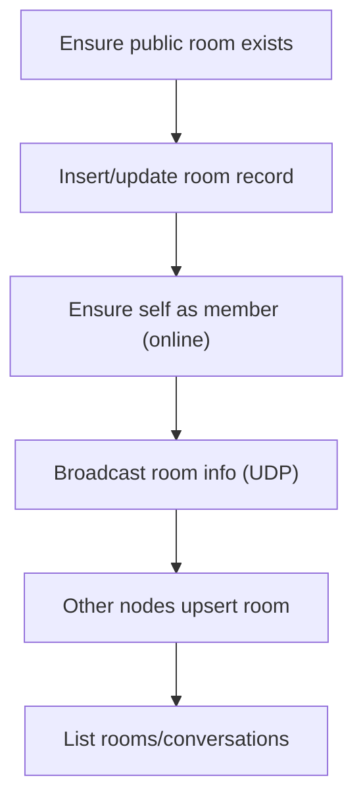
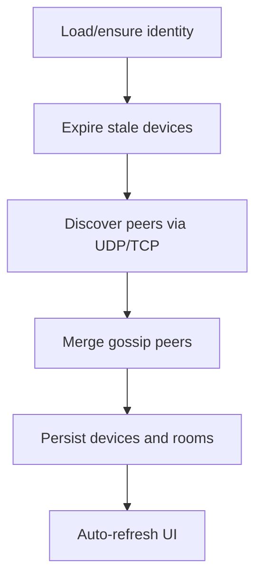
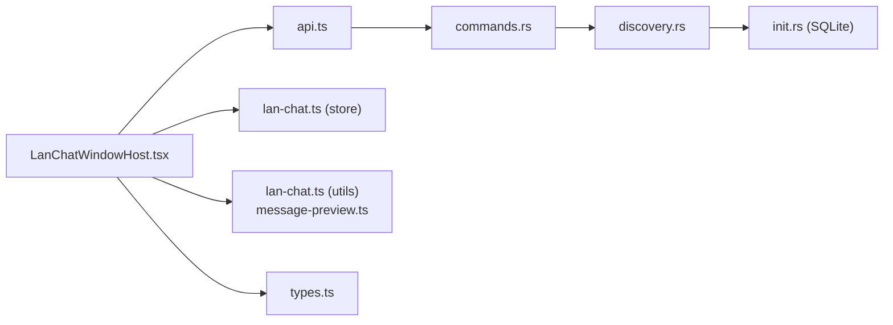

# LAN Chat

<cite>
**Referenced Files in This Document**
- [types.ts](file://src/plugins/lan-chat/types.ts)
- [lan-chat.ts (utils)](file://src/plugins/lan-chat/utils/lan-chat.ts)
- [message-preview.ts](file://src/plugins/lan-chat/utils/message-preview.ts)
- [lan-chat.ts (store)](file://src/plugins/lan-chat/store/lan-chat.ts)
- [LanChatWindowHost.tsx](file://src/plugins/lan-chat/components/LanChatWindowHost.tsx)
- [api.ts](file://src/plugins/lan-chat/api.ts)
- [mod.rs](file://src-tauri/src/plugins/lan_chat/mod.rs)
- [discovery.rs](file://src-tauri/src/plugins/lan_chat/discovery.rs)
- [commands.rs](file://src-tauri/src/plugins/lan_chat/commands.rs)
- [init.rs](file://src-tauri/src/db/init.rs)
</cite>

## Table of Contents
1. [Introduction](#introduction)
2. [Project Structure](#project-structure)
3. [Core Components](#core-components)
4. [Architecture Overview](#architecture-overview)
5. [Detailed Component Analysis](#detailed-component-analysis)
6. [Dependency Analysis](#dependency-analysis)
7. [Performance Considerations](#performance-considerations)
8. [Troubleshooting Guide](#troubleshooting-guide)
9. [Conclusion](#conclusion)
10. [Appendices](#appendices)

## Introduction
This document explains RDMM’s LAN Chat plugin for peer-to-peer (P2P) communication and local network collaboration. It covers local network discovery, peer-to-peer messaging protocols, real-time chat window management, message previews, file transfer capabilities, and room-based communication. It also documents LAN discovery mechanisms, network topology handling, and security considerations for local network communication. Practical examples show how to set up LAN chat, discover peers, send messages and files, and manage chat rooms. Guidance is included for network configuration, firewall considerations, and troubleshooting local network connectivity.

## Project Structure
The LAN Chat plugin is implemented as a frontend React component backed by Tauri commands. The frontend manages UI state, user interactions, and real-time updates. The backend (Rust) handles network discovery, message routing, room coordination, and persistence via SQLite.

**Diagram sources**
- [LanChatWindowHost.tsx:67-455](file://src/plugins/lan-chat/components/LanChatWindowHost.tsx#L67-L455)
- [api.ts:1-117](file://src/plugins/lan-chat/api.ts#L1-L117)
- [lan-chat.ts (store):73-202](file://src/plugins/lan-chat/store/lan-chat.ts#L73-L202)
- [lan-chat.ts (utils):1-72](file://src/plugins/lan-chat/utils/lan-chat.ts#L1-L72)
- [message-preview.ts:1-104](file://src/plugins/lan-chat/utils/message-preview.ts#L1-L104)
- [types.ts:1-74](file://src/plugins/lan-chat/types.ts#L1-L74)
- [mod.rs:1-8](file://src-tauri/src/plugins/lan_chat/mod.rs#L1-L8)
- [discovery.rs:1-831](file://src-tauri/src/plugins/lan_chat/discovery.rs#L1-L831)
- [commands.rs:1-1242](file://src-tauri/src/plugins/lan_chat/commands.rs#L1-L1242)
- [init.rs:280-351](file://src-tauri/src/db/init.rs#L280-L351)

**Section sources**
- [LanChatWindowHost.tsx:67-455](file://src/plugins/lan-chat/components/LanChatWindowHost.tsx#L67-L455)
- [api.ts:1-117](file://src/plugins/lan-chat/api.ts#L1-L117)
- [lan-chat.ts (store):73-202](file://src/plugins/lan-chat/store/lan-chat.ts#L73-L202)
- [lan-chat.ts (utils):1-72](file://src/plugins/lan-chat/utils/lan-chat.ts#L1-L72)
- [message-preview.ts:1-104](file://src/plugins/lan-chat/utils/message-preview.ts#L1-L104)
- [types.ts:1-74](file://src/plugins/lan-chat/types.ts#L1-L74)
- [mod.rs:1-8](file://src-tauri/src/plugins/lan_chat/mod.rs#L1-L8)
- [discovery.rs:1-831](file://src-tauri/src/plugins/lan_chat/discovery.rs#L1-L831)
- [commands.rs:1-1242](file://src-tauri/src/plugins/lan_chat/commands.rs#L1-L1242)
- [init.rs:280-351](file://src-tauri/src/db/init.rs#L280-L351)

## Core Components
- Data models define device identity, devices, rooms, conversations, messages, and transfers.
- Utilities provide formatting, device selection, preview resolution, and online presence checks.
- Store manages chat window state, bounds, unread counts, and active conversation.
- Frontend window orchestrates discovery, message listing, sending, file sharing, and transfer UI.
- Backend commands implement identity management, room handling, conversation creation, message dispatch, and file transfer support.

**Section sources**
- [types.ts:1-74](file://src/plugins/lan-chat/types.ts#L1-L74)
- [lan-chat.ts (utils):1-72](file://src/plugins/lan-chat/utils/lan-chat.ts#L1-L72)
- [message-preview.ts:1-104](file://src/plugins/lan-chat/utils/message-preview.ts#L1-L104)
- [lan-chat.ts (store):73-202](file://src/plugins/lan-chat/store/lan-chat.ts#L73-L202)
- [LanChatWindowHost.tsx:67-455](file://src/plugins/lan-chat/components/LanChatWindowHost.tsx#L67-L455)
- [api.ts:1-117](file://src/plugins/lan-chat/api.ts#L1-L117)
- [commands.rs:288-800](file://src-tauri/src/plugins/lan_chat/commands.rs#L288-L800)
- [discovery.rs:1-831](file://src-tauri/src/plugins/lan_chat/discovery.rs#L1-L831)
- [init.rs:280-351](file://src-tauri/src/db/init.rs#L280-L351)

## Architecture Overview
LAN Chat uses a hybrid UDP/TCP discovery and messaging model:
- Discovery: UDP broadcast of “presence” messages with periodic rebroadcasts and optional TCP presence replies.
- Messaging: UDP broadcast for room messages; TCP direct for targeted P2P messages.
- Persistence: SQLite-backed device registry, rooms, messages, transfers, and shared files.
- Frontend: Real-time UI updates via periodic polling and Tauri commands.

**Diagram sources**
- [LanChatWindowHost.tsx:115-129](file://src/plugins/lan-chat/components/LanChatWindowHost.tsx#L115-L129)
- [api.ts:22-84](file://src/plugins/lan-chat/api.ts#L22-L84)
- [commands.rs:371-375](file://src-tauri/src/plugins/lan_chat/commands.rs#L371-L375)
- [discovery.rs:381-472](file://src-tauri/src/plugins/lan_chat/discovery.rs#L381-L472)
- [init.rs:280-351](file://src-tauri/src/db/init.rs#L280-L351)

## Detailed Component Analysis

### Data Models and UI State
- Identity and device registry: device identifiers, nicknames, endpoints, online status, and last-seen timestamps.
- Rooms: system public room and per-device direct chats.
- Messages: text, images, audio, video, and file references with metadata.
- Transfers: file sharing state, progress, and download locations.

**Diagram sources**
- [types.ts:1-74](file://src/plugins/lan-chat/types.ts#L1-L74)

**Section sources**
- [types.ts:1-74](file://src/plugins/lan-chat/types.ts#L1-L74)

### Network Discovery and Messaging Protocols
- Discovery protocol: JSON wire messages with fields for protocol, kind, device identity, peers, room info, and message payload.
- UDP presence: periodic rebroadcasts and broadcast of presence replies to discovered peers.
- TCP messaging: direct TCP frames for targeted P2P messages; UDP for room broadcasts.
- Room handling: system public room maintained centrally; custom rooms are not supported.
- File transfer: HTTP GET over TCP file server with tokenized URLs for secure retrieval.

**Diagram sources**
- [discovery.rs:288-316](file://src-tauri/src/plugins/lan_chat/discovery.rs#L288-L316)
- [discovery.rs:318-344](file://src-tauri/src/plugins/lan_chat/discovery.rs#L318-L344)
- [discovery.rs:346-366](file://src-tauri/src/plugins/lan_chat/discovery.rs#L346-L366)
- [discovery.rs:381-472](file://src-tauri/src/plugins/lan_chat/discovery.rs#L381-L472)

**Section sources**
- [discovery.rs:1-831](file://src-tauri/src/plugins/lan_chat/discovery.rs#L1-L831)

### Real-Time Chat Window Management
- Window state: open/minimized/maximized, position, size, unread counters, and active conversation.
- Auto-refresh: periodic polling for snapshots and messages while the window is open and not minimized.
- Conversation switching: clears unread counters for the active conversation and lists messages.
- Online presence: direct chat availability is inferred from device online status and last-seen timestamps.

**Diagram sources**
- [lan-chat.ts (store):73-202](file://src/plugins/lan-chat/store/lan-chat.ts#L73-L202)
- [LanChatWindowHost.tsx:115-156](file://src/plugins/lan-chat/components/LanChatWindowHost.tsx#L115-L156)
- [api.ts:11-62](file://src/plugins/lan-chat/api.ts#L11-L62)
- [commands.rs:681-718](file://src-tauri/src/plugins/lan_chat/commands.rs#L681-L718)

**Section sources**
- [lan-chat.ts (store):73-202](file://src/plugins/lan-chat/store/lan-chat.ts#L73-L202)
- [LanChatWindowHost.tsx:115-156](file://src/plugins/lan-chat/components/LanChatWindowHost.tsx#L115-L156)

### Message Preview System
- Metadata parsing: extracts file references, tokens, ports, filenames, sizes, and MIME types.
- Type classification: determines whether a message is text, image, audio, video, or file based on content and metadata.
- Preview source resolution: resolves inline data URIs or constructs data URIs using MIME types.
- Sender name resolution: displays “Me” for local device or nickname/deviceId fallback.

**Diagram sources**
- [message-preview.ts:11-61](file://src/plugins/lan-chat/utils/message-preview.ts#L11-L61)
- [message-preview.ts:33-51](file://src/plugins/lan-chat/utils/message-preview.ts#L33-L51)
- [message-preview.ts:63-73](file://src/plugins/lan-chat/utils/message-preview.ts#L63-L73)

**Section sources**
- [message-preview.ts:1-104](file://src/plugins/lan-chat/utils/message-preview.ts#L1-L104)

### File Transfer Capabilities
- Transfer lifecycle: create transfer record, update progress, mark shared/failed, and persist attachment metadata.
- Pull-based delivery: sender creates a shared file record with a token and exposes it via a TCP HTTP file server.
- Receiver downloads via constructed URL with token and saves to a configured download directory.

**Diagram sources**
- [LanChatWindowHost.tsx:280-300](file://src/plugins/lan-chat/components/LanChatWindowHost.tsx#L280-L300)
- [api.ts:100-116](file://src/plugins/lan-chat/api.ts#L100-L116)
- [commands.rs:721-800](file://src-tauri/src/plugins/lan_chat/commands.rs#L721-L800)
- [discovery.rs:518-572](file://src-tauri/src/plugins/lan_chat/discovery.rs#L518-L572)

**Section sources**
- [LanChatWindowHost.tsx:280-300](file://src/plugins/lan-chat/components/LanChatWindowHost.tsx#L280-L300)
- [api.ts:100-116](file://src/plugins/lan-chat/api.ts#L100-L116)
- [commands.rs:721-800](file://src-tauri/src/plugins/lan_chat/commands.rs#L721-L800)
- [discovery.rs:518-572](file://src-tauri/src/plugins/lan_chat/discovery.rs#L518-L572)

### Room-Based Communication Features
- Public room: system-managed public lobby with a fixed ID and channel.
- Room broadcasting: rooms are announced via UDP broadcasts; clients upsert room info and maintain membership.
- Conversation list: includes the public room and direct chats; custom rooms are not supported.

**Diagram sources**
- [commands.rs:234-257](file://src-tauri/src/plugins/lan_chat/commands.rs#L234-L257)
- [commands.rs:586-619](file://src-tauri/src/plugins/lan_chat/commands.rs#L586-L619)
- [discovery.rs:689-727](file://src-tauri/src/plugins/lan_chat/discovery.rs#L689-L727)

**Section sources**
- [commands.rs:234-257](file://src-tauri/src/plugins/lan_chat/commands.rs#L234-L257)
- [commands.rs:586-619](file://src-tauri/src/plugins/lan_chat/commands.rs#L586-L619)
- [discovery.rs:689-727](file://src-tauri/src/plugins/lan_chat/discovery.rs#L689-L727)

### LAN Discovery Mechanisms and Topology Handling
- Identity: stable device ID derived from MAC address when possible; otherwise UUID. Nickname and port configurable.
- Presence: periodic UDP rebroadcasts; TCP presence replies for bidirectional discovery.
- Gossip: peers propagate known peers to expand reach.
- Staleness: offline devices are expired after a grace period; room membership reflects online status.

**Diagram sources**
- [commands.rs:284-307](file://src-tauri/src/plugins/lan_chat/commands.rs#L284-L307)
- [commands.rs:264-282](file://src-tauri/src/plugins/lan_chat/commands.rs#L264-L282)
- [discovery.rs:65-101](file://src-tauri/src/plugins/lan_chat/discovery.rs#L65-L101)
- [discovery.rs:133-183](file://src-tauri/src/plugins/lan_chat/discovery.rs#L133-L183)

**Section sources**
- [commands.rs:284-307](file://src-tauri/src/plugins/lan_chat/commands.rs#L284-L307)
- [commands.rs:264-282](file://src-tauri/src/plugins/lan_chat/commands.rs#L264-L282)
- [discovery.rs:65-101](file://src-tauri/src/plugins/lan_chat/discovery.rs#L65-L101)
- [discovery.rs:133-183](file://src-tauri/src/plugins/lan_chat/discovery.rs#L133-L183)

### Security Considerations for Local Network Communication
- Transport security: No encryption; all traffic is plaintext over UDP/TCP. Use only on trusted local networks.
- Authentication: No credentials; device identity is implicit. Ensure only trusted peers are present on the LAN.
- File sharing: Tokenized URLs protect against casual access; still avoid exposing sensitive content.
- Firewall: Allow inbound UDP and TCP on the configured port range; ensure NAT traversal is not required for LAN-only usage.

[No sources needed since this section provides general guidance]

## Dependency Analysis
- Frontend depends on Tauri commands for discovery, messaging, and file operations.
- Backend commands depend on discovery logic and SQLite schema for persistence.
- Discovery threads depend on the database for identity and device storage.

**Diagram sources**
- [LanChatWindowHost.tsx:67-455](file://src/plugins/lan-chat/components/LanChatWindowHost.tsx#L67-L455)
- [api.ts:1-117](file://src/plugins/lan-chat/api.ts#L1-L117)
- [commands.rs:1-1242](file://src-tauri/src/plugins/lan_chat/commands.rs#L1-L1242)
- [discovery.rs:1-831](file://src-tauri/src/plugins/lan_chat/discovery.rs#L1-L831)
- [init.rs:280-351](file://src-tauri/src/db/init.rs#L280-L351)
- [lan-chat.ts (store):73-202](file://src/plugins/lan-chat/store/lan-chat.ts#L73-L202)
- [lan-chat.ts (utils):1-72](file://src/plugins/lan-chat/utils/lan-chat.ts#L1-L72)
- [message-preview.ts:1-104](file://src/plugins/lan-chat/utils/message-preview.ts#L1-L104)
- [types.ts:1-74](file://src/plugins/lan-chat/types.ts#L1-L74)

**Section sources**
- [LanChatWindowHost.tsx:67-455](file://src/plugins/lan-chat/components/LanChatWindowHost.tsx#L67-L455)
- [api.ts:1-117](file://src/plugins/lan-chat/api.ts#L1-L117)
- [commands.rs:1-1242](file://src-tauri/src/plugins/lan_chat/commands.rs#L1-L1242)
- [discovery.rs:1-831](file://src-tauri/src/plugins/lan_chat/discovery.rs#L1-L831)
- [init.rs:280-351](file://src-tauri/src/db/init.rs#L280-L351)
- [lan-chat.ts (store):73-202](file://src/plugins/lan-chat/store/lan-chat.ts#L73-L202)
- [lan-chat.ts (utils):1-72](file://src/plugins/lan-chat/utils/lan-chat.ts#L1-L72)
- [message-preview.ts:1-104](file://src/plugins/lan-chat/utils/message-preview.ts#L1-L104)
- [types.ts:1-74](file://src/plugins/lan-chat/types.ts#L1-L74)

## Performance Considerations
- Polling intervals: UI polls snapshots and messages periodically; adjust intervals based on network size and responsiveness needs.
- Payload limits: UDP messages are constrained; large payloads should use file transfer with pull-based delivery.
- Deduplication: Room targets are deduplicated by host/port to avoid redundant sends.
- Cleanup: Stale devices and memberships are pruned to keep queries efficient.

[No sources needed since this section provides general guidance]

## Troubleshooting Guide
Common issues and resolutions:
- Cannot discover peers
  - Verify the LAN Chat window is open and refreshed.
  - Ensure the configured port is reachable and not blocked by firewall.
  - Confirm peers are on the same subnet and can reach the broadcast address.
- Direct chat fails
  - Ensure the peer device has a discovered endpoint (host/port) recorded.
  - Confirm the peer is online and within the last-seen threshold.
- File transfer errors
  - Check that the file server is bound on the expected port (port + 1).
  - Verify the tokenized URL is accessible to the receiver.
  - Confirm the shared file record exists and matches the requested file ID.
- Public room not appearing
  - The public room is automatically ensured; refresh the snapshot to populate it.

**Section sources**
- [LanChatWindowHost.tsx:246-254](file://src/plugins/lan-chat/components/LanChatWindowHost.tsx#L246-L254)
- [commands.rs:721-760](file://src-tauri/src/plugins/lan_chat/commands.rs#L721-L760)
- [discovery.rs:518-572](file://src-tauri/src/plugins/lan_chat/discovery.rs#L518-L572)

## Conclusion
RDMM’s LAN Chat plugin provides a lightweight, local-first solution for P2P and room-based communication. It leverages UDP/TCP discovery, SQLite persistence, and a responsive React UI to enable real-time collaboration on trusted LANs. While it prioritizes simplicity and performance, users should apply appropriate firewall and network policies to maintain security.

## Appendices

### Practical Examples

- Setting up LAN Chat
  - Open the LAN Chat window and configure your nickname and listen port.
  - Click refresh to start discovery and populate peers and the public room.

- Discovering nearby peers
  - Peers appear in the left panel after discovery; online peers are marked accordingly.

- Sending a text message
  - Select a conversation (public room or direct) and type in the composer; press Enter to send.

- Sending a file
  - Attach a file from your device; the system creates a transfer record and sends a message with a file reference.
  - The receiver can download the file via the tokenized URL.

- Managing chat rooms
  - The public room is always available; custom rooms are not supported.
  - Clearing a conversation removes its messages locally.

**Section sources**
- [LanChatWindowHost.tsx:115-129](file://src/plugins/lan-chat/components/LanChatWindowHost.tsx#L115-L129)
- [LanChatWindowHost.tsx:269-278](file://src/plugins/lan-chat/components/LanChatWindowHost.tsx#L269-L278)
- [LanChatWindowHost.tsx:280-300](file://src/plugins/lan-chat/components/LanChatWindowHost.tsx#L280-L300)
- [api.ts:11-62](file://src/plugins/lan-chat/api.ts#L11-L62)
- [commands.rs:681-718](file://src-tauri/src/plugins/lan_chat/commands.rs#L681-L718)

### Network Configuration and Firewall Considerations
- Ports
  - Chat listener: configured port (default 45881).
  - File server: configured port + 1.
- Permissions
  - Allow inbound UDP and TCP on the configured port range.
  - Ensure outbound UDP broadcasts are permitted.
- Subnetting
  - Devices must be on the same subnet for broadcast discovery to work effectively.

**Section sources**
- [discovery.rs:395-420](file://src-tauri/src/plugins/lan_chat/discovery.rs#L395-L420)
- [discovery.rs:486-515](file://src-tauri/src/plugins/lan_chat/discovery.rs#L486-L515)