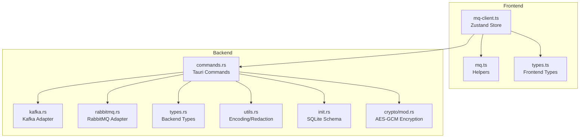
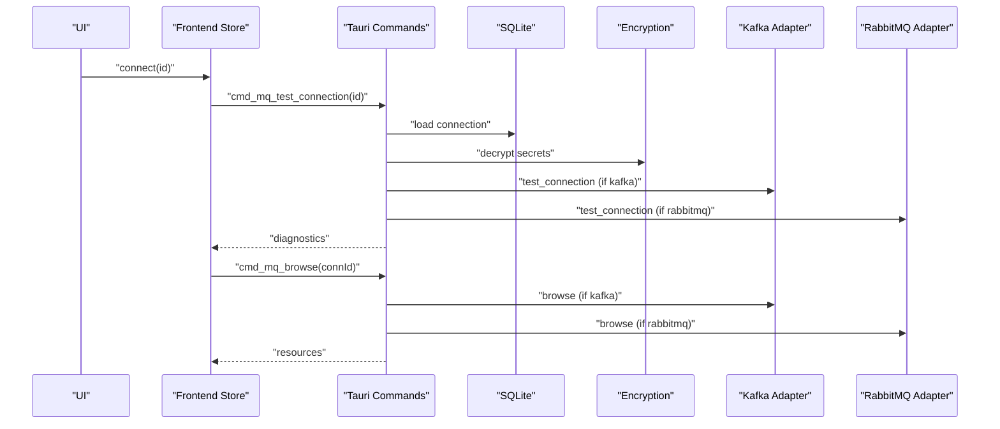
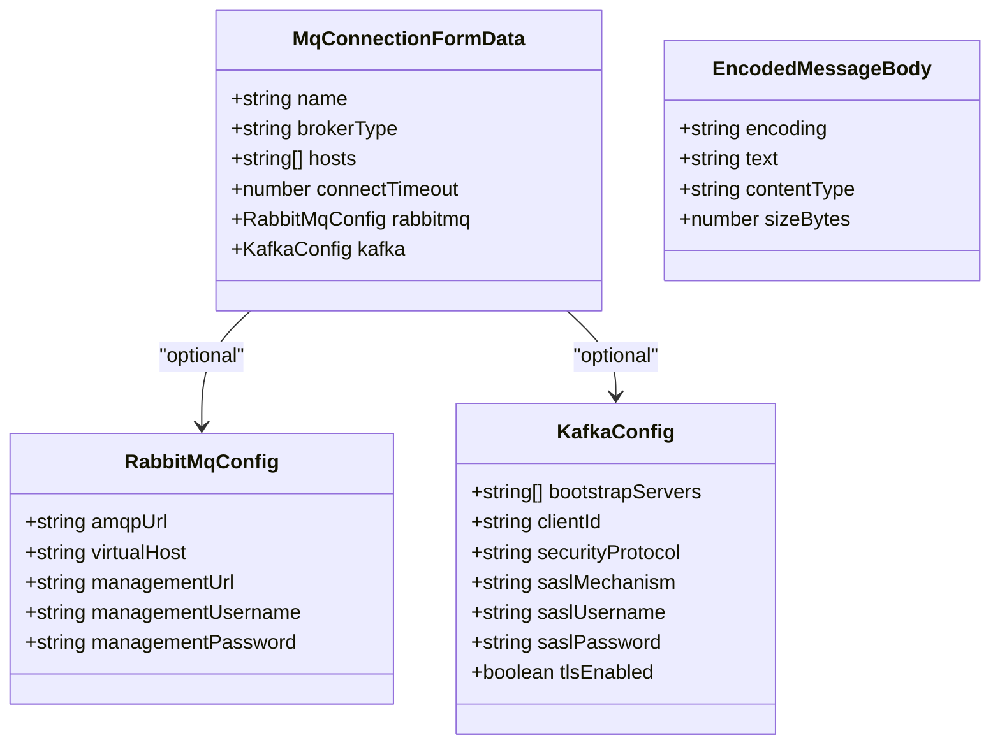
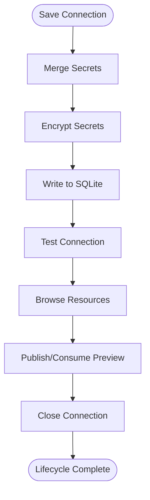
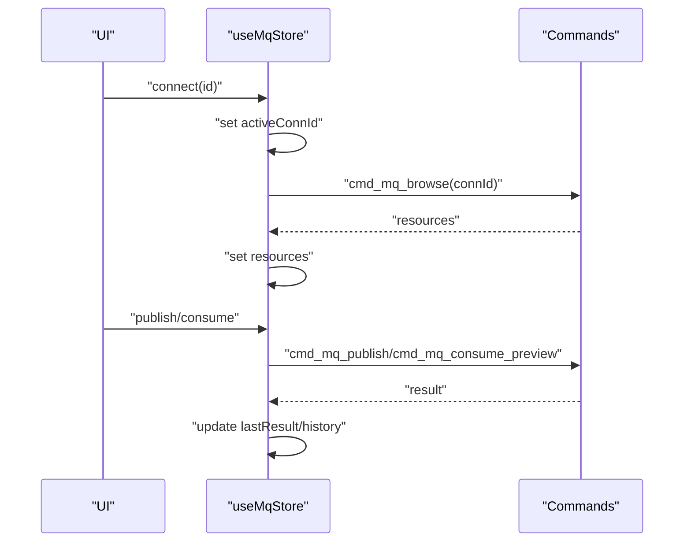
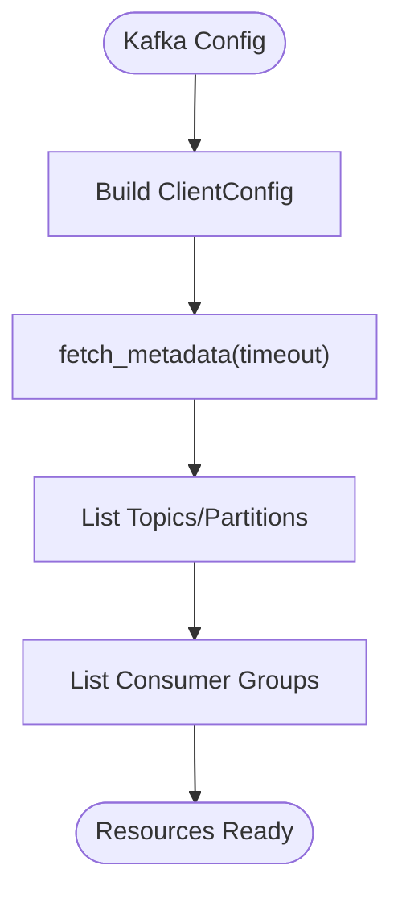
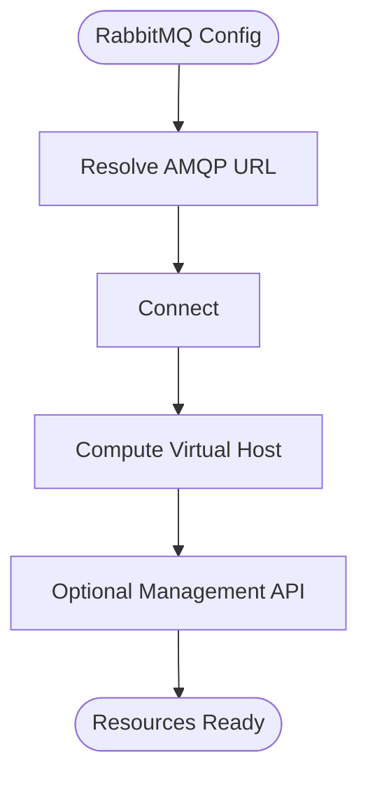
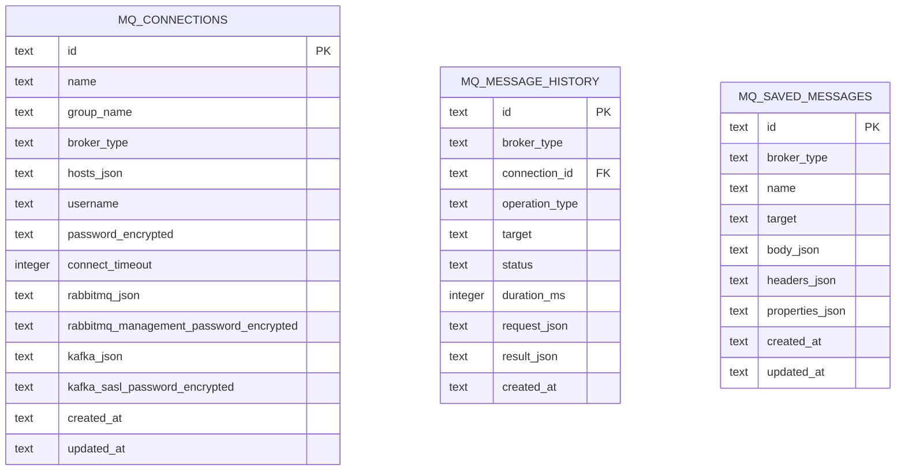
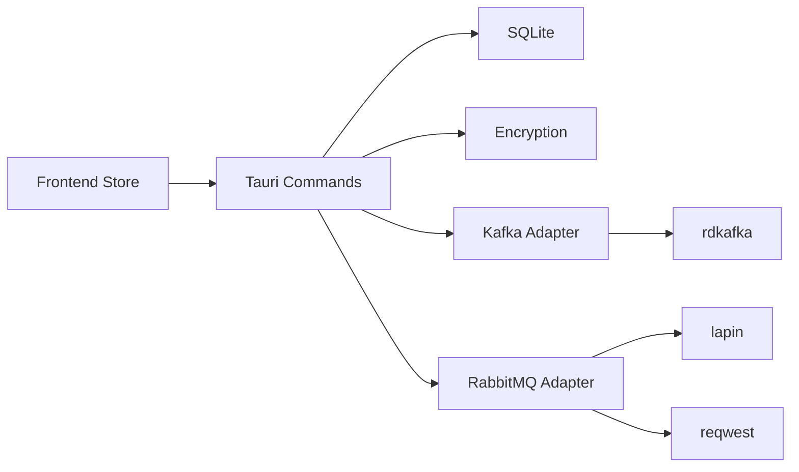

# Connection Management

<cite>
**Referenced Files in This Document**
- [mq-client.ts](file://src/plugins/mq-client/store/mq-client.ts)
- [mq.ts](file://src/plugins/mq-client/utils/mq.ts)
- [types.ts](file://src/plugins/mq-client/types.ts)
- [mod.rs](file://src-tauri/src/plugins/mq/mod.rs)
- [kafka.rs](file://src-tauri/src/plugins/mq/kafka.rs)
- [rabbitmq.rs](file://src-tauri/src/plugins/mq/rabbitmq.rs)
- [commands.rs](file://src-tauri/src/plugins/mq/commands.rs)
- [types.rs](file://src-tauri/src/plugins/mq/types.rs)
- [utils.rs](file://src-tauri/src/plugins/mq/utils.rs)
- [init.rs](file://src-tauri/src/db/init.rs)
- [crypto/mod.rs](file://src-tauri/src/crypto/mod.rs)
- [lib.rs](file://src-tauri/src/lib.rs)
</cite>

## Table of Contents
1. [Introduction](#introduction)
2. [Project Structure](#project-structure)
3. [Core Components](#core-components)
4. [Architecture Overview](#architecture-overview)
5. [Detailed Component Analysis](#detailed-component-analysis)
6. [Dependency Analysis](#dependency-analysis)
7. [Performance Considerations](#performance-considerations)
8. [Troubleshooting Guide](#troubleshooting-guide)
9. [Conclusion](#conclusion)

## Introduction
This document explains the MQ client connection management system for both Kafka and RabbitMQ brokers. It covers connection configuration, lifecycle, diagnostics, storage, state management, and operational best practices. The system is implemented as a Tauri plugin with a frontend Zustand store and a backend Rust module that persists connections in SQLite, encrypts secrets, and performs broker-specific operations.

## Project Structure
The MQ plugin spans both frontend and backend layers:
- Frontend (React + Zustand): connection store, helpers, and types
- Backend (Rust + Tauri): commands, broker adapters, utilities, and persistence

**Diagram sources**
- [mq-client.ts:1-103](file://src/plugins/mq-client/store/mq-client.ts#L1-L103)
- [mq.ts:1-20](file://src/plugins/mq-client/utils/mq.ts#L1-L20)
- [types.ts:1-90](file://src/plugins/mq-client/types.ts#L1-L90)
- [commands.rs:1-276](file://src-tauri/src/plugins/mq/commands.rs#L1-L276)
- [kafka.rs:1-243](file://src-tauri/src/plugins/mq/kafka.rs#L1-L243)
- [rabbitmq.rs:1-211](file://src-tauri/src/plugins/mq/rabbitmq.rs#L1-L211)
- [types.rs:1-213](file://src-tauri/src/plugins/mq/types.rs#L1-L213)
- [utils.rs:1-103](file://src-tauri/src/plugins/mq/utils.rs#L1-L103)
- [init.rs:238-278](file://src-tauri/src/db/init.rs#L238-L278)
- [crypto/mod.rs:1-75](file://src-tauri/src/crypto/mod.rs#L1-L75)

**Section sources**
- [mq-client.ts:1-103](file://src/plugins/mq-client/store/mq-client.ts#L1-L103)
- [commands.rs:1-276](file://src-tauri/src/plugins/mq/commands.rs#L1-L276)
- [init.rs:238-278](file://src-tauri/src/db/init.rs#L238-L278)

## Core Components
- Frontend store orchestrates connection CRUD, diagnostics, browsing, publishing, consuming previews, history, and templates.
- Backend commands hydrate secrets, persist connections, and delegate to broker adapters.
- Broker adapters encapsulate connection configuration, timeouts, and operations.
- Persistence stores connections, history, and templates in SQLite with encrypted secrets.
- Utilities handle encoding, redaction, and sensitive-key masking.

**Section sources**
- [mq-client.ts:19-102](file://src/plugins/mq-client/store/mq-client.ts#L19-L102)
- [commands.rs:68-207](file://src-tauri/src/plugins/mq/commands.rs#L68-L207)
- [kafka.rs:15-42](file://src-tauri/src/plugins/mq/kafka.rs#L15-L42)
- [rabbitmq.rs:14-49](file://src-tauri/src/plugins/mq/rabbitmq.rs#L14-L49)
- [utils.rs:57-81](file://src-tauri/src/plugins/mq/utils.rs#L57-L81)

## Architecture Overview
The system follows a layered architecture:
- UI invokes frontend store actions
- Store calls Tauri commands via invoke
- Commands load connection from SQLite, hydrate secrets, and dispatch to broker adapter
- Adapters perform operations and return results
- Results are optionally persisted to history

**Diagram sources**
- [mq-client.ts:73-83](file://src/plugins/mq-client/store/mq-client.ts#L73-L83)
- [commands.rs:152-170](file://src-tauri/src/plugins/mq/commands.rs#L152-L170)
- [kafka.rs:44-72](file://src-tauri/src/plugins/mq/kafka.rs#L44-L72)
- [rabbitmq.rs:66-104](file://src-tauri/src/plugins/mq/rabbitmq.rs#L66-L104)

## Detailed Component Analysis

### Connection Configuration and Security
- Connection model supports two broker types with distinct configuration shapes:
  - RabbitMQ: AMQP URL, virtual host, optional management URL/credentials
  - Kafka: bootstrap servers, client ID, security protocol, SASL mechanism/credentials
- Secrets are stored encrypted in SQLite and hydrated on demand:
  - Passwords, RabbitMQ management passwords, Kafka SASL passwords
- Sensitive key masking is applied to logs and UI to avoid accidental exposure.

**Diagram sources**
- [types.ts:22-39](file://src/plugins/mq-client/types.ts#L22-L39)
- [types.ts:4-20](file://src/plugins/mq-client/types.ts#L4-L20)
- [types.ts:44-44](file://src/plugins/mq-client/types.ts#L44-L44)

**Section sources**
- [types.ts:1-90](file://src/plugins/mq-client/types.ts#L1-L90)
- [commands.rs:29-66](file://src-tauri/src/plugins/mq/commands.rs#L29-L66)
- [crypto/mod.rs:40-74](file://src-tauri/src/crypto/mod.rs#L40-L74)
- [utils.rs:5-14](file://src-tauri/src/plugins/mq/utils.rs#L5-L14)

### Connection Lifecycle
- Creation and persistence:
  - Save merges provided secrets with existing ones, encrypts, and writes to SQLite
  - Host normalization ensures clean lists
- Validation:
  - Test connection builds broker-specific client configs and performs connectivity checks
  - Kafka: metadata fetch; RabbitMQ: AMQP connect and optional management API check
- Browsing:
  - Kafka: topics, partitions, brokers, consumer groups
  - RabbitMQ: queues, exchanges, bindings via management API
- Operations:
  - Publish and consume preview with configurable limits and timeouts
- Destruction:
  - Connections are closed after operations; no persistent connection pools are maintained

**Diagram sources**
- [commands.rs:92-143](file://src-tauri/src/plugins/mq/commands.rs#L92-L143)
- [kafka.rs:44-72](file://src-tauri/src/plugins/mq/kafka.rs#L44-L72)
- [rabbitmq.rs:66-104](file://src-tauri/src/plugins/mq/rabbitmq.rs#L66-L104)
- [kafka.rs:148-176](file://src-tauri/src/plugins/mq/kafka.rs#L148-L176)
- [rabbitmq.rs:136-165](file://src-tauri/src/plugins/mq/rabbitmq.rs#L136-L165)

**Section sources**
- [commands.rs:92-143](file://src-tauri/src/plugins/mq/commands.rs#L92-L143)
- [kafka.rs:44-72](file://src-tauri/src/plugins/mq/kafka.rs#L44-L72)
- [rabbitmq.rs:66-104](file://src-tauri/src/plugins/mq/rabbitmq.rs#L66-L104)
- [kafka.rs:148-176](file://src-tauri/src/plugins/mq/kafka.rs#L148-L176)
- [rabbitmq.rs:136-165](file://src-tauri/src/plugins/mq/rabbitmq.rs#L136-L165)

### Connection Store and State Management
- Active connection selection and validation
- Tab navigation and resource tree population
- Operation results and history updates
- Templates management per broker type

**Diagram sources**
- [mq-client.ts:78-102](file://src/plugins/mq-client/store/mq-client.ts#L78-L102)
- [commands.rs:162-207](file://src-tauri/src/plugins/mq/commands.rs#L162-L207)

**Section sources**
- [mq-client.ts:19-102](file://src/plugins/mq-client/store/mq-client.ts#L19-L102)

### Kafka Adapter
- Configuration:
  - Bootstrap servers and client ID
  - Security protocol and SASL settings
  - Auto-commit disabled for preview consumption
- Diagnostics:
  - Metadata fetch with connect timeout
- Browse:
  - Brokers, topics, partitions, consumer groups
- Publish:
  - Produces to topic with optional key/partition
- Consume Preview:
  - Subscribes or assigns partitions, polls with deadlines, collects messages

**Diagram sources**
- [kafka.rs:15-42](file://src-tauri/src/plugins/mq/kafka.rs#L15-L42)
- [kafka.rs:74-146](file://src-tauri/src/plugins/mq/kafka.rs#L74-L146)

**Section sources**
- [kafka.rs:15-42](file://src-tauri/src/plugins/mq/kafka.rs#L15-L42)
- [kafka.rs:74-146](file://src-tauri/src/plugins/mq/kafka.rs#L74-L146)
- [kafka.rs:148-176](file://src-tauri/src/plugins/mq/kafka.rs#L148-L176)
- [kafka.rs:178-242](file://src-tauri/src/plugins/mq/kafka.rs#L178-L242)

### RabbitMQ Adapter
- Configuration:
  - AMQP URL resolution (explicit or from hosts)
  - Virtual host and optional management credentials
- Diagnostics:
  - AMQP connect test; optional management API availability check
- Browse:
  - Queues, exchanges, bindings via management API
- Publish:
  - Requires routing key or queue name
- Consume Preview:
  - Basic get loop with ack/nack modes

**Diagram sources**
- [rabbitmq.rs:20-49](file://src-tauri/src/plugins/mq/rabbitmq.rs#L20-L49)
- [rabbitmq.rs:66-104](file://src-tauri/src/plugins/mq/rabbitmq.rs#L66-L104)

**Section sources**
- [rabbitmq.rs:20-49](file://src-tauri/src/plugins/mq/rabbitmq.rs#L20-L49)
- [rabbitmq.rs:106-134](file://src-tauri/src/plugins/mq/rabbitmq.rs#L106-L134)
- [rabbitmq.rs:136-165](file://src-tauri/src/plugins/mq/rabbitmq.rs#L136-L165)
- [rabbitmq.rs:167-210](file://src-tauri/src/plugins/mq/rabbitmq.rs#L167-L210)

### Storage and Secrets
- SQLite schema defines:
  - mq_connections: connection records with encrypted secrets
  - mq_message_history: operation history with redacted JSON
  - mq_saved_messages: reusable message templates
- Encryption uses AES-GCM with a per-installation key file
- Secrets hydration occurs on-demand during operations

**Diagram sources**
- [init.rs:238-278](file://src-tauri/src/db/init.rs#L238-L278)

**Section sources**
- [init.rs:238-278](file://src-tauri/src/db/init.rs#L238-L278)
- [commands.rs:29-66](file://src-tauri/src/plugins/mq/commands.rs#L29-L66)
- [crypto/mod.rs:40-74](file://src-tauri/src/crypto/mod.rs#L40-L74)

## Dependency Analysis
- Frontend depends on Tauri core for invoke and Zustand for state
- Backend commands depend on:
  - SQLite for persistence
  - Encryption module for secrets
  - Broker libraries (lapin for RabbitMQ, rdkafka for Kafka)
  - reqwest for RabbitMQ management API
- Broker adapters encapsulate external library usage and expose unified operations

**Diagram sources**
- [lib.rs:213-225](file://src-tauri/src/lib.rs#L213-L225)
- [commands.rs:152-207](file://src-tauri/src/plugins/mq/commands.rs#L152-L207)
- [kafka.rs:3-7](file://src-tauri/src/plugins/mq/kafka.rs#L3-L7)
- [rabbitmq.rs:3-6](file://src-tauri/src/plugins/mq/rabbitmq.rs#L3-L6)

**Section sources**
- [lib.rs:213-225](file://src-tauri/src/lib.rs#L213-L225)
- [commands.rs:152-207](file://src-tauri/src/plugins/mq/commands.rs#L152-L207)

## Performance Considerations
- Timeouts:
  - Connect timeout is configurable and used across diagnostics and operations
  - Consume preview enforces a polling loop with a configurable timeout and limit
- Resource enumeration:
  - Kafka: metadata and group list queries with timeouts
  - RabbitMQ: management API calls; missing management URL limits browsing
- Encoding:
  - Automatic UTF-8 vs base64 detection for message bodies
- Recommendations:
  - Keep connect timeout reasonable (default is used when unspecified)
  - Limit preview counts and timeouts to avoid long blocking operations
  - Prefer SASL over PLAINTEXT where possible for Kafka; enable TLS when supported

[No sources needed since this section provides general guidance]

## Troubleshooting Guide
- Connection fails immediately:
  - Verify AMQP URL or bootstrap servers; ensure virtual host is correct for RabbitMQ
  - Confirm credentials and SASL settings for Kafka
- Management API unavailable (RabbitMQ):
  - Provide management URL and credentials; ensure HTTP access is permitted
- No resources shown:
  - Kafka: metadata fetch timed out or broker unreachable
  - RabbitMQ: missing management URL or insufficient permissions
- Publish errors:
  - RabbitMQ requires a routing key or queue name
  - Kafka requires a valid topic and optional partition/key
- Consuming previews:
  - Adjust limit and timeout; ack mode controls whether messages are acknowledged or requeued

**Section sources**
- [rabbitmq.rs:20-49](file://src-tauri/src/plugins/mq/rabbitmq.rs#L20-L49)
- [kafka.rs:15-42](file://src-tauri/src/plugins/mq/kafka.rs#L15-L42)
- [kafka.rs:178-242](file://src-tauri/src/plugins/mq/kafka.rs#L178-L242)
- [rabbitmq.rs:136-165](file://src-tauri/src/plugins/mq/rabbitmq.rs#L136-L165)

## Conclusion
The MQ client connection management system provides a robust, secure, and extensible foundation for connecting to Kafka and RabbitMQ. It emphasizes safe secret handling, diagnostic coverage, and straightforward lifecycle operations. The design cleanly separates concerns between frontend UX, backend orchestration, and broker-specific adapters, enabling future enhancements such as connection pooling or advanced retry logic if needed.