# MQ Client

<cite>
**Referenced Files in This Document**
- [index.tsx](file://src/plugins/mq-client/index.tsx)
- [types.ts](file://src/plugins/mq-client/types.ts)
- [mq-client.ts](file://src/plugins/mq-client/store/mq-client.ts)
- [mq.ts](file://src/plugins/mq-client/utils/mq.ts)
- [ConnectionsView.tsx](file://src/plugins/mq-client/views/ConnectionsView.tsx)
- [BrowserView.tsx](file://src/plugins/mq-client/views/BrowserView.tsx)
- [MessageStudio.tsx](file://src/plugins/mq-client/views/MessageStudio.tsx)
- [HistoryView.tsx](file://src/plugins/mq-client/views/HistoryView.tsx)
- [mod.rs](file://src-tauri/src/plugins/mq/mod.rs)
- [commands.rs](file://src-tauri/src/plugins/mq/commands.rs)
- [kafka.rs](file://src-tauri/src/plugins/mq/kafka.rs)
- [rabbitmq.rs](file://src-tauri/src/plugins/mq/rabbitmq.rs)
- [types.rs](file://src-tauri/src/plugins/mq/types.rs)
- [utils.rs](file://src-tauri/src/plugins/mq/utils.rs)
</cite>

## Table of Contents
1. [Introduction](#introduction)
2. [Project Structure](#project-structure)
3. [Core Components](#core-components)
4. [Architecture Overview](#architecture-overview)
5. [Detailed Component Analysis](#detailed-component-analysis)
6. [Dependency Analysis](#dependency-analysis)
7. [Performance Considerations](#performance-considerations)
8. [Troubleshooting Guide](#troubleshooting-guide)
9. [Conclusion](#conclusion)
10. [Appendices](#appendices)

## Introduction
This document describes the MQ client plugin for RDMM, focusing on message queue management and monitoring for Kafka and RabbitMQ systems. It explains connection management, message browsing, real-time message inspection, the Message Studio for crafting and sending messages, history tracking, protocol-specific connection handling, integration patterns, serialization formats, and consumer/producer operations. Practical examples demonstrate connecting to message queues, browsing topics/channels, sending test messages, and monitoring message flow. Guidance is included for troubleshooting, performance considerations, and best practices for message broker administration.

## Project Structure
The MQ client plugin is organized into frontend React components and a Tauri backend with protocol-specific modules. The frontend manages UI tabs, stores state, and invokes backend commands. The backend persists connections, performs diagnostics, and executes publish/consume operations for Kafka and RabbitMQ.

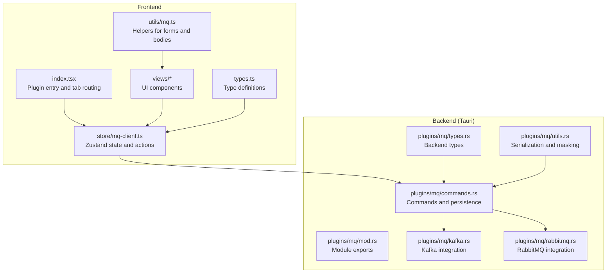

**Diagram sources**
- [index.tsx:1-38](file://src/plugins/mq-client/index.tsx#L1-L38)
- [mq-client.ts:1-103](file://src/plugins/mq-client/store/mq-client.ts#L1-L103)
- [types.ts:1-90](file://src/plugins/mq-client/types.ts#L1-L90)
- [mq.ts:1-20](file://src/plugins/mq-client/utils/mq.ts#L1-L20)
- [commands.rs:1-276](file://src-tauri/src/plugins/mq/commands.rs#L1-L276)
- [kafka.rs:1-243](file://src-tauri/src/plugins/mq/kafka.rs#L1-L243)
- [rabbitmq.rs:1-211](file://src-tauri/src/plugins/mq/rabbitmq.rs#L1-L211)
- [types.rs:1-213](file://src-tauri/src/plugins/mq/types.rs#L1-L213)
- [utils.rs:1-103](file://src-tauri/src/plugins/mq/utils.rs#L1-L103)

**Section sources**
- [index.tsx:1-38](file://src/plugins/mq-client/index.tsx#L1-L38)
- [commands.rs:1-276](file://src-tauri/src/plugins/mq/commands.rs#L1-L276)

## Core Components
- Plugin entry and navigation: The plugin registers a tabbed interface with four views: Connections, Browser, Message Studio, and History.
- State management: A Zustand store orchestrates connection CRUD, diagnostics, browsing, publishing, consuming, history, and templates.
- Protocol abstractions: Unified request/response types support both Kafka and RabbitMQ with broker-specific fields.
- Utilities: Helpers for default connection presets, masked sensitive values, and safe JSON formatting.

Key responsibilities:
- ConnectionsView: Manage connection definitions and test connectivity.
- BrowserView: Render broker resource trees (topics/groups for Kafka; queues/exchanges/bindings for RabbitMQ).
- MessageStudio: Compose and send messages with templates and preview consumption.
- HistoryView: Track operations, replay publishes, and inspect request/result payloads.

**Section sources**
- [index.tsx:13-38](file://src/plugins/mq-client/index.tsx#L13-L38)
- [mq-client.ts:19-102](file://src/plugins/mq-client/store/mq-client.ts#L19-L102)
- [types.ts:22-90](file://src/plugins/mq-client/types.ts#L22-L90)
- [mq.ts:15-20](file://src/plugins/mq-client/utils/mq.ts#L15-L20)

## Architecture Overview
The MQ client follows a layered architecture:
- Frontend UI triggers actions via the Zustand store.
- Store invokes Tauri commands to perform operations.
- Backend commands load connection configs, hydrate secrets, and delegate to protocol handlers.
- Protocol handlers implement diagnostics, browsing, publish, and consume logic.
- Results are persisted to history and surfaced to the UI.

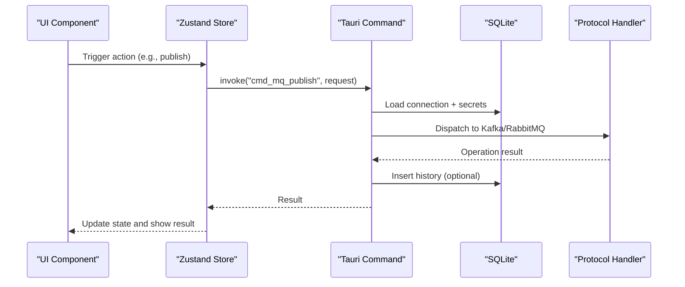

**Diagram sources**
- [mq-client.ts:84-89](file://src/plugins/mq-client/store/mq-client.ts#L84-L89)
- [commands.rs:182-193](file://src-tauri/src/plugins/mq/commands.rs#L182-L193)
- [kafka.rs:148-176](file://src-tauri/src/plugins/mq/kafka.rs#L148-L176)
- [rabbitmq.rs:136-165](file://src-tauri/src/plugins/mq/rabbitmq.rs#L136-L165)

## Detailed Component Analysis

### Connection Management
- Connection definitions support RabbitMQ and Kafka with broker-specific configuration blocks.
- Secrets are stored encrypted and hydrated on demand for operations.
- Test diagnostics report stage-by-stage outcomes and durations.

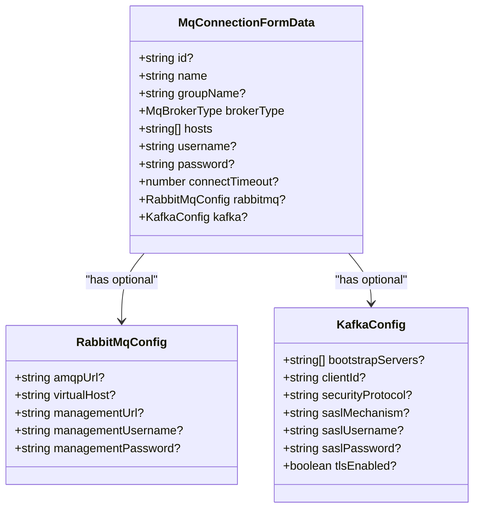

**Diagram sources**
- [types.ts:22-33](file://src/plugins/mq-client/types.ts#L22-L33)
- [types.ts:4-20](file://src/plugins/mq-client/types.ts#L4-L20)

**Section sources**
- [ConnectionsView.tsx:22-34](file://src/plugins/mq-client/views/ConnectionsView.tsx#L22-L34)
- [commands.rs:92-143](file://src-tauri/src/plugins/mq/commands.rs#L92-L143)
- [utils.rs:29-46](file://src-tauri/src/plugins/mq/utils.rs#L29-L46)

### Message Browsing Interfaces
- Kafka: Lists brokers, topics, partitions, and consumer groups. Group details are read-only and do not commit offsets.
- RabbitMQ: Requires Management Plugin; lists queues, exchanges, and bindings via the Management API.

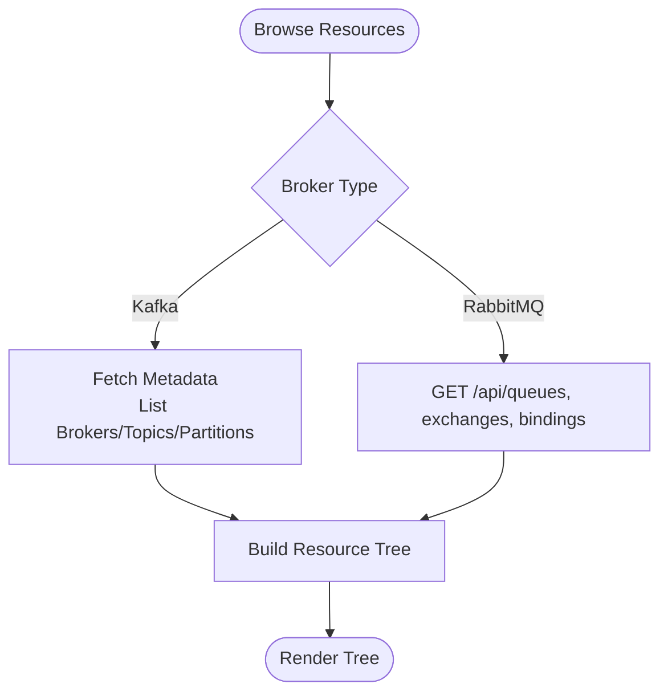

**Diagram sources**
- [commands.rs:162-170](file://src-tauri/src/plugins/mq/commands.rs#L162-L170)
- [kafka.rs:74-146](file://src-tauri/src/plugins/mq/kafka.rs#L74-L146)
- [rabbitmq.rs:123-134](file://src-tauri/src/plugins/mq/rabbitmq.rs#L123-L134)

**Section sources**
- [BrowserView.tsx:11-22](file://src/plugins/mq-client/views/BrowserView.tsx#L11-L22)
- [kafka.rs:118-139](file://src-tauri/src/plugins/mq/kafka.rs#L118-L139)
- [rabbitmq.rs:123-134](file://src-tauri/src/plugins/mq/rabbitmq.rs#L123-L134)

### Real-Time Message Inspection
- Preview consume supports configurable limits, timeouts, and offset modes for Kafka and ack/requeue modes for RabbitMQ.
- Results include decoded message bodies, headers, partition/offset metadata, and redelivery indicators.

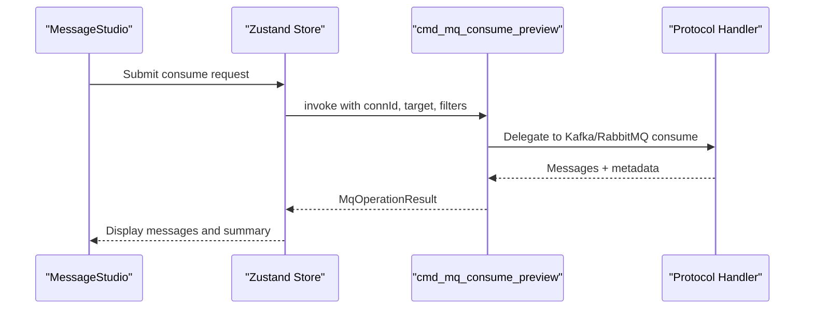

**Diagram sources**
- [MessageStudio.tsx:51-56](file://src/plugins/mq-client/views/MessageStudio.tsx#L51-L56)
- [mq-client.ts:90-95](file://src/plugins/mq-client/store/mq-client.ts#L90-L95)
- [commands.rs:195-207](file://src-tauri/src/plugins/mq/commands.rs#L195-L207)
- [kafka.rs:178-242](file://src-tauri/src/plugins/mq/kafka.rs#L178-L242)
- [rabbitmq.rs:167-210](file://src-tauri/src/plugins/mq/rabbitmq.rs#L167-L210)

**Section sources**
- [MessageStudio.tsx:82-88](file://src/plugins/mq-client/views/MessageStudio.tsx#L82-L88)
- [kafka.rs:187-200](file://src-tauri/src/plugins/mq/kafka.rs#L187-L200)
- [rabbitmq.rs:192-196](file://src-tauri/src/plugins/mq/rabbitmq.rs#L192-L196)

### Message Studio: Craft and Send Messages
- Supports RabbitMQ publish (exchange/topic-like target, routing key/queue) and Kafka produce (topic, optional key/partition).
- Headers and properties can be specified as newline-separated key:value pairs.
- Templates enable saving and reusing message configurations.

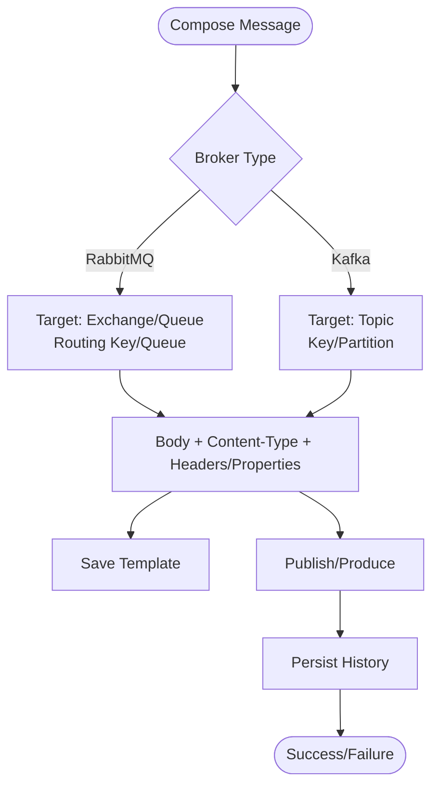

**Diagram sources**
- [MessageStudio.tsx:33-49](file://src/plugins/mq-client/views/MessageStudio.tsx#L33-L49)
- [MessageStudio.tsx:58-68](file://src/plugins/mq-client/views/MessageStudio.tsx#L58-L68)
- [commands.rs:182-193](file://src-tauri/src/plugins/mq/commands.rs#L182-L193)

**Section sources**
- [MessageStudio.tsx:70-99](file://src/plugins/mq-client/views/MessageStudio.tsx#L70-L99)
- [mq-client.ts:99-101](file://src/plugins/mq-client/store/mq-client.ts#L99-L101)

### History Tracking
- Records operations with request/response payloads, status, duration, and timestamps.
- Supports filtering by broker type, connection, target, operation type, and status.
- Allows replay of publish operations using saved requests.

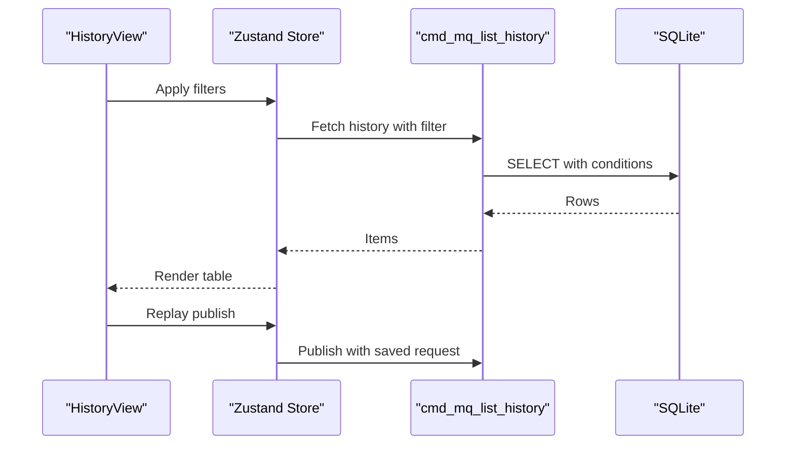

**Diagram sources**
- [HistoryView.tsx:17-22](file://src/plugins/mq-client/views/HistoryView.tsx#L17-L22)
- [commands.rs:213-229](file://src-tauri/src/plugins/mq/commands.rs#L213-L229)
- [commands.rs:189-191](file://src-tauri/src/plugins/mq/commands.rs#L189-L191)

**Section sources**
- [HistoryView.tsx:19-38](file://src/plugins/mq-client/views/HistoryView.tsx#L19-L38)
- [commands.rs:213-241](file://src-tauri/src/plugins/mq/commands.rs#L213-L241)

### Protocol-Specific Connection Handling
- Kafka: Configures bootstrap servers, client ID, security protocol, SASL mechanisms, and timeouts. Metadata and group listings are used for browsing; produce/consume use rdkafka clients.
- RabbitMQ: Uses AMQP URL and optional Management credentials. Browsing depends on Management API availability; publish uses basic publish; consume uses basic get with ack/nack semantics.

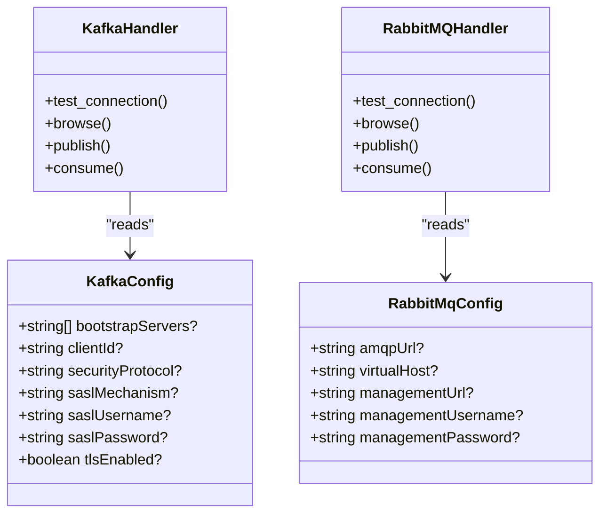

**Diagram sources**
- [types.ts:12-20](file://src/plugins/mq-client/types.ts#L12-L20)
- [types.ts:4-10](file://src/plugins/mq-client/types.ts#L4-L10)
- [kafka.rs:15-42](file://src-tauri/src/plugins/mq/kafka.rs#L15-L42)
- [rabbitmq.rs:14-18](file://src-tauri/src/plugins/mq/rabbitmq.rs#L14-L18)

**Section sources**
- [kafka.rs:15-42](file://src-tauri/src/plugins/mq/kafka.rs#L15-L42)
- [rabbitmq.rs:20-37](file://src-tauri/src/plugins/mq/rabbitmq.rs#L20-L37)

### Serialization Formats and Encoding
- Message bodies support UTF-8 text and Base64-encoded binary payloads.
- Automatic detection chooses UTF-8 when valid UTF-8 is detected; otherwise encodes as Base64.
- Sensitive fields in JSON history are redacted.

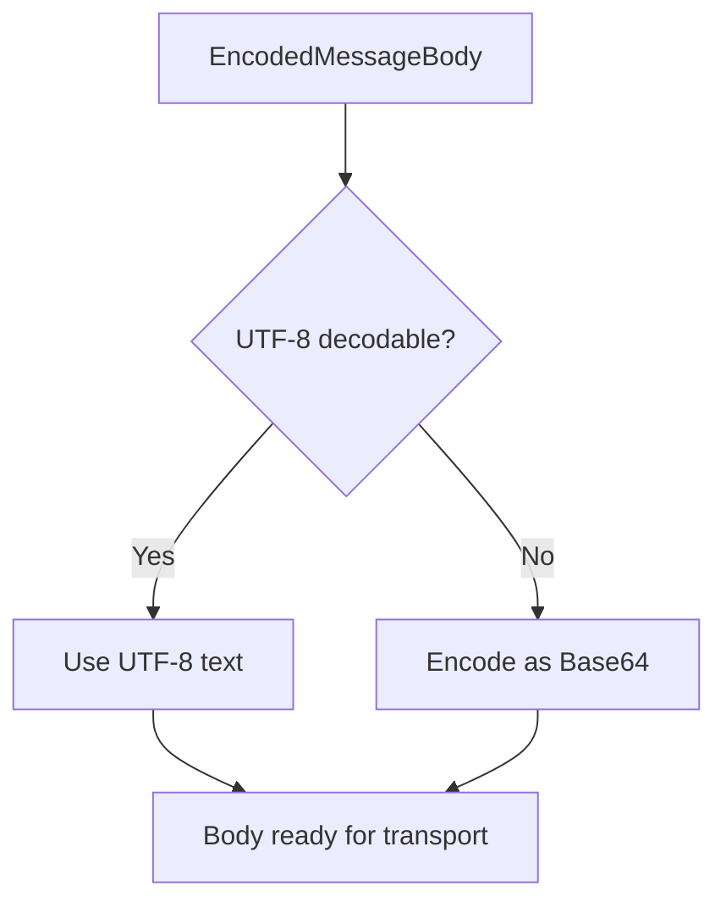

**Diagram sources**
- [utils.rs:66-81](file://src-tauri/src/plugins/mq/utils.rs#L66-L81)
- [utils.rs:57-64](file://src-tauri/src/plugins/mq/utils.rs#L57-L64)
- [utils.rs:39-55](file://src-tauri/src/plugins/mq/utils.rs#L39-L55)

**Section sources**
- [types.ts:44](file://src/plugins/mq-client/types.ts#L44)
- [utils.rs:66-81](file://src-tauri/src/plugins/mq/utils.rs#L66-L81)
- [utils.rs:39-55](file://src-tauri/src/plugins/mq/utils.rs#L39-L55)

### Consumer/Producer Operations
- Kafka produce: Builds a FutureRecord with optional key/partition and sends with a timeout.
- Kafka consume preview: Subscribes or assigns partitions, polls with deadlines, and collects up to the requested limit.
- RabbitMQ publish: Validates routing key/queue and publishes via basic publish.
- RabbitMQ consume preview: Polls basic.get until limit or timeout, optionally acking or requeuing.

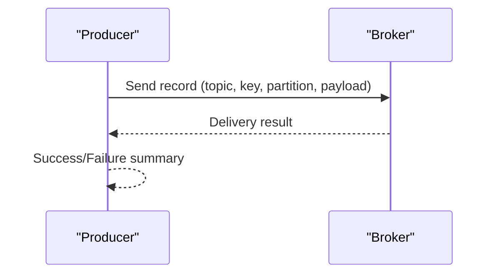

**Diagram sources**
- [kafka.rs:154-176](file://src-tauri/src/plugins/mq/kafka.rs#L154-L176)
- [rabbitmq.rs:142-165](file://src-tauri/src/plugins/mq/rabbitmq.rs#L142-L165)

**Section sources**
- [kafka.rs:148-176](file://src-tauri/src/plugins/mq/kafka.rs#L148-L176)
- [rabbitmq.rs:136-165](file://src-tauri/src/plugins/mq/rabbitmq.rs#L136-L165)

## Dependency Analysis
- Frontend depends on Ant Design UI components and Zustand for state.
- Store actions depend on Tauri commands for all operations.
- Backend commands depend on SQLite for persistence and protocol libraries for integration.
- Protocol handlers encapsulate broker-specific logic and are invoked conditionally by broker type.

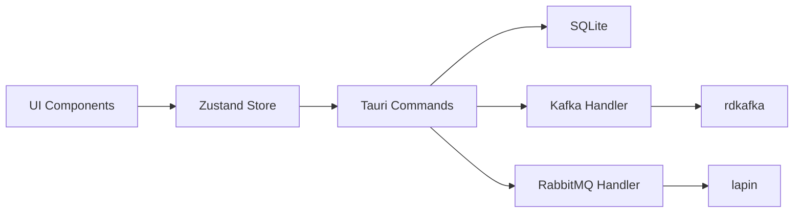

**Diagram sources**
- [mq-client.ts:63-102](file://src/plugins/mq-client/store/mq-client.ts#L63-L102)
- [commands.rs:152-207](file://src-tauri/src/plugins/mq/commands.rs#L152-L207)
- [kafka.rs:3-8](file://src-tauri/src/plugins/mq/kafka.rs#L3-L8)
- [rabbitmq.rs:3-6](file://src-tauri/src/plugins/mq/rabbitmq.rs#L3-L6)

**Section sources**
- [commands.rs:152-207](file://src-tauri/src/plugins/mq/commands.rs#L152-L207)

## Performance Considerations
- Connection timeouts: Configure connectTimeout to balance responsiveness and reliability.
- Consume previews: Limit message counts and set reasonable timeouts to avoid long-running operations.
- Kafka auto-commit disabled: Prevents accidental offset commits during preview.
- History size: Use filters and limits to manage history growth.
- Binary payloads: Prefer Base64 encoding for non-text payloads to preserve content.

[No sources needed since this section provides general guidance]

## Troubleshooting Guide
Common issues and resolutions:
- Connection failures:
  - Verify broker URLs, credentials, and network reachability.
  - Use test connection to see stage-by-stage diagnostics.
- RabbitMQ browsing limitations:
  - Management URL must be configured; otherwise browsing is limited.
- Kafka preview does not commit offsets:
  - Expected behavior; preview is read-only.
- Sensitive data exposure:
  - History payloads are redacted; review saved templates carefully.
- Replay publishes:
  - Use the History view to replay successful publish operations.

**Section sources**
- [commands.rs:152-160](file://src-tauri/src/plugins/mq/commands.rs#L152-L160)
- [rabbitmq.rs:88-95](file://src-tauri/src/plugins/mq/rabbitmq.rs#L88-L95)
- [utils.rs:39-55](file://src-tauri/src/plugins/mq/utils.rs#L39-L55)
- [HistoryView.tsx:19-22](file://src/plugins/mq-client/views/HistoryView.tsx#L19-L22)

## Conclusion
The MQ client plugin provides a unified interface for managing and monitoring Kafka and RabbitMQ. It offers robust connection management, resource browsing, real-time message inspection, and comprehensive history tracking. With protocol-specific handlers, secure credential storage, and flexible templates, it supports efficient development and operational workflows for message queue systems.

[No sources needed since this section summarizes without analyzing specific files]

## Appendices

### Practical Examples

- Connecting to a broker:
  - Open Connections view, select broker type, fill hosts and credentials, and click Test to validate connectivity.
  - On success, click Connect to enter the Browser view.

- Browsing topics/channels:
  - After connecting, refresh the Browser view to list Kafka topics and partitions or RabbitMQ queues/exchanges.

- Sending a test message:
  - Navigate to Message Studio, choose Publish/Produce, fill target and body, and click the action button.
  - Review the result summary and raw JSON in the Result panel.

- Monitoring message flow:
  - Use Preview Consume to fetch recent messages with configurable limits and timeouts.
  - Inspect headers, partition/offset metadata, and redelivery flags.

- Managing history:
  - Filter history by broker type, connection, or status.
  - Replay a publish operation using the saved request JSON.

**Section sources**
- [ConnectionsView.tsx:36-53](file://src/plugins/mq-client/views/ConnectionsView.tsx#L36-L53)
- [BrowserView.tsx:18-21](file://src/plugins/mq-client/views/BrowserView.tsx#L18-L21)
- [MessageStudio.tsx:70-99](file://src/plugins/mq-client/views/MessageStudio.tsx#L70-L99)
- [HistoryView.tsx:24-35](file://src/plugins/mq-client/views/HistoryView.tsx#L24-L35)