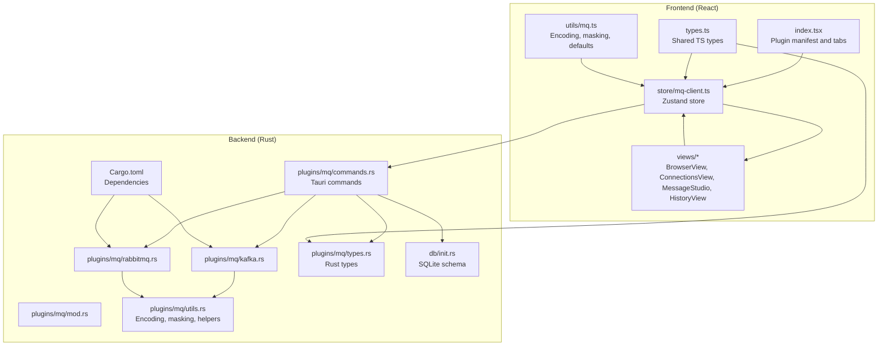
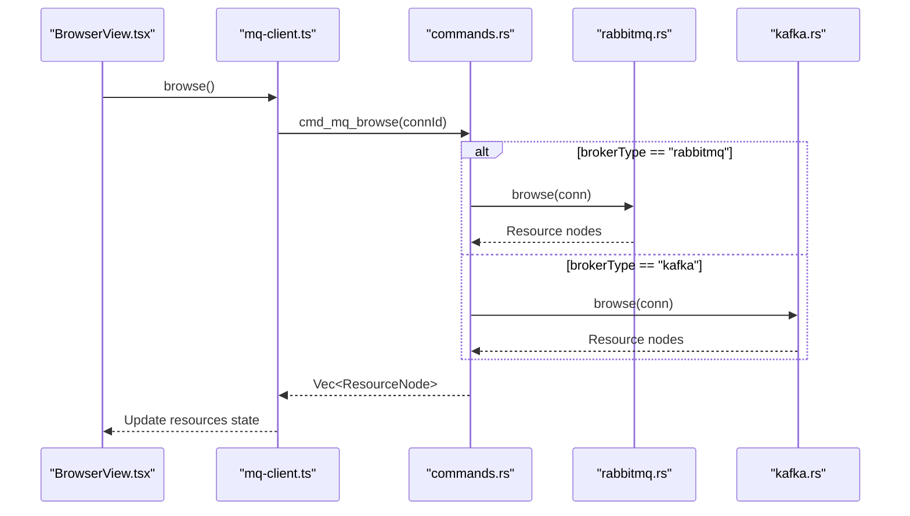
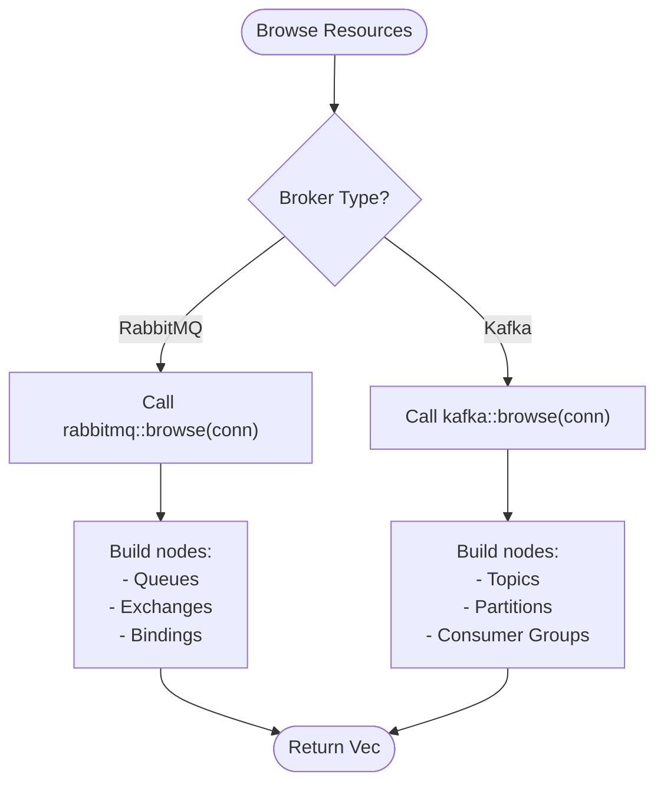
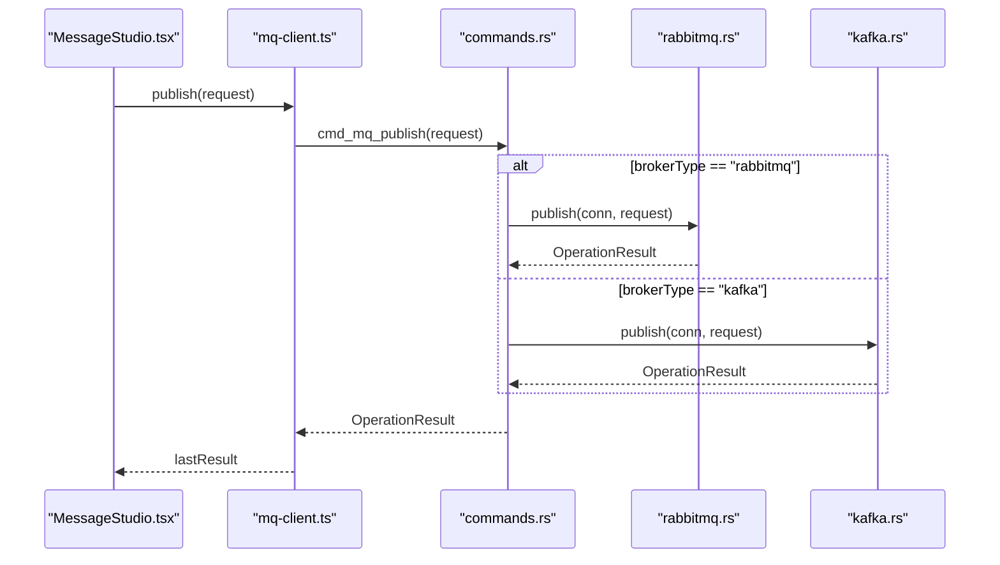
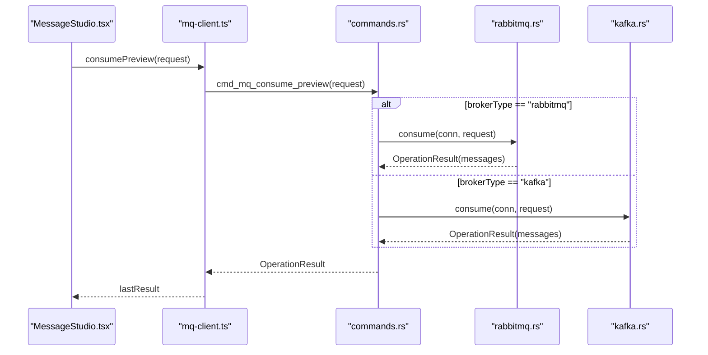
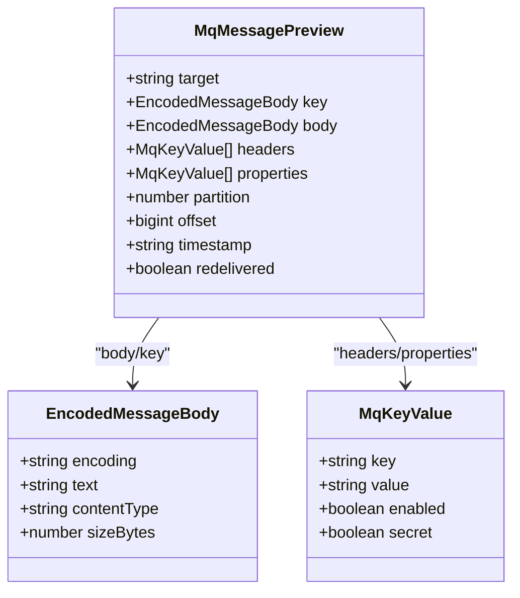
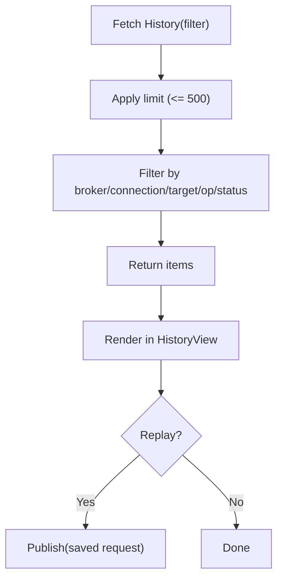
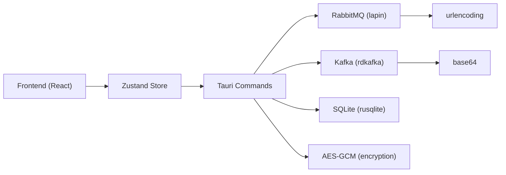

# Message Browser

<cite>
**Referenced Files in This Document**
- [index.tsx](file://src/plugins/mq-client/index.tsx)
- [types.ts](file://src/plugins/mq-client/types.ts)
- [mq-client.ts](file://src/plugins/mq-client/store/mq-client.ts)
- [mq.ts](file://src/plugins/mq-client/utils/mq.ts)
- [BrowserView.tsx](file://src/plugins/mq-client/views/BrowserView.tsx)
- [ConnectionsView.tsx](file://src/plugins/mq-client/views/ConnectionsView.tsx)
- [MessageStudio.tsx](file://src/plugins/mq-client/views/MessageStudio.tsx)
- [HistoryView.tsx](file://src/plugins/mq-client/views/HistoryView.tsx)
- [mod.rs](file://src-tauri/src/plugins/mq/mod.rs)
- [commands.rs](file://src-tauri/src/plugins/mq/commands.rs)
- [kafka.rs](file://src-tauri/src/plugins/mq/kafka.rs)
- [rabbitmq.rs](file://src-tauri/src/plugins/mq/rabbitmq.rs)
- [types.rs](file://src-tauri/src/plugins/mq/types.rs)
- [utils.rs](file://src-tauri/src/plugins/mq/utils.rs)
- [init.rs](file://src-tauri/src/db/init.rs)
- [Cargo.toml](file://src-tauri/Cargo.toml)
</cite>

## Table of Contents
1. [Introduction](#introduction)
2. [Project Structure](#project-structure)
3. [Core Components](#core-components)
4. [Architecture Overview](#architecture-overview)
5. [Detailed Component Analysis](#detailed-component-analysis)
6. [Dependency Analysis](#dependency-analysis)
7. [Performance Considerations](#performance-considerations)
8. [Troubleshooting Guide](#troubleshooting-guide)
9. [Conclusion](#conclusion)
10. [Appendices](#appendices)

## Introduction
This document describes the MQ client message browser functionality for browsing and interacting with message brokers. It covers how to explore broker resources (RabbitMQ exchanges/queues and Kafka topics/partitions/consumer groups), publish/produce messages, preview consume messages, inspect message metadata and payloads, manage history, and understand differences between Kafka and RabbitMQ semantics. It also documents integration with message formats and encodings, offset management, and real-time monitoring considerations.

## Project Structure
The MQ client is implemented as a Tauri plugin with a React frontend and a Rust backend. The frontend provides:
- A tabbed UI with Connections, Browser, Message Studio, and History views
- A store managing state and invoking backend commands
- Utilities for encoding/decoding message bodies and masking sensitive values

The backend exposes Tauri commands for:
- Managing connections and credentials
- Browsing broker resources
- Publishing/producing messages
- Preview consuming messages
- Maintaining history and saved templates

**Diagram sources**
- [index.tsx:1-38](file://src/plugins/mq-client/index.tsx#L1-L38)
- [mq-client.ts:1-103](file://src/plugins/mq-client/store/mq-client.ts#L1-L103)
- [BrowserView.tsx:1-23](file://src/plugins/mq-client/views/BrowserView.tsx#L1-L23)
- [ConnectionsView.tsx:1-92](file://src/plugins/mq-client/views/ConnectionsView.tsx#L1-L92)
- [MessageStudio.tsx:1-99](file://src/plugins/mq-client/views/MessageStudio.tsx#L1-L99)
- [HistoryView.tsx:1-38](file://src/plugins/mq-client/views/HistoryView.tsx#L1-L38)
- [types.ts:1-90](file://src/plugins/mq-client/types.ts#L1-L90)
- [mq.ts:1-20](file://src/plugins/mq-client/utils/mq.ts#L1-L20)
- [mod.rs:1-6](file://src-tauri/src/plugins/mq/mod.rs#L1-L6)
- [commands.rs:1-276](file://src-tauri/src/plugins/mq/commands.rs#L1-L276)
- [kafka.rs:1-243](file://src-tauri/src/plugins/mq/kafka.rs#L1-L243)
- [rabbitmq.rs:1-211](file://src-tauri/src/plugins/mq/rabbitmq.rs#L1-L211)
- [types.rs:1-213](file://src-tauri/src/plugins/mq/types.rs#L1-L213)
- [utils.rs:1-103](file://src-tauri/src/plugins/mq/utils.rs#L1-L103)
- [init.rs:238-278](file://src-tauri/src/db/init.rs#L238-L278)
- [Cargo.toml:46-48](file://src-tauri/Cargo.toml#L46-L48)

**Section sources**
- [index.tsx:1-38](file://src/plugins/mq-client/index.tsx#L1-L38)
- [mq-client.ts:1-103](file://src/plugins/mq-client/store/mq-client.ts#L1-L103)
- [types.ts:1-90](file://src/plugins/mq-client/types.ts#L1-L90)
- [mq.ts:1-20](file://src/plugins/mq-client/utils/mq.ts#L1-L20)
- [BrowserView.tsx:1-23](file://src/plugins/mq-client/views/BrowserView.tsx#L1-L23)
- [ConnectionsView.tsx:1-92](file://src/plugins/mq-client/views/ConnectionsView.tsx#L1-L92)
- [MessageStudio.tsx:1-99](file://src/plugins/mq-client/views/MessageStudio.tsx#L1-L99)
- [HistoryView.tsx:1-38](file://src/plugins/mq-client/views/HistoryView.tsx#L1-L38)
- [commands.rs:1-276](file://src-tauri/src/plugins/mq/commands.rs#L1-L276)
- [kafka.rs:1-243](file://src-tauri/src/plugins/mq/kafka.rs#L1-L243)
- [rabbitmq.rs:1-211](file://src-tauri/src/plugins/mq/rabbitmq.rs#L1-L211)
- [types.rs:1-213](file://src-tauri/src/plugins/mq/types.rs#L1-L213)
- [utils.rs:1-103](file://src-tauri/src/plugins/mq/utils.rs#L1-L103)
- [init.rs:238-278](file://src-tauri/src/db/init.rs#L238-L278)
- [Cargo.toml:46-48](file://src-tauri/Cargo.toml#L46-L48)

## Core Components
- Broker types and shared types define the contract for connections, requests, previews, and history items.
- Store orchestrates UI actions and invokes backend commands via Tauri.
- Views implement the user-facing screens for browsing, connecting, publishing/producing, and reviewing history.
- Backend commands route operations to broker-specific implementations and persist history.

Key capabilities:
- Browse resources: RabbitMQ (exchanges, queues, bindings) and Kafka (topics, partitions, consumer groups)
- Publish/Produce messages with headers and properties
- Preview consume messages with configurable limits and timeouts
- Inspect message metadata (headers, properties, partition/offset) and payload (UTF-8 or Base64)
- Manage history and saved templates
- Mask sensitive values in UI and logs

**Section sources**
- [types.ts:1-90](file://src/plugins/mq-client/types.ts#L1-L90)
- [mq-client.ts:19-102](file://src/plugins/mq-client/store/mq-client.ts#L19-L102)
- [BrowserView.tsx:11-22](file://src/plugins/mq-client/views/BrowserView.tsx#L11-L22)
- [MessageStudio.tsx:15-99](file://src/plugins/mq-client/views/MessageStudio.tsx#L15-L99)
- [HistoryView.tsx:8-38](file://src/plugins/mq-client/views/HistoryView.tsx#L8-L38)
- [commands.rs:162-207](file://src-tauri/src/plugins/mq/commands.rs#L162-L207)
- [kafka.rs:74-146](file://src-tauri/src/plugins/mq/kafka.rs#L74-L146)
- [rabbitmq.rs:123-134](file://src-tauri/src/plugins/mq/rabbitmq.rs#L123-L134)

## Architecture Overview
The MQ client follows a layered architecture:
- Frontend (React) renders UI and manages state
- Store (Zustand) encapsulates async operations and invokes Tauri commands
- Backend (Rust) implements broker integrations and persistence
- SQLite stores connections, history, and saved templates

**Diagram sources**
- [BrowserView.tsx:11-22](file://src/plugins/mq-client/views/BrowserView.tsx#L11-L22)
- [mq-client.ts:83](file://src/plugins/mq-client/store/mq-client.ts#L83)
- [commands.rs:162-170](file://src-tauri/src/plugins/mq/commands.rs#L162-L170)
- [rabbitmq.rs:123-134](file://src-tauri/src/plugins/mq/rabbitmq.rs#L123-L134)
- [kafka.rs:74-146](file://src-tauri/src/plugins/mq/kafka.rs#L74-L146)

## Detailed Component Analysis

### Resource Browsing (RabbitMQ and Kafka)
- RabbitMQ browsing requires the Management Plugin; it lists queues, exchanges, and bindings via the Management API.
- Kafka browsing enumerates brokers, topics, partitions, and consumer groups using client metadata and group listing APIs. Consumer group offset details are read-only and not modified.

**Diagram sources**
- [commands.rs:162-170](file://src-tauri/src/plugins/mq/commands.rs#L162-L170)
- [rabbitmq.rs:123-134](file://src-tauri/src/plugins/mq/rabbitmq.rs#L123-L134)
- [kafka.rs:74-146](file://src-tauri/src/plugins/mq/kafka.rs#L74-L146)

**Section sources**
- [BrowserView.tsx:11-22](file://src/plugins/mq-client/views/BrowserView.tsx#L11-L22)
- [commands.rs:162-170](file://src-tauri/src/plugins/mq/commands.rs#L162-L170)
- [rabbitmq.rs:31-37](file://src-tauri/src/plugins/mq/rabbitmq.rs#L31-L37)
- [kafka.rs:118-139](file://src-tauri/src/plugins/mq/kafka.rs#L118-L139)

### Message Publishing and Producing
- RabbitMQ publish requires a routing key or queue name; it publishes to an exchange with the provided routing key.
- Kafka produce targets a topic, optionally with a key and partition; it sends records using the configured client settings.

**Diagram sources**
- [MessageStudio.tsx:33-49](file://src/plugins/mq-client/views/MessageStudio.tsx#L33-L49)
- [mq-client.ts:84-89](file://src/plugins/mq-client/store/mq-client.ts#L84-L89)
- [commands.rs:182-193](file://src-tauri/src/plugins/mq/commands.rs#L182-L193)
- [rabbitmq.rs:136-165](file://src-tauri/src/plugins/mq/rabbitmq.rs#L136-L165)
- [kafka.rs:148-176](file://src-tauri/src/plugins/mq/kafka.rs#L148-L176)

**Section sources**
- [MessageStudio.tsx:33-49](file://src/plugins/mq-client/views/MessageStudio.tsx#L33-L49)
- [commands.rs:182-193](file://src-tauri/src/plugins/mq/commands.rs#L182-L193)
- [rabbitmq.rs:146-149](file://src-tauri/src/plugins/mq/rabbitmq.rs#L146-L149)
- [kafka.rs:157-167](file://src-tauri/src/plugins/mq/kafka.rs#L157-L167)

### Message Preview Consumption
- RabbitMQ preview consumes up to a configured limit with a timeout, optionally acknowledging or requeuing messages.
- Kafka preview creates a temporary consumer group, subscribes to a topic or assigns a specific partition+offset, polls until limit or timeout, and returns previewed messages without committing offsets.

**Diagram sources**
- [MessageStudio.tsx:51-56](file://src/plugins/mq-client/views/MessageStudio.tsx#L51-L56)
- [mq-client.ts:90-95](file://src/plugins/mq-client/store/mq-client.ts#L90-L95)
- [commands.rs:195-207](file://src-tauri/src/plugins/mq/commands.rs#L195-L207)
- [rabbitmq.rs:167-210](file://src-tauri/src/plugins/mq/rabbitmq.rs#L167-L210)
- [kafka.rs:178-242](file://src-tauri/src/plugins/mq/kafka.rs#L178-L242)

**Section sources**
- [MessageStudio.tsx:51-56](file://src/plugins/mq-client/views/MessageStudio.tsx#L51-L56)
- [commands.rs:195-207](file://src-tauri/src/plugins/mq/commands.rs#L195-L207)
- [rabbitmq.rs:167-210](file://src-tauri/src/plugins/mq/rabbitmq.rs#L167-L210)
- [kafka.rs:178-242](file://src-tauri/src/plugins/mq/kafka.rs#L178-L242)

### Message Inspection Interface
- The last operation result displays a structured summary and raw JSON for request and result.
- Message previews include target, optional key, body with encoding and content type, headers, properties, and broker-specific fields (partition/offset for Kafka, redelivery flag for RabbitMQ).

**Diagram sources**
- [types.ts:72-82](file://src/plugins/mq-client/types.ts#L72-L82)
- [types.ts:44](file://src/plugins/mq-client/types.ts#L44)
- [types.ts:43](file://src/plugins/mq-client/types.ts#L43)

**Section sources**
- [MessageStudio.tsx:91-96](file://src/plugins/mq-client/views/MessageStudio.tsx#L91-L96)
- [types.ts:72-82](file://src/plugins/mq-client/types.ts#L72-L82)
- [rabbitmq.rs:180-191](file://src-tauri/src/plugins/mq/rabbitmq.rs#L180-L191)
- [kafka.rs:221-231](file://src-tauri/src/plugins/mq/kafka.rs#L221-L231)

### Message History and Replay
- History items capture operation type, target, status, duration, and sanitized request/result JSON.
- Filtering supports broker type, connection, target substring, operation type, and status with a capped limit.
- Replay is supported for publish operations by re-executing the stored request.

**Diagram sources**
- [commands.rs:214-229](file://src-tauri/src/plugins/mq/commands.rs#L214-L229)
- [HistoryView.tsx:19-22](file://src/plugins/mq-client/views/HistoryView.tsx#L19-L22)

**Section sources**
- [HistoryView.tsx:8-38](file://src/plugins/mq-client/views/HistoryView.tsx#L8-L38)
- [commands.rs:214-229](file://src-tauri/src/plugins/mq/commands.rs#L214-L229)

### Saved Templates
- Users can save current publish configurations as templates scoped by broker type.
- Templates can be applied to quickly populate the publish form.

**Section sources**
- [MessageStudio.tsx:58-68](file://src/plugins/mq-client/views/MessageStudio.tsx#L58-L68)
- [commands.rs:250-258](file://src-tauri/src/plugins/mq/commands.rs#L250-L258)

### Offset Management and Real-Time Monitoring
- Kafka preview does not commit offsets; it uses a temporary consumer group and assignment semantics to read without affecting live consumers.
- RabbitMQ preview acknowledges or requeues messages based on ack mode; it does not commit offsets.
- Real-time monitoring is not implemented as a continuous stream; consumers poll until limits or timeouts.

**Section sources**
- [kafka.rs:186-200](file://src-tauri/src/plugins/mq/kafka.rs#L186-L200)
- [kafka.rs:238-241](file://src-tauri/src/plugins/mq/kafka.rs#L238-L241)
- [rabbitmq.rs:192-196](file://src-tauri/src/plugins/mq/rabbitmq.rs#L192-L196)
- [rabbitmq.rs:206-209](file://src-tauri/src/plugins/mq/rabbitmq.rs#L206-L209)

### Integration with Message Formats and Encodings
- Payloads are encoded as UTF-8 when valid UTF-8; otherwise Base64. Decoding supports Base64 and raw text.
- Content-Type is preserved when available.
- Sensitive values in JSON are redacted in stored history.

**Section sources**
- [utils.rs:66-81](file://src-tauri/src/plugins/mq/utils.rs#L66-L81)
- [utils.rs:57-64](file://src-tauri/src/plugins/mq/utils.rs#L57-L64)
- [utils.rs:39-55](file://src-tauri/src/plugins/mq/utils.rs#L39-L55)
- [types.ts:44](file://src/plugins/mq-client/types.ts#L44)

## Dependency Analysis
- Frontend depends on Ant Design components and Zustand for state.
- Backend integrates with lapin for RabbitMQ and rdkafka for Kafka.
- Persistence uses SQLite with rusqlite and encryption for secrets.

**Diagram sources**
- [Cargo.toml:46-48](file://src-tauri/Cargo.toml#L46-L48)
- [Cargo.toml:29](file://src-tauri/Cargo.toml#L29)
- [Cargo.toml:47](file://src-tauri/Cargo.toml#L47)
- [Cargo.toml:48](file://src-tauri/Cargo.toml#L48)
- [Cargo.toml:31](file://src-tauri/Cargo.toml#L31)
- [Cargo.toml:37](file://src-tauri/Cargo.toml#L37)

**Section sources**
- [Cargo.toml:20-49](file://src-tauri/Cargo.toml#L20-L49)

## Performance Considerations
- Consume preview limits and timeouts bound polling duration and message count to avoid long waits.
- Kafka preview avoids committing offsets by using a temporary consumer group and assignment semantics.
- RabbitMQ preview acknowledges or requeues to prevent message loss during inspection.

[No sources needed since this section provides general guidance]

## Troubleshooting Guide
Common issues and checks:
- RabbitMQ Management Plugin missing: browsing is limited; configure management URL and credentials.
- Authentication failures: verify AMQP URL, virtual host, and management credentials; SASL passwords for Kafka.
- Connection timeouts: adjust connect timeout and ensure broker accessibility.
- History redaction: sensitive fields are masked in stored JSON to protect secrets.

**Section sources**
- [rabbitmq.rs:31-37](file://src-tauri/src/plugins/mq/rabbitmq.rs#L31-L37)
- [rabbitmq.rs:88-95](file://src-tauri/src/plugins/mq/rabbitmq.rs#L88-L95)
- [utils.rs:39-55](file://src-tauri/src/plugins/mq/utils.rs#L39-L55)

## Conclusion
The MQ client provides a unified interface to browse and interact with RabbitMQ and Kafka. It supports publishing/producing, preview consuming, inspecting message metadata and payloads, managing history, and saving templates. Kafka and RabbitMQ differ in resource browsing, offset handling, and acknowledgment semantics, which the client reflects in its UI and backend implementations.

[No sources needed since this section summarizes without analyzing specific files]

## Appendices

### Example Workflows

- Navigate RabbitMQ architecture
  - Connect using AMQP URL and Management URL
  - Browse queues, exchanges, and bindings
  - Publish to an exchange with a routing key
  - Preview consume from a queue with ack/requeue behavior

- Navigate Kafka architecture
  - Connect using bootstrap servers and SASL configuration
  - Browse topics, partitions, and consumer groups
  - Produce to a topic with optional key and partition
  - Preview consume from a topic or partition with offset mode

- Search for specific messages
  - Use HistoryView filters by broker type, connection, target substring, operation type, and status
  - Replay publish operations from history

- Analyze message flow patterns
  - Inspect headers and properties in message previews
  - Compare partition/offset for Kafka vs. queue routing for RabbitMQ

- Understand offset management
  - Kafka preview does not commit offsets; use specific offset mode for targeted reads
  - RabbitMQ preview can acknowledge or requeue messages

- Real-time monitoring
  - Not implemented as a persistent stream; rely on preview consume with appropriate limits and timeouts

**Section sources**
- [ConnectionsView.tsx:68-87](file://src/plugins/mq-client/views/ConnectionsView.tsx#L68-L87)
- [BrowserView.tsx:18-20](file://src/plugins/mq-client/views/BrowserView.tsx#L18-L20)
- [MessageStudio.tsx:73-89](file://src/plugins/mq-client/views/MessageStudio.tsx#L73-L89)
- [HistoryView.tsx:17-35](file://src/plugins/mq-client/views/HistoryView.tsx#L17-L35)
- [kafka.rs:186-200](file://src-tauri/src/plugins/mq/kafka.rs#L186-L200)
- [rabbitmq.rs:192-196](file://src-tauri/src/plugins/mq/rabbitmq.rs#L192-L196)