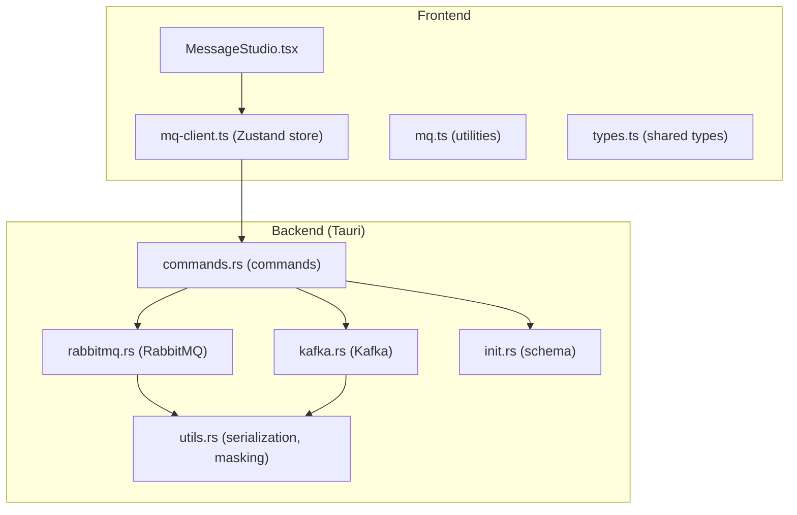
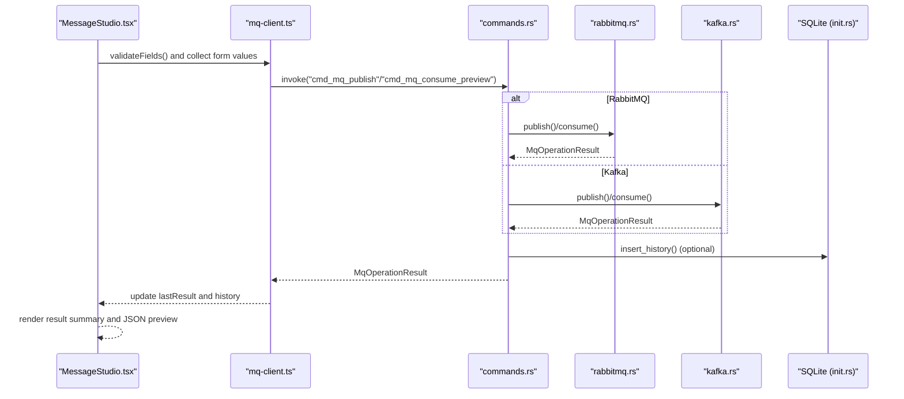
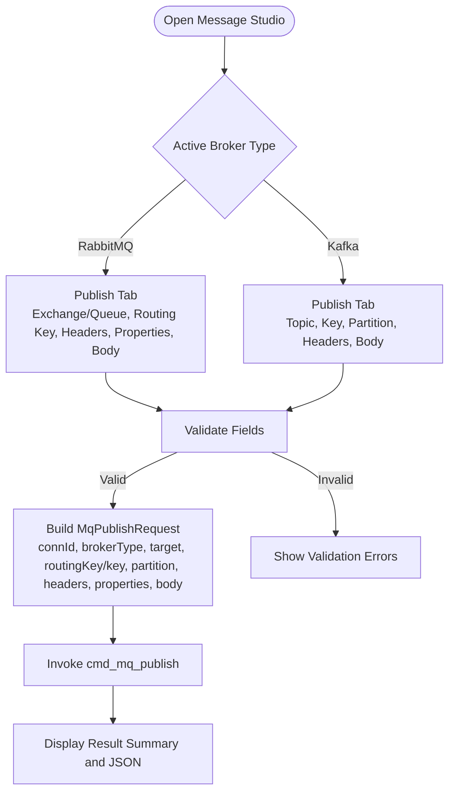
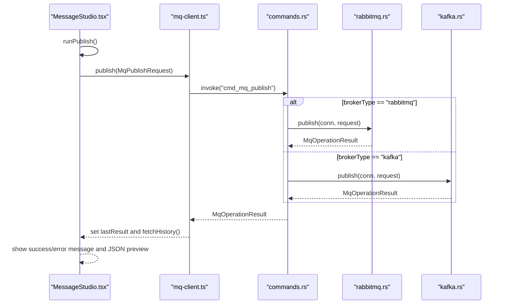
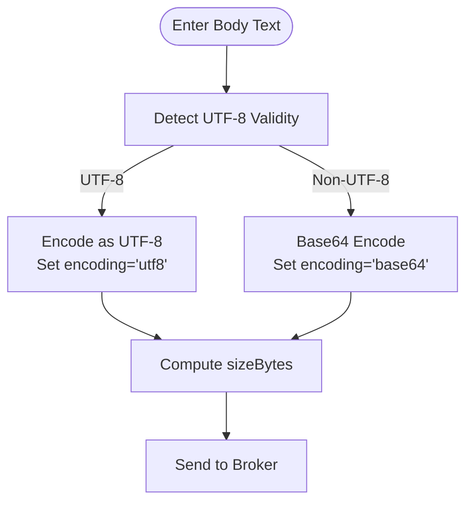
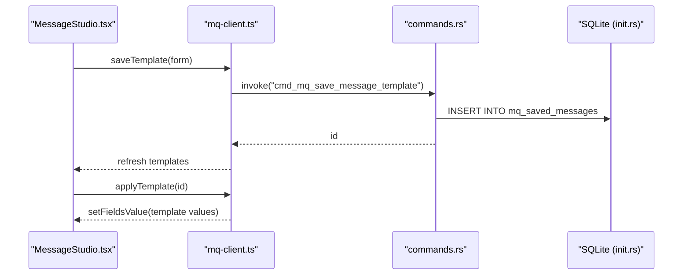
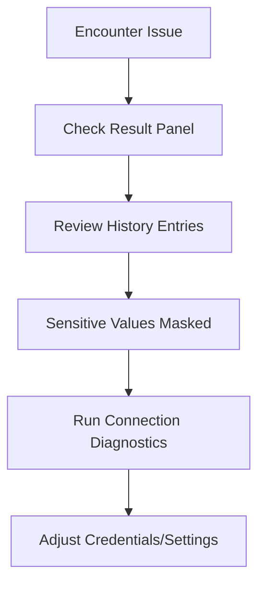
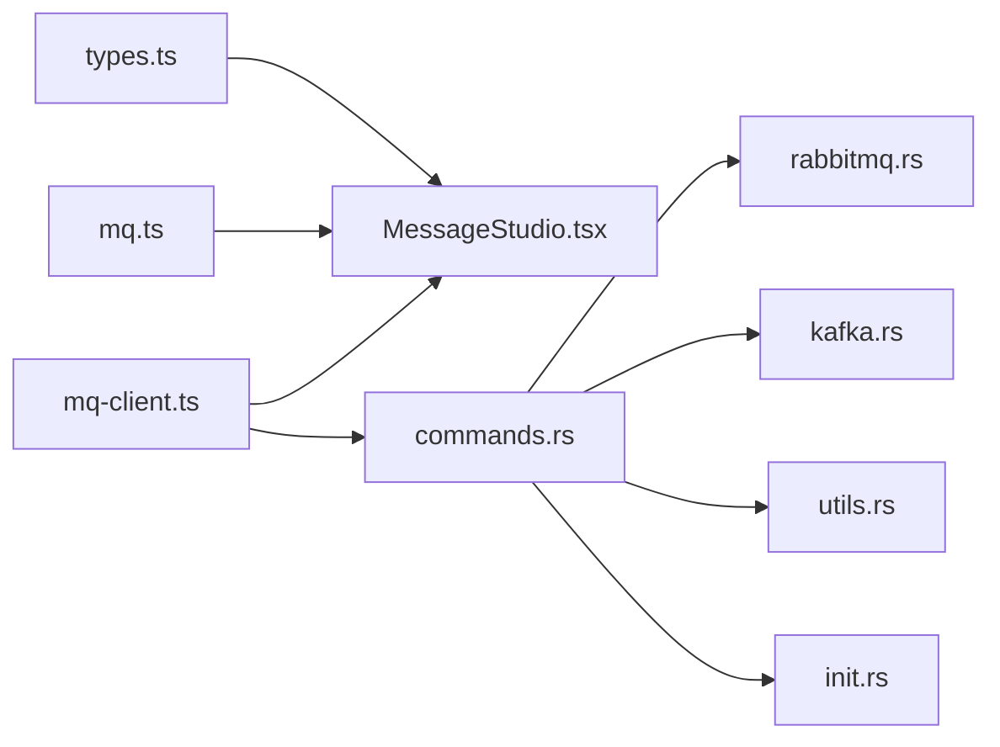

# Message Studio

<cite>
**Referenced Files in This Document**
- [MessageStudio.tsx](file://src/plugins/mq-client/views/MessageStudio.tsx)
- [mq-client.ts](file://src/plugins/mq-client/store/mq-client.ts)
- [mq.ts](file://src/plugins/mq-client/utils/mq.ts)
- [types.ts](file://src/plugins/mq-client/types.ts)
- [commands.rs](file://src-tauri/src/plugins/mq/commands.rs)
- [rabbitmq.rs](file://src-tauri/src/plugins/mq/rabbitmq.rs)
- [kafka.rs](file://src-tauri/src/plugins/mq/kafka.rs)
- [utils.rs](file://src-tauri/src/plugins/mq/utils.rs)
- [init.rs](file://src-tauri/src/db/init.rs)
- [mq-client.test.ts](file://tests/app/mq-client.test.ts)
</cite>

## Table of Contents
1. [Introduction](#introduction)
2. [Project Structure](#project-structure)
3. [Core Components](#core-components)
4. [Architecture Overview](#architecture-overview)
5. [Detailed Component Analysis](#detailed-component-analysis)
6. [Dependency Analysis](#dependency-analysis)
7. [Performance Considerations](#performance-considerations)
8. [Troubleshooting Guide](#troubleshooting-guide)
9. [Conclusion](#conclusion)
10. [Appendices](#appendices)

## Introduction
Message Studio is a comprehensive tool within the MQ client plugin that enables developers to compose, validate, send, and preview messages for both RabbitMQ and Apache Kafka. It provides a unified interface for:
- Composing message payloads with support for JSON, XML, and plain text
- Configuring headers and properties
- Setting routing keys (RabbitMQ) or keys/partitions (Kafka)
- Saving and applying reusable message templates
- Previewing consumed messages without committing offsets
- Tracking operation history and results

The tool integrates frontend React components with a Tauri backend that communicates with message brokers, manages secure credentials, persists history and templates, and ensures safe handling of sensitive data.

## Project Structure
Message Studio spans both the frontend React application and the Tauri backend Rust implementation. The frontend handles UI interactions, form validation, and result presentation, while the backend performs broker operations, credential management, and persistence.

**Diagram sources**
- [MessageStudio.tsx:15-99](file://src/plugins/mq-client/views/MessageStudio.tsx#L15-L99)
- [mq-client.ts:52-102](file://src/plugins/mq-client/store/mq-client.ts#L52-L102)
- [commands.rs:182-207](file://src-tauri/src/plugins/mq/commands.rs#L182-L207)
- [rabbitmq.rs:136-211](file://src-tauri/src/plugins/mq/rabbitmq.rs#L136-L211)
- [kafka.rs:148-243](file://src-tauri/src/plugins/mq/kafka.rs#L148-L243)
- [utils.rs:57-81](file://src-tauri/src/plugins/mq/utils.rs#L57-L81)
- [init.rs:268-278](file://src-tauri/src/db/init.rs#L268-L278)

**Section sources**
- [MessageStudio.tsx:15-99](file://src/plugins/mq-client/views/MessageStudio.tsx#L15-L99)
- [mq-client.ts:52-102](file://src/plugins/mq-client/store/mq-client.ts#L52-L102)
- [commands.rs:182-207](file://src-tauri/src/plugins/mq/commands.rs#L182-L207)

## Core Components
- MessageStudio view: Provides the primary UI for publishing/consuming messages, template management, and result display.
- Zustand store: Manages state for connections, templates, history, and last operation results; exposes async actions that invoke backend commands.
- Utilities: Frontend helpers for parsing key-value pairs, encoding message bodies, masking sensitive values, and default connection presets.
- Backend commands: Orchestrates broker-specific operations, history persistence, template CRUD, and diagnostics.
- Broker implementations: RabbitMQ and Kafka publishers/consumers with distinct routing semantics and preview modes.
- Serialization utilities: Decode/encode message bodies and redact sensitive data in logs/history.

**Section sources**
- [MessageStudio.tsx:15-99](file://src/plugins/mq-client/views/MessageStudio.tsx#L15-L99)
- [mq-client.ts:52-102](file://src/plugins/mq-client/store/mq-client.ts#L52-L102)
- [mq.ts:3-19](file://src/plugins/mq-client/utils/mq.ts#L3-L19)
- [commands.rs:182-207](file://src-tauri/src/plugins/mq/commands.rs#L182-L207)
- [rabbitmq.rs:136-211](file://src-tauri/src/plugins/mq/rabbitmq.rs#L136-L211)
- [kafka.rs:148-243](file://src-tauri/src/plugins/mq/kafka.rs#L148-L243)
- [utils.rs:57-81](file://src-tauri/src/plugins/mq/utils.rs#L57-L81)

## Architecture Overview
Message Studio follows a layered architecture:
- UI Layer: React components with Ant Design forms and tabs.
- State Layer: Zustand store orchestrating async operations via Tauri commands.
- Command Layer: Tauri commands invoking broker-specific implementations.
- Persistence Layer: SQLite-backed history and templates.
- Serialization/Masking Layer: Ensures safe handling of sensitive data and message bodies.

**Diagram sources**
- [MessageStudio.tsx:33-56](file://src/plugins/mq-client/views/MessageStudio.tsx#L33-L56)
- [mq-client.ts:84-95](file://src/plugins/mq-client/store/mq-client.ts#L84-L95)
- [commands.rs:182-207](file://src-tauri/src/plugins/mq/commands.rs#L182-L207)
- [rabbitmq.rs:136-211](file://src-tauri/src/plugins/mq/rabbitmq.rs#L136-L211)
- [kafka.rs:148-243](file://src-tauri/src/plugins/mq/kafka.rs#L148-L243)
- [init.rs:255-266](file://src-tauri/src/db/init.rs#L255-L266)

## Detailed Component Analysis

### Message Composition Interface
MessageStudio provides a tabbed interface for publishing and previewing messages:
- Publish tab (RabbitMQ/Publish or Kafka/Produce):
  - Target: Exchange (RabbitMQ) or Topic (Kafka)
  - Routing key (RabbitMQ) or Key/Partition (Kafka)
  - Content-Type header
  - Headers and Properties (RabbitMQ)
  - Body editor with multi-line support
  - Save Template and Apply Template controls
- Preview Consume tab:
  - Target: Queue (RabbitMQ) or Topic (Kafka)
  - Ack mode (RabbitMQ) or Offset mode/Partition/Offset (Kafka)
  - Limit and Timeout settings
  - Preview button to fetch messages without committing offsets

Key behaviors:
- Validation: Forms require specific fields depending on broker type (e.g., Kafka topic is mandatory).
- Pair parsing: Header and property inputs accept newline-separated "key: value" pairs.
- Body encoding: The frontend encodes UTF-8 text bodies with size calculation; the backend handles decoding and serialization.

**Diagram sources**
- [MessageStudio.tsx:70-89](file://src/plugins/mq-client/views/MessageStudio.tsx#L70-L89)
- [MessageStudio.tsx:33-49](file://src/plugins/mq-client/views/MessageStudio.tsx#L33-L49)
- [mq.ts:3-5](file://src/plugins/mq-client/utils/mq.ts#L3-L5)

**Section sources**
- [MessageStudio.tsx:70-89](file://src/plugins/mq-client/views/MessageStudio.tsx#L70-L89)
- [MessageStudio.tsx:8-13](file://src/plugins/mq-client/views/MessageStudio.tsx#L8-L13)
- [mq.ts:3-5](file://src/plugins/mq-client/utils/mq.ts#L3-L5)

### Message Sending Workflow
The publish flow is orchestrated by the frontend and backend:
- Frontend collects form values, parses key-value pairs, and constructs an MqPublishRequest.
- The store invokes the backend command to publish.
- The backend retrieves the active connection, delegates to the appropriate broker implementation, and optionally records history.

**Diagram sources**
- [MessageStudio.tsx:33-49](file://src/plugins/mq-client/views/MessageStudio.tsx#L33-L49)
- [mq-client.ts:84-89](file://src/plugins/mq-client/store/mq-client.ts#L84-L89)
- [commands.rs:182-193](file://src-tauri/src/plugins/mq/commands.rs#L182-L193)
- [rabbitmq.rs:136-165](file://src-tauri/src/plugins/mq/rabbitmq.rs#L136-L165)
- [kafka.rs:148-176](file://src-tauri/src/plugins/mq/kafka.rs#L148-L176)

**Section sources**
- [MessageStudio.tsx:33-49](file://src/plugins/mq-client/views/MessageStudio.tsx#L33-L49)
- [mq-client.ts:84-89](file://src/plugins/mq-client/store/mq-client.ts#L84-L89)
- [commands.rs:182-193](file://src-tauri/src/plugins/mq/commands.rs#L182-L193)

### Validation Processes
- Form validation: The frontend validates required fields based on broker type (e.g., Kafka requires a topic).
- Broker-specific constraints: RabbitMQ publish requires a routing key or queue; Kafka publish supports optional key and partition.
- Backend validation: The backend enforces broker-specific rules and returns structured errors.

Practical tips:
- For RabbitMQ, ensure either an exchange name or a routing key is provided; if using the default exchange, provide a routing key that corresponds to a queue.
- For Kafka, provide a topic; optionally set a key for keyed routing and a partition for deterministic placement.

**Section sources**
- [MessageStudio.tsx:74-75](file://src/plugins/mq-client/views/MessageStudio.tsx#L74-L75)
- [rabbitmq.rs:147-149](file://src-tauri/src/plugins/mq/rabbitmq.rs#L147-L149)
- [kafka.rs:157-163](file://src-tauri/src/plugins/mq/kafka.rs#L157-L163)

### Delivery Confirmation Mechanisms
- RabbitMQ: The publish operation uses basic publish and waits for publisher confirmations; the result indicates success or failure with a summary and duration.
- Kafka: The producer sends a FutureRecord and awaits completion within the configured timeout; the result reflects success or failure with payload size and timing.
- History: Both publish and consume operations optionally persist entries with request/result JSON and redacted secrets.

**Section sources**
- [rabbitmq.rs:150-156](file://src-tauri/src/plugins/mq/rabbitmq.rs#L150-L156)
- [kafka.rs:164-167](file://src-tauri/src/plugins/mq/kafka.rs#L164-L167)
- [commands.rs:189-192](file://src-tauri/src/plugins/mq/commands.rs#L189-L192)

### Integration with Message Formats and Serialization
- Content-Type: The frontend allows specifying Content-Type for the message body; the backend preserves it during serialization.
- Encoding: The frontend encodes UTF-8 text bodies and calculates byte length; the backend decodes and re-encodes as needed.
- Binary payloads: Non-UTF-8 payloads are base64-encoded; the backend detects binary content and encodes accordingly.
- Masking: Sensitive headers/properties are masked in UI and history.

**Diagram sources**
- [mq.ts:3-5](file://src/plugins/mq-client/utils/mq.ts#L3-L5)
- [utils.rs:66-81](file://src-tauri/src/plugins/mq/utils.rs#L66-L81)

**Section sources**
- [mq.ts:3-5](file://src/plugins/mq-client/utils/mq.ts#L3-L5)
- [utils.rs:57-81](file://src-tauri/src/plugins/mq/utils.rs#L57-L81)

### Message Template Management
- Save Template: Captures current publish form values (target, body, headers, properties) and persists them as a reusable template.
- Apply Template: Loads a saved template into the publish form, enabling quick reuse of common configurations.
- CRUD: Templates are stored in SQLite and can be listed, saved, and deleted.

**Diagram sources**
- [MessageStudio.tsx:58-68](file://src/plugins/mq-client/views/MessageStudio.tsx#L58-L68)
- [mq-client.ts:99-101](file://src/plugins/mq-client/store/mq-client.ts#L99-L101)
- [commands.rs:261-269](file://src-tauri/src/plugins/mq/commands.rs#L261-L269)
- [init.rs:268-278](file://src-tauri/src/db/init.rs#L268-L278)

**Section sources**
- [MessageStudio.tsx:58-68](file://src/plugins/mq-client/views/MessageStudio.tsx#L58-L68)
- [mq-client.ts:99-101](file://src/plugins/mq-client/store/mq-client.ts#L99-L101)
- [commands.rs:261-269](file://src-tauri/src/plugins/mq/commands.rs#L261-L269)

### Batch Sending Capabilities
- Current behavior: The publish flow sends a single message per invocation. There is no built-in batch send feature in the current implementation.
- Workaround: Users can save templates and iterate manually, or leverage external scripts to generate multiple publish requests.

**Section sources**
- [MessageStudio.tsx:33-49](file://src/plugins/mq-client/views/MessageStudio.tsx#L33-L49)
- [commands.rs:182-193](file://src-tauri/src/plugins/mq/commands.rs#L182-L193)

### Debugging Message Issues
- Result preview: The UI displays a formatted JSON preview of the last operation result, including status, summary, and duration.
- History: Operation history is persisted with redacted request/result JSON, enabling post-mortem analysis.
- Masking: Sensitive fields are masked in both UI and history to protect credentials.
- Diagnostics: Connection diagnostics provide stage-by-stage feedback for RabbitMQ/Kafka connectivity.

**Diagram sources**
- [MessageStudio.tsx:91-96](file://src/plugins/mq-client/views/MessageStudio.tsx#L91-L96)
- [commands.rs:214-229](file://src-tauri/src/plugins/mq/commands.rs#L214-L229)
- [utils.rs:39-55](file://src-tauri/src/plugins/mq/utils.rs#L39-L55)

**Section sources**
- [MessageStudio.tsx:91-96](file://src/plugins/mq-client/views/MessageStudio.tsx#L91-L96)
- [commands.rs:214-229](file://src-tauri/src/plugins/mq/commands.rs#L214-L229)
- [utils.rs:39-55](file://src-tauri/src/plugins/mq/utils.rs#L39-L55)

## Dependency Analysis
Message Studio components depend on shared types and utilities, with clear separation between frontend and backend responsibilities.

**Diagram sources**
- [types.ts:46-89](file://src/plugins/mq-client/types.ts#L46-L89)
- [mq.ts:1-20](file://src/plugins/mq-client/utils/mq.ts#L1-L20)
- [MessageStudio.tsx:4-6](file://src/plugins/mq-client/views/MessageStudio.tsx#L4-L6)
- [mq-client.ts:4-17](file://src/plugins/mq-client/store/mq-client.ts#L4-L17)
- [commands.rs:1-4](file://src-tauri/src/plugins/mq/commands.rs#L1-L4)
- [rabbitmq.rs:8-12](file://src-tauri/src/plugins/mq/rabbitmq.rs#L8-L12)
- [kafka.rs:9-13](file://src-tauri/src/plugins/mq/kafka.rs#L9-L13)
- [utils.rs:1-4](file://src-tauri/src/plugins/mq/utils.rs#L1-L4)
- [init.rs:268-278](file://src-tauri/src/db/init.rs#L268-L278)

**Section sources**
- [types.ts:46-89](file://src/plugins/mq-client/types.ts#L46-L89)
- [mq-client.ts:4-17](file://src/plugins/mq-client/store/mq-client.ts#L4-L17)
- [commands.rs:1-4](file://src-tauri/src/plugins/mq/commands.rs#L1-L4)

## Performance Considerations
- Payload size: Large payloads increase transmission time and memory usage. Prefer compact JSON/XML and avoid unnecessary headers.
- Preview limits: Consume preview limits the number of messages and sets timeouts to prevent long-running operations.
- Encoding overhead: Base64 encoding increases payload size by ~33%. Use UTF-8 when possible for textual content.
- History growth: Persisting history and templates can grow over time; consider periodic cleanup.

[No sources needed since this section provides general guidance]

## Troubleshooting Guide
Common issues and resolutions:
- RabbitMQ routing failures: Ensure routing key corresponds to an existing queue or exchange binding.
- Kafka topic not found: Verify topic exists and broker metadata is reachable.
- Authentication errors: Confirm credentials and security protocol settings; use diagnostics to isolate failures.
- Binary payload issues: Ensure correct Content-Type and encoding; the backend automatically base64-encodes non-UTF-8 payloads.
- History redaction: Sensitive values are masked in history; review raw logs if needed.

**Section sources**
- [rabbitmq.rs:147-149](file://src-tauri/src/plugins/mq/rabbitmq.rs#L147-L149)
- [kafka.rs:157-163](file://src-tauri/src/plugins/mq/kafka.rs#L157-L163)
- [utils.rs:39-55](file://src-tauri/src/plugins/mq/utils.rs#L39-L55)

## Conclusion
Message Studio offers a robust, extensible solution for crafting and sending messages across RabbitMQ and Kafka. Its modular design separates concerns between UI, state management, backend operations, and persistence, while providing strong safeguards for sensitive data and reliable delivery confirmation. By leveraging templates, previews, and history, teams can efficiently develop, test, and debug message broker integrations.

[No sources needed since this section summarizes without analyzing specific files]

## Appendices

### Practical Examples

- Creating a test message (JSON):
  - Open Message Studio and select the active connection.
  - Switch to the Publish tab.
  - Enter target (exchange for RabbitMQ, topic for Kafka).
  - Set routing key (RabbitMQ) or key/partition (Kafka).
  - Set Content-Type to application/json.
  - Paste JSON into the Body field.
  - Click Publish and review the result summary.

- Setting up message headers:
  - In the Headers field, enter key-value pairs separated by colons and newlines.
  - For sensitive headers (e.g., Authorization), values are masked in the UI and history.

- Configuring routing properties (RabbitMQ):
  - Use the Properties field to set delivery mode and other AMQP properties.
  - For Kafka, configure partition and key for keyed routing.

- Testing message delivery:
  - Use the Preview Consume tab to fetch recent messages without committing offsets.
  - Adjust limit and timeout to control preview scope.

- Managing templates:
  - Save current publish configuration as a template.
  - Apply a saved template to quickly reuse common settings.

**Section sources**
- [MessageStudio.tsx:70-89](file://src/plugins/mq-client/views/MessageStudio.tsx#L70-L89)
- [MessageStudio.tsx:58-68](file://src/plugins/mq-client/views/MessageStudio.tsx#L58-L68)
- [mq-client.ts:99-101](file://src/plugins/mq-client/store/mq-client.ts#L99-L101)

### Best Practices
- Use templates for repeated message patterns.
- Keep headers minimal and avoid sensitive data when possible.
- Validate broker-specific constraints before sending.
- Monitor history and results for quick issue identification.
- Prefer UTF-8 for textual content to minimize encoding overhead.

[No sources needed since this section provides general guidance]