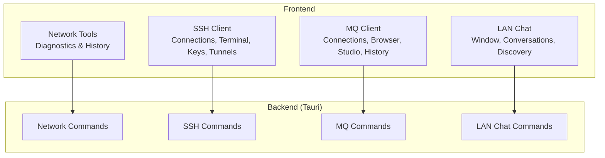
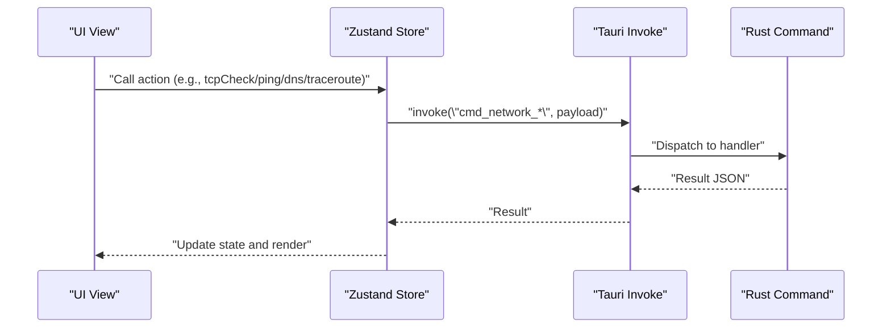
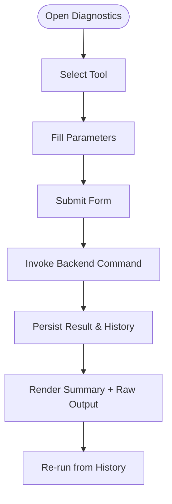
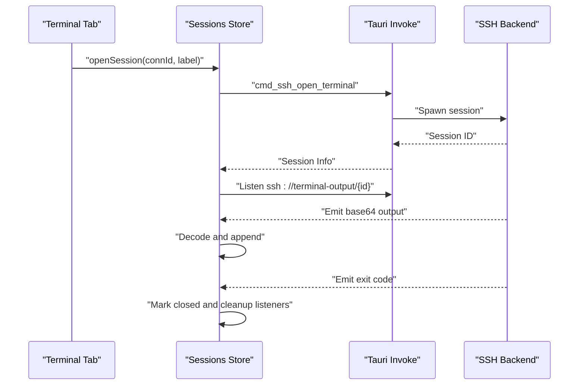
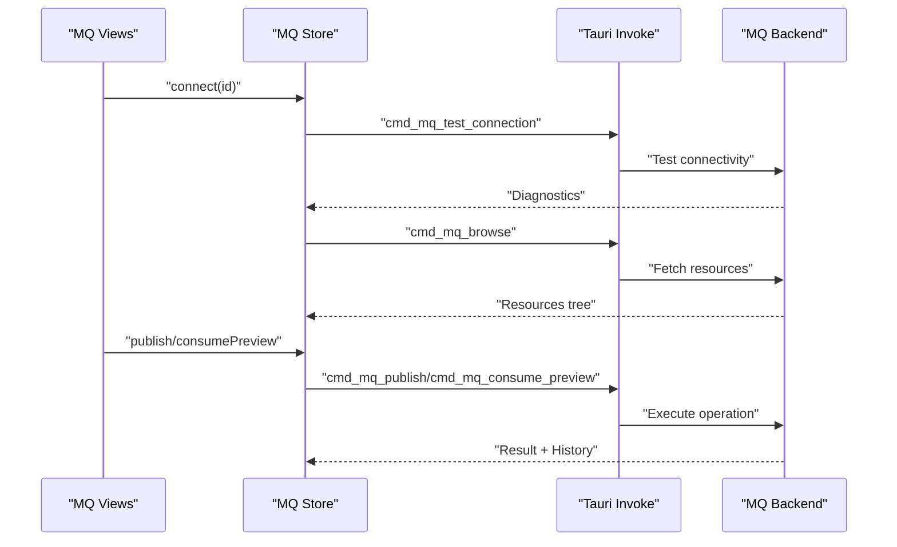
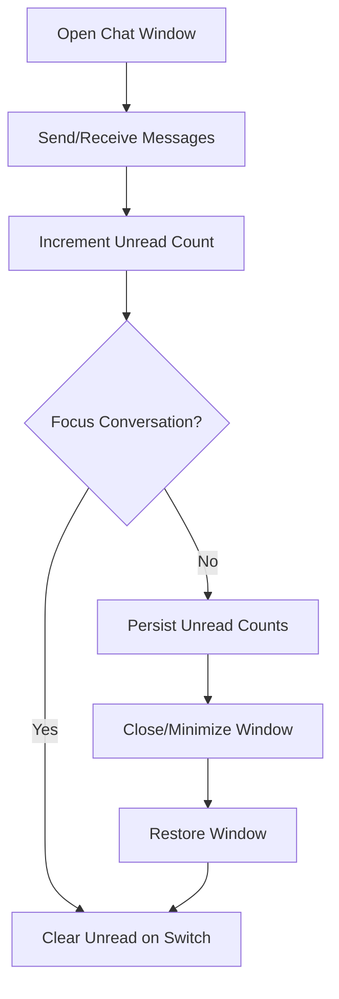
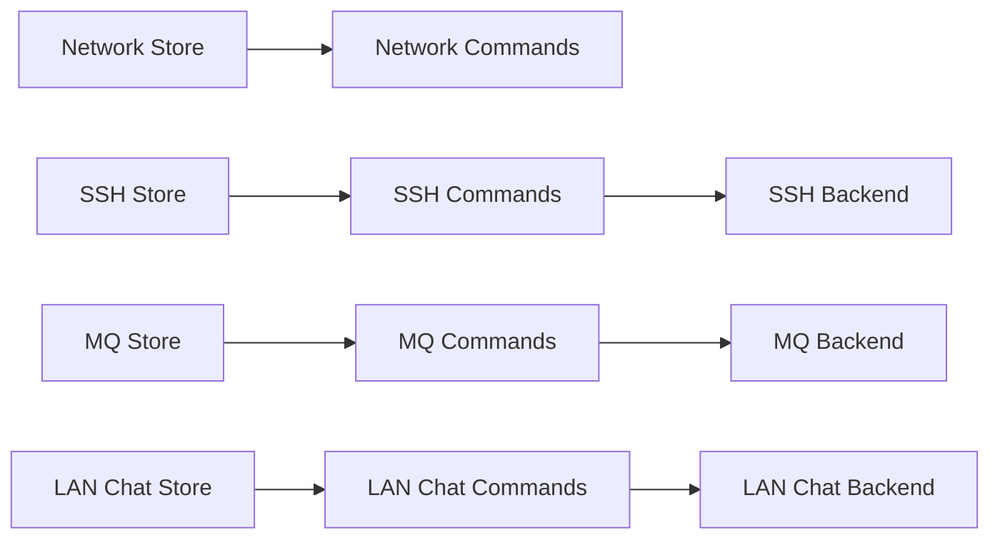

# Network Tools

<cite>
**Referenced Files in This Document**
- [index.tsx](file://src/plugins/network-tools/index.tsx)
- [network-tools.ts](file://src/plugins/network-tools/store/network-tools.ts)
- [Diagnostics.tsx](file://src/plugins/network-tools/views/Diagnostics.tsx)
- [types.ts](file://src/plugins/network-tools/types.ts)
- [index.tsx](file://src/plugins/ssh-client/index.tsx)
- [sessions.ts](file://src/plugins/ssh-client/store/sessions.ts)
- [ssh-connections.ts](file://src/plugins/ssh-client/store/ssh-connections.ts)
- [tunnels.ts](file://src/plugins/ssh-client/store/tunnels.ts)
- [index.tsx](file://src/plugins/mq-client/index.tsx)
- [mq-client.ts](file://src/plugins/mq-client/store/mq-client.ts)
- [lan-chat.ts](file://src/plugins/lan-chat/store/lan-chat.ts)
- [mod.rs (SSH)](file://src-tauri/src/plugins/ssh/mod.rs)
- [mod.rs (MQ)](file://src-tauri/src/plugins/mq/mod.rs)
- [mod.rs (LAN Chat)](file://src-tauri/src/plugins/lan_chat/mod.rs)
</cite>

## Table of Contents
1. [Introduction](#introduction)
2. [Project Structure](#project-structure)
3. [Core Components](#core-components)
4. [Architecture Overview](#architecture-overview)
5. [Detailed Component Analysis](#detailed-component-analysis)
6. [Dependency Analysis](#dependency-analysis)
7. [Performance Considerations](#performance-considerations)
8. [Troubleshooting Guide](#troubleshooting-guide)
9. [Conclusion](#conclusion)
10. [Appendices](#appendices)

## Introduction
This document explains RDMM’s network tools suite with a focus on connectivity diagnostics, secure terminal access, message queue management, and LAN chat. It covers how the frontend integrates with the Rust backend via Tauri commands, how connection management and authentication are handled, and how terminal emulation, message browsing, and real-time collaboration work. Practical examples demonstrate SSH tunneling, MQ monitoring, and LAN chat collaboration, along with security considerations, performance tips, and troubleshooting steps.

## Project Structure
RDMM organizes network-related functionality into four major plugins:
- Network Diagnostics: Connectivity checks (TCP, Ping, DNS, Traceroute) with history and replay.
- SSH Client: Secure shell connections, terminal sessions, key management, and tunneling.
- MQ Client: Unified management for Kafka and RabbitMQ with browsing, publishing, consuming, and history.
- LAN Chat: Peer-to-peer LAN discovery, rooms, direct messaging, and file transfer.

**Diagram sources**
- [index.tsx:1-27](file://src/plugins/network-tools/index.tsx#L1-L27)
- [index.tsx:1-66](file://src/plugins/ssh-client/index.tsx#L1-L66)
- [index.tsx:1-38](file://src/plugins/mq-client/index.tsx#L1-L38)
- [lan-chat.ts:1-202](file://src/plugins/lan-chat/store/lan-chat.ts#L1-L202)
- [mod.rs (SSH):1-7](file://src-tauri/src/plugins/ssh/mod.rs#L1-L7)
- [mod.rs (MQ):1-6](file://src-tauri/src/plugins/mq/mod.rs#L1-L6)
- [mod.rs (LAN Chat):1-8](file://src-tauri/src/plugins/lan_chat/mod.rs#L1-L8)

**Section sources**
- [index.tsx:1-27](file://src/plugins/network-tools/index.tsx#L1-L27)
- [index.tsx:1-66](file://src/plugins/ssh-client/index.tsx#L1-L66)
- [index.tsx:1-38](file://src/plugins/mq-client/index.tsx#L1-L38)
- [lan-chat.ts:1-202](file://src/plugins/lan-chat/store/lan-chat.ts#L1-L202)
- [mod.rs (SSH):1-7](file://src-tauri/src/plugins/ssh/mod.rs#L1-L7)
- [mod.rs (MQ):1-6](file://src-tauri/src/plugins/mq/mod.rs#L1-L6)
- [mod.rs (LAN Chat):1-8](file://src-tauri/src/plugins/lan_chat/mod.rs#L1-L8)

## Core Components
- Network Diagnostics: Provides one-shot connectivity checks and persistent history for later replay. Stores results locally and exposes actions to run TCP checks, ping, DNS lookup, and traceroute.
- SSH Client: Manages SSH connections, spawns terminal sessions, streams output, handles resizing, and supports SSH tunnel rules (local, remote, dynamic).
- MQ Client: Centralizes connection management for Kafka and RabbitMQ, resource browsing, publishing/consuming previews, saved templates, and operation history.
- LAN Chat: Real-time LAN messaging with window state persistence, conversation tracking, and discovery mechanisms.

**Section sources**
- [network-tools.ts:1-97](file://src/plugins/network-tools/store/network-tools.ts#L1-L97)
- [Diagnostics.tsx:1-148](file://src/plugins/network-tools/views/Diagnostics.tsx#L1-L148)
- [types.ts:1-57](file://src/plugins/network-tools/types.ts#L1-L57)
- [index.tsx:1-66](file://src/plugins/ssh-client/index.tsx#L1-L66)
- [sessions.ts:1-192](file://src/plugins/ssh-client/store/sessions.ts#L1-L192)
- [ssh-connections.ts:1-77](file://src/plugins/ssh-client/store/ssh-connections.ts#L1-L77)
- [tunnels.ts:1-64](file://src/plugins/ssh-client/store/tunnels.ts#L1-L64)
- [index.tsx:1-38](file://src/plugins/mq-client/index.tsx#L1-L38)
- [mq-client.ts:1-103](file://src/plugins/mq-client/store/mq-client.ts#L1-L103)
- [lan-chat.ts:1-202](file://src/plugins/lan-chat/store/lan-chat.ts#L1-L202)

## Architecture Overview
The frontend communicates with the backend via Tauri’s invoke mechanism. Each plugin exposes a manifest and a root component, while stores encapsulate state and orchestrate command invocations. Backend modules expose typed commands for each domain.

**Diagram sources**
- [network-tools.ts:42-77](file://src/plugins/network-tools/store/network-tools.ts#L42-L77)
- [Diagnostics.tsx:107-117](file://src/plugins/network-tools/views/Diagnostics.tsx#L107-L117)
- [mod.rs (SSH):1-7](file://src-tauri/src/plugins/ssh/mod.rs#L1-L7)
- [mod.rs (MQ):1-6](file://src-tauri/src/plugins/mq/mod.rs#L1-L6)
- [mod.rs (LAN Chat):1-8](file://src-tauri/src/plugins/lan_chat/mod.rs#L1-L8)

## Detailed Component Analysis

### Network Diagnostics
- Purpose: Run and persist connectivity checks (TCP, Ping, DNS, Traceroute).
- State and Actions:
  - Workspace tabs: diagnostics/history.
  - Active tool selection.
  - Loading state during requests.
  - Last result storage and history retrieval.
  - Re-run previous diagnostics from history.
- Results:
  - Structured results per tool type with duration and tool-specific fields.
  - Raw output and JSON dumps for inspection.

**Diagram sources**
- [Diagnostics.tsx:92-147](file://src/plugins/network-tools/views/Diagnostics.tsx#L92-L147)
- [network-tools.ts:34-96](file://src/plugins/network-tools/store/network-tools.ts#L34-L96)
- [types.ts:15-57](file://src/plugins/network-tools/types.ts#L15-L57)

**Section sources**
- [Diagnostics.tsx:1-148](file://src/plugins/network-tools/views/Diagnostics.tsx#L1-L148)
- [network-tools.ts:1-97](file://src/plugins/network-tools/store/network-tools.ts#L1-L97)
- [types.ts:1-57](file://src/plugins/network-tools/types.ts#L1-L57)

### SSH Client
- Purpose: Secure terminal access, key management, and SSH tunneling.
- State and Actions:
  - Connections: list, save, delete, test latency, connect/disconnect.
  - Sessions: open/close/rename, send input, resize, drain output buffer, track closed sessions.
  - Tunnels: list/save/delete rules; start/stop local/remote/dynamic tunnels.
- Terminal Emulation:
  - Streaming output chunks per session.
  - Base64 encoding/decoding for safe transport.
  - Event-driven updates for output and exit status.

**Diagram sources**
- [sessions.ts:85-139](file://src/plugins/ssh-client/store/sessions.ts#L85-L139)
- [sessions.ts:106-121](file://src/plugins/ssh-client/store/sessions.ts#L106-L121)

**Section sources**
- [index.tsx:1-66](file://src/plugins/ssh-client/index.tsx#L1-L66)
- [ssh-connections.ts:1-77](file://src/plugins/ssh-client/store/ssh-connections.ts#L1-L77)
- [sessions.ts:1-192](file://src/plugins/ssh-client/store/sessions.ts#L1-L192)
- [tunnels.ts:1-64](file://src/plugins/ssh-client/store/tunnels.ts#L1-L64)

### MQ Client
- Purpose: Unified management for Kafka and RabbitMQ.
- State and Actions:
  - Connections: list/save/delete/test/connect.
  - Browse resources (topics/queues/exchanges) after connecting.
  - Publish/consume preview operations with diagnostics.
  - Saved templates per broker type.
  - Operation history with filtering and deletion/clearing.

**Diagram sources**
- [mq-client.ts:78-95](file://src/plugins/mq-client/store/mq-client.ts#L78-L95)
- [index.tsx:13-35](file://src/plugins/mq-client/index.tsx#L13-L35)
- [mod.rs (MQ):1-6](file://src-tauri/src/plugins/mq/mod.rs#L1-L6)

**Section sources**
- [index.tsx:1-38](file://src/plugins/mq-client/index.tsx#L1-L38)
- [mq-client.ts:1-103](file://src/plugins/mq-client/store/mq-client.ts#L1-L103)
- [mod.rs (MQ):1-6](file://src-tauri/src/plugins/mq/mod.rs#L1-L6)

### LAN Chat
- Purpose: Real-time LAN collaboration with discovery, rooms, and direct messages.
- State and Actions:
  - Window management: open/minimize/maximize/restore with persisted bounds.
  - Unread counters per conversation and global unread.
  - Conversation selection and clearing unread counts.
  - Persistence middleware to maintain state across sessions.

**Diagram sources**
- [lan-chat.ts:89-201](file://src/plugins/lan-chat/store/lan-chat.ts#L89-L201)

**Section sources**
- [lan-chat.ts:1-202](file://src/plugins/lan-chat/store/lan-chat.ts#L1-L202)

## Dependency Analysis
- Frontend-to-Backend Contracts:
  - Network tools: invoke network commands for TCP check, ping, DNS lookup, traceroute, and history operations.
  - SSH client: invoke connection management, terminal open/send/resize/drain, tunnel operations.
  - MQ client: invoke connection management, browse, publish/consume preview, history operations, template management.
  - LAN chat: invoke chat commands and manage window state.
- Backend Modules:
  - SSH: commands, key store, session pool, terminal, tunnel, types.
  - MQ: commands, kafka, rabbitmq, types, utils.
  - LAN Chat: commands, direct messaging, discovery, file transfer, room, transport, types.

**Diagram sources**
- [network-tools.ts:42-77](file://src/plugins/network-tools/store/network-tools.ts#L42-L77)
- [sessions.ts:85-139](file://src/plugins/ssh-client/store/sessions.ts#L85-L139)
- [tunnels.ts:48-58](file://src/plugins/ssh-client/store/tunnels.ts#L48-L58)
- [mq-client.ts:78-95](file://src/plugins/mq-client/store/mq-client.ts#L78-L95)
- [lan-chat.ts:89-201](file://src/plugins/lan-chat/store/lan-chat.ts#L89-L201)
- [mod.rs (SSH):1-7](file://src-tauri/src/plugins/ssh/mod.rs#L1-L7)
- [mod.rs (MQ):1-6](file://src-tauri/src/plugins/mq/mod.rs#L1-L6)
- [mod.rs (LAN Chat):1-8](file://src-tauri/src/plugins/lan_chat/mod.rs#L1-L8)

**Section sources**
- [network-tools.ts:1-97](file://src/plugins/network-tools/store/network-tools.ts#L1-L97)
- [sessions.ts:1-192](file://src/plugins/ssh-client/store/sessions.ts#L1-L192)
- [tunnels.ts:1-64](file://src/plugins/ssh-client/store/tunnels.ts#L1-L64)
- [mq-client.ts:1-103](file://src/plugins/mq-client/store/mq-client.ts#L1-L103)
- [lan-chat.ts:1-202](file://src/plugins/lan-chat/store/lan-chat.ts#L1-L202)
- [mod.rs (SSH):1-7](file://src-tauri/src/plugins/ssh/mod.rs#L1-L7)
- [mod.rs (MQ):1-6](file://src-tauri/src/plugins/mq/mod.rs#L1-L6)
- [mod.rs (LAN Chat):1-8](file://src-tauri/src/plugins/lan_chat/mod.rs#L1-L8)

## Performance Considerations
- Network Diagnostics
  - Tune timeouts per tool to balance responsiveness and accuracy.
  - Limit concurrent runs when testing multiple targets.
  - Use history re-run to avoid repeated network probing.
- SSH Client
  - Prefer batching resize operations to reduce backend calls.
  - Drain initial output buffer to prevent backlog accumulation.
  - Clean up event listeners on session close to avoid leaks.
- MQ Client
  - Use consume preview for lightweight inspection before full consumption.
  - Filter history to reduce payload sizes.
  - Reuse connections and avoid frequent reconnects.
- LAN Chat
  - Debounce unread counters when switching conversations rapidly.
  - Persist window state to avoid repeated layout recalculations.

[No sources needed since this section provides general guidance]

## Troubleshooting Guide
- Network Diagnostics
  - Verify timeouts are sufficient for the target network conditions.
  - Confirm tool parameters match intended target (host/port, target, record type, max hops).
  - Inspect raw output and JSON for detailed failure reasons.
- SSH Client
  - Ensure the session is marked closed if the remote process exits unexpectedly.
  - Validate Base64 decoding of output chunks; fall back to raw payload if decoding fails.
  - Check tunnel rules for correct local/remote host and port mapping.
- MQ Client
  - Test connection diagnostics to identify broker-specific issues.
  - Confirm active connection before browsing or publishing.
  - Review history entries for failed operations and retry with corrected parameters.
- LAN Chat
  - Confirm discovery and transport modules are enabled for LAN messaging.
  - Check conversation unread counts and window state persistence.

**Section sources**
- [Diagnostics.tsx:37-90](file://src/plugins/network-tools/views/Diagnostics.tsx#L37-L90)
- [sessions.ts:106-139](file://src/plugins/ssh-client/store/sessions.ts#L106-L139)
- [tunnels.ts:48-58](file://src/plugins/ssh-client/store/tunnels.ts#L48-L58)
- [mq-client.ts:73-77](file://src/plugins/mq-client/store/mq-client.ts#L73-L77)
- [lan-chat.ts:146-174](file://src/plugins/lan-chat/store/lan-chat.ts#L146-L174)

## Conclusion
RDMM’s network tools integrate a diagnostics suite, a robust SSH client with terminal emulation and tunneling, a unified MQ client for Kafka and RabbitMQ, and a LAN chat system for real-time collaboration. The frontend uses typed stores and Tauri commands to communicate with Rust backends, ensuring reliable, cross-platform networking utilities. By following the examples and guidance here, teams can securely monitor connectivity, manage message queues, and collaborate efficiently over LAN.

[No sources needed since this section summarizes without analyzing specific files]

## Appendices

### Practical Examples

- SSH Tunneling
  - Define a tunnel rule (local/remote/dynamic) and start it for the desired connection.
  - Use the rule to forward traffic from a local port to a remote service.
  - Stop the rule when no longer needed.

  **Section sources**
  - [tunnels.ts:48-58](file://src/plugins/ssh-client/store/tunnels.ts#L48-L58)

- Monitoring Message Queues
  - Connect to a broker, browse resources, and use consume preview to inspect messages.
  - Publish test messages and review operation history for diagnostics.

  **Section sources**
  - [mq-client.ts:78-95](file://src/plugins/mq-client/store/mq-client.ts#L78-L95)

- Collaborating Through LAN Chat
  - Open the chat window, select a conversation, and observe unread counters.
  - Use discovery to locate peers and exchange messages or files.

  **Section sources**
  - [lan-chat.ts:89-201](file://src/plugins/lan-chat/store/lan-chat.ts#L89-L201)

### Security Considerations
- SSH
  - Prefer key-based authentication over passwords when possible.
  - Rotate keys and remove unused ones regularly.
  - Restrict tunnel rules to trusted hosts and ports.
- MQ
  - Use TLS-enabled connections where supported.
  - Limit access to sensitive topics/queues via broker permissions.
  - Avoid logging sensitive payloads; sanitize logs.
- LAN Chat
  - Operate within trusted LAN segments.
  - Be cautious with file transfers; scan shared files.

[No sources needed since this section provides general guidance]