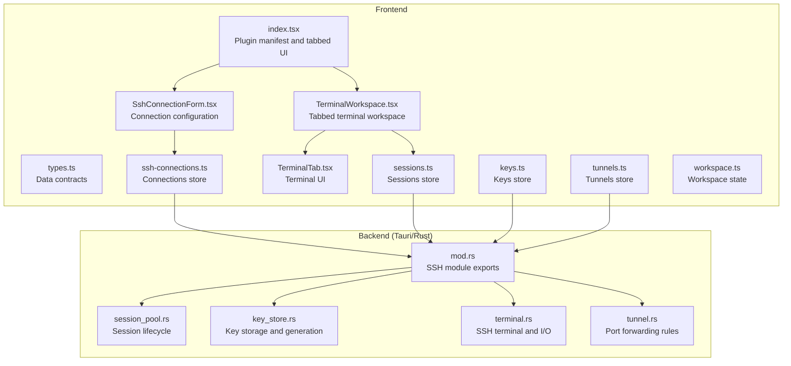
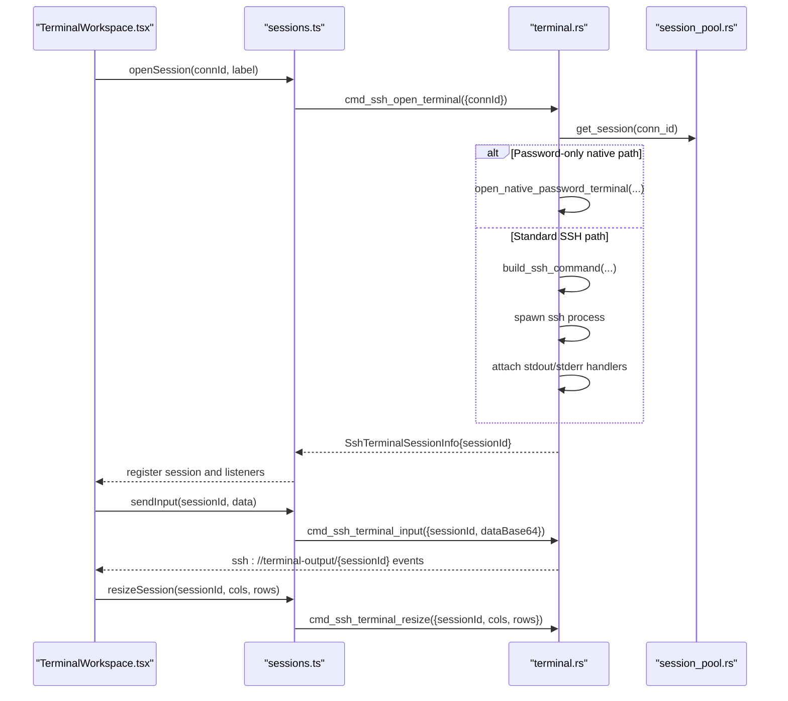
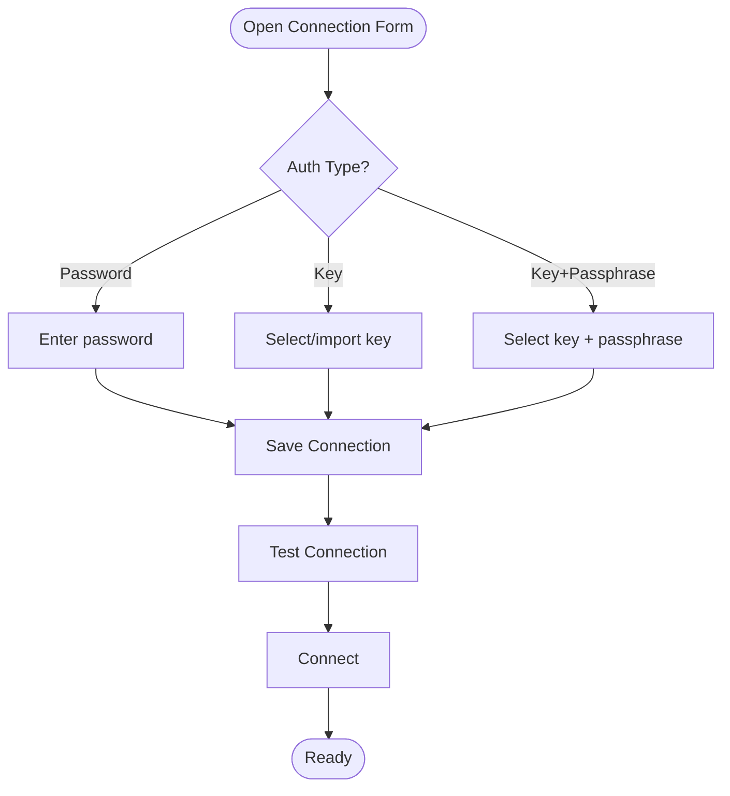
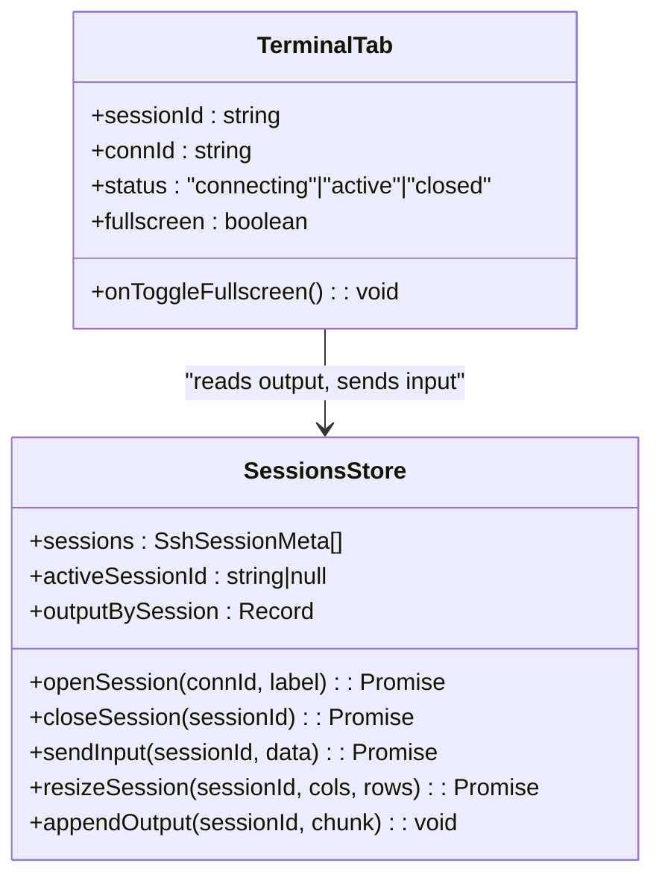
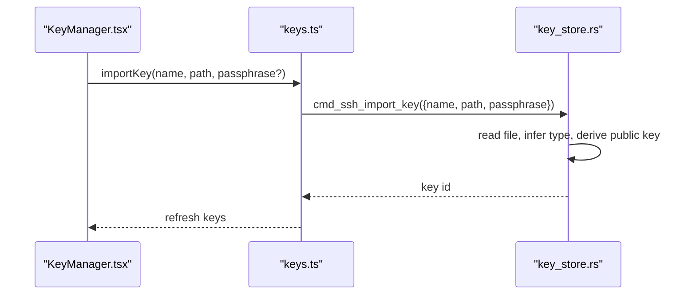
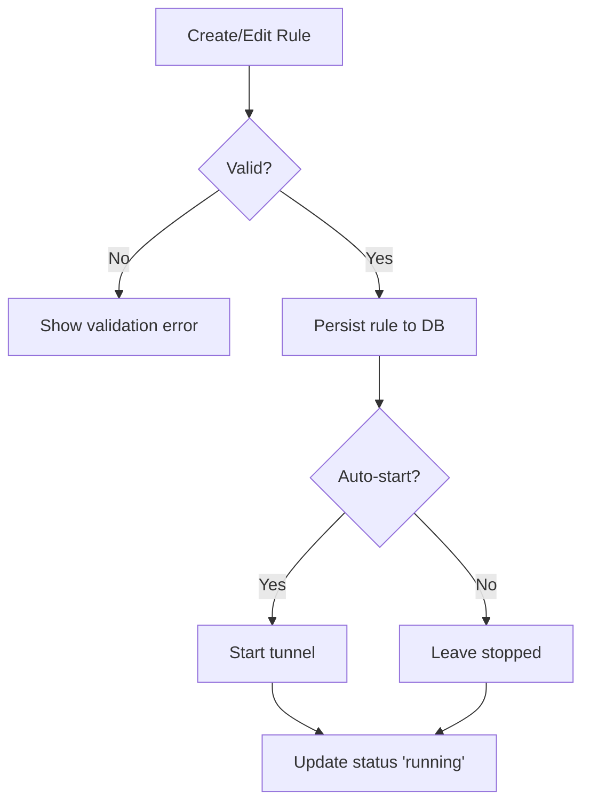
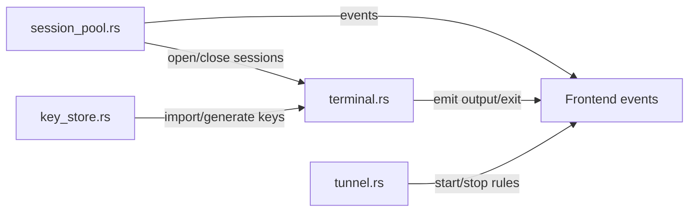
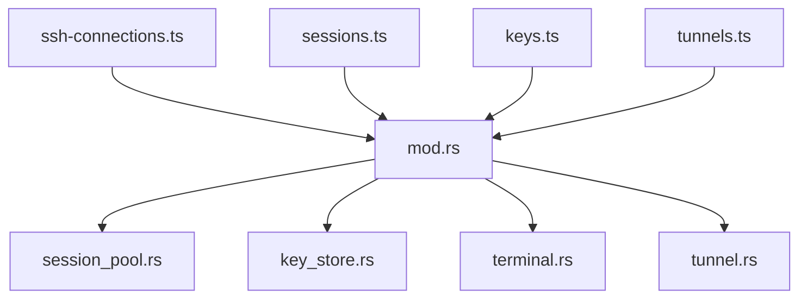

# SSH Client

<cite>
**Referenced Files in This Document**
- [index.tsx](file://src/plugins/ssh-client/index.tsx)
- [types.ts](file://src/plugins/ssh-client/types.ts)
- [SshConnectionForm.tsx](file://src/plugins/ssh-client/components/SshConnectionForm.tsx)
- [TerminalTab.tsx](file://src/plugins/ssh-client/components/TerminalTab.tsx)
- [TerminalWorkspace.tsx](file://src/plugins/ssh-client/views/TerminalWorkspace.tsx)
- [ssh-connections.ts](file://src/plugins/ssh-client/store/ssh-connections.ts)
- [sessions.ts](file://src/plugins/ssh-client/store/sessions.ts)
- [keys.ts](file://src/plugins/ssh-client/store/keys.ts)
- [tunnels.ts](file://src/plugins/ssh-client/store/tunnels.ts)
- [workspace.ts](file://src/plugins/ssh-client/store/workspace.ts)
- [mod.rs](file://src-tauri/src/plugins/ssh/mod.rs)
- [session_pool.rs](file://src-tauri/src/plugins/ssh/session_pool.rs)
- [key_store.rs](file://src-tauri/src/plugins/ssh/key_store.rs)
- [terminal.rs](file://src-tauri/src/plugins/ssh/terminal.rs)
- [tunnel.rs](file://src-tauri/src/plugins/ssh/tunnel.rs)
</cite>

## Table of Contents
1. [Introduction](#introduction)
2. [Project Structure](#project-structure)
3. [Core Components](#core-components)
4. [Architecture Overview](#architecture-overview)
5. [Detailed Component Analysis](#detailed-component-analysis)
6. [Dependency Analysis](#dependency-analysis)
7. [Performance Considerations](#performance-considerations)
8. [Troubleshooting Guide](#troubleshooting-guide)
9. [Conclusion](#conclusion)
10. [Appendices](#appendices)

## Introduction
This document describes RDMM’s SSH client plugin, focusing on secure remote terminal access and connection management. It explains the integrated SSH connection management system, terminal emulation capabilities, key-based authentication, and port tunneling features. It also documents the connection form configuration, session management, terminal tab interface, and SSH key storage. Implementation details include SSH protocols, encryption methods, and security best practices. Practical examples cover establishing SSH connections, configuring tunnel rules, managing SSH keys, and using the terminal workspace. Finally, it addresses common SSH authentication issues, connection troubleshooting, and performance optimization for remote terminal sessions.

## Project Structure
The SSH client plugin is organized into frontend React components and stores, plus a Rust backend implementing SSH sessions, terminal I/O, key storage, and port forwarding.

**Diagram sources**
- [index.tsx:12-66](file://src/plugins/ssh-client/index.tsx#L12-L66)
- [types.ts:1-115](file://src/plugins/ssh-client/types.ts#L1-L115)
- [SshConnectionForm.tsx:19-256](file://src/plugins/ssh-client/components/SshConnectionForm.tsx#L19-L256)
- [TerminalTab.tsx:16-189](file://src/plugins/ssh-client/components/TerminalTab.tsx#L16-L189)
- [TerminalWorkspace.tsx:8-187](file://src/plugins/ssh-client/views/TerminalWorkspace.tsx#L8-L187)
- [ssh-connections.ts:25-77](file://src/plugins/ssh-client/store/ssh-connections.ts#L25-L77)
- [sessions.ts:50-192](file://src/plugins/ssh-client/store/sessions.ts#L50-L192)
- [keys.ts:17-47](file://src/plugins/ssh-client/store/keys.ts#L17-L47)
- [tunnels.ts:27-64](file://src/plugins/ssh-client/store/tunnels.ts#L27-L64)
- [workspace.ts:16-22](file://src/plugins/ssh-client/store/workspace.ts#L16-L22)
- [mod.rs:1-7](file://src-tauri/src/plugins/ssh/mod.rs#L1-L7)
- [session_pool.rs:105-172](file://src-tauri/src/plugins/ssh/session_pool.rs#L105-L172)
- [key_store.rs:39-153](file://src-tauri/src/plugins/ssh/key_store.rs#L39-L153)
- [terminal.rs:522-800](file://src-tauri/src/plugins/ssh/terminal.rs#L522-L800)
- [tunnel.rs:45-220](file://src-tauri/src/plugins/ssh/tunnel.rs#L45-L220)

**Section sources**
- [index.tsx:12-66](file://src/plugins/ssh-client/index.tsx#L12-L66)
- [types.ts:1-115](file://src/plugins/ssh-client/types.ts#L1-L115)

## Core Components
- Plugin manifest and tabbed UI: Defines the SSH plugin entry point and navigation among Connections, Terminal, Keys, and Tunnels.
- Connection form: Configures SSH connection parameters, authentication modes, jump hosts, encoding, and keepalive intervals.
- Terminal workspace: Manages terminal tabs, session lifecycle, and quick command panel.
- Terminal tab: Renders xterm.js terminal, handles input/output, resizing, and fullscreen mode.
- Stores: Manage state for connections, sessions, keys, tunnels, and workspace tabs.
- Backend modules: Implement session pooling, key storage, terminal I/O, and port forwarding.

**Section sources**
- [index.tsx:12-66](file://src/plugins/ssh-client/index.tsx#L12-L66)
- [SshConnectionForm.tsx:27-256](file://src/plugins/ssh-client/components/SshConnectionForm.tsx#L27-L256)
- [TerminalWorkspace.tsx:8-187](file://src/plugins/ssh-client/views/TerminalWorkspace.tsx#L8-L187)
- [TerminalTab.tsx:24-189](file://src/plugins/ssh-client/components/TerminalTab.tsx#L24-L189)
- [ssh-connections.ts:25-77](file://src/plugins/ssh-client/store/ssh-connections.ts#L25-L77)
- [sessions.ts:50-192](file://src/plugins/ssh-client/store/sessions.ts#L50-L192)
- [keys.ts:17-47](file://src/plugins/ssh-client/store/keys.ts#L17-L47)
- [tunnels.ts:27-64](file://src/plugins/ssh-client/store/tunnels.ts#L27-L64)
- [workspace.ts:16-22](file://src/plugins/ssh-client/store/workspace.ts#L16-L22)

## Architecture Overview
The frontend communicates with the backend via Tauri invoke/listen. The backend orchestrates SSH sessions, manages terminal I/O, handles key material, and runs port forwarding.

**Diagram sources**
- [TerminalWorkspace.tsx:26-32](file://src/plugins/ssh-client/views/TerminalWorkspace.tsx#L26-L32)
- [sessions.ts:85-139](file://src/plugins/ssh-client/store/sessions.ts#L85-L139)
- [terminal.rs:522-694](file://src-tauri/src/plugins/ssh/terminal.rs#L522-L694)
- [session_pool.rs:162-172](file://src-tauri/src/plugins/ssh/session_pool.rs#L162-L172)

## Detailed Component Analysis

### Connection Management
- Data model: Connection form and info types define host, port, username, auth type, optional key and passphrase, jump host, encoding, and keepalive interval.
- Form behavior: Supports password, key, and key+passphrase authentication modes; integrates key selection and import; exposes advanced options like jump host, encoding, and keepalive.
- Lifecycle: Save, delete, test latency, connect/disconnect, and maintain connected IDs.

**Diagram sources**
- [SshConnectionForm.tsx:85-96](file://src/plugins/ssh-client/components/SshConnectionForm.tsx#L85-L96)
- [types.ts:3-32](file://src/plugins/ssh-client/types.ts#L3-L32)

**Section sources**
- [types.ts:1-32](file://src/plugins/ssh-client/types.ts#L1-L32)
- [SshConnectionForm.tsx:27-256](file://src/plugins/ssh-client/components/SshConnectionForm.tsx#L27-L256)
- [ssh-connections.ts:25-77](file://src/plugins/ssh-client/store/ssh-connections.ts#L25-L77)

### Terminal Emulation and Session Management
- Terminal rendering: Uses xterm.js with fit addon and web links; writes buffered output chunks and resizes on demand.
- Input/Output: Encodes input to base64 and sends to backend; decodes received base64 output; emits exit events with status codes.
- Session lifecycle: Open, close, rename, set active, and track per-session output buffers.

**Diagram sources**
- [TerminalTab.tsx:24-189](file://src/plugins/ssh-client/components/TerminalTab.tsx#L24-L189)
- [sessions.ts:50-192](file://src/plugins/ssh-client/store/sessions.ts#L50-L192)

**Section sources**
- [TerminalTab.tsx:24-189](file://src/plugins/ssh-client/components/TerminalTab.tsx#L24-L189)
- [TerminalWorkspace.tsx:8-187](file://src/plugins/ssh-client/views/TerminalWorkspace.tsx#L8-L187)
- [sessions.ts:50-192](file://src/plugins/ssh-client/store/sessions.ts#L50-L192)

### SSH Key Storage and Authentication
- Key listing, import, delete, generate, and public key retrieval.
- Import validates key file presence and format, infers key type, derives a virtual public key, and optionally encrypts passphrase.
- Runtime key handling: Copies selected key to a temporary location under a controlled runtime directory and hardens permissions.

**Diagram sources**
- [keys.ts:17-47](file://src/plugins/ssh-client/store/keys.ts#L17-L47)
- [key_store.rs:66-108](file://src-tauri/src/plugins/ssh/key_store.rs#L66-L108)

**Section sources**
- [keys.ts:17-47](file://src/plugins/ssh-client/store/keys.ts#L17-L47)
- [key_store.rs:39-153](file://src-tauri/src/plugins/ssh/key_store.rs#L39-L153)

### Port Tunneling
- Rule model supports local, remote, and dynamic forwarding with optional auto-start and status tracking.
- Start/stop operations persist rule updates and manage runtime tunnel instances.
- Validation ensures required fields per tunnel type.

**Diagram sources**
- [types.ts:82-115](file://src/plugins/ssh-client/types.ts#L82-L115)
- [tunnels.ts:27-64](file://src/plugins/ssh-client/store/tunnels.ts#L27-L64)
- [tunnel.rs:64-130](file://src-tauri/src/plugins/ssh/tunnel.rs#L64-L130)

**Section sources**
- [types.ts:82-115](file://src/plugins/ssh-client/types.ts#L82-L115)
- [tunnels.ts:27-64](file://src/plugins/ssh-client/store/tunnels.ts#L27-L64)
- [tunnel.rs:45-220](file://src-tauri/src/plugins/ssh/tunnel.rs#L45-L220)

### Backend SSH Protocol and Security
- Session pooling: Tracks active connections, spawns keepalive probes, and emits session-closed events on disconnection.
- Terminal I/O: Spawns the system ssh client with strict options, captures stdout/stderr, and forwards user input; supports jump hosts and key injection.
- Password handling: Detects password prompts and responds automatically for password-based authentication.
- Key handling: Writes runtime key files to a hardened runtime directory and removes them on process exit.
- Tunneling: Maintains runtime tunnel records and updates statuses.

**Diagram sources**
- [session_pool.rs:105-172](file://src-tauri/src/plugins/ssh/session_pool.rs#L105-L172)
- [terminal.rs:522-800](file://src-tauri/src/plugins/ssh/terminal.rs#L522-L800)
- [key_store.rs:66-108](file://src-tauri/src/plugins/ssh/key_store.rs#L66-L108)
- [tunnel.rs:132-220](file://src-tauri/src/plugins/ssh/tunnel.rs#L132-L220)

**Section sources**
- [session_pool.rs:105-172](file://src-tauri/src/plugins/ssh/session_pool.rs#L105-L172)
- [terminal.rs:286-368](file://src-tauri/src/plugins/ssh/terminal.rs#L286-L368)
- [terminal.rs:522-694](file://src-tauri/src/plugins/ssh/terminal.rs#L522-L694)
- [key_store.rs:196-284](file://src-tauri/src/plugins/ssh/key_store.rs#L196-L284)
- [tunnel.rs:132-220](file://src-tauri/src/plugins/ssh/tunnel.rs#L132-L220)

## Dependency Analysis
- Frontend stores depend on Tauri invoke/listen to call backend commands and subscribe to events.
- Backend modules are coordinated by the SSH plugin module entry.
- Terminal I/O depends on session pool state and key store runtime keys.

**Diagram sources**
- [ssh-connections.ts:25-77](file://src/plugins/ssh-client/store/ssh-connections.ts#L25-L77)
- [sessions.ts:50-192](file://src/plugins/ssh-client/store/sessions.ts#L50-L192)
- [keys.ts:17-47](file://src/plugins/ssh-client/store/keys.ts#L17-L47)
- [tunnels.ts:27-64](file://src/plugins/ssh-client/store/tunnels.ts#L27-L64)
- [mod.rs:1-7](file://src-tauri/src/plugins/ssh/mod.rs#L1-L7)

**Section sources**
- [ssh-connections.ts:25-77](file://src/plugins/ssh-client/store/ssh-connections.ts#L25-L77)
- [sessions.ts:50-192](file://src/plugins/ssh-client/store/sessions.ts#L50-L192)
- [keys.ts:17-47](file://src/plugins/ssh-client/store/keys.ts#L17-L47)
- [tunnels.ts:27-64](file://src/plugins/ssh-client/store/tunnels.ts#L27-L64)
- [mod.rs:1-7](file://src-tauri/src/plugins/ssh/mod.rs#L1-L7)

## Performance Considerations
- Keepalive and TCP probing: The backend periodically checks connectivity and reconnects with exponential backoff, reducing stale sessions.
- Output buffering: Pending output is accumulated and emitted in base64 chunks; draining reduces UI redraw overhead.
- Resizing: Terminal resize events are throttled by xterm’s fit addon and forwarded to the backend to avoid excessive PTY resizes.
- Jump hosts: Using jump hosts can increase latency; prefer direct connections when possible.
- Encoding: UTF-8 is supported; ensure consistent encoding across client and server to minimize character corruption and reflows.

[No sources needed since this section provides general guidance]

## Troubleshooting Guide
Common issues and resolutions:
- Authentication failures
  - Password auth: Ensure password is present and matches server expectations; verify PreferredAuthentications and PubkeyAuthentication options.
  - Key auth: Confirm key exists and runtime key file was created; check permissions and passphrase if required.
  - Jump host: Verify jump host credentials and reachability.
- Connection timeouts
  - Use Test Connection to measure latency; ensure firewall/NAT allows outbound SSH to the configured port.
  - Adjust keepalive interval to balance responsiveness and network overhead.
- Terminal anomalies
  - If output appears garbled, switch encoding to match server locale.
  - If resizing fails, trigger a manual fit and resend resize signals.
- Tunnel errors
  - Local/remote/dynamic rules require specific fields; validate rule configuration before starting.
  - Auto-start rules are persisted; disable auto-start if frequent misconfiguration occurs.

**Section sources**
- [SshConnectionForm.tsx:92-96](file://src/plugins/ssh-client/components/SshConnectionForm.tsx#L92-L96)
- [terminal.rs:286-368](file://src-tauri/src/plugins/ssh/terminal.rs#L286-L368)
- [session_pool.rs:31-103](file://src-tauri/src/plugins/ssh/session_pool.rs#L31-L103)
- [tunnel.rs:132-176](file://src-tauri/src/plugins/ssh/tunnel.rs#L132-L176)

## Conclusion
RDMM’s SSH client plugin provides a secure, integrated solution for SSH connections, terminal emulation, key management, and port forwarding. Its frontend/backend architecture leverages Tauri for robust IPC, while the backend implements resilient session handling, safe key storage, and efficient terminal I/O. By following the configuration guidelines and troubleshooting tips herein, users can establish reliable connections, manage keys securely, and operate tunnels effectively.

[No sources needed since this section summarizes without analyzing specific files]

## Appendices

### Practical Examples

- Establish an SSH connection
  - Open the connection form, select auth type, fill host/port/username, choose key or enter password, and click Save. Use Test Connection to validate latency. Then Connect to open a session.
  - References: [SshConnectionForm.tsx:85-96](file://src/plugins/ssh-client/components/SshConnectionForm.tsx#L85-L96), [ssh-connections.ts:47-69](file://src/plugins/ssh-client/store/ssh-connections.ts#L47-L69)

- Configure a local tunnel rule
  - Create a rule with type local, set local port and remote host/port, enable auto-start if desired, then Start the rule.
  - References: [types.ts:95-105](file://src/plugins/ssh-client/types.ts#L95-L105), [tunnels.ts:39-57](file://src/plugins/ssh-client/store/tunnels.ts#L39-L57), [tunnel.rs:132-153](file://src-tauri/src/plugins/ssh/tunnel.rs#L132-L153)

- Manage SSH keys
  - Import an existing key file or generate a new key pair; retrieve the public key for server-side addition.
  - References: [keys.ts:30-45](file://src/plugins/ssh-client/store/keys.ts#L30-L45), [key_store.rs:66-108](file://src-tauri/src/plugins/ssh/key_store.rs#L66-L108)

- Use the terminal workspace
  - Open Terminal Workspace, pick a connection, and work with tabs: rename, close, toggle fullscreen, and use quick commands.
  - References: [TerminalWorkspace.tsx:26-32](file://src/plugins/ssh-client/views/TerminalWorkspace.tsx#L26-L32), [TerminalTab.tsx:114-119](file://src/plugins/ssh-client/components/TerminalTab.tsx#L114-L119)