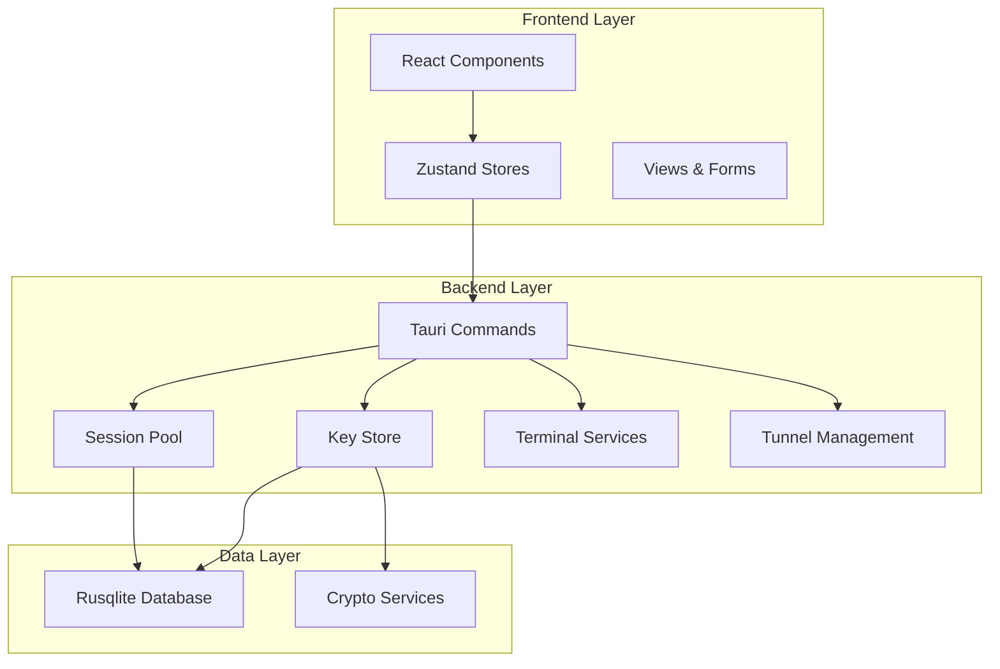
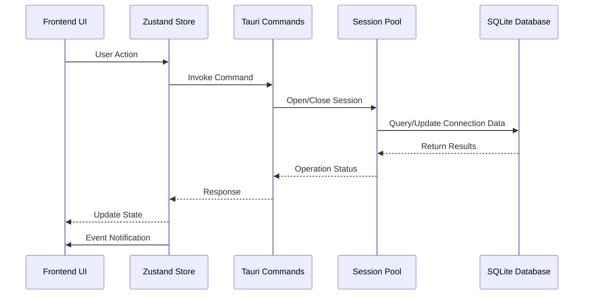
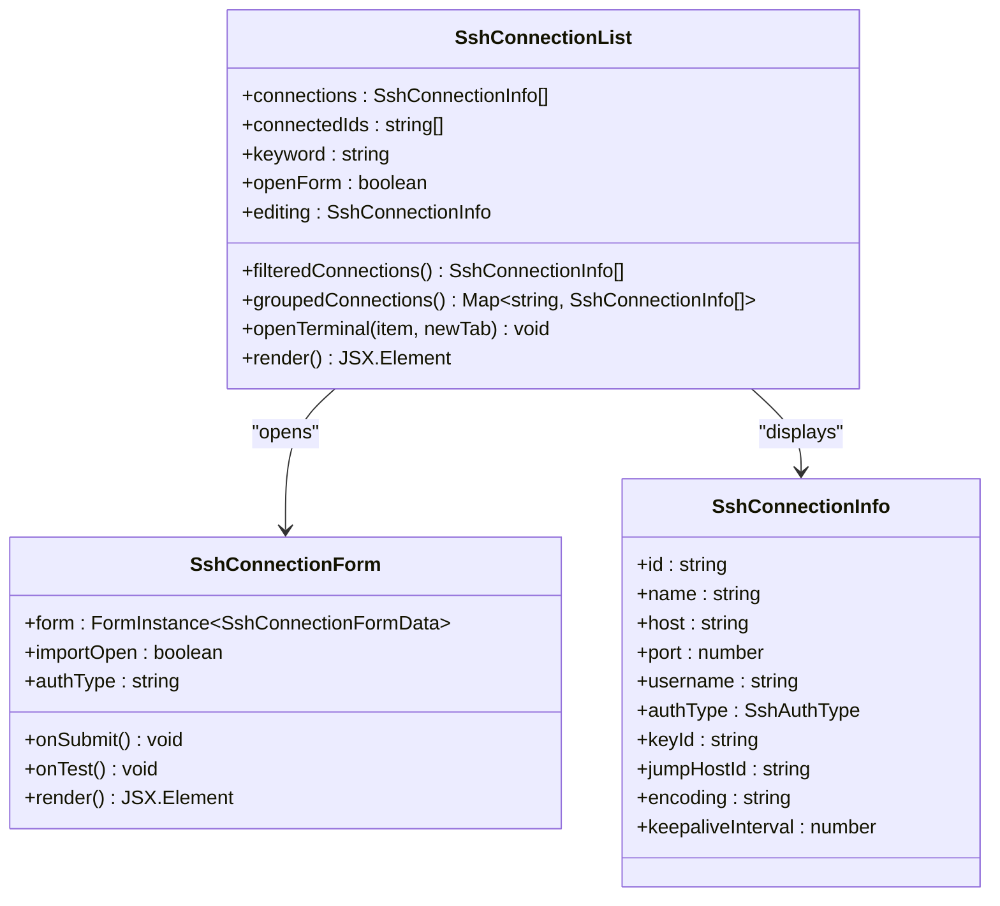
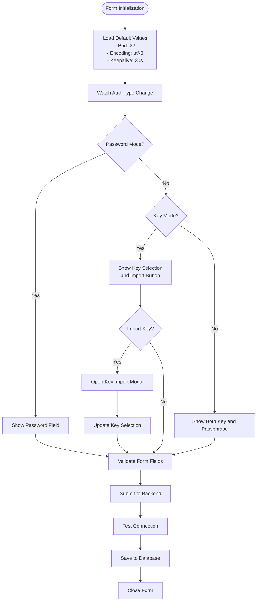
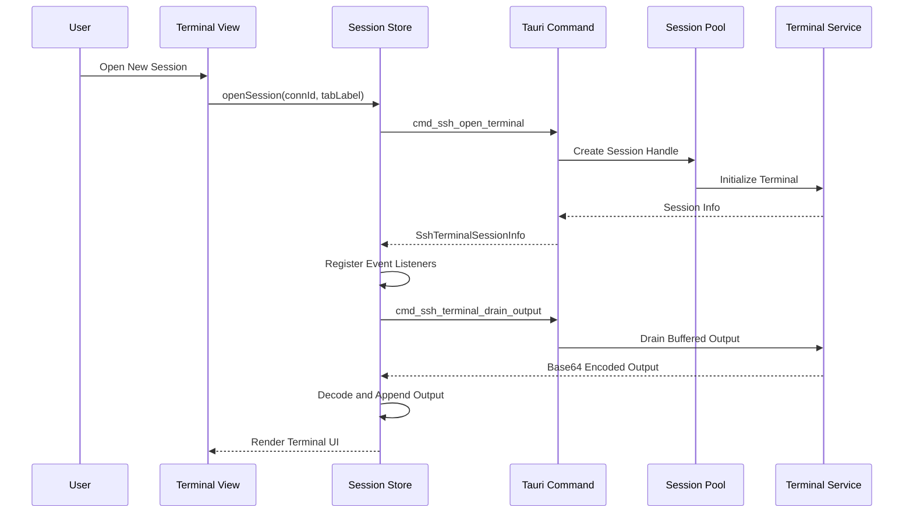
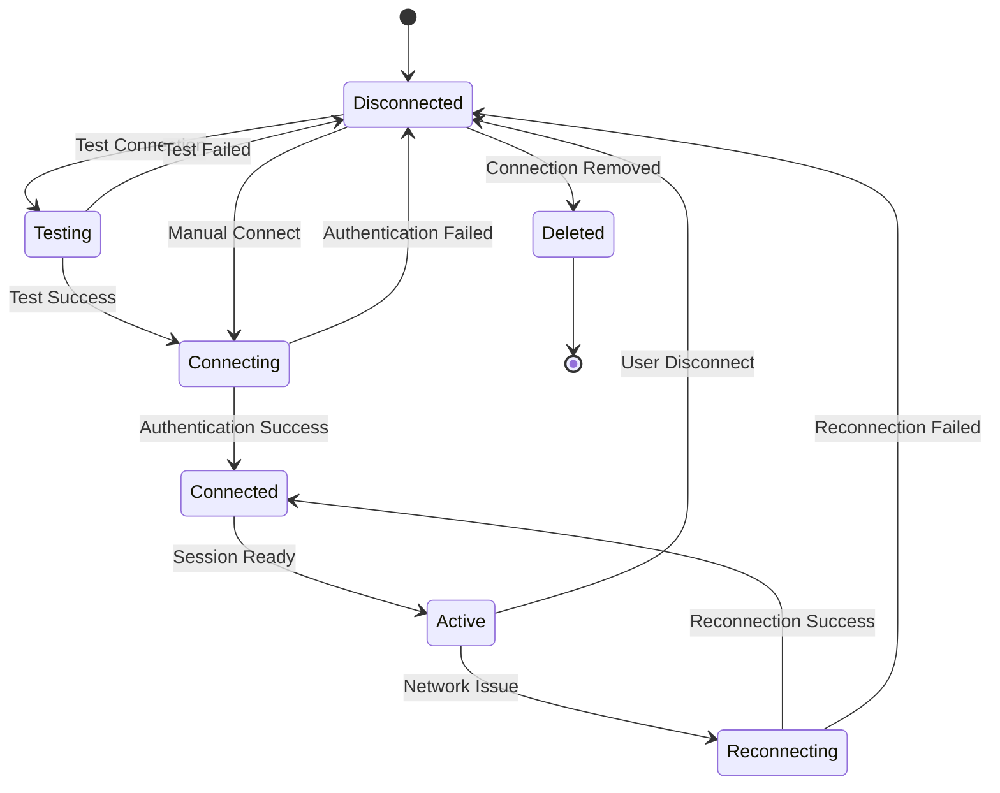
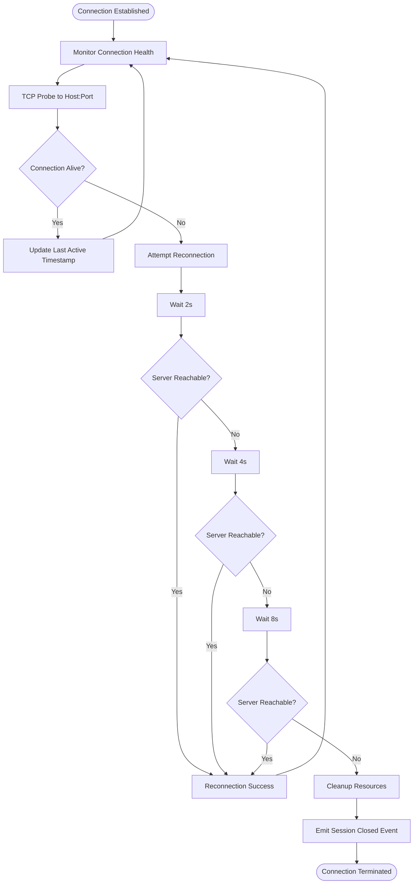

# SSH Connection Management

<cite>
**Referenced Files in This Document**
- [index.tsx](file://src/plugins/ssh-client/index.tsx)
- [types.ts](file://src/plugins/ssh-client/types.ts)
- [ssh-connections.ts](file://src/plugins/ssh-client/store/ssh-connections.ts)
- [sessions.ts](file://src/plugins/ssh-client/store/sessions.ts)
- [keys.ts](file://src/plugins/ssh-client/store/keys.ts)
- [tunnels.ts](file://src/plugins/ssh-client/store/tunnels.ts)
- [workspace.ts](file://src/plugins/ssh-client/store/workspace.ts)
- [SshConnectionList.tsx](file://src/plugins/ssh-client/views/SshConnectionList.tsx)
- [SshConnectionForm.tsx](file://src/plugins/ssh-client/components/SshConnectionForm.tsx)
- [KeyManager.tsx](file://src/plugins/ssh-client/views/KeyManager.tsx)
- [TunnelManager.tsx](file://src/plugins/ssh-client/views/TunnelManager.tsx)
- [TerminalWorkspace.tsx](file://src/plugins/ssh-client/views/TerminalWorkspace.tsx)
- [KeyImportForm.tsx](file://src/plugins/ssh-client/components/KeyImportForm.tsx)
- [commands.rs](file://src-tauri/src/plugins/ssh/commands.rs)
- [session_pool.rs](file://src-tauri/src/plugins/ssh/session_pool.rs)
- [key_store.rs](file://src-tauri/src/plugins/ssh/key_store.rs)
- [types.rs](file://src-tauri/src/plugins/ssh/types.rs)
</cite>

## Table of Contents
1. [Introduction](#introduction)
2. [Project Structure](#project-structure)
3. [Core Components](#core-components)
4. [Architecture Overview](#architecture-overview)
5. [Detailed Component Analysis](#detailed-component-analysis)
6. [Connection Lifecycle Management](#connection-lifecycle-management)
7. [Authentication Methods](#authentication-methods)
8. [Connection Pooling and Reconnection](#connection-pooling-and-reconnection)
9. [Security and Credential Storage](#security-and-credential-storage)
10. [Performance Optimization](#performance-optimization)
11. [Troubleshooting Guide](#troubleshooting-guide)
12. [Conclusion](#conclusion)

## Introduction

The SSH Connection Management system provides a comprehensive solution for managing SSH connections within the application. This system enables users to create, configure, test, and maintain SSH connections with various authentication methods while offering advanced features like connection pooling, automatic reconnection, and secure credential storage.

The system consists of a React-based frontend interface with Tauri-powered backend services, providing a seamless SSH connection experience with real-time monitoring and management capabilities.

## Project Structure

The SSH client implementation follows a modular architecture with clear separation between frontend components and backend services:

**Diagram sources**
- [index.tsx:1-66](file://src/plugins/ssh-client/index.tsx#L1-L66)
- [commands.rs:1-266](file://src-tauri/src/plugins/ssh/commands.rs#L1-L266)

**Section sources**
- [index.tsx:1-66](file://src/plugins/ssh-client/index.tsx#L1-L66)
- [types.ts:1-115](file://src/plugins/ssh-client/types.ts#L1-L115)

## Core Components

The SSH client system comprises several key components that work together to provide comprehensive SSH connection management:

### Connection Management Store
The connection management store handles CRUD operations for SSH connections, maintains connection state, and manages real-time updates through event listeners.

### Session Management Store  
Manages terminal sessions with support for multiple concurrent connections, output streaming, and session lifecycle management.

### Key Management Store
Provides secure key storage, import functionality, and key generation capabilities with proper encryption handling.

### Tunnel Management Store
Handles SSH tunnel creation and management with support for local, remote, and dynamic tunnel types.

**Section sources**
- [ssh-connections.ts:1-77](file://src/plugins/ssh-client/store/ssh-connections.ts#L1-L77)
- [sessions.ts:1-192](file://src/plugins/ssh-client/store/sessions.ts#L1-L192)
- [keys.ts:1-47](file://src/plugins/ssh-client/store/keys.ts#L1-L47)
- [tunnels.ts:1-64](file://src/plugins/ssh-client/store/tunnels.ts#L1-L64)

## Architecture Overview

The SSH connection management system implements a client-server architecture with React frontend components communicating through Tauri commands to Rust backend services:

**Diagram sources**
- [commands.rs:65-75](file://src-tauri/src/plugins/ssh/commands.rs#L65-L75)
- [session_pool.rs:105-139](file://src-tauri/src/plugins/ssh/session_pool.rs#L105-L139)

The architecture ensures thread-safe operations through proper locking mechanisms and provides real-time feedback through event-driven communication.

**Section sources**
- [commands.rs:1-266](file://src-tauri/src/plugins/ssh/commands.rs#L1-L266)
- [session_pool.rs:1-172](file://src-tauri/src/plugins/ssh/session_pool.rs#L1-L172)

## Detailed Component Analysis

### Connection List Interface

The connection list interface provides a card-based view for managing SSH connections with filtering, grouping, and context menu functionality:

**Diagram sources**
- [SshConnectionList.tsx:27-211](file://src/plugins/ssh-client/views/SshConnectionList.tsx#L27-L211)
- [SshConnectionForm.tsx:27-256](file://src/plugins/ssh-client/components/SshConnectionForm.tsx#L27-L256)
- [types.ts:19-32](file://src/plugins/ssh-client/types.ts#L19-L32)

The interface supports:
- Real-time connection filtering by name or host
- Grouping connections by custom groups
- Context menu operations (connect, edit, delete)
- Double-click to open terminals
- Visual indicators for connection status and authentication type

**Section sources**
- [SshConnectionList.tsx:1-211](file://src/plugins/ssh-client/views/SshConnectionList.tsx#L1-L211)
- [SshConnectionForm.tsx:1-256](file://src/plugins/ssh-client/components/SshConnectionForm.tsx#L1-L256)

### Connection Form Configuration

The connection form provides comprehensive configuration options for SSH connections with dynamic field visibility based on authentication method selection:

**Diagram sources**
- [SshConnectionForm.tsx:43-96](file://src/plugins/ssh-client/components/SshConnectionForm.tsx#L43-L96)
- [SshConnectionForm.tsx:163-192](file://src/plugins/ssh-client/components/SshConnectionForm.tsx#L163-L192)

**Section sources**
- [SshConnectionForm.tsx:1-256](file://src/plugins/ssh-client/components/SshConnectionForm.tsx#L1-L256)
- [types.ts:3-17](file://src/plugins/ssh-client/types.ts#L3-L17)

### Terminal Session Management

The terminal session management system handles multiple concurrent SSH sessions with real-time output streaming and session lifecycle management:

**Diagram sources**
- [sessions.ts:85-139](file://src/plugins/ssh-client/store/sessions.ts#L85-L139)
- [commands.rs:78-106](file://src-tauri/src/plugins/ssh/commands.rs#L78-L106)

**Section sources**
- [sessions.ts:1-192](file://src/plugins/ssh-client/store/sessions.ts#L1-L192)
- [TerminalWorkspace.tsx:1-187](file://src/plugins/ssh-client/views/TerminalWorkspace.tsx#L1-L187)

## Connection Lifecycle Management

The SSH connection lifecycle encompasses the complete journey from connection creation to termination, with robust state management and error handling:

### Connection Creation Process

The connection creation process involves form validation, database persistence, and immediate testing:

1. **Form Validation**: All required fields are validated before submission
2. **Database Persistence**: Connection data is stored in SQLite database
3. **Immediate Testing**: Connection is tested for basic connectivity
4. **State Update**: UI is updated with new connection information

### Connection Editing Process

Connection editing maintains existing state while allowing parameter modifications:

1. **Initial Values Loading**: Existing connection data is loaded into form
2. **Dynamic Field Updates**: Authentication-specific fields appear based on selected type
3. **Key Management**: Associated keys remain linked during edits
4. **Validation**: Modified values are validated before saving

### Connection Deletion Process

Connection deletion includes cleanup of associated resources:

1. **Session Termination**: Active sessions are closed
2. **Resource Cleanup**: Terminal sessions and background tasks are terminated
3. **Database Removal**: Connection records are removed from database
4. **UI Refresh**: Connection list is updated to reflect changes

**Section sources**
- [ssh-connections.ts:47-59](file://src/plugins/ssh-client/store/ssh-connections.ts#L47-L59)
- [commands.rs:24-27](file://src-tauri/src/plugins/ssh/commands.rs#L24-L27)
- [session_pool.rs:141-160](file://src-tauri/src/plugins/ssh/session_pool.rs#L141-L160)

## Authentication Methods

The SSH client supports three primary authentication methods, each with specific configuration requirements and security considerations:

### Password-Based Authentication

Password authentication requires username and password credentials for SSH access:

**Configuration Fields:**
- Username: Required for authentication
- Password: Required for authentication
- Host: Target server hostname or IP
- Port: SSH service port (default: 22)

**Security Considerations:**
- Passwords are transmitted over encrypted SSH channels
- Consider using key-based authentication for enhanced security
- Regular password rotation recommended

### Key-Based Authentication

Key-based authentication provides stronger security through cryptographic keys:

**Configuration Fields:**
- Username: Required for authentication
- Key Selection: Choose from imported keys
- Host: Target server hostname or IP
- Port: SSH service port (default: 22)

**Supported Key Types:**
- Ed25519: Modern, fast, and secure elliptic curve key
- RSA: Traditional RSA key with 2048-bit minimum
- ECDSA: Elliptic curve digital signature algorithm

### Key-Based with Passphrase

Enhanced key authentication requiring both private key and passphrase:

**Configuration Fields:**
- Username: Required for authentication
- Key Selection: Choose from imported keys
- Passphrase: Required for decrypting private key
- Host: Target server hostname or IP
- Port: SSH service port (default: 22)

**Security Benefits:**
- Private keys remain encrypted at rest
- Passphrase adds additional authentication layer
- Suitable for high-security environments

**Section sources**
- [types.ts:1-1](file://src/plugins/ssh-client/types.ts#L1-L1)
- [SshConnectionForm.tsx:163-192](file://src/plugins/ssh-client/components/SshConnectionForm.tsx#L163-L192)

## Connection Pooling and Reconnection

The system implements sophisticated connection pooling with automatic reconnection capabilities to ensure reliable SSH connectivity:

**Diagram sources**
- [session_pool.rs:50-103](file://src-tauri/src/plugins/ssh/session_pool.rs#L50-L103)
- [session_pool.rs:141-160](file://src-tauri/src/plugins/ssh/session_pool.rs#L141-L160)

### Connection Pool Implementation

The connection pool maintains active SSH sessions with thread-safe operations:

**Pool Structure:**
- HashMap<String, SshSessionHandle>: Thread-safe session storage
- Mutex Protection: Ensures atomic operations across threads
- Session Handles: Contain connection metadata and state

**Session Handle Properties:**
- conn_id: Unique connection identifier
- connected: Current connection status
- last_active_ts: Timestamp of last activity
- config: Complete connection configuration

### Reconnection Strategy

The reconnection system implements exponential backoff with multiple retry attempts:

**Retry Pattern:**
- First Attempt: Immediate reconnection after failure
- Second Attempt: 2-second delay
- Third Attempt: 4-second delay  
- Final Attempt: 8-second delay

**Failure Handling:**
- Session removal from pool on repeated failures
- Background task termination
- Terminal session cleanup
- Event emission for UI updates

**Section sources**
- [session_pool.rs:1-172](file://src-tauri/src/plugins/ssh/session_pool.rs#L1-L172)
- [commands.rs:65-75](file://src-tauri/src/plugins/ssh/commands.rs#L65-L75)

## Security and Credential Storage

The SSH client implements comprehensive security measures for credential protection and secure key management:

### Key Storage Security

**Database Encryption:**
- Sensitive key data is encrypted using application crypto services
- Passphrases are encrypted before database storage
- Decryption occurs only during active authentication

**File System Security:**
- Private key paths are stored as references
- Actual key files remain on local filesystem
- No plaintext key material stored in database

### Authentication Security

**Connection Validation:**
- Pre-authentication TCP connectivity testing
- DNS resolution and address validation
- Timeout-based connection attempts

**Session Security:**
- Encrypted communication channels
- Secure session isolation
- Automatic cleanup on failure

### Best Practices

**Credential Management:**
- Use key-based authentication when possible
- Implement passphrase protection for private keys
- Regular key rotation and audit
- Limit key permissions and access

**Network Security:**
- Configure appropriate keepalive intervals
- Use jump hosts for bastion access
- Monitor connection health and logs
- Implement proper firewall rules

**Section sources**
- [key_store.rs:88-91](file://src-tauri/src/plugins/ssh/key_store.rs#L88-L91)
- [commands.rs:30-62](file://src-tauri/src/plugins/ssh/commands.rs#L30-L62)

## Performance Optimization

The SSH client system incorporates several performance optimization strategies to ensure responsive operation and efficient resource utilization:

### Connection Pool Optimization

**Thread Safety:**
- Atomic operations using mutex locks
- Static pool initialization with OnceLock
- Efficient hash map operations for session lookup

**Memory Management:**
- Automatic cleanup of terminated sessions
- Background task termination on disconnect
- Resource deallocation on failure

### Event-Driven Architecture

**Real-time Updates:**
- WebSocket-like event system for state changes
- Efficient listener registration and cleanup
- Minimal memory footprint for event handlers

**Output Streaming:**
- Base64 encoding for binary-safe data transmission
- Buffered output handling for performance
- Asynchronous event processing

### UI Performance

**Component Optimization:**
- Memoized computations for filtered and grouped data
- Conditional rendering based on connection state
- Efficient form validation and submission

**State Management:**
- Minimal state updates to reduce re-renders
- Batch operations for bulk data changes
- Optimized event listener management

**Section sources**
- [sessions.ts:31-33](file://src/plugins/ssh-client/store/sessions.ts#L31-L33)
- [SshConnectionList.tsx:49-66](file://src/plugins/ssh-client/views/SshConnectionList.tsx#L49-L66)

## Troubleshooting Guide

Common SSH connection issues and their solutions:

### Connection Failures

**TCP Handshake Issues:**
- Verify host connectivity and firewall rules
- Check port accessibility (default: 22)
- Validate DNS resolution and network routing

**Authentication Problems:**
- Confirm username and authentication method
- Verify key file permissions and format
- Check passphrase correctness for encrypted keys

**Timeout Errors:**
- Adjust keepalive interval settings
- Verify network latency and bandwidth
- Check server-side SSH configuration limits

### Session Management Issues

**Terminal Output Problems:**
- Verify encoding settings match server configuration
- Check terminal size and resolution settings
- Review output buffering and streaming configuration

**Session Cleanup Failures:**
- Force session termination if stuck
- Check for orphaned background processes
- Verify proper event listener cleanup

### Performance Issues

**Slow Connection Establishment:**
- Optimize DNS resolution settings
- Reduce authentication overhead
- Check network latency and routing

**High Memory Usage:**
- Monitor active session count
- Verify proper session cleanup
- Check for memory leaks in event handlers

**Section sources**
- [commands.rs:30-62](file://src-tauri/src/plugins/ssh/commands.rs#L30-L62)
- [session_pool.rs:50-103](file://src-tauri/src/plugins/ssh/session_pool.rs#L50-L103)

## Conclusion

The SSH Connection Management system provides a robust, secure, and user-friendly solution for managing SSH connections. Through its modular architecture, comprehensive authentication support, intelligent connection pooling, and extensive troubleshooting capabilities, it delivers enterprise-grade SSH functionality within a modern desktop application framework.

Key strengths include:
- **Security**: Multi-layered authentication with encrypted credential storage
- **Reliability**: Automatic reconnection with exponential backoff
- **Usability**: Intuitive interface with real-time feedback
- **Performance**: Optimized connection pooling and event-driven architecture
- **Flexibility**: Support for various authentication methods and tunnel types

The system serves as a foundation for secure remote server management while maintaining excellent performance and user experience standards.