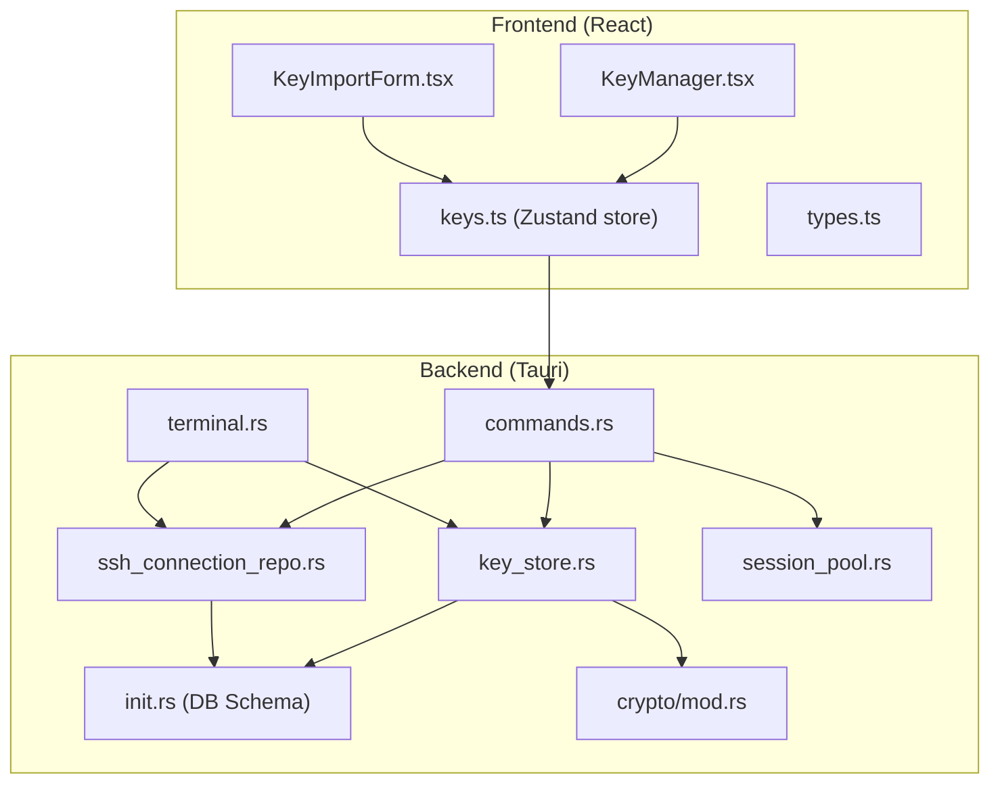
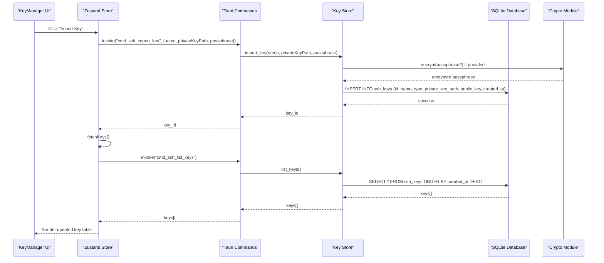
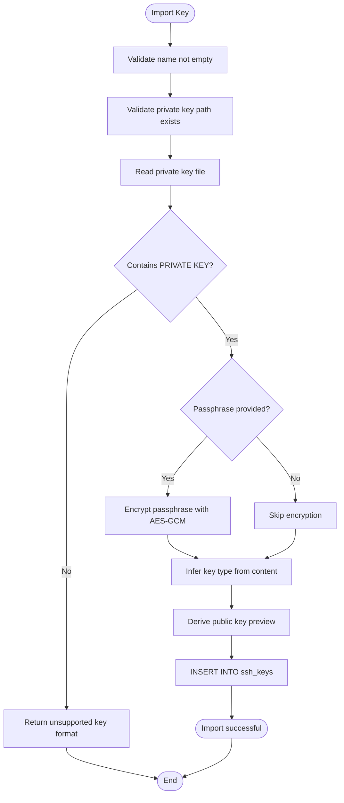
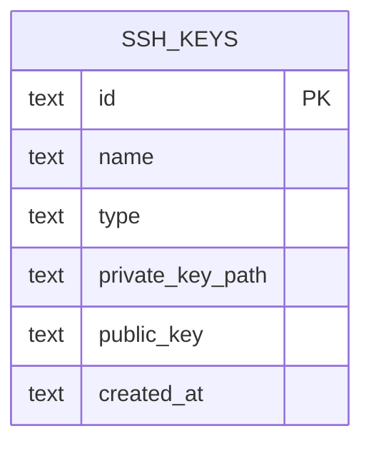
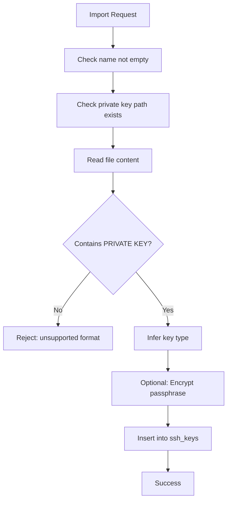
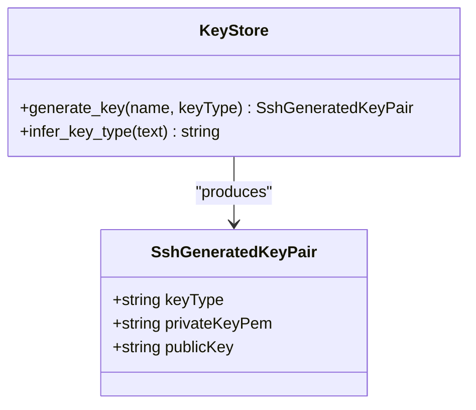
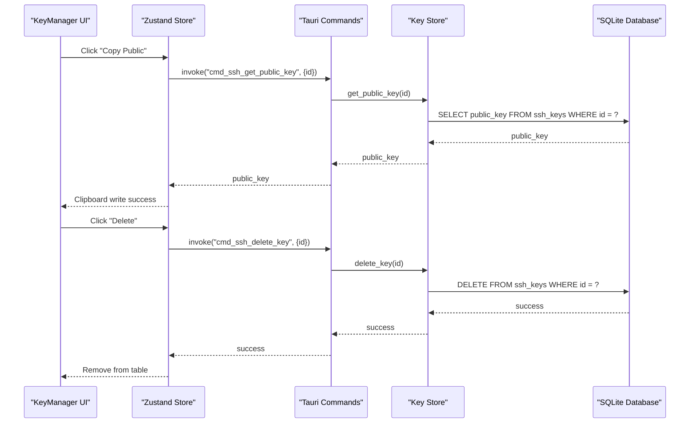
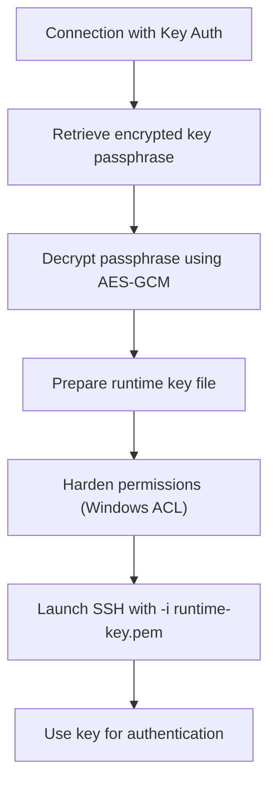
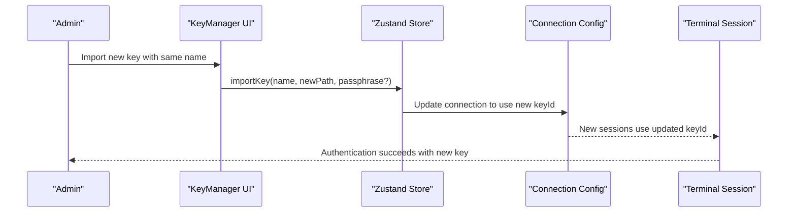
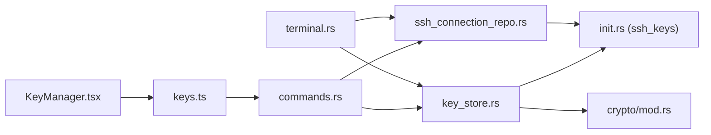

# SSH Key Management

<cite>
**Referenced Files in This Document**
- [keys.ts](file://src/plugins/ssh-client/store/keys.ts)
- [KeyManager.tsx](file://src/plugins/ssh-client/views/KeyManager.tsx)
- [KeyImportForm.tsx](file://src/plugins/ssh-client/components/KeyImportForm.tsx)
- [types.ts](file://src/plugins/ssh-client/types.ts)
- [key_store.rs](file://src-tauri/src/plugins/ssh/key_store.rs)
- [commands.rs](file://src-tauri/src/plugins/ssh/commands.rs)
- [init.rs](file://src-tauri/src/db/init.rs)
- [ssh_connection_repo.rs](file://src-tauri/src/db/ssh_connection_repo.rs)
- [terminal.rs](file://src-tauri/src/plugins/ssh/terminal.rs)
- [session_pool.rs](file://src-tauri/src/plugins/ssh/session_pool.rs)
- [crypto/mod.rs](file://src-tauri/src/crypto/mod.rs)
</cite>

## Table of Contents
1. [Introduction](#introduction)
2. [Project Structure](#project-structure)
3. [Core Components](#core-components)
4. [Architecture Overview](#architecture-overview)
5. [Detailed Component Analysis](#detailed-component-analysis)
6. [Dependency Analysis](#dependency-analysis)
7. [Performance Considerations](#performance-considerations)
8. [Troubleshooting Guide](#troubleshooting-guide)
9. [Conclusion](#conclusion)

## Introduction
This document provides comprehensive coverage of SSH key management functionality within the application. It explains how SSH keys are imported, exported, stored, validated, and used for authentication. The documentation covers supported key formats, key generation, key pair management, security practices, passphrase protection, and operational procedures for key rotation. Practical examples demonstrate importing existing keys, generating new key pairs, and managing key collections. Additionally, it addresses common key format issues and troubleshooting authentication problems.

## Project Structure
The SSH key management system spans both the frontend React application and the Rust backend Tauri plugin. The frontend provides a user interface for key operations, while the backend handles secure storage, cryptographic operations, and integration with SSH connections.

**Diagram sources**
- [KeyManager.tsx:1-122](file://src/plugins/ssh-client/views/KeyManager.tsx#L1-L122)
- [KeyImportForm.tsx:1-43](file://src/plugins/ssh-client/components/KeyImportForm.tsx#L1-L43)
- [keys.ts:1-47](file://src/plugins/ssh-client/store/keys.ts#L1-L47)
- [types.ts:1-115](file://src/plugins/ssh-client/types.ts#L1-L115)
- [commands.rs:1-266](file://src-tauri/src/plugins/ssh/commands.rs#L1-L266)
- [key_store.rs:1-153](file://src-tauri/src/plugins/ssh/key_store.rs#L1-L153)
- [init.rs:56-63](file://src-tauri/src/db/init.rs#L56-L63)
- [ssh_connection_repo.rs:1-218](file://src-tauri/src/db/ssh_connection_repo.rs#L1-L218)
- [terminal.rs:196-368](file://src-tauri/src/plugins/ssh/terminal.rs#L196-L368)
- [session_pool.rs:105-139](file://src-tauri/src/plugins/ssh/session_pool.rs#L105-L139)
- [crypto/mod.rs:1-75](file://src-tauri/src/crypto/mod.rs#L1-L75)

**Section sources**
- [keys.ts:1-47](file://src/plugins/ssh-client/store/keys.ts#L1-L47)
- [KeyManager.tsx:1-122](file://src/plugins/ssh-client/views/KeyManager.tsx#L1-L122)
- [KeyImportForm.tsx:1-43](file://src/plugins/ssh-client/components/KeyImportForm.tsx#L1-L43)
- [types.ts:67-80](file://src/plugins/ssh-client/types.ts#L67-L80)
- [commands.rs:109-139](file://src-tauri/src/plugins/ssh/commands.rs#L109-L139)
- [key_store.rs:39-108](file://src-tauri/src/plugins/ssh/key_store.rs#L39-L108)
- [init.rs:56-63](file://src-tauri/src/db/init.rs#L56-L63)
- [ssh_connection_repo.rs:205-217](file://src-tauri/src/db/ssh_connection_repo.rs#L205-L217)
- [terminal.rs:196-368](file://src-tauri/src/plugins/ssh/terminal.rs#L196-L368)
- [session_pool.rs:105-139](file://src-tauri/src/plugins/ssh/session_pool.rs#L105-L139)
- [crypto/mod.rs:1-75](file://src-tauri/src/crypto/mod.rs#L1-L75)

## Core Components
- Frontend Key Store: Manages key operations (list, import, delete, generate, get public key) and synchronizes with backend commands.
- Key Manager UI: Provides a table view of keys, actions to copy public keys, delete keys, import keys, and generate new keys.
- Key Import Form: Collects key name, private key path, and optional passphrase for import.
- Backend Key Store: Handles key validation, type inference, encryption of passphrases, database persistence, and public key derivation.
- Commands Layer: Exposes Tauri commands for frontend-to-backend communication.
- Database Schema: Defines the ssh_keys table for persistent storage.
- Crypto Module: Provides AES-GCM encryption/decryption for sensitive data like passphrases.
- SSH Connection Repository: Stores connection configurations and retrieves encrypted secrets for authentication.
- Terminal Integration: Uses imported keys for SSH authentication and manages runtime key files.

**Section sources**
- [keys.ts:6-46](file://src/plugins/ssh-client/store/keys.ts#L6-L46)
- [KeyManager.tsx:7-121](file://src/plugins/ssh-client/views/KeyManager.tsx#L7-L121)
- [KeyImportForm.tsx:3-42](file://src/plugins/ssh-client/components/KeyImportForm.tsx#L3-L42)
- [types.ts:67-80](file://src/plugins/ssh-client/types.ts#L67-L80)
- [key_store.rs:39-152](file://src-tauri/src/plugins/ssh/key_store.rs#L39-L152)
- [commands.rs:109-139](file://src-tauri/src/plugins/ssh/commands.rs#L109-L139)
- [init.rs:56-63](file://src-tauri/src/db/init.rs#L56-L63)
- [crypto/mod.rs:40-74](file://src-tauri/src/crypto/mod.rs#L40-L74)
- [ssh_connection_repo.rs:176-217](file://src-tauri/src/db/ssh_connection_repo.rs#L176-L217)
- [terminal.rs:196-368](file://src-tauri/src/plugins/ssh/terminal.rs#L196-L368)

## Architecture Overview
The system follows a layered architecture:
- UI Layer: React components manage user interactions and present key operations.
- Store Layer: Zustand state management coordinates frontend actions and backend invocations.
- Commands Layer: Tauri commands bridge frontend and backend.
- Storage Layer: SQLite database persists key metadata and connection secrets.
- Crypto Layer: AES-GCM encryption protects sensitive data.
- SSH Integration: Runtime key files and SSH client configuration enable authentication.

**Diagram sources**
- [KeyManager.tsx:74-83](file://src/plugins/ssh-client/views/KeyManager.tsx#L74-L83)
- [keys.ts:30-32](file://src/plugins/ssh-client/store/keys.ts#L30-L32)
- [commands.rs:114-121](file://src-tauri/src/plugins/ssh/commands.rs#L114-L121)
- [key_store.rs:66-108](file://src-tauri/src/plugins/ssh/key_store.rs#L66-L108)
- [init.rs:56-63](file://src-tauri/src/db/init.rs#L56-L63)
- [crypto/mod.rs:40-54](file://src-tauri/src/crypto/mod.rs#L40-L54)

## Detailed Component Analysis

### Key Import and Export Operations
- Import Key:
  - Frontend collects name, private key path, and optional passphrase.
  - Backend validates the file exists and contains a private key marker.
  - Passphrase is encrypted using AES-GCM if provided.
  - Key type is inferred from content markers.
  - Public key preview is derived and stored.
  - Record inserted into ssh_keys table with UUID id and creation timestamp.
- Export/Display Public Key:
  - Frontend requests public key by id.
  - Backend retrieves public key from database.
  - Frontend copies public key to clipboard.

**Diagram sources**
- [KeyImportForm.tsx:26-38](file://src/plugins/ssh-client/components/KeyImportForm.tsx#L26-L38)
- [keys.ts:30-32](file://src/plugins/ssh-client/store/keys.ts#L30-L32)
- [commands.rs:114-121](file://src-tauri/src/plugins/ssh/commands.rs#L114-L121)
- [key_store.rs:66-108](file://src-tauri/src/plugins/ssh/key_store.rs#L66-L108)
- [key_store.rs:15-25](file://src-tauri/src/plugins/ssh/key_store.rs#L15-L25)
- [key_store.rs:27-37](file://src-tauri/src/plugins/ssh/key_store.rs#L27-L37)
- [init.rs:56-63](file://src-tauri/src/db/init.rs#L56-L63)
- [crypto/mod.rs:40-54](file://src-tauri/src/crypto/mod.rs#L40-L54)

**Section sources**
- [KeyImportForm.tsx:9-42](file://src/plugins/ssh-client/components/KeyImportForm.tsx#L9-L42)
- [keys.ts:30-32](file://src/plugins/ssh-client/store/keys.ts#L30-L32)
- [commands.rs:114-121](file://src-tauri/src/plugins/ssh/commands.rs#L114-L121)
- [key_store.rs:66-108](file://src-tauri/src/plugins/ssh/key_store.rs#L66-L108)
- [key_store.rs:15-25](file://src-tauri/src/plugins/ssh/key_store.rs#L15-L25)
- [key_store.rs:27-37](file://src-tauri/src/plugins/ssh/key_store.rs#L27-L37)
- [init.rs:56-63](file://src-tauri/src/db/init.rs#L56-L63)
- [crypto/mod.rs:40-54](file://src-tauri/src/crypto/mod.rs#L40-L54)

### Key Storage and Organization
- Database Schema: The ssh_keys table stores id, name, type, private_key_path, public_key, and created_at.
- Persistence: Keys are persisted upon import; listing retrieves all keys ordered by creation time.
- Metadata: Each key record includes human-friendly name, detected type, filesystem path, and timestamp.

**Diagram sources**
- [init.rs:56-63](file://src-tauri/src/db/init.rs#L56-L63)

**Section sources**
- [init.rs:56-63](file://src-tauri/src/db/init.rs#L56-L63)
- [key_store.rs:39-64](file://src-tauri/src/plugins/ssh/key_store.rs#L39-L64)

### Key Validation Processes
- Format Validation: Ensures the private key file contains a private key marker.
- Type Inference: Detects key type based on content markers (e.g., Ed25519, RSA, ECDSA).
- Existence Check: Verifies the private key path exists before import.
- Passphrase Handling: Validates presence of passphrase when provided; encrypts if present.

**Diagram sources**
- [key_store.rs:72-86](file://src-tauri/src/plugins/ssh/key_store.rs#L72-L86)
- [key_store.rs:15-25](file://src-tauri/src/plugins/ssh/key_store.rs#L15-L25)
- [crypto/mod.rs:40-54](file://src-tauri/src/crypto/mod.rs#L40-L54)

**Section sources**
- [key_store.rs:72-86](file://src-tauri/src/plugins/ssh/key_store.rs#L72-L86)
- [key_store.rs:15-25](file://src-tauri/src/plugins/ssh/key_store.rs#L15-L25)
- [crypto/mod.rs:40-54](file://src-tauri/src/crypto/mod.rs#L40-L54)

### Supported Key Formats and Generation
- Supported Formats: The system recognizes Ed25519, RSA, and ECDSA based on content markers.
- Generation: New key pairs are generated with configurable types (Ed25519 or RSA). Generated keys are returned as PEM and public key strings for display and storage.

**Diagram sources**
- [types.ts:76-80](file://src/plugins/ssh-client/types.ts#L76-L80)
- [key_store.rs:127-152](file://src-tauri/src/plugins/ssh/key_store.rs#L127-L152)
- [key_store.rs:15-25](file://src-tauri/src/plugins/ssh/key_store.rs#L15-L25)

**Section sources**
- [types.ts:76-80](file://src/plugins/ssh-client/types.ts#L76-L80)
- [key_store.rs:127-152](file://src-tauri/src/plugins/ssh/key_store.rs#L127-L152)
- [key_store.rs:15-25](file://src-tauri/src/plugins/ssh/key_store.rs#L15-L25)

### Key Pair Management
- Listing: Retrieves all keys ordered by creation time.
- Deletion: Removes a key by id from the database.
- Public Key Retrieval: Fetches the stored public key for a given id.
- UI Actions: Copy public key to clipboard and delete key from the table.

**Diagram sources**
- [KeyManager.tsx:54-67](file://src/plugins/ssh-client/views/KeyManager.tsx#L54-L67)
- [keys.ts:34-36](file://src/plugins/ssh-client/store/keys.ts#L34-L36)
- [commands.rs:123-126](file://src-tauri/src/plugins/ssh/commands.rs#L123-L126)
- [key_store.rs:110-125](file://src-tauri/src/plugins/ssh/key_store.rs#L110-L125)
- [init.rs:56-63](file://src-tauri/src/db/init.rs#L56-L63)

**Section sources**
- [KeyManager.tsx:54-67](file://src/plugins/ssh-client/views/KeyManager.tsx#L54-L67)
- [keys.ts:34-36](file://src/plugins/ssh-client/store/keys.ts#L34-L36)
- [commands.rs:123-126](file://src-tauri/src/plugins/ssh/commands.rs#L123-L126)
- [key_store.rs:110-125](file://src-tauri/src/plugins/ssh/key_store.rs#L110-L125)

### Key Security Practices and Passphrase Protection
- Encryption: Passphrases associated with keys are encrypted using AES-GCM with a persistent application key.
- Secure Storage: Encrypted passphrases are stored alongside connection configurations.
- Runtime Key Files: During SSH sessions, private key content is temporarily written to a runtime key file with hardened permissions.
- Permission Hardening: On Windows, ACLs are reset and restricted to the current user; sensitive groups are removed.

**Diagram sources**
- [ssh_connection_repo.rs:176-203](file://src-tauri/src/db/ssh_connection_repo.rs#L176-L203)
- [crypto/mod.rs:40-74](file://src-tauri/src/crypto/mod.rs#L40-L74)
- [terminal.rs:196-216](file://src-tauri/src/plugins/ssh/terminal.rs#L196-L216)
- [terminal.rs:218-284](file://src-tauri/src/plugins/ssh/terminal.rs#L218-L284)

**Section sources**
- [ssh_connection_repo.rs:176-203](file://src-tauri/src/db/ssh_connection_repo.rs#L176-L203)
- [crypto/mod.rs:40-74](file://src-tauri/src/crypto/mod.rs#L40-L74)
- [terminal.rs:196-216](file://src-tauri/src/plugins/ssh/terminal.rs#L196-L216)
- [terminal.rs:218-284](file://src-tauri/src/plugins/ssh/terminal.rs#L218-L284)

### Key Rotation Procedures
- Replace Private Key: Import a new key with the same logical name; update connection configuration to reference the new key id.
- Update Runtime Keys: Existing sessions using the old key will continue until closed; new sessions will use the updated key.
- Cleanup Old Keys: Delete unused keys to minimize risk exposure.

**Diagram sources**
- [KeyManager.tsx:74-83](file://src/plugins/ssh-client/views/KeyManager.tsx#L74-L83)
- [keys.ts:30-32](file://src/plugins/ssh-client/store/keys.ts#L30-L32)
- [ssh_connection_repo.rs:117-167](file://src-tauri/src/db/ssh_connection_repo.rs#L117-L167)
- [terminal.rs:311-326](file://src-tauri/src/plugins/ssh/terminal.rs#L311-L326)

**Section sources**
- [KeyManager.tsx:74-83](file://src/plugins/ssh-client/views/KeyManager.tsx#L74-L83)
- [keys.ts:30-32](file://src/plugins/ssh-client/store/keys.ts#L30-L32)
- [ssh_connection_repo.rs:117-167](file://src-tauri/src/db/ssh_connection_repo.rs#L117-L167)
- [terminal.rs:311-326](file://src-tauri/src/plugins/ssh/terminal.rs#L311-L326)

### Key Import from Various Sources
- Local File System: Import from a specified private key path on disk.
- Passphrase Support: Optional passphrase is encrypted and stored securely.
- Type Detection: Automatically detects key type from file content.

**Section sources**
- [KeyImportForm.tsx:26-38](file://src/plugins/ssh-client/components/KeyImportForm.tsx#L26-L38)
- [key_store.rs:66-108](file://src-tauri/src/plugins/ssh/key_store.rs#L66-L108)
- [key_store.rs:15-25](file://src-tauri/src/plugins/ssh/key_store.rs#L15-L25)
- [crypto/mod.rs:40-54](file://src-tauri/src/crypto/mod.rs#L40-L54)

### Key Metadata Management and Usage Tracking
- Metadata: Keys include id, name, type, private_key_path, and created_at.
- Usage: Keys are referenced by SSH connections via key_id; public keys are available for display and copying.
- Tracking: Creation timestamps enable sorting and auditing.

**Section sources**
- [types.ts:67-74](file://src/plugins/ssh-client/types.ts#L67-L74)
- [init.rs:56-63](file://src-tauri/src/db/init.rs#L56-L63)
- [ssh_connection_repo.rs:205-217](file://src-tauri/src/db/ssh_connection_repo.rs#L205-L217)

### Practical Examples
- Import an SSH Key:
  - Open Key Manager, click "Import Key".
  - Enter a name, select the private key file path, optionally enter a passphrase.
  - Submit; the key is validated, encrypted if needed, and stored.
- Generate a New Key Pair:
  - Open Key Manager, click "Generate Key".
  - Choose key type (Ed25519 or RSA), confirm.
  - View and copy the generated public and private key material.
- Manage Key Collections:
  - Browse the key table, copy public keys, delete unused keys, and update connections to use desired keys.

**Section sources**
- [KeyManager.tsx:74-118](file://src/plugins/ssh-client/views/KeyManager.tsx#L74-L118)
- [KeyImportForm.tsx:9-42](file://src/plugins/ssh-client/components/KeyImportForm.tsx#L9-L42)
- [keys.ts:38-43](file://src/plugins/ssh-client/store/keys.ts#L38-L43)
- [commands.rs:128-134](file://src-tauri/src/plugins/ssh/commands.rs#L128-L134)

## Dependency Analysis
The key management system exhibits clear separation of concerns:
- Frontend depends on Tauri commands for backend operations.
- Backend commands depend on the key store for persistence and cryptography.
- Database schema defines the contract for key storage.
- Crypto module provides encryption primitives.
- SSH connection repository integrates keys with connection configurations.
- Terminal module uses runtime key files for authentication.

**Diagram sources**
- [KeyManager.tsx:1-122](file://src/plugins/ssh-client/views/KeyManager.tsx#L1-L122)
- [keys.ts:1-47](file://src/plugins/ssh-client/store/keys.ts#L1-L47)
- [commands.rs:109-139](file://src-tauri/src/plugins/ssh/commands.rs#L109-L139)
- [key_store.rs:39-152](file://src-tauri/src/plugins/ssh/key_store.rs#L39-L152)
- [init.rs:56-63](file://src-tauri/src/db/init.rs#L56-L63)
- [ssh_connection_repo.rs:1-218](file://src-tauri/src/db/ssh_connection_repo.rs#L1-L218)
- [terminal.rs:196-368](file://src-tauri/src/plugins/ssh/terminal.rs#L196-L368)
- [crypto/mod.rs:1-75](file://src-tauri/src/crypto/mod.rs#L1-L75)

**Section sources**
- [commands.rs:109-139](file://src-tauri/src/plugins/ssh/commands.rs#L109-L139)
- [key_store.rs:39-152](file://src-tauri/src/plugins/ssh/key_store.rs#L39-L152)
- [init.rs:56-63](file://src-tauri/src/db/init.rs#L56-L63)
- [ssh_connection_repo.rs:1-218](file://src-tauri/src/db/ssh_connection_repo.rs#L1-L218)
- [terminal.rs:196-368](file://src-tauri/src/plugins/ssh/terminal.rs#L196-L368)
- [crypto/mod.rs:1-75](file://src-tauri/src/crypto/mod.rs#L1-L75)

## Performance Considerations
- Database Queries: Key listing uses a single ordered query; ensure indexes are considered if scaling to large key collections.
- Encryption Overhead: AES-GCM encryption/decryption is lightweight; negligible impact for typical key operations.
- Runtime Key Files: Temporary key files are cleaned up on session close; ensure cleanup routines execute reliably.
- UI Responsiveness: Frontend operations are asynchronous; loading states prevent blocking interactions.

## Troubleshooting Guide
- Unsupported Key Format:
  - Symptom: Import fails with "unsupported key format".
  - Cause: Private key file does not contain expected markers.
  - Resolution: Verify the file contains a recognized private key header and is readable.
- Private Key Not Found:
  - Symptom: Import fails with "private key file not found".
  - Cause: Specified path does not exist.
  - Resolution: Correct the path or ensure the file exists.
- Key Type Inference Issues:
  - Symptom: Unknown key type reported.
  - Cause: Content markers not recognized.
  - Resolution: Confirm key format and content markers.
- Passphrase Encryption Failures:
  - Symptom: Import succeeds but passphrase not stored.
  - Cause: Encryption errors or empty passphrase.
  - Resolution: Ensure passphrase is provided and encryption succeeds.
- Authentication Failures:
  - Symptom: SSH connection fails with key-based auth.
  - Cause: Incorrect key id, missing runtime key file, or permission issues.
  - Resolution: Verify connection references correct key id, ensure runtime key permissions are hardened, and retry authentication.
- Permission Denied on Windows:
  - Symptom: Runtime key file creation or permission hardening fails.
  - Cause: Insufficient privileges or ACL manipulation errors.
  - Resolution: Run with appropriate privileges and review system logs.

**Section sources**
- [key_store.rs:72-86](file://src-tauri/src/plugins/ssh/key_store.rs#L72-L86)
- [key_store.rs:78-81](file://src-tauri/src/plugins/ssh/key_store.rs#L78-L81)
- [key_store.rs:93-96](file://src-tauri/src/plugins/ssh/key_store.rs#L93-L96)
- [crypto/mod.rs:40-54](file://src-tauri/src/crypto/mod.rs#L40-L54)
- [terminal.rs:218-284](file://src-tauri/src/plugins/ssh/terminal.rs#L218-L284)
- [terminal.rs:311-326](file://src-tauri/src/plugins/ssh/terminal.rs#L311-L326)

## Conclusion
The SSH key management system provides a robust foundation for importing, storing, validating, generating, and using SSH keys. It emphasizes security through encryption of sensitive data, careful handling of runtime key files, and clear separation between frontend UX and backend operations. By following the documented procedures and best practices, users can confidently manage SSH keys, rotate credentials, and troubleshoot common issues.