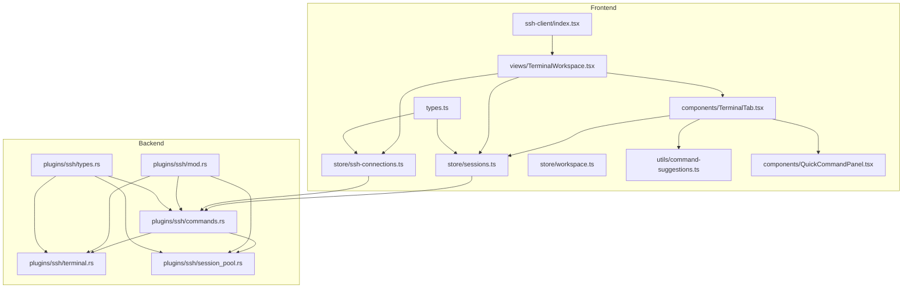
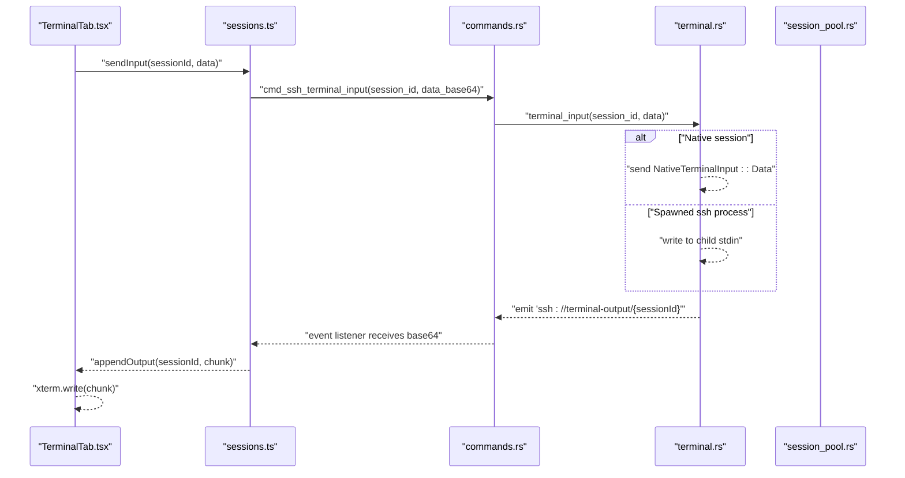
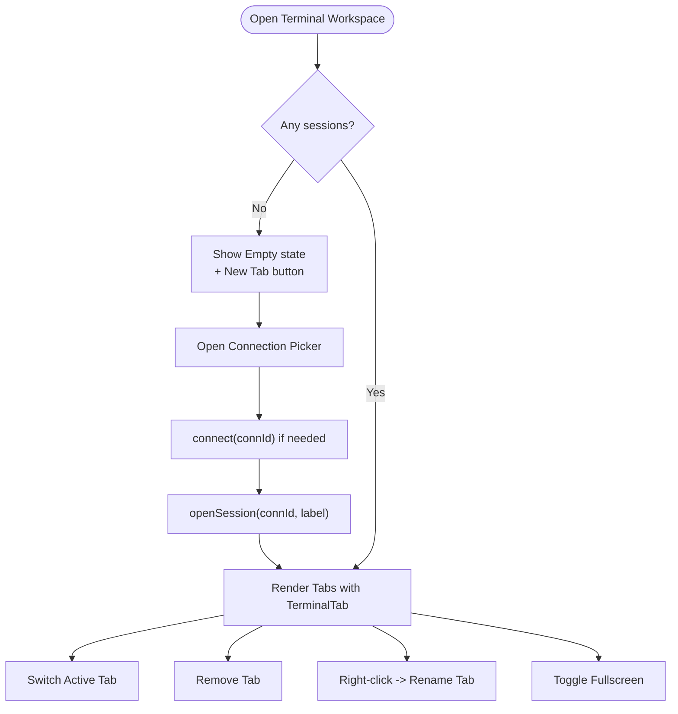
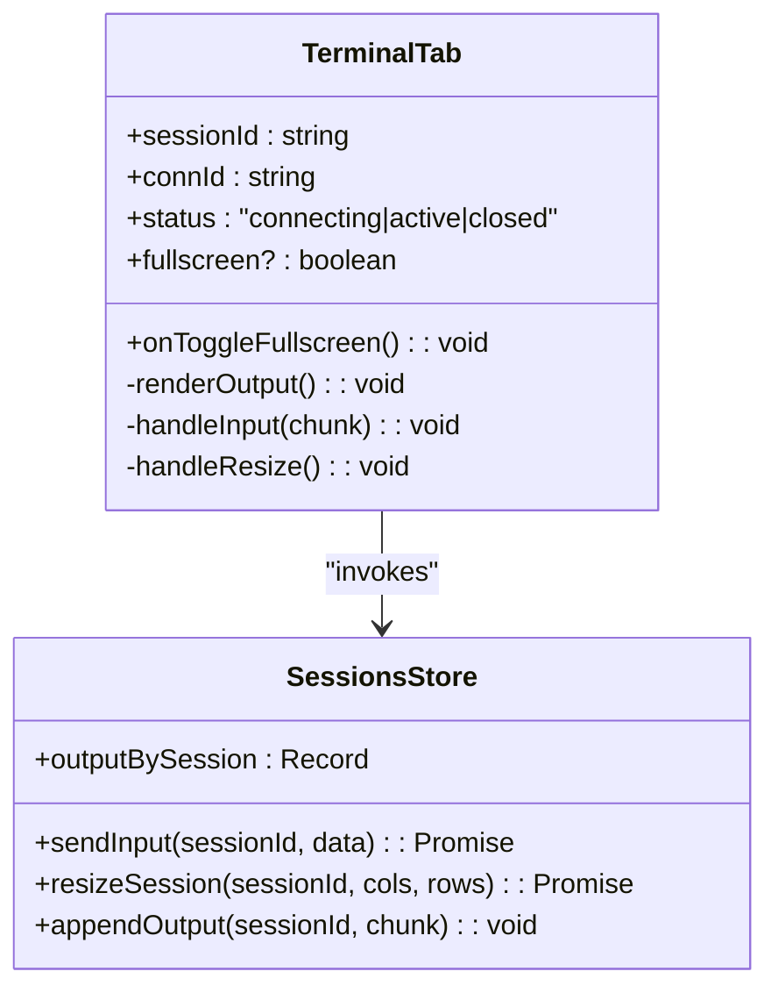
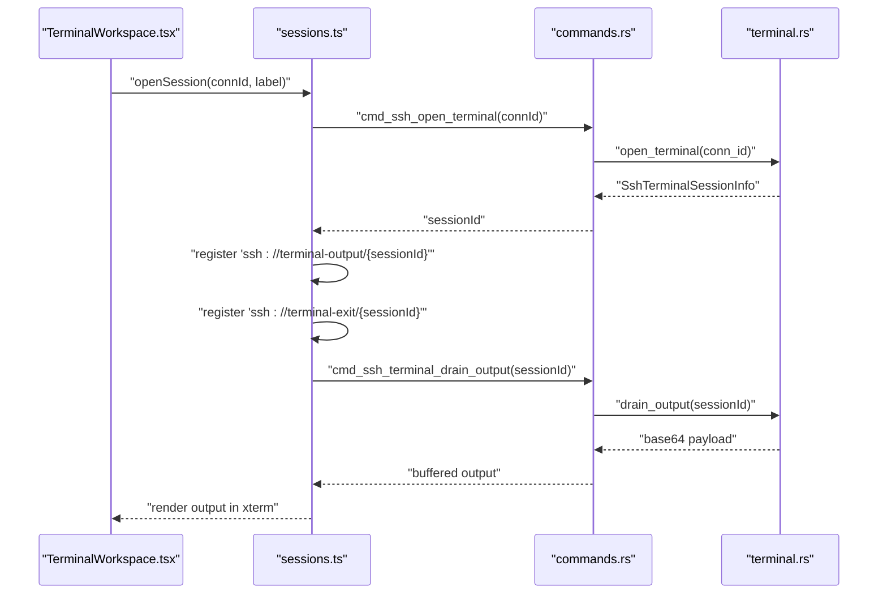
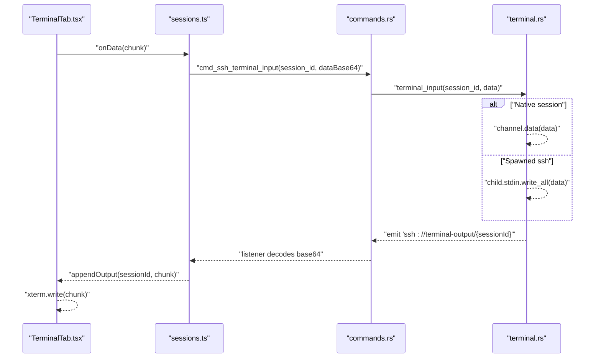
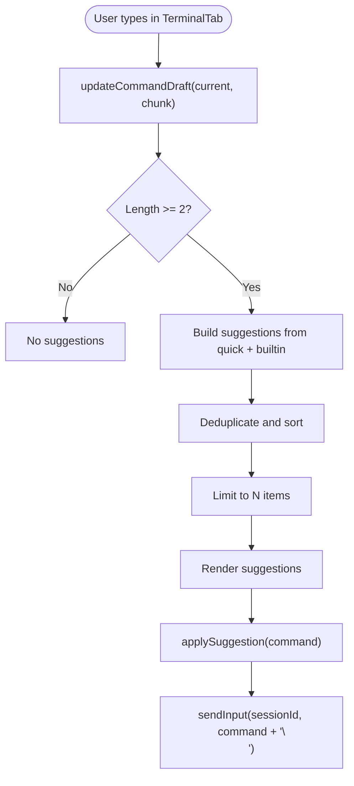
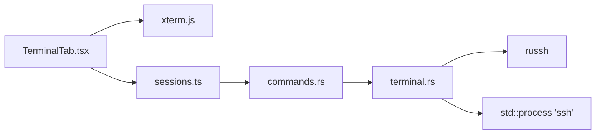
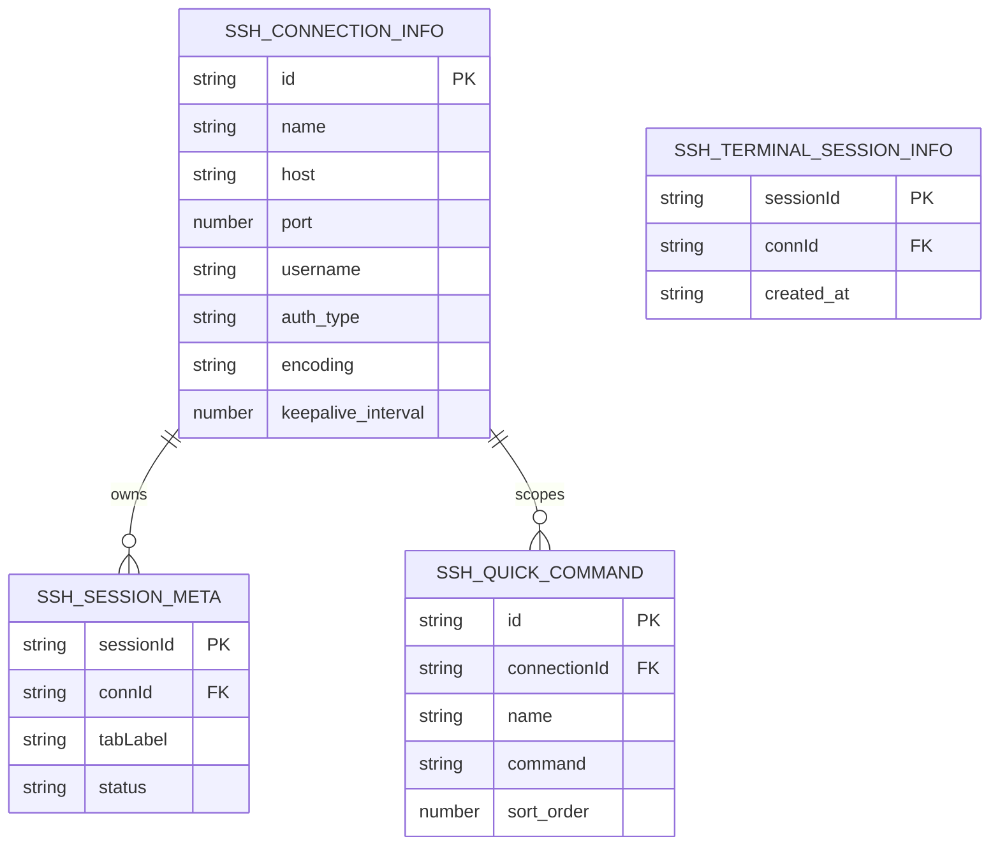

# Terminal Emulation

<cite>
**Referenced Files in This Document**
- [index.tsx](file://src/plugins/ssh-client/index.tsx)
- [TerminalWorkspace.tsx](file://src/plugins/ssh-client/views/TerminalWorkspace.tsx)
- [TerminalTab.tsx](file://src/plugins/ssh-client/components/TerminalTab.tsx)
- [workspace.ts](file://src/plugins/ssh-client/store/workspace.ts)
- [sessions.ts](file://src/plugins/ssh-client/store/sessions.ts)
- [ssh-connections.ts](file://src/plugins/ssh-client/store/ssh-connections.ts)
- [command-suggestions.ts](file://src/plugins/ssh-client/utils/command-suggestions.ts)
- [QuickCommandPanel.tsx](file://src/plugins/ssh-client/components/QuickCommandPanel.tsx)
- [types.ts](file://src/plugins/ssh-client/types.ts)
- [mod.rs](file://src-tauri/src/plugins/ssh/mod.rs)
- [terminal.rs](file://src-tauri/src/plugins/ssh/terminal.rs)
- [session_pool.rs](file://src-tauri/src/plugins/ssh/session_pool.rs)
- [commands.rs](file://src-tauri/src/plugins/ssh/commands.rs)
- [types.rs](file://src-tauri/src/plugins/ssh/types.rs)
</cite>

## Table of Contents
1. [Introduction](#introduction)
2. [Project Structure](#project-structure)
3. [Core Components](#core-components)
4. [Architecture Overview](#architecture-overview)
5. [Detailed Component Analysis](#detailed-component-analysis)
6. [Dependency Analysis](#dependency-analysis)
7. [Performance Considerations](#performance-considerations)
8. [Troubleshooting Guide](#troubleshooting-guide)
9. [Conclusion](#conclusion)
10. [Appendices](#appendices)

## Introduction
This document describes the SSH terminal emulation system implemented in the project. It covers the terminal workspace interface, tab management, session lifecycle, rendering pipeline, command execution, interactive shell support, customization options, keyboard shortcuts, command history, session persistence, tab switching, multi-session management, performance optimization, session recovery, and troubleshooting.

## Project Structure
The terminal emulation spans two layers:
- Frontend (React + Zustand): Provides UI, tabbed workspace, xterm.js rendering, command suggestions, and quick commands.
- Backend (Tauri + Rust): Manages SSH sessions, PTY allocation, streaming output, resizing, and emitting events to the frontend.

**Diagram sources**
- [index.tsx:1-66](file://src/plugins/ssh-client/index.tsx#L1-L66)
- [TerminalWorkspace.tsx:1-187](file://src/plugins/ssh-client/views/TerminalWorkspace.tsx#L1-L187)
- [TerminalTab.tsx:1-189](file://src/plugins/ssh-client/components/TerminalTab.tsx#L1-L189)
- [sessions.ts:1-192](file://src/plugins/ssh-client/store/sessions.ts#L1-L192)
- [ssh-connections.ts:1-77](file://src/plugins/ssh-client/store/ssh-connections.ts#L1-L77)
- [command-suggestions.ts:1-106](file://src/plugins/ssh-client/utils/command-suggestions.ts#L1-L106)
- [QuickCommandPanel.tsx:1-123](file://src/plugins/ssh-client/components/QuickCommandPanel.tsx#L1-L123)
- [types.ts:1-115](file://src/plugins/ssh-client/types.ts#L1-L115)
- [mod.rs:1-7](file://src-tauri/src/plugins/ssh/mod.rs#L1-L7)
- [commands.rs:1-266](file://src-tauri/src/plugins/ssh/commands.rs#L1-L266)
- [terminal.rs:1-870](file://src-tauri/src/plugins/ssh/terminal.rs#L1-L870)
- [session_pool.rs:1-172](file://src-tauri/src/plugins/ssh/session_pool.rs#L1-L172)
- [types.rs:1-93](file://src-tauri/src/plugins/ssh/types.rs#L1-L93)

**Section sources**
- [index.tsx:1-66](file://src/plugins/ssh-client/index.tsx#L1-L66)
- [TerminalWorkspace.tsx:1-187](file://src/plugins/ssh-client/views/TerminalWorkspace.tsx#L1-L187)
- [TerminalTab.tsx:1-189](file://src/plugins/ssh-client/components/TerminalTab.tsx#L1-L189)
- [sessions.ts:1-192](file://src/plugins/ssh-client/store/sessions.ts#L1-L192)
- [ssh-connections.ts:1-77](file://src/plugins/ssh-client/store/ssh-connections.ts#L1-L77)
- [command-suggestions.ts:1-106](file://src/plugins/ssh-client/utils/command-suggestions.ts#L1-L106)
- [QuickCommandPanel.tsx:1-123](file://src/plugins/ssh-client/components/QuickCommandPanel.tsx#L1-L123)
- [types.ts:1-115](file://src/plugins/ssh-client/types.ts#L1-L115)
- [mod.rs:1-7](file://src-tauri/src/plugins/ssh/mod.rs#L1-L7)
- [commands.rs:1-266](file://src-tauri/src/plugins/ssh/commands.rs#L1-L266)
- [terminal.rs:1-870](file://src-tauri/src/plugins/ssh/terminal.rs#L1-L870)
- [session_pool.rs:1-172](file://src-tauri/src/plugins/ssh/session_pool.rs#L1-L172)
- [types.rs:1-93](file://src-tauri/src/plugins/ssh/types.rs#L1-L93)

## Core Components
- Terminal Workspace: Hosts the tabbed terminal UI, new tab picker, rename modal, and fullscreen mode.
- Terminal Tab: Renders xterm.js, handles input, output streaming, resizing, and suggestion panel.
- Session Store: Manages sessions, output buffers, quick commands, and invokes backend commands.
- Connection Store: Lists, saves, connects/disconnects SSH connections and tracks connected IDs.
- Command Suggestions: Provides quick and built-in command suggestions while typing.
- Quick Command Panel: Saves, runs, and deletes reusable commands scoped per connection or globally.
- Backend Commands: Bridge between frontend and Rust backend for opening/closing terminals, sending input, resizing, draining output, and managing quick commands.

**Section sources**
- [TerminalWorkspace.tsx:1-187](file://src/plugins/ssh-client/views/TerminalWorkspace.tsx#L1-L187)
- [TerminalTab.tsx:1-189](file://src/plugins/ssh-client/components/TerminalTab.tsx#L1-L189)
- [sessions.ts:1-192](file://src/plugins/ssh-client/store/sessions.ts#L1-L192)
- [ssh-connections.ts:1-77](file://src/plugins/ssh-client/store/ssh-connections.ts#L1-L77)
- [command-suggestions.ts:1-106](file://src/plugins/ssh-client/utils/command-suggestions.ts#L1-L106)
- [QuickCommandPanel.tsx:1-123](file://src/plugins/ssh-client/components/QuickCommandPanel.tsx#L1-L123)
- [commands.rs:77-106](file://src-tauri/src/plugins/ssh/commands.rs#L77-L106)

## Architecture Overview
The system uses a React frontend with xterm.js for rendering and a Tauri/Rust backend for SSH/PTY management. The frontend emits commands via Tauri invocations, and the backend streams output back through events.

**Diagram sources**
- [TerminalTab.tsx:68-71](file://src/plugins/ssh-client/components/TerminalTab.tsx#L68-L71)
- [sessions.ts:169-174](file://src/plugins/ssh-client/store/sessions.ts#L169-L174)
- [commands.rs:86-91](file://src-tauri/src/plugins/ssh/commands.rs#L86-L91)
- [terminal.rs:730-761](file://src-tauri/src/plugins/ssh/terminal.rs#L730-L761)

**Section sources**
- [TerminalTab.tsx:44-85](file://src/plugins/ssh-client/components/TerminalTab.tsx#L44-L85)
- [sessions.ts:106-138](file://src/plugins/ssh-client/store/sessions.ts#L106-L138)
- [commands.rs:77-106](file://src-tauri/src/plugins/ssh/commands.rs#L77-L106)
- [terminal.rs:522-694](file://src-tauri/src/plugins/ssh/terminal.rs#L522-L694)

## Detailed Component Analysis

### Terminal Workspace
- Manages active tab, new tab creation, renaming, closing, and fullscreen mode.
- Integrates connection picker and session list with tabs.
- Uses Ant Design Tabs for multi-session UX.

**Diagram sources**
- [TerminalWorkspace.tsx:26-32](file://src/plugins/ssh-client/views/TerminalWorkspace.tsx#L26-L32)
- [TerminalWorkspace.tsx:106-148](file://src/plugins/ssh-client/views/TerminalWorkspace.tsx#L106-L148)

**Section sources**
- [TerminalWorkspace.tsx:1-187](file://src/plugins/ssh-client/views/TerminalWorkspace.tsx#L1-L187)
- [ssh-connections.ts:64-75](file://src/plugins/ssh-client/store/ssh-connections.ts#L64-L75)
- [sessions.ts:85-139](file://src/plugins/ssh-client/store/sessions.ts#L85-L139)

### Terminal Tab Rendering and Interaction
- Initializes xterm.js with addons (fit, web links), applies theme, and writes buffered output.
- Listens to onData to forward input to backend and updates command draft for suggestions.
- Observes container resize to fit terminal and propagate cols/rows to backend.

**Diagram sources**
- [TerminalTab.tsx:16-30](file://src/plugins/ssh-client/components/TerminalTab.tsx#L16-L30)
- [TerminalTab.tsx:100-112](file://src/plugins/ssh-client/components/TerminalTab.tsx#L100-L112)
- [sessions.ts:169-177](file://src/plugins/ssh-client/store/sessions.ts#L169-L177)

**Section sources**
- [TerminalTab.tsx:44-85](file://src/plugins/ssh-client/components/TerminalTab.tsx#L44-L85)
- [TerminalTab.tsx:100-112](file://src/plugins/ssh-client/components/TerminalTab.tsx#L100-L112)
- [sessions.ts:169-177](file://src/plugins/ssh-client/store/sessions.ts#L169-L177)

### Session Management
- Opens a terminal session via backend command, registers per-session listeners for output and exit.
- Drains buffered output on initial open to avoid missing early data.
- Closes sessions cleanly, unlistening and removing state.

**Diagram sources**
- [TerminalWorkspace.tsx:26-32](file://src/plugins/ssh-client/views/TerminalWorkspace.tsx#L26-L32)
- [sessions.ts:85-139](file://src/plugins/ssh-client/store/sessions.ts#L85-L139)
- [commands.rs:77-106](file://src-tauri/src/plugins/ssh/commands.rs#L77-L106)
- [terminal.rs:696-728](file://src-tauri/src/plugins/ssh/terminal.rs#L696-L728)

**Section sources**
- [sessions.ts:55-68](file://src/plugins/ssh-client/store/sessions.ts#L55-L68)
- [sessions.ts:106-139](file://src/plugins/ssh-client/store/sessions.ts#L106-L139)
- [commands.rs:77-106](file://src-tauri/src/plugins/ssh/commands.rs#L77-L106)
- [terminal.rs:522-694](file://src-tauri/src/plugins/ssh/terminal.rs#L522-L694)

### Command Execution and Interactive Shell
- Input is forwarded to backend via base64-encoded payload.
- Backend either writes to a spawned ssh process stdin or to a native russh channel.
- Output is streamed back via events and appended to the terminal.

**Diagram sources**
- [TerminalTab.tsx:68-71](file://src/plugins/ssh-client/components/TerminalTab.tsx#L68-L71)
- [sessions.ts:169-174](file://src/plugins/ssh-client/store/sessions.ts#L169-L174)
- [commands.rs:86-91](file://src-tauri/src/plugins/ssh/commands.rs#L86-L91)
- [terminal.rs:730-761](file://src-tauri/src/plugins/ssh/terminal.rs#L730-L761)

**Section sources**
- [TerminalTab.tsx:68-71](file://src/plugins/ssh-client/components/TerminalTab.tsx#L68-L71)
- [sessions.ts:169-174](file://src/plugins/ssh-client/store/sessions.ts#L169-L174)
- [commands.rs:86-91](file://src-tauri/src/plugins/ssh/commands.rs#L86-L91)
- [terminal.rs:730-761](file://src-tauri/src/plugins/ssh/terminal.rs#L730-L761)

### Command Suggestions and Quick Commands
- Suggests commands from user-defined quick commands and built-in list.
- Draft is updated from typed input and cleared on Enter/Ctrl+C.
- Suggestions are applied by sending the resolved command to the active session.

**Diagram sources**
- [command-suggestions.ts:45-67](file://src/plugins/ssh-client/utils/command-suggestions.ts#L45-L67)
- [command-suggestions.ts:69-105](file://src/plugins/ssh-client/utils/command-suggestions.ts#L69-L105)
- [TerminalTab.tsx:114-119](file://src/plugins/ssh-client/components/TerminalTab.tsx#L114-L119)

**Section sources**
- [command-suggestions.ts:1-106](file://src/plugins/ssh-client/utils/command-suggestions.ts#L1-L106)
- [QuickCommandPanel.tsx:44-61](file://src/plugins/ssh-client/components/QuickCommandPanel.tsx#L44-L61)
- [sessions.ts:69-84](file://src/plugins/ssh-client/store/sessions.ts#L69-L84)

### Terminal Customization Options
- Theme and font size are configured in xterm initialization.
- Link detection is enabled via web links addon.
- Container border and background are styled for dark theme.

**Section sources**
- [TerminalTab.tsx:48-60](file://src/plugins/ssh-client/components/TerminalTab.tsx#L48-L60)
- [TerminalTab.tsx:153-164](file://src/plugins/ssh-client/components/TerminalTab.tsx#L153-L164)

### Keyboard Shortcuts and Command History
- Backspace/Delete and arrow keys are ignored in draft updates to prevent corruption.
- Ctrl+A/Ctrl+E and Ctrl+K are handled implicitly by xterm.js; the system does not intercept these.
- Command history is not persisted in the frontend; suggestions come from quick commands and built-ins.

**Section sources**
- [command-suggestions.ts:45-67](file://src/plugins/ssh-client/utils/command-suggestions.ts#L45-L67)
- [command-suggestions.ts:9-39](file://src/plugins/ssh-client/utils/command-suggestions.ts#L9-L39)

### Session Persistence and Recovery
- Sessions persist until explicitly closed; output buffering is maintained per session.
- On reconnect, the backend drains pending output and emits it to the frontend.
- Session recovery relies on re-listening to events after reopening a session.

**Section sources**
- [sessions.ts:106-139](file://src/plugins/ssh-client/store/sessions.ts#L106-L139)
- [terminal.rs:696-728](file://src-tauri/src/plugins/ssh/terminal.rs#L696-L728)

### Tab Switching and Multi-Session Management
- Tabs are managed by Ant Design Tabs with editable-card type.
- Each tab corresponds to a session with its own output buffer and listeners.
- Fullscreen toggles per tab; renaming supported via context menu.

**Section sources**
- [TerminalWorkspace.tsx:106-148](file://src/plugins/ssh-client/views/TerminalWorkspace.tsx#L106-L148)
- [TerminalWorkspace.tsx:150-164](file://src/plugins/ssh-client/views/TerminalWorkspace.tsx#L150-L164)

### Practical Examples
- Opening a new terminal tab:
  - Select a connection from the picker and click “+ New Tab”.
  - The system connects (if needed) and opens a new session.
  - See [TerminalWorkspace.tsx:26-32](file://src/plugins/ssh-client/views/TerminalWorkspace.tsx#L26-L32).
- Sending a command:
  - Type in the terminal; input is forwarded to backend and executed on the remote shell.
  - See [TerminalTab.tsx:68-71](file://src/plugins/ssh-client/components/TerminalTab.tsx#L68-L71).
- Using quick commands:
  - Open Quick Commands drawer, save a command, then run it from the drawer or suggestion list.
  - See [QuickCommandPanel.tsx:44-61](file://src/plugins/ssh-client/components/QuickCommandPanel.tsx#L44-L61).

## Dependency Analysis
- Frontend depends on:
  - xterm.js and addons for rendering.
  - Zustand stores for state management.
  - Ant Design components for UI.
- Backend depends on:
  - russh for native SSH sessions.
  - std::process for spawning external ssh.
  - Tauri event system for emitting output and exit events.

**Diagram sources**
- [TerminalTab.tsx:4-7](file://src/plugins/ssh-client/components/TerminalTab.tsx#L4-L7)
- [sessions.ts:1-4](file://src/plugins/ssh-client/store/sessions.ts#L1-L4)
- [commands.rs:1-6](file://src-tauri/src/plugins/ssh/commands.rs#L1-L6)
- [terminal.rs:1-16](file://src-tauri/src/plugins/ssh/terminal.rs#L1-L16)

**Section sources**
- [TerminalTab.tsx:4-7](file://src/plugins/ssh-client/components/TerminalTab.tsx#L4-L7)
- [commands.rs:1-6](file://src-tauri/src/plugins/ssh/commands.rs#L1-L6)
- [terminal.rs:1-16](file://src-tauri/src/plugins/ssh/terminal.rs#L1-L16)

## Performance Considerations
- Output buffering: Backend maintains a pending output buffer per session and drains it on open to avoid missing early data.
- Event-driven rendering: Output chunks are emitted as base64 and decoded in the frontend; this reduces overhead compared to large binary transfers.
- Resize handling: Terminal fit and backend resize notifications ensure efficient rendering and PTY window sizing.
- Keepalive and recovery: Session pool monitors connectivity and attempts reconnection; on failure, sessions are closed and events are emitted.

**Section sources**
- [terminal.rs:696-728](file://src-tauri/src/plugins/ssh/terminal.rs#L696-L728)
- [session_pool.rs:50-103](file://src-tauri/src/plugins/ssh/session_pool.rs#L50-L103)
- [TerminalTab.tsx:72-76](file://src/plugins/ssh-client/components/TerminalTab.tsx#L72-L76)
- [sessions.ts:175-177](file://src/plugins/ssh-client/store/sessions.ts#L175-L177)

## Troubleshooting Guide
- Terminal shows no output:
  - Verify the session is active and listeners are registered.
  - Check that the backend emitted output events and the frontend decoded base64 correctly.
  - See [sessions.ts:106-139](file://src/plugins/ssh-client/store/sessions.ts#L106-L139).
- Input does nothing:
  - Ensure the session exists and backend accepted the input.
  - Confirm base64 decoding succeeds on the backend.
  - See [commands.rs:86-91](file://src-tauri/src/plugins/ssh/commands.rs#L86-L91).
- Session exits unexpectedly:
  - Check exit events and logs; the backend emits exit status and cleans up resources.
  - See [terminal.rs:443-451](file://src-tauri/src/plugins/ssh/terminal.rs#L443-L451).
- Connection lost:
  - Session pool performs TCP probes and emits closure events; reconnect and reopen sessions.
  - See [session_pool.rs:31-103](file://src-tauri/src/plugins/ssh/session_pool.rs#L31-L103).
- Permission denied for runtime key:
  - Backend hardens permissions on Windows; verify ACL changes succeeded.
  - See [terminal.rs:218-284](file://src-tauri/src/plugins/ssh/terminal.rs#L218-L284).

**Section sources**
- [sessions.ts:106-139](file://src/plugins/ssh-client/store/sessions.ts#L106-L139)
- [commands.rs:86-91](file://src-tauri/src/plugins/ssh/commands.rs#L86-L91)
- [terminal.rs:443-451](file://src-tauri/src/plugins/ssh/terminal.rs#L443-L451)
- [session_pool.rs:31-103](file://src-tauri/src/plugins/ssh/session_pool.rs#L31-L103)
- [terminal.rs:218-284](file://src-tauri/src/plugins/ssh/terminal.rs#L218-L284)

## Conclusion
The terminal emulation system combines a React/xterm.js frontend with a robust Tauri/Rust backend to deliver responsive, secure, and extensible SSH terminal sessions. It supports multi-tab workspaces, quick commands, suggestions, and resilient session recovery. The architecture cleanly separates concerns between UI, state, and low-level SSH/PTY operations, enabling future enhancements such as persistent sessions, advanced keyboard shortcuts, and richer customization.

## Appendices

### Data Models

**Diagram sources**
- [types.ts:19-42](file://src/plugins/ssh-client/types.ts#L19-L42)
- [types.ts:51-65](file://src/plugins/ssh-client/types.ts#L51-L65)
- [types.rs:7-13](file://src-tauri/src/plugins/ssh/types.rs#L7-L13)

**Section sources**
- [types.ts:1-115](file://src/plugins/ssh-client/types.ts#L1-L115)
- [types.rs:1-93](file://src-tauri/src/plugins/ssh/types.rs#L1-L93)