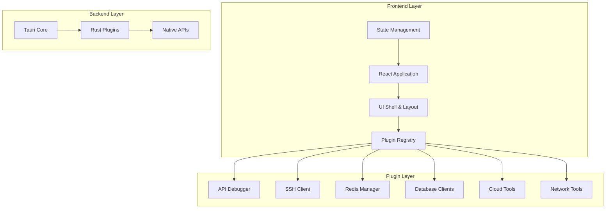
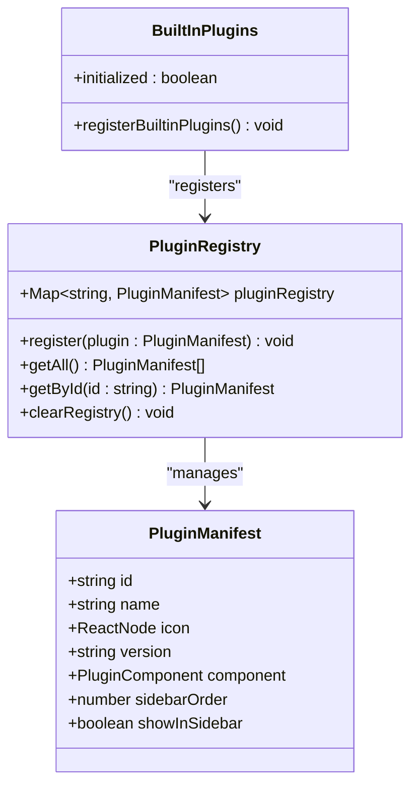
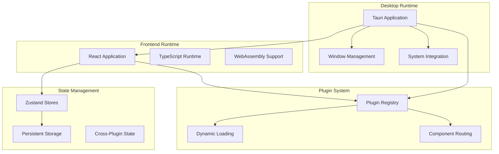
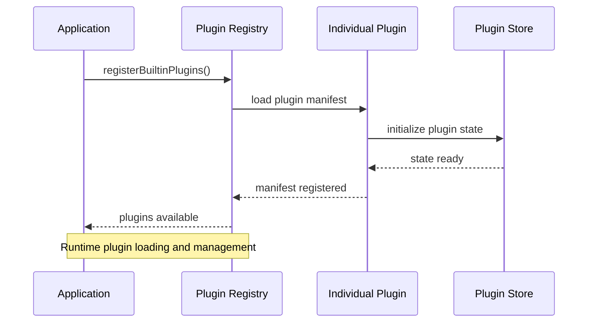
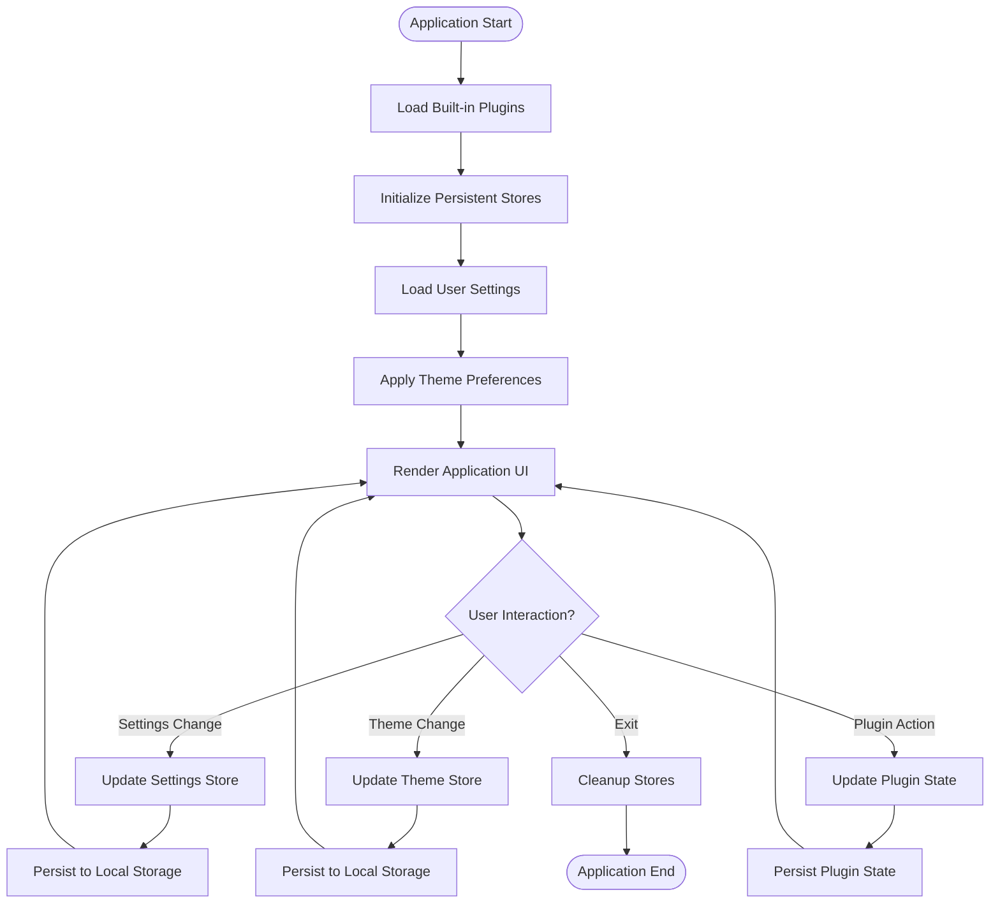
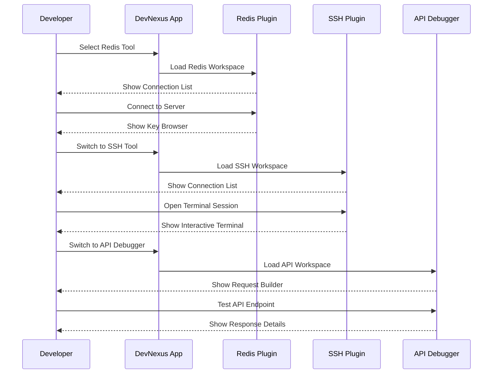
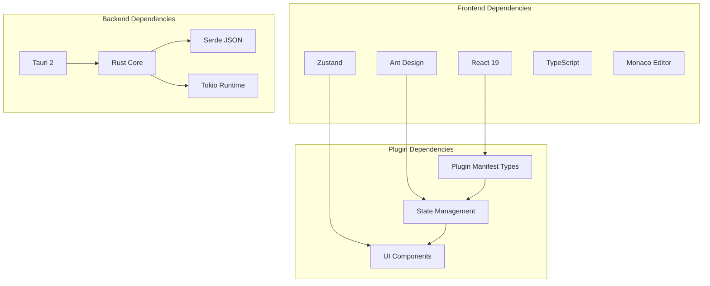

# Project Overview

<cite>
**Referenced Files in This Document**
- [package.json](file://package.json)
- [Cargo.toml](file://src-tauri/Cargo.toml)
- [tauri.conf.json](file://src-tauri/tauri.conf.json)
- [main.tsx](file://src/main.tsx)
- [App.tsx](file://src/App.tsx)
- [AppShell.tsx](file://src/app/layout/AppShell.tsx)
- [registry.ts](file://src/app/plugin-registry/registry.ts)
- [builtin.ts](file://src/app/plugin-registry/builtin.ts)
- [types.ts](file://src/app/plugin-registry/types.ts)
- [platform.ts](file://src/app/runtime/platform.ts)
- [settings.ts](file://src/app/store/settings.ts)
- [theme.ts](file://src/app/store/theme.ts)
- [api-debugger/index.tsx](file://src/plugins/api-debugger/index.tsx)
- [ssh-client/index.tsx](file://src/plugins/ssh-client/index.tsx)
- [redis-manager/index.tsx](file://src/plugins/redis-manager/index.tsx)
</cite>

## Table of Contents
1. [Introduction](#introduction)
2. [Project Structure](#project-structure)
3. [Core Components](#core-components)
4. [Architecture Overview](#architecture-overview)
5. [Detailed Component Analysis](#detailed-component-analysis)
6. [Dependency Analysis](#dependency-analysis)
7. [Performance Considerations](#performance-considerations)
8. [Troubleshooting Guide](#troubleshooting-guide)
9. [Conclusion](#conclusion)

## Introduction
RDMM (DevNexus) is a unified developer desktop toolkit built with Tauri that consolidates multiple development tools into a single, cohesive interface. As a Tauri-based desktop application, it leverages web technologies for the user interface while using a Rust backend to provide secure, native capabilities. The toolkit targets developers and DevOps professionals who need efficient access to diverse development utilities without switching contexts across multiple applications.

The application follows a plugin-based extensible design centered around a plugin registry. This architecture enables modular tooling where each plugin encapsulates a specific domain (e.g., SSH clients, database tools, cloud storage clients) and integrates seamlessly into the shared UI shell. The plugin registry manages plugin lifecycle, ordering, and visibility, ensuring a consistent user experience across all integrated tools.

Key value propositions include:
- Unified developer experience: Access multiple tools through a single desktop application
- Native performance and security: Leverages Tauri for fast, secure desktop execution
- Extensible architecture: Plugin-based design allows easy addition of new tools
- Cross-platform availability: Supports Windows, macOS, and Linux deployment
- Persistent state management: Maintains user preferences and tool configurations locally

Supported platforms:
- Windows (x64)
- macOS (Intel and Apple Silicon)
- Linux (x64)

Technology stack overview:
- Frontend: React 19 with TypeScript, Ant Design for UI components, Zustand for state management
- Backend: Rust with Tauri 2 for desktop integration and native capabilities
- Build system: Vite with TypeScript compilation
- State persistence: Local storage via Zustand middleware
- Platform detection: Runtime checks for macOS-specific behaviors

## Project Structure
The project follows a clear separation between frontend and backend components, with a plugin architecture that enables modular tooling:

**Diagram sources**
- [main.tsx:1-38](file://src/main.tsx#L1-L38)
- [AppShell.tsx:1-207](file://src/app/layout/AppShell.tsx#L1-L207)
- [registry.ts:1-26](file://src/app/plugin-registry/registry.ts#L1-L26)

The structure emphasizes:
- Centralized plugin registration and routing
- Shared UI shell with consistent navigation
- Modular plugin architecture for tool-specific functionality
- Persistent state management across application sessions

**Section sources**
- [main.tsx:1-38](file://src/main.tsx#L1-L38)
- [AppShell.tsx:1-207](file://src/app/layout/AppShell.tsx#L1-L207)
- [registry.ts:1-26](file://src/app/plugin-registry/registry.ts#L1-L26)

## Core Components
The application's core functionality revolves around several key components that work together to provide a unified developer experience:

### Plugin Registry System
The plugin registry serves as the central coordination point for all integrated tools. It maintains a map of registered plugins with their metadata, enabling dynamic loading and consistent presentation across the application interface.

**Diagram sources**
- [types.ts:1-14](file://src/app/plugin-registry/types.ts#L1-L14)
- [registry.ts:1-26](file://src/app/plugin-registry/registry.ts#L1-L26)
- [builtin.ts:1-31](file://src/app/plugin-registry/builtin.ts#L1-L31)

### Application Shell and Navigation
The application shell provides the foundational layout with sidebar navigation, titlebar controls, and status indicators. It coordinates plugin routing and manages cross-tool integrations like LAN chat notifications.

### State Management Architecture
The application uses Zustand for state management, implementing persistent stores for user preferences, theme selection, and plugin-specific data. This ensures continuity across application sessions while maintaining clean separation of concerns.

**Section sources**
- [types.ts:1-14](file://src/app/plugin-registry/types.ts#L1-L14)
- [registry.ts:1-26](file://src/app/plugin-registry/registry.ts#L1-L26)
- [builtin.ts:1-31](file://src/app/plugin-registry/builtin.ts#L1-L31)
- [AppShell.tsx:1-207](file://src/app/layout/AppShell.tsx#L1-L207)
- [settings.ts:1-28](file://src/app/store/settings.ts#L1-L28)
- [theme.ts:1-27](file://src/app/store/theme.ts#L1-L27)

## Architecture Overview
The application employs a hybrid architecture combining React frontend with Rust backend through Tauri, creating a seamless desktop experience:

**Diagram sources**
- [tauri.conf.json:1-39](file://src-tauri/tauri.conf.json#L1-L39)
- [main.tsx:1-38](file://src/main.tsx#L1-L38)
- [AppShell.tsx:1-207](file://src/app/layout/AppShell.tsx#L1-L207)
- [registry.ts:1-26](file://src/app/plugin-registry/registry.ts#L1-L26)

The architecture provides:
- Native desktop capabilities through Tauri while maintaining web-based development workflows
- Dynamic plugin loading and unloading for flexible tool integration
- Persistent state management across application restarts
- Cross-platform compatibility with platform-specific optimizations

**Section sources**
- [tauri.conf.json:1-39](file://src-tauri/tauri.conf.json#L1-L39)
- [main.tsx:1-38](file://src/main.tsx#L1-L38)
- [AppShell.tsx:1-207](file://src/app/layout/AppShell.tsx#L1-L207)
- [registry.ts:1-26](file://src/app/plugin-registry/registry.ts#L1-L26)

## Detailed Component Analysis

### Plugin-Based Extensible Design
The plugin system represents the core extensibility mechanism, allowing individual tools to be packaged as self-contained modules with their own state, UI components, and business logic.

**Diagram sources**
- [builtin.ts:14-29](file://src/app/plugin-registry/builtin.ts#L14-L29)
- [registry.ts:5-11](file://src/app/plugin-registry/registry.ts#L5-L11)

Each plugin follows a consistent pattern:
- Manifest definition with metadata (id, name, icon, version)
- Component export for UI rendering
- Store initialization for state management
- Tabbed interface for workspace organization

### State Management Implementation
The state management system utilizes Zustand stores with persistence middleware to maintain user preferences and application state across sessions.

**Diagram sources**
- [settings.ts:13-27](file://src/app/store/settings.ts#L13-L27)
- [theme.ts:12-26](file://src/app/store/theme.ts#L12-L26)

**Section sources**
- [builtin.ts:1-31](file://src/app/plugin-registry/builtin.ts#L1-31)
- [registry.ts:1-26](file://src/app/plugin-registry/registry.ts#L1-26)
- [settings.ts:1-28](file://src/app/store/settings.ts#L1-28)
- [theme.ts:1-27](file://src/app/store/theme.ts#L1-27)

### Cross-Platform Runtime Detection
The application includes platform detection capabilities to optimize the user experience across different operating systems, particularly handling macOS-specific titlebar behaviors.

**Section sources**
- [platform.ts:1-10](file://src/app/runtime/platform.ts#L1-10)

### Practical Workflows and Use Cases

#### Multi-Tool Workflow Example
A typical developer workflow involves switching between different tools within the unified interface:

#### Common Use Cases
- **Database Management**: Redis, MongoDB, MySQL clients with connection pooling and query workspaces
- **Infrastructure Testing**: SSH clients with terminal emulation and tunnel management
- **API Development**: Request builders, collections management, and response debugging
- **Cloud Operations**: S3 client for object storage management and bucket operations
- **Network Diagnostics**: Network tools for connectivity testing and monitoring

**Section sources**
- [api-debugger/index.tsx:13-39](file://src/plugins/api-debugger/index.tsx#L13-L39)
- [ssh-client/index.tsx:12-66](file://src/plugins/ssh-client/index.tsx#L12-L66)
- [redis-manager/index.tsx:14-67](file://src/plugins/redis-manager/index.tsx#L14-L67)

## Dependency Analysis
The application maintains a clean dependency structure with clear separation between frontend and backend components:

**Diagram sources**
- [package.json:15-45](file://package.json#L15-L45)
- [Cargo.toml:20-49](file://src-tauri/Cargo.toml#L20-L49)

**Section sources**
- [package.json:1-47](file://package.json#L1-47)
- [Cargo.toml:1-49](file://src-tauri/Cargo.toml#L1-49)

## Performance Considerations
The application architecture incorporates several performance optimizations:
- Lazy loading of plugin components to minimize initial bundle size
- Persistent state management to avoid reinitialization overhead
- Efficient plugin registry with O(1) lookup times
- Platform-specific optimizations for macOS runtime behavior
- Minimal DOM manipulation through React's virtual DOM

## Troubleshooting Guide
Common issues and their resolutions:
- **Plugin Loading Failures**: Verify plugin manifest registration and component exports
- **State Persistence Issues**: Check local storage availability and store configuration
- **Platform-Specific Behavior**: Review macOS runtime detection and window management
- **Build Configuration**: Ensure proper Tauri configuration and dependency versions

**Section sources**
- [tauri.conf.json:1-39](file://src-tauri/tauri.conf.json#L1-L39)
- [main.tsx:10-10](file://src/main.tsx#L10-L10)

## Conclusion
RDMM (DevNexus) represents a sophisticated approach to developer tooling consolidation, leveraging Tauri's native capabilities with React's modern development experience. The plugin-based architecture enables scalable growth while maintaining a cohesive user experience. By focusing on cross-platform compatibility, persistent state management, and intuitive workflows, the application addresses the evolving needs of modern developers and DevOps professionals who require efficient access to diverse development utilities in a single, reliable desktop environment.