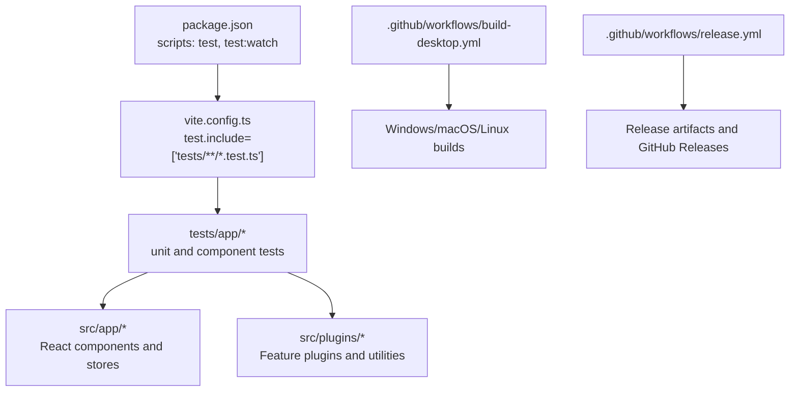
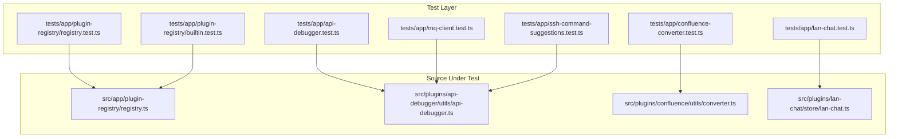
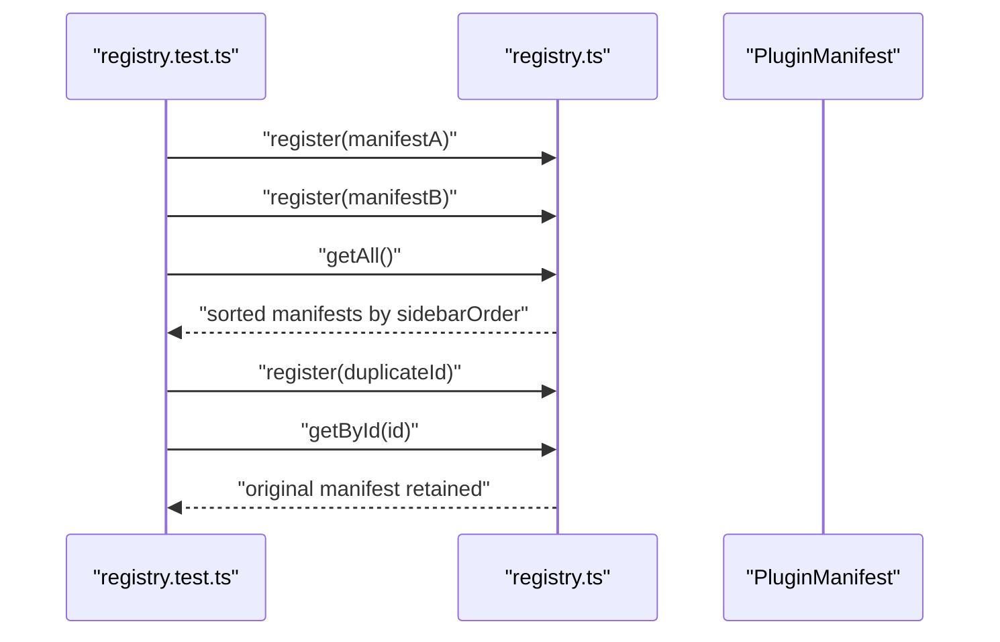
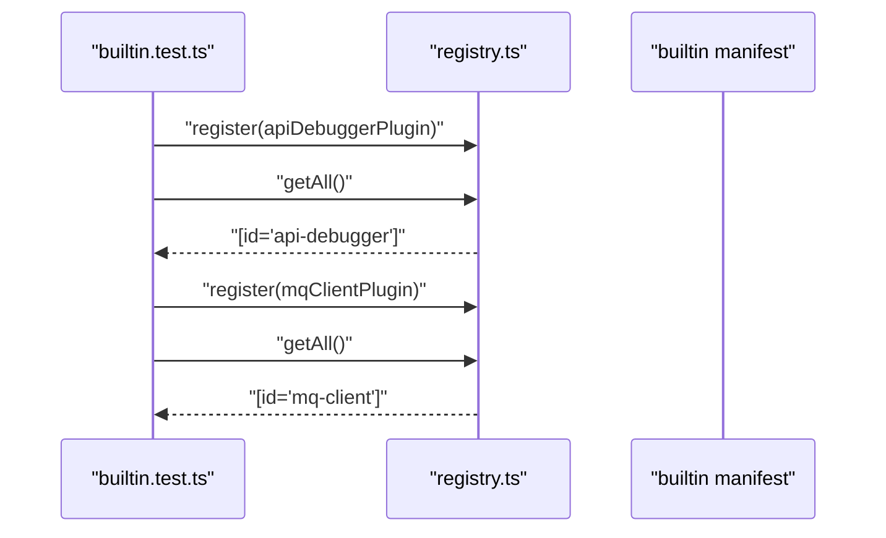
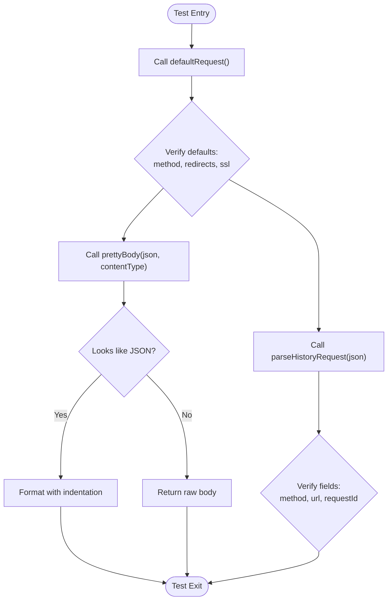
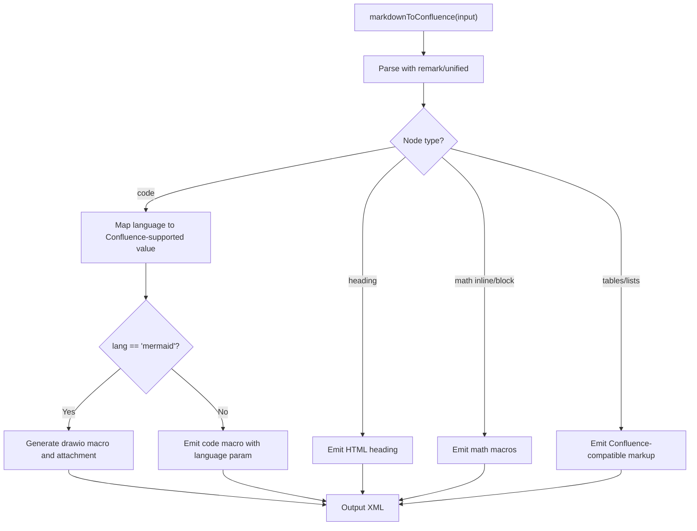
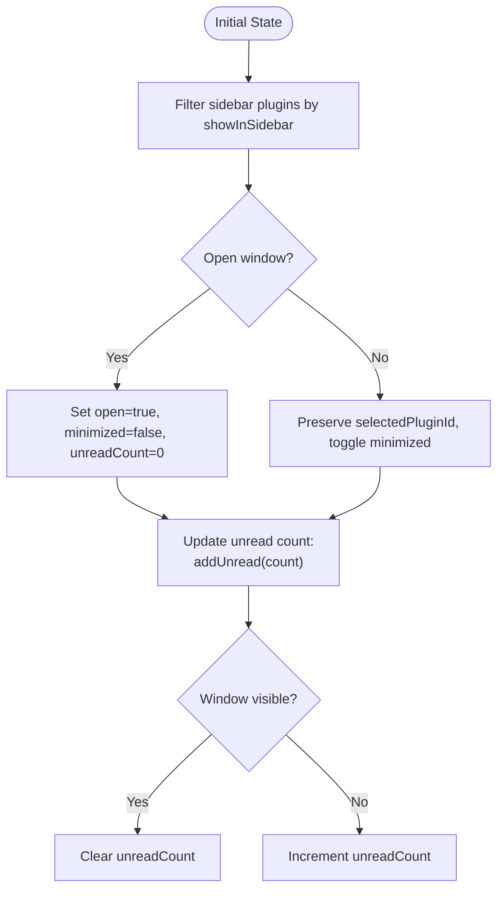
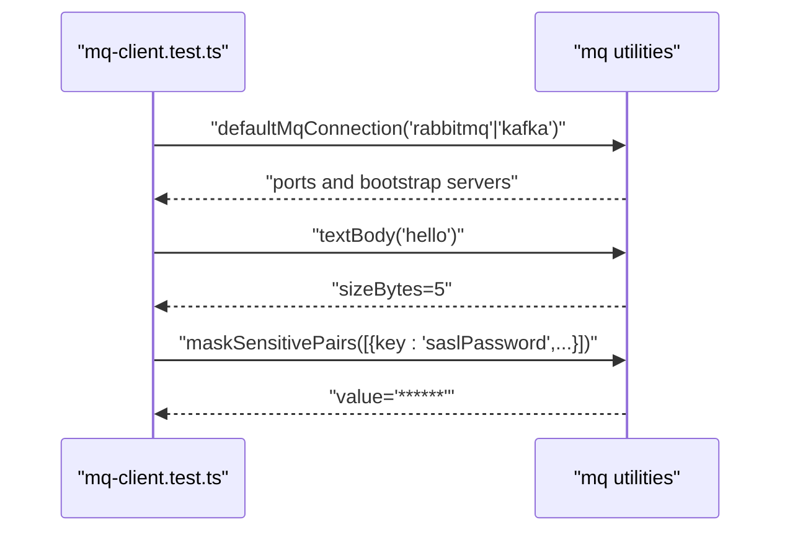
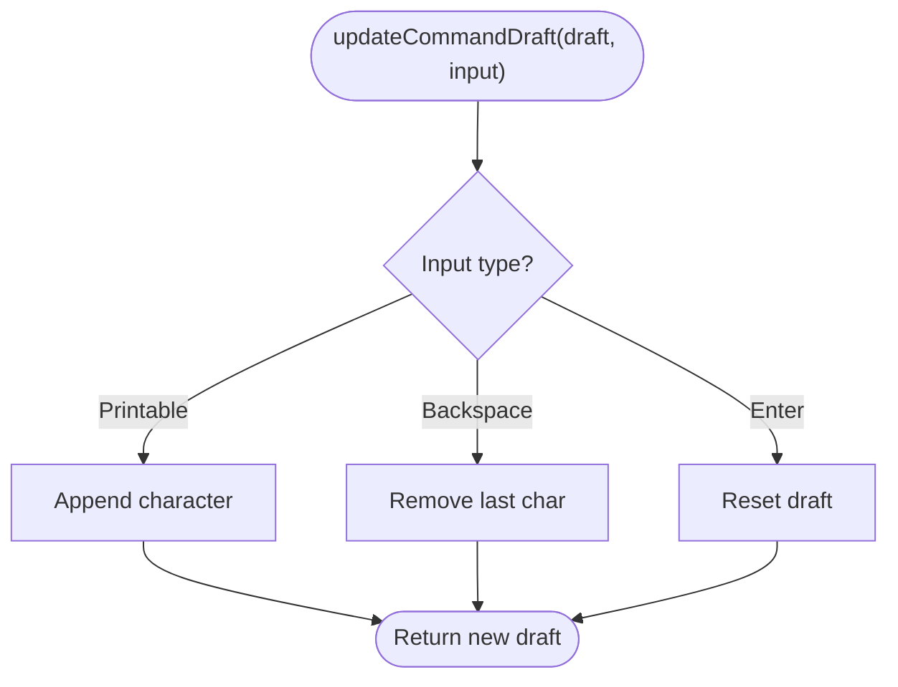
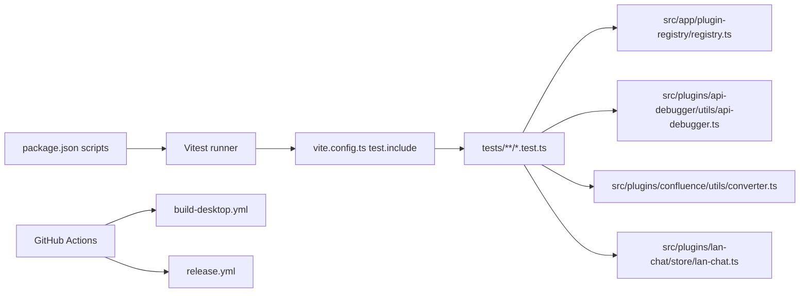

# Testing and Quality Assurance

<cite>
**Referenced Files in This Document**
- [package.json](file://package.json)
- [vite.config.ts](file://vite.config.ts)
- [.github/workflows/build-desktop.yml](file://.github/workflows/build-desktop.yml)
- [.github/workflows/release.yml](file://.github/workflows/release.yml)
- [tests/app/plugin-registry/registry.test.ts](file://tests/app/plugin-registry/registry.test.ts)
- [tests/app/plugin-registry/builtin.test.ts](file://tests/app/plugin-registry/builtin.test.ts)
- [tests/app/api-debugger.test.ts](file://tests/app/api-debugger.test.ts)
- [tests/app/confluence-converter.test.ts](file://tests/app/confluence-converter.test.ts)
- [tests/app/lan-chat.test.ts](file://tests/app/lan-chat.test.ts)
- [tests/app/mq-client.test.ts](file://tests/app/mq-client.test.ts)
- [tests/app/ssh-command-suggestions.test.ts](file://tests/app/ssh-command-suggestions.test.ts)
- [src/app/plugin-registry/registry.ts](file://src/app/plugin-registry/registry.ts)
- [src/plugins/api-debugger/utils/api-debugger.ts](file://src/plugins/api-debugger/utils/api-debugger.ts)
- [src/plugins/confluence/utils/converter.ts](file://src/plugins/confluence/utils/converter.ts)
- [src/plugins/lan-chat/store/lan-chat.ts](file://src/plugins/lan-chat/store/lan-chat.ts)
</cite>

## Table of Contents
1. [Introduction](#introduction)
2. [Project Structure](#project-structure)
3. [Core Components](#core-components)
4. [Architecture Overview](#architecture-overview)
5. [Detailed Component Analysis](#detailed-component-analysis)
6. [Dependency Analysis](#dependency-analysis)
7. [Performance Considerations](#performance-considerations)
8. [Troubleshooting Guide](#troubleshooting-guide)
9. [Conclusion](#conclusion)
10. [Appendices](#appendices)

## Introduction
This document describes RDMM’s testing strategy and quality assurance processes with a focus on the Vitest-based unit testing framework, component testing strategies, and integration testing patterns. It also documents the continuous integration workflows, build automation, and release management processes. Guidance is included for writing effective tests for plugins, components, and backend services, along with best practices for mocking, performance testing, security auditing, and code coverage analysis. Finally, it explains the testing infrastructure and how contributors can extend and improve the testing ecosystem.

## Project Structure
RDMM uses Vitest for unit and component tests, organized under a dedicated tests directory. The Vite configuration defines test inclusion patterns and module resolution via an alias. CI/CD is implemented with GitHub Actions workflows that build cross-platform desktop bundles and publish releases.

**Diagram sources**
- [package.json:6-13](file://package.json#L6-L13)
- [vite.config.ts:16-18](file://vite.config.ts#L16-L18)
- [.github/workflows/build-desktop.yml:12-142](file://.github/workflows/build-desktop.yml#L12-L142)
- [.github/workflows/release.yml:11-194](file://.github/workflows/release.yml#L11-L194)

**Section sources**
- [package.json:6-13](file://package.json#L6-L13)
- [vite.config.ts:16-18](file://vite.config.ts#L16-L18)

## Core Components
- Vitest configuration and scripts:
  - Test runner invocation and watch mode are exposed via npm scripts.
  - Test files are globbed from a specific pattern.
- CI/CD:
  - Desktop build workflows for Windows, macOS, and Linux.
  - Release workflow publishes artifacts and triggers downstream documentation updates.

Key responsibilities:
- Unit tests validate pure functions and small logic units.
- Component tests validate plugin manifests and store behaviors.
- Integration-like tests validate cross-plugin interactions and utilities.

**Section sources**
- [package.json:6-13](file://package.json#L6-L13)
- [vite.config.ts:16-18](file://vite.config.ts#L16-L18)
- [.github/workflows/build-desktop.yml:12-142](file://.github/workflows/build-desktop.yml#L12-L142)
- [.github/workflows/release.yml:11-194](file://.github/workflows/release.yml#L11-L194)

## Architecture Overview
The testing architecture centers on Vitest, with tests targeting:
- Pure utility functions (e.g., API debugger helpers, Confluence converter).
- Store/state logic (e.g., LAN chat window state).
- Registry and plugin lifecycle (registration, ordering, visibility).
- Cross-cutting integrations (e.g., builtin plugin manifests).

**Diagram sources**
- [tests/app/plugin-registry/registry.test.ts:1-40](file://tests/app/plugin-registry/registry.test.ts#L1-L40)
- [tests/app/plugin-registry/builtin.test.ts:1-31](file://tests/app/plugin-registry/builtin.test.ts#L1-L31)
- [tests/app/api-debugger.test.ts:1-24](file://tests/app/api-debugger.test.ts#L1-L24)
- [tests/app/confluence-converter.test.ts:1-50](file://tests/app/confluence-converter.test.ts#L1-L50)
- [tests/app/lan-chat.test.ts:1-58](file://tests/app/lan-chat.test.ts#L1-L58)
- [tests/app/mq-client.test.ts:1-20](file://tests/app/mq-client.test.ts#L1-L20)
- [tests/app/ssh-command-suggestions.test.ts:1-39](file://tests/app/ssh-command-suggestions.test.ts#L1-L39)
- [src/app/plugin-registry/registry.ts:1-26](file://src/app/plugin-registry/registry.ts#L1-L26)
- [src/plugins/api-debugger/utils/api-debugger.ts:1-62](file://src/plugins/api-debugger/utils/api-debugger.ts#L1-L62)
- [src/plugins/confluence/utils/converter.ts:1-226](file://src/plugins/confluence/utils/converter.ts#L1-L226)
- [src/plugins/lan-chat/store/lan-chat.ts:1-202](file://src/plugins/lan-chat/store/lan-chat.ts#L1-L202)

## Detailed Component Analysis

### Plugin Registry Tests
These tests validate registration behavior, deduplication, and sorting by sidebar order. They also assert that builtin plugin manifests can be registered successfully.

**Diagram sources**
- [tests/app/plugin-registry/registry.test.ts:20-39](file://tests/app/plugin-registry/registry.test.ts#L20-L39)
- [src/app/plugin-registry/registry.ts:5-25](file://src/app/plugin-registry/registry.ts#L5-L25)

**Section sources**
- [tests/app/plugin-registry/registry.test.ts:1-40](file://tests/app/plugin-registry/registry.test.ts#L1-L40)
- [src/app/plugin-registry/registry.ts:1-26](file://src/app/plugin-registry/registry.ts#L1-L26)

### Builtin Plugins Registration Tests
These tests ensure that builtin plugin manifests are correctly registered and appear in the registry.

**Diagram sources**
- [tests/app/plugin-registry/builtin.test.ts:8-30](file://tests/app/plugin-registry/builtin.test.ts#L8-L30)
- [src/app/plugin-registry/registry.ts:5-25](file://src/app/plugin-registry/registry.ts#L5-L25)

**Section sources**
- [tests/app/plugin-registry/builtin.test.ts:1-31](file://tests/app/plugin-registry/builtin.test.ts#L1-L31)

### API Debugger Utilities Tests
These tests validate default request creation, pretty-printing of JSON bodies, and parsing of saved/history requests.

**Diagram sources**
- [tests/app/api-debugger.test.ts:5-23](file://tests/app/api-debugger.test.ts#L5-L23)
- [src/plugins/api-debugger/utils/api-debugger.ts:14-61](file://src/plugins/api-debugger/utils/api-debugger.ts#L14-L61)

**Section sources**
- [tests/app/api-debugger.test.ts:1-24](file://tests/app/api-debugger.test.ts#L1-L24)
- [src/plugins/api-debugger/utils/api-debugger.ts:1-62](file://src/plugins/api-debugger/utils/api-debugger.ts#L1-L62)

### Confluence Converter Tests
These tests validate Markdown-to-Confluence conversion, including code language mapping, Mermaid-to-drawio conversion, and escaping behavior.

**Diagram sources**
- [tests/app/confluence-converter.test.ts:8-49](file://tests/app/confluence-converter.test.ts#L8-L49)
- [src/plugins/confluence/utils/converter.ts:185-189](file://src/plugins/confluence/utils/converter.ts#L185-L189)

**Section sources**
- [tests/app/confluence-converter.test.ts:1-50](file://tests/app/confluence-converter.test.ts#L1-L50)
- [src/plugins/confluence/utils/converter.ts:1-226](file://src/plugins/confluence/utils/converter.ts#L1-L226)

### LAN Chat Store Behavior Tests
These tests validate sidebar filtering, window toggling, and unread count semantics.

**Diagram sources**
- [tests/app/lan-chat.test.ts:22-57](file://tests/app/lan-chat.test.ts#L22-L57)
- [src/plugins/lan-chat/store/lan-chat.ts:44-71](file://src/plugins/lan-chat/store/lan-chat.ts#L44-L71)

**Section sources**
- [tests/app/lan-chat.test.ts:1-58](file://tests/app/lan-chat.test.ts#L1-L58)
- [src/plugins/lan-chat/store/lan-chat.ts:1-202](file://src/plugins/lan-chat/store/lan-chat.ts#L1-L202)

### MQ Client Utilities Tests
These tests validate default connection form generation, body size computation, and sensitive data masking.

**Diagram sources**
- [tests/app/mq-client.test.ts:5-19](file://tests/app/mq-client.test.ts#L5-L19)

**Section sources**
- [tests/app/mq-client.test.ts:1-20](file://tests/app/mq-client.test.ts#L1-L20)

### SSH Command Suggestions Tests
These tests validate command suggestion matching and draft synchronization.

**Diagram sources**
- [tests/app/ssh-command-suggestions.test.ts:8-38](file://tests/app/ssh-command-suggestions.test.ts#L8-L38)

**Section sources**
- [tests/app/ssh-command-suggestions.test.ts:1-39](file://tests/app/ssh-command-suggestions.test.ts#L1-L39)

## Dependency Analysis
- Test-to-source mapping:
  - Tests import from source modules under the @ alias, ensuring isolation and deterministic behavior.
  - Registry tests depend on the registry module for registration and retrieval.
  - Utility tests depend on plugin-specific utility modules for pure function validation.
  - Store tests depend on Zustand store logic and window state interfaces.
- CI/CD dependencies:
  - Workflows depend on Node.js and Rust toolchains, system dependencies for Linux, and Tauri CLI for bundling.

**Diagram sources**
- [package.json:6-13](file://package.json#L6-L13)
- [vite.config.ts:16-18](file://vite.config.ts#L16-L18)
- [src/app/plugin-registry/registry.ts:1-26](file://src/app/plugin-registry/registry.ts#L1-L26)
- [src/plugins/api-debugger/utils/api-debugger.ts:1-62](file://src/plugins/api-debugger/utils/api-debugger.ts#L1-L62)
- [src/plugins/confluence/utils/converter.ts:1-226](file://src/plugins/confluence/utils/converter.ts#L1-L226)
- [src/plugins/lan-chat/store/lan-chat.ts:1-202](file://src/plugins/lan-chat/store/lan-chat.ts#L1-L202)
- [.github/workflows/build-desktop.yml:12-142](file://.github/workflows/build-desktop.yml#L12-L142)
- [.github/workflows/release.yml:11-194](file://.github/workflows/release.yml#L11-L194)

**Section sources**
- [package.json:6-13](file://package.json#L6-L13)
- [vite.config.ts:16-18](file://vite.config.ts#L16-L18)
- [.github/workflows/build-desktop.yml:12-142](file://.github/workflows/build-desktop.yml#L12-L142)
- [.github/workflows/release.yml:11-194](file://.github/workflows/release.yml#L11-L194)

## Performance Considerations
- Keep tests fast by avoiding real network calls and heavy I/O. Use deterministic inputs and pure function assertions.
- Prefer small, isolated tests that exercise single responsibilities to reduce flakiness and improve feedback speed.
- Group related tests per module to minimize repeated setup and teardown costs.
- Use Vitest’s built-in timing and concurrency features judiciously; avoid expensive snapshots or large fixtures.

## Troubleshooting Guide
Common issues and resolutions:
- Test failures due to missing mocks:
  - Use Vitest spies and stubs for external APIs or browser globals.
  - For DOM-related utilities, isolate them behind pure functions and test those functions directly.
- Flaky tests:
  - Avoid relying on global mutable state; reset registries and stores between tests.
  - Use deterministic randomization or fixed seeds where applicable.
- CI failures on Linux:
  - Ensure system dependencies are installed as per the workflow steps.
  - Validate Node.js and Rust versions match the workflow matrix.

**Section sources**
- [tests/app/plugin-registry/registry.test.ts:20-39](file://tests/app/plugin-registry/registry.test.ts#L20-L39)
- [.github/workflows/build-desktop.yml:112-121](file://.github/workflows/build-desktop.yml#L112-L121)

## Conclusion
RDMM’s testing and QA processes center on a robust Vitest-based unit and component testing framework, complemented by comprehensive CI/CD pipelines for desktop builds and releases. The current suite validates critical areas such as plugin registration, utility functions, and store behaviors. Extending tests to cover more backend services, performance benchmarks, and security audits will further strengthen the quality of the platform.

## Appendices

### Writing Effective Tests
- Unit tests for plugins:
  - Focus on pure functions and configuration defaults.
  - Example patterns: [tests/app/api-debugger.test.ts:1-24](file://tests/app/api-debugger.test.ts#L1-L24), [tests/app/mq-client.test.ts:1-20](file://tests/app/mq-client.test.ts#L1-L20).
- Component and store tests:
  - Validate state transitions and UI-related behaviors.
  - Example patterns: [tests/app/lan-chat.test.ts:1-58](file://tests/app/lan-chat.test.ts#L1-L58).
- Integration-like tests:
  - Validate cross-plugin interactions and registry behavior.
  - Example patterns: [tests/app/plugin-registry/registry.test.ts:1-40](file://tests/app/plugin-registry/registry.test.ts#L1-L40), [tests/app/plugin-registry/builtin.test.ts:1-31](file://tests/app/plugin-registry/builtin.test.ts#L1-L31).

### Mock Strategies
- Use Vitest’s spy and stub utilities for external dependencies.
- Wrap browser APIs and timers in deterministic wrappers for reproducible tests.
- For complex UI interactions, prefer testing underlying logic rather than rendering-heavy tests.

### Quality Metrics and Coverage
- Add coverage reporting via Vitest’s coverage integrations when extending the test suite.
- Track coverage for critical modules (utilities, stores, and registry) to guide test expansion.

### Security Auditing
- Review third-party dependencies periodically and keep them updated.
- Avoid embedding secrets in tests; use environment-aware configurations for CI.

### Continuous Integration and Release Management
- Desktop builds:
  - Windows, macOS (x64/arm64), and Linux (AppImage/DEB) are built in parallel.
  - Artifacts are uploaded for later verification and release packaging.
- Release process:
  - On tag pushes, artifacts are collected and published to GitHub Releases.
  - A downstream documentation site rebuild is triggered automatically.

**Section sources**
- [.github/workflows/build-desktop.yml:12-142](file://.github/workflows/build-desktop.yml#L12-L142)
- [.github/workflows/release.yml:11-194](file://.github/workflows/release.yml#L11-L194)