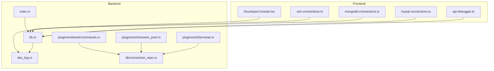
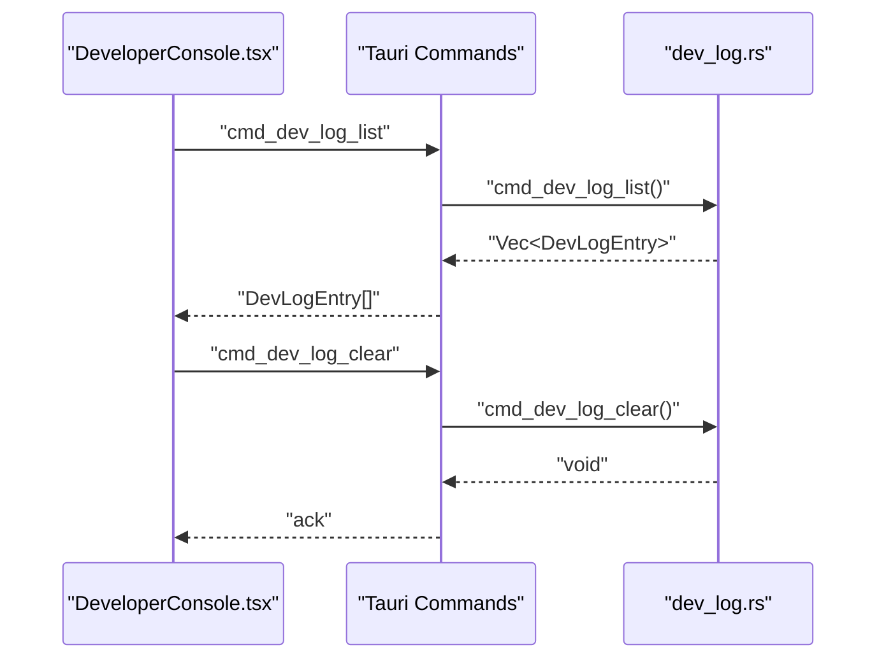
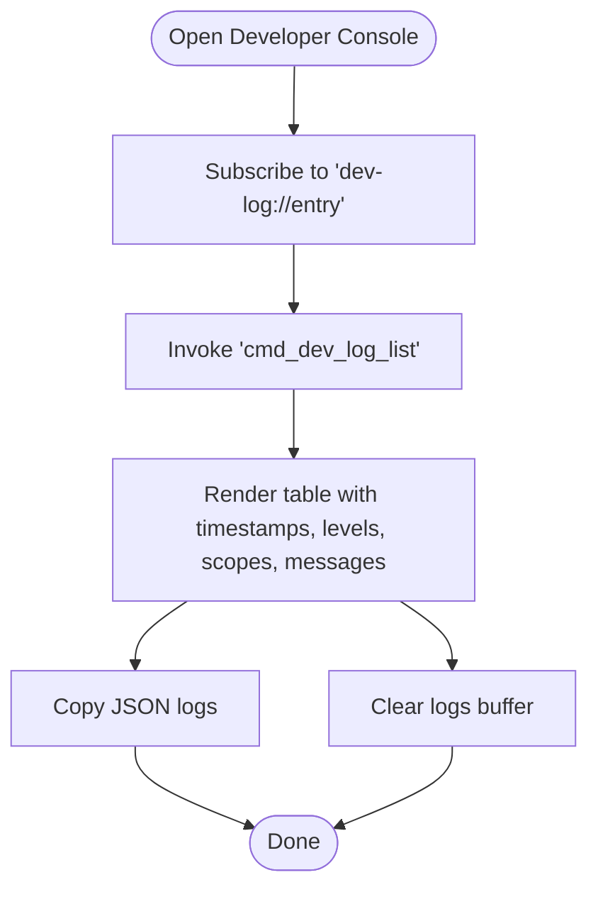
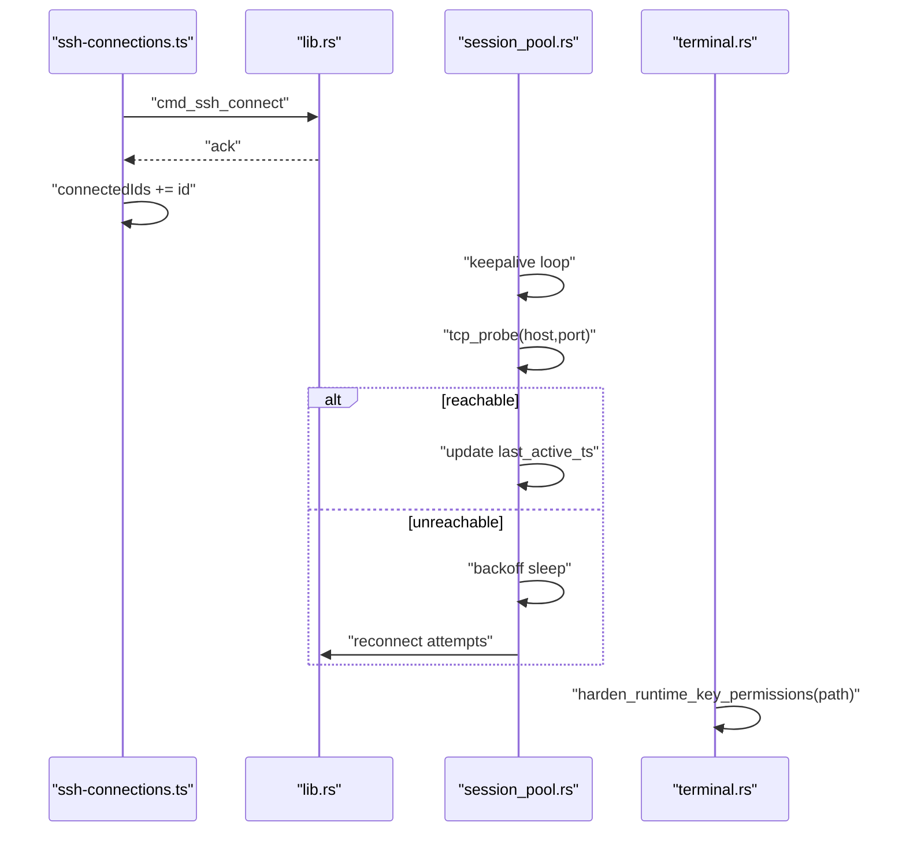
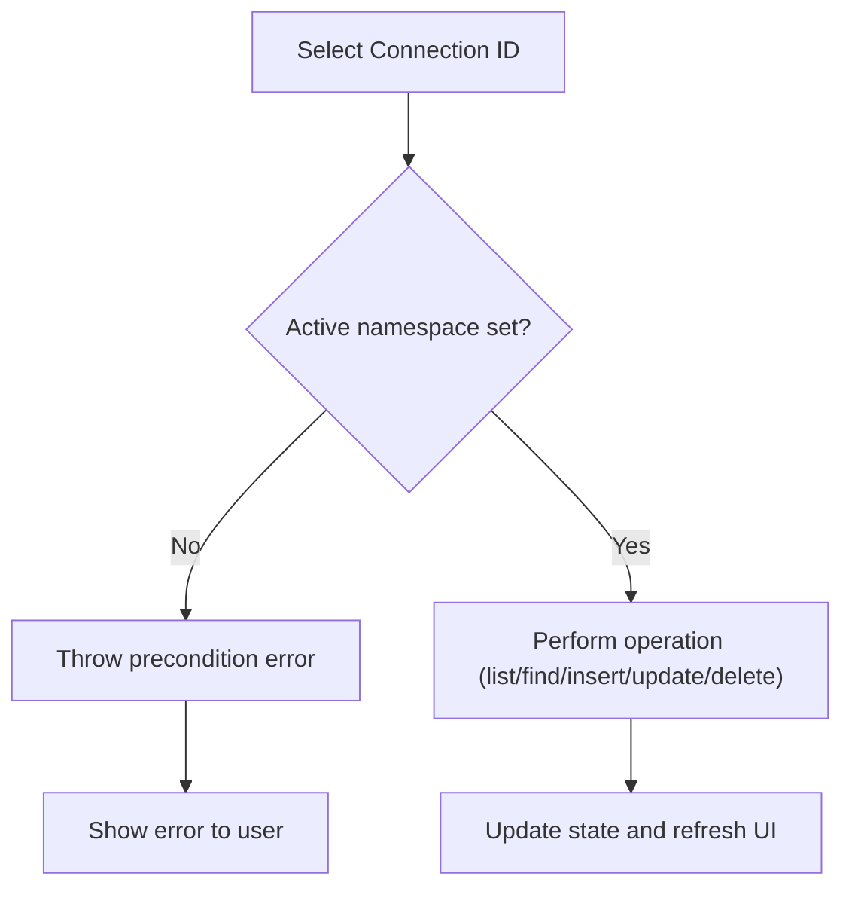
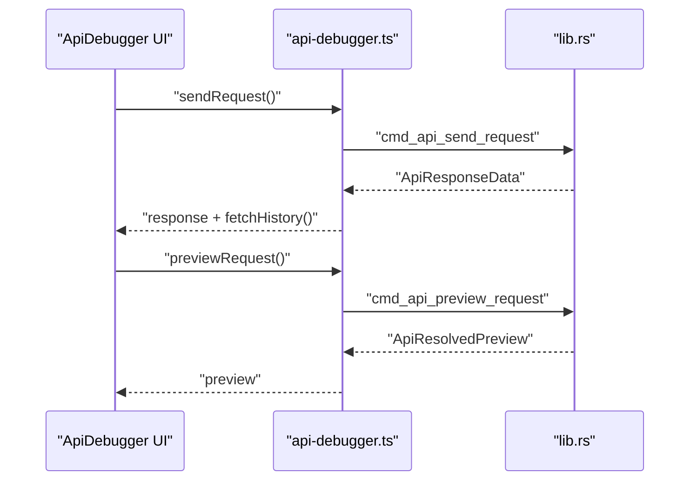
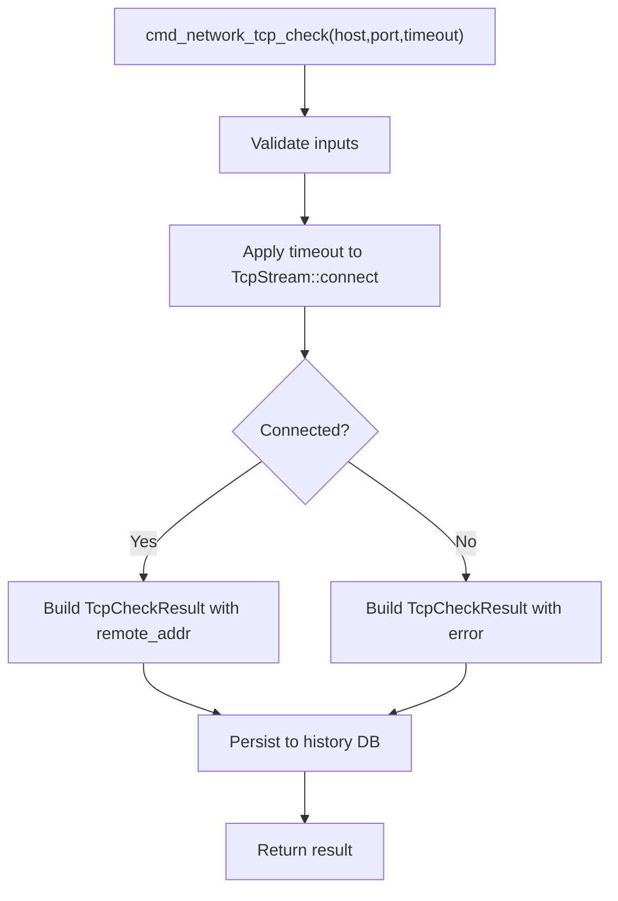
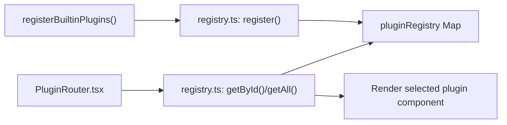
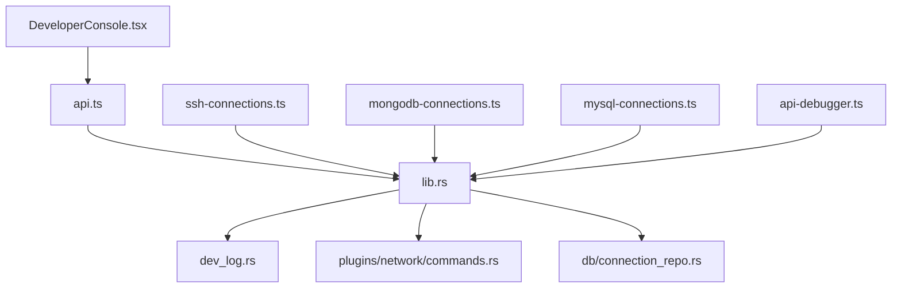

# Troubleshooting and FAQ

<cite>
**Referenced Files in This Document**
- [DeveloperConsole.tsx](file://src/app/developer-console/DeveloperConsole.tsx)
- [api.ts](file://src/app/developer-console/api.ts)
- [types.ts](file://src/app/developer-console/types.ts)
- [utils.ts](file://src/app/developer-console/utils.ts)
- [dev_log.rs](file://src-tauri/src/dev_log.rs)
- [lib.rs](file://src-tauri/src/lib.rs)
- [main.rs](file://src-tauri/src/main.rs)
- [ssh-connections.ts](file://src/plugins/ssh-client/store/ssh-connections.ts)
- [mongodb-connections.ts](file://src/plugins/mongodb-client/store/mongodb-connections.ts)
- [mysql-connections.ts](file://src/plugins/mysql-client/store/mysql-connections.ts)
- [api-debugger.ts](file://src/plugins/api-debugger/store/api-debugger.ts)
- [commands.rs](file://src-tauri/src/plugins/network/commands.rs)
- [session_pool.rs](file://src-tauri/src/plugins/ssh/session_pool.rs)
- [terminal.rs](file://src-tauri/src/plugins/ssh/terminal.rs)
- [connection_repo.rs](file://src-tauri/src/db/connection_repo.rs)
- [builtin.ts](file://src/app/plugin-registry/builtin.ts)
- [registry.ts](file://src/app/plugin-registry/registry.ts)
- [PluginRouter.tsx](file://src/app/plugin-registry/PluginRouter.tsx)
- [release.yml](file://.github/workflows/release.yml)
</cite>

## Table of Contents
1. [Introduction](#introduction)
2. [Project Structure](#project-structure)
3. [Core Components](#core-components)
4. [Architecture Overview](#architecture-overview)
5. [Detailed Component Analysis](#detailed-component-analysis)
6. [Dependency Analysis](#dependency-analysis)
7. [Performance Considerations](#performance-considerations)
8. [Troubleshooting Guide](#troubleshooting-guide)
9. [Conclusion](#conclusion)
10. [Appendices](#appendices)

## Introduction
This document provides a comprehensive troubleshooting guide for RDMM. It focuses on diagnosing and resolving common issues across installation, plugin loading, connectivity, and performance. It also explains how to use the Developer Console for log analysis, interpret error messages, and escalate complex issues. Platform-specific concerns, compatibility, and migration guidance are included, along with preventive measures and best practices.

## Project Structure
RDMM is a Tauri-based desktop application with a React frontend and a Rust backend. Plugins encapsulate domain-specific functionality (SSH, Redis, S3, MongoDB, MySQL, MQ, Confluence, Network Tools, API Debugger). The Developer Console provides live diagnostics and a persistent log buffer for backend events.

**Diagram sources**
- [DeveloperConsole.tsx:1-132](file://src/app/developer-console/DeveloperConsole.tsx#L1-L132)
- [lib.rs:10-262](file://src-tauri/src/lib.rs#L10-L262)
- [main.rs:4-7](file://src-tauri/src/main.rs#L4-L7)
- [dev_log.rs:29-68](file://src-tauri/src/dev_log.rs#L29-L68)
- [ssh-connections.ts:25-77](file://src/plugins/ssh-client/store/ssh-connections.ts#L25-L77)
- [mongodb-connections.ts:96-296](file://src/plugins/mongodb-client/store/mongodb-connections.ts#L96-L296)
- [mysql-connections.ts:77-153](file://src/plugins/mysql-client/store/mysql-connections.ts#L77-L153)
- [api-debugger.ts:47-129](file://src/plugins/api-debugger/store/api-debugger.ts#L47-L129)
- [commands.rs:258-282](file://src-tauri/src/plugins/network/commands.rs#L258-L282)
- [session_pool.rs:50-79](file://src-tauri/src/plugins/ssh/session_pool.rs#L50-L79)
- [terminal.rs:218-252](file://src-tauri/src/plugins/ssh/terminal.rs#L218-L252)
- [connection_repo.rs:151-173](file://src-tauri/src/db/connection_repo.rs#L151-L173)

**Section sources**
- [DeveloperConsole.tsx:1-132](file://src/app/developer-console/DeveloperConsole.tsx#L1-L132)
- [lib.rs:10-262](file://src-tauri/src/lib.rs#L10-L262)
- [main.rs:4-7](file://src-tauri/src/main.rs#L4-L7)
- [dev_log.rs:29-68](file://src-tauri/src/dev_log.rs#L29-L68)

## Core Components
- Developer Console: A hidden drawer that displays real-time backend logs and allows copying/clearing them. Accessible via a keyboard shortcut and backed by Tauri events and commands.
- Backend Logging Buffer: A fixed-size ring buffer storing DevLogEntry items with automatic emission to the frontend.
- Plugin Stores: Centralized state management for each plugin’s lifecycle, including connection operations, history, and environment handling.
- Network Diagnostics: Built-in TCP checks and traceroute parsing with persisted history.
- SSH Session Management: Automatic keepalive and reconnect logic with TCP probing and event-driven session closure.
- Connection Persistence: Encrypted secrets handling and database-backed connection storage.

**Section sources**
- [DeveloperConsole.tsx:10-132](file://src/app/developer-console/DeveloperConsole.tsx#L10-L132)
- [dev_log.rs:12-68](file://src-tauri/src/dev_log.rs#L12-L68)
- [ssh-connections.ts:25-77](file://src/plugins/ssh-client/store/ssh-connections.ts#L25-L77)
- [mongodb-connections.ts:96-296](file://src/plugins/mongodb-client/store/mongodb-connections.ts#L96-L296)
- [mysql-connections.ts:77-153](file://src/plugins/mysql-client/store/mysql-connections.ts#L77-L153)
- [api-debugger.ts:47-129](file://src/plugins/api-debugger/store/api-debugger.ts#L47-L129)
- [commands.rs:258-282](file://src-tauri/src/plugins/network/commands.rs#L258-L282)
- [session_pool.rs:50-79](file://src-tauri/src/plugins/ssh/session_pool.rs#L50-L79)
- [connection_repo.rs:151-173](file://src-tauri/src/db/connection_repo.rs#L151-L173)

## Architecture Overview
The Developer Console listens to a Tauri event channel and invokes backend commands to list and clear logs. Backend commands are registered in the Tauri builder and emit DevLogEntry entries into a shared buffer.

**Diagram sources**
- [DeveloperConsole.tsx:15-22](file://src/app/developer-console/DeveloperConsole.tsx#L15-L22)
- [api.ts:5-11](file://src/app/developer-console/api.ts#L5-L11)
- [dev_log.rs:55-68](file://src-tauri/src/dev_log.rs#L55-L68)
- [lib.rs:226-227](file://src-tauri/src/lib.rs#L226-L227)

## Detailed Component Analysis

### Developer Console and Log Buffer
- Real-time logs: Subscribes to a dedicated event channel and appends new entries with a fixed-capacity buffer.
- Controls: Copy JSON and Clear buttons for quick diagnostics.
- Backend bridge: Uses Tauri invoke to list and clear logs.

**Diagram sources**
- [DeveloperConsole.tsx:35-51](file://src/app/developer-console/DeveloperConsole.tsx#L35-L51)
- [api.ts:5-11](file://src/app/developer-console/api.ts#L5-L11)
- [dev_log.rs:55-68](file://src-tauri/src/dev_log.rs#L55-L68)

**Section sources**
- [DeveloperConsole.tsx:10-132](file://src/app/developer-console/DeveloperConsole.tsx#L10-L132)
- [api.ts:1-12](file://src/app/developer-console/api.ts#L1-L12)
- [types.ts:1-9](file://src/app/developer-console/types.ts#L1-L9)
- [utils.ts:1-13](file://src/app/developer-console/utils.ts#L1-L13)
- [dev_log.rs:29-68](file://src-tauri/src/dev_log.rs#L29-L68)

### SSH Connection Lifecycle and Recovery
- Session state: Tracks connected IDs and updates on “ssh://session-closed” events.
- Keepalive and reconnect: Periodic TCP probe; attempts reconnection with backoff.
- Security hardening: On Windows, resets ACLs and permissions for runtime-generated keys.

**Diagram sources**
- [ssh-connections.ts:64-75](file://src/plugins/ssh-client/store/ssh-connections.ts#L64-L75)
- [lib.rs:70-95](file://src-tauri/src/lib.rs#L70-L95)
- [session_pool.rs:50-79](file://src-tauri/src/plugins/ssh/session_pool.rs#L50-L79)
- [terminal.rs:218-252](file://src-tauri/src/plugins/ssh/terminal.rs#L218-L252)

**Section sources**
- [ssh-connections.ts:25-77](file://src/plugins/ssh-client/store/ssh-connections.ts#L25-L77)
- [session_pool.rs:50-79](file://src-tauri/src/plugins/ssh/session_pool.rs#L50-L79)
- [terminal.rs:218-252](file://src-tauri/src/plugins/ssh/terminal.rs#L218-L252)

### MongoDB and MySQL Connection Workflows
- Pre-requisites: Must select a connection before operating on namespaces (database/collection or database/table).
- Operations: Listing databases, collections/tables, executing queries, managing indexes, importing/exporting data, and viewing server status.
- Error signaling: Throws descriptive errors when preconditions are missing.

**Diagram sources**
- [mongodb-connections.ts:79-94](file://src/plugins/mongodb-client/store/mongodb-connections.ts#L79-L94)
- [mysql-connections.ts:66-75](file://src/plugins/mysql-client/store/mysql-connections.ts#L66-L75)

**Section sources**
- [mongodb-connections.ts:79-94](file://src/plugins/mongodb-client/store/mongodb-connections.ts#L79-L94)
- [mysql-connections.ts:66-75](file://src/plugins/mysql-client/store/mysql-connections.ts#L66-L75)

### API Debugger Store and Request Lifecycle
- State: Active request, environment, collections, history, and response preview.
- Actions: Send request, preview, cancel, save/open collections/folders/requests/environments, manage history, import/export.

**Diagram sources**
- [api-debugger.ts:62-81](file://src/plugins/api-debugger/store/api-debugger.ts#L62-L81)
- [api-debugger.ts:73-76](file://src/plugins/api-debugger/store/api-debugger.ts#L73-L76)
- [lib.rs:193-212](file://src-tauri/src/lib.rs#L193-L212)

**Section sources**
- [api-debugger.ts:47-129](file://src/plugins/api-debugger/store/api-debugger.ts#L47-L129)

### Network Diagnostics and History
- TCP check: Connects with timeout and records success/error, remote address, and duration.
- History persistence: Saves diagnostic results to a database with structured fields.

**Diagram sources**
- [commands.rs:258-282](file://src-tauri/src/plugins/network/commands.rs#L258-L282)
- [commands.rs:43-69](file://src-tauri/src/plugins/network/commands.rs#L43-L69)

**Section sources**
- [commands.rs:258-282](file://src-tauri/src/plugins/network/commands.rs#L258-L282)
- [commands.rs:43-69](file://src-tauri/src/plugins/network/commands.rs#L43-L69)

### Plugin Registry and Router
- Built-in plugins: Registered once during initialization.
- Router: Selects the active plugin component based on settings or falls back to the first available.

**Diagram sources**
- [builtin.ts:14-29](file://src/app/plugin-registry/builtin.ts#L14-L29)
- [registry.ts:5-25](file://src/app/plugin-registry/registry.ts#L5-L25)
- [PluginRouter.tsx:7-28](file://src/app/plugin-registry/PluginRouter.tsx#L7-L28)

**Section sources**
- [builtin.ts:14-29](file://src/app/plugin-registry/builtin.ts#L14-L29)
- [registry.ts:5-25](file://src/app/plugin-registry/registry.ts#L5-L25)
- [PluginRouter.tsx:7-28](file://src/app/plugin-registry/PluginRouter.tsx#L7-L28)

## Dependency Analysis
- Frontend-to-backend invocation: All plugin stores and Developer Console use Tauri invoke to call backend commands registered in the Tauri builder.
- Event-driven UI updates: Developer Console subscribes to a dedicated event channel; SSH store listens for session-closure events.
- Data persistence: Connection repositories and network diagnostics write to an internal database.

**Diagram sources**
- [lib.rs:226-259](file://src-tauri/src/lib.rs#L226-L259)
- [dev_log.rs:55-68](file://src-tauri/src/dev_log.rs#L55-L68)
- [ssh-connections.ts:41-42](file://src/plugins/ssh-client/store/ssh-connections.ts#L41-L42)
- [mongodb-connections.ts:126-127](file://src/plugins/mongodb-client/store/mongodb-connections.ts#L126-L127)
- [mysql-connections.ts:96](file://src/plugins/mysql-client/store/mysql-connections.ts#L96)
- [api-debugger.ts:90-96](file://src/plugins/api-debugger/store/api-debugger.ts#L90-L96)
- [commands.rs:49-67](file://src-tauri/src/plugins/network/commands.rs#L49-L67)
- [connection_repo.rs:151-173](file://src-tauri/src/db/connection_repo.rs#L151-L173)

**Section sources**
- [lib.rs:226-259](file://src-tauri/src/lib.rs#L226-L259)

## Performance Considerations
- Developer Console buffer: Fixed-size ring buffer caps memory usage for logs.
- SSH keepalive: Periodic probes prevent stale sessions; backoff reduces retry pressure.
- Batched fetches: API debugger uses Promise.all to parallelize initial loads.
- Network diagnostics: Persisted history avoids recomputation and supports historical analysis.

[No sources needed since this section provides general guidance]

## Troubleshooting Guide

### How to Use the Developer Console
- Open the Developer Console using the keyboard shortcut. The drawer shows a table of log entries with timestamp, level, scope, and message.
- Use Copy JSON to export logs for sharing and Clear to reset the buffer.
- Logs are emitted from the backend and received via a Tauri event channel.

Step-by-step:
1. Press the keyboard shortcut to toggle the Developer Console.
2. Review the Level column to quickly spot warnings and errors.
3. Use Scope to filter logs related to a specific subsystem (e.g., SSH, MongoDB, Network).
4. Copy JSON logs and share them with support or include in bug reports.
5. Clear logs after capturing relevant entries.

**Section sources**
- [DeveloperConsole.tsx:24-51](file://src/app/developer-console/DeveloperConsole.tsx#L24-L51)
- [api.ts:5-11](file://src/app/developer-console/api.ts#L5-L11)
- [dev_log.rs:52-53](file://src-tauri/src/dev_log.rs#L52-L53)

### Installation Problems
Symptoms:
- Application fails to start or shows a blank screen.
- Missing native dependencies on Linux/macOS.

Resolution steps:
1. Verify the platform target used during builds aligns with your environment.
2. Ensure system dependencies are installed for your OS (Linux build workflow installs required packages).
3. Rebuild the application bundle for the correct target.

Preventive measures:
- Pin Node.js and Rust toolchains per CI configuration.
- Test on clean environments matching CI steps.

**Section sources**
- [release.yml:111-127](file://.github/workflows/release.yml#L111-L127)

### Plugin Loading Errors
Symptoms:
- No plugin appears in the sidebar.
- Warning indicating no plugin registered.

Resolution steps:
1. Confirm built-in plugins are registered during startup.
2. Verify the plugin registry contains entries and that the router selects a component.
3. If the registry is empty, re-initialize the app to trigger built-in registration.

Preventive measures:
- Avoid clearing the registry unintentionally.
- Ensure plugin manifests have unique IDs and proper sidebar ordering.

**Section sources**
- [builtin.ts:14-29](file://src/app/plugin-registry/builtin.ts#L14-L29)
- [registry.ts:5-25](file://src/app/plugin-registry/registry.ts#L5-L25)
- [PluginRouter.tsx:15-24](file://src/app/plugin-registry/PluginRouter.tsx#L15-L24)

### Connection Issues

#### SSH Connectivity
Symptoms:
- Cannot establish or maintain an SSH session.
- Sessions unexpectedly close.

Resolution steps:
1. Verify reachability to the target host/port using the Network Tools TCP check.
2. Check SSH store logs for session-closed events and confirm keepalive/reconnect behavior.
3. On Windows, ensure runtime key permissions are hardened to reduce access issues.

Preventive measures:
- Configure appropriate keepalive intervals.
- Use validated connection forms and test latency before connecting.

**Section sources**
- [ssh-connections.ts:30-38](file://src/plugins/ssh-client/store/ssh-connections.ts#L30-L38)
- [session_pool.rs:50-79](file://src-tauri/src/plugins/ssh/session_pool.rs#L50-L79)
- [terminal.rs:218-252](file://src-tauri/src/plugins/ssh/terminal.rs#L218-L252)

#### MongoDB/MySQL Connectivity
Symptoms:
- Cannot list databases or collections/tables.
- Operations fail with precondition errors.

Resolution steps:
1. Ensure a connection is selected before performing namespace operations.
2. Use the plugin’s test connection feature to validate credentials and latency.
3. Confirm the active database and collection/table are set before running queries.

Preventive measures:
- Always set the active namespace before invoking operations.
- Keep environments and saved requests synchronized with current connections.

**Section sources**
- [mongodb-connections.ts:147-161](file://src/plugins/mongodb-client/store/mongodb-connections.ts#L147-L161)
- [mysql-connections.ts:109-113](file://src/plugins/mysql-client/store/mysql-connections.ts#L109-L113)
- [mongodb-connections.ts:79-94](file://src/plugins/mongodb-client/store/mongodb-connections.ts#L79-L94)
- [mysql-connections.ts:66-75](file://src/plugins/mysql-client/store/mysql-connections.ts#L66-L75)

### Performance Problems
Symptoms:
- Slow UI interactions, long query times, or delayed diagnostics.

Resolution steps:
1. Use the Developer Console to capture backend logs and correlate slow operations with specific scopes.
2. For SSH, adjust keepalive intervals to balance responsiveness and network overhead.
3. For API Debugger, leverage preview to reduce unnecessary sends and use environment variables to minimize payload sizes.

Preventive measures:
- Monitor network diagnostics history for recurring timeouts or high latency.
- Use batch operations where supported (e.g., bulk import/export).

**Section sources**
- [DeveloperConsole.tsx:10-132](file://src/app/developer-console/DeveloperConsole.tsx#L10-L132)
- [session_pool.rs:50-79](file://src-tauri/src/plugins/ssh/session_pool.rs#L50-L79)
- [api-debugger.ts:73-76](file://src/plugins/api-debugger/store/api-debugger.ts#L73-L76)

### Error Reporting Procedures
Steps:
1. Reproduce the issue and capture logs using the Developer Console.
2. Export logs as JSON and include:
   - OS/platform details
   - RDMM version/build target
   - Steps to reproduce
   - Expected vs. actual behavior
3. Attach relevant screenshots and exported logs to the issue report.

**Section sources**
- [DeveloperConsole.tsx:55-63](file://src/app/developer-console/DeveloperConsole.tsx#L55-L63)
- [api.ts:5-11](file://src/app/developer-console/api.ts#L5-L11)

### Platform-Specific Problems and Compatibility
- Windows: Runtime key permission hardening is performed to restrict access. Ensure the process has sufficient privileges.
- Linux/macOS: Follow CI build steps to install system dependencies and rebuild bundles for the correct target.

Escalation path:
- If platform-specific failures persist, collect Developer Console logs and include CI build matrix details.

**Section sources**
- [terminal.rs:218-252](file://src-tauri/src/plugins/ssh/terminal.rs#L218-L252)
- [release.yml:111-127](file://.github/workflows/release.yml#L111-L127)

### Migration Challenges
- Secrets handling: Connection repository updates may require decrypting and re-encrypting stored secrets.
- Schema changes: Network diagnostics history persists structured results; ensure migrations preserve field integrity.

Best practices:
- Back up connection configurations before major upgrades.
- Validate connectivity post-migration using test connection features.

**Section sources**
- [connection_repo.rs:151-173](file://src-tauri/src/db/connection_repo.rs#L151-L173)
- [commands.rs:43-69](file://src-tauri/src/plugins/network/commands.rs#L43-L69)

## Conclusion
Use the Developer Console as your primary diagnostic tool, correlate logs with plugin-specific workflows, and apply targeted resolutions based on the component involved. For persistent or platform-specific issues, gather logs and follow the escalation path. Adopt preventive measures to minimize downtime and improve reliability.

[No sources needed since this section summarizes without analyzing specific files]

## Appendices

### Quick Reference: Common Scenarios and Fixes
- Developer Console not opening: Check keyboard shortcut and ensure the app is not in a restricted state.
- Plugin not visible: Confirm built-in registration and that the registry is not cleared.
- SSH session drops: Adjust keepalive and verify network reachability.
- MongoDB/MySQL precondition errors: Select a connection and set the active namespace before operations.
- Slow performance: Inspect logs for bottlenecks and optimize queries or environment usage.

[No sources needed since this section provides general guidance]