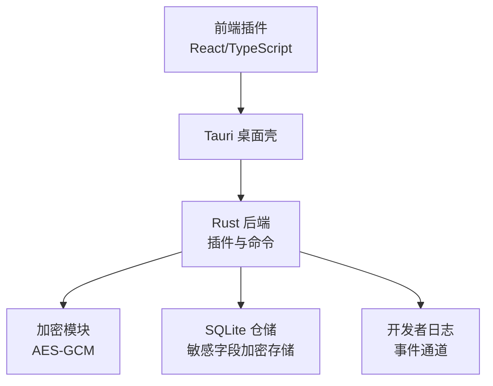
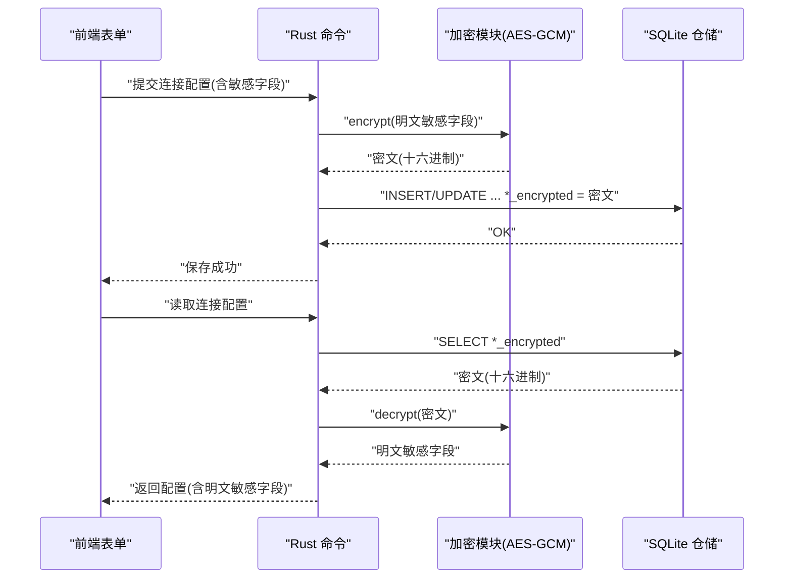
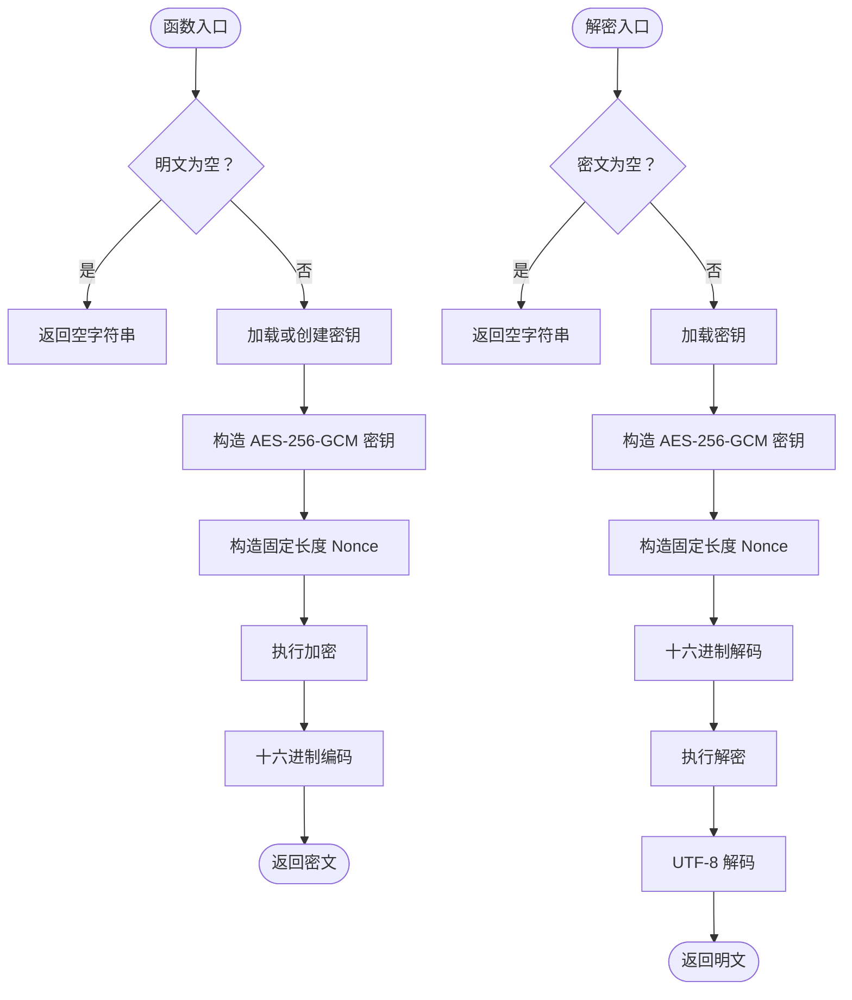
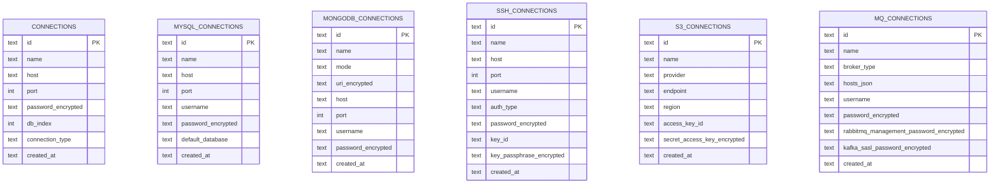
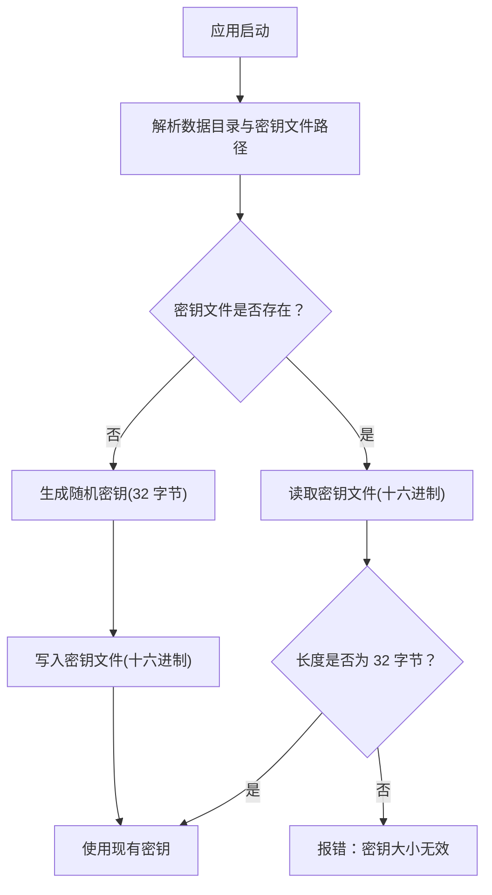
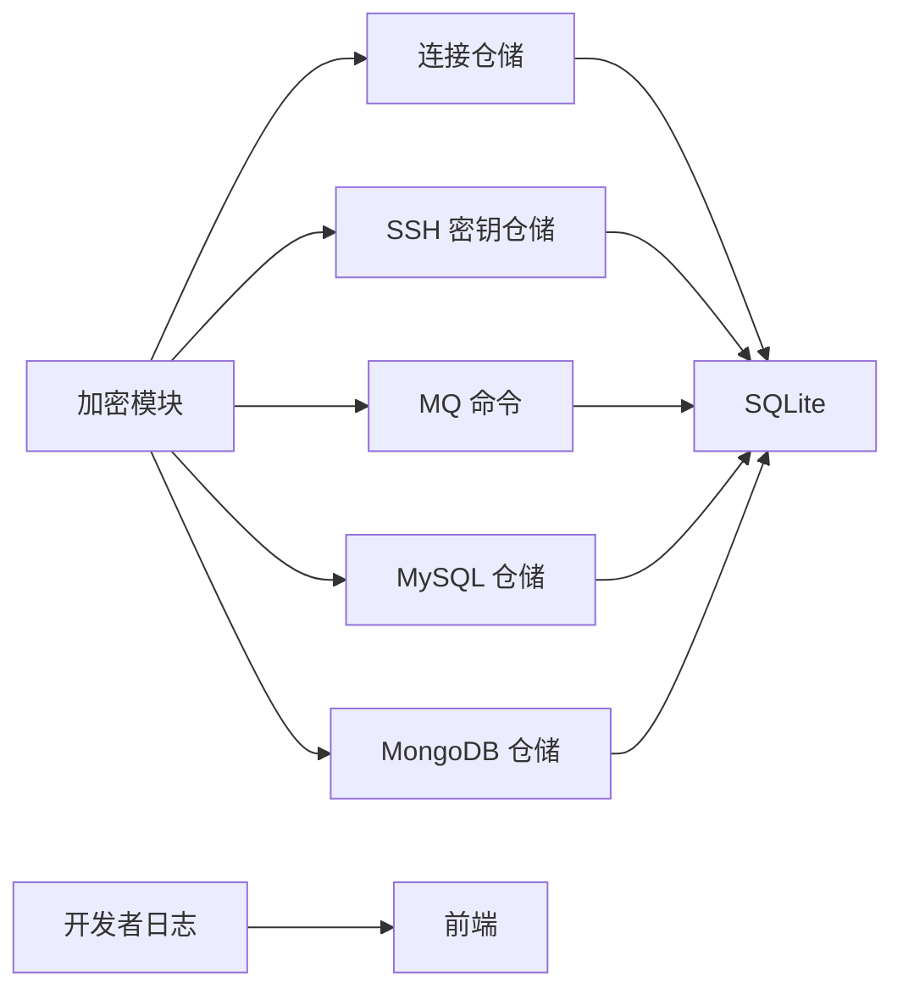

# 安全与加密

<cite>
**本文引用的文件**
- [src-tauri/src/crypto/mod.rs](file://src-tauri/src/crypto/mod.rs)
- [src-tauri/src/db/init.rs](file://src-tauri/src/db/init.rs)
- [src-tauri/src/db/connection_repo.rs](file://src-tauri/src/db/connection_repo.rs)
- [src-tauri/src/plugins/ssh/key_store.rs](file://src-tauri/src/plugins/ssh/key_store.rs)
- [src-tauri/src/plugins/mq/commands.rs](file://src-tauri/src/plugins/mq/commands.rs)
- [src-tauri/src/plugins/mysql_connection_repo.rs](file://src-tauri/src/plugins/mysql_connection_repo.rs)
- [src-tauri/src/plugins/mongodb_connection_repo.rs](file://src-tauri/src/plugins/mongodb_connection_repo.rs)
- [src-tauri/src/plugins/ssh/terminal.rs](file://src-tauri/src/plugins/ssh/terminal.rs)
- [src-tauri/src/plugins/api_debugger/commands.rs](file://src-tauri/src/plugins/api_debugger/commands.rs)
- [src-tauri/src/dev_log.rs](file://src-tauri/src/dev_log.rs)
- [src-tauri/Cargo.toml](file://src-tauri/Cargo.toml)
- [README.md](file://README.md)
- [PLAN.md](file://PLAN.md)
</cite>

## 目录
1. [简介](#简介)
2. [项目结构](#项目结构)
3. [核心组件](#核心组件)
4. [架构总览](#架构总览)
5. [详细组件分析](#详细组件分析)
6. [依赖关系分析](#依赖关系分析)
7. [性能考量](#性能考量)
8. [故障排查指南](#故障排查指南)
9. [结论](#结论)
10. [附录](#附录)

## 简介
本文件为 DevNexus 的安全与加密专项文档，聚焦于本地敏感数据保护与加密实现，涵盖以下方面：
- AES-GCM 加密实现：算法选择、密钥生成、初始化向量管理、加解密流程
- 敏感数据保护策略：连接配置中的密码、密钥、Token 等敏感字段的加密存储
- 密钥管理机制：密钥派生、存储位置、访问控制与轮换策略
- 安全最佳实践：数据传输安全、存储安全、访问控制与审计日志
- 威胁模型与风险评估：潜在攻击向量、防护措施与风险等级
- 安全配置指南：加密参数、密钥策略与审计建议
- 安全事件预防与应急响应：漏洞预防、应急流程与更新机制
- 开发过程中的安全注意事项与代码审查要点

## 项目结构
DevNexus 采用“前端 React + Tauri + Rust 后端”的桌面应用架构，敏感数据通过本地 SQLite 存储，并使用 AES-GCM 在 Rust 后端进行加解密。关键安全相关模块分布如下：
- 加密模块：Rust 后端的加密/解密实现
- 数据库初始化与仓储：敏感字段的加密存储与检索
- 插件层：各连接插件在保存/读取敏感字段时调用加密/解密
- 审计日志：开发者日志通道用于记录运行时事件

**图表来源**
- [src-tauri/src/crypto/mod.rs:1-75](file://src-tauri/src/crypto/mod.rs#L1-L75)
- [src-tauri/src/db/init.rs:35-363](file://src-tauri/src/db/init.rs#L35-L363)
- [src-tauri/src/db/connection_repo.rs:96-155](file://src-tauri/src/db/connection_repo.rs#L96-L155)
- [src-tauri/src/dev_log.rs:29-69](file://src-tauri/src/dev_log.rs#L29-L69)

**章节来源**
- [README.md:27-34](file://README.md#L27-L34)
- [src-tauri/src/crypto/mod.rs:1-75](file://src-tauri/src/crypto/mod.rs#L1-L75)
- [src-tauri/src/db/init.rs:35-363](file://src-tauri/src/db/init.rs#L35-L363)

## 核心组件
- 加密模块（AES-GCM）
  - 算法：AES-256-GCM
  - 密钥：从本地数据目录读取或生成，长度为 32 字节（256 位）
  - 初始化向量：固定长度 12 字节的零向量（不推荐用于生产）
  - 编解码：密文与密钥均以十六进制字符串存储
- 数据库仓储
  - 敏感字段均以“*_encrypted”命名，存储加密后的文本
  - 读取时调用解密模块还原明文
- 插件层
  - 各连接插件在保存配置时调用加密模块
  - 读取配置时调用解密模块
- 审计日志
  - 提供开发者日志通道，记录运行时事件，便于安全审计

**章节来源**
- [src-tauri/src/crypto/mod.rs:1-75](file://src-tauri/src/crypto/mod.rs#L1-L75)
- [src-tauri/src/db/init.rs:37-157](file://src-tauri/src/db/init.rs#L37-L157)
- [src-tauri/src/db/connection_repo.rs:96-155](file://src-tauri/src/db/connection_repo.rs#L96-L155)
- [src-tauri/src/plugins/ssh/key_store.rs:88-91](file://src-tauri/src/plugins/ssh/key_store.rs#L88-L91)
- [src-tauri/src/plugins/mq/commands.rs:30-46](file://src-tauri/src/plugins/mq/commands.rs#L30-L46)
- [src-tauri/src/plugins/mysql_connection_repo.rs:185-208](file://src-tauri/src/plugins/mysql_connection_repo.rs#L185-L208)
- [src-tauri/src/plugins/mongodb_connection_repo.rs:149-158](file://src-tauri/src/plugins/mongodb_connection_repo.rs#L149-L158)
- [src-tauri/src/dev_log.rs:29-69](file://src-tauri/src/dev_log.rs#L29-L69)

## 架构总览
下图展示了敏感数据从输入到持久化与恢复的端到端流程，以及加密模块与数据库仓储的交互。

**图表来源**
- [src-tauri/src/db/connection_repo.rs:96-155](file://src-tauri/src/db/connection_repo.rs#L96-L155)
- [src-tauri/src/crypto/mod.rs:40-74](file://src-tauri/src/crypto/mod.rs#L40-L74)
- [src-tauri/src/plugins/ssh/key_store.rs:88-91](file://src-tauri/src/plugins/ssh/key_store.rs#L88-L91)
- [src-tauri/src/plugins/mq/commands.rs:30-46](file://src-tauri/src/plugins/mq/commands.rs#L30-L46)
- [src-tauri/src/plugins/mysql_connection_repo.rs:185-208](file://src-tauri/src/plugins/mysql_connection_repo.rs#L185-L208)
- [src-tauri/src/plugins/mongodb_connection_repo.rs:149-158](file://src-tauri/src/plugins/mongodb_connection_repo.rs#L149-L158)

## 详细组件分析

### AES-GCM 加密实现
- 算法选择
  - 使用 AES-256-GCM，具备机密性与完整性保护
- 密钥生成与存储
  - 首次运行在本地数据目录生成随机密钥（32 字节），以十六进制形式写入文件
  - 后续启动直接从文件读取，确保同一设备内一致性
- 初始化向量（Nonce）
  - 固定为 12 字节零向量，存在重复使用风险，不建议在生产中重复使用相同密钥与非一致性的 IV
- 加密/解密流程
  - 明文字符串经加密后以十六进制字符串存储
  - 读取时先十六进制解码，再进行解密，最后转换为 UTF-8 字符串

**图表来源**
- [src-tauri/src/crypto/mod.rs:40-74](file://src-tauri/src/crypto/mod.rs#L40-L74)

**章节来源**
- [src-tauri/src/crypto/mod.rs:1-75](file://src-tauri/src/crypto/mod.rs#L1-L75)

### 敏感数据保护机制
- 存储策略
  - 所有敏感字段（如密码、URI、密钥、Token）在入库前均通过加密模块加密
  - 数据库存储列名以“*_encrypted”结尾，明确标识敏感字段
- 读取策略
  - 读取时从数据库取出密文，调用解密模块还原明文
- 典型场景
  - Redis/MQ/MySQL/MongoDB/S3/SSH 连接配置中的密码、URI、密钥等
  - SSH 密钥的 passphrase（若提供）也会被加密存储

**图表来源**
- [src-tauri/src/db/init.rs:37-157](file://src-tauri/src/db/init.rs#L37-L157)

**章节来源**
- [src-tauri/src/db/init.rs:37-157](file://src-tauri/src/db/init.rs#L37-L157)
- [src-tauri/src/db/connection_repo.rs:96-155](file://src-tauri/src/db/connection_repo.rs#L96-L155)
- [src-tauri/src/plugins/ssh/key_store.rs:88-91](file://src-tauri/src/plugins/ssh/key_store.rs#L88-L91)
- [src-tauri/src/plugins/mq/commands.rs:30-46](file://src-tauri/src/plugins/mq/commands.rs#L30-L46)
- [src-tauri/src/plugins/mysql_connection_repo.rs:185-208](file://src-tauri/src/plugins/mysql_connection_repo.rs#L185-L208)
- [src-tauri/src/plugins/mongodb_connection_repo.rs:149-158](file://src-tauri/src/plugins/mongodb_connection_repo.rs#L149-L158)

### 密钥管理机制
- 密钥派生
  - 首次运行生成 UUID 并扩展为 32 字节作为密钥
  - 后续启动从本地文件读取密钥
- 存储位置
  - 密钥文件位于应用数据目录，文件名为固定名称
- 访问控制
  - 通过操作系统权限控制密钥文件访问（例如在 Windows 上重置 ACL、继承控制与用户绑定）
- 轮换策略
  - 当前实现未提供密钥轮换逻辑；建议在升级时迁移密钥文件并重新加密旧数据

**图表来源**
- [src-tauri/src/crypto/mod.rs:10-38](file://src-tauri/src/crypto/mod.rs#L10-L38)

**章节来源**
- [src-tauri/src/crypto/mod.rs:10-38](file://src-tauri/src/crypto/mod.rs#L10-L38)
- [src-tauri/src/plugins/ssh/terminal.rs:218-252](file://src-tauri/src/plugins/ssh/terminal.rs#L218-L252)

### 安全最佳实践
- 数据传输安全
  - 默认使用 rustls 作为 TLS 实现，确保网络请求的安全性
- 存储安全
  - 敏感字段一律加密存储；密钥文件应严格限制访问权限
- 访问控制
  - 通过操作系统权限最小化密钥与数据库文件的可见范围
- 审计日志
  - 使用开发者日志通道记录关键事件，便于追踪异常与安全问题

**章节来源**
- [src-tauri/Cargo.toml](file://src-tauri/Cargo.toml#L45)
- [src-tauri/src/dev_log.rs:29-69](file://src-tauri/src/dev_log.rs#L29-L69)
- [src-tauri/src/plugins/ssh/terminal.rs:218-252](file://src-tauri/src/plugins/ssh/terminal.rs#L218-L252)

### 安全威胁模型与风险评估
- 威胁向量
  - 本地文件系统泄露（密钥文件、数据库文件）
  - 进程内存中敏感数据暴露（解密后明文）
  - 非法访问与权限滥用
- 风险等级与应对
  - 百万 Key 列表渲染卡顿：高；应对：虚拟列表 + 分批扫描
  - Redis 连接断开无感知：中；应对：心跳检测与自动重连
  - 大 Value 导致界面卡死：中；应对：超大值预览与延迟加载
  - 密码明文泄露：低；应对：AES-256-GCM 加密存储，密钥不离设备
  - Tauri WebView 平台差异：低；应对：锁定平台行为

**章节来源**
- [PLAN.md:368-405](file://PLAN.md#L368-L405)
- [README.md:364-370](file://README.md#L364-L370)

### 安全配置指南
- 加密参数调整
  - Nonce：当前固定为零向量，不建议在生产中重复使用相同密钥与非一致性的 IV
  - 密钥长度：保持 32 字节（256 位）
- 密钥管理策略
  - 限制密钥文件访问权限（操作系统层面）
  - 升级时迁移密钥文件并重新加密旧数据
- 安全审计
  - 启用开发者日志通道，定期检查异常事件
  - 对敏感字段的读写操作进行审计记录

**章节来源**
- [src-tauri/src/crypto/mod.rs:6-8](file://src-tauri/src/crypto/mod.rs#L6-L8)
- [src-tauri/src/plugins/ssh/terminal.rs:218-252](file://src-tauri/src/plugins/ssh/terminal.rs#L218-L252)
- [src-tauri/src/dev_log.rs:29-69](file://src-tauri/src/dev_log.rs#L29-L69)

### 安全漏洞预防与应急响应
- 预防措施
  - 不提交真实凭据与本地数据库文件
  - 对敏感字段进行脱敏处理（如 API Debugger 的敏感头与 Cookie）
- 应急响应
  - 发现密钥泄露：立即迁移密钥文件并重新加密所有敏感字段
  - 数据库泄露：隔离受影响实例，重建加密密钥并通知用户更换凭据
- 安全更新机制
  - 通过版本发布流程进行安全修复与功能更新

**章节来源**
- [README.md:364-370](file://README.md#L364-L370)
- [src-tauri/src/plugins/api_debugger/commands.rs:38-79](file://src-tauri/src/plugins/api_debugger/commands.rs#L38-L79)

### 开发过程中的安全注意事项与代码审查要点
- 代码审查要点
  - 确保所有敏感字段在入库前经过加密
  - 确保解密仅在必要时发生，且在内存中尽快清理
  - 避免在日志中输出敏感字段
- 安全注意事项
  - 避免硬编码密钥或凭据
  - 严格限制密钥文件与数据库文件的访问权限
  - 对第三方依赖的加密与网络栈进行版本维护

**章节来源**
- [src-tauri/src/crypto/mod.rs:40-74](file://src-tauri/src/crypto/mod.rs#L40-L74)
- [src-tauri/src/plugins/api_debugger/commands.rs:38-79](file://src-tauri/src/plugins/api_debugger/commands.rs#L38-L79)

## 依赖关系分析
- 外部依赖
  - 加密：aes-gcm、hex
  - 数据库：rusqlite（捆绑）
  - 网络：reqwest（rustls-tls）
- 内部依赖
  - 加密模块被各连接仓储与插件命令调用
  - 数据库仓储定义敏感字段的存储结构
  - 审计日志模块提供事件通道

**图表来源**
- [src-tauri/src/crypto/mod.rs:1-75](file://src-tauri/src/crypto/mod.rs#L1-L75)
- [src-tauri/src/db/connection_repo.rs:96-155](file://src-tauri/src/db/connection_repo.rs#L96-L155)
- [src-tauri/src/plugins/ssh/key_store.rs:88-91](file://src-tauri/src/plugins/ssh/key_store.rs#L88-L91)
- [src-tauri/src/plugins/mq/commands.rs:30-46](file://src-tauri/src/plugins/mq/commands.rs#L30-L46)
- [src-tauri/src/plugins/mysql_connection_repo.rs:185-208](file://src-tauri/src/plugins/mysql_connection_repo.rs#L185-L208)
- [src-tauri/src/plugins/mongodb_connection_repo.rs:149-158](file://src-tauri/src/plugins/mongodb_connection_repo.rs#L149-L158)
- [src-tauri/src/dev_log.rs:29-69](file://src-tauri/src/dev_log.rs#L29-L69)

**章节来源**
- [src-tauri/Cargo.toml:20-48](file://src-tauri/Cargo.toml#L20-L48)

## 性能考量
- 加密开销
  - AES-GCM 为硬件加速友好，对大多数连接场景影响可忽略
- I/O 与存储
  - SQLite 写入受磁盘性能影响，建议避免频繁小事务
- 内存与缓存
  - 解密后明文在内存中存在，应尽快释放
  - 对超大值采用延迟加载策略

## 故障排查指南
- 常见问题
  - 无法读取密钥文件：检查文件是否存在与权限是否正确
  - 解密失败：确认密文格式与密钥一致性
  - 数据库迁移：确保旧表结构与新表结构兼容
- 审计与定位
  - 使用开发者日志通道查看事件与错误堆栈
  - 对敏感字段的读写进行日志记录与核对

**章节来源**
- [src-tauri/src/crypto/mod.rs:21-38](file://src-tauri/src/crypto/mod.rs#L21-L38)
- [src-tauri/src/dev_log.rs:29-69](file://src-tauri/src/dev_log.rs#L29-L69)

## 结论
DevNexus 在本地敏感数据保护方面采用了 AES-GCM 加密与严格的存储规范，结合操作系统权限控制与开发者日志通道，形成较为完整的安全基线。建议在生产环境中进一步强化 Nonce 管理、密钥轮换与访问控制策略，并持续关注第三方依赖的安全更新。

## 附录
- 关键实现路径
  - 加密模块：[src-tauri/src/crypto/mod.rs:1-75](file://src-tauri/src/crypto/mod.rs#L1-L75)
  - 数据库初始化与仓储：[src-tauri/src/db/init.rs:35-363](file://src-tauri/src/db/init.rs#L35-L363)、[src-tauri/src/db/connection_repo.rs:96-155](file://src-tauri/src/db/connection_repo.rs#L96-L155)
  - 插件层敏感字段处理：[src-tauri/src/plugins/ssh/key_store.rs:88-91](file://src-tauri/src/plugins/ssh/key_store.rs#L88-L91)、[src-tauri/src/plugins/mq/commands.rs:30-46](file://src-tauri/src/plugins/mq/commands.rs#L30-L46)、[src-tauri/src/plugins/mysql_connection_repo.rs:185-208](file://src-tauri/src/plugins/mysql_connection_repo.rs#L185-L208)、[src-tauri/src/plugins/mongodb_connection_repo.rs:149-158](file://src-tauri/src/plugins/mongodb_connection_repo.rs#L149-L158)
  - 审计日志：[src-tauri/src/dev_log.rs:29-69](file://src-tauri/src/dev_log.rs#L29-L69)
  - 外部依赖：[src-tauri/Cargo.toml:20-48](file://src-tauri/Cargo.toml#L20-L48)
  - 安全说明与限制：[README.md:364-370](file://README.md#L364-L370)、[PLAN.md:368-405](file://PLAN.md#L368-L405)