# 侧边栏导航系统

<cite>
**本文档引用的文件**
- [src/app/layout/Sidebar.tsx](file://src/app/layout/Sidebar.tsx)
- [src/app/plugin-registry/registry.ts](file://src/app/plugin-registry/registry.ts)
- [src/app/plugin-registry/types.ts](file://src/app/plugin-registry/types.ts)
- [src/app/plugin-registry/visibility.ts](file://src/app/plugin-registry/visibility.ts)
- [src/app/plugin-registry/builtin.ts](file://src/app/plugin-registry/builtin.ts)
- [src/app/store/settings.ts](file://src/app/store/settings.ts)
- [src/app/layout/AppShell.tsx](file://src/app/layout/AppShell.tsx)
- [src/main.tsx](file://src/main.tsx)
- [src/plugins/redis-manager/index.tsx](file://src/plugins/redis-manager/index.tsx)
- [src/plugins/mongodb-client/index.tsx](file://src/plugins/mongodb-client/index.tsx)
- [src/plugins/mysql-client/index.tsx](file://src/plugins/mysql-client/index.tsx)
- [src/plugins/api-debugger/index.tsx](file://src/plugins/api-debugger/index.tsx)
- [src/app/store/theme.ts](file://src/app/store/theme.ts)
</cite>

## 目录
1. [简介](#简介)
2. [项目结构](#项目结构)
3. [核心组件](#核心组件)
4. [架构概览](#架构概览)
5. [详细组件分析](#详细组件分析)
6. [依赖关系分析](#依赖关系分析)
7. [性能考虑](#性能考虑)
8. [故障排除指南](#故障排除指南)
9. [结论](#结论)

## 简介

侧边栏导航系统是 DevNexus 应用程序的核心界面组件，负责管理插件导航、状态管理和用户交互。该系统采用模块化设计，支持动态插件注册、条件渲染和状态持久化。

系统主要功能包括：
- 插件注册表集成和动态菜单生成
- 导航状态管理（选中项跟踪、折叠状态控制）
- 持久化存储机制
- 多层次导航结构（顶级插件和数据库工具分组）
- 主题切换和实用工具集成

## 项目结构

侧边栏导航系统位于应用程序的布局层，与插件注册表紧密集成：

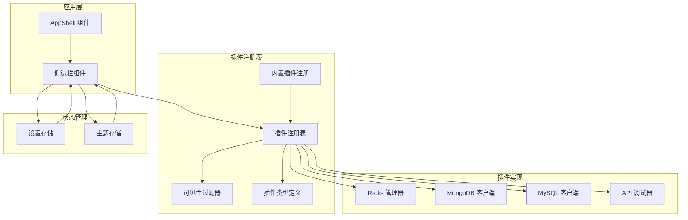

**图表来源**
- [src/app/layout/Sidebar.tsx:21-177](file://src/app/layout/Sidebar.tsx#L21-L177)
- [src/app/plugin-registry/registry.ts:1-26](file://src/app/plugin-registry/registry.ts#L1-L26)
- [src/app/store/settings.ts:1-28](file://src/app/store/settings.ts#L1-L28)

**章节来源**
- [src/app/layout/Sidebar.tsx:1-177](file://src/app/layout/Sidebar.tsx#L1-L177)
- [src/app/plugin-registry/registry.ts:1-26](file://src/app/plugin-registry/registry.ts#L1-L26)
- [src/app/plugin-registry/types.ts:1-14](file://src/app/plugin-registry/types.ts#L1-L14)

## 核心组件

### 插件注册表系统

插件注册表采用单例模式管理所有可用插件，提供统一的插件生命周期管理：

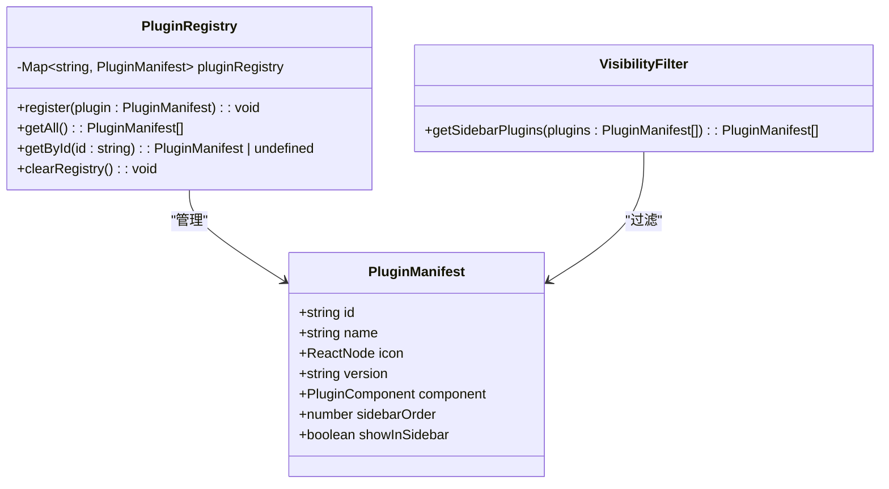

**图表来源**
- [src/app/plugin-registry/registry.ts:3-25](file://src/app/plugin-registry/registry.ts#L3-L25)
- [src/app/plugin-registry/types.ts:5-13](file://src/app/plugin-registry/types.ts#L5-L13)
- [src/app/plugin-registry/visibility.ts:3-5](file://src/app/plugin-registry/visibility.ts#L3-L5)

### 侧边栏导航组件

侧边栏组件负责渲染导航界面，管理折叠状态和选中项：

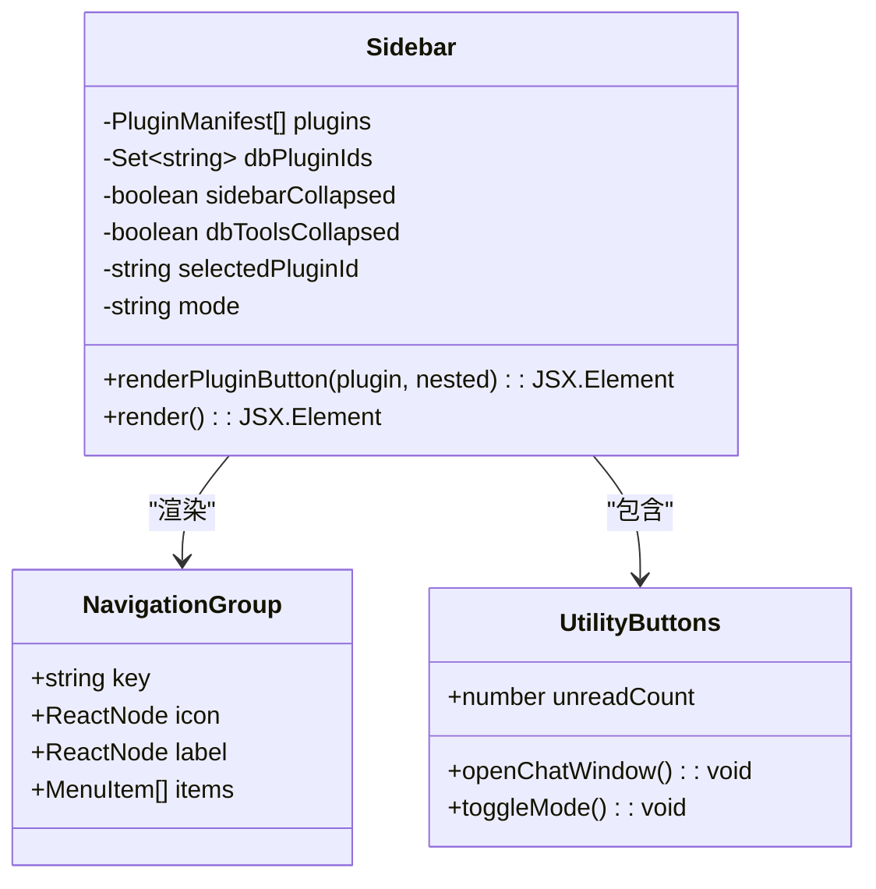

**图表来源**
- [src/app/layout/Sidebar.tsx:21-177](file://src/app/layout/Sidebar.tsx#L21-L177)

**章节来源**
- [src/app/plugin-registry/registry.ts:1-26](file://src/app/plugin-registry/registry.ts#L1-L26)
- [src/app/plugin-registry/types.ts:1-14](file://src/app/plugin-registry/types.ts#L1-L14)
- [src/app/plugin-registry/visibility.ts:1-6](file://src/app/plugin-registry/visibility.ts#L1-L6)
- [src/app/layout/Sidebar.tsx:1-177](file://src/app/layout/Sidebar.tsx#L1-L177)

## 架构概览

侧边栏导航系统采用分层架构设计，确保组件间的松耦合和高内聚：

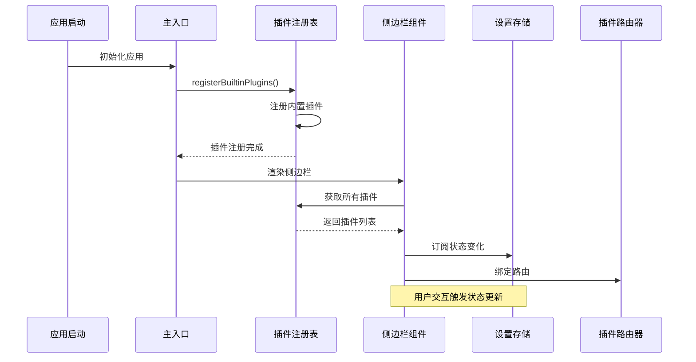

**图表来源**
- [src/main.tsx:10-10](file://src/main.tsx#L10-L10)
- [src/app/plugin-registry/builtin.ts:13-27](file://src/app/plugin-registry/builtin.ts#L13-L27)
- [src/app/layout/Sidebar.tsx:22-22](file://src/app/layout/Sidebar.tsx#L22-L22)

### 数据流架构

系统采用单向数据流模式，确保状态管理的可预测性：

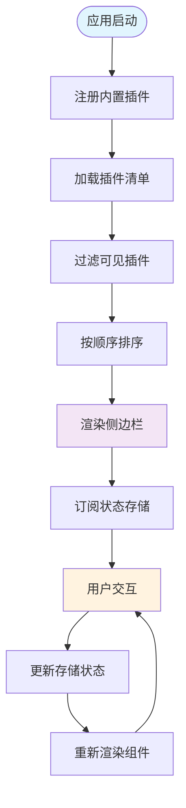

**图表来源**
- [src/app/plugin-registry/builtin.ts:13-27](file://src/app/plugin-registry/builtin.ts#L13-L27)
- [src/app/plugin-registry/visibility.ts:3-5](file://src/app/plugin-registry/visibility.ts#L3-L5)
- [src/app/plugin-registry/registry.ts:13-17](file://src/app/plugin-registry/registry.ts#L13-L17)

## 详细组件分析

### 插件注册机制

插件注册系统采用集中式管理模式，支持动态插件发现和注册：

#### 注册流程

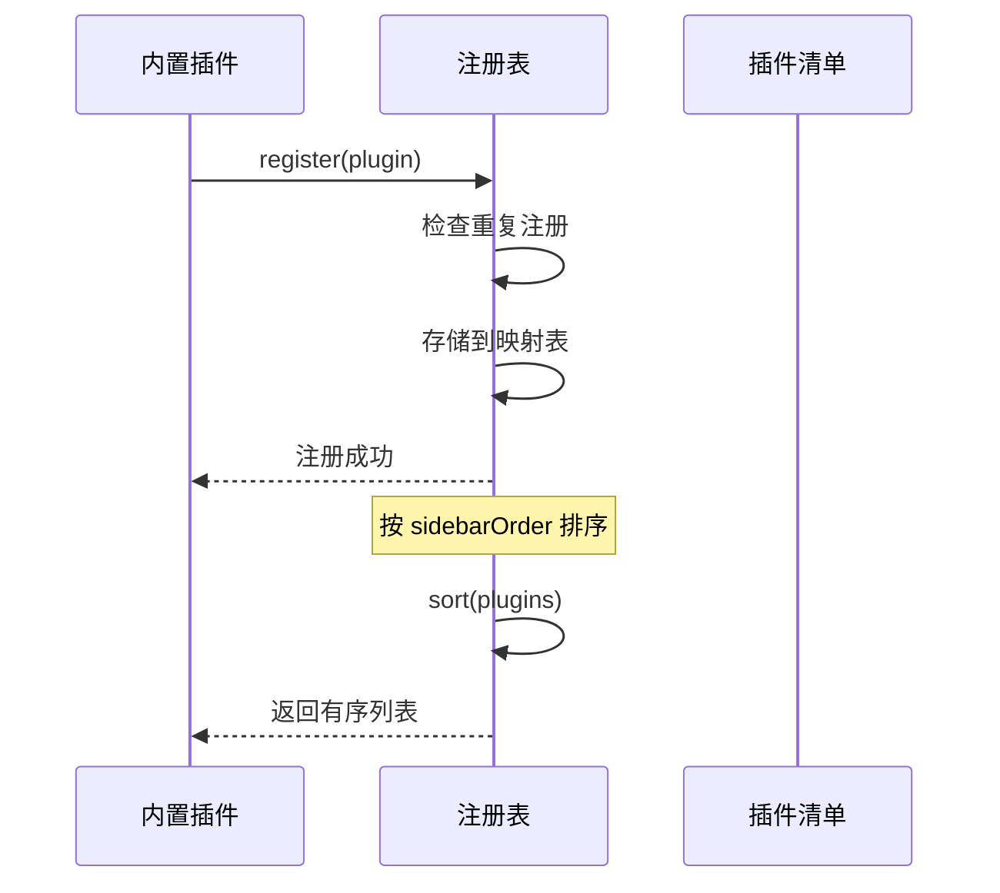

**图表来源**
- [src/app/plugin-registry/registry.ts:5-17](file://src/app/plugin-registry/registry.ts#L5-L17)
- [src/app/plugin-registry/builtin.ts:18-25](file://src/app/plugin-registry/builtin.ts#L18-L25)

#### 插件清单结构

每个插件通过标准化的清单接口描述其属性和行为：

| 属性名 | 类型 | 必需 | 描述 |
|--------|------|------|------|
| id | string | 是 | 插件唯一标识符 |
| name | string | 是 | 插件显示名称 |
| icon | ReactNode | 是 | 插件图标组件 |
| version | string | 是 | 插件版本号 |
| component | PluginComponent | 是 | 插件主组件 |
| sidebarOrder | number | 是 | 侧边栏排序权重 |
| showInSidebar | boolean | 否 | 是否显示在侧边栏 |

**章节来源**
- [src/app/plugin-registry/types.ts:5-13](file://src/app/plugin-registry/types.ts#L5-L13)
- [src/app/plugin-registry/registry.ts:13-17](file://src/app/plugin-registry/registry.ts#L13-L17)

### 导航状态管理

系统使用 Zustand 状态管理库实现响应式状态管理，支持持久化存储：

#### 状态结构

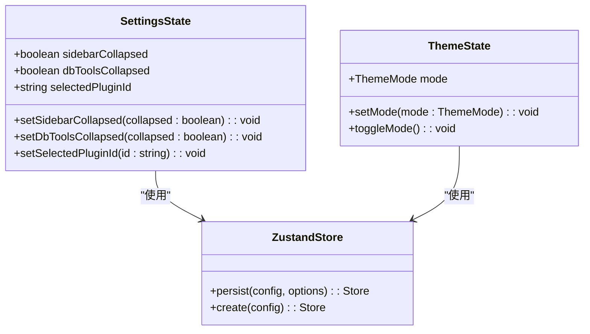

**图表来源**
- [src/app/store/settings.ts:4-21](file://src/app/store/settings.ts#L4-L21)
- [src/app/store/theme.ts:6-10](file://src/app/store/theme.ts#L6-L10)

#### 状态持久化策略

系统采用浏览器本地存储实现状态持久化，确保用户偏好设置的跨会话保持：

| 状态项 | 存储键 | 默认值 | 持久化范围 |
|--------|--------|--------|------------|
| sidebarCollapsed | devnexus-settings | false | 整个应用会话 |
| dbToolsCollapsed | devnexus-settings | false | 整个应用会话 |
| selectedPluginId | devnexus-settings | "redis-manager" | 整个应用会话 |
| themeMode | devnexus-theme | "light" | 整个应用会话 |

**章节来源**
- [src/app/store/settings.ts:14-27](file://src/app/store/settings.ts#L14-L27)
- [src/app/store/theme.ts:12-26](file://src/app/store/theme.ts#L12-L26)

### 动态菜单生成

侧边栏支持动态菜单生成，根据插件注册信息自动构建导航结构：

#### 菜单分类逻辑

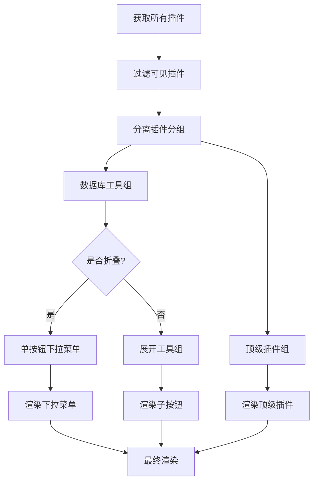

**图表来源**
- [src/app/layout/Sidebar.tsx:22-25](file://src/app/layout/Sidebar.tsx#L22-L25)
- [src/app/layout/Sidebar.tsx:44-48](file://src/app/layout/Sidebar.tsx#L44-L48)

#### 折叠状态控制

系统支持两种折叠模式：整体折叠和工具组折叠，提供灵活的界面布局选项：

| 折叠类型 | 触发方式 | 显示内容 | 用户体验 |
|----------|----------|----------|----------|
| 整体折叠 | 点击折叠按钮 | 品牌图标 + 工具组按钮 | 最大化空间利用率 |
| 工具组折叠 | 点击工具组标题 | 仅显示工具组图标 | 平衡信息密度和易用性 |

**章节来源**
- [src/app/layout/Sidebar.tsx:99-144](file://src/app/layout/Sidebar.tsx#L99-L144)
- [src/app/store/settings.ts:5-21](file://src/app/store/settings.ts#L5-L21)

### 插件可见性控制

插件可见性控制通过配置属性实现，支持细粒度的权限和条件渲染：

#### 可见性过滤机制

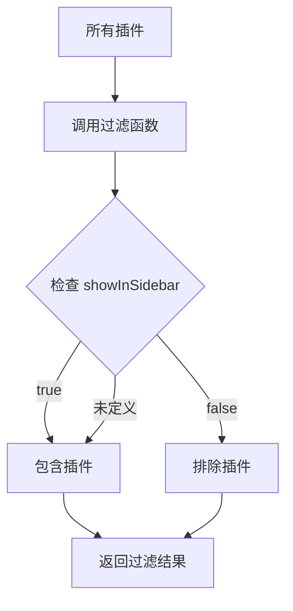

**图表来源**
- [src/app/plugin-registry/visibility.ts:3-5](file://src/app/plugin-registry/visibility.ts#L3-L5)

#### 条件渲染策略

插件的显示与否取决于多个因素的综合判断：

1. **显式配置**：`showInSidebar` 属性明确指定显示状态
2. **默认行为**：未设置时默认显示在侧边栏
3. **运行时检查**：根据用户权限和环境条件动态调整

**章节来源**
- [src/app/plugin-registry/visibility.ts:1-6](file://src/app/plugin-registry/visibility.ts#L1-L6)
- [src/app/plugin-registry/types.ts:12-12](file://src/app/plugin-registry/types.ts#L12-L12)

### 导航交互行为

系统提供丰富的交互体验，包括点击事件处理、键盘导航支持和快捷键绑定：

#### 事件处理机制

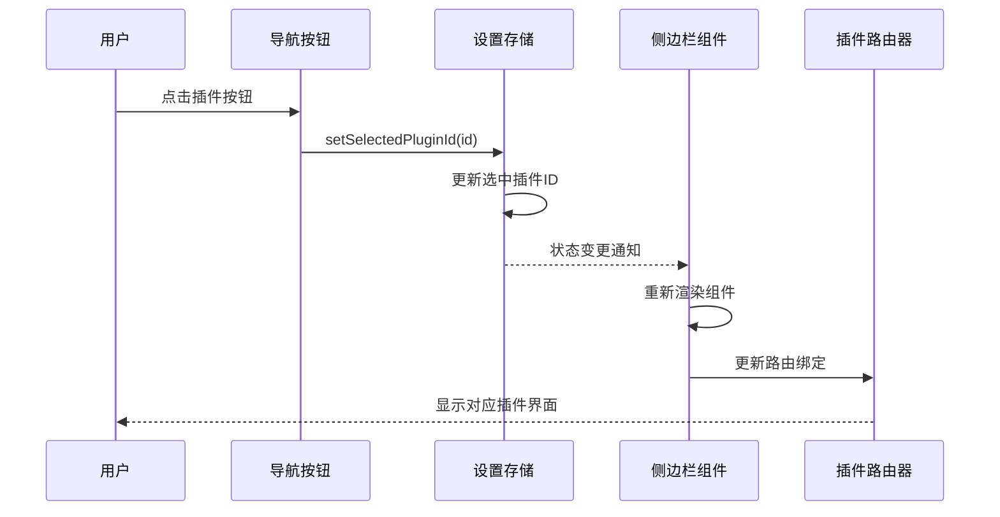

**图表来源**
- [src/app/layout/Sidebar.tsx:60-60](file://src/app/layout/Sidebar.tsx#L60-L60)
- [src/app/store/settings.ts:19-21](file://src/app/store/settings.ts#L19-L21)

#### 主题切换集成

侧边栏集成了主题切换功能，支持明暗主题的无缝切换：

| 主题模式 | 图标显示 | 文本标签 | CSS 类名 |
|----------|----------|----------|----------|
| light | 🌙 MoonOutlined | "Dark" | devnexus-sidebar__theme-dark |
| dark | ☀️ SunOutlined | "Light" | devnexus-sidebar__theme-light |

**章节来源**
- [src/app/layout/Sidebar.tsx:163-172](file://src/app/layout/Sidebar.tsx#L163-L172)
- [src/app/store/theme.ts:17-20](file://src/app/store/theme.ts#L17-L20)

## 依赖关系分析

侧边栏导航系统与其他组件存在密切的依赖关系：

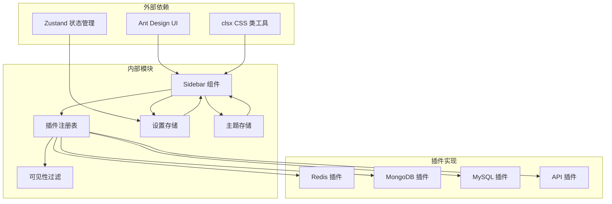

**图表来源**
- [src/app/layout/Sidebar.tsx:1-13](file://src/app/layout/Sidebar.tsx#L1-L13)
- [src/app/plugin-registry/registry.ts:1-1](file://src/app/plugin-registry/registry.ts#L1-L1)

### 组件耦合度分析

系统采用松耦合设计，各组件间通过清晰的接口进行通信：

| 组件 | 耦合类型 | 依赖关系 | 解耦策略 |
|------|----------|----------|----------|
| Sidebar | 高内聚低耦合 | 依赖 Registry 和 Store | 通过 props 传递数据 |
| Registry | 独立模块 | 无外部依赖 | 封装状态管理逻辑 |
| Settings | 状态管理 | 被多个组件依赖 | 使用 Zustand 单例模式 |
| Theme | 独立模块 | 轻量级依赖 | 简化的状态接口 |

**章节来源**
- [src/app/layout/Sidebar.tsx:15-41](file://src/app/layout/Sidebar.tsx#L15-L41)
- [src/app/plugin-registry/registry.ts:3-25](file://src/app/plugin-registry/registry.ts#L3-L25)

## 性能考虑

系统在设计时充分考虑了性能优化，采用多种策略提升用户体验：

### 渲染优化

1. **条件渲染**：根据折叠状态动态决定渲染内容
2. **虚拟滚动**：大量插件时采用虚拟化技术
3. **懒加载**：插件内容按需加载

### 状态管理优化

1. **选择性订阅**：组件只订阅必要的状态片段
2. **状态分片**：将大型状态拆分为独立的存储
3. **持久化缓存**：利用浏览器存储减少初始化时间

### 内存管理

1. **组件卸载清理**：及时清理事件监听器和定时器
2. **插件资源释放**：插件切换时释放不必要的资源
3. **垃圾回收优化**：避免内存泄漏和循环引用

## 故障排除指南

### 常见问题及解决方案

#### 插件不显示在侧边栏

**症状**：插件已注册但不在侧边栏显示

**可能原因**：
1. `showInSidebar` 属性设置为 `false`
2. 插件 ID 重复导致覆盖
3. `sidebarOrder` 值异常

**解决步骤**：
1. 检查插件清单中的 `showInSidebar` 属性
2. 验证插件 ID 的唯一性
3. 确认 `sidebarOrder` 数值范围合理

#### 导航状态不同步

**症状**：点击导航项后界面不更新

**可能原因**：
1. 状态存储未正确更新
2. 组件未正确订阅状态变化
3. 路由绑定失效

**解决步骤**：
1. 检查 `setSelectedPluginId` 函数调用
2. 验证组件的状态订阅逻辑
3. 确认路由配置正确

#### 折叠状态异常

**症状**：侧边栏折叠/展开行为异常

**可能原因**：
1. `sidebarCollapsed` 状态冲突
2. CSS 样式覆盖
3. 事件处理器绑定错误

**解决步骤**：
1. 检查折叠状态的切换逻辑
2. 验证 CSS 类名的应用
3. 确认事件处理器的正确绑定

**章节来源**
- [src/app/plugin-registry/visibility.ts:3-5](file://src/app/plugin-registry/visibility.ts#L3-L5)
- [src/app/store/settings.ts:14-27](file://src/app/store/settings.ts#L14-L27)

## 结论

侧边栏导航系统通过模块化设计实现了高度可扩展的插件架构。系统的关键优势包括：

1. **灵活的插件注册机制**：支持动态插件发现和注册
2. **智能的状态管理**：提供持久化的用户偏好设置
3. **优雅的用户界面**：支持多种折叠模式和主题切换
4. **良好的性能表现**：采用多种优化策略确保流畅体验

该系统为 DevNexus 应用提供了坚实的基础，支持未来功能的扩展和维护。通过清晰的架构设计和完善的错误处理机制，系统能够稳定地支持各种复杂的导航需求。