# 布局与主题系统

<cite>
**本文引用的文件**
- [AppShell.tsx](file://src/app/layout/AppShell.tsx)
- [Sidebar.tsx](file://src/app/layout/Sidebar.tsx)
- [Titlebar.tsx](file://src/app/layout/Titlebar.tsx)
- [status-bar.ts](file://src/app/layout/status-bar.ts)
- [theme.ts](file://src/app/store/theme.ts)
- [settings.ts](file://src/app/store/settings.ts)
- [global.css](file://src/styles/global.css)
- [registry.ts](file://src/app/plugin-registry/registry.ts)
- [visibility.ts](file://src/app/plugin-registry/visibility.ts)
- [types.ts](file://src/app/plugin-registry/types.ts)
- [lan-chat.ts](file://src/plugins/lan-chat/store/lan-chat.ts)
- [platform.ts](file://src/app/runtime/platform.ts)
- [redis-manager/index.tsx](file://src/plugins/redis-manager/index.tsx)
- [mongodb-client/index.tsx](file://src/plugins/mongodb-client/index.tsx)
</cite>

## 目录
1. [简介](#简介)
2. [项目结构](#项目结构)
3. [核心组件](#核心组件)
4. [架构总览](#架构总览)
5. [详细组件分析](#详细组件分析)
6. [依赖关系分析](#依赖关系分析)
7. [性能考量](#性能考量)
8. [故障排查指南](#故障排查指南)
9. [结论](#结论)
10. [附录：布局定制指南](#附录布局定制指南)

## 简介
本文件系统性阐述 DevNexus 的布局与主题系统，涵盖应用壳层（AppShell）的整体设计、主界面布局结构、组件组织方式与响应式实现；侧边栏导航（Sidebar）的导航项配置、路由绑定、状态管理与交互行为；自定义标题栏（Titlebar）的窗口控制按钮、拖拽区域与平台适配；状态栏（StatusBar）的状态显示、系统信息展示与用户交互；主题切换机制（主题状态管理、CSS 变量系统与动态样式应用）；设置状态管理（用户偏好存储、配置同步与持久化机制）；以及布局定制指南（组件扩展、样式覆盖与主题开发最佳实践）。文档以代码级分析为基础，辅以可视化图示，帮助开发者快速理解并扩展系统。

## 项目结构
DevNexus 的布局与主题系统围绕“壳层 + 主体内容 + 工具条”的三层结构展开，采用 Ant Design 布局组件与 CSS 变量驱动的主题体系，并通过 Zustand 状态库实现跨模块的状态持久化与共享。

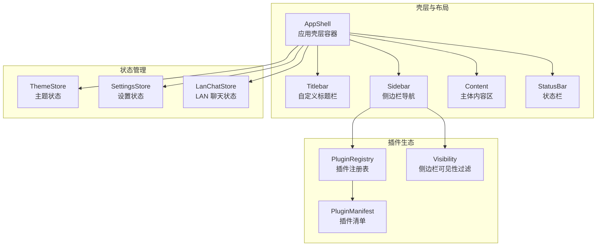

图表来源
- [AppShell.tsx:31-206](file://src/app/layout/AppShell.tsx#L31-L206)
- [Sidebar.tsx:21-176](file://src/app/layout/Sidebar.tsx#L21-L176)
- [theme.ts:12-26](file://src/app/store/theme.ts#L12-L26)
- [settings.ts:13-27](file://src/app/store/settings.ts#L13-L27)
- [lan-chat.ts:89-201](file://src/plugins/lan-chat/store/lan-chat.ts#L89-L201)
- [registry.ts:3-25](file://src/app/plugin-registry/registry.ts#L3-L25)
- [visibility.ts:3-5](file://src/app/plugin-registry/visibility.ts#L3-L5)
- [types.ts:5-13](file://src/app/plugin-registry/types.ts#L5-L13)

章节来源
- [AppShell.tsx:31-206](file://src/app/layout/AppShell.tsx#L31-L206)
- [Sidebar.tsx:21-176](file://src/app/layout/Sidebar.tsx#L21-L176)
- [theme.ts:12-26](file://src/app/store/theme.ts#L12-L26)
- [settings.ts:13-27](file://src/app/store/settings.ts#L13-L27)
- [lan-chat.ts:89-201](file://src/plugins/lan-chat/store/lan-chat.ts#L89-L201)
- [registry.ts:3-25](file://src/app/plugin-registry/registry.ts#L3-L25)
- [visibility.ts:3-5](file://src/app/plugin-registry/visibility.ts#L3-L5)
- [types.ts:5-13](file://src/app/plugin-registry/types.ts#L5-L13)

## 核心组件
- 应用壳层（AppShell）
  - 负责整体布局容器、桌面窗口边缘拖动调整大小、状态栏构建与 LAN Chat 集成。
  - 关键职责：布局装配、窗口交互、状态栏数据聚合、聊天未读计数联动。
- 侧边栏（Sidebar）
  - 提供插件导航、数据库工具分组、主题切换入口、LAN Chat 入口与未读提示。
  - 关键职责：插件列表渲染、分组折叠、选中态管理、主题模式切换。
- 自定义标题栏（Titlebar）
  - 在非 macOS 平台提供窗口控制按钮与拖拽区域，支持双击最大化。
  - 关键职责：窗口最小化/最大化/关闭、拖拽启动、双击最大化。
- 状态栏（StatusBar）
  - 展示当前工具名、侧边栏状态、运行时环境与 LAN 设备/房间/传输统计。
  - 关键职责：状态项构建、聊天停靠判断。
- 主题系统（ThemeStore）
  - 管理主题模式（明/暗），持久化存储于浏览器本地。
  - 关键职责：模式切换、持久化、全局样式影响。
- 设置系统（SettingsStore）
  - 管理侧边栏折叠、数据库工具分组折叠、当前选中插件等用户偏好。
  - 关键职责：偏好持久化、UI 状态同步。
- 插件注册与可见性（PluginRegistry + Visibility）
  - 维护插件清单、按侧边栏顺序排序、过滤不可见插件。
  - 关键职责：插件发现、排序、可见性控制。

章节来源
- [AppShell.tsx:31-206](file://src/app/layout/AppShell.tsx#L31-L206)
- [Sidebar.tsx:21-176](file://src/app/layout/Sidebar.tsx#L21-L176)
- [Titlebar.tsx:12-74](file://src/app/layout/Titlebar.tsx#L12-L74)
- [status-bar.ts:15-28](file://src/app/layout/status-bar.ts#L15-L28)
- [theme.ts:12-26](file://src/app/store/theme.ts#L12-L26)
- [settings.ts:13-27](file://src/app/store/settings.ts#L13-L27)
- [registry.ts:3-25](file://src/app/plugin-registry/registry.ts#L3-L25)
- [visibility.ts:3-5](file://src/app/plugin-registry/visibility.ts#L3-L5)

## 架构总览
下图展示了从壳层到各子系统的调用链与数据流，体现主题、设置、插件与状态栏之间的协作关系。

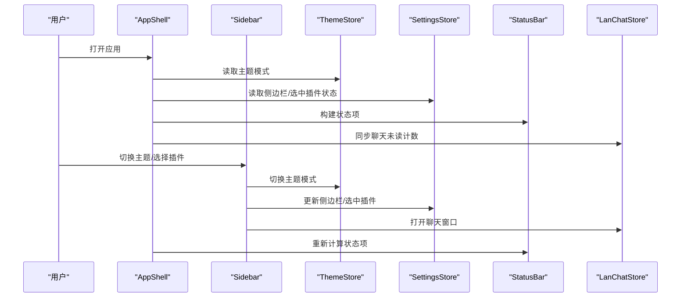

图表来源
- [AppShell.tsx:45-56](file://src/app/layout/AppShell.tsx#L45-L56)
- [Sidebar.tsx:38-41](file://src/app/layout/Sidebar.tsx#L38-L41)
- [theme.ts:12-26](file://src/app/store/theme.ts#L12-L26)
- [settings.ts:13-27](file://src/app/store/settings.ts#L13-L27)
- [lan-chat.ts:89-201](file://src/plugins/lan-chat/store/lan-chat.ts#L89-L201)
- [status-bar.ts:15-28](file://src/app/layout/status-bar.ts#L15-L28)

## 详细组件分析

### 应用壳层（AppShell）分析
- 布局结构
  - 使用 Ant Design Layout 容器，包含 Header（Titlebar）、Sider（Sidebar）、Content、Footer（StatusBar）。
  - 支持原生标题栏场景下的高度适配类名切换。
- 桌面窗口交互
  - 在非 macOS 平台启用窗口拖拽与边缘拖动调整大小，使用 Tauri API 启动拖拽与调整。
- 状态栏数据聚合
  - 通过状态工厂函数构建状态项，包含工具名、侧边栏状态、运行时类型与 LAN 统计。
- LAN Chat 集成
  - 定期刷新 LAN 快照，计算未读消息并更新聊天未读计数，支持聊天窗口停靠逻辑。

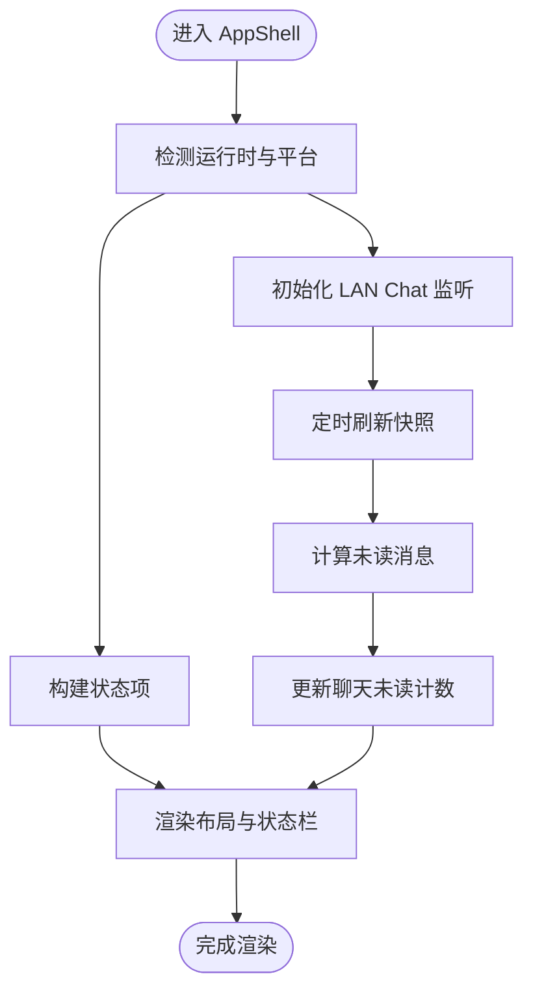

图表来源
- [AppShell.tsx:59-92](file://src/app/layout/AppShell.tsx#L59-L92)
- [AppShell.tsx:45-56](file://src/app/layout/AppShell.tsx#L45-L56)
- [status-bar.ts:15-28](file://src/app/layout/status-bar.ts#L15-L28)

章节来源
- [AppShell.tsx:31-206](file://src/app/layout/AppShell.tsx#L31-L206)
- [status-bar.ts:15-28](file://src/app/layout/status-bar.ts#L15-L28)

### 侧边栏（Sidebar）分析
- 导航项配置
  - 从插件注册表获取插件清单，按 sidebarOrder 排序，过滤 showInSidebar=false 的插件。
  - 数据库工具（Redis/MongoDB/MySQL）单独分组，支持折叠与嵌套按钮渲染。
- 路由绑定与状态管理
  - 通过 SettingsStore 管理当前选中插件 ID，点击按钮触发状态更新。
  - 分组折叠状态独立维护，支持点击展开/收起。
- 交互行为
  - 折叠模式下使用 Tooltip 显示名称，点击分组弹出下拉菜单。
  - 提供主题切换按钮与 LAN Chat 入口，均支持未读计数提示。

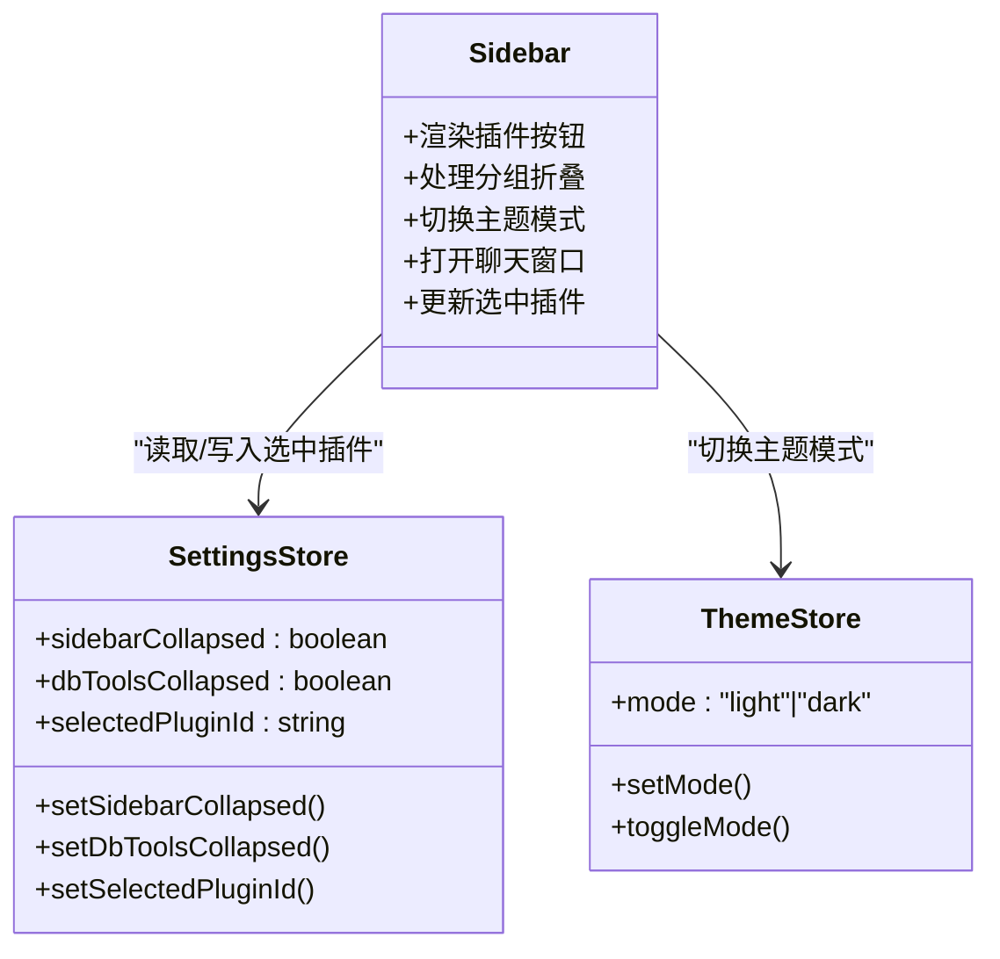

图表来源
- [Sidebar.tsx:21-176](file://src/app/layout/Sidebar.tsx#L21-L176)
- [settings.ts:13-27](file://src/app/store/settings.ts#L13-L27)
- [theme.ts:12-26](file://src/app/store/theme.ts#L12-L26)

章节来源
- [Sidebar.tsx:21-176](file://src/app/layout/Sidebar.tsx#L21-L176)
- [registry.ts:13-17](file://src/app/plugin-registry/registry.ts#L13-L17)
- [visibility.ts:3-5](file://src/app/plugin-registry/visibility.ts#L3-L5)
- [settings.ts:13-27](file://src/app/store/settings.ts#L13-L27)
- [theme.ts:12-26](file://src/app/store/theme.ts#L12-L26)

### 自定义标题栏（Titlebar）分析
- 平台适配
  - macOS 运行时直接返回空，避免与系统原生标题栏冲突。
- 窗口控制
  - 提供最小化、最大化/还原、关闭三个按钮，绑定 Tauri 窗口 API。
- 拖拽区域与双击行为
  - 标题栏区域支持鼠标拖拽移动窗口；双击进行最大化/还原切换。
  - 对事件目标进行按钮判定，避免误触。

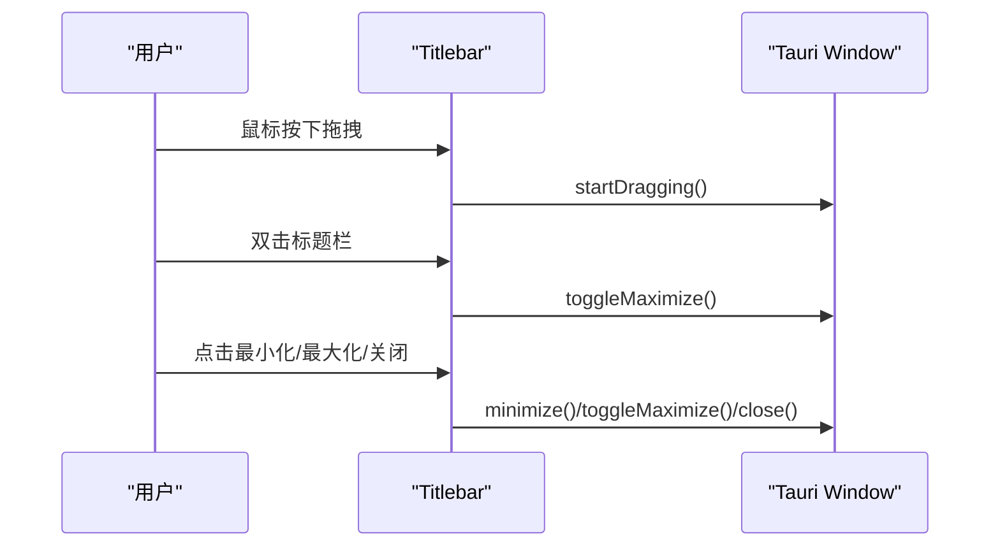

图表来源
- [Titlebar.tsx:12-74](file://src/app/layout/Titlebar.tsx#L12-L74)
- [platform.ts:1-9](file://src/app/runtime/platform.ts#L1-L9)

章节来源
- [Titlebar.tsx:12-74](file://src/app/layout/Titlebar.tsx#L12-L74)
- [platform.ts:1-9](file://src/app/runtime/platform.ts#L1-L9)

### 状态栏（StatusBar）分析
- 状态项构建
  - 输入包含当前工具名、侧边栏折叠状态、运行时类型与 LAN 统计。
  - 输出为标签-值对数组，用于 Footer 区域展示。
- 聊天停靠判断
  - 当聊天窗口处于“已打开且最小化”时，状态栏显示快捷按钮以便恢复。

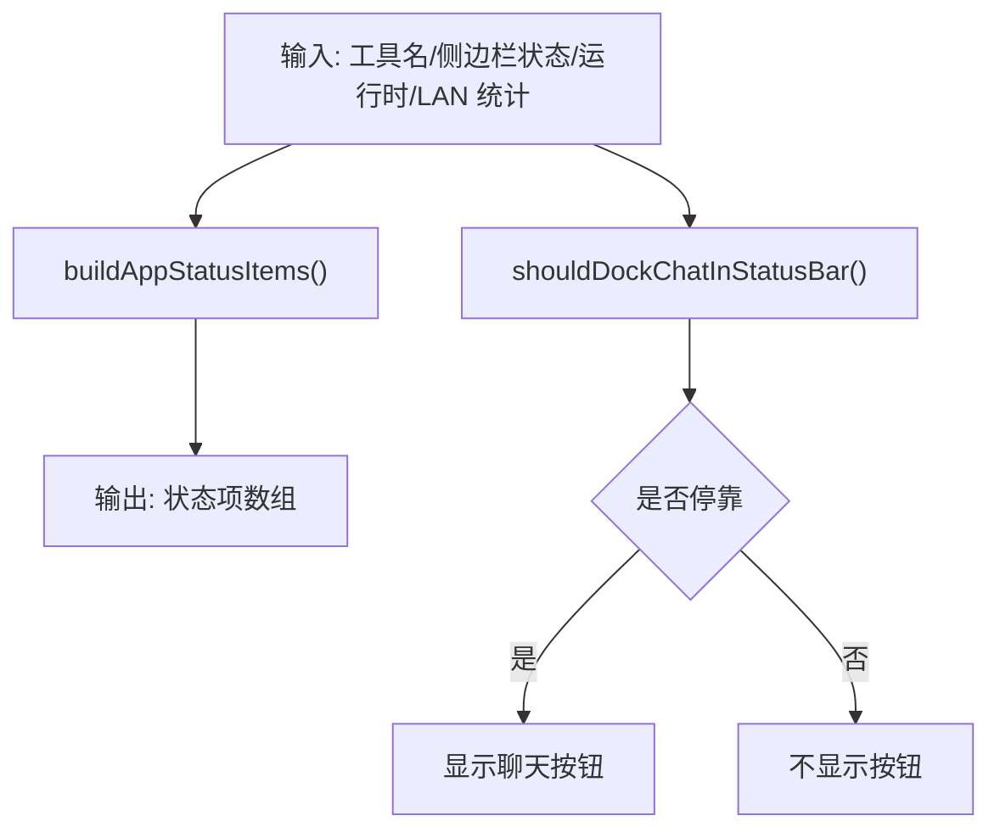

图表来源
- [status-bar.ts:15-28](file://src/app/layout/status-bar.ts#L15-L28)

章节来源
- [status-bar.ts:15-28](file://src/app/layout/status-bar.ts#L15-L28)

### 主题切换机制分析
- 状态管理
  - ThemeStore 使用 Zustand + persist，持久化键名为 devnexus-theme，默认 light 模式。
- 动态样式应用
  - 全局 CSS 使用 CSS 变量作为主题色板，如 --devnexus-app-bg、--devnexus-border-color 等。
  - 组件样式通过 var(--variable) 引用变量，实现明/暗主题自动切换。
- 切换流程
  - Sidebar 中的按钮调用 toggleMode，更新 Store；AppShell 读取 mode 并影响渲染与状态栏。

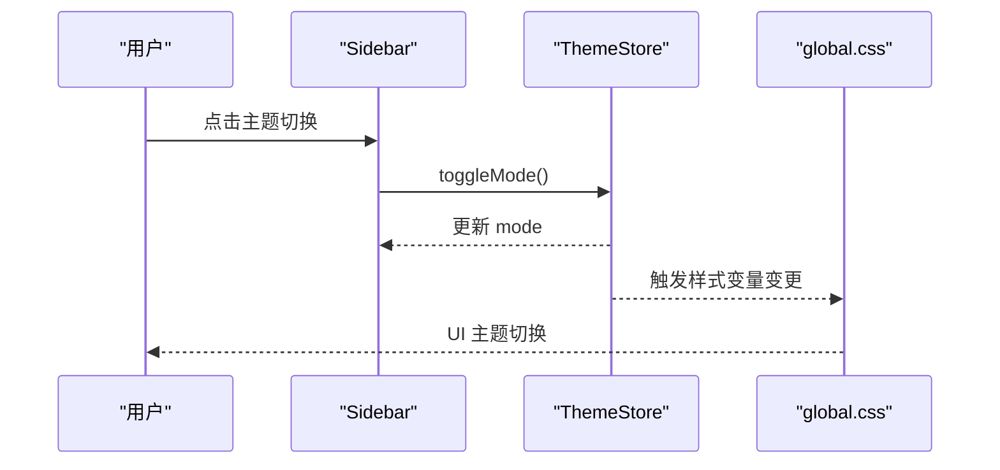

图表来源
- [theme.ts:12-26](file://src/app/store/theme.ts#L12-L26)
- [Sidebar.tsx:38-41](file://src/app/layout/Sidebar.tsx#L38-L41)
- [global.css:1-17](file://src/styles/global.css#L1-L17)

章节来源
- [theme.ts:12-26](file://src/app/store/theme.ts#L12-L26)
- [Sidebar.tsx:38-41](file://src/app/layout/Sidebar.tsx#L38-L41)
- [global.css:1-17](file://src/styles/global.css#L1-L17)

### 设置状态管理分析
- 用户偏好存储
  - SettingsStore 持久化键名为 devnexus-settings，包含 sidebarCollapsed、dbToolsCollapsed、selectedPluginId。
- 配置同步与默认值
  - 初始化默认选中插件为 redis-manager，确保首次加载有明确上下文。
- 与 Sidebar/PluginRouter 的联动
  - Sidebar 读取/写入设置，驱动插件切换与分组折叠；AppShell 读取设置用于状态栏与布局。

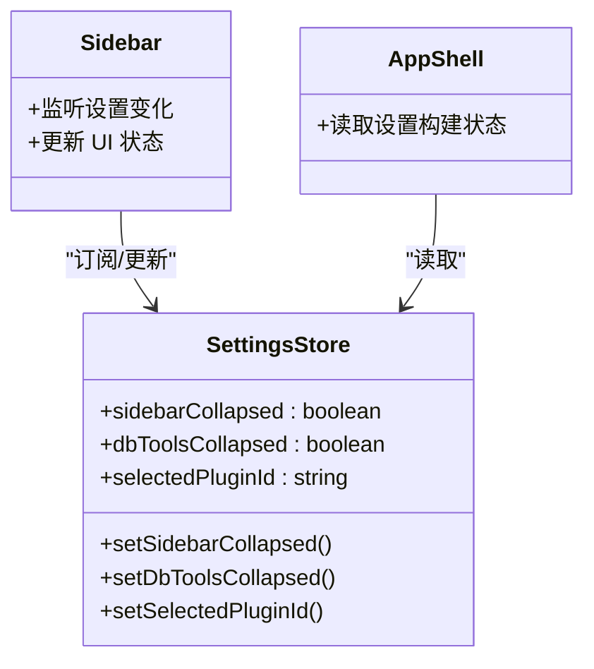

图表来源
- [settings.ts:13-27](file://src/app/store/settings.ts#L13-L27)
- [Sidebar.tsx:26-37](file://src/app/layout/Sidebar.tsx#L26-L37)
- [AppShell.tsx:32-34](file://src/app/layout/AppShell.tsx#L32-L34)

章节来源
- [settings.ts:13-27](file://src/app/store/settings.ts#L13-L27)
- [Sidebar.tsx:26-37](file://src/app/layout/Sidebar.tsx#L26-L37)
- [AppShell.tsx:32-34](file://src/app/layout/AppShell.tsx#L32-L34)

### 插件注册与可见性分析
- 插件清单
  - PluginManifest 定义插件 id/name/icon/version/component/sidebarOrder/showInSidebar。
- 注册与查询
  - 通过 Map 存储插件清单，getAll 按 sidebarOrder 排序；getById 获取单个插件。
- 侧边栏可见性
  - 仅显示 showInSidebar 不为 false 的插件，保证可配置的隐藏能力。

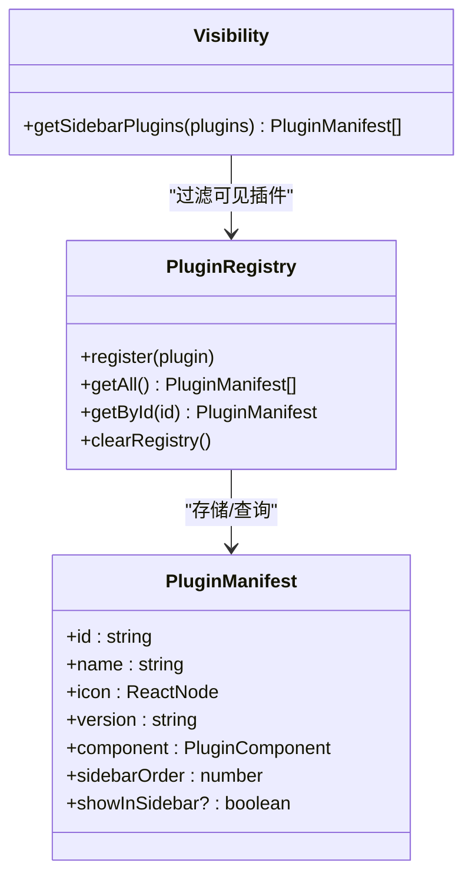

图表来源
- [registry.ts:3-25](file://src/app/plugin-registry/registry.ts#L3-L25)
- [visibility.ts:3-5](file://src/app/plugin-registry/visibility.ts#L3-L5)
- [types.ts:5-13](file://src/app/plugin-registry/types.ts#L5-L13)

章节来源
- [registry.ts:3-25](file://src/app/plugin-registry/registry.ts#L3-L25)
- [visibility.ts:3-5](file://src/app/plugin-registry/visibility.ts#L3-L5)
- [types.ts:5-13](file://src/app/plugin-registry/types.ts#L5-L13)

### LAN Chat 集成分析
- 状态模型
  - LanChatStore 维护窗口状态（open/minimized/x/y/width/height/unreadCount/activeConversationId）与会话未读计数映射。
- 生命周期与交互
  - 提供 open/close/minimize/restore/maximize/setWindowBounds 等操作。
  - AppShell 中周期性刷新 LAN 快照，计算未读并更新 Store。
- 与状态栏的协作
  - shouldDockChatInStatusBar 决定是否在状态栏显示快捷按钮。

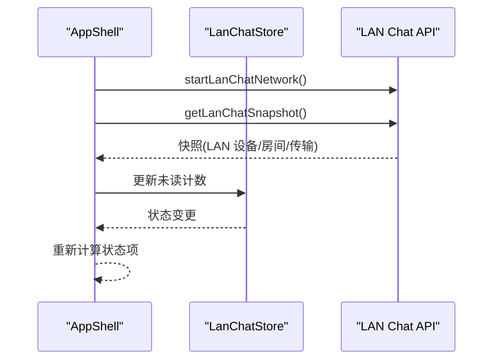

图表来源
- [AppShell.tsx:59-92](file://src/app/layout/AppShell.tsx#L59-L92)
- [lan-chat.ts:89-201](file://src/plugins/lan-chat/store/lan-chat.ts#L89-L201)
- [status-bar.ts:26-28](file://src/app/layout/status-bar.ts#L26-L28)

章节来源
- [AppShell.tsx:59-92](file://src/app/layout/AppShell.tsx#L59-L92)
- [lan-chat.ts:89-201](file://src/plugins/lan-chat/store/lan-chat.ts#L89-L201)
- [status-bar.ts:26-28](file://src/app/layout/status-bar.ts#L26-L28)

## 依赖关系分析
- 组件耦合
  - AppShell 与 Sidebar 通过 SettingsStore/ThemeStore/Status 工具函数耦合；与 LanChatStore 通过状态聚合耦合。
  - Sidebar 与 PluginRegistry/Visibility 通过插件清单与可见性过滤耦合。
- 外部依赖
  - Tauri 窗口 API 用于窗口控制与拖拽；Ant Design 组件库提供 UI 基础。
- 潜在循环依赖
  - 当前文件间无直接循环导入；状态与 UI 通过单向数据流传递，降低耦合风险。

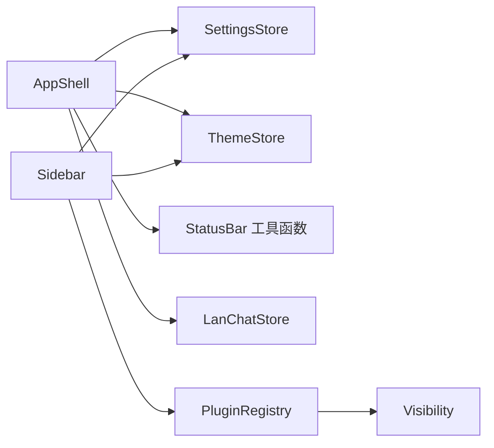

图表来源
- [AppShell.tsx:31-206](file://src/app/layout/AppShell.tsx#L31-L206)
- [Sidebar.tsx:21-176](file://src/app/layout/Sidebar.tsx#L21-L176)
- [registry.ts:3-25](file://src/app/plugin-registry/registry.ts#L3-L25)
- [visibility.ts:3-5](file://src/app/plugin-registry/visibility.ts#L3-L5)

章节来源
- [AppShell.tsx:31-206](file://src/app/layout/AppShell.tsx#L31-L206)
- [Sidebar.tsx:21-176](file://src/app/layout/Sidebar.tsx#L21-L176)
- [registry.ts:3-25](file://src/app/plugin-registry/registry.ts#L3-L25)
- [visibility.ts:3-5](file://src/app/plugin-registry/visibility.ts#L3-L5)

## 性能考量
- 渲染优化
  - AppShell 使用 useMemo 缓存状态项，避免不必要的重渲染。
  - Sidebar 按需渲染嵌套按钮与分组内容，折叠模式下减少 DOM 数量。
- 状态持久化
  - SettingsStore 与 ThemeStore 使用 persist，减少重复初始化成本。
- 网络轮询
  - LAN Chat 快照轮询间隔为 5 秒，初始延迟 1.8 秒，平衡实时性与性能。
- 样式变量
  - CSS 变量统一管理颜色与间距，主题切换仅需变更变量值，避免大量样式重算。

## 故障排查指南
- 标题栏无效或无法拖拽
  - 检查运行时是否为 macOS（macOS 返回空标题栏）；非 macOS 平台确认 Tauri 窗口句柄存在。
- 窗口无法调整大小
  - 确认非 macOS 平台且边缘覆盖层已渲染；检查鼠标事件与 startResizeDragging 是否被调用。
- 主题切换无效
  - 确认 ThemeStore 的 persist 键 devnexus-theme 正常；检查 CSS 变量是否被正确引用。
- 侧边栏不显示某些插件
  - 检查插件 manifest 的 showInSidebar 字段与 sidebarOrder 排序；确认插件已注册。
- 状态栏不显示 LAN 统计
  - 检查 AppShell 中 LAN Chat API 调用链与快照刷新逻辑；确认权限与网络可用。

章节来源
- [Titlebar.tsx:12-74](file://src/app/layout/Titlebar.tsx#L12-L74)
- [AppShell.tsx:59-92](file://src/app/layout/AppShell.tsx#L59-L92)
- [theme.ts:12-26](file://src/app/store/theme.ts#L12-L26)
- [registry.ts:3-25](file://src/app/plugin-registry/registry.ts#L3-L25)
- [visibility.ts:3-5](file://src/app/plugin-registry/visibility.ts#L3-L5)

## 结论
DevNexus 的布局与主题系统以清晰的分层架构与稳定的外部依赖为基础，通过 Zustand 实现轻量高效的状态管理，借助 CSS 变量实现主题的动态切换，并以插件注册表与可见性过滤机制支撑灵活的扩展能力。整体设计兼顾易用性与可维护性，为后续功能扩展与主题定制提供了良好的基础。

## 附录：布局定制指南
- 组件扩展
  - 新增插件：在插件根组件导出 PluginManifest，并在插件注册处调用 register；通过 sidebarOrder 控制侧边栏顺序。
  - 新增工具条项：在 StatusBar 工具函数中添加新的状态项，或在 AppShell 中扩展状态项构建逻辑。
- 样式覆盖
  - 使用 CSS 变量覆盖全局颜色与间距；在组件样式中优先使用 var(--var-name) 以保持主题一致性。
  - 为新组件新增命名空间类名（如 devnexus-<component>-...），避免与现有样式冲突。
- 主题开发最佳实践
  - 将所有颜色与阴影统一收敛到 CSS 变量；为暗色模式提供互补色值。
  - 通过 ThemeStore 的 setMode/toggleMode 扩展更多模式（如高对比度），并在全局样式中按需切换。
- 设置持久化
  - 新增设置项时，确保在 SettingsStore 中声明默认值与持久化键名；避免破坏现有偏好。
  - 对于复杂对象，考虑使用 partialize 仅持久化必要字段，减少存储体积。

章节来源
- [types.ts:5-13](file://src/app/plugin-registry/types.ts#L5-L13)
- [redis-manager/index.tsx:59-67](file://src/plugins/redis-manager/index.tsx#L59-L67)
- [mongodb-client/index.tsx:79-87](file://src/plugins/mongodb-client/index.tsx#L79-L87)
- [global.css:1-17](file://src/styles/global.css#L1-L17)
- [theme.ts:12-26](file://src/app/store/theme.ts#L12-L26)
- [settings.ts:13-27](file://src/app/store/settings.ts#L13-L27)