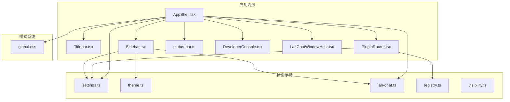
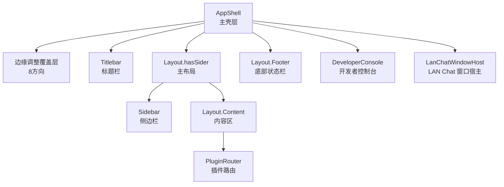
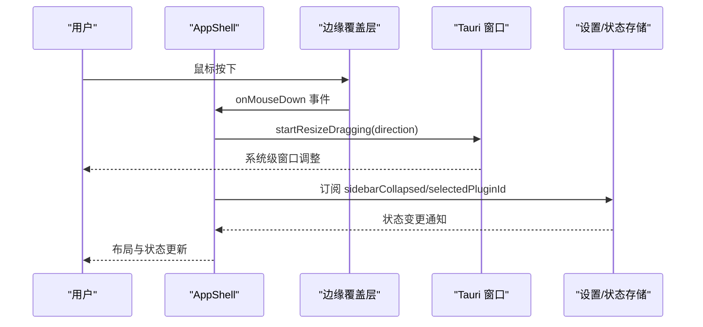
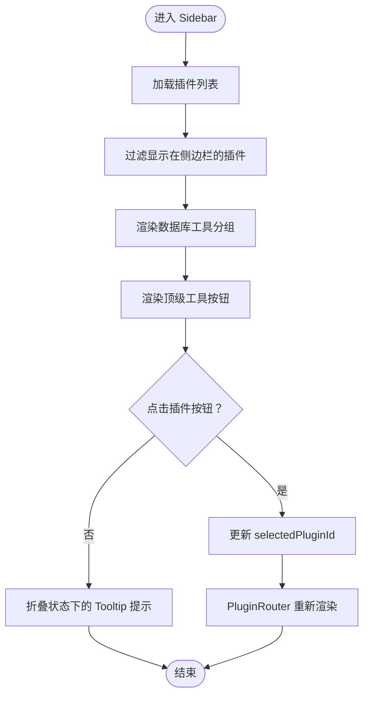
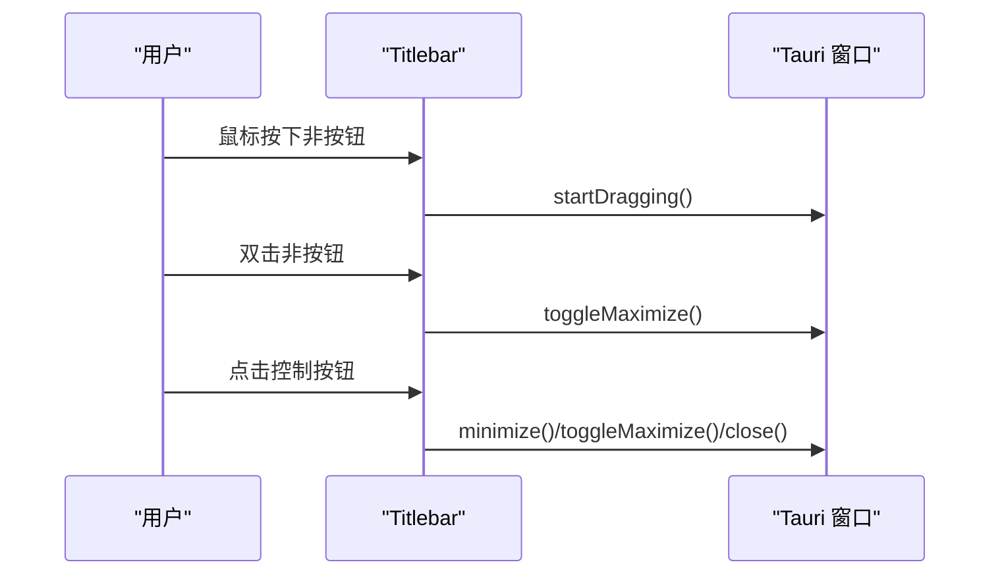
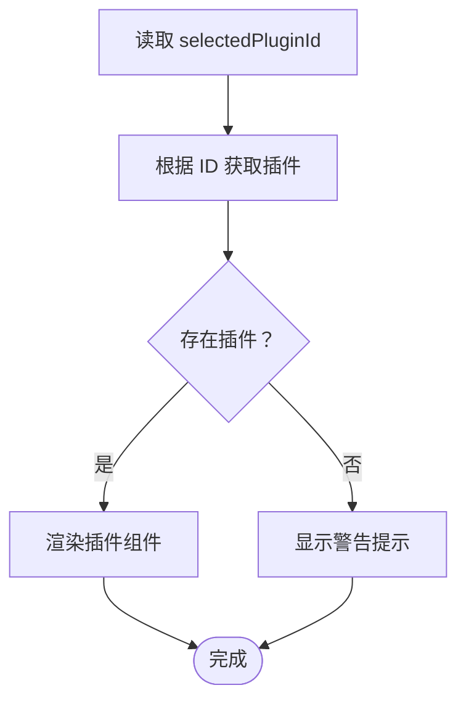
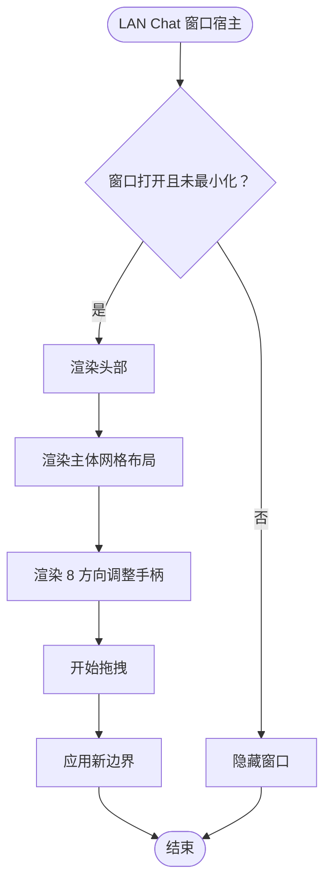
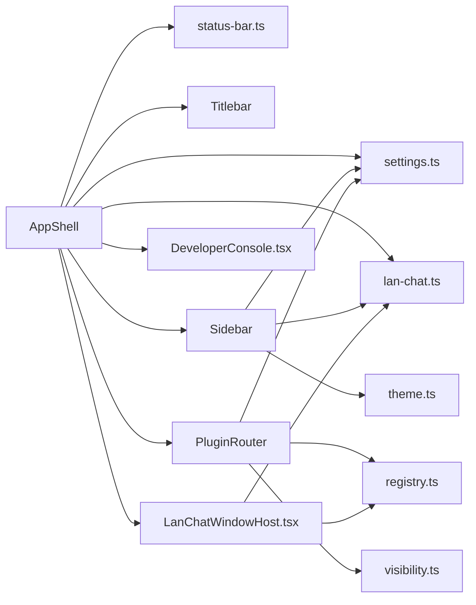

# 应用壳层设计

<cite>
**本文档引用的文件**
- [AppShell.tsx](file://src/app/layout/AppShell.tsx)
- [Sidebar.tsx](file://src/app/layout/Sidebar.tsx)
- [Titlebar.tsx](file://src/app/layout/Titlebar.tsx)
- [PluginRouter.tsx](file://src/app/plugin-registry/PluginRouter.tsx)
- [settings.ts](file://src/app/store/settings.ts)
- [status-bar.ts](file://src/app/layout/status-bar.ts)
- [LanChatWindowHost.tsx](file://src/plugins/lan-chat/components/LanChatWindowHost.tsx)
- [DeveloperConsole.tsx](file://src/app/developer-console/DeveloperConsole.tsx)
- [global.css](file://src/styles/global.css)
- [lan-chat.ts](file://src/plugins/lan-chat/store/lan-chat.ts)
- [registry.ts](file://src/app/plugin-registry/registry.ts)
- [visibility.ts](file://src/app/plugin-registry/visibility.ts)
- [theme.ts](file://src/app/store/theme.ts)
</cite>

## 目录
1. [简介](#简介)
2. [项目结构](#项目结构)
3. [核心组件](#核心组件)
4. [架构总览](#架构总览)
5. [详细组件分析](#详细组件分析)
6. [依赖关系分析](#依赖关系分析)
7. [性能考虑](#性能考虑)
8. [故障排除指南](#故障排除指南)
9. [结论](#结论)
10. [附录](#附录)

## 简介
本文件为应用壳层（AppShell）组件的深度技术文档，聚焦于主界面布局结构、边缘调整（edge resize）机制、组件协作关系、状态管理集成以及布局定制指南。文档旨在帮助开发者理解并扩展桌面端应用的主框架，涵盖 Layout 嵌套层次、内容区域划分、响应式设计实现、边缘拖拽调整、与 Sidebar、Titlebar、PluginRouter 的集成方式、状态管理的使用与响应式更新机制，以及样式覆盖、响应式断点调整和移动端适配方案。

## 项目结构
应用壳层位于前端 src/app/layout 目录，配合插件注册中心、设置状态存储、主题存储、开发者控制台以及 LAN Chat 窗口宿主等模块共同构成完整的桌面应用主框架。

**图表来源**
- [AppShell.tsx:1-207](file://src/app/layout/AppShell.tsx#L1-L207)
- [Sidebar.tsx:1-177](file://src/app/layout/Sidebar.tsx#L1-L177)
- [Titlebar.tsx:1-75](file://src/app/layout/Titlebar.tsx#L1-L75)
- [PluginRouter.tsx:1-29](file://src/app/plugin-registry/PluginRouter.tsx#L1-L29)
- [settings.ts:1-28](file://src/app/store/settings.ts#L1-L28)
- [theme.ts:1-27](file://src/app/store/theme.ts#L1-L27)
- [lan-chat.ts:1-202](file://src/plugins/lan-chat/store/lan-chat.ts#L1-L202)
- [registry.ts:1-26](file://src/app/plugin-registry/registry.ts#L1-L26)
- [visibility.ts:1-6](file://src/app/plugin-registry/visibility.ts#L1-L6)
- [global.css:1-800](file://src/styles/global.css#L1-L800)

**章节来源**
- [AppShell.tsx:1-207](file://src/app/layout/AppShell.tsx#L1-L207)
- [global.css:1-800](file://src/styles/global.css#L1-L800)

## 核心组件
- AppShell：应用主壳层，负责整体布局、边缘调整、标题栏、侧边栏、插件路由、底部状态栏、开发者控制台以及 LAN Chat 窗口宿主的协调。
- Sidebar：侧边导航，包含工具分类、数据库工具分组、主题切换、LAN Chat 入口等。
- Titlebar：原生窗口标题栏（非 macOS），提供拖拽、最小化、最大化、关闭等窗口控制。
- PluginRouter：根据当前选中插件 ID 动态渲染对应插件组件。
- settings.ts：全局设置状态（侧边栏折叠、数据库工具分组折叠、选中插件 ID）。
- theme.ts：主题模式（明/暗）状态。
- lan-chat.ts：LAN Chat 窗口状态（打开/最小化、位置尺寸、未读计数、活动会话）。
- global.css：全局样式与变量，定义布局容器、颜色、尺寸等。

**章节来源**
- [AppShell.tsx:31-207](file://src/app/layout/AppShell.tsx#L31-L207)
- [Sidebar.tsx:21-177](file://src/app/layout/Sidebar.tsx#L21-L177)
- [Titlebar.tsx:12-75](file://src/app/layout/Titlebar.tsx#L12-L75)
- [PluginRouter.tsx:7-29](file://src/app/plugin-registry/PluginRouter.tsx#L7-L29)
- [settings.ts:13-28](file://src/app/store/settings.ts#L13-L28)
- [theme.ts:12-27](file://src/app/store/theme.ts#L12-L27)
- [lan-chat.ts:89-202](file://src/plugins/lan-chat/store/lan-chat.ts#L89-L202)
- [global.css:36-271](file://src/styles/global.css#L36-L271)

## 架构总览
AppShell 采用 Ant Design Layout 结构，通过 hasSider 实现侧边栏嵌入，内容区由 PluginRouter 渲染插件组件。边缘调整通过固定定位的 8 个调整区域触发 Tauri 窗口 resize 拖拽，标题栏提供拖拽与窗口控制，LAN Chat 窗口作为独立浮动层叠加在主布局之上。

**图表来源**
- [AppShell.tsx:147-205](file://src/app/layout/AppShell.tsx#L147-L205)
- [Titlebar.tsx:20-72](file://src/app/layout/Titlebar.tsx#L20-L72)
- [Sidebar.tsx:79-174](file://src/app/layout/Sidebar.tsx#L79-L174)
- [PluginRouter.tsx:7-28](file://src/app/plugin-registry/PluginRouter.tsx#L7-L28)
- [DeveloperConsole.tsx:65-131](file://src/app/developer-console/DeveloperConsole.tsx#L65-L131)
- [LanChatWindowHost.tsx:388-454](file://src/plugins/lan-chat/components/LanChatWindowHost.tsx#L388-L454)

## 详细组件分析

### AppShell 主壳层
- 布局结构：外层 Layout 容器，内部包含标题栏、带侧边栏的主布局、内容区、底部状态栏、开发者控制台、LAN Chat 窗口宿主。
- 边缘调整：通过 8 个固定定位的 overlay 区域（Top/Right/Bottom/Left + 四角）监听鼠标按下事件，调用 Tauri 窗口的 startResizeDragging(direction) 触发系统级窗口调整。
- 状态集成：订阅 settings.store 中的 sidebarCollapsed、selectedPluginId，订阅 lan-chat store 的窗口状态与未读计数，动态构建底部状态项。
- 响应式设计：基于 CSS 变量与容器高度计算，标题栏高度固定，主布局高度自适应；macOS 原生标题栏时移除额外高度占用。

**图表来源**
- [AppShell.tsx:94-167](file://src/app/layout/AppShell.tsx#L94-L167)
- [AppShell.tsx:32-56](file://src/app/layout/AppShell.tsx#L32-L56)
- [settings.ts:13-28](file://src/app/store/settings.ts#L13-L28)
- [lan-chat.ts:89-202](file://src/plugins/lan-chat/store/lan-chat.ts#L89-L202)

**章节来源**
- [AppShell.tsx:31-207](file://src/app/layout/AppShell.tsx#L31-L207)
- [status-bar.ts:15-29](file://src/app/layout/status-bar.ts#L15-L29)

### Sidebar 侧边栏
- 插件组织：从插件注册表筛选展示在侧边栏的插件，按类型分为顶级插件与数据库工具组。
- 折叠与展开：支持侧边栏整体折叠与数据库工具分组折叠，折叠状态下使用 Tooltip 提示。
- 交互行为：点击插件按钮更新 settings.store 中的 selectedPluginId，从而驱动 PluginRouter 切换内容。
- 工具入口：提供 LAN Chat 打开入口与主题切换入口，联动状态存储。

**图表来源**
- [Sidebar.tsx:21-77](file://src/app/layout/Sidebar.tsx#L21-L77)
- [registry.ts:13-21](file://src/app/plugin-registry/registry.ts#L13-L21)
- [visibility.ts:3-5](file://src/app/plugin-registry/visibility.ts#L3-L5)
- [settings.ts:13-28](file://src/app/store/settings.ts#L13-L28)
- [PluginRouter.tsx:7-28](file://src/app/plugin-registry/PluginRouter.tsx#L7-L28)

**章节来源**
- [Sidebar.tsx:21-177](file://src/app/layout/Sidebar.tsx#L21-L177)
- [registry.ts:1-26](file://src/app/plugin-registry/registry.ts#L1-L26)
- [visibility.ts:1-6](file://src/app/plugin-registry/visibility.ts#L1-L6)

### Titlebar 标题栏
- 平台适配：macOS 运行时返回空，不渲染原生窗口控制；其他平台渲染标题栏与控制按钮。
- 拖拽与双击：标题栏区域支持拖拽移动窗口，双击支持最大化/还原。
- 控制按钮：最小化、最大化/还原、关闭，禁用状态根据是否可控制窗口而定。

**图表来源**
- [Titlebar.tsx:24-44](file://src/app/layout/Titlebar.tsx#L24-L44)
- [Titlebar.tsx:54-69](file://src/app/layout/Titlebar.tsx#L54-L69)

**章节来源**
- [Titlebar.tsx:12-75](file://src/app/layout/Titlebar.tsx#L12-L75)

### PluginRouter 插件路由
- 选择逻辑：根据 settings.store 中的 selectedPluginId 获取插件清单，若不存在则提示无插件注册。
- 渲染策略：返回插件组件，实现内容区的动态切换。

**图表来源**
- [PluginRouter.tsx:7-28](file://src/app/plugin-registry/PluginRouter.tsx#L7-L28)
- [settings.ts:13-28](file://src/app/store/settings.ts#L13-L28)
- [registry.ts:19-21](file://src/app/plugin-registry/registry.ts#L19-L21)

**章节来源**
- [PluginRouter.tsx:1-29](file://src/app/plugin-registry/PluginRouter.tsx#L1-L29)

### LAN Chat 窗口宿主
- 独立浮动：以固定定位叠加在主布局之上，支持最小化停靠与还原。
- 内部布局：三列网格（会话列表、分割条、聊天区），右侧可选成员面板与传输面板。
- 调整机制：提供 8 个 resize handle，支持窗口与左右面板的拖拽调整。
- 状态管理：通过 lan-chat store 管理窗口状态、未读计数、活动会话等。

**图表来源**
- [LanChatWindowHost.tsx:67-177](file://src/plugins/lan-chat/components/LanChatWindowHost.tsx#L67-L177)
- [LanChatWindowHost.tsx:221-239](file://src/plugins/lan-chat/components/LanChatWindowHost.tsx#L221-L239)
- [lan-chat.ts:89-202](file://src/plugins/lan-chat/store/lan-chat.ts#L89-L202)

**章节来源**
- [LanChatWindowHost.tsx:1-455](file://src/plugins/lan-chat/components/LanChatWindowHost.tsx#L1-L455)
- [lan-chat.ts:1-202](file://src/plugins/lan-chat/store/lan-chat.ts#L1-L202)

### 开发者控制台
- 快捷键：Ctrl+Shift+D 打开/关闭抽屉式控制台。
- 日志监听：订阅 dev-log 事件，实时追加日志条目。
- 操作：复制 JSON、清空日志。

**章节来源**
- [DeveloperConsole.tsx:10-132](file://src/app/developer-console/DeveloperConsole.tsx#L10-L132)

## 依赖关系分析
- AppShell 依赖：
  - settings.store：sidebarCollapsed、selectedPluginId
  - lan-chat.store：窗口状态、未读计数
  - status-bar：构建底部状态项
  - Titlebar、Sidebar、PluginRouter、DeveloperConsole、LanChatWindowHost
- Sidebar 依赖：
  - settings.store：折叠状态、选中插件
  - theme.store：主题模式
  - lan-chat.store：LAN Chat 打开入口
  - 插件注册表：获取插件清单
- PluginRouter 依赖：
  - settings.store：选中插件 ID
  - 插件注册表：获取插件组件
- LAN Chat 窗口宿主依赖：
  - lan-chat.store：窗口状态、未读计数
  - 插件 API：网络与消息操作
- 样式依赖：
  - global.css：布局容器、颜色变量、响应式断点

**图表来源**
- [AppShell.tsx:14-18](file://src/app/layout/AppShell.tsx#L14-L18)
- [Sidebar.tsx:17-19](file://src/app/layout/Sidebar.tsx#L17-L19)
- [PluginRouter.tsx:4-5](file://src/app/plugin-registry/PluginRouter.tsx#L4-L5)
- [registry.ts:1-26](file://src/app/plugin-registry/registry.ts#L1-L26)
- [visibility.ts:1-6](file://src/app/plugin-registry/visibility.ts#L1-L6)
- [lan-chat.ts:89-202](file://src/plugins/lan-chat/store/lan-chat.ts#L89-L202)

**章节来源**
- [AppShell.tsx:14-18](file://src/app/layout/AppShell.tsx#L14-L18)
- [Sidebar.tsx:17-19](file://src/app/layout/Sidebar.tsx#L17-L19)
- [PluginRouter.tsx:4-5](file://src/app/plugin-registry/PluginRouter.tsx#L4-L5)
- [registry.ts:1-26](file://src/app/plugin-registry/registry.ts#L1-L26)
- [visibility.ts:1-6](file://src/app/plugin-registry/visibility.ts#L1-L6)
- [lan-chat.ts:89-202](file://src/plugins/lan-chat/store/lan-chat.ts#L89-L202)

## 性能考虑
- 状态订阅粒度：AppShell 对 settings.store 的订阅仅限 sidebarCollapsed 与 selectedPluginId，避免不必要的重渲染。
- 计算缓存：底部状态项通过 useMemo 缓存，减少重复计算。
- 定时任务：LAN Chat 状态轮询使用 setTimeout 与 setInterval，组件卸载时清理定时器，防止内存泄漏。
- DOM 复杂度：边缘调整覆盖层仅在桌面运行时渲染，减少不必要的 DOM 节点。
- 样式优化：大量使用 CSS 变量与 Grid 布局，降低 JS 计算成本。

**章节来源**
- [AppShell.tsx:45-56](file://src/app/layout/AppShell.tsx#L45-L56)
- [AppShell.tsx:59-92](file://src/app/layout/AppShell.tsx#L59-L92)
- [global.css:453-459](file://src/styles/global.css#L453-L459)

## 故障排除指南
- 窗口无法拖拽或调整大小
  - 检查运行环境是否为桌面（Tauri）且非 macOS 原生标题栏。
  - 确认鼠标按键为左键，且事件未被按钮元素阻止冒泡。
  - 查看 Tauri 窗口权限与能力配置。
- 边缘调整无效
  - 确认边缘覆盖层已渲染（桌面运行时）。
  - 检查 startResizeDragging 调用是否成功。
- 侧边栏按钮无响应
  - 确认插件注册表中存在目标插件。
  - 检查 settings.store 的 selectedPluginId 是否正确更新。
- LAN Chat 窗口不显示
  - 确认窗口状态 open=true 且 minimized=false。
  - 检查最小化停靠逻辑与 dockMinimizedWindow 计算结果。
- 底部状态项不更新
  - 确认状态项构建函数的依赖数组包含所有相关状态。
  - 检查 useMemo 的依赖是否完整。

**章节来源**
- [AppShell.tsx:149-167](file://src/app/layout/AppShell.tsx#L149-L167)
- [Titlebar.tsx:24-44](file://src/app/layout/Titlebar.tsx#L24-L44)
- [Sidebar.tsx:60-66](file://src/app/layout/Sidebar.tsx#L60-L66)
- [LanChatWindowHost.tsx:103-113](file://src/plugins/lan-chat/components/LanChatWindowHost.tsx#L103-L113)
- [status-bar.ts:15-24](file://src/app/layout/status-bar.ts#L15-L24)

## 结论
AppShell 通过清晰的布局嵌套、精确的状态订阅与响应式样式，实现了桌面应用主框架的稳定与可扩展性。边缘调整、标题栏拖拽与 LAN Chat 窗口宿主提供了良好的用户体验。通过插件注册中心与状态存储的解耦，组件间协作清晰，易于维护与扩展。

## 附录

### 布局定制指南
- 样式覆盖
  - 使用 CSS 变量覆盖主题色与背景色，如 --devnexus-app-bg、--devnexus-header-bg 等。
  - 调整容器高度与间距，确保标题栏与主布局高度匹配。
  - 自定义 LAN Chat 窗口的网格列宽与最小尺寸，保证内容区可读性。
- 响应式断点调整
  - 在 global.css 中通过媒体查询或 CSS Grid 的 minmax() 控制侧边栏宽度与内容区布局。
  - 针对小屏设备，优先折叠侧边栏与成员面板，保持核心功能可见。
- 移动端适配方案
  - 将标题栏与侧边栏改为顶部导航与底部标签页组合，避免窗口拖拽与调整。
  - 使用 Flex 布局替代 Grid，提升移动端兼容性。
  - 减少固定定位元素，避免滚动穿透问题。
- 边缘调整与窗口拖拽
  - 保持 edgeSize 合理值，避免遮挡内容。
  - 在移动端禁用边缘调整，改用手势缩放或全屏模式。
- 组件协作
  - Sidebar 与 PluginRouter 通过 settings.store 协同，确保插件切换即时生效。
  - LAN Chat 窗口与 AppShell 通过独立 store 解耦，避免相互阻塞。
- 状态管理集成
  - settings.store 与 theme.store 使用持久化中间件，确保重启后状态恢复。
  - lan-chat.store 使用部分序列化，仅保存必要字段，减少存储体积。

**章节来源**
- [global.css:1-800](file://src/styles/global.css#L1-L800)
- [settings.ts:13-28](file://src/app/store/settings.ts#L13-L28)
- [theme.ts:12-27](file://src/app/store/theme.ts#L12-L27)
- [lan-chat.ts:89-202](file://src/plugins/lan-chat/store/lan-chat.ts#L89-L202)