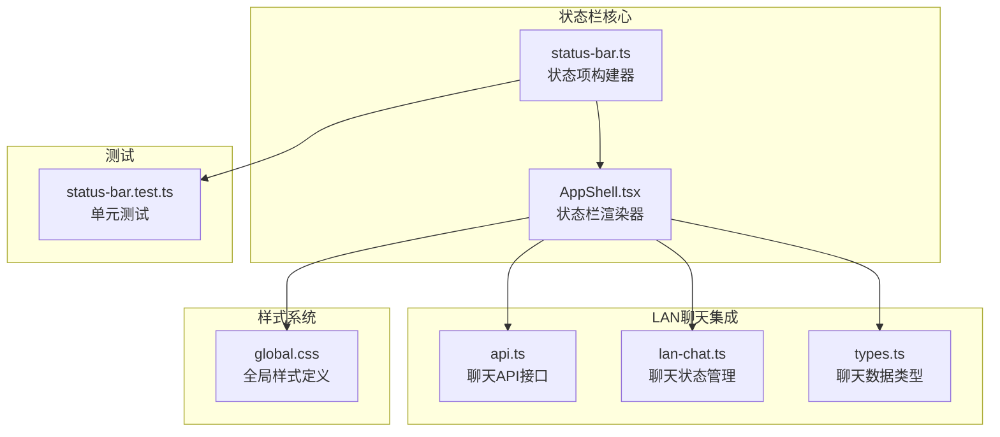
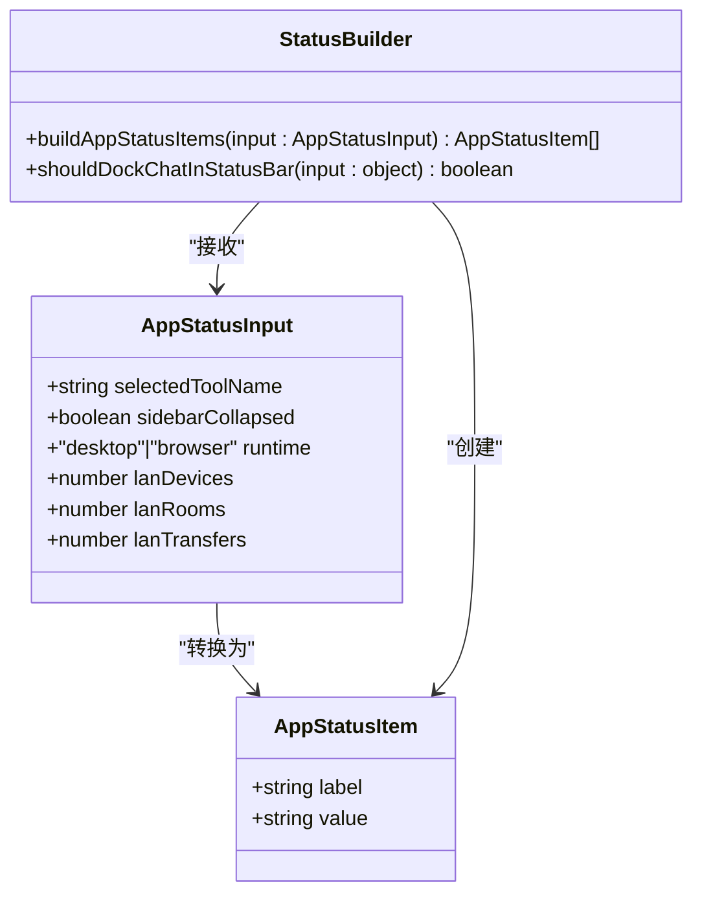
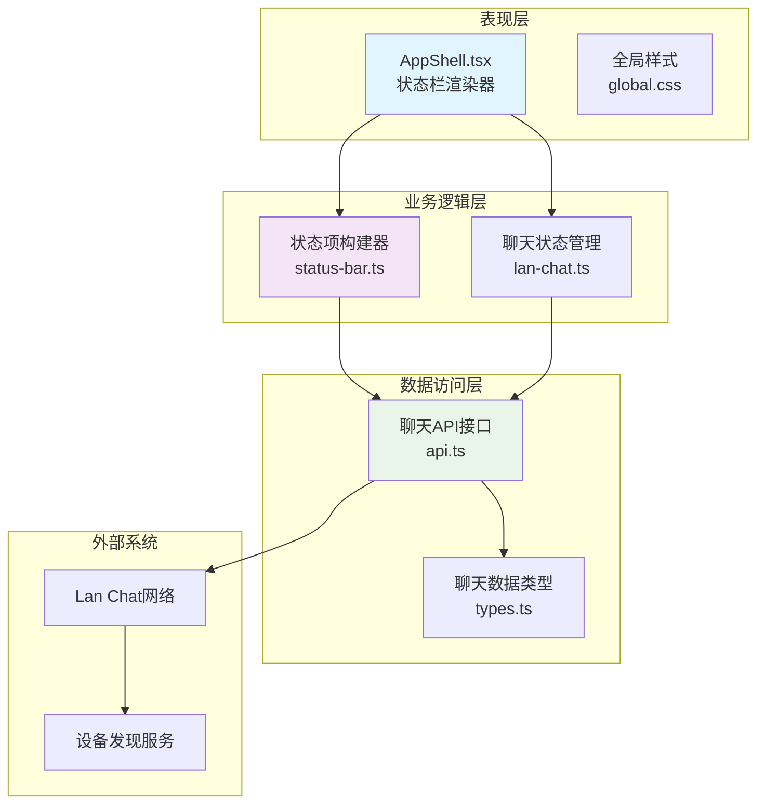
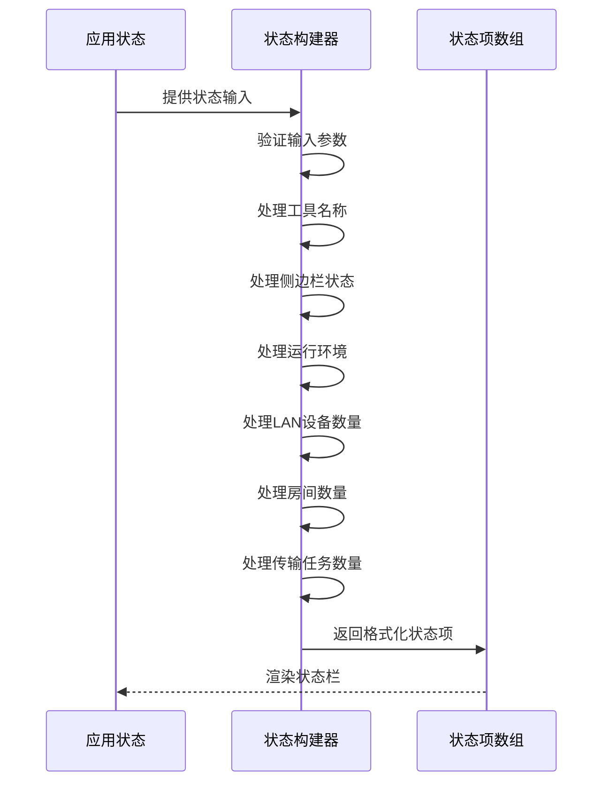
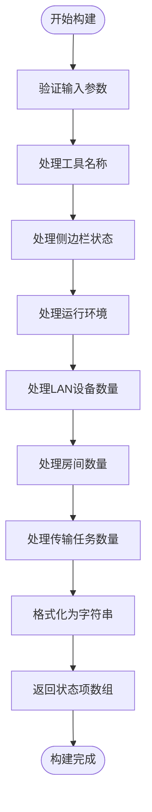
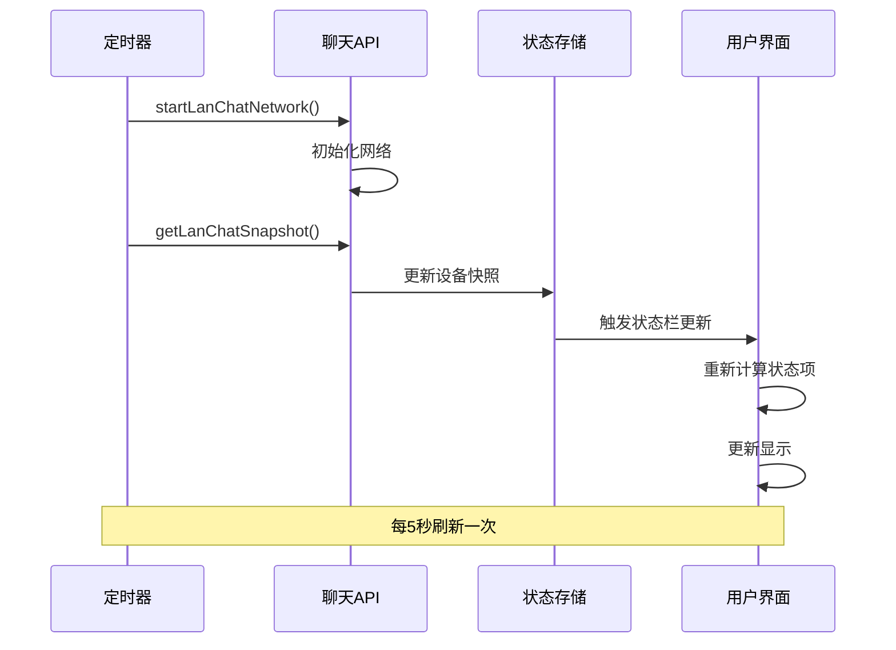
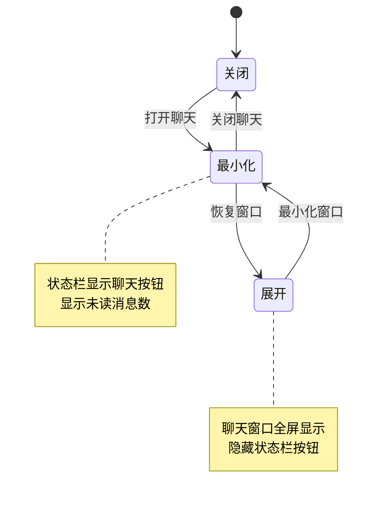
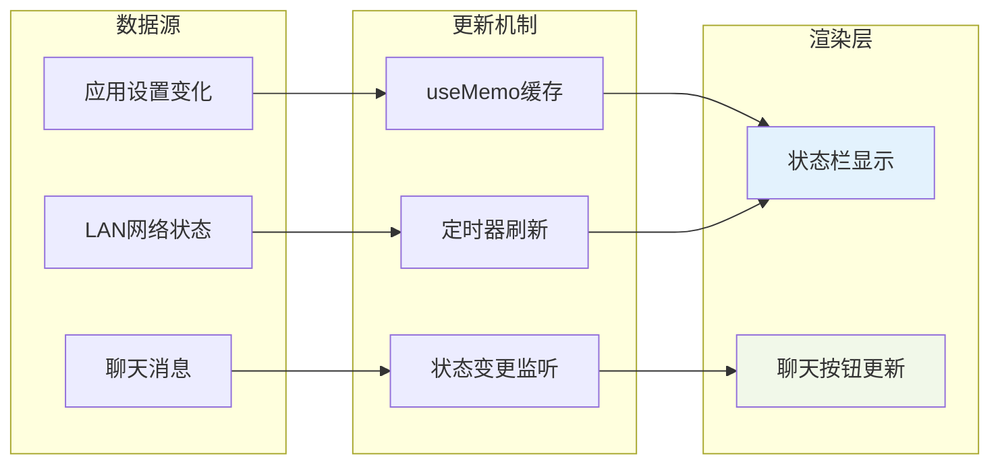
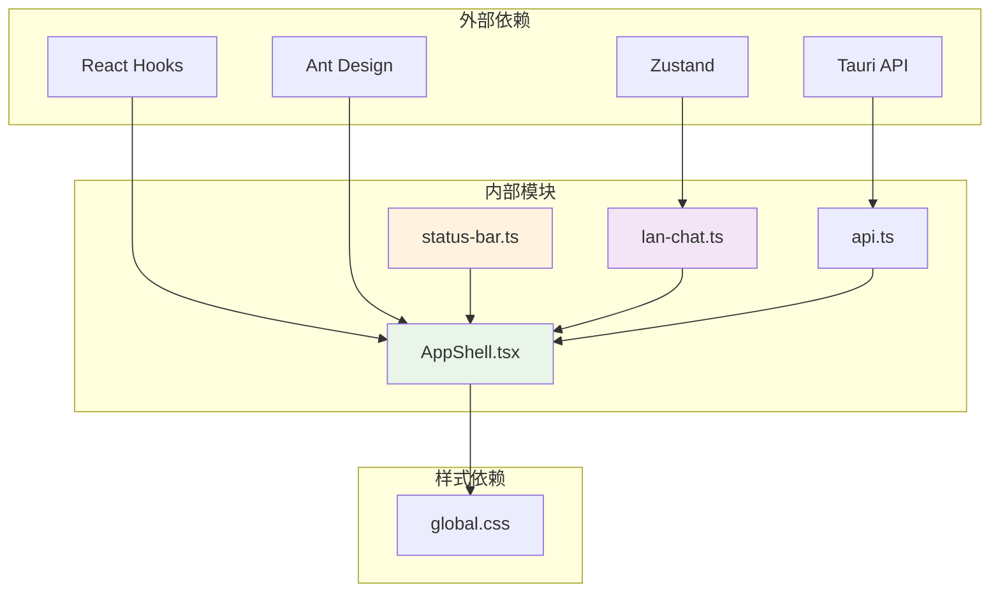

# 状态栏系统

<cite>
**本文档引用的文件**
- [status-bar.ts](file://src/app/layout/status-bar.ts)
- [AppShell.tsx](file://src/app/layout/AppShell.tsx)
- [api.ts](file://src/plugins/lan-chat/api.ts)
- [lan-chat.ts](file://src/plugins/lan-chat/store/lan-chat.ts)
- [types.ts](file://src/plugins/lan-chat/types.ts)
- [global.css](file://src/styles/global.css)
- [status-bar.test.ts](file://tests/app/status-bar.test.ts)
</cite>

## 目录
1. [简介](#简介)
2. [项目结构](#项目结构)
3. [核心组件](#核心组件)
4. [架构概览](#架构概览)
5. [详细组件分析](#详细组件分析)
6. [依赖关系分析](#依赖关系分析)
7. [性能考虑](#性能考虑)
8. [故障排除指南](#故障排除指南)
9. [结论](#结论)
10. [附录](#附录)

## 简介

状态栏系统是 DevNexus 应用程序界面的重要组成部分，负责向用户提供关键的应用状态信息和系统状态监控。该系统实现了动态状态信息生成、实时更新机制和用户交互功能，为用户提供了直观的系统状态可视化。

本系统主要包含以下核心功能：
- 实时状态信息显示（工具名称、侧边栏状态、运行环境）
- LAN 设备连接状态监控
- 房间和传输任务状态跟踪
- 聊天窗口集成和通知机制
- 用户交互和状态切换

## 项目结构

状态栏系统主要分布在以下文件中：

**图表来源**
- [status-bar.ts:1-29](file://src/app/layout/status-bar.ts#L1-L29)
- [AppShell.tsx:1-207](file://src/app/layout/AppShell.tsx#L1-L207)

**章节来源**
- [status-bar.ts:1-29](file://src/app/layout/status-bar.ts#L1-L29)
- [AppShell.tsx:1-207](file://src/app/layout/AppShell.tsx#L1-L207)

## 核心组件

### 状态项构建器

状态项构建器是状态栏系统的核心组件，负责将应用状态转换为用户友好的状态项。

**图表来源**
- [status-bar.ts:1-29](file://src/app/layout/status-bar.ts#L1-L29)

### 状态项类型定义

状态项采用简单的键值对结构设计，确保了数据结构的简洁性和易用性：

| 字段名 | 类型 | 描述 | 显示格式 |
|--------|------|------|----------|
| label | string | 状态项标签 | 文本标签 |
| value | string | 状态值 | 格式化后的字符串 |

**章节来源**
- [status-bar.ts:10-13](file://src/app/layout/status-bar.ts#L10-L13)

## 架构概览

状态栏系统采用分层架构设计，实现了清晰的关注点分离：

**图表来源**
- [AppShell.tsx:31-56](file://src/app/layout/AppShell.tsx#L31-L56)
- [status-bar.ts:15-24](file://src/app/layout/status-bar.ts#L15-L24)

## 详细组件分析

### 状态项构建机制

状态项构建机制通过 `buildAppStatusItems` 函数实现，该函数接收应用状态输入并返回格式化的状态项数组。

**图表来源**
- [status-bar.ts:15-24](file://src/app/layout/status-bar.ts#L15-L24)

#### 状态项生成流程

**图表来源**
- [status-bar.ts:15-24](file://src/app/layout/status-bar.ts#L15-L24)

**章节来源**
- [status-bar.ts:15-24](file://src/app/layout/status-bar.ts#L15-L24)

### 系统信息集成

状态栏系统集成了多个系统信息源，包括插件状态监控、设备连接状态和网络信息展示。

#### LAN聊天状态监控

**图表来源**
- [AppShell.tsx:59-92](file://src/app/layout/AppShell.tsx#L59-L92)

#### 设备连接状态

系统通过 `LanChatSnapshot` 对象监控设备连接状态：

| 字段名 | 类型 | 描述 |
|--------|------|------|
| identity | LanChatDeviceIdentity | 设备身份信息 |
| devices | LanChatDevice[] | 在线设备列表 |
| rooms | LanChatRoom[] | 房间列表 |
| transfers | LanChatTransfer[] | 传输任务列表 |

**章节来源**
- [AppShell.tsx:59-92](file://src/app/layout/AppShell.tsx#L59-L92)
- [types.ts:68-73](file://src/plugins/lan-chat/types.ts#L68-L73)

### 状态栏交互功能

状态栏系统提供了丰富的交互功能，包括点击事件处理、状态切换和用户反馈机制。

#### 聊天窗口集成

**图表来源**
- [AppShell.tsx:188-200](file://src/app/layout/AppShell.tsx#L188-L200)

#### 点击事件处理

状态栏中的交互元素通过以下方式处理用户操作：

1. **聊天按钮点击**：触发 `restoreWindow` 函数恢复聊天窗口
2. **状态项悬停**：提供额外的状态信息提示
3. **窗口拖拽**：支持状态栏边缘拖拽调整大小

**章节来源**
- [AppShell.tsx:188-199](file://src/app/layout/AppShell.tsx#L188-L199)

### 实时更新逻辑

状态栏系统实现了高效的实时更新机制，确保用户能够及时获得最新的系统状态信息。

#### 数据流更新

**图表来源**
- [AppShell.tsx:45-56](file://src/app/layout/AppShell.tsx#L45-L56)

**章节来源**
- [AppShell.tsx:45-56](file://src/app/layout/AppShell.tsx#L45-L56)

## 依赖关系分析

状态栏系统的依赖关系相对简单，主要依赖于状态项构建器和聊天状态管理模块。

**图表来源**
- [AppShell.tsx:1-18](file://src/app/layout/AppShell.tsx#L1-L18)
- [status-bar.ts:1-8](file://src/app/layout/status-bar.ts#L1-L8)

**章节来源**
- [AppShell.tsx:1-18](file://src/app/layout/AppShell.tsx#L1-L18)
- [status-bar.ts:1-8](file://src/app/layout/status-bar.ts#L1-L8)

## 性能考虑

状态栏系统在设计时充分考虑了性能优化，采用了多种策略来确保流畅的用户体验：

### 缓存策略
- 使用 `useMemo` 缓存状态项计算结果
- 避免不必要的重新渲染
- 优化大型数据结构的处理

### 更新频率控制
- LAN状态每5秒刷新一次
- 初始延迟1.8秒避免启动时的瞬时压力
- 条件更新减少无效渲染

### 内存管理
- 使用 `useRef` 存储不需要触发重渲染的状态
- 及时清理定时器和事件监听器
- 合理的数据结构选择

## 故障排除指南

### 常见问题及解决方案

#### 状态不更新问题
**症状**：状态栏显示过时信息
**可能原因**：
- 定时器未正确设置
- 状态变更未触发重新渲染
- API调用失败

**解决步骤**：
1. 检查 `useEffect` 中的定时器设置
2. 验证 `useMemo` 的依赖数组
3. 查看网络请求的错误日志

#### 聊天状态异常
**症状**：聊天按钮不显示或无法点击
**可能原因**：
- 聊天窗口状态异常
- Tauri API调用失败
- 样式冲突

**解决步骤**：
1. 检查 `shouldDockChatInStatusBar` 函数逻辑
2. 验证聊天窗口的打开状态
3. 确认Tauri命令调用权限

**章节来源**
- [AppShell.tsx:59-92](file://src/app/layout/AppShell.tsx#L59-L92)
- [status-bar.test.ts:1-26](file://tests/app/status-bar.test.ts#L1-L26)

## 结论

状态栏系统通过精心设计的架构和实现，成功地为用户提供了直观、实时的系统状态信息。系统的主要优势包括：

1. **模块化设计**：清晰的职责分离使得系统易于维护和扩展
2. **高效性能**：合理的缓存和更新策略确保了良好的用户体验
3. **用户友好**：直观的交互设计和及时的状态反馈
4. **可扩展性**：灵活的架构为未来的功能扩展奠定了基础

该系统为DevNexus应用提供了稳定可靠的状态监控基础设施，是整个应用程序界面的重要组成部分。

## 附录

### 状态栏扩展指南

#### 自定义状态项添加

要添加新的状态项，需要：

1. **更新状态输入接口**：在 `AppStatusInput` 中添加新字段
2. **修改状态构建函数**：在 `buildAppStatusItems` 中处理新状态
3. **更新渲染逻辑**：在 `AppShell.tsx` 中渲染新状态项
4. **添加样式支持**：在 `global.css` 中添加必要的样式

#### 格式化规则定制

状态项的格式化规则可以通过以下方式进行定制：

- **文本格式化**：使用 `String()` 或自定义格式化函数
- **条件显示**：根据状态值决定是否显示某些项
- **颜色编码**：根据状态级别使用不同的颜色

#### 样式定制方案

系统提供了灵活的样式定制选项：

- **CSS变量**：通过修改CSS变量调整整体外观
- **组件样式**：针对特定组件进行样式覆盖
- **响应式设计**：适配不同屏幕尺寸的显示需求

**章节来源**
- [status-bar.ts:15-24](file://src/app/layout/status-bar.ts#L15-L24)
- [global.css:1-800](file://src/styles/global.css#L1-L800)