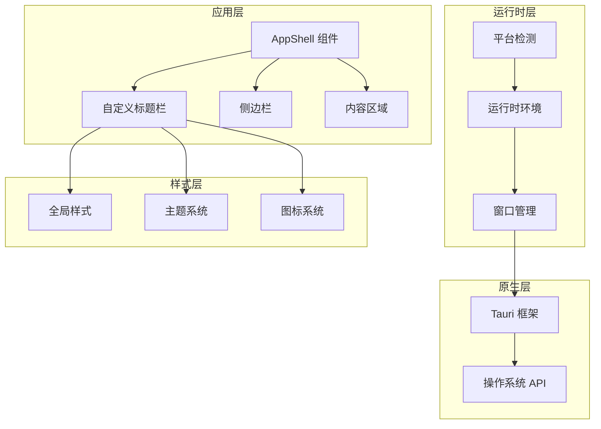
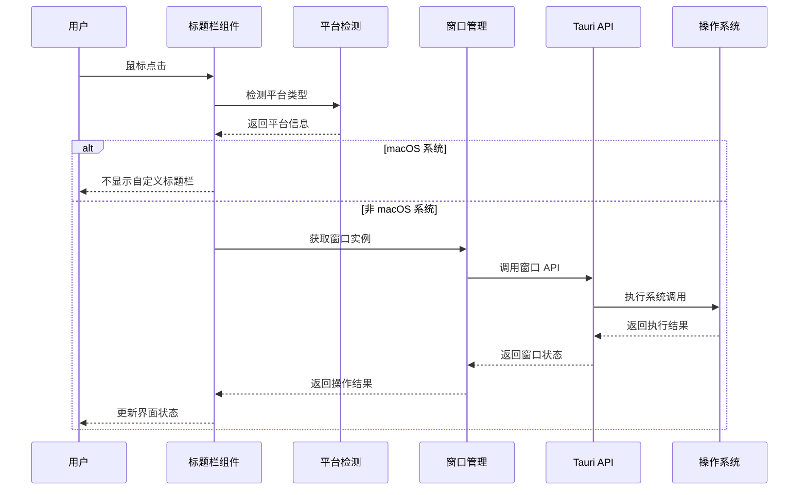
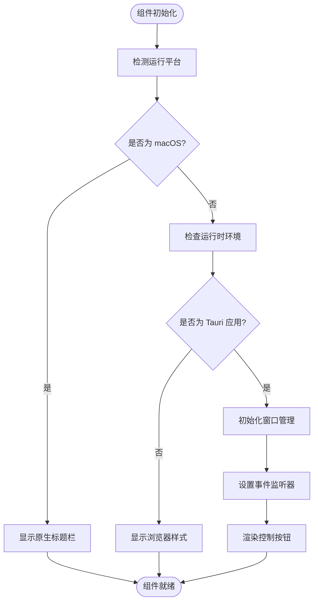
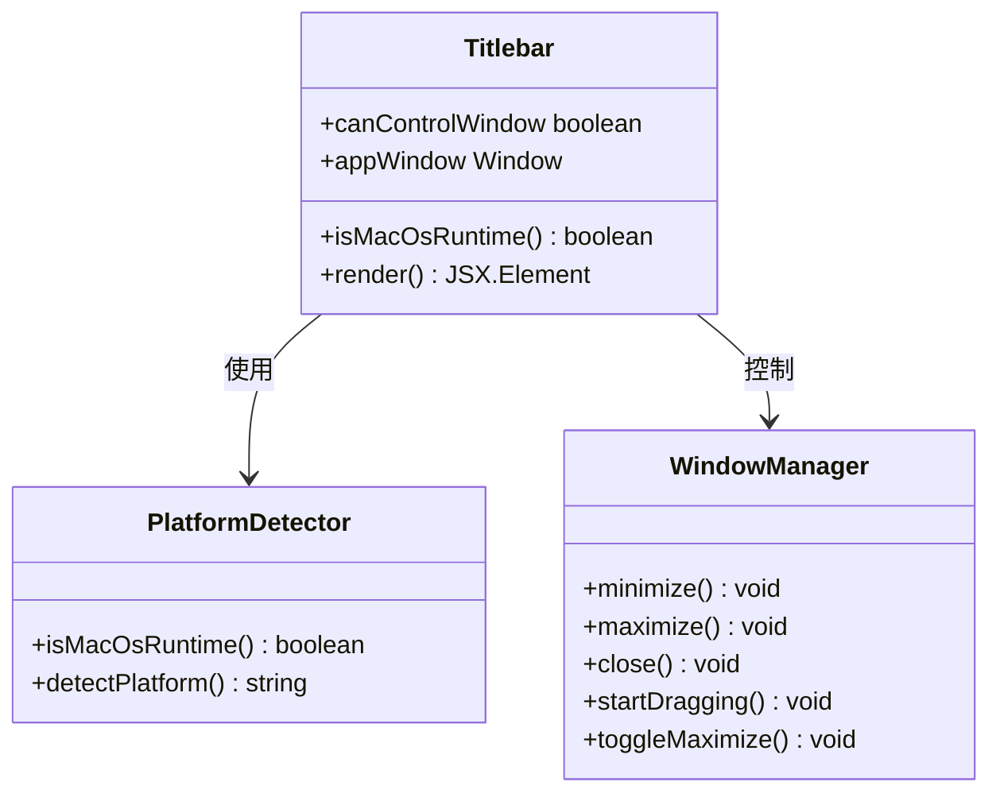
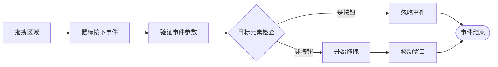
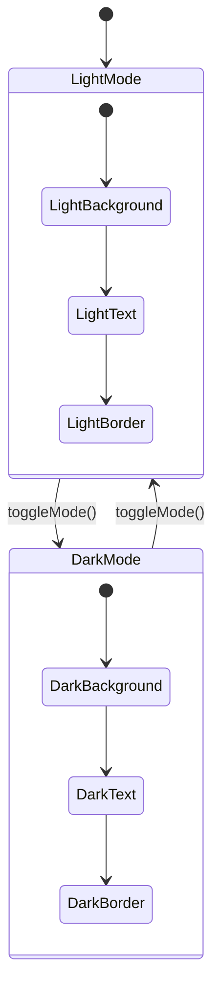
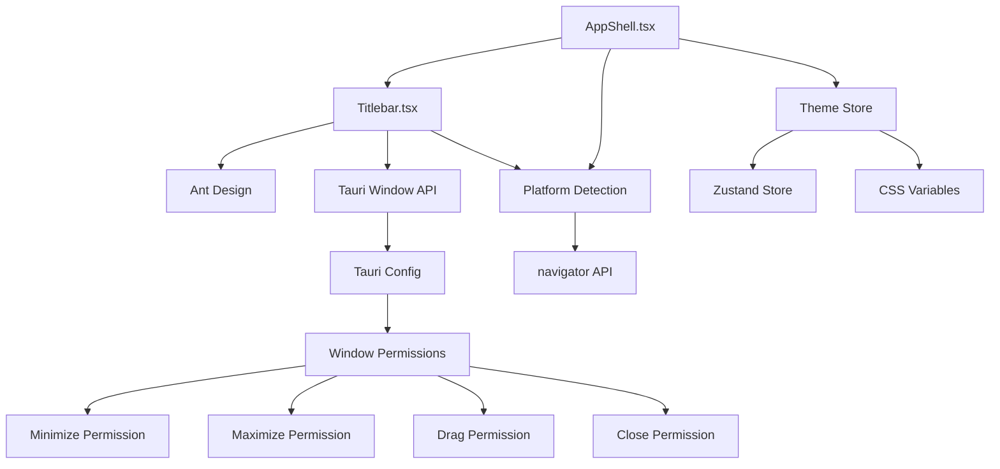

# 自定义标题栏

<cite>
**本文档引用的文件**
- [src/app/layout/Titlebar.tsx](file://src/app/layout/Titlebar.tsx)
- [src/app/layout/AppShell.tsx](file://src/app/layout/AppShell.tsx)
- [src/app/runtimes/platform.ts](file://src/app/runtimes/platform.ts)
- [src/styles/global.css](file://src/styles/global.css)
- [src/main.tsx](file://src/main.tsx)
- [src/app/store/theme.ts](file://src/app/store/theme.ts)
- [src-tauri/tauri.conf.json](file://src-tauri/tauri.conf.json)
- [src-tauri/src/main.rs](file://src-tauri/src/main.rs)
- [src-tauri/Cargo.lock](file://src-tauri/Cargo.lock)
- [src-tauri/capabilities/default.json](file://src-tauri/capabilities/default.json)
</cite>

## 目录
1. [简介](#简介)
2. [项目结构](#项目结构)
3. [核心组件](#核心组件)
4. [架构概览](#架构概览)
5. [详细组件分析](#详细组件分析)
6. [依赖关系分析](#依赖关系分析)
7. [性能考虑](#性能考虑)
8. [故障排除指南](#故障排除指南)
9. [结论](#结论)
10. [附录](#附录)

## 简介

自定义标题栏是桌面应用程序中一个重要的UI组件，它提供了跨平台的窗口控制功能和一致的用户体验。本项目实现了完整的自定义标题栏解决方案，包括：

- **跨平台兼容性**：支持 macOS 原生标题栏检测和 Windows/Linux 自定义标题栏
- **窗口控制功能**：最小化、最大化、关闭按钮的完整实现
- **拖拽区域设计**：智能的标题栏拖拽区域识别和窗口移动机制
- **平台适配策略**：系统主题跟随、高DPI支持和无障碍访问
- **自定义指南**：按钮扩展、样式定制和平台特定功能

## 项目结构

项目采用模块化的架构设计，自定义标题栏组件位于应用布局层，通过清晰的分层结构实现功能分离：



**图表来源**
- [src/app/layout/AppShell.tsx:147-205](file://src/app/layout/AppShell.tsx#L147-L205)
- [src/app/layout/Titlebar.tsx:12-75](file://src/app/layout/Titlebar.tsx#L12-L75)

**章节来源**
- [src/app/layout/AppShell.tsx:31-207](file://src/app/layout/AppShell.tsx#L31-L207)
- [src/app/layout/Titlebar.tsx:12-75](file://src/app/layout/Titlebar.tsx#L12-L75)

## 核心组件

### 自定义标题栏组件

自定义标题栏组件是整个跨平台窗口控制的核心，它实现了以下关键功能：

- **条件渲染**：根据平台检测结果决定是否显示自定义标题栏
- **窗口控制**：提供最小化、最大化、关闭等窗口操作
- **拖拽支持**：实现窗口拖拽移动功能
- **双击最大化**：支持双击标题栏区域进行窗口最大化

### 平台检测系统

平台检测系统负责识别当前运行的操作系统环境：

- **macOS 检测**：通过 navigator.platform 和 navigator.userAgent 判断
- **运行时判断**：区分浏览器环境和桌面应用环境
- **条件逻辑**：基于检测结果决定 UI 渲染策略

### 样式系统

样式系统提供了完整的视觉设计和主题支持：

- **CSS 变量**：使用 CSS 自定义属性实现主题切换
- **响应式设计**：支持不同屏幕尺寸和分辨率
- **动画效果**：平滑的过渡动画和交互反馈

**章节来源**
- [src/app/layout/Titlebar.tsx:12-75](file://src/app/layout/Titlebar.tsx#L12-L75)
- [src/app/runtimes/platform.ts:1-10](file://src/app/runtimes/platform.ts#L1-L10)
- [src/styles/global.css:43-64](file://src/styles/global.css#L43-L64)

## 架构概览

自定义标题栏的架构采用了分层设计模式，确保了良好的可维护性和扩展性：



**图表来源**
- [src/app/layout/Titlebar.tsx:13-15](file://src/app/layout/Titlebar.tsx#L13-L15)
- [src/app/runtimes/platform.ts:1-9](file://src/app/runtimes/platform.ts#L1-L9)
- [src/app/layout/Titlebar.tsx:17-18](file://src/app/layout/Titlebar.tsx#L17-L18)

### 数据流分析

自定义标题栏的数据流体现了清晰的单向数据流原则：



**图表来源**
- [src/app/layout/Titlebar.tsx:12-18](file://src/app/layout/Titlebar.tsx#L12-L18)
- [src/app/runtimes/platform.ts:1-9](file://src/app/runtimes/platform.ts#L1-L9)

**章节来源**
- [src/app/layout/Titlebar.tsx:12-75](file://src/app/layout/Titlebar.tsx#L12-L75)
- [src/app/layout/AppShell.tsx:31-56](file://src/app/layout/AppShell.tsx#L31-L56)

## 详细组件分析

### 标题栏组件实现

标题栏组件是自定义窗口控制的核心实现，具有以下特点：

#### 条件渲染机制

组件通过平台检测函数决定是否渲染自定义标题栏：



**图表来源**
- [src/app/layout/Titlebar.tsx:12-18](file://src/app/layout/Titlebar.tsx#L12-L18)
- [src/app/runtimes/platform.ts:1-9](file://src/app/runtimes/platform.ts#L1-L9)

#### 窗口控制功能

标题栏提供了完整的窗口控制功能，包括：

- **最小化按钮**：调用 `minimize()` 方法实现窗口最小化
- **最大化按钮**：调用 `toggleMaximize()` 实现窗口大小切换
- **关闭按钮**：调用 `close()` 方法关闭应用程序

#### 拖拽区域设计

拖拽区域的设计考虑了用户体验和功能完整性：



**图表来源**
- [src/app/layout/Titlebar.tsx:24-44](file://src/app/layout/Titlebar.tsx#L24-L44)

**章节来源**
- [src/app/layout/Titlebar.tsx:12-75](file://src/app/layout/Titlebar.tsx#L12-L75)

### 平台适配策略

平台适配策略确保了在不同操作系统上的一致体验：

#### macOS 原生标题栏

对于 macOS 系统，组件会自动使用原生标题栏：

- **条件渲染**：当 `isMacOsRuntime()` 返回 `true` 时，组件返回 `null`
- **原生行为**：利用 macOS 的原生窗口控制按钮
- **系统集成**：与 macOS 系统主题和行为保持一致

#### Windows/Linux 自定义标题栏

对于非 macOS 系统，组件提供完整的自定义标题栏：

- **完全控制**：所有窗口控制功能都由自定义组件实现
- **统一样式**：提供一致的视觉设计和交互体验
- **功能完整**：包含拖拽、最小化、最大化、关闭等所有功能

**章节来源**
- [src/app/layout/Titlebar.tsx:13-15](file://src/app/layout/Titlebar.tsx#L13-L15)
- [src/app/runtimes/platform.ts:1-9](file://src/app/runtimes/platform.ts#L1-L9)

### 样式系统设计

样式系统采用了现代化的设计方法，支持主题切换和响应式布局：

#### CSS 变量系统

使用 CSS 自定义属性实现主题切换：

```css
:root {
  --devnexus-app-bg: #ffffff;
  --devnexus-header-bg: #fafafa;
  --devnexus-border-color: #e5e6eb;
  --devnexus-text-strong: #1f2937;
}

.devnexus-titlebar {
  background: var(--devnexus-header-bg);
  border-bottom: 1px solid var(--devnexus-border-color);
}
```

#### 主题状态管理

通过 Zustand 状态管理实现主题切换：



**图表来源**
- [src/app/store/theme.ts:12-26](file://src/app/store/theme.ts#L12-L26)

**章节来源**
- [src/styles/global.css:1-17](file://src/styles/global.css#L1-L17)
- [src/app/store/theme.ts:1-27](file://src/app/store/theme.ts#L1-L27)

## 依赖关系分析

自定义标题栏组件的依赖关系体现了清晰的模块化设计：



**图表来源**
- [src/app/layout/Titlebar.tsx:1-10](file://src/app/layout/Titlebar.tsx#L1-L10)
- [src/app/layout/AppShell.tsx:1-20](file://src/app/layout/AppShell.tsx#L1-L20)
- [src-tauri/capabilities/default.json:6-15](file://src-tauri/capabilities/default.json#L6-L15)

### 外部依赖分析

项目使用了多个关键的外部依赖来实现自定义标题栏功能：

- **Ant Design**：提供按钮、空间等 UI 组件
- **Tauri**：提供桌面应用窗口控制 API
- **Zustand**：提供轻量级状态管理
- **CSS 变量**：提供主题切换支持

**章节来源**
- [src-tauri/capabilities/default.json:6-15](file://src-tauri/capabilities/default.json#L6-L15)
- [src-tauri/Cargo.lock:9567-9604](file://src-tauri/Cargo.lock#L9567-L9604)

## 性能考虑

自定义标题栏的性能优化主要体现在以下几个方面：

### 渲染优化

- **条件渲染**：避免在 macOS 上渲染不必要的 DOM 元素
- **事件委托**：使用事件委托减少事件监听器数量
- **懒加载**：窗口 API 在需要时才进行初始化

### 内存管理

- **组件卸载**：确保组件卸载时清理所有事件监听器
- **状态管理**：使用轻量级状态管理避免内存泄漏
- **资源释放**：及时释放窗口句柄和其他系统资源

### 性能监控

- **渲染计时**：监控组件渲染时间
- **事件响应**：测量用户交互响应延迟
- **内存使用**：监控内存使用情况

## 故障排除指南

### 常见问题及解决方案

#### 标题栏不显示

**问题描述**：在某些平台上标题栏没有正确显示

**可能原因**：
- 平台检测失败
- Tauri 运行时环境检测错误
- 样式文件加载失败

**解决方案**：
1. 检查平台检测函数是否正常工作
2. 验证 Tauri 运行时环境
3. 确认样式文件正确加载

#### 窗口控制功能失效

**问题描述**：最小化、最大化、关闭按钮无法正常工作

**可能原因**：
- Tauri 权限配置缺失
- 窗口 API 调用失败
- 事件处理逻辑错误

**解决方案**：
1. 检查 Tauri 能力配置
2. 验证窗口 API 调用
3. 审查事件处理逻辑

#### 拖拽功能异常

**问题描述**：标题栏拖拽功能不工作或行为异常

**可能原因**：
- 鼠标事件处理错误
- 拖拽区域计算错误
- 系统权限问题

**解决方案**：
1. 检查鼠标事件监听器
2. 验证拖拽区域边界
3. 确认系统拖拽权限

**章节来源**
- [src/app/layout/Titlebar.tsx:24-44](file://src/app/layout/Titlebar.tsx#L24-L44)
- [src-tauri/capabilities/default.json:6-15](file://src-tauri/capabilities/default.json#L6-L15)

## 结论

自定义标题栏组件成功实现了跨平台的窗口控制功能，具有以下优势：

### 技术成就

- **完整的跨平台支持**：无缝支持 macOS 原生标题栏和 Windows/Linux 自定义标题栏
- **优雅的降级处理**：在不同平台间提供一致的用户体验
- **模块化设计**：清晰的组件分离和职责划分
- **性能优化**：高效的渲染和事件处理机制

### 设计亮点

- **简洁的 API**：直观的组件接口和简单的集成方式
- **灵活的定制**：支持样式定制和功能扩展
- **完善的错误处理**：健壮的异常处理和故障恢复机制
- **优秀的可维护性**：清晰的代码结构和详细的文档

### 未来改进方向

- **增强的无障碍支持**：添加键盘导航和屏幕阅读器支持
- **更丰富的动画效果**：提升用户交互的流畅度
- **扩展的平台支持**：支持更多操作系统和窗口管理器
- **性能监控工具**：提供内置的性能分析和优化建议

## 附录

### 开发指南

#### 添加新按钮

要在标题栏中添加新的控制按钮：

1. 在标题栏组件中添加新的按钮元素
2. 实现相应的事件处理函数
3. 添加必要的样式类名
4. 确保按钮在不同平台上的行为一致

#### 自定义样式

要自定义标题栏的外观：

1. 修改全局 CSS 变量值
2. 添加新的 CSS 类定义
3. 调整响应式设计规则
4. 测试不同主题下的显示效果

#### 平台特定功能

要实现平台特定的功能：

1. 使用平台检测函数进行条件判断
2. 为不同平台提供专门的实现
3. 确保功能的向后兼容性
4. 测试所有支持的平台

**章节来源**
- [src/styles/global.css:43-64](file://src/styles/global.css#L43-L64)
- [src/app/layout/Titlebar.tsx:12-75](file://src/app/layout/Titlebar.tsx#L12-L75)