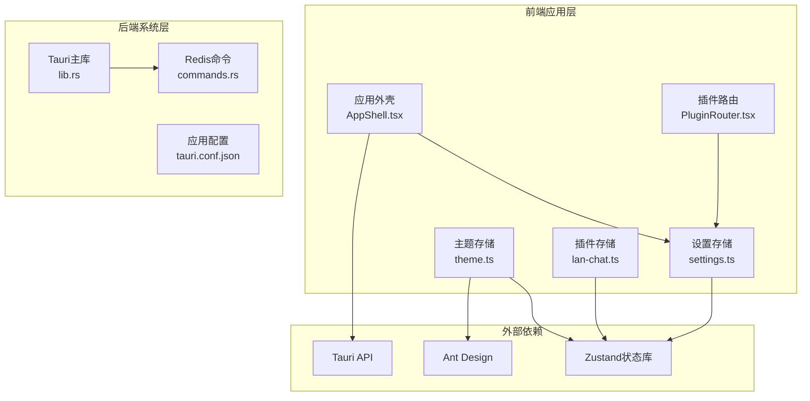
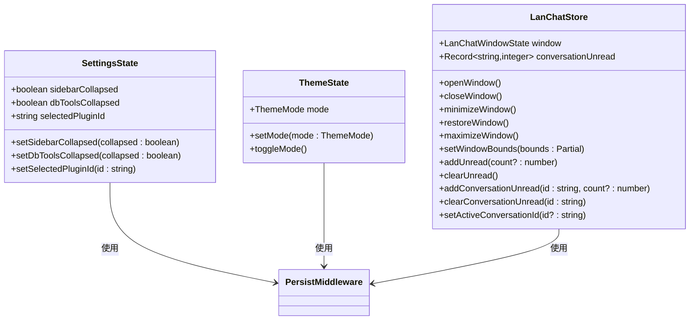
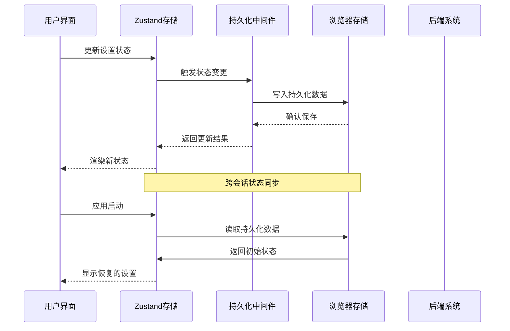
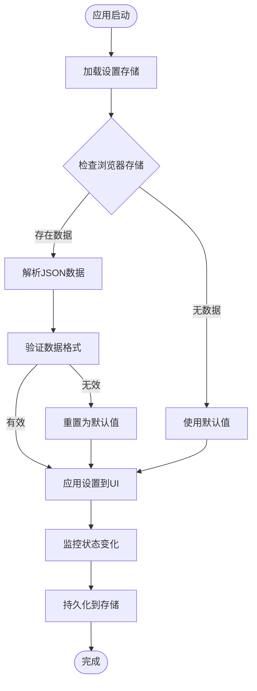
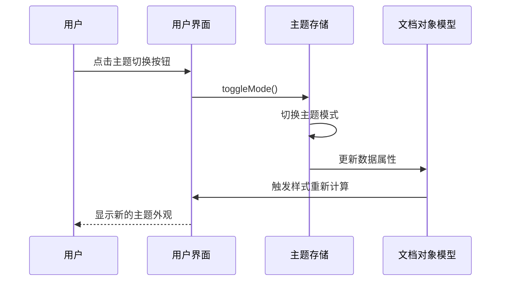
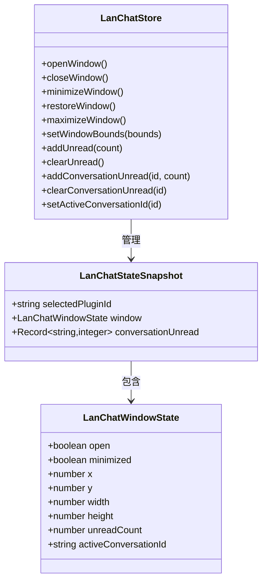
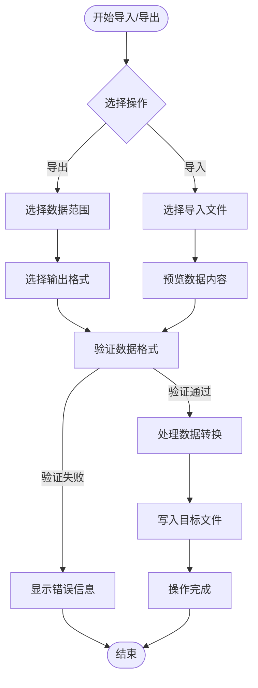

# 设置持久化系统

<cite>
**本文档引用的文件**
- [settings.ts](file://src/app/store/settings.ts)
- [theme.ts](file://src/app/store/theme.ts)
- [lan-chat.ts](file://src/plugins/lan-chat/store/lan-chat.ts)
- [AppShell.tsx](file://src/app/layout/AppShell.tsx)
- [PluginRouter.tsx](file://src/app/plugin-registry/PluginRouter.tsx)
- [lib.rs](file://src-tauri/src/lib.rs)
- [commands.rs](file://src-tauri/src/plugins/redis/commands.rs)
- [main.tsx](file://src/main.tsx)
- [tauri.conf.json](file://src-tauri/tauri.conf.json)
- [package.json](file://package.json)
</cite>

## 目录
1. [简介](#简介)
2. [项目结构](#项目结构)
3. [核心组件](#核心组件)
4. [架构概览](#架构概览)
5. [详细组件分析](#详细组件分析)
6. [依赖关系分析](#依赖关系分析)
7. [性能考虑](#性能考虑)
8. [故障排除指南](#故障排除指南)
9. [结论](#结论)

## 简介

设置持久化系统是 DevNexus 应用程序的核心基础设施，负责管理用户偏好存储、配置项的结构设计和状态同步机制。该系统采用现代化的状态管理架构，结合前端 Zustand 状态库和后端 Tauri 插件系统，实现了跨会话的状态保持、设置导入导出和重置机制。

系统主要包含三个核心层面：界面设置（UI 偏好）、功能配置（插件选择）和行为偏好（主题模式）。通过本地存储机制、数据序列化和版本兼容性处理，确保用户设置在应用重启后能够正确恢复。

## 项目结构

设置持久化系统分布在前端应用的不同模块中，形成了清晰的分层架构：



**图表来源**
- [settings.ts:1-27](file://src/app/store/settings.ts#L1-L27)
- [theme.ts:1-26](file://src/app/store/theme.ts#L1-L26)
- [lan-chat.ts:1-202](file://src/plugins/lan-chat/store/lan-chat.ts#L1-L202)
- [lib.rs:1-250](file://src-tauri/src/lib.rs#L1-L250)

**章节来源**
- [settings.ts:1-27](file://src/app/store/settings.ts#L1-L27)
- [theme.ts:1-26](file://src/app/store/theme.ts#L1-L26)
- [lan-chat.ts:1-202](file://src/plugins/lan-chat/store/lan-chat.ts#L1-L202)
- [lib.rs:1-250](file://src-tauri/src/lib.rs#L1-L250)

## 核心组件

### 设置存储系统

设置存储系统基于 Zustand 状态库构建，提供了类型安全的状态管理和持久化功能。系统包含三个主要的设置存储：

1. **应用设置存储**：管理界面布局和插件选择
2. **主题存储**：控制明暗主题切换
3. **插件特定存储**：管理各插件的窗口状态

每个存储都使用 `persist` 中间件实现本地持久化，确保状态在应用重启后能够恢复。

**章节来源**
- [settings.ts:13-27](file://src/app/store/settings.ts#L13-L27)
- [theme.ts:12-26](file://src/app/store/theme.ts#L12-L26)
- [lan-chat.ts:89-201](file://src/plugins/lan-chat/store/lan-chat.ts#L89-L201)

### 状态管理模式

系统采用函数式状态管理模式，每个存储都定义了明确的接口和操作方法：



**图表来源**
- [settings.ts:4-11](file://src/app/store/settings.ts#L4-L11)
- [theme.ts:6-10](file://src/app/store/theme.ts#L6-L10)
- [lan-chat.ts:73-87](file://src/plugins/lan-chat/store/lan-chat.ts#L73-L87)

## 架构概览

设置持久化系统采用分层架构设计，实现了前后端的无缝集成：



**图表来源**
- [settings.ts:13-27](file://src/app/store/settings.ts#L13-L27)
- [theme.ts:12-26](file://src/app/store/theme.ts#L12-L26)
- [lan-chat.ts:89-201](file://src/plugins/lan-chat/store/lan-chat.ts#L89-L201)

系统架构的关键特点：

1. **类型安全**：所有状态都具有明确的 TypeScript 类型定义
2. **模块化设计**：每个存储独立管理自己的状态域
3. **持久化集成**：统一的持久化中间件处理数据序列化
4. **异步支持**：支持异步状态更新和数据加载

## 详细组件分析

### 应用设置存储

应用设置存储管理用户界面的布局偏好和插件选择：

#### 设置项分类

| 分类 | 设置项 | 数据类型 | 默认值 | 功能描述 |
|------|--------|----------|--------|----------|
| 界面设置 | sidebarCollapsed | boolean | false | 侧边栏折叠状态 |
| 界面设置 | dbToolsCollapsed | boolean | false | 数据库工具折叠状态 |
| 功能配置 | selectedPluginId | string | "redis-manager" | 当前选中的插件ID |
| 行为偏好 | 无 | - | - | 通过其他存储管理 |

#### 状态同步机制



**图表来源**
- [settings.ts:13-27](file://src/app/store/settings.ts#L13-L27)

**章节来源**
- [settings.ts:4-27](file://src/app/store/settings.ts#L4-L27)
- [AppShell.tsx:32-34](file://src/app/layout/AppShell.tsx#L32-L34)
- [PluginRouter.tsx:7-13](file://src/app/plugin-registry/PluginRouter.tsx#L7-L13)

### 主题管理系统

主题管理系统提供明暗主题切换功能，通过 Zustand 存储实现状态管理：

#### 主题模式定义

系统支持两种主题模式：
- **light**：明亮主题，适合光线充足的环境
- **dark**：深色主题，减少夜间使用时的眼睛疲劳

#### 主题切换流程



**图表来源**
- [theme.ts:12-26](file://src/app/store/theme.ts#L12-L26)
- [main.tsx:12-29](file://src/main.tsx#L12-L29)

**章节来源**
- [theme.ts:1-26](file://src/app/store/theme.ts#L1-L26)
- [main.tsx:12-29](file://src/main.tsx#L12-L29)

### 插件特定设置

LAN Chat 插件实现了复杂的窗口状态管理，包括位置、大小和未读消息计数：

#### 窗口状态管理

| 状态属性 | 类型 | 默认值 | 功能描述 |
|----------|------|--------|----------|
| open | boolean | false | 窗口是否打开 |
| minimized | boolean | false | 窗口是否最小化 |
| x, y | number | 位置坐标 | 窗口屏幕位置 |
| width, height | number | 窗口尺寸 | 窗口显示尺寸 |
| unreadCount | number | 0 | 未读消息总数 |
| activeConversationId | string | undefined | 当前活动对话ID |

#### 状态同步策略

LAN Chat 存储采用了部分序列化策略，只持久化必要的状态信息：



**图表来源**
- [lan-chat.ts:15-19](file://src/plugins/lan-chat/store/lan-chat.ts#L15-L19)
- [lan-chat.ts:4-13](file://src/plugins/lan-chat/store/lan-chat.ts#L4-L13)
- [lan-chat.ts:73-87](file://src/plugins/lan-chat/store/lan-chat.ts#L73-L87)

**章节来源**
- [lan-chat.ts:1-202](file://src/plugins/lan-chat/store/lan-chat.ts#L1-L202)

### 导入导出功能

系统集成了丰富的导入导出功能，支持多种数据格式：

#### 支持的数据格式

| 格式 | 扩展名 | 特点 | 使用场景 |
|------|--------|------|----------|
| JSON | .json | 结构化数据 | 完整备份和迁移 |
| CSV | .csv | 表格数据 | 快速数据交换 |
| JSON Lines | .jsonl | 流式数据 | 大数据量处理 |

#### 导入导出流程



**图表来源**
- [commands.rs:850-1015](file://src-tauri/src/plugins/redis/commands.rs#L850-L1015)

**章节来源**
- [commands.rs:850-1015](file://src-tauri/src/plugins/redis/commands.rs#L850-L1015)

## 依赖关系分析

设置持久化系统涉及多个层次的依赖关系：

```mermaid
graph TB
subgraph "前端依赖"
Zustand[zustand@^5.0.12]
ZustandMiddleware[zustand/middleware]
AntD[antd@^6.3.7]
React[react@^19.1.0]
TauriAPI[@tauri-apps/api@2.10.1]
end
subgraph "应用存储"
SettingsStore[settings.ts]
ThemeStore[theme.ts]
LanChatStore[lan-chat.ts]
end
subgraph "后端集成"
TauriLib[lib.rs]
RedisCommands[commands.rs]
TauriConfig[tauri.conf.json]
end
SettingsStore --> Zustand
ThemeStore --> Zustand
LanChatStore --> Zustand
SettingsStore --> TauriAPI
ThemeStore --> AntD
LanChatStore --> TauriAPI
TauriLib --> RedisCommands
TauriLib --> TauriConfig
SettingsStore --> TauriLib
LanChatStore --> TauriLib
```

**图表来源**
- [package.json:15-28](file://package.json#L15-L28)
- [settings.ts:1-2](file://src/app/store/settings.ts#L1-L2)
- [theme.ts:1-2](file://src/app/store/theme.ts#L1-L2)
- [lan-chat.ts:1-2](file://src/plugins/lan-chat/store/lan-chat.ts#L1-L2)

**章节来源**
- [package.json:15-39](file://package.json#L15-L39)
- [lib.rs:10-249](file://src-tauri/src/lib.rs#L10-L249)

## 性能考虑

设置持久化系统在设计时充分考虑了性能优化：

### 状态更新优化

1. **批量更新**：使用 Zustand 的原子性更新避免不必要的重渲染
2. **选择性持久化**：部分存储只持久化必要状态，减少存储开销
3. **异步处理**：导入导出操作使用异步处理，避免阻塞主线程

### 存储策略优化

1. **增量更新**：只更新发生变化的状态，而不是整个状态树
2. **数据压缩**：对大量数据进行适当的压缩处理
3. **缓存机制**：对频繁访问的状态进行内存缓存

## 故障排除指南

### 常见问题及解决方案

#### 设置无法持久化

**症状**：应用重启后设置丢失
**可能原因**：
- 浏览器存储权限问题
- JSON 序列化失败
- 存储空间不足

**解决步骤**：
1. 检查浏览器存储功能是否启用
2. 验证设置数据的 JSON 格式
3. 清理浏览器缓存和存储

#### 设置加载失败

**症状**：应用启动时设置加载异常
**可能原因**：
- 数据损坏
- 版本不兼容
- 存储格式错误

**解决步骤**：
1. 检查存储中的数据完整性
2. 进行版本兼容性检查
3. 实施数据修复机制

#### 导入导出错误

**症状**：导入导出操作失败
**可能原因**：
- 文件格式不支持
- 权限不足
- 数据验证失败

**解决步骤**：
1. 验证文件格式和扩展名
2. 检查文件访问权限
3. 实施详细的错误报告

**章节来源**
- [settings.ts:13-27](file://src/app/store/settings.ts#L13-L27)
- [theme.ts:12-26](file://src/app/store/theme.ts#L12-L26)
- [lan-chat.ts:89-201](file://src/plugins/lan-chat/store/lan-chat.ts#L89-L201)

## 结论

设置持久化系统通过精心设计的架构和实现，成功地解决了现代桌面应用中用户偏好管理的核心需求。系统的主要优势包括：

1. **类型安全**：完整的 TypeScript 类型定义确保了编译时的安全性
2. **模块化设计**：清晰的职责分离使得系统易于维护和扩展
3. **跨平台兼容**：基于 Tauri 的架构确保了良好的跨平台支持
4. **性能优化**：合理的状态管理和存储策略保证了良好的用户体验

未来可以考虑的改进方向：
- 增加设置版本管理和自动迁移机制
- 实现设置的云端同步功能
- 提供更丰富的设置验证和错误处理
- 扩展导入导出格式的支持

该系统为 DevNexus 应用程序提供了坚实的基础，为用户提供了流畅、一致的使用体验。