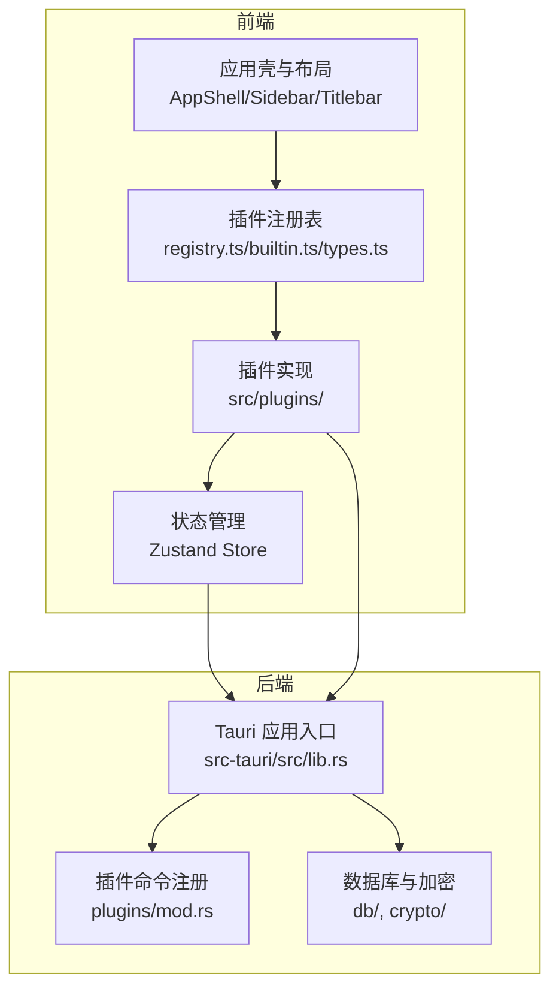
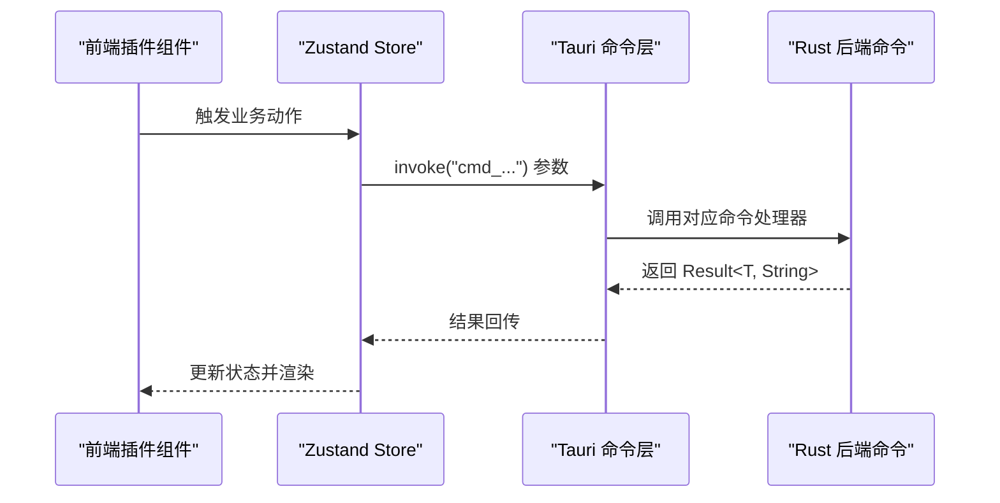
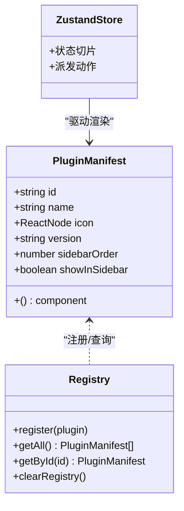
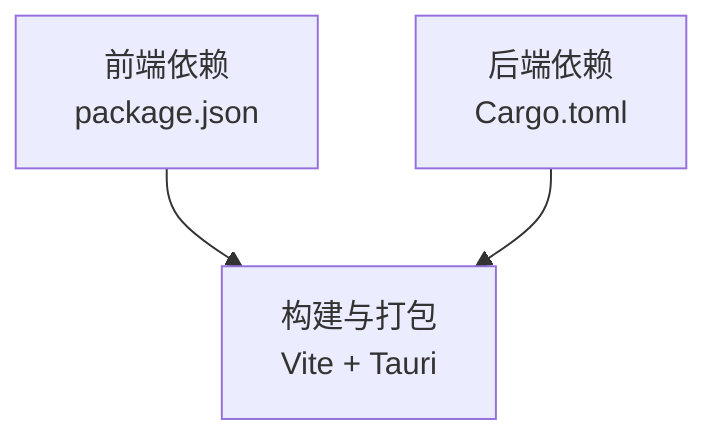

# 开发指南

<cite>
**本文档引用的文件**
- [README.md](file://README.md)
- [PLAN.md](file://PLAN.md)
- [CLAUDE.md](file://CLAUDE.md)
- [AGENTS.md](file://AGENTS.md)
- [package.json](file://package.json)
- [vite.config.ts](file://vite.config.ts)
- [tsconfig.json](file://tsconfig.json)
- [src-tauri/tauri.conf.json](file://src-tauri/tauri.conf.json)
- [src-tauri/Cargo.toml](file://src-tauri/Cargo.toml)
- [src/app/plugin-registry/types.ts](file://src/app/plugin-registry/types.ts)
- [src/app/plugin-registry/registry.ts](file://src/app/plugin-registry/registry.ts)
- [src/app/plugin-registry/builtin.ts](file://src/app/plugin-registry/builtin.ts)
- [src/plugins/api-debugger/types.ts](file://src/plugins/api-debugger/types.ts)
- [src/plugins/redis-manager/index.tsx](file://src/plugins/redis-manager/index.tsx)
- [src-tauri/src/lib.rs](file://src-tauri/src/lib.rs)
- [src-tauri/src/plugins/mod.rs](file://src-tauri/src/plugins/mod.rs)
</cite>

## 目录
1. [简介](#简介)
2. [项目结构](#项目结构)
3. [核心组件](#核心组件)
4. [架构总览](#架构总览)
5. [详细组件分析](#详细组件分析)
6. [依赖关系分析](#依赖关系分析)
7. [性能考量](#性能考量)
8. [故障排查指南](#故障排查指南)
9. [结论](#结论)
10. [附录](#附录)

## 简介
本开发指南面向希望参与 DevNexus 开发的贡献者，系统阐述插件开发规范、代码贡献流程、协作机制、开发计划与路线图、最佳实践、架构约束与设计原则，并提供开发工具、调试技巧与常见场景解决方案。DevNexus 是一个基于 Tauri 2 + React 19 + TypeScript + Rust 的插件化桌面工具箱，当前覆盖 Redis、SSH、S3、MongoDB、MySQL、网络诊断、API 调试与 MQ 调试等能力。

## 项目结构
DevNexus 采用“前端插件 + Rust 后端命令”的双栈架构，插件在编译期注册，运行时按需渲染。前端使用 Vite + React 19 + TypeScript，状态管理采用 Zustand；后端使用 Rust + Tokio，通过 Tauri 命令层与前端通信。

**图表来源**
- [src/app/plugin-registry/registry.ts:1-26](file://src/app/plugin-registry/registry.ts#L1-L26)
- [src/app/plugin-registry/builtin.ts:1-29](file://src/app/plugin-registry/builtin.ts#L1-L29)
- [src/app/plugin-registry/types.ts:1-14](file://src/app/plugin-registry/types.ts#L1-L14)
- [src/plugins/redis-manager/index.tsx:1-67](file://src/plugins/redis-manager/index.tsx#L1-L67)
- [src-tauri/src/lib.rs:1-250](file://src-tauri/src/lib.rs#L1-L250)
- [src-tauri/src/plugins/mod.rs:1-10](file://src-tauri/src/plugins/mod.rs#L1-L10)

**章节来源**
- [README.md: 56-93:56-93](file://README.md#L56-L93)
- [CLAUDE.md: 20-94:20-94](file://CLAUDE.md#L20-L94)
- [PLAN.md: 52-113:52-113](file://PLAN.md#L52-L113)

## 核心组件
- 插件注册与路由
  - 插件清单类型定义与注册表：[src/app/plugin-registry/types.ts:1-14](file://src/app/plugin-registry/types.ts#L1-L14)，[src/app/plugin-registry/registry.ts:1-26](file://src/app/plugin-registry/registry.ts#L1-L26)
  - 内置插件注册：[src/app/plugin-registry/builtin.ts:1-29](file://src/app/plugin-registry/builtin.ts#L1-L29)
- 前端插件骨架
  - 示例插件入口导出清单：[src/plugins/redis-manager/index.tsx:1-67](file://src/plugins/redis-manager/index.tsx#L1-L67)
- 后端命令层
  - Tauri 命令注册入口：[src-tauri/src/lib.rs:25-246](file://src-tauri/src/lib.rs#L25-L246)
  - 插件模块聚合：[src-tauri/src/plugins/mod.rs:1-10](file://src-tauri/src/plugins/mod.rs#L1-L10)
- 状态管理
  - 插件内 Zustand Store（示例：Redis 插件工作区状态）：[src/plugins/redis-manager/index.tsx:10-17](file://src/plugins/redis-manager/index.tsx#L10-L17)

**章节来源**
- [src/app/plugin-registry/types.ts: 1-14:1-14](file://src/app/plugin-registry/types.ts#L1-L14)
- [src/app/plugin-registry/registry.ts: 1-26:1-26](file://src/app/plugin-registry/registry.ts#L1-L26)
- [src/app/plugin-registry/builtin.ts: 1-29:1-29](file://src/app/plugin-registry/builtin.ts#L1-L29)
- [src/plugins/redis-manager/index.tsx: 1-L67:1-67](file://src/plugins/redis-manager/index.tsx#L1-L67)
- [src-tauri/src/lib.rs: 25-246:25-246](file://src-tauri/src/lib.rs#L25-L246)
- [src-tauri/src/plugins/mod.rs: 1-10:1-10](file://src-tauri/src/plugins/mod.rs#L1-L10)

## 架构总览
DevNexus 的插件化架构强调“前端视图/状态”与“后端命令/连接池”按插件隔离，通过 Tauri 命令层进行通信。前端通过 invoke 调用后端命令，后端命令返回结构化结果，前端使用 Zustand 管理插件内状态。

**图表来源**
- [CLAUDE.md: 42-49:42-49](file://CLAUDE.md#L42-L49)
- [src-tauri/src/lib.rs: 25-246:25-246](file://src-tauri/src/lib.rs#L25-L246)

**章节来源**
- [CLAUDE.md: 42-49:42-49](file://CLAUDE.md#L42-L49)
- [src-tauri/src/lib.rs: 25-246:25-246](file://src-tauri/src/lib.rs#L25-L246)

## 详细组件分析

### 插件开发规范
- 插件结构要求
  - 前端：每个插件在 src/plugins/<id>/ 下提供入口文件导出 PluginManifest，并在内置注册表中注册。[src/app/plugin-registry/builtin.ts:1-29](file://src/app/plugin-registry/builtin.ts#L1-L29)，[src/plugins/redis-manager/index.tsx:59-67](file://src/plugins/redis-manager/index.tsx#L59-L67)
  - 后端：在 src-tauri/src/plugins/<id>/ 下提供 mod.rs、commands.rs、types.rs，并在 Tauri 命令注册处集中注册。[src-tauri/src/plugins/mod.rs:1-10](file://src-tauri/src/plugins/mod.rs#L1-L10)，[src-tauri/src/lib.rs:25-246](file://src-tauri/src/lib.rs#L25-L246)
- 接口定义
  - 插件清单类型：包含 id、name、icon、version、component、sidebarOrder 等字段。[src/app/plugin-registry/types.ts:5-13](file://src/app/plugin-registry/types.ts#L5-L13)
  - API 调试数据模型示例：请求/响应/环境/集合/历史等类型定义。[src/plugins/api-debugger/types.ts:1-105](file://src/plugins/api-debugger/types.ts#L1-L105)
- 状态管理模式
  - 插件内状态使用 Zustand，按功能切片管理（如连接列表、工作区、键浏览器等）。[src/plugins/redis-manager/index.tsx:10-17](file://src/plugins/redis-manager/index.tsx#L10-L17)
  - 全局状态（主题、设置）位于 src/app/store/。[CLAUDE.md: 72-79:72-79](file://CLAUDE.md#L72-L79)
- 后端命令实现
  - 命名约定：cmd_<动词>_<名词>，返回 Result<T, String>，确保错误能序列化到前端。[CLAUDE.md: 22-27:22-27](file://CLAUDE.md#L22-L27)
  - 命令注册：在 lib.rs 的 generate_handler! 中集中注册，按插件模块分组。[src-tauri/src/lib.rs:25-246](file://src-tauri/src/lib.rs#L25-L246)

**图表来源**
- [src/app/plugin-registry/types.ts:5-13](file://src/app/plugin-registry/types.ts#L5-L13)
- [src/app/plugin-registry/registry.ts:1-26](file://src/app/plugin-registry/registry.ts#L1-L26)
- [src/plugins/redis-manager/index.tsx:10-17](file://src/plugins/redis-manager/index.tsx#L10-L17)

**章节来源**
- [src/app/plugin-registry/types.ts: 5-13:5-13](file://src/app/plugin-registry/types.ts#L5-L13)
- [src/app/plugin-registry/registry.ts: 1-26:1-26](file://src/app/plugin-registry/registry.ts#L1-L26)
- [src/app/plugin-registry/builtin.ts: 1-29:1-29](file://src/app/plugin-registry/builtin.ts#L1-L29)
- [src/plugins/redis-manager/index.tsx: 59-67:59-67](file://src/plugins/redis-manager/index.tsx#L59-L67)
- [src/plugins/api-debugger/types.ts: 1-105:1-105](file://src/plugins/api-debugger/types.ts#L1-L105)
- [CLAUDE.md: 22-27:22-27](file://CLAUDE.md#L22-L27)
- [src-tauri/src/lib.rs: 25-246:25-246](file://src-tauri/src/lib.rs#L25-L246)

### 代码贡献指南
- 代码风格规范
  - TypeScript 严格模式：开启 noUnusedLocals、noUnusedParameters、noFallthroughCasesInSwitch。[tsconfig.json: 22-25:22-25](file://tsconfig.json#L22-L25)
  - 路径别名：@/ 指向 src/。[tsconfig.json: 17-19:17-19](file://tsconfig.json#L17-L19)，[vite.config.ts: 11-15:11-15](file://vite.config.ts#L11-L15)
- 提交消息格式
  - 采用 Conventional Commits 风格（feat:, fix:, ci:, docs: 等），动词祈使句，限定范围为单一变更。[AGENTS.md: 55](file://AGENTS.md#L55)
- 分支管理策略
  - 主分支：main 用于集成与发布准备；版本标签以 vX.Y.Z 推送触发发布流程。[README.md: 158-177:158-177](file://README.md#L158-L177)，[AGENTS.md: 35-42:35-42](file://AGENTS.md#L35-L42)
- 代码审查流程
  - 变更后执行三要素验证：npm test、npm run build、cd src-tauri && cargo check。[AGENTS.md: 7-12:7-12](file://AGENTS.md#L7-L12)

**章节来源**
- [tsconfig.json: 22-25:22-25](file://tsconfig.json#L22-L25)
- [tsconfig.json: 17-19:17-19](file://tsconfig.json#L17-L19)
- [vite.config.ts: 11-15:11-15](file://vite.config.ts#L11-L15)
- [AGENTS.md: 7-12:7-12](file://AGENTS.md#L7-L12)
- [AGENTS.md: 35-42:35-42](file://AGENTS.md#L35-L42)
- [AGENTS.md: 55](file://AGENTS.md#L55)
- [README.md: 158-177:158-177](file://README.md#L158-L177)

### 贡献者协议与协作机制
- 贡献者角色
  - Maintainer：负责代码质量、发布与路线图推进。[PLAN.md: 1-4:1-4](file://PLAN.md#L1-L4)
- 决策流程
  - 重大变更在 PLAN.md 中同步记录与评审，保持开发进度透明。[AGENTS.md: 43-45:43-45](file://AGENTS.md#L43-L45)
- 冲突解决机制
  - 严格遵循 Conventional Commits 与三要素验证，减少回归；必要时通过 PR 评审与讨论达成共识。[AGENTS.md: 7-12:7-12](file://AGENTS.md#L7-L12)，[AGENTS.md: 55](file://AGENTS.md#L55)

**章节来源**
- [PLAN.md: 1-4:1-4](file://PLAN.md#L1-L4)
- [AGENTS.md: 43-45:43-45](file://AGENTS.md#L43-L45)
- [AGENTS.md: 7-12:7-12](file://AGENTS.md#L7-L12)
- [AGENTS.md: 55](file://AGENTS.md#L55)

### 开发计划与路线图
- 功能优先级与里程碑
  - 当前已实现：Redis、SSH、S3、MongoDB、MySQL、Network、API Debugger、MQ Client、LAN Chat 等主线能力。[README.md: 13-26:13-26](file://README.md#L13-L26)
  - 后续迭代：补齐导入导出细节、更新检测、数据库深度能力与体验优化。[README.md: 194-197:194-197](file://README.md#L194-L197)
- 版本发布节奏
  - 通过 GitHub Actions 工作流自动化构建与发布，推送 v* 标签触发 Release。[README.md: 158-177:158-177](file://README.md#L158-L177)
- 开发顺序与阶段
  - 参考 PLAN.md 的阶段划分与周计划，逐步完成脚手架、连接管理、数据类型编辑器、命令控制台、服务器监控、导入导出与打包发布等。[PLAN.md: 117-402:117-402](file://PLAN.md#L117-L402)

**章节来源**
- [README.md: 13-26:13-26](file://README.md#L13-L26)
- [README.md: 158-177:158-177](file://README.md#L158-L177)
- [README.md: 194-197:194-197](file://README.md#L194-L197)
- [PLAN.md: 117-402:117-402](file://PLAN.md#L117-L402)

### 插件开发最佳实践
- 性能优化
  - 大列表虚拟化：使用 @tanstack/react-virtual 降低渲染开销。[README.md: 319](file://README.md#L319)
  - 分页与前缀过滤：避免一次性加载海量数据。[README.md: 192](file://README.md#L192)
- 错误处理
  - 命令返回 Result<T, String>，前端统一处理错误；对危险命令进行二次确认。[CLAUDE.md: 22-27:22-27](file://CLAUDE.md#L22-L27)，[PLAN.md: 294](file://PLAN.md#L294)
- 用户体验设计
  - 操作安全：危险命令确认、分页与虚拟化、可滚动监控页面。[README.md: 326](file://README.md#L326)
- 可维护性
  - 插件隔离：前端视图/状态与后端命令按插件切片，职责清晰。[README.md: 29](file://README.md#L29)

**章节来源**
- [README.md: 319](file://README.md#L319)
- [README.md: 192](file://README.md#L192)
- [README.md: 326](file://README.md#L326)
- [CLAUDE.md: 22-27:22-27](file://CLAUDE.md#L22-L27)
- [PLAN.md: 294](file://PLAN.md#L294)
- [README.md: 29](file://README.md#L29)

### 项目架构约束与设计原则
- 模块化设计
  - 插件按目录隔离，前端组件、状态与后端命令在同一命名空间下组织。[PLAN.md: 52-113:52-113](file://PLAN.md#L52-L113)
- 接口稳定性
  - 命令命名与返回类型约定统一，避免频繁破坏性变更。[CLAUDE.md: 22-27:22-27](file://CLAUDE.md#L22-L27)
- 向后兼容性
  - 数据库迁移与密钥文件兼容处理，确保升级平滑。[CLAUDE.md: 80-83:80-83](file://CLAUDE.md#L80-L83)
- 扩展性保证
  - 新插件只需在前后端分别注册即可上线，无需改动核心框架。[CLAUDE.md: 24-41:24-41](file://CLAUDE.md#L24-L41)

**章节来源**
- [PLAN.md: 52-113:52-113](file://PLAN.md#L52-L113)
- [CLAUDE.md: 24-41:24-41](file://CLAUDE.md#L24-L41)
- [CLAUDE.md: 80-83:80-83](file://CLAUDE.md#L80-L83)
- [CLAUDE.md: 22-27:22-27](file://CLAUDE.md#L22-L27)

### 开发工具推荐、调试技巧与性能分析
- 开发工具
  - 前端：Vite（端口 1420，严格端口），TypeScript 严格模式，React 19。[vite.config.ts: 25-29:25-29](file://vite.config.ts#L25-L29)，[tsconfig.json: 22-25:22-25](file://tsconfig.json#L22-L25)
  - 后端：Rust（Tokio 运行时），Tauri CLI，Cargo。[src-tauri/Cargo.toml:20-48](file://src-tauri/Cargo.toml#L20-L48)
- 调试技巧
  - 前端：利用 Vite HMR 与严格端口特性，结合浏览器开发者工具定位问题。[vite.config.ts: 25-39:25-39](file://vite.config.ts#L25-L39)
  - 后端：通过 Tauri 日志与 dev_log 命令辅助定位；注意 Tauri 构建可能超过默认命令超时。[AGENTS.md: 54](file://AGENTS.md#L54)
- 性能分析
  - 大数据场景采用虚拟列表与分页；关注 Vite chunk 警告与 Rust 未使用项警告（不影响发布）。[README.md: 134](file://README.md#L134)

**章节来源**
- [vite.config.ts: 25-39:25-39](file://vite.config.ts#L25-L39)
- [tsconfig.json: 22-25:22-25](file://tsconfig.json#L22-L25)
- [src-tauri/Cargo.toml: 20-48:20-48](file://src-tauri/Cargo.toml#L20-L48)
- [AGENTS.md: 54](file://AGENTS.md#L54)
- [README.md: 134](file://README.md#L134)

### 常见开发场景与模板
- 新增插件步骤
  - 前端：创建 src/plugins/<id>/index.tsx 导出 PluginManifest，并在 src/app/plugin-registry/builtin.ts 中注册。[src/app/plugin-registry/builtin.ts:1-29](file://src/app/plugin-registry/builtin.ts#L1-L29)，[src/plugins/redis-manager/index.tsx:59-67](file://src/plugins/redis-manager/index.tsx#L59-L67)
  - 后端：在 src-tauri/src/plugins/<id>/ 下实现 mod.rs/commands.rs/types.rs，并在 src-tauri/src/lib.rs 的 generate_handler! 中注册命令。[src-tauri/src/plugins/mod.rs:1-10](file://src-tauri/src/plugins/mod.rs#L1-L10)，[src-tauri/src/lib.rs:25-246](file://src-tauri/src/lib.rs#L25-L246)
- 命令实现模板
  - 命名：cmd_<动词>_<名词>，返回 Result<T, String>，参数与返回值使用 #[serde(rename_all = "camelCase")] 与 TS 约定一致。[CLAUDE.md: 22-27:22-27](file://CLAUDE.md#L22-L27)
- 状态管理模板
  - 插件内使用 Zustand 切片管理状态，避免跨插件耦合。[src/plugins/redis-manager/index.tsx:10-17](file://src/plugins/redis-manager/index.tsx#L10-L17)

**章节来源**
- [src/app/plugin-registry/builtin.ts: 1-29:1-29](file://src/app/plugin-registry/builtin.ts#L1-L29)
- [src/plugins/redis-manager/index.tsx: 59-67:59-67](file://src/plugins/redis-manager/index.tsx#L59-L67)
- [src-tauri/src/plugins/mod.rs: 1-10:1-10](file://src-tauri/src/plugins/mod.rs#L1-L10)
- [src-tauri/src/lib.rs: 25-246:25-246](file://src-tauri/src/lib.rs#L25-L246)
- [CLAUDE.md: 22-27:22-27](file://CLAUDE.md#L22-L27)
- [src/plugins/redis-manager/index.tsx: 10-L17:10-17](file://src/plugins/redis-manager/index.tsx#L10-L17)

## 依赖关系分析
- 前端依赖
  - React 19、Ant Design、Zustand、@tanstack/react-virtual、ECharts、xterm、@tauri-apps/api 等。[package.json: 15-29:15-29](file://package.json#L15-L29)
- 后端依赖
  - Tauri 2、redis、rusqlite、aes-gcm、tokio、aws-sdk-s3、russh、mongodb、mysql_async、reqwest、lapin、rdkafka 等。[src-tauri/Cargo.toml: 20-48:20-48](file://src-tauri/Cargo.toml#L20-L48)
- 构建与打包
  - Vite + Tauri CLI，跨平台打包（Windows/macOS/Linux）。[README.md: 136-150:136-150](file://README.md#L136-L150)，[src-tauri/tauri.conf.json: 27-37:27-37](file://src-tauri/tauri.conf.json#L27-L37)

**图表来源**
- [package.json: 15-29:15-29](file://package.json#L15-L29)
- [src-tauri/Cargo.toml: 20-48:20-48](file://src-tauri/Cargo.toml#L20-L48)
- [src-tauri/tauri.conf.json: 27-37:27-37](file://src-tauri/tauri.conf.json#L27-L37)

**章节来源**
- [package.json: 15-29:15-29](file://package.json#L15-L29)
- [src-tauri/Cargo.toml: 20-48:20-48](file://src-tauri/Cargo.toml#L20-L48)
- [README.md: 136-150:136-150](file://README.md#L136-L150)
- [src-tauri/tauri.conf.json: 27-37:27-37](file://src-tauri/tauri.conf.json#L27-L37)

## 性能考量
- 前端
  - 虚拟化与分页：百万级 Key 列表使用虚拟列表，避免一次性渲染。[PLAN.md: 372](file://PLAN.md#L372)
  - 大值预览：超过阈值只显示预览，提供“加载完整内容”按钮。[PLAN.md: 374](file://PLAN.md#L374)
- 后端
  - 连接池与心跳：Redis/SSH 连接池与 keepalive，断线自动重连。[PLAN.md: 373](file://PLAN.md#L373)，[PLAN.md: 486-487:486-487](file://PLAN.md#L486-L487)
- 构建与运行
  - Vite 大 chunk 警告与 Rust 未使用警告为预期非阻塞项。[README.md: 134](file://README.md#L134)

**章节来源**
- [PLAN.md: 372](file://PLAN.md#L372)
- [PLAN.md: 374](file://PLAN.md#L374)
- [PLAN.md: 486-487:486-487](file://PLAN.md#L486-L487)
- [README.md: 134](file://README.md#L134)

## 故障排查指南
- 常见问题
  - Vite 端口被占用：固定端口 1420，严格端口模式，确保端口可用。[vite.config.ts: 25-29:25-29](file://vite.config.ts#L25-L29)
  - Tauri 构建超时：构建过程可能较长，适当延长超时时间。[AGENTS.md: 54](file://AGENTS.md#L54)
  - 前端严格模式报错：启用 noUnusedLocals/noUnusedParameters/noFallthroughCasesInSwitch。[tsconfig.json: 22-25:22-25](file://tsconfig.json#L22-L25)
- 安全与合规
  - 敏感数据加密存储与脱敏展示，禁止提交凭证与本地数据库文件。[README.md: 179-184:179-184](file://README.md#L179-L184)，[AGENTS.md: 29-34:29-34](file://AGENTS.md#L29-L34)

**章节来源**
- [vite.config.ts: 25-29:25-29](file://vite.config.ts#L25-L29)
- [AGENTS.md: 54](file://AGENTS.md#L54)
- [tsconfig.json: 22-25:22-25](file://tsconfig.json#L22-L25)
- [README.md: 179-184:179-184](file://README.md#L179-L184)
- [AGENTS.md: 29-34:29-34](file://AGENTS.md#L29-L34)

## 结论
DevNexus 通过清晰的插件化架构、严格的前后端契约与完善的开发流程，为多协议连接与诊断工具提供了可扩展、可维护的桌面应用方案。贡献者可依据本文档的规范与最佳实践快速上手，并在 PLAN.md 的路线图指引下高效交付高质量功能。

## 附录
- 环境要求与本地开发命令
  - Node.js 20+、Rust stable、Tauri 前置依赖。[README.md: 95-100:95-100](file://README.md#L95-L100)
  - 本地开发：npm install → npm run dev 或 npm run tauri dev。[README.md: 107-118:107-118](file://README.md#L107-L118)
- 验证与构建
  - 测试：npm test；类型检查 + 构建：npm run build；Rust 检查：cd src-tauri && cargo check。[README.md: 120-132:120-132](file://README.md#L120-L132)
- 打包与发布
  - 平台打包：Windows(.exe/.msi)、macOS(.app/.dmg)、Linux(.deb/.AppImage)。[README.md: 136-150:136-150](file://README.md#L136-L150)
  - 发布流程：更新版本 → 编写发布说明 → 提交并推送 → 打标签 → 触发工作流。[README.md: 158-177:158-177](file://README.md#L158-L177)

**章节来源**
- [README.md: 95-100:95-100](file://README.md#L95-L100)
- [README.md: 107-118:107-118](file://README.md#L107-L118)
- [README.md: 120-132:120-132](file://README.md#L120-L132)
- [README.md: 136-150:136-150](file://README.md#L136-L150)
- [README.md: 158-177:158-177](file://README.md#L158-L177)