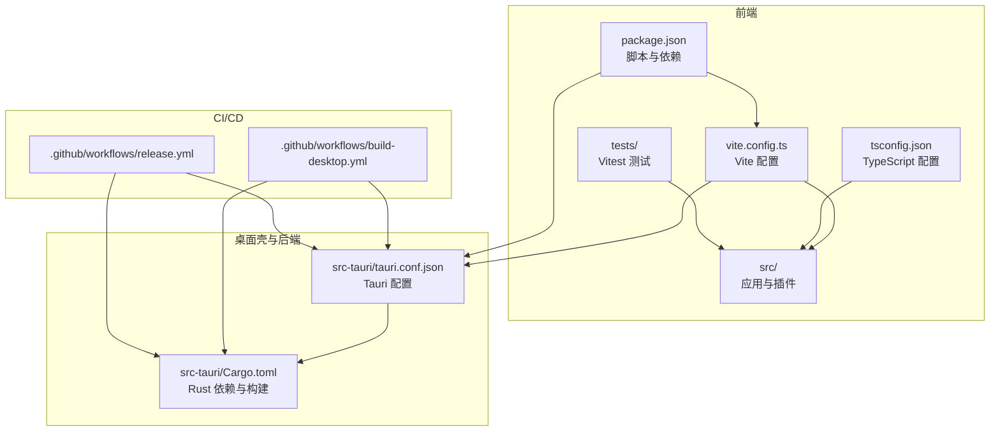
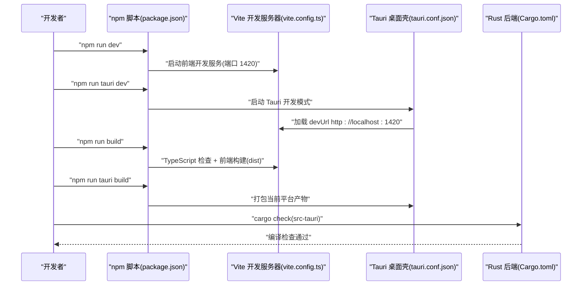
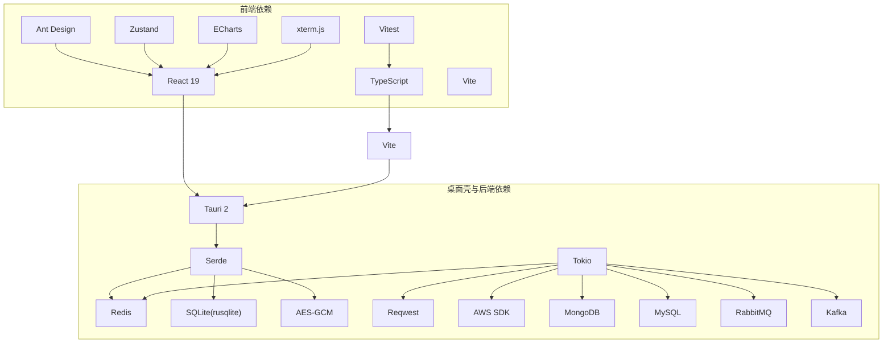

# 快速开始

<cite>
**本文引用的文件**
- [README.md](file://README.md)
- [package.json](file://package.json)
- [vite.config.ts](file://vite.config.ts)
- [tsconfig.json](file://tsconfig.json)
- [tsconfig.node.json](file://tsconfig.node.json)
- [src-tauri/tauri.conf.json](file://src-tauri/tauri.conf.json)
- [src-tauri/Cargo.toml](file://src-tauri/Cargo.toml)
- [.github/workflows/build-desktop.yml](file://.github/workflows/build-desktop.yml)
- [.github/workflows/release.yml](file://.github/workflows/release.yml)
- [tests/app/plugin-registry/registry.test.ts](file://tests/app/plugin-registry/registry.test.ts)
- [tests/app/plugin-registry/builtin.test.ts](file://tests/app/plugin-registry/builtin.test.ts)
- [src/app/plugin-registry/types.ts](file://src/app/plugin-registry/types.ts)
- [src/plugins/redis-manager/index.tsx](file://src/plugins/redis-manager/index.tsx)
</cite>

## 目录
1. [简介](#简介)
2. [项目结构](#项目结构)
3. [核心组件](#核心组件)
4. [架构总览](#架构总览)
5. [详细组件分析](#详细组件分析)
6. [依赖关系分析](#依赖关系分析)
7. [性能考虑](#性能考虑)
8. [故障排除指南](#故障排除指南)
9. [结论](#结论)
10. [附录](#附录)

## 简介
本指南面向首次接触 DevNexus 的开发者，帮助你在本地快速搭建开发环境、启动前端开发服务、启动完整 Tauri 桌面应用，并完成验证与打包发布。DevNexus 是一个基于 Tauri 2 + React 19 + TypeScript + Rust 的插件化桌面工具箱，当前版本为 0.9.x。

## 项目结构
DevNexus 采用前后端分离的桌面应用结构：
- 前端（React + TypeScript + Vite）位于 src/ 与根目录脚本中
- 桌面壳与后端（Rust + Tauri）位于 src-tauri/
- 测试位于 tests/，CI/CD 工作流位于 .github/workflows/

**图表来源**
- [package.json:1-40](file://package.json#L1-L40)
- [vite.config.ts:1-42](file://vite.config.ts#L1-L42)
- [tsconfig.json:1-30](file://tsconfig.json#L1-L30)
- [src-tauri/tauri.conf.json:1-39](file://src-tauri/tauri.conf.json#L1-L39)
- [src-tauri/Cargo.toml:1-48](file://src-tauri/Cargo.toml#L1-L48)
- [.github/workflows/build-desktop.yml:1-142](file://.github/workflows/build-desktop.yml#L1-L142)
- [.github/workflows/release.yml:1-178](file://.github/workflows/release.yml#L1-L178)

**章节来源**
- [README.md:56-93](file://README.md#L56-L93)
- [README.md:248-279](file://README.md#L248-L279)

## 核心组件
- 前端开发与构建
  - Vite 作为开发服务器与构建工具
  - TypeScript 类型检查与构建
  - Vitest 单元测试
- 桌面壳与后端
  - Tauri 2 配置与窗口、安全、打包设置
  - Rust 依赖与 Tokio 运行时
- 测试与验证
  - Vitest 测试用例
  - TypeScript 类型检查
  - Rust 后端编译检查

**章节来源**
- [package.json:6-14](file://package.json#L6-L14)
- [vite.config.ts:9-42](file://vite.config.ts#L9-L42)
- [tsconfig.json:1-30](file://tsconfig.json#L1-L30)
- [src-tauri/Cargo.toml:20-48](file://src-tauri/Cargo.toml#L20-L48)
- [src-tauri/tauri.conf.json:6-11](file://src-tauri/tauri.conf.json#L6-L11)

## 架构总览
DevNexus 的开发与运行时架构如下：
- 开发时，Vite 在 1420 端口提供前端开发服务，Tauri 通过 beforeDevCommand 调用前端脚本
- 生产构建时，Vite 将前端产物输出到 dist，Tauri 通过 beforeBuildCommand 调用前端构建
- Rust 后端通过 Tauri CLI 暴露命令给前端使用

**图表来源**
- [package.json:6-14](file://package.json#L6-L14)
- [vite.config.ts:20-41](file://vite.config.ts#L20-L41)
- [src-tauri/tauri.conf.json:6-11](file://src-tauri/tauri.conf.json#L6-L11)
- [src-tauri/Cargo.toml:17-48](file://src-tauri/Cargo.toml#L17-L48)

## 详细组件分析

### 环境要求与前置依赖
- Node.js 20+
- Rust stable
- Tauri 平台前置依赖（Windows/macOS/Linux）
  - Windows：满足 Tauri Windows 前置依赖
  - macOS/Linux：满足对应平台的 Tauri 前置依赖

参考：
- https://www.rust-lang.org/tools/install
- https://tauri.app/start/prerequisites/

**章节来源**
- [README.md:95-101](file://README.md#L95-L101)
- [README.md:281-291](file://README.md#L281-L291)

### 本地开发环境搭建步骤
- 安装依赖
  - 在项目根目录执行依赖安装
- 仅启动 Vite 前端开发服务
  - 在项目根目录执行前端开发服务启动
- 启动完整 Tauri 桌面开发模式
  - 在项目根目录执行 Tauri 开发模式启动

**章节来源**
- [README.md:107-118](file://README.md#L107-L118)
- [README.md:292-303](file://README.md#L292-L303)

### 验证命令
- 运行 Vitest 测试
  - 在项目根目录执行测试命令
- TypeScript 类型检查 + 前端生产构建
  - 在项目根目录执行构建命令
- Rust 后端编译检查
  - 进入 src-tauri 目录执行 cargo check

注意：当前构建可能出现 Vite 大 chunk 警告与一个既有的未使用类型警告；只要命令退出码为 0，不阻塞发布。

**章节来源**
- [README.md:120-134](file://README.md#L120-L134)
- [README.md:305-320](file://README.md#L305-L320)

### 打包与发布
- 当前平台默认打包
  - 在项目根目录执行打包命令
- Windows 平台打包（NSIS 安装包）
  - 在项目根目录执行带 --bundles nsis 的打包命令
- macOS 平台打包（.app + .dmg）
  - 在项目根目录执行带 --bundles app,dmg 的打包命令
- Linux 平台打包（.deb + .AppImage）
  - 在项目根目录执行带 --bundles deb,appimage 的打包命令

Windows 产物示例路径：
- src-tauri/target/release/bundle/nsis/DevNexus_0.9.2_x64-setup.exe

**章节来源**
- [README.md:136-151](file://README.md#L136-L151)
- [README.md:321-342](file://README.md#L321-L342)

### 发布流程
仓库包含两条 GitHub Actions 工作流：
- build-desktop.yml：在推送 main 或手动触发时，构建并上传各平台 artifacts
- release.yml：在推送 v* tag 后触发，构建 Windows/macOS/Linux 包并创建 GitHub Release

典型发布流程：
- 更新 package.json、src-tauri/Cargo.toml、src-tauri/tauri.conf.json 版本号
- 新增 docs/releases/vX.Y.Z.md
- 执行测试、构建与 Rust 编译检查
- 提交并推送 main 后打 tag

**章节来源**
- [README.md:158-178](file://README.md#L158-L178)
- [README.md:343-363](file://README.md#L343-L363)

### Tauri 配置要点
- 开发前命令与开发 URL
  - beforeDevCommand 指向前端开发脚本
  - devUrl 固定为 http://localhost:1420
- 构建前命令与前端产物目录
  - beforeBuildCommand 指向前端构建脚本
  - frontendDist 指向 dist
- 窗口与安全
  - 窗口尺寸与最小尺寸
  - CSP 设为 null（开发阶段）
- 打包目标
  - targets 为 all，包含多平台

**章节来源**
- [src-tauri/tauri.conf.json:6-38](file://src-tauri/tauri.conf.json#L6-L38)

### Vite 配置要点
- 路径别名
  - @ 指向 src
- 测试配置
  - 测试文件匹配 tests/**/*.test.ts
- 开发服务器
  - 固定端口 1420，严格端口占用
  - host 支持通过环境变量配置
  - HMR 配置支持远程主机
  - 忽略 src-tauri 目录监听

**章节来源**
- [vite.config.ts:9-42](file://vite.config.ts#L9-L42)

### TypeScript 配置要点
- 模块解析与打包器模式
- JSX 与路径映射
- 严格模式与未使用检查
- 引用 tsconfig.node.json

**章节来源**
- [tsconfig.json:1-30](file://tsconfig.json#L1-L30)
- [tsconfig.node.json:1-11](file://tsconfig.node.json#L1-L11)

### Rust 依赖与 Tokio 运行时
- Tauri 2 与相关插件
- Redis、SQLite、AES-GCM、UUID、Tokio、Reqwest、AWS SDK、MongoDB、MySQL、RabbitMQ、Kafka 等
- Tokio 全功能运行时

**章节来源**
- [src-tauri/Cargo.toml:20-48](file://src-tauri/Cargo.toml#L20-L48)

### 插件注册与测试
- 插件注册表类型定义
- 插件注册与排序逻辑
- 插件清单示例（以 Redis 管理器为例）

**章节来源**
- [src/app/plugin-registry/types.ts:1-14](file://src/app/plugin-registry/types.ts#L1-L14)
- [tests/app/plugin-registry/registry.test.ts:1-40](file://tests/app/plugin-registry/registry.test.ts#L1-L40)
- [tests/app/plugin-registry/builtin.test.ts:1-31](file://tests/app/plugin-registry/builtin.test.ts#L1-L31)
- [src/plugins/redis-manager/index.tsx:59-67](file://src/plugins/redis-manager/index.tsx#L59-L67)

## 依赖关系分析
- 前端依赖
  - React 19、Ant Design、Zustand、ECharts、xterm.js、Vite、TypeScript、Vitest
- 桌面壳与后端依赖
  - Tauri 2、serde、redis、rusqlite、aes-gcm、tokio、reqwest、aws-sdk、mongodb、mysql_async、lapin、rdkafka
- CI/CD 依赖
  - Node.js 20、Rust stable、平台系统依赖（Linux 需要 WebKit/GTK/AppIndicator 等）

**图表来源**
- [package.json:15-38](file://package.json#L15-L38)
- [src-tauri/Cargo.toml:20-48](file://src-tauri/Cargo.toml#L20-L48)

**章节来源**
- [package.json:15-38](file://package.json#L15-L38)
- [src-tauri/Cargo.toml:20-48](file://src-tauri/Cargo.toml#L20-L48)

## 性能考虑
- 前端性能
  - 使用虚拟列表与分页加载，避免一次性渲染大量数据
  - 严格模式与未使用检查减少冗余代码
- 后端性能
  - Tokio 全功能运行时提供异步并发能力
  - 连接池与缓存降低重复连接开销
- 构建性能
  - Vite 快速热更新与严格的端口占用避免冲突
  - TypeScript 与 Vite 构建配合提升生产构建效率

[本节为通用指导，无需“章节来源”]

## 故障排除指南
- 端口占用
  - Vite 固定端口 1420，严格端口占用；若被占用，需释放或修改配置
- Tauri 开发模式无法加载前端
  - 确认 devUrl 与 beforeDevCommand 配置一致
  - 确认前端开发服务已在 1420 端口运行
- Linux 打包失败
  - 安装平台系统依赖：libwebkit2gtk-4.1-dev、libgtk-3-dev、libayatana-appindicator3-dev、librsvg2-dev、libcurl4-openssl-dev、patchelf
- Windows 打包失败
  - 满足 Tauri Windows 前置依赖
- macOS 打包失败
  - 指定目标架构与 bundle 参数，确保签名与权限配置正确
- 测试失败
  - 使用 Vitest 测试用例定位问题，关注插件注册与清单定义
- 类型检查失败
  - 严格模式下检查未使用变量与参数，修正类型定义
- Rust 编译失败
  - 使用 cargo check 检查依赖与语法，确保 Tokio 与第三方库版本兼容

**章节来源**
- [vite.config.ts:20-41](file://vite.config.ts#L20-L41)
- [src-tauri/tauri.conf.json:6-11](file://src-tauri/tauri.conf.json#L6-L11)
- [.github/workflows/build-desktop.yml:112-122](file://.github/workflows/build-desktop.yml#L112-L122)
- [.github/workflows/release.yml:126-136](file://.github/workflows/release.yml#L126-L136)
- [tests/app/plugin-registry/registry.test.ts:1-40](file://tests/app/plugin-registry/registry.test.ts#L1-L40)

## 结论
通过本快速开始指南，你可以在本地完成 DevNexus 的环境准备、开发服务启动、验证与打包发布全流程。建议在开发过程中结合测试与类型检查，确保代码质量与稳定性；在打包与发布时遵循 CI/CD 工作流规范，保证多平台产物的一致性与可追溯性。

[本节为总结性内容，无需“章节来源”]

## 附录
- 常用命令速查
  - 安装依赖：npm install
  - 启动前端开发：npm run dev
  - 启动 Tauri 开发：npm run tauri dev
  - 运行测试：npm test
  - 类型检查与构建：npm run build
  - Rust 编译检查：cd src-tauri && cargo check
  - 打包当前平台：npm run tauri build
  - Windows 打包：npm run tauri build -- --bundles nsis
  - macOS 打包：npm run tauri build -- --bundles app,dmg
  - Linux 打包：npm run tauri build -- --bundles deb,appimage

[本节为补充内容，无需“章节来源”]