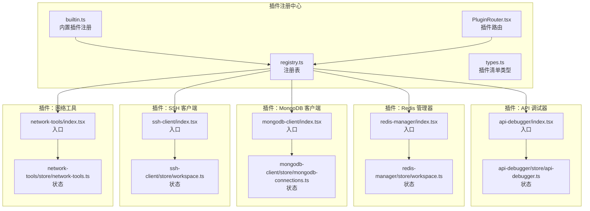
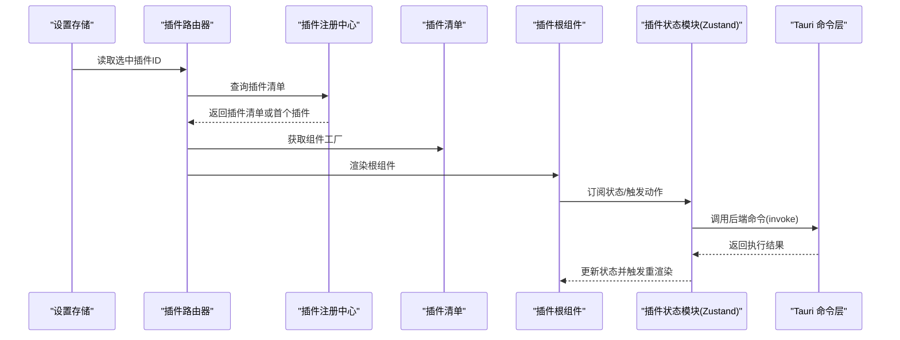
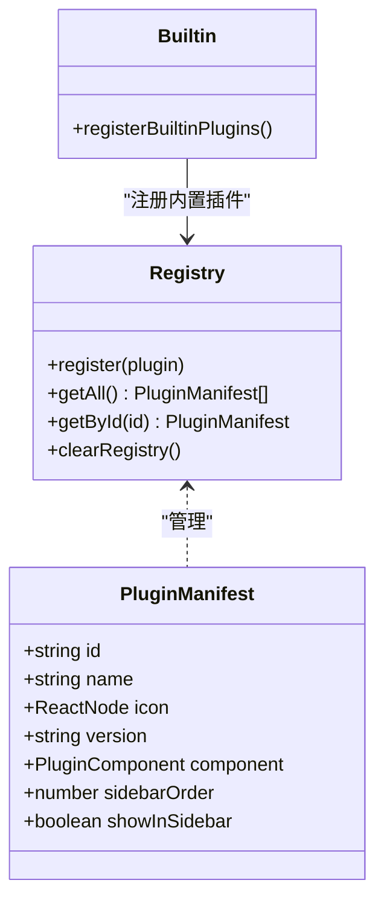
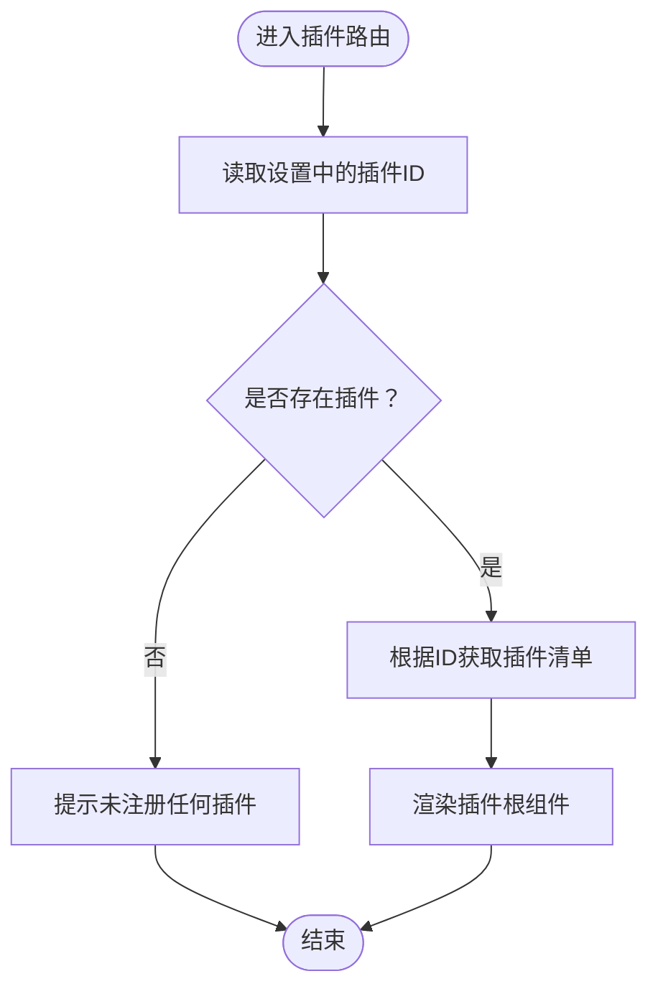
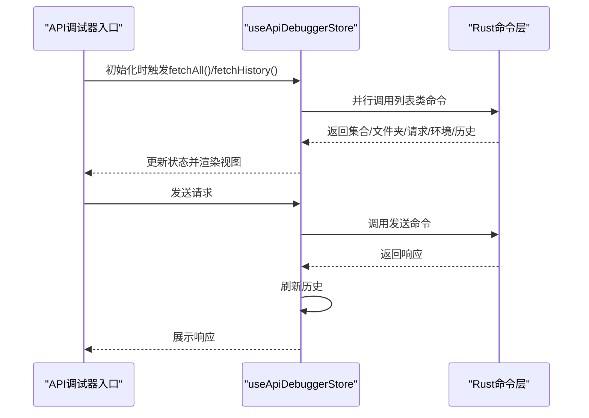
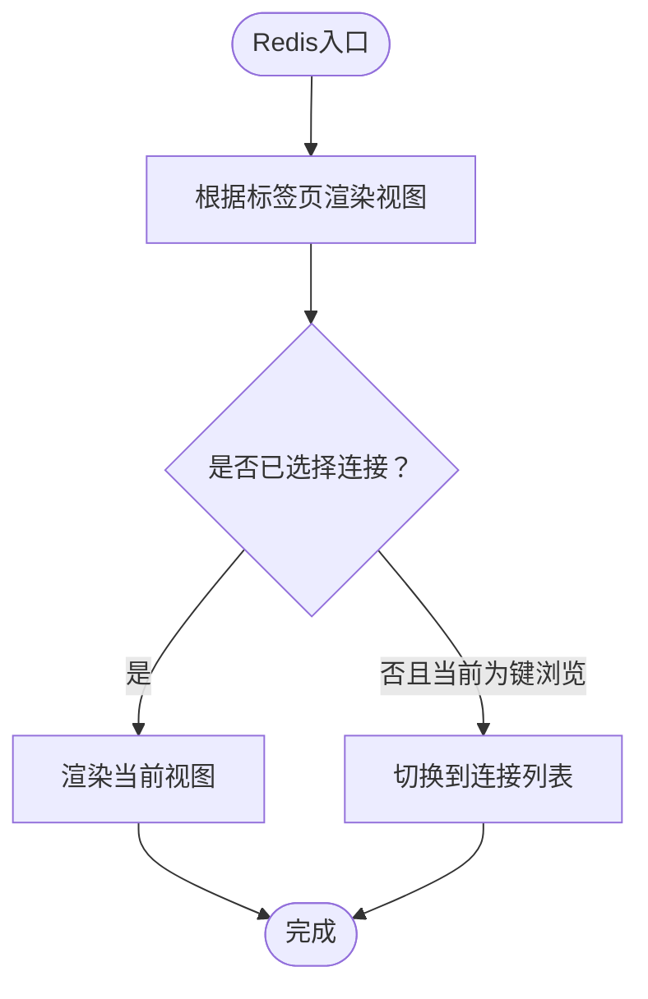
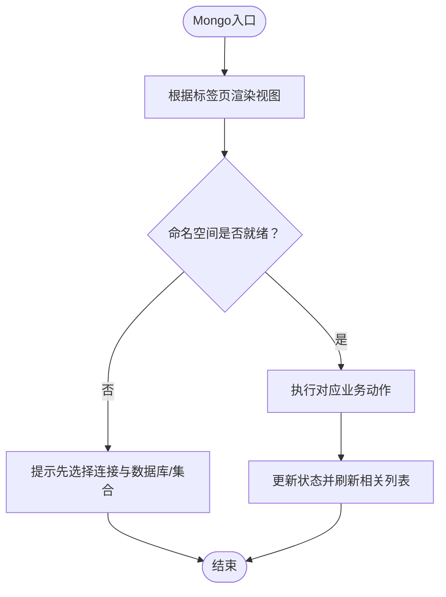

# 插件开发指南

<cite>
**本文档引用的文件**
- [README.md](file://README.md)
- [src/app/plugin-registry/registry.ts](file://src/app/plugin-registry/registry.ts)
- [src/app/plugin-registry/types.ts](file://src/app/plugin-registry/types.ts)
- [src/app/plugin-registry/builtin.ts](file://src/app/plugin-registry/builtin.ts)
- [src/app/plugin-registry/PluginRouter.tsx](file://src/app/plugin-registry/PluginRouter.tsx)
- [src/plugins/api-debugger/index.tsx](file://src/plugins/api-debugger/index.tsx)
- [src/plugins/api-debugger/store/api-debugger.ts](file://src/plugins/api-debugger/store/api-debugger.ts)
- [src/plugins/redis-manager/index.tsx](file://src/plugins/redis-manager/index.tsx)
- [src/plugins/redis-manager/store/workspace.ts](file://src/plugins/redis-manager/store/workspace.ts)
- [src/plugins/mongodb-client/index.tsx](file://src/plugins/mongodb-client/index.tsx)
- [src/plugins/mongodb-client/store/mongodb-connections.ts](file://src/plugins/mongodb-client/store/mongodb-connections.ts)
- [src/plugins/ssh-client/index.tsx](file://src/plugins/ssh-client/index.tsx)
- [src/plugins/ssh-client/store/workspace.ts](file://src/plugins/ssh-client/store/workspace.ts)
- [src/plugins/network-tools/index.tsx](file://src/plugins/network-tools/index.tsx)
- [src/plugins/network-tools/store/network-tools.ts](file://src/plugins/network-tools/store/network-tools.ts)
</cite>

## 目录
1. [简介](#简介)
2. [项目结构](#项目结构)
3. [核心组件](#核心组件)
4. [架构总览](#架构总览)
5. [详细组件分析](#详细组件分析)
6. [依赖关系分析](#依赖关系分析)
7. [性能考虑](#性能考虑)
8. [故障排除指南](#故障排除指南)
9. [结论](#结论)
10. [附录](#附录)

## 简介
本指南面向希望在现有桌面应用中开发“插件”的开发者，系统讲解从项目结构搭建到功能实现的完整流程。基于仓库中的真实插件实现，我们将重点说明：
- 插件项目的标准组织方式：入口文件 index.tsx、状态管理 store、视图组件 views、类型定义 types
- 使用 Zustand 构建插件专用状态、状态持久化与跨插件通信策略
- 视图组件的设计原则：组件拆分、事件处理与用户交互
- 与后端 Rust 命令通过 Tauri API 的集成方式：命令调用、错误处理与异步操作
- 提供简单插件（如网络工具）与复杂插件（如 API 调试器、MongoDB 客户端）的实现对比
- 调试技巧、性能优化建议与发布流程

## 项目结构
该应用采用“插件化架构”，每个插件自包含入口、状态、视图与类型定义，并通过统一的插件注册中心进行装配与路由。

**图表来源**
- [src/app/plugin-registry/registry.ts:1-26](file://src/app/plugin-registry/registry.ts#L1-L26)
- [src/app/plugin-registry/types.ts:1-14](file://src/app/plugin-registry/types.ts#L1-L14)
- [src/app/plugin-registry/builtin.ts:1-29](file://src/app/plugin-registry/builtin.ts#L1-L29)
- [src/app/plugin-registry/PluginRouter.tsx:1-29](file://src/app/plugin-registry/PluginRouter.tsx#L1-L29)
- [src/plugins/api-debugger/index.tsx:1-39](file://src/plugins/api-debugger/index.tsx#L1-L39)
- [src/plugins/api-debugger/store/api-debugger.ts:1-129](file://src/plugins/api-debugger/store/api-debugger.ts#L1-L129)
- [src/plugins/redis-manager/index.tsx:1-67](file://src/plugins/redis-manager/index.tsx#L1-L67)
- [src/plugins/redis-manager/store/workspace.ts:1-26](file://src/plugins/redis-manager/store/workspace.ts#L1-L26)
- [src/plugins/mongodb-client/index.tsx:1-87](file://src/plugins/mongodb-client/index.tsx#L1-L87)
- [src/plugins/mongodb-client/store/mongodb-connections.ts:1-296](file://src/plugins/mongodb-client/store/mongodb-connections.ts#L1-L296)
- [src/plugins/ssh-client/index.tsx:1-66](file://src/plugins/ssh-client/index.tsx#L1-L66)
- [src/plugins/ssh-client/store/workspace.ts:1-22](file://src/plugins/ssh-client/store/workspace.ts#L1-L22)
- [src/plugins/network-tools/index.tsx:1-27](file://src/plugins/network-tools/index.tsx#L1-L27)
- [src/plugins/network-tools/store/network-tools.ts:1-97](file://src/plugins/network-tools/store/network-tools.ts#L1-L97)

**章节来源**
- [src/app/plugin-registry/registry.ts:1-26](file://src/app/plugin-registry/registry.ts#L1-L26)
- [src/app/plugin-registry/types.ts:1-14](file://src/app/plugin-registry/types.ts#L1-L14)
- [src/app/plugin-registry/builtin.ts:1-29](file://src/app/plugin-registry/builtin.ts#L1-L29)
- [src/app/plugin-registry/PluginRouter.tsx:1-29](file://src/app/plugin-registry/PluginRouter.tsx#L1-L29)

## 核心组件
- 插件清单与注册中心
  - 插件清单类型定义了插件的标识、名称、图标、版本、组件以及侧边栏排序等元数据。
  - 注册中心负责注册、查询与清空插件清单，并按侧边栏顺序排序输出。
  - 内置插件通过集中注册函数一次性注册，避免重复初始化。
  - 插件路由根据设置中的选中插件 ID 获取对应插件并渲染其根组件。

- 插件入口与视图
  - 每个插件的入口文件导出一个根组件，通常包含标签页切换、环境选择、加载状态等。
  - 根组件通过状态管理读取当前工作区状态并驱动视图渲染。

- 状态管理（Zustand）
  - 每个插件拥有独立的状态模块，使用 Zustand 管理本地状态与副作用。
  - 状态模块内封装对后端 Rust 命令的调用，统一处理加载态、错误与结果更新。
  - 复杂插件的状态模块还包含业务前置校验与批量操作。

**章节来源**
- [src/app/plugin-registry/types.ts:1-14](file://src/app/plugin-registry/types.ts#L1-L14)
- [src/app/plugin-registry/registry.ts:1-26](file://src/app/plugin-registry/registry.ts#L1-L26)
- [src/app/plugin-registry/builtin.ts:1-29](file://src/app/plugin-registry/builtin.ts#L1-L29)
- [src/app/plugin-registry/PluginRouter.tsx:1-29](file://src/app/plugin-registry/PluginRouter.tsx#L1-L29)
- [src/plugins/api-debugger/index.tsx:1-39](file://src/plugins/api-debugger/index.tsx#L1-L39)
- [src/plugins/redis-manager/index.tsx:1-67](file://src/plugins/redis-manager/index.tsx#L1-L67)
- [src/plugins/mongodb-client/index.tsx:1-87](file://src/plugins/mongodb-client/index.tsx#L1-L87)
- [src/plugins/ssh-client/index.tsx:1-66](file://src/plugins/ssh-client/index.tsx#L1-L66)
- [src/plugins/network-tools/index.tsx:1-27](file://src/plugins/network-tools/index.tsx#L1-L27)

## 架构总览
下图展示了插件注册、路由与状态管理的整体交互：

**图表来源**
- [src/app/plugin-registry/PluginRouter.tsx:1-29](file://src/app/plugin-registry/PluginRouter.tsx#L1-L29)
- [src/app/plugin-registry/registry.ts:1-26](file://src/app/plugin-registry/registry.ts#L1-L26)
- [src/app/plugin-registry/types.ts:1-14](file://src/app/plugin-registry/types.ts#L1-L14)
- [src/plugins/api-debugger/store/api-debugger.ts:1-129](file://src/plugins/api-debugger/store/api-debugger.ts#L1-L129)
- [src/plugins/network-tools/store/network-tools.ts:1-97](file://src/plugins/network-tools/store/network-tools.ts#L1-L97)

## 详细组件分析

### 插件清单与注册中心
- 插件清单类型定义了插件的元信息与组件工厂，支持可选的侧边栏显示控制与排序字段。
- 注册中心提供注册、查询、排序与清空能力，保证插件唯一性与顺序一致性。
- 内置插件注册函数确保只初始化一次，避免重复注册。

**图表来源**
- [src/app/plugin-registry/types.ts:1-14](file://src/app/plugin-registry/types.ts#L1-L14)
- [src/app/plugin-registry/registry.ts:1-26](file://src/app/plugin-registry/registry.ts#L1-L26)
- [src/app/plugin-registry/builtin.ts:1-29](file://src/app/plugin-registry/builtin.ts#L1-L29)

**章节来源**
- [src/app/plugin-registry/types.ts:1-14](file://src/app/plugin-registry/types.ts#L1-L14)
- [src/app/plugin-registry/registry.ts:1-26](file://src/app/plugin-registry/registry.ts#L1-L26)
- [src/app/plugin-registry/builtin.ts:1-29](file://src/app/plugin-registry/builtin.ts#L1-L29)

### 插件路由与渲染
- 插件路由器从设置存储中读取当前选中的插件 ID，若不存在则默认选择第一个插件。
- 通过插件清单获取组件工厂并渲染，实现插件间的无侵入切换。

**图表来源**
- [src/app/plugin-registry/PluginRouter.tsx:1-29](file://src/app/plugin-registry/PluginRouter.tsx#L1-L29)

**章节来源**
- [src/app/plugin-registry/PluginRouter.tsx:1-29](file://src/app/plugin-registry/PluginRouter.tsx#L1-L29)

### API 调试器插件（复杂示例）
- 入口文件负责标签页切换、环境选择与初始数据拉取。
- 状态模块封装请求发送、预览、保存、历史管理、集合与环境管理等完整生命周期。
- 通过 invoke 调用后端命令，统一处理加载态与错误。

**图表来源**
- [src/plugins/api-debugger/index.tsx:1-39](file://src/plugins/api-debugger/index.tsx#L1-L39)
- [src/plugins/api-debugger/store/api-debugger.ts:1-129](file://src/plugins/api-debugger/store/api-debugger.ts#L1-L129)

**章节来源**
- [src/plugins/api-debugger/index.tsx:1-39](file://src/plugins/api-debugger/index.tsx#L1-L39)
- [src/plugins/api-debugger/store/api-debugger.ts:1-129](file://src/plugins/api-debugger/store/api-debugger.ts#L1-L129)

### Redis 管理器插件（中等复杂度示例）
- 入口文件提供连接、键浏览、控制台与服务器信息四个标签页。
- 工作区状态管理连接 ID、数据库索引、选中键与当前视图。
- 通过 invoke 执行连接、断开、列出数据库与集合等操作。

**图表来源**
- [src/plugins/redis-manager/index.tsx:1-67](file://src/plugins/redis-manager/index.tsx#L1-L67)
- [src/plugins/redis-manager/store/workspace.ts:1-26](file://src/plugins/redis-manager/store/workspace.ts#L1-L26)

**章节来源**
- [src/plugins/redis-manager/index.tsx:1-67](file://src/plugins/redis-manager/index.tsx#L1-L67)
- [src/plugins/redis-manager/store/workspace.ts:1-26](file://src/plugins/redis-manager/store/workspace.ts#L1-L26)

### MongoDB 客户端插件（复杂示例）
- 入口文件提供连接、数据库、文档、查询、索引、导入导出、服务器状态七个标签页。
- 状态模块封装连接生命周期、命名空间切换、文档 CRUD、聚合、索引管理、导入导出与查询历史。
- 包含严格的前置校验（如必须存在连接与数据库/集合），防止无效操作。

**图表来源**
- [src/plugins/mongodb-client/index.tsx:1-87](file://src/plugins/mongodb-client/index.tsx#L1-L87)
- [src/plugins/mongodb-client/store/mongodb-connections.ts:1-296](file://src/plugins/mongodb-client/store/mongodb-connections.ts#L1-L296)

**章节来源**
- [src/plugins/mongodb-client/index.tsx:1-87](file://src/plugins/mongodb-client/index.tsx#L1-L87)
- [src/plugins/mongodb-client/store/mongodb-connections.ts:1-296](file://src/plugins/mongodb-client/store/mongodb-connections.ts#L1-L296)

### SSH 客户端插件（中等复杂度示例）
- 入口文件提供连接、终端、密钥与隧道四个标签页。
- 工作区状态管理当前视图与活动连接 ID。
- 通过 invoke 执行连接列表、会话与隧道管理等操作。

**章节来源**
- [src/plugins/ssh-client/index.tsx:1-66](file://src/plugins/ssh-client/index.tsx#L1-L66)
- [src/plugins/ssh-client/store/workspace.ts:1-22](file://src/plugins/ssh-client/store/workspace.ts#L1-L22)

### 网络工具插件（简单示例）
- 入口文件提供诊断与历史两个标签页，展示 TCP、Ping、DNS、Traceroute 等工具。
- 状态模块封装工具类型、最近结果、历史记录与重放逻辑。
- 通过 invoke 调用后端命令，统一处理加载态与历史同步。

**章节来源**
- [src/plugins/network-tools/index.tsx:1-27](file://src/plugins/network-tools/index.tsx#L1-L27)
- [src/plugins/network-tools/store/network-tools.ts:1-97](file://src/plugins/network-tools/store/network-tools.ts#L1-L97)

## 依赖关系分析
- 组件耦合与内聚
  - 插件入口与状态模块强内聚，状态模块仅暴露动作与派生状态，降低入口组件复杂度。
  - 插件入口与视图组件解耦，视图组件通过状态模块读取数据，便于单元测试与复用。
- 直接与间接依赖
  - 插件入口依赖状态模块；状态模块依赖 Tauri invoke；路由依赖注册中心。
  - 注册中心不依赖具体插件实现，保持高内聚低耦合。
- 外部依赖与集成点
  - Tauri invoke 作为前后端桥接，所有后端命令均通过此通道调用。
  - Ant Design 组件用于通用 UI，插件内部自定义样式与布局。

**图表来源**
- [src/plugins/api-debugger/store/api-debugger.ts:1-129](file://src/plugins/api-debugger/store/api-debugger.ts#L1-L129)
- [src/plugins/network-tools/store/network-tools.ts:1-97](file://src/plugins/network-tools/store/network-tools.ts#L1-L97)
- [src/app/plugin-registry/PluginRouter.tsx:1-29](file://src/app/plugin-registry/PluginRouter.tsx#L1-L29)
- [src/app/plugin-registry/registry.ts:1-26](file://src/app/plugin-registry/registry.ts#L1-L26)
- [src/app/plugin-registry/types.ts:1-14](file://src/app/plugin-registry/types.ts#L1-L14)

**章节来源**
- [src/plugins/api-debugger/store/api-debugger.ts:1-129](file://src/plugins/api-debugger/store/api-debugger.ts#L1-L129)
- [src/plugins/network-tools/store/network-tools.ts:1-97](file://src/plugins/network-tools/store/network-tools.ts#L1-L97)
- [src/app/plugin-registry/PluginRouter.tsx:1-29](file://src/app/plugin-registry/PluginRouter.tsx#L1-L29)
- [src/app/plugin-registry/registry.ts:1-26](file://src/app/plugin-registry/registry.ts#L1-L26)
- [src/app/plugin-registry/types.ts:1-14](file://src/app/plugin-registry/types.ts#L1-L14)

## 性能考虑
- 状态粒度与订阅范围
  - 将状态拆分为细粒度的派生状态与动作，避免不必要的重渲染。
  - 在入口组件中仅订阅必要状态，减少组件树重渲染频率。
- 异步操作与并发
  - 对于可并行的数据加载场景，使用并行调用以缩短首屏时间。
  - 合理设置加载态，避免重复触发相同请求。
- 数据缓存与去抖
  - 对频繁访问的列表数据进行缓存，减少重复请求。
  - 对输入类操作（如搜索、查询）采用去抖策略，降低后端压力。
- 视图渲染优化
  - 使用 useMemo/useCallback 缓存计算结果与回调函数。
  - 将大列表分页或虚拟化，降低 DOM 节点数量。
- 状态持久化
  - 对用户偏好与工作区状态进行持久化，提升用户体验。
  - 注意敏感数据的持久化策略与清理机制。

## 故障排除指南
- 插件未显示在侧边栏
  - 检查插件清单中的侧边栏显示标志与排序字段。
  - 确认插件已在内置注册函数中注册。
- 插件路由空白
  - 检查设置存储中的选中插件 ID 是否有效。
  - 确保插件清单中存在对应插件。
- 状态异常或数据不更新
  - 检查状态模块的动作是否正确更新状态与触发刷新。
  - 确认 invoke 调用返回值与错误处理分支。
- 后端命令调用失败
  - 查看命令签名与参数类型，确保与后端一致。
  - 检查命令权限与能力配置，确认命令已声明。

**章节来源**
- [src/app/plugin-registry/builtin.ts:1-29](file://src/app/plugin-registry/builtin.ts#L1-L29)
- [src/app/plugin-registry/PluginRouter.tsx:1-29](file://src/app/plugin-registry/PluginRouter.tsx#L1-L29)
- [src/plugins/api-debugger/store/api-debugger.ts:1-129](file://src/plugins/api-debugger/store/api-debugger.ts#L1-L129)
- [src/plugins/network-tools/store/network-tools.ts:1-97](file://src/plugins/network-tools/store/network-tools.ts#L1-L97)

## 结论
通过统一的插件注册中心与清晰的目录结构，本项目实现了插件的高内聚、低耦合与可扩展性。Zustand 状态模块与 Tauri invoke 的结合，使得前端能够以最小成本接入后端能力。建议在新插件开发中遵循本文档的组织方式与最佳实践，确保一致的开发体验与良好的维护性。

## 附录
- 开发流程速览
  - 新建插件目录，创建入口文件、状态模块、视图组件与类型定义。
  - 在内置注册函数中注册插件清单。
  - 在入口组件中组织标签页与工作区状态。
  - 在状态模块中封装 invoke 调用与副作用。
  - 在路由中验证与渲染插件。
- 发布流程建议
  - 在 Rust 侧完善命令实现与错误处理。
  - 在前端补充必要的单元测试与集成测试。
  - 更新版本号与变更日志，打包构建并发布。