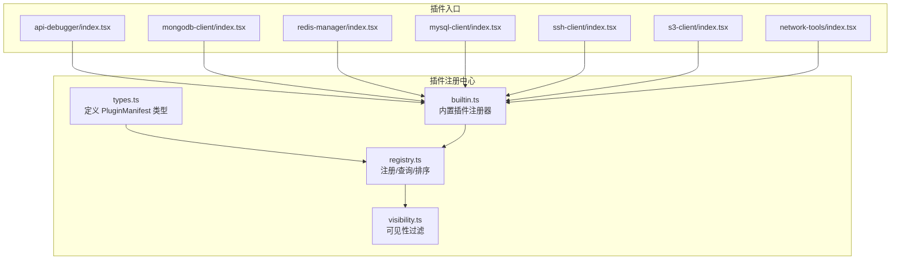
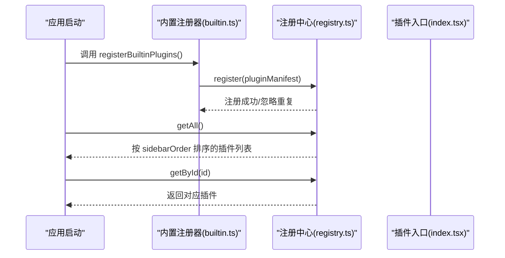
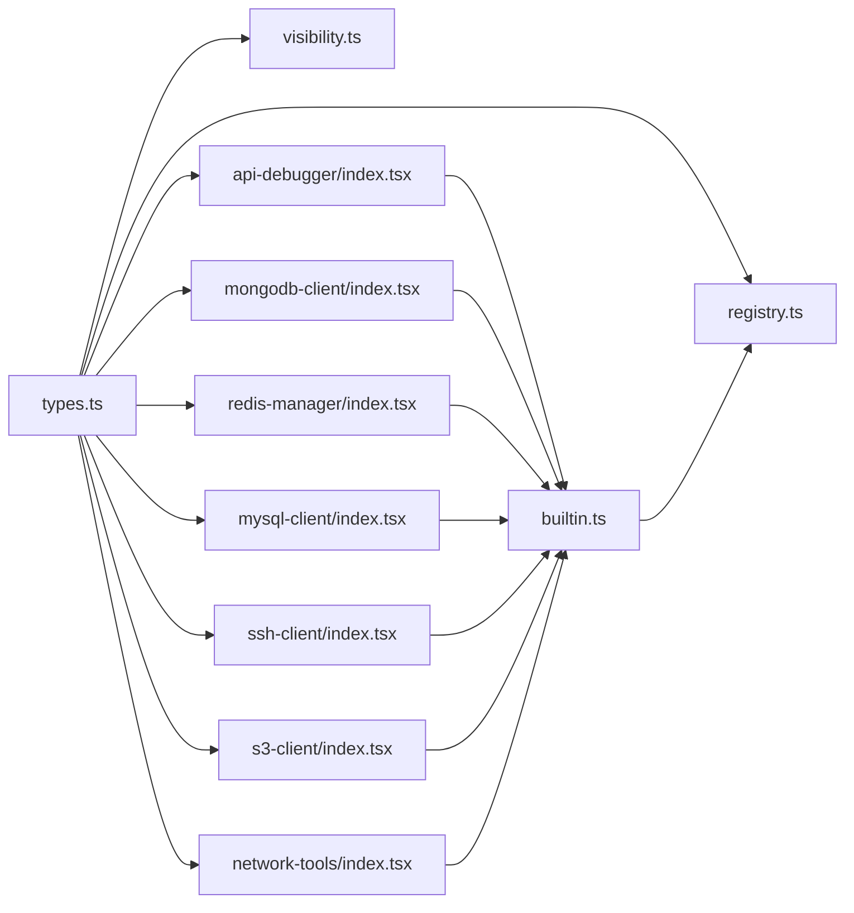

# 插件接口规范

<cite>
**本文档引用的文件**
- [src/app/plugin-registry/types.ts](file://src/app/plugin-registry/types.ts)
- [src/app/plugin-registry/registry.ts](file://src/app/plugin-registry/registry.ts)
- [src/app/plugin-registry/builtin.ts](file://src/app/plugin-registry/builtin.ts)
- [src/app/plugin-registry/visibility.ts](file://src/app/plugin-registry/visibility.ts)
- [src/plugins/api-debugger/index.tsx](file://src/plugins/api-debugger/index.tsx)
- [src/plugins/mongodb-client/index.tsx](file://src/plugins/mongodb-client/index.tsx)
- [src/plugins/redis-manager/index.tsx](file://src/plugins/redis-manager/index.tsx)
- [src/plugins/mysql-client/index.tsx](file://src/plugins/mysql-client/index.tsx)
- [src/plugins/ssh-client/index.tsx](file://src/plugins/ssh-client/index.tsx)
- [src/plugins/s3-client/index.tsx](file://src/plugins/s3-client/index.tsx)
- [src/plugins/network-tools/index.tsx](file://src/plugins/network-tools/index.tsx)
- [src/plugins/api-debugger/types.ts](file://src/plugins/api-debugger/types.ts)
- [src/plugins/redis-manager/types.ts](file://src/plugins/redis-manager/types.ts)
- [src/plugins/mongodb-client/types.ts](file://src/plugins/mongodb-client/types.ts)
- [package.json](file://package.json)
</cite>

## 目录
1. [简介](#简介)
2. [项目结构](#项目结构)
3. [核心组件](#核心组件)
4. [架构总览](#架构总览)
5. [详细组件分析](#详细组件分析)
6. [依赖关系分析](#依赖关系分析)
7. [性能考虑](#性能考虑)
8. [故障排除指南](#故障排除指南)
9. [结论](#结论)
10. [附录：规范模板与示例](#附录规范模板与示例)

## 简介
本文件系统化定义了本项目的插件接口规范，重点围绕 PluginManifest 接口的完整定义与使用约束，涵盖：
- 必需属性与可选配置项的语义与约束
- 插件入口点 index.tsx 的标准结构与导出约定
- 插件元数据组织方式与版本兼容策略
- 多实例与后端支持等扩展能力的说明
- 实现参考与规范模板，帮助开发者快速、正确地接入新插件

## 项目结构
插件系统由“注册中心 + 内置插件注册 + 可见性过滤 + 各插件入口”构成，核心文件分布如下：
- 注册中心与类型定义：src/app/plugin-registry/types.ts、registry.ts、visibility.ts
- 内置插件注册器：src/app/plugin-registry/builtin.ts
- 各插件入口：src/plugins/*/index.tsx
- 插件内部类型与状态：各插件目录下的 types.ts、store/*、views/*

图表来源
- [src/app/plugin-registry/types.ts:1-14](file://src/app/plugin-registry/types.ts#L1-L14)
- [src/app/plugin-registry/registry.ts:1-26](file://src/app/plugin-registry/registry.ts#L1-L26)
- [src/app/plugin-registry/visibility.ts:1-6](file://src/app/plugin-registry/visibility.ts#L1-L6)
- [src/app/plugin-registry/builtin.ts:1-29](file://src/app/plugin-registry/builtin.ts#L1-L29)
- [src/plugins/api-debugger/index.tsx:1-39](file://src/plugins/api-debugger/index.tsx#L1-L39)
- [src/plugins/mongodb-client/index.tsx:1-87](file://src/plugins/mongodb-client/index.tsx#L1-L87)
- [src/plugins/redis-manager/index.tsx:1-67](file://src/plugins/redis-manager/index.tsx#L1-L67)
- [src/plugins/mysql-client/index.tsx:1-38](file://src/plugins/mysql-client/index.tsx#L1-L38)
- [src/plugins/ssh-client/index.tsx:1-66](file://src/plugins/ssh-client/index.tsx#L1-L66)
- [src/plugins/s3-client/index.tsx:1-68](file://src/plugins/s3-client/index.tsx#L1-L68)
- [src/plugins/network-tools/index.tsx:1-27](file://src/plugins/network-tools/index.tsx#L1-L27)

章节来源
- [src/app/plugin-registry/types.ts:1-14](file://src/app/plugin-registry/types.ts#L1-L14)
- [src/app/plugin-registry/registry.ts:1-26](file://src/app/plugin-registry/registry.ts#L1-L26)
- [src/app/plugin-registry/builtin.ts:1-29](file://src/app/plugin-registry/builtin.ts#L1-L29)
- [src/app/plugin-registry/visibility.ts:1-6](file://src/app/plugin-registry/visibility.ts#L1-L6)

## 核心组件
本节聚焦 PluginManifest 接口的定义与约束，以及注册中心对插件的管理行为。

- PluginManifest 接口字段
  - id: 字符串，插件唯一标识，用于注册表键名与路由定位
  - name: 字符串，插件在侧边栏显示的名称
  - icon: ReactNode，Ant Design 图标组件实例，用于侧边栏图标展示
  - version: 字符串，插件版本号，遵循语义化版本或预发布标记
  - component: 函数式组件，作为插件根组件，负责渲染插件工作区
  - sidebarOrder: 数值，决定插件在侧边栏中的排序权重（升序）
  - showInSidebar?: 布尔值，控制插件是否显示在侧边栏；未设置时默认显示

- 注册中心行为
  - 注册：按 id 去重，重复 id 将被忽略
  - 查询：按 id 获取单个插件
  - 列表：返回已注册插件数组，并按 sidebarOrder 升序排列
  - 清空：清空注册表

- 可见性过滤
  - 默认仅显示 showInSidebar 非 false 的插件

章节来源
- [src/app/plugin-registry/types.ts:5-13](file://src/app/plugin-registry/types.ts#L5-L13)
- [src/app/plugin-registry/registry.ts:5-25](file://src/app/plugin-registry/registry.ts#L5-L25)
- [src/app/plugin-registry/visibility.ts:3-5](file://src/app/plugin-registry/visibility.ts#L3-L5)

## 架构总览
下图展示了从内置注册器到插件入口再到注册中心的整体流程：

图表来源
- [src/app/plugin-registry/builtin.ts:13-27](file://src/app/plugin-registry/builtin.ts#L13-L27)
- [src/app/plugin-registry/registry.ts:13-21](file://src/app/plugin-registry/registry.ts#L13-L21)

## 详细组件分析

### PluginManifest 接口详解
- id
  - 作用：唯一标识插件，用于注册表索引与路由匹配
  - 约束：必须为非空字符串；注册时以 id 为键去重
  - 示例路径：各插件入口中均以字符串字面量形式赋值
    - [src/plugins/api-debugger/index.tsx:38](file://src/plugins/api-debugger/index.tsx#L38)
    - [src/plugins/mongodb-client/index.tsx:79-86](file://src/plugins/mongodb-client/index.tsx#L79-L86)
    - [src/plugins/redis-manager/index.tsx:59-66](file://src/plugins/redis-manager/index.tsx#L59-L66)
    - [src/plugins/mysql-client/index.tsx:37](file://src/plugins/mysql-client/index.tsx#L37)
    - [src/plugins/ssh-client/index.tsx:58-65](file://src/plugins/ssh-client/index.tsx#L58-L65)
    - [src/plugins/s3-client/index.tsx:60-67](file://src/plugins/s3-client/index.tsx#L60-L67)
    - [src/plugins/network-tools/index.tsx:26](file://src/plugins/network-tools/index.tsx#L26)

- name
  - 作用：侧边栏显示名称
  - 约束：非空字符串
  - 示例路径：各插件入口中均以字符串字面量赋值
    - [src/plugins/api-debugger/index.tsx:38](file://src/plugins/api-debugger/index.tsx#L38)
    - [src/plugins/mongodb-client/index.tsx:79-86](file://src/plugins/mongodb-client/index.tsx#L79-L86)
    - [src/plugins/redis-manager/index.tsx:59-66](file://src/plugins/redis-manager/index.tsx#L59-L66)
    - [src/plugins/mysql-client/index.tsx:37](file://src/plugins/mysql-client/index.tsx#L37)
    - [src/plugins/ssh-client/index.tsx:58-65](file://src/plugins/ssh-client/index.tsx#L58-L65)
    - [src/plugins/s3-client/index.tsx:60-67](file://src/plugins/s3-client/index.tsx#L60-L67)
    - [src/plugins/network-tools/index.tsx:26](file://src/plugins/network-tools/index.tsx#L26)

- icon
  - 作用：侧边栏图标
  - 约束：ReactNode，通常为 Ant Design 图标组件实例
  - 示例路径：各插件入口中均以 Ant Design 图标组件赋值
    - [src/plugins/api-debugger/index.tsx:38](file://src/plugins/api-debugger/index.tsx#L38)
    - [src/plugins/mongodb-client/index.tsx:79-86](file://src/plugins/mongodb-client/index.tsx#L79-L86)
    - [src/plugins/redis-manager/index.tsx:59-66](file://src/plugins/redis-manager/index.tsx#L59-L66)
    - [src/plugins/mysql-client/index.tsx:37](file://src/plugins/mysql-client/index.tsx#L37)
    - [src/plugins/ssh-client/index.tsx:58-65](file://src/plugins/ssh-client/index.tsx#L58-L65)
    - [src/plugins/s3-client/index.tsx:60-67](file://src/plugins/s3-client/index.tsx#L60-L67)
    - [src/plugins/network-tools/index.tsx:26](file://src/plugins/network-tools/index.tsx#L26)

- version
  - 作用：插件版本号，便于追踪与兼容性管理
  - 约束：字符串格式，建议遵循语义化版本或包含预发布标记
  - 示例路径：各插件入口中均以字符串字面量赋值
    - [src/plugins/api-debugger/index.tsx:38](file://src/plugins/api-debugger/index.tsx#L38)
    - [src/plugins/mongodb-client/index.tsx:79-86](file://src/plugins/mongodb-client/index.tsx#L79-L86)
    - [src/plugins/redis-manager/index.tsx:59-66](file://src/plugins/redis-manager/index.tsx#L59-L66)
    - [src/plugins/mysql-client/index.tsx:37](file://src/plugins/mysql-client/index.tsx#L37)
    - [src/plugins/ssh-client/index.tsx:58-65](file://src/plugins/ssh-client/index.tsx#L58-L65)
    - [src/plugins/s3-client/index.tsx:60-67](file://src/plugins/s3-client/index.tsx#L60-L67)
    - [src/plugins/network-tools/index.tsx:26](file://src/plugins/network-tools/index.tsx#L26)

- component
  - 作用：插件根组件，负责渲染插件工作区
  - 约束：函数式组件，返回 ReactNode；通常内部包含标签页切换与子视图
  - 示例路径：各插件入口均导出名为 pluginName + "Plugin" 的常量，值为 PluginManifest
    - [src/plugins/api-debugger/index.tsx:38](file://src/plugins/api-debugger/index.tsx#L38)
    - [src/plugins/mongodb-client/index.tsx:79-86](file://src/plugins/mongodb-client/index.tsx#L79-L86)
    - [src/plugins/redis-manager/index.tsx:59-66](file://src/plugins/redis-manager/index.tsx#L59-L66)
    - [src/plugins/mysql-client/index.tsx:37](file://src/plugins/mysql-client/index.tsx#L37)
    - [src/plugins/ssh-client/index.tsx:58-65](file://src/plugins/ssh-client/index.tsx#L58-L65)
    - [src/plugins/s3-client/index.tsx:60-67](file://src/plugins/s3-client/index.tsx#L60-L67)
    - [src/plugins/network-tools/index.tsx:26](file://src/plugins/network-tools/index.tsx#L26)

- sidebarOrder
  - 作用：侧边栏排序权重，数值越小越靠前
  - 约束：数值类型；注册中心按升序排序
  - 示例路径：各插件入口中均以整数赋值
    - [src/plugins/api-debugger/index.tsx:38](file://src/plugins/api-debugger/index.tsx#L38)
    - [src/plugins/mongodb-client/index.tsx:79-86](file://src/plugins/mongodb-client/index.tsx#L79-L86)
    - [src/plugins/redis-manager/index.tsx:59-66](file://src/plugins/redis-manager/index.tsx#L59-L66)
    - [src/plugins/mysql-client/index.tsx:37](file://src/plugins/mysql-client/index.tsx#L37)
    - [src/plugins/ssh-client/index.tsx:58-65](file://src/plugins/ssh-client/index.tsx#L58-L65)
    - [src/plugins/s3-client/index.tsx:60-67](file://src/plugins/s3-client/index.tsx#L60-L67)
    - [src/plugins/network-tools/index.tsx:26](file://src/plugins/network-tools/index.tsx#L26)

- showInSidebar
  - 作用：控制插件是否显示在侧边栏
  - 约束：布尔值；未设置时默认显示
  - 示例路径：注册中心可见性过滤逻辑
    - [src/app/plugin-registry/visibility.ts:3-5](file://src/app/plugin-registry/visibility.ts#L3-L5)

### 插件入口点 index.tsx 规范
- 结构要求
  - 导出一个常量，命名形如 pluginName + "Plugin"，值为 PluginManifest
  - 组件导出：component 字段指向一个函数式组件，该组件负责渲染插件工作区
  - 默认导出：不强制要求，默认导出与插件注册无关
  - 命名约定：统一使用插件目录名 + "Plugin" 的常量名

- 典型实现模式
  - 定义插件根组件，内部通过状态管理选择不同视图
  - 使用 Ant Design 的 Segmented 等组件组织标签页
  - 通过 store 或 hooks 访问插件内部状态

- 示例路径
  - [src/plugins/api-debugger/index.tsx:13-38](file://src/plugins/api-debugger/index.tsx#L13-L38)
  - [src/plugins/mongodb-client/index.tsx:14-77](file://src/plugins/mongodb-client/index.tsx#L14-L77)
  - [src/plugins/redis-manager/index.tsx:14-57](file://src/plugins/redis-manager/index.tsx#L14-L57)
  - [src/plugins/mysql-client/index.tsx:14-35](file://src/plugins/mysql-client/index.tsx#L14-L35)
  - [src/plugins/ssh-client/index.tsx:12-56](file://src/plugins/ssh-client/index.tsx#L12-L56)
  - [src/plugins/s3-client/index.tsx:10-58](file://src/plugins/s3-client/index.tsx#L10-L58)
  - [src/plugins/network-tools/index.tsx:9-24](file://src/plugins/network-tools/index.tsx#L9-L24)

### 插件配置选项与扩展能力
- 多实例支持
  - 当前注册机制基于 id 去重，未提供同一插件多实例注册的内置支持
  - 若需多实例，请在业务层自行扩展注册表或采用其他隔离策略

- 后端支持
  - 插件入口未直接声明后端依赖；是否需要后端支持由插件内部实现决定
  - 建议在插件 manifest 中增加可选字段以声明后端需求（例如：backendRequired?: boolean）

- 版本兼容性管理
  - version 字段用于版本跟踪；建议遵循语义化版本
  - 可通过版本号在运行时进行功能降级或提示

章节来源
- [src/app/plugin-registry/types.ts:5-13](file://src/app/plugin-registry/types.ts#L5-L13)
- [src/app/plugin-registry/registry.ts:5-25](file://src/app/plugin-registry/registry.ts#L5-L25)
- [src/app/plugin-registry/visibility.ts:3-5](file://src/app/plugin-registry/visibility.ts#L3-L5)
- [src/plugins/api-debugger/index.tsx:13-38](file://src/plugins/api-debugger/index.tsx#L13-L38)
- [src/plugins/mongodb-client/index.tsx:14-77](file://src/plugins/mongodb-client/index.tsx#L14-L77)
- [src/plugins/redis-manager/index.tsx:14-57](file://src/plugins/redis-manager/index.tsx#L14-L57)
- [src/plugins/mysql-client/index.tsx:14-35](file://src/plugins/mysql-client/index.tsx#L14-L35)
- [src/plugins/ssh-client/index.tsx:12-56](file://src/plugins/ssh-client/index.tsx#L12-L56)
- [src/plugins/s3-client/index.tsx:10-58](file://src/plugins/s3-client/index.tsx#L10-L58)
- [src/plugins/network-tools/index.tsx:9-24](file://src/plugins/network-tools/index.tsx#L9-L24)

## 依赖关系分析
- 插件入口依赖
  - 插件入口依赖于注册中心类型定义（PluginManifest）
  - 插件入口依赖于自身 views、store、types 等模块
- 注册中心依赖
  - 注册中心依赖于类型定义
  - 内置注册器依赖于各插件入口导出的 PluginManifest 常量
- 可见性过滤
  - 依赖于 PluginManifest 的 showInSidebar 字段

图表来源
- [src/app/plugin-registry/types.ts:1-14](file://src/app/plugin-registry/types.ts#L1-L14)
- [src/app/plugin-registry/registry.ts:1-26](file://src/app/plugin-registry/registry.ts#L1-L26)
- [src/app/plugin-registry/builtin.ts:1-29](file://src/app/plugin-registry/builtin.ts#L1-L29)
- [src/app/plugin-registry/visibility.ts:1-6](file://src/app/plugin-registry/visibility.ts#L1-L6)
- [src/plugins/api-debugger/index.tsx:1-39](file://src/plugins/api-debugger/index.tsx#L1-L39)
- [src/plugins/mongodb-client/index.tsx:1-87](file://src/plugins/mongodb-client/index.tsx#L1-L87)
- [src/plugins/redis-manager/index.tsx:1-67](file://src/plugins/redis-manager/index.tsx#L1-L67)
- [src/plugins/mysql-client/index.tsx:1-38](file://src/plugins/mysql-client/index.tsx#L1-L38)
- [src/plugins/ssh-client/index.tsx:1-66](file://src/plugins/ssh-client/index.tsx#L1-L66)
- [src/plugins/s3-client/index.tsx:1-68](file://src/plugins/s3-client/index.tsx#L1-L68)
- [src/plugins/network-tools/index.tsx:1-27](file://src/plugins/network-tools/index.tsx#L1-L27)

章节来源
- [src/app/plugin-registry/types.ts:1-14](file://src/app/plugin-registry/types.ts#L1-L14)
- [src/app/plugin-registry/registry.ts:1-26](file://src/app/plugin-registry/registry.ts#L1-L26)
- [src/app/plugin-registry/builtin.ts:1-29](file://src/app/plugin-registry/builtin.ts#L1-L29)
- [src/app/plugin-registry/visibility.ts:1-6](file://src/app/plugin-registry/visibility.ts#L1-L6)

## 性能考虑
- 注册表为 Map 结构，注册与查询均为 O(1)，适合高频访问
- getAll() 对插件数组进行排序，时间复杂度为 O(n log n)，n 为插件数量
- 建议控制插件数量与排序计算频率，避免在渲染热路径频繁调用 getAll()

## 故障排除指南
- 插件未显示在侧边栏
  - 检查 showInSidebar 是否被显式设为 false
  - 参考：[src/app/plugin-registry/visibility.ts:3-5](file://src/app/plugin-registry/visibility.ts#L3-L5)

- 插件未生效或重复
  - 检查 id 是否与其他插件重复
  - 注册中心会忽略重复 id
  - 参考：[src/app/plugin-registry/registry.ts:5-11](file://src/app/plugin-registry/registry.ts#L5-L11)

- 侧边栏顺序异常
  - 检查 sidebarOrder 数值是否合理
  - 注册中心按升序排序
  - 参考：[src/app/plugin-registry/registry.ts:13-17](file://src/app/plugin-registry/registry.ts#L13-L17)

- 插件图标不显示
  - 确保 icon 为有效的 Ant Design 图标组件实例
  - 参考：各插件入口的 icon 赋值处
    - [src/plugins/api-debugger/index.tsx:38](file://src/plugins/api-debugger/index.tsx#L38)
    - [src/plugins/mongodb-client/index.tsx:79-86](file://src/plugins/mongodb-client/index.tsx#L79-L86)
    - [src/plugins/redis-manager/index.tsx:59-66](file://src/plugins/redis-manager/index.tsx#L59-L66)
    - [src/plugins/mysql-client/index.tsx:37](file://src/plugins/mysql-client/index.tsx#L37)
    - [src/plugins/ssh-client/index.tsx:58-65](file://src/plugins/ssh-client/index.tsx#L58-L65)
    - [src/plugins/s3-client/index.tsx:60-67](file://src/plugins/s3-client/index.tsx#L60-L67)
    - [src/plugins/network-tools/index.tsx:26](file://src/plugins/network-tools/index.tsx#L26)

章节来源
- [src/app/plugin-registry/visibility.ts:3-5](file://src/app/plugin-registry/visibility.ts#L3-L5)
- [src/app/plugin-registry/registry.ts:5-11](file://src/app/plugin-registry/registry.ts#L5-L11)
- [src/app/plugin-registry/registry.ts:13-17](file://src/app/plugin-registry/registry.ts#L13-L17)
- [src/plugins/api-debugger/index.tsx:38](file://src/plugins/api-debugger/index.tsx#L38)
- [src/plugins/mongodb-client/index.tsx:79-86](file://src/plugins/mongodb-client/index.tsx#L79-L86)
- [src/plugins/redis-manager/index.tsx:59-66](file://src/plugins/redis-manager/index.tsx#L59-L66)
- [src/plugins/mysql-client/index.tsx:37](file://src/plugins/mysql-client/index.tsx#L37)
- [src/plugins/ssh-client/index.tsx:58-65](file://src/plugins/ssh-client/index.tsx#L58-L65)
- [src/plugins/s3-client/index.tsx:60-67](file://src/plugins/s3-client/index.tsx#L60-L67)
- [src/plugins/network-tools/index.tsx:26](file://src/plugins/network-tools/index.tsx#L26)

## 结论
本规范明确了 PluginManifest 的字段语义与约束，给出了插件入口的实现约定与最佳实践，并梳理了注册中心与可见性过滤的工作机制。遵循本文档可确保插件在侧边栏正确显示、有序排列且易于维护。

## 附录：规范模板与示例

### 规范模板
- 插件入口文件（index.tsx）模板要点
  - 导出常量：pluginName + "Plugin"，值为 PluginManifest
  - 组件：函数式组件，返回 ReactNode
  - 字段：id、name、icon、version、component、sidebarOrder
  - 可选：showInSidebar

- 插件类型定义（types.ts）模板要点
  - 插件内部数据模型与状态类型
  - Store 类型与 Tab 类型
  - 常量与枚举

- 版本号建议
  - 采用语义化版本，如 "1.2.3" 或带预发布的 "1.2.3-alpha"

章节来源
- [src/app/plugin-registry/types.ts:5-13](file://src/app/plugin-registry/types.ts#L5-L13)
- [src/plugins/api-debugger/index.tsx:38](file://src/plugins/api-debugger/index.tsx#L38)
- [src/plugins/mongodb-client/index.tsx:79-86](file://src/plugins/mongodb-client/index.tsx#L79-L86)
- [src/plugins/redis-manager/index.tsx:59-66](file://src/plugins/redis-manager/index.tsx#L59-L66)
- [src/plugins/mysql-client/index.tsx:37](file://src/plugins/mysql-client/index.tsx#L37)
- [src/plugins/ssh-client/index.tsx:58-65](file://src/plugins/ssh-client/index.tsx#L58-L65)
- [src/plugins/s3-client/index.tsx:60-67](file://src/plugins/s3-client/index.tsx#L60-L67)
- [src/plugins/network-tools/index.tsx:26](file://src/plugins/network-tools/index.tsx#L26)
- [src/plugins/api-debugger/types.ts:1-105](file://src/plugins/api-debugger/types.ts#L1-L105)
- [src/plugins/redis-manager/types.ts:1-91](file://src/plugins/redis-manager/types.ts#L1-L91)
- [src/plugins/mongodb-client/types.ts:1-95](file://src/plugins/mongodb-client/types.ts#L1-L95)
- [package.json:4](file://package.json#L4)