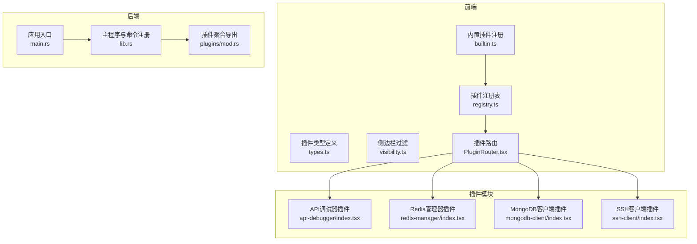
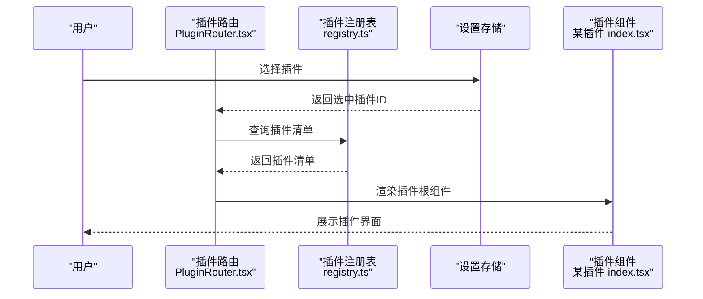
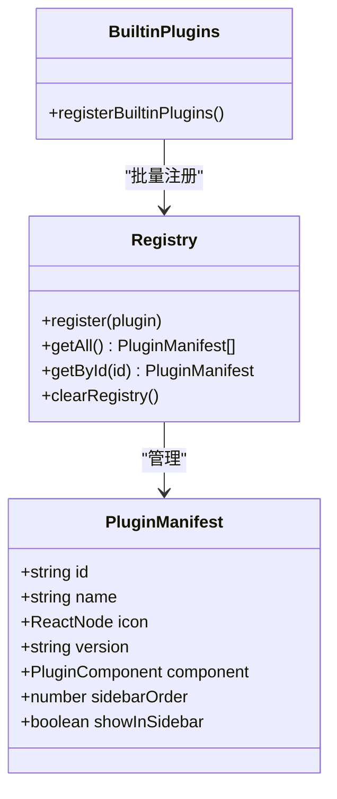
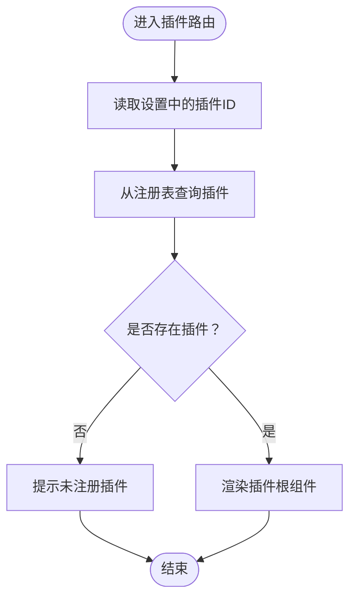
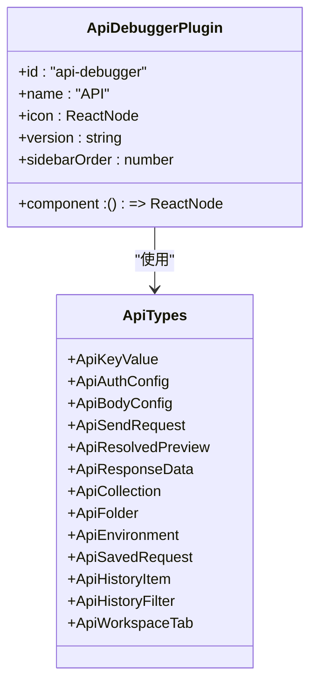
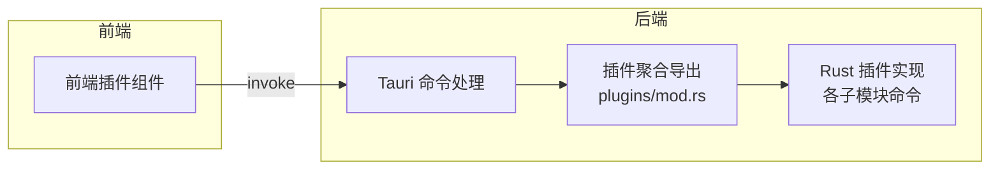
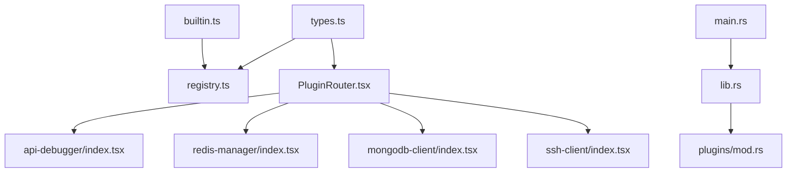

# 插件架构设计

<cite>
**本文档引用的文件**
- [registry.ts](file://src/app/plugin-registry/registry.ts)
- [types.ts](file://src/app/plugin-registry/types.ts)
- [builtin.ts](file://src/app/plugin-registry/builtin.ts)
- [visibility.ts](file://src/app/plugin-registry/visibility.ts)
- [PluginRouter.tsx](file://src/app/plugin-registry/PluginRouter.tsx)
- [index.tsx（API调试器）](file://src/plugins/api-debugger/index.tsx)
- [index.tsx（Redis 管理器）](file://src/plugins/redis-manager/index.tsx)
- [index.tsx（MongoDB 客户端）](file://src/plugins/mongodb-client/index.tsx)
- [index.tsx（SSH 客户端）](file://src/plugins/ssh-client/index.tsx)
- [types.ts（API 调试器）](file://src/plugins/api-debugger/types.ts)
- [types.ts（Redis 管理器）](file://src/plugins/redis-manager/types.ts)
- [types.ts（MongoDB 客户端）](file://src/plugins/mongodb-client/types.ts)
- [types.ts（SSH 客户端）](file://src/plugins/ssh-client/types.ts)
- [mod.rs（插件聚合）](file://src-tauri/src/plugins/mod.rs)
- [lib.rs（主入口与命令注册）](file://src-tauri/src/lib.rs)
- [main.rs（应用入口）](file://src-tauri/src/main.rs)
</cite>

## 目录
1. [引言](#引言)
2. [项目结构](#项目结构)
3. [核心组件](#核心组件)
4. [架构总览](#架构总览)
5. [详细组件分析](#详细组件分析)
6. [依赖关系分析](#依赖关系分析)
7. [性能考量](#性能考量)
8. [故障排查指南](#故障排查指南)
9. [结论](#结论)
10. [附录](#附录)

## 引言
本文件系统性阐述 DevNexus 的插件化架构设计，围绕模块化设计、职责分离与可扩展性展开；重点解释前端插件注册表、插件清单与路由机制，以及后端通过 Tauri 命令桥接各插件能力的实现方式。文档同时覆盖插件生命周期管理、插件间隔离与统一接口规范、通信与数据共享策略、性能与内存管理考量，并给出架构决策的技术背景与设计权衡。

## 项目结构
DevNexus 采用“前端插件注册表 + 各插件模块 + 后端命令桥接”的分层结构：
- 前端层：插件注册表负责收集与排序插件清单；插件清单定义插件元信息与渲染组件；插件路由根据用户选择动态渲染对应插件视图。
- 插件层：每个插件自包含组件、状态与类型定义，暴露统一的插件清单对象。
- 后端层：Tauri 主进程集中注册各插件的命令处理函数，提供跨语言调用能力。

图表来源
- [registry.ts:1-26](file://src/app/plugin-registry/registry.ts#L1-L26)
- [types.ts:1-14](file://src/app/plugin-registry/types.ts#L1-L14)
- [builtin.ts:1-29](file://src/app/plugin-registry/builtin.ts#L1-L29)
- [visibility.ts:1-6](file://src/app/plugin-registry/visibility.ts#L1-L6)
- [PluginRouter.tsx:1-29](file://src/app/plugin-registry/PluginRouter.tsx#L1-L29)
- [index.tsx（API调试器）:1-39](file://src/plugins/api-debugger/index.tsx#L1-L39)
- [index.tsx（Redis 管理器）:1-67](file://src/plugins/redis-manager/index.tsx#L1-L67)
- [index.tsx（MongoDB 客户端）:1-87](file://src/plugins/mongodb-client/index.tsx#L1-L87)
- [index.tsx（SSH 客户端）:1-66](file://src/plugins/ssh-client/index.tsx#L1-L66)
- [main.rs:1-7](file://src-tauri/src/main.rs#L1-L7)
- [lib.rs:1-250](file://src-tauri/src/lib.rs#L1-L250)
- [mod.rs（插件聚合）:1-10](file://src-tauri/src/plugins/mod.rs#L1-L10)

章节来源
- [registry.ts:1-26](file://src/app/plugin-registry/registry.ts#L1-L26)
- [types.ts:1-14](file://src/app/plugin-registry/types.ts#L1-L14)
- [builtin.ts:1-29](file://src/app/plugin-registry/builtin.ts#L1-L29)
- [visibility.ts:1-6](file://src/app/plugin-registry/visibility.ts#L1-L6)
- [PluginRouter.tsx:1-29](file://src/app/plugin-registry/PluginRouter.tsx#L1-L29)
- [index.tsx（API调试器）:1-39](file://src/plugins/api-debugger/index.tsx#L1-L39)
- [index.tsx（Redis 管理器）:1-67](file://src/plugins/redis-manager/index.tsx#L1-L67)
- [index.tsx（MongoDB 客户端）:1-87](file://src/plugins/mongodb-client/index.tsx#L1-L87)
- [index.tsx（SSH 客户端）:1-66](file://src/plugins/ssh-client/index.tsx#L1-L66)
- [main.rs:1-7](file://src-tauri/src/main.rs#L1-L7)
- [lib.rs:1-250](file://src-tauri/src/lib.rs#L1-L250)
- [mod.rs（插件聚合）:1-10](file://src-tauri/src/plugins/mod.rs#L1-L10)

## 核心组件
- 插件清单（PluginManifest）
  - 字段：id、name、icon、version、component、sidebarOrder、showInSidebar
  - 作用：统一描述插件元信息与渲染入口，便于注册表管理与侧边栏展示控制
- 插件注册表（Registry）
  - 提供 register、getAll、getById、clearRegistry 等方法，维护插件清单的内存映射
  - 按 sidebarOrder 排序输出，确保侧边栏顺序稳定
- 内置插件注册（registerBuiltinPlugins）
  - 首次调用时批量注册所有内置插件，避免重复注册
- 侧边栏过滤（getSidebarPlugins）
  - 基于 showInSidebar 控制是否在侧边栏显示
- 插件路由（PluginRouter）
  - 从设置中读取当前选中的插件 id，若未找到则回退到第一个可用插件
  - 渲染对应插件的根组件

章节来源
- [types.ts:1-14](file://src/app/plugin-registry/types.ts#L1-L14)
- [registry.ts:1-26](file://src/app/plugin-registry/registry.ts#L1-L26)
- [builtin.ts:1-29](file://src/app/plugin-registry/builtin.ts#L1-L29)
- [visibility.ts:1-6](file://src/app/plugin-registry/visibility.ts#L1-L6)
- [PluginRouter.tsx:1-29](file://src/app/plugin-registry/PluginRouter.tsx#L1-L29)

## 架构总览
DevNexus 的插件架构遵循“前端声明式清单 + 后端命令桥接”的双层设计：
- 前端：以插件清单为契约，通过注册表集中管理，路由按需渲染，实现松耦合与可扩展
- 后端：Tauri 在主进程中集中注册各插件命令，前端通过 invoke 调用，实现跨语言能力

图表来源
- [PluginRouter.tsx:1-29](file://src/app/plugin-registry/PluginRouter.tsx#L1-L29)
- [registry.ts:1-26](file://src/app/plugin-registry/registry.ts#L1-L26)
- [index.tsx（API调试器）:1-39](file://src/plugins/api-debugger/index.tsx#L1-L39)
- [index.tsx（Redis 管理器）:1-67](file://src/plugins/redis-manager/index.tsx#L1-L67)
- [index.tsx（MongoDB 客户端）:1-87](file://src/plugins/mongodb-client/index.tsx#L1-L87)
- [index.tsx（SSH 客户端）:1-66](file://src/plugins/ssh-client/index.tsx#L1-L66)

## 详细组件分析

### 插件清单与注册表
- 设计要点
  - 使用 Map 存储插件清单，键为插件 id，值为 PluginManifest
  - 注册时去重，避免重复注册导致的副作用
  - 提供排序与筛选能力，保证侧边栏展示一致性
- 生命周期
  - 初始化阶段：registerBuiltinPlugins 批量注册内置插件
  - 运行阶段：根据用户选择或默认回退策略渲染对应插件
  - 清理阶段：clearRegistry 可清空注册表，便于测试或重新加载

图表来源
- [types.ts:1-14](file://src/app/plugin-registry/types.ts#L1-L14)
- [registry.ts:1-26](file://src/app/plugin-registry/registry.ts#L1-L26)
- [builtin.ts:1-29](file://src/app/plugin-registry/builtin.ts#L1-L29)

章节来源
- [types.ts:1-14](file://src/app/plugin-registry/types.ts#L1-L14)
- [registry.ts:1-26](file://src/app/plugin-registry/registry.ts#L1-L26)
- [builtin.ts:1-29](file://src/app/plugin-registry/builtin.ts#L1-L29)

### 插件路由与渲染
- 设计要点
  - 通过设置存储读取当前选中插件 id，若不存在则回退到第一个插件
  - 渲染时直接调用插件清单中的 component 函数式组件
- 错误处理
  - 若无任何插件注册，提示用户先注册至少一个插件

图表来源
- [PluginRouter.tsx:1-29](file://src/app/plugin-registry/PluginRouter.tsx#L1-L29)
- [registry.ts:1-26](file://src/app/plugin-registry/registry.ts#L1-L26)

章节来源
- [PluginRouter.tsx:1-29](file://src/app/plugin-registry/PluginRouter.tsx#L1-L29)

### 典型插件实现（以 API 调试器为例）
- 设计要点
  - 插件根组件使用本地状态与外部 store 协作，按标签页切换不同视图
  - 插件清单包含 id、name、icon、version、sidebarOrder、component 等字段
- 数据模型
  - 插件内部定义丰富的类型（如请求、响应、环境、历史等），用于支撑功能实现

图表来源
- [index.tsx（API调试器）:1-39](file://src/plugins/api-debugger/index.tsx#L1-L39)
- [types.ts（API 调试器）:1-105](file://src/plugins/api-debugger/types.ts#L1-L105)

章节来源
- [index.tsx（API调试器）:1-39](file://src/plugins/api-debugger/index.tsx#L1-L39)
- [types.ts（API 调试器）:1-105](file://src/plugins/api-debugger/types.ts#L1-L105)

### 典型插件实现（以 Redis 管理器为例）
- 设计要点
  - 插件根组件通过工作区 store 切换连接、键浏览、控制台、服务器信息等视图
  - 插件清单包含 id、name、icon、version、sidebarOrder、component 等字段
- 数据模型
  - 插件内部定义连接、键元信息、扫描结果、慢查询日志、服务器信息、导入导出结果等类型

章节来源
- [index.tsx（Redis 管理器）:1-67](file://src/plugins/redis-manager/index.tsx#L1-L67)
- [types.ts（Redis 管理器）:1-91](file://src/plugins/redis-manager/types.ts#L1-L91)

### 典型插件实现（以 MongoDB 客户端为例）
- 设计要点
  - 插件根组件通过工作区 store 切换连接、数据库、文档、查询、索引、导入导出、服务器状态等视图
  - 插件清单包含 id、name、icon、version、sidebarOrder、component 等字段
- 数据模型
  - 插件内部定义连接表单、连接信息、延迟、数据库与集合信息、文档分页、索引信息、查询历史、导入导出结果、服务器状态等类型

章节来源
- [index.tsx（MongoDB 客户端）:1-87](file://src/plugins/mongodb-client/index.tsx#L1-L87)
- [types.ts（MongoDB 客户端）:1-95](file://src/plugins/mongodb-client/types.ts#L1-L95)

### 典型插件实现（以 SSH 客户端为例）
- 设计要点
  - 插件根组件通过工作区 store 切换连接列表、终端、密钥管理、隧道管理等视图
  - 插件清单包含 id、name、icon、version、sidebarOrder、component 等字段
- 数据模型
  - 插件内部定义连接表单、连接信息、会话元信息、快速命令、密钥信息、生成密钥对、隧道规则与表单等类型

章节来源
- [index.tsx（SSH 客户端）:1-66](file://src/plugins/ssh-client/index.tsx#L1-L66)
- [types.ts（SSH 客户端）:1-115](file://src/plugins/ssh-client/types.ts#L1-L115)

### 后端命令桥接与插件能力
- 设计要点
  - Tauri 主进程集中注册各插件命令处理函数，前端通过 invoke 调用
  - 插件聚合导出统一管理各子插件模块
- 能力范围
  - 包括但不限于：Redis、SSH、S3、MongoDB、MySQL、消息队列、网络工具、局域聊天、API 调试等

图表来源
- [lib.rs（主程序与命令注册）:1-250](file://src-tauri/src/lib.rs#L1-L250)
- [mod.rs（插件聚合）:1-10](file://src-tauri/src/plugins/mod.rs#L1-L10)

章节来源
- [lib.rs（主程序与命令注册）:1-250](file://src-tauri/src/lib.rs#L1-L250)
- [mod.rs（插件聚合）:1-10](file://src-tauri/src/plugins/mod.rs#L1-L10)

## 依赖关系分析
- 前端依赖
  - 插件注册表依赖插件类型定义
  - 内置插件注册依赖各插件清单导出
  - 插件路由依赖设置存储与注册表
- 后端依赖
  - 主入口依赖主程序库
  - 主程序库集中注册各插件命令，依赖插件聚合导出

图表来源
- [types.ts:1-14](file://src/app/plugin-registry/types.ts#L1-L14)
- [registry.ts:1-26](file://src/app/plugin-registry/registry.ts#L1-L26)
- [builtin.ts:1-29](file://src/app/plugin-registry/builtin.ts#L1-L29)
- [PluginRouter.tsx:1-29](file://src/app/plugin-registry/PluginRouter.tsx#L1-L29)
- [index.tsx（API调试器）:1-39](file://src/plugins/api-debugger/index.tsx#L1-L39)
- [index.tsx（Redis 管理器）:1-67](file://src/plugins/redis-manager/index.tsx#L1-L67)
- [index.tsx（MongoDB 客户端）:1-87](file://src/plugins/mongodb-client/index.tsx#L1-L87)
- [index.tsx（SSH 客户端）:1-66](file://src/plugins/ssh-client/index.tsx#L1-L66)
- [main.rs:1-7](file://src-tauri/src/main.rs#L1-L7)
- [lib.rs:1-250](file://src-tauri/src/lib.rs#L1-L250)
- [mod.rs（插件聚合）:1-10](file://src-tauri/src/plugins/mod.rs#L1-L10)

章节来源
- [types.ts:1-14](file://src/app/plugin-registry/types.ts#L1-L14)
- [registry.ts:1-26](file://src/app/plugin-registry/registry.ts#L1-L26)
- [builtin.ts:1-29](file://src/app/plugin-registry/builtin.ts#L1-L29)
- [PluginRouter.tsx:1-29](file://src/app/plugin-registry/PluginRouter.tsx#L1-L29)
- [index.tsx（API调试器）:1-39](file://src/plugins/api-debugger/index.tsx#L1-L39)
- [index.tsx（Redis 管理器）:1-67](file://src/plugins/redis-manager/index.tsx#L1-L67)
- [index.tsx（MongoDB 客户端）:1-87](file://src/plugins/mongodb-client/index.tsx#L1-L87)
- [index.tsx（SSH 客户端）:1-66](file://src/plugins/ssh-client/index.tsx#L1-L66)
- [main.rs:1-7](file://src-tauri/src/main.rs#L1-L7)
- [lib.rs:1-250](file://src-tauri/src/lib.rs#L1-L250)
- [mod.rs（插件聚合）:1-10](file://src-tauri/src/plugins/mod.rs#L1-L10)

## 性能考量
- 前端渲染与状态管理
  - 插件根组件通过局部状态与外部 store 协作，减少全局状态污染
  - 使用 useMemo 优化视图切换，避免不必要的重渲染
- 注册表与路由
  - 注册表使用 Map 结构，查找与插入均为近似 O(1)，排序开销与插件数量线性相关
  - 路由按需渲染，未选中的插件不参与渲染，降低内存占用
- 后端命令调用
  - Tauri invoke 为跨语言调用，建议避免高频细粒度调用，合并批量操作
  - 对于 IO 密集型任务（如数据库查询、文件传输），应采用异步处理与进度反馈
- 内存管理
  - 插件卸载时应清理定时器、事件监听与缓存
  - 大对象（如图片、二进制数据）应及时释放引用，避免内存泄漏

## 故障排查指南
- 插件未显示在侧边栏
  - 检查插件清单中的 showInSidebar 是否被显式设为 false
  - 使用侧边栏过滤函数确认返回值
- 插件路由为空白或警告
  - 确认已调用内置插件注册函数
  - 检查设置存储中的选中插件 id 是否存在
- 插件渲染异常
  - 检查插件根组件是否正确导出 component
  - 确认插件清单 id 与设置存储中的选中 id 一致
- 后端命令调用失败
  - 检查主程序是否已注册相应命令
  - 确认命令名称与调用方一致，参数格式正确

章节来源
- [visibility.ts:1-6](file://src/app/plugin-registry/visibility.ts#L1-L6)
- [PluginRouter.tsx:1-29](file://src/app/plugin-registry/PluginRouter.tsx#L1-L29)
- [builtin.ts:1-29](file://src/app/plugin-registry/builtin.ts#L1-L29)
- [lib.rs（主程序与命令注册）:1-250](file://src-tauri/src/lib.rs#L1-L250)

## 结论
DevNexus 的插件架构以“声明式清单 + 注册表 + 路由渲染”为核心，结合 Tauri 的命令桥接实现前后端协同。该设计实现了：
- 松耦合：插件仅通过清单契约交互，彼此独立
- 职责分离：前端负责 UI 与状态，后端负责能力与数据访问
- 可扩展性：新增插件只需实现清单与组件，即可无缝接入
- 可维护性：清晰的类型定义与模块边界，便于长期演进

## 附录
- 插件清单字段说明
  - id：插件唯一标识
  - name：插件显示名称
  - icon：Ant Design 图标
  - version：插件版本号
  - component：根组件函数式组件
  - sidebarOrder：侧边栏排序权重
  - showInSidebar：是否在侧边栏显示（默认 true）