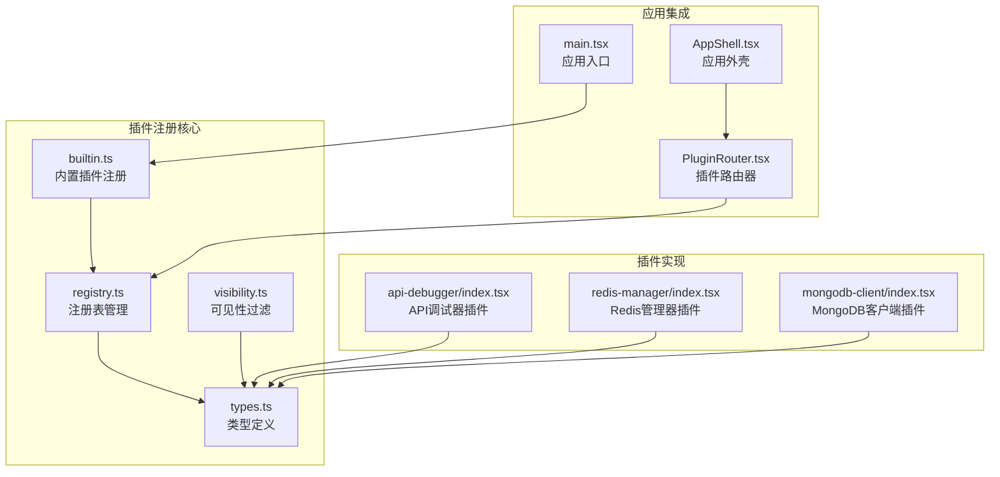
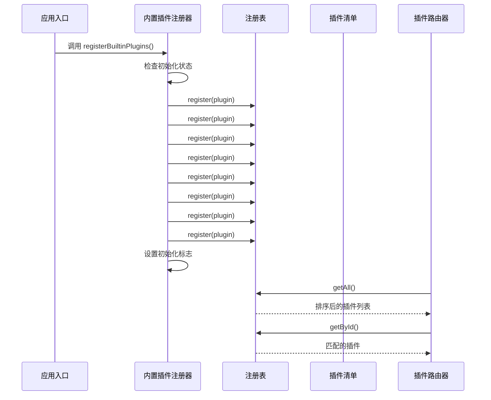
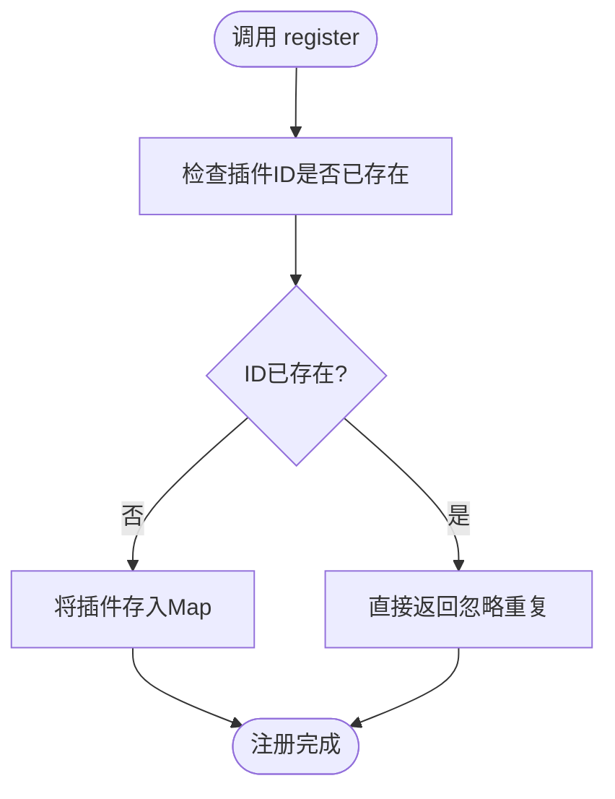
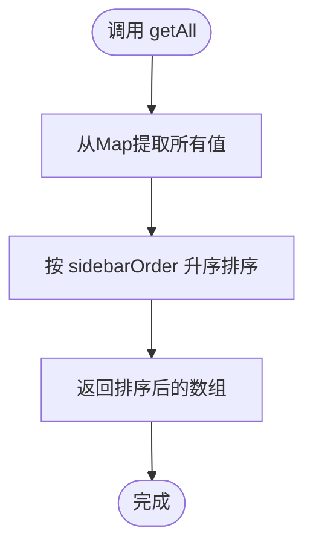
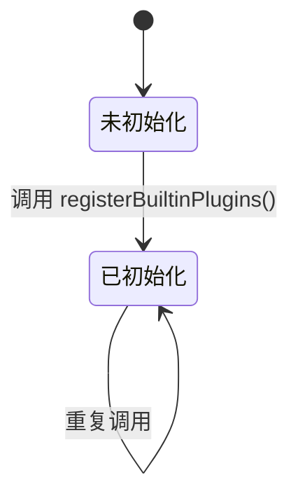
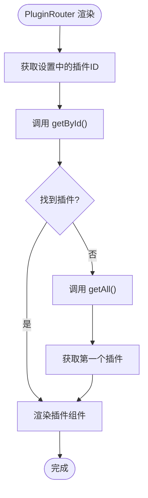
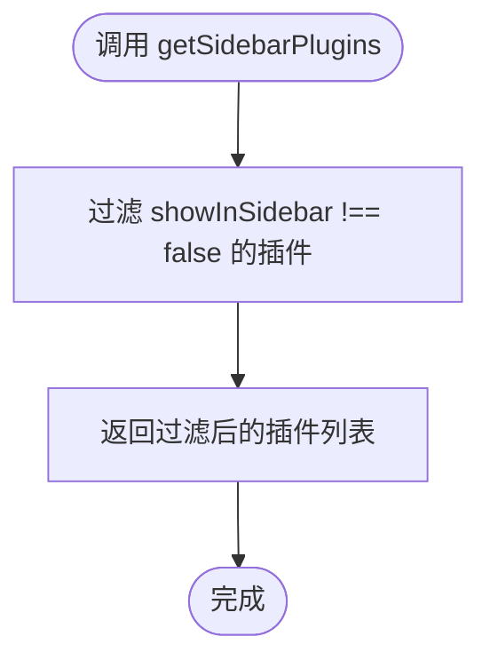
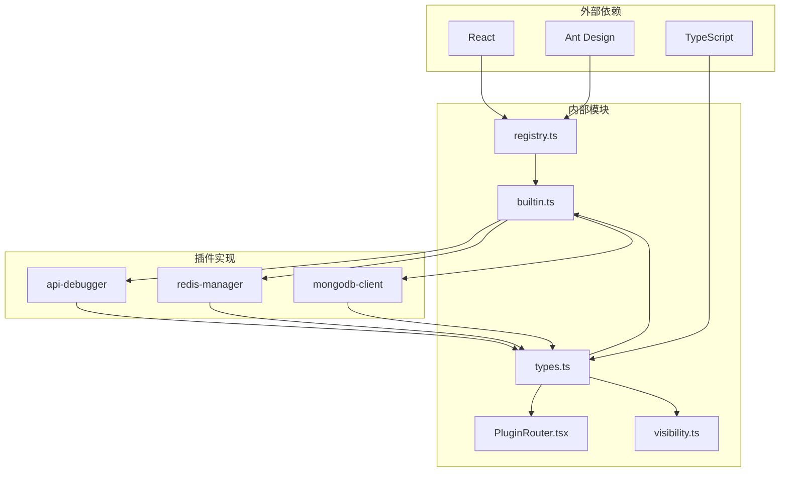

# 插件注册机制

<cite>
**本文档引用的文件**
- [registry.ts](file://src/app/plugin-registry/registry.ts)
- [builtin.ts](file://src/app/plugin-registry/builtin.ts)
- [types.ts](file://src/app/plugin-registry/types.ts)
- [visibility.ts](file://src/app/plugin-registry/visibility.ts)
- [PluginRouter.tsx](file://src/app/plugin-registry/PluginRouter.tsx)
- [main.tsx](file://src/main.tsx)
- [AppShell.tsx](file://src/app/layout/AppShell.tsx)
- [registry.test.ts](file://tests/app/plugin-registry/registry.test.ts)
- [builtin.test.ts](file://tests/app/plugin-registry/builtin.test.ts)
- [api-debugger/index.tsx](file://src/plugins/api-debugger/index.tsx)
- [redis-manager/index.tsx](file://src/plugins/redis-manager/index.tsx)
- [mongodb-client/index.tsx](file://src/plugins/mongodb-client/index.tsx)
</cite>

## 目录
1. [简介](#简介)
2. [项目结构](#项目结构)
3. [核心组件](#核心组件)
4. [架构概览](#架构概览)
5. [详细组件分析](#详细组件分析)
6. [依赖关系分析](#依赖关系分析)
7. [性能考虑](#性能考虑)
8. [故障排除指南](#故障排除指南)
9. [最佳实践](#最佳实践)
10. [结论](#结论)

## 简介

本文件详细解析了 RDMM 应用中的插件注册机制。该机制采用轻量级的内存注册表设计，支持内置插件自动注册、插件清单验证、依赖检查以及运行时插件管理。系统通过统一的注册接口管理所有插件，确保插件ID的唯一性，并提供排序、检索和清理功能。

## 项目结构

插件注册机制主要分布在以下目录中：

**图表来源**
- [registry.ts:1-26](file://src/app/plugin-registry/registry.ts#L1-L26)
- [builtin.ts:1-29](file://src/app/plugin-registry/builtin.ts#L1-L29)
- [types.ts:1-14](file://src/app/plugin-registry/types.ts#L1-L14)

**章节来源**
- [registry.ts:1-26](file://src/app/plugin-registry/registry.ts#L1-L26)
- [builtin.ts:1-29](file://src/app/plugin-registry/builtin.ts#L1-L29)
- [types.ts:1-14](file://src/app/plugin-registry/types.ts#L1-L14)

## 核心组件

### 注册表管理器

注册表采用 Map 数据结构存储插件清单，提供完整的 CRUD 操作：

- **注册函数 (register)**：检查插件ID唯一性，避免重复注册
- **获取所有插件 (getAll)**：返回按侧边栏顺序排序的插件列表
- **按ID获取插件 (getById)**：提供快速插件检索
- **清理注册表 (clearRegistry)**：清空所有已注册插件

### 插件清单类型

插件清单包含以下关键字段：
- `id`: 唯一标识符（字符串）
- `name`: 插件显示名称
- `icon`: Ant Design 图标组件
- `version`: 版本号
- `component`: React 组件函数
- `sidebarOrder`: 侧边栏排序权重
- `showInSidebar`: 是否显示在侧边栏（可选）

**章节来源**
- [registry.ts:5-25](file://src/app/plugin-registry/registry.ts#L5-L25)
- [types.ts:5-13](file://src/app/plugin-registry/types.ts#L5-L13)

## 架构概览

插件注册机制采用分层架构设计，确保模块间的松耦合和高内聚：

**图表来源**
- [main.tsx:5-10](file://src/main.tsx#L5-L10)
- [builtin.ts:13-27](file://src/app/plugin-registry/builtin.ts#L13-L27)
- [registry.ts:13-21](file://src/app/plugin-registry/registry.ts#L13-L21)

## 详细组件分析

### 注册表管理器实现

注册表管理器提供了完整的插件生命周期管理：

#### 注册流程分析

**图表来源**
- [registry.ts:5-11](file://src/app/plugin-registry/registry.ts#L5-L11)

#### 获取所有插件算法

getAll() 函数实现了稳定的排序算法：

**图表来源**
- [registry.ts:13-17](file://src/app/plugin-registry/registry.ts#L13-L17)

#### 冲突处理机制

系统采用"首次注册优先"策略处理插件ID冲突：
- 后注册的同ID插件会被忽略
- 保留第一次注册时的插件配置
- 不会覆盖已存在的插件清单

**章节来源**
- [registry.ts:5-11](file://src/app/plugin-registry/registry.ts#L5-L11)
- [registry.ts:13-17](file://src/app/plugin-registry/registry.ts#L13-L17)
- [registry.test.ts:32-38](file://tests/app/plugin-registry/registry.test.ts#L32-L38)

### 内置插件注册器

内置插件注册器负责应用启动时的插件自动注册：

#### 初始化保护机制

**图表来源**
- [builtin.ts:11-16](file://src/app/plugin-registry/builtin.ts#L11-L16)

#### 注册顺序控制

内置插件按照预定义的顺序注册，确保侧边栏显示的一致性：

| 注册顺序 | 插件ID | 侧边栏权重 |
|---------|--------|-----------|
| 1 | redis-manager | 10 |
| 2 | ssh-client | 20 |
| 3 | s3-client | 30 |
| 4 | mongodb-client | 40 |
| 5 | mysql-client | 50 |
| 6 | network-tools | 60 |
| 7 | api-debugger | 70 |
| 8 | mq-client | 80 |

**章节来源**
- [builtin.ts:13-27](file://src/app/plugin-registry/builtin.ts#L13-L27)

### 插件路由器

插件路由器负责根据用户选择动态渲染对应插件：

#### 路由决策流程

**图表来源**
- [PluginRouter.tsx:10-13](file://src/app/plugin-registry/PluginRouter.tsx#L10-L13)

**章节来源**
- [PluginRouter.tsx:7-28](file://src/app/plugin-registry/PluginRouter.tsx#L7-L28)

### 可见性过滤器

可见性过滤器提供插件显示控制功能：

#### 过滤逻辑

**图表来源**
- [visibility.ts:3-5](file://src/app/plugin-registry/visibility.ts#L3-L5)

**章节来源**
- [visibility.ts:1-6](file://src/app/plugin-registry/visibility.ts#L1-L6)

## 依赖关系分析

插件注册机制的依赖关系呈现清晰的单向依赖结构：

**图表来源**
- [registry.ts:1](file://src/app/plugin-registry/registry.ts#L1)
- [types.ts:1](file://src/app/plugin-registry/types.ts#L1)
- [builtin.ts:1](file://src/app/plugin-registry/builtin.ts#L1)

**章节来源**
- [registry.ts:1](file://src/app/plugin-registry/registry.ts#L1)
- [types.ts:1](file://src/app/plugin-registry/types.ts#L1)
- [builtin.ts:1](file://src/app/plugin-registry/builtin.ts#L1)

## 性能考虑

### 时间复杂度分析

- **注册操作 (register)**：O(1) 平均时间复杂度，基于 Map 的哈希查找
- **获取所有插件 (getAll)**：O(n log n) 时间复杂度，主要由排序操作决定
- **按ID获取插件 (getById)**：O(1) 平均时间复杂度
- **清理注册表 (clearRegistry)**：O(1) 时间复杂度

### 空间复杂度分析

- **注册表存储**：O(n) 空间复杂度，n为已注册插件数量
- **排序操作**：O(n) 额外空间用于临时数组

### 优化建议

1. **批量注册**：对于大量插件注册，考虑一次性批量处理
2. **缓存策略**：对频繁访问的插件列表进行缓存
3. **延迟加载**：对于大型插件，考虑按需加载组件

## 故障排除指南

### 常见问题及解决方案

#### 插件ID冲突

**问题症状**：后注册的同ID插件不生效
**解决方法**：确保每个插件使用唯一的ID标识符

#### 插件未显示在侧边栏

**问题症状**：插件已注册但不显示
**解决方法**：检查插件清单中的 `showInSidebar` 属性，默认为 `true`

#### 插件排序异常

**问题症状**：插件在侧边栏中位置不正确
**解决方法**：调整插件清单中的 `sidebarOrder` 数值

**章节来源**
- [registry.test.ts:32-38](file://tests/app/plugin-registry/registry.test.ts#L32-L38)
- [builtin.test.ts:13-29](file://tests/app/plugin-registry/builtin.test.ts#L13-L29)

## 最佳实践

### 插件开发规范

1. **唯一ID原则**：为每个插件分配全局唯一的ID
2. **合理排序**：根据功能重要性和使用频率设置 `sidebarOrder`
3. **类型安全**：严格遵循 `PluginManifest` 接口定义
4. **组件设计**：确保插件根组件无副作用

### 注册时机控制

1. **应用启动**：在应用初始化阶段注册内置插件
2. **动态加载**：对于外部插件，考虑异步注册机制
3. **条件注册**：根据运行环境或用户权限决定插件注册

### 错误处理策略

1. **ID验证**：注册前验证插件ID格式和唯一性
2. **清单校验**：确保所有必需字段都已正确设置
3. **回滚机制**：注册失败时提供适当的错误恢复

### 性能优化建议

1. **懒加载组件**：对于大型插件组件采用懒加载
2. **虚拟化列表**：对于大量插件的侧边栏显示使用虚拟化
3. **增量更新**：支持插件的增量注册和更新

## 结论

RDMM 的插件注册机制通过简洁而高效的架构设计，实现了插件的统一管理。其核心优势包括：

- **简单可靠**：基于 Map 的注册表设计，操作直观易懂
- **性能优秀**：O(1) 的查找和插入复杂度，适合高频操作
- **扩展性强**：支持内置插件自动注册和动态插件管理
- **类型安全**：完整的 TypeScript 类型定义，提供编译时安全保障

该机制为 RDMM 提供了灵活的插件架构基础，支持未来功能的扩展和维护。通过遵循最佳实践和注意潜在问题，开发者可以构建稳定可靠的插件系统。