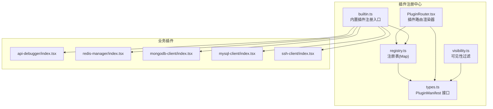
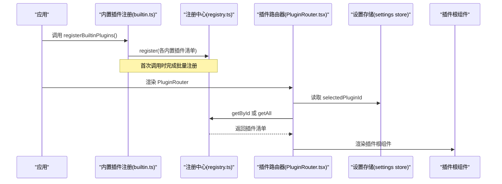
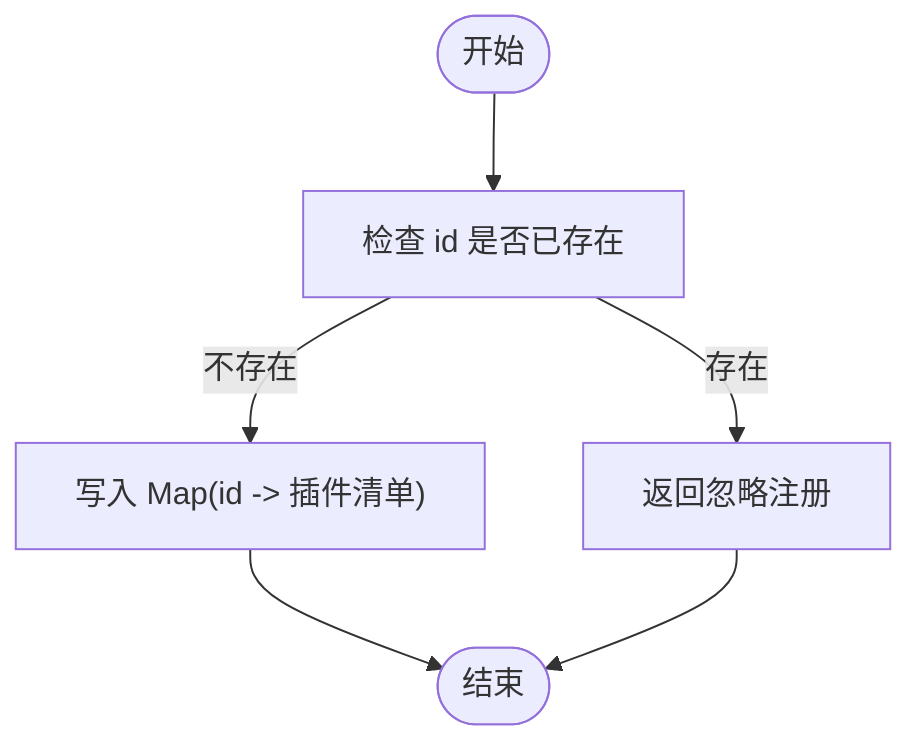
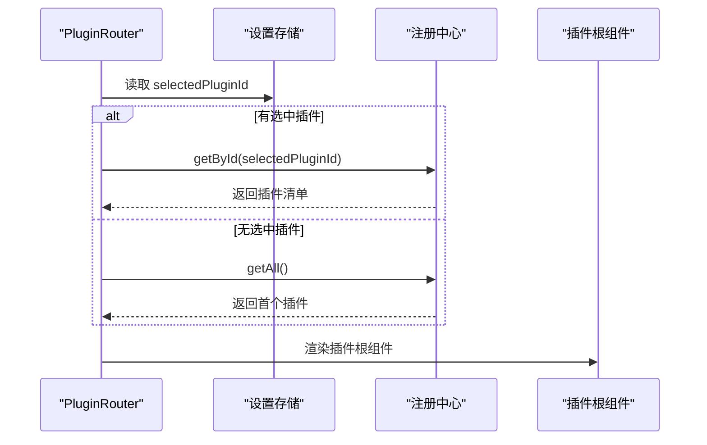
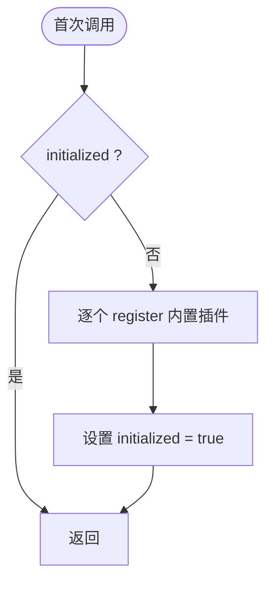
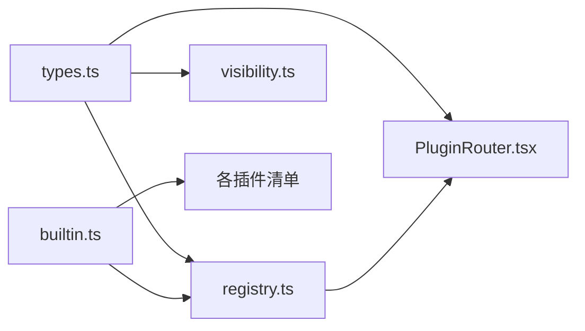

# 插件系统

<cite>
**本文引用的文件**
- [registry.ts](file://src/app/plugin-registry/registry.ts)
- [types.ts](file://src/app/plugin-registry/types.ts)
- [builtin.ts](file://src/app/plugin-registry/builtin.ts)
- [visibility.ts](file://src/app/plugin-registry/visibility.ts)
- [PluginRouter.tsx](file://src/app/plugin-registry/PluginRouter.tsx)
- [api-debugger/index.tsx](file://src/plugins/api-debugger/index.tsx)
- [redis-manager/index.tsx](file://src/plugins/redis-manager/index.tsx)
- [mongodb-client/index.tsx](file://src/plugins/mongodb-client/index.tsx)
- [mysql-client/index.tsx](file://src/plugins/mysql-client/index.tsx)
- [ssh-client/index.tsx](file://src/plugins/ssh-client/index.tsx)
- [api-debugger-store.ts](file://src/plugins/api-debugger/store/api-debugger.ts)
- [redis-workspace-store.ts](file://src/plugins/redis-manager/store/workspace.ts)
- [mongo-connections-store.ts](file://src/plugins/mongodb-client/store/mongodb-connections.ts)
- [mysql-connections-store.ts](file://src/plugins/mysql-client/store/mysql-connections.ts)
- [ssh-workspace-store.ts](file://src/plugins/ssh-client/store/workspace.ts)
</cite>

## 目录
1. [简介](#简介)
2. [项目结构](#项目结构)
3. [核心组件](#核心组件)
4. [架构总览](#架构总览)
5. [详细组件分析](#详细组件分析)
6. [依赖关系分析](#依赖关系分析)
7. [性能考量](#性能考量)
8. [故障排查指南](#故障排查指南)
9. [结论](#结论)
10. [附录：插件开发指南](#附录插件开发指南)

## 简介
本文件系统性阐述 DevNexus 的插件化架构与实现细节，覆盖插件注册机制、插件清单接口、路由系统、内置插件注册流程、可见性控制、以及面向开发者的插件开发规范与最佳实践。目标是帮助开发者快速理解并高效扩展 DevNexus 的功能边界。

## 项目结构
DevNexus 的插件系统由前端插件注册中心与多个业务插件组成。前端插件注册中心负责插件清单的注册、查询与可见性过滤；业务插件以独立模块形式提供 UI 组件与状态管理，并通过统一的清单接口暴露给注册中心。

图表来源
- [registry.ts:1-26](file://src/app/plugin-registry/registry.ts#L1-L26)
- [types.ts:1-14](file://src/app/plugin-registry/types.ts#L1-L14)
- [visibility.ts:1-6](file://src/app/plugin-registry/visibility.ts#L1-L6)
- [PluginRouter.tsx:1-29](file://src/app/plugin-registry/PluginRouter.tsx#L1-L29)
- [builtin.ts:1-29](file://src/app/plugin-registry/builtin.ts#L1-L29)
- [api-debugger/index.tsx:1-39](file://src/plugins/api-debugger/index.tsx#L1-L39)
- [redis-manager/index.tsx:1-67](file://src/plugins/redis-manager/index.tsx#L1-L67)
- [mongodb-client/index.tsx:1-87](file://src/plugins/mongodb-client/index.tsx#L1-L87)
- [mysql-client/index.tsx:1-38](file://src/plugins/mysql-client/index.tsx#L1-L38)
- [ssh-client/index.tsx:1-66](file://src/plugins/ssh-client/index.tsx#L1-L66)

章节来源
- [registry.ts:1-26](file://src/app/plugin-registry/registry.ts#L1-L26)
- [types.ts:1-14](file://src/app/plugin-registry/types.ts#L1-L14)
- [builtin.ts:1-29](file://src/app/plugin-registry/builtin.ts#L1-L29)
- [visibility.ts:1-6](file://src/app/plugin-registry/visibility.ts#L1-L6)
- [PluginRouter.tsx:1-29](file://src/app/plugin-registry/PluginRouter.tsx#L1-L29)

## 核心组件
- 插件清单接口（PluginManifest）
  - 定义：包含插件唯一标识、名称、图标、版本、根组件、侧边栏排序等字段。
  - 必需属性：id、name、icon、version、component、sidebarOrder。
  - 可选配置：showInSidebar 控制是否显示在侧边栏。
- 注册中心（registry.ts）
  - 提供 register、getAll、getById、clearRegistry 等方法，使用 Map 存储插件清单。
  - register 去重：若 id 已存在则忽略重复注册。
  - getAll 按 sidebarOrder 升序返回插件列表。
- 路由器（PluginRouter.tsx）
  - 从设置存储中读取当前选中的插件 id，若未找到则回退到第一个插件。
  - 渲染对应插件的根组件。
- 可见性过滤（visibility.ts）
  - 过滤掉显式隐藏的插件（showInSidebar !== false）。
- 内置插件注册（builtin.ts）
  - 在首次调用时批量注册所有内置插件，防止重复初始化。

章节来源
- [types.ts:5-13](file://src/app/plugin-registry/types.ts#L5-L13)
- [registry.ts:5-25](file://src/app/plugin-registry/registry.ts#L5-L25)
- [PluginRouter.tsx:7-28](file://src/app/plugin-registry/PluginRouter.tsx#L7-L28)
- [visibility.ts:3-5](file://src/app/plugin-registry/visibility.ts#L3-L5)
- [builtin.ts:13-27](file://src/app/plugin-registry/builtin.ts#L13-L27)

## 架构总览
下图展示了插件系统的关键交互：应用启动时注册内置插件，路由器根据用户选择渲染对应插件的根组件，插件内部通过各自的状态管理与后端命令进行数据交互。

图表来源
- [builtin.ts:13-27](file://src/app/plugin-registry/builtin.ts#L13-L27)
- [registry.ts:13-21](file://src/app/plugin-registry/registry.ts#L13-L21)
- [PluginRouter.tsx:7-13](file://src/app/plugin-registry/PluginRouter.tsx#L7-L13)

## 详细组件分析

### 注册中心与生命周期
- 注册流程
  - 调用 register(plugin) 将插件清单写入 Map，键为 id。
  - 若 id 已存在，直接返回，避免重复注册。
- 查询与清理
  - getAll 按 sidebarOrder 排序返回插件清单。
  - getById 根据 id 获取插件。
  - clearRegistry 清空注册表。
- 生命周期
  - 注册发生在应用初始化阶段（通常在应用启动时）。
  - 插件卸载可通过 clearRegistry 实现，但一般不建议在运行时清空。

图表来源
- [registry.ts:5-11](file://src/app/plugin-registry/registry.ts#L5-L11)

章节来源
- [registry.ts:5-25](file://src/app/plugin-registry/registry.ts#L5-L25)

### 插件清单接口（PluginManifest）
- 字段说明
  - id：插件唯一标识，用于注册与路由定位。
  - name：展示名称。
  - icon：Ant Design 图标或自定义 ReactNode。
  - version：插件版本号。
  - component：插件根组件函数式组件。
  - sidebarOrder：侧边栏排序权重，数值越小越靠前。
  - showInSidebar：是否显示在侧边栏，默认显示。
- 设计要点
  - 所有插件必须提供根组件，以便路由器渲染。
  - sidebarOrder 用于统一排序，便于 UI 侧边栏布局。
  - showInSidebar 支持按需隐藏插件。

章节来源
- [types.ts:5-13](file://src/app/plugin-registry/types.ts#L5-L13)

### 插件路由系统（PluginRouter）
- 选择策略
  - 从设置存储中读取当前选中的插件 id。
  - 若存在则渲染该插件根组件；否则回退到 getAll()[0]。
- 错误兜底
  - 当没有任何插件注册时，提示“请至少注册一个插件”。
- 参数与导航
  - 通过设置存储的 selectedPluginId 实现插件切换。
  - 插件内部通过自身状态管理与后端命令实现导航与数据刷新。

图表来源
- [PluginRouter.tsx:7-13](file://src/app/plugin-registry/PluginRouter.tsx#L7-L13)
- [registry.ts:13-21](file://src/app/plugin-registry/registry.ts#L13-L21)

章节来源
- [PluginRouter.tsx:7-28](file://src/app/plugin-registry/PluginRouter.tsx#L7-L28)

### 内置插件注册机制（registerBuiltinPlugins）
- 初始化保护
  - 使用布尔标志避免重复初始化。
- 注册顺序
  - 依次注册多个内置插件清单，确保系统启动时具备基础能力。
- 扩展点
  - 新增内置插件时，在此函数中追加 register 调用即可。

图表来源
- [builtin.ts:13-27](file://src/app/plugin-registry/builtin.ts#L13-L27)

章节来源
- [builtin.ts:13-27](file://src/app/plugin-registry/builtin.ts#L13-L27)

### 插件可见性控制
- 过滤规则
  - 默认显示所有插件。
  - 显式将 showInSidebar 设置为 false 的插件将被过滤掉。
- 应用场景
  - 用于隐藏实验性或条件性插件。
  - 与侧边栏渲染配合，保证 UI 简洁。

章节来源
- [visibility.ts:3-5](file://src/app/plugin-registry/visibility.ts#L3-L5)

### 典型插件实现模式（以几个插件为例）
- API 调试器（api-debugger）
  - 根组件负责标签页切换与环境选择。
  - 通过 Zustand 状态管理与后端命令交互。
- Redis 管理器（redis-manager）
  - 多标签工作区，包含连接、键浏览、控制台、服务器信息。
  - 通过工作区状态管理控制视图切换。
- MongoDB 客户端（mongodb-client）
  - 复杂工作区，涵盖连接、数据库、集合、查询、索引、导入导出、服务器状态。
  - 通过连接状态管理封装大量 CRUD 与查询命令。
- MySQL 客户端（mysql-client）
  - 连接、数据库、表数据、SQL 编辑、索引、导入导出、服务器状态。
  - 通过连接状态管理封装 SQL 执行与元数据操作。
- SSH 客户端（ssh-client）
  - 连接、终端、密钥、隧道管理。
  - 通过工作区状态管理控制视图与活动连接。

章节来源
- [api-debugger/index.tsx:13-39](file://src/plugins/api-debugger/index.tsx#L13-L39)
- [redis-manager/index.tsx:14-67](file://src/plugins/redis-manager/index.tsx#L14-L67)
- [mongodb-client/index.tsx:14-87](file://src/plugins/mongodb-client/index.tsx#L14-L87)
- [mysql-client/index.tsx:14-38](file://src/plugins/mysql-client/index.tsx#L14-L38)
- [ssh-client/index.tsx:12-66](file://src/plugins/ssh-client/index.tsx#L12-L66)

## 依赖关系分析
- 注册中心依赖类型定义（types.ts）。
- 路由器依赖注册中心与设置存储。
- 可见性过滤依赖类型定义。
- 内置插件注册依赖注册中心与各插件清单。
- 各插件根组件依赖自身状态管理与后端命令。

图表来源
- [types.ts:1-14](file://src/app/plugin-registry/types.ts#L1-L14)
- [registry.ts:1-26](file://src/app/plugin-registry/registry.ts#L1-L26)
- [visibility.ts:1-6](file://src/app/plugin-registry/visibility.ts#L1-L6)
- [PluginRouter.tsx:1-29](file://src/app/plugin-registry/PluginRouter.tsx#L1-L29)
- [builtin.ts:1-29](file://src/app/plugin-registry/builtin.ts#L1-L29)

章节来源
- [types.ts:1-14](file://src/app/plugin-registry/types.ts#L1-L14)
- [registry.ts:1-26](file://src/app/plugin-registry/registry.ts#L1-L26)
- [visibility.ts:1-6](file://src/app/plugin-registry/visibility.ts#L1-L6)
- [PluginRouter.tsx:1-29](file://src/app/plugin-registry/PluginRouter.tsx#L1-L29)
- [builtin.ts:1-29](file://src/app/plugin-registry/builtin.ts#L1-L29)

## 性能考量
- 注册中心使用 Map 存储，注册、查询、删除均为近似 O(1)。
- getAll 对插件列表进行排序，时间复杂度 O(n log n)，其中 n 为插件数量。
- 路由器仅在 selectedPluginId 变更时重新计算，避免不必要的渲染。
- 插件内部状态管理采用轻量级状态库，减少全局状态同步成本。
- 建议：对大量插件场景，可考虑分页或懒加载策略以优化首屏渲染。

## 故障排查指南
- “未注册任何插件”
  - 现象：路由器渲染警告提示。
  - 排查：确认是否调用了内置插件注册函数，或手动注册了插件清单。
- 插件未显示在侧边栏
  - 现象：插件清单存在但未出现在侧边栏。
  - 排查：检查 showInSidebar 是否被显式设为 false。
- 插件切换无效
  - 现象：切换插件后界面未更新。
  - 排查：确认设置存储中的选中 id 是否正确更新；检查插件 id 是否与清单一致。
- 插件内命令调用失败
  - 现象：调用后端命令报错或无响应。
  - 排查：确认命令名与后端实现一致；检查请求参数格式；查看日志输出。

章节来源
- [PluginRouter.tsx:15-24](file://src/app/plugin-registry/PluginRouter.tsx#L15-L24)
- [builtin.ts:13-27](file://src/app/plugin-registry/builtin.ts#L13-L27)
- [visibility.ts:3-5](file://src/app/plugin-registry/visibility.ts#L3-L5)

## 结论
DevNexus 的插件系统以简洁的清单接口与集中式注册中心为核心，结合路由渲染器与可见性过滤，实现了高内聚、低耦合的插件化架构。内置插件注册机制提供了开箱即用的能力扩展路径，同时为第三方开发者预留了清晰的扩展点。遵循本文档的开发规范，可快速构建稳定、可维护的插件生态。

## 附录：插件开发指南

### 插件结构规范
- 目录组织
  - 插件根目录包含 index.tsx（导出 PluginManifest）、views（视图组件）、store（状态管理）、utils（工具函数）、types（类型定义）等子目录。
- 清单导出
  - 在 index.tsx 中导出名为 {pluginId}Plugin 的 PluginManifest 实例，确保 id、name、icon、version、component、sidebarOrder 等字段完整。
- 视图组件
  - 根组件作为插件入口，负责标签页、导航与内容区域的组织。
  - 子视图组件按功能拆分，保持单一职责。

章节来源
- [api-debugger/index.tsx:38](file://src/plugins/api-debugger/index.tsx#L38)
- [redis-manager/index.tsx:59-67](file://src/plugins/redis-manager/index.tsx#L59-L67)
- [mongodb-client/index.tsx:79-87](file://src/plugins/mongodb-client/index.tsx#L79-L87)
- [mysql-client/index.tsx:37](file://src/plugins/mysql-client/index.tsx#L37)
- [ssh-client/index.tsx:58-66](file://src/plugins/ssh-client/index.tsx#L58-L66)

### 状态管理模式
- 推荐使用轻量级状态库（如 Zustand）管理插件内部状态。
- 将与后端交互的命令封装为异步动作，集中处理加载态、错误与成功回调。
- 通过派生状态与副作用（如 useEffect）实现联动更新。

章节来源
- [api-debugger-store.ts:47-128](file://src/plugins/api-debugger/store/api-debugger.ts#L47-L128)
- [redis-workspace-store.ts:16-25](file://src/plugins/redis-manager/store/workspace.ts#L16-L25)
- [mongo-connections-store.ts:96-295](file://src/plugins/mongodb-client/store/mongodb-connections.ts#L96-L295)
- [mysql-connections-store.ts:77-152](file://src/plugins/mysql-client/store/mysql-connections.ts#L77-L152)
- [ssh-workspace-store.ts:16-21](file://src/plugins/ssh-client/store/workspace.ts#L16-L21)

### 视图组件设计
- 标签页与导航
  - 使用统一的标签控件组织多视图，确保切换流畅。
  - 导航逻辑与状态管理解耦，避免在组件中直接访问全局状态。
- 响应式布局
  - 使用弹性布局与溢出控制，适配不同窗口尺寸。
- 可访问性
  - 为关键元素提供语义化标签与键盘导航支持。

### 后端命令实现
- 命令命名规范
  - 命名以 cmd_{plugin}_{action} 形式，确保唯一性与可读性。
- 参数与返回值
  - 明确参数结构与返回类型，必要时提供默认值与校验。
- 错误处理
  - 在前端捕获并提示错误，避免崩溃传播；在后端记录日志便于追踪。

### 插件可见性控制与扩展点识别
- 可见性控制
  - 通过 showInSidebar 控制插件是否出现在侧边栏。
- 扩展点识别
  - 在注册中心集中注册，便于统一管理与排序。
  - 通过插件 id 与路由参数实现精准导航与状态隔离。

章节来源
- [types.ts:12](file://src/app/plugin-registry/types.ts#L12)
- [visibility.ts:3-5](file://src/app/plugin-registry/visibility.ts#L3-L5)
- [builtin.ts:13-27](file://src/app/plugin-registry/builtin.ts#L13-L27)