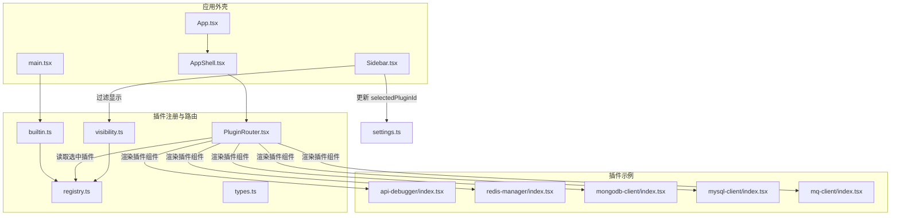
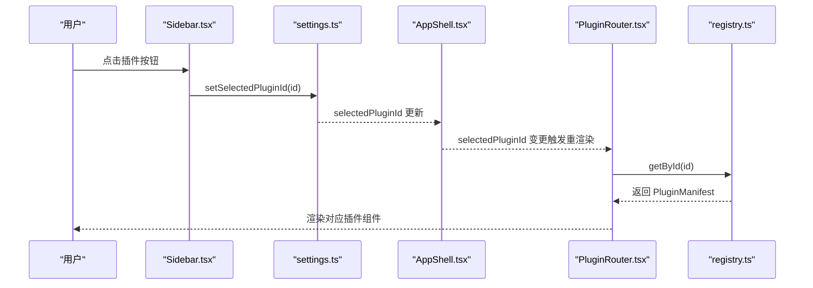
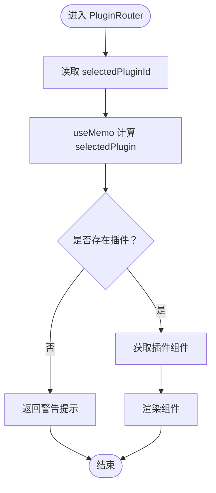
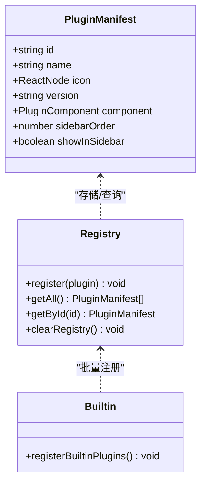
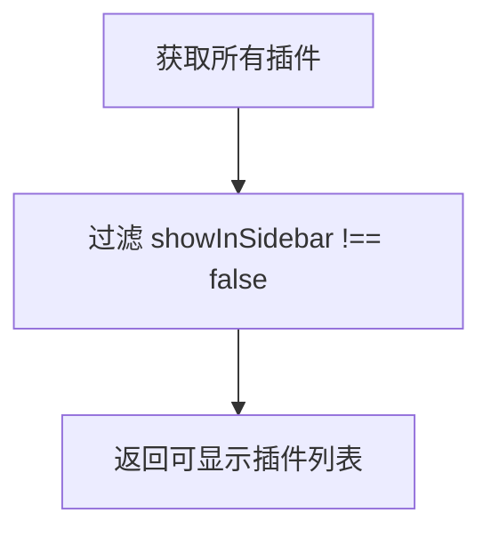
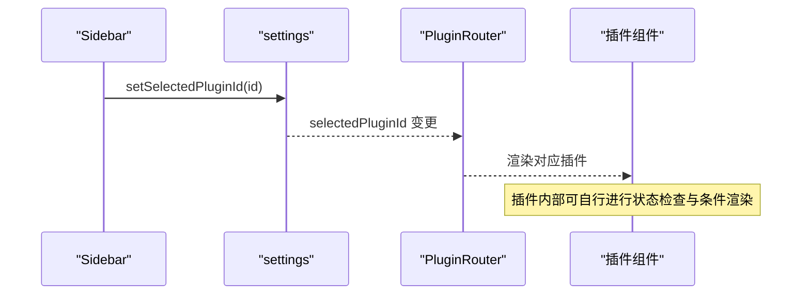
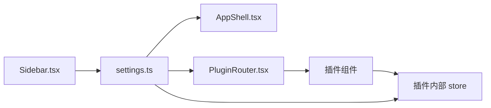
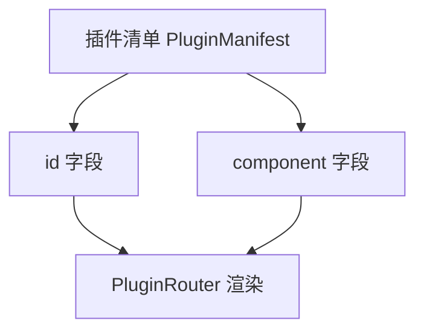
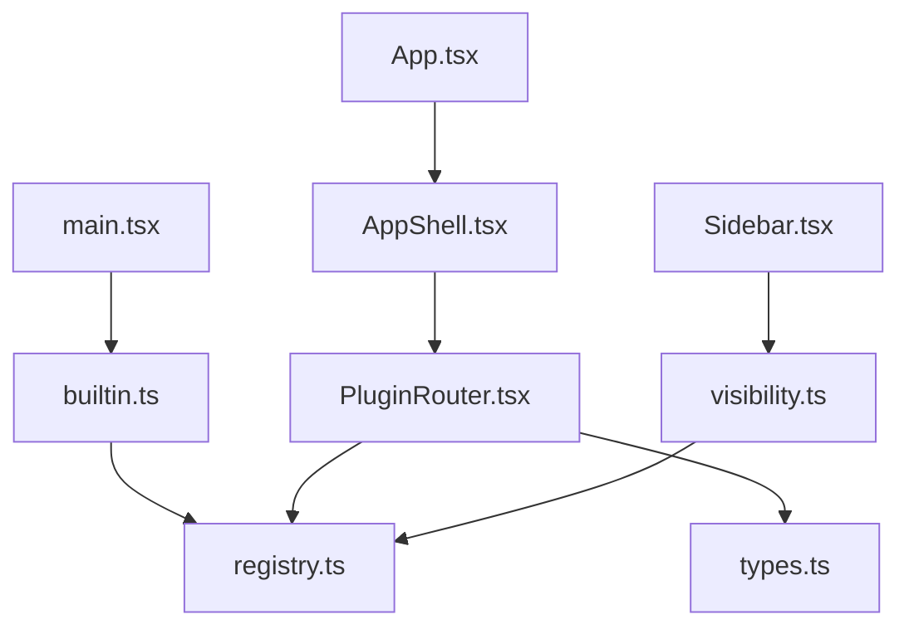

# 插件路由系统

<cite>
**本文档引用的文件**
- [PluginRouter.tsx](file://src/app/plugin-registry/PluginRouter.tsx)
- [visibility.ts](file://src/app/plugin-registry/visibility.ts)
- [types.ts](file://src/app/plugin-registry/types.ts)
- [registry.ts](file://src/app/plugin-registry/registry.ts)
- [builtin.ts](file://src/app/plugin-registry/builtin.ts)
- [settings.ts](file://src/app/store/settings.ts)
- [AppShell.tsx](file://src/app/layout/AppShell.tsx)
- [Sidebar.tsx](file://src/app/layout/Sidebar.tsx)
- [main.tsx](file://src/main.tsx)
- [App.tsx](file://src/App.tsx)
- [api-debugger/index.tsx](file://src/plugins/api-debugger/index.tsx)
- [redis-manager/index.tsx](file://src/plugins/redis-manager/index.tsx)
- [mongodb-client/index.tsx](file://src/plugins/mongodb-client/index.tsx)
- [mysql-client/index.tsx](file://src/plugins/mysql-client/index.tsx)
- [mq-client/index.tsx](file://src/plugins/mq-client/index.tsx)
</cite>

## 目录
1. [简介](#简介)
2. [项目结构](#项目结构)
3. [核心组件](#核心组件)
4. [架构总览](#架构总览)
5. [详细组件分析](#详细组件分析)
6. [依赖关系分析](#依赖关系分析)
7. [性能考虑](#性能考虑)
8. [故障排除指南](#故障排除指南)
9. [结论](#结论)
10. [附录](#附录)

## 简介
本文件系统性地阐述插件路由系统的实现与使用方法，重点围绕 PluginRouter 组件展开，解释其路由匹配算法、参数解析与导航控制机制；同时说明插件可见性控制（visibility.ts）中的判断逻辑、权限与条件渲染策略；并结合内置插件注册流程与设置存储联动，给出路由守卫与导航拦截的实现思路、插件间数据传递与状态同步机制，以及最佳实践与性能优化建议。

## 项目结构
插件路由系统位于 src/app/plugin-registry 目录下，核心文件包括：
- PluginRouter.tsx：插件路由容器，根据当前选中插件 ID 动态渲染对应插件组件
- registry.ts：插件注册表，提供注册、查询、排序等能力
- types.ts：插件清单类型定义
- visibility.ts：插件可见性过滤工具
- builtin.ts：内置插件注册入口
- settings.ts：全局设置存储，包含 selectedPluginId 等状态
- AppShell.tsx 与 Sidebar.tsx：应用外壳与侧边栏，负责插件选择与导航
- 各插件根组件：如 api-debugger、redis-manager、mongodb-client、mysql-client、mq-client 等，均以 PluginManifest 形式导出

**图表来源**
- [PluginRouter.tsx:1-29](file://src/app/plugin-registry/PluginRouter.tsx#L1-L29)
- [registry.ts:1-26](file://src/app/plugin-registry/registry.ts#L1-L26)
- [visibility.ts:1-6](file://src/app/plugin-registry/visibility.ts#L1-L6)
- [types.ts:1-14](file://src/app/plugin-registry/types.ts#L1-L14)
- [builtin.ts:1-29](file://src/app/plugin-registry/builtin.ts#L1-L29)
- [settings.ts:1-28](file://src/app/store/settings.ts#L1-L28)
- [AppShell.tsx:1-207](file://src/app/layout/AppShell.tsx#L1-L207)
- [Sidebar.tsx:1-177](file://src/app/layout/Sidebar.tsx#L1-L177)
- [main.tsx:1-38](file://src/main.tsx#L1-L38)
- [App.tsx:1-11](file://src/App.tsx#L1-L11)
- [api-debugger/index.tsx:1-39](file://src/plugins/api-debugger/index.tsx#L1-L39)
- [redis-manager/index.tsx:1-67](file://src/plugins/redis-manager/index.tsx#L1-L67)
- [mongodb-client/index.tsx:1-87](file://src/plugins/mongodb-client/index.tsx#L1-L87)
- [mysql-client/index.tsx:1-38](file://src/plugins/mysql-client/index.tsx#L1-L38)
- [mq-client/index.tsx:1-38](file://src/plugins/mq-client/index.tsx#L1-L38)

**章节来源**
- [PluginRouter.tsx:1-29](file://src/app/plugin-registry/PluginRouter.tsx#L1-L29)
- [registry.ts:1-26](file://src/app/plugin-registry/registry.ts#L1-L26)
- [visibility.ts:1-6](file://src/app/plugin-registry/visibility.ts#L1-L6)
- [types.ts:1-14](file://src/app/plugin-registry/types.ts#L1-L14)
- [builtin.ts:1-29](file://src/app/plugin-registry/builtin.ts#L1-L29)
- [settings.ts:1-28](file://src/app/store/settings.ts#L1-L28)
- [AppShell.tsx:1-207](file://src/app/layout/AppShell.tsx#L1-L207)
- [Sidebar.tsx:1-177](file://src/app/layout/Sidebar.tsx#L1-L177)
- [main.tsx:1-38](file://src/main.tsx#L1-L38)
- [App.tsx:1-11](file://src/App.tsx#L1-L11)

## 核心组件
- PluginRouter：基于当前选中插件 ID 获取插件清单并渲染对应组件，若无已注册插件则提示警告
- registry：提供注册、查询、排序与清空能力，按 sidebarOrder 排序输出插件列表
- visibility：过滤掉显式隐藏在侧边栏的插件
- types：定义 PluginManifest 结构，包含 id、name、icon、version、component、sidebarOrder、showInSidebar 等字段
- builtin：集中注册内置插件，避免重复初始化
- settings：全局状态管理，维护 sidebarCollapsed、dbToolsCollapsed、selectedPluginId 等
- AppShell/Sidebar：侧边栏交互，通过 setSelectedPluginId 切换当前插件

**章节来源**
- [PluginRouter.tsx:7-28](file://src/app/plugin-registry/PluginRouter.tsx#L7-L28)
- [registry.ts:5-25](file://src/app/plugin-registry/registry.ts#L5-L25)
- [visibility.ts:3-5](file://src/app/plugin-registry/visibility.ts#L3-L5)
- [types.ts:5-13](file://src/app/plugin-registry/types.ts#L5-L13)
- [builtin.ts:13-27](file://src/app/plugin-registry/builtin.ts#L13-L27)
- [settings.ts:9-21](file://src/app/store/settings.ts#L9-L21)
- [AppShell.tsx:31-56](file://src/app/layout/AppShell.tsx#L31-L56)
- [Sidebar.tsx:21-42](file://src/app/layout/Sidebar.tsx#L21-L42)

## 架构总览
插件路由系统采用“清单驱动 + 状态驱动”的架构：
- 清单驱动：各插件以 PluginManifest 形式注册到 registry，registry 提供统一查询与排序接口
- 状态驱动：selectedPluginId 来源于 settings，作为路由的唯一输入
- 渲染驱动：PluginRouter 基于 selectedPluginId 从 registry 获取组件并渲染
- 可见性控制：visibility 过滤 showInSidebar=false 的插件，Sidebar 仅展示可显示插件

**图表来源**
- [Sidebar.tsx:50-77](file://src/app/layout/Sidebar.tsx#L50-L77)
- [settings.ts:13-27](file://src/app/store/settings.ts#L13-L27)
- [AppShell.tsx:31-56](file://src/app/layout/AppShell.tsx#L31-L56)
- [PluginRouter.tsx:10-13](file://src/app/plugin-registry/PluginRouter.tsx#L10-L13)
- [registry.ts:19-21](file://src/app/plugin-registry/registry.ts#L19-L21)

## 详细组件分析

### PluginRouter 组件
- 路由匹配算法：通过 useSettingsStore 读取 selectedPluginId，使用 useMemo 缓存 selectedPlugin，优先 getById 查询，失败则取 getAll()[0] 作为回退
- 参数解析：不涉及 URL 参数或动态参数，插件切换完全由状态驱动
- 导航控制：Sidebar 通过 setSelectedPluginId 触发路由变更；当无已注册插件时，返回警告提示
- 性能特性：useMemo 避免不必要的查询与渲染；未发现额外的防抖/节流

**图表来源**
- [PluginRouter.tsx:7-28](file://src/app/plugin-registry/PluginRouter.tsx#L7-L28)
- [registry.ts:19-21](file://src/app/plugin-registry/registry.ts#L19-L21)
- [settings.ts:9-21](file://src/app/store/settings.ts#L9-L21)

**章节来源**
- [PluginRouter.tsx:7-28](file://src/app/plugin-registry/PluginRouter.tsx#L7-L28)

### 插件清单与注册
- 类型定义：PluginManifest 包含 id、name、icon、version、component、sidebarOrder、showInSidebar 等字段
- 注册表：registry 使用 Map 存储插件，提供 register、getAll、getById、clearRegistry
- 排序：getAll 按 sidebarOrder 升序排列，确保侧边栏顺序稳定
- 内置插件：builtin 在首次调用时批量注册，避免重复注册

**图表来源**
- [types.ts:5-13](file://src/app/plugin-registry/types.ts#L5-L13)
- [registry.ts:3-25](file://src/app/plugin-registry/registry.ts#L3-L25)
- [builtin.ts:13-27](file://src/app/plugin-registry/builtin.ts#L13-L27)

**章节来源**
- [types.ts:1-14](file://src/app/plugin-registry/types.ts#L1-L14)
- [registry.ts:1-26](file://src/app/plugin-registry/registry.ts#L1-L26)
- [builtin.ts:1-29](file://src/app/plugin-registry/builtin.ts#L1-L29)

### 可见性控制与权限
- 可见性判断：visibility.ts 仅过滤 showInSidebar !== false 的插件，实现基础的“是否显示在侧边栏”控制
- 权限控制：当前仓库未提供细粒度权限校验逻辑，可见性控制为全局开关
- 条件渲染：Sidebar 仅对 getSidebarPlugins(getAll()) 的结果进行渲染，未在组件内部做额外条件判断

**图表来源**
- [visibility.ts:3-5](file://src/app/plugin-registry/visibility.ts#L3-L5)
- [Sidebar.tsx:21-25](file://src/app/layout/Sidebar.tsx#L21-L25)

**章节来源**
- [visibility.ts:1-6](file://src/app/plugin-registry/visibility.ts#L1-L6)
- [Sidebar.tsx:21-25](file://src/app/layout/Sidebar.tsx#L21-L25)

### 路由守卫与导航拦截
- 当前实现：未发现显式的路由守卫或导航拦截逻辑
- 访问控制：通过 visibility 控制可见性，不涉及登录验证或状态检查
- 登录验证：未在路由层实现登录拦截
- 状态检查：Sidebar 与插件内部可通过自身状态进行条件渲染（例如 Redis 插件在无连接时自动切换视图）

**图表来源**
- [Sidebar.tsx:34-37](file://src/app/layout/Sidebar.tsx#L34-L37)
- [settings.ts:13-27](file://src/app/store/settings.ts#L13-L27)
- [PluginRouter.tsx:7-28](file://src/app/plugin-registry/PluginRouter.tsx#L7-L28)

**章节来源**
- [Sidebar.tsx:34-37](file://src/app/layout/Sidebar.tsx#L34-L37)
- [settings.ts:13-27](file://src/app/store/settings.ts#L13-L27)
- [PluginRouter.tsx:7-28](file://src/app/plugin-registry/PluginRouter.tsx#L7-L28)

### 插件间数据传递与状态同步
- 插件内状态：各插件通过自身 store 管理内部状态（如 api-debugger、redis-manager、mongodb-client、mysql-client、mq-client）
- 应用级状态：settings 提供全局状态（如 selectedPluginId），用于跨组件共享当前选中插件
- 数据流：Sidebar 更新 settings，AppShell 读取 settings 并计算状态项，PluginRouter 依据 settings 渲染插件
- 插件间通信：当前实现未发现跨插件直接通信机制，推荐通过应用级 store 或事件总线扩展

**图表来源**
- [Sidebar.tsx:34-37](file://src/app/layout/Sidebar.tsx#L34-L37)
- [settings.ts:9-21](file://src/app/store/settings.ts#L9-L21)
- [AppShell.tsx:44-56](file://src/app/layout/AppShell.tsx#L44-L56)
- [PluginRouter.tsx:7-28](file://src/app/plugin-registry/PluginRouter.tsx#L7-L28)

**章节来源**
- [settings.ts:1-28](file://src/app/store/settings.ts#L1-L28)
- [AppShell.tsx:44-56](file://src/app/layout/AppShell.tsx#L44-L56)
- [PluginRouter.tsx:7-28](file://src/app/plugin-registry/PluginRouter.tsx#L7-L28)

### 路由配置与使用示例
- 路由路径定义：不涉及 URL 路径，插件通过 id 与组件映射
- 动态参数：当前未实现动态参数解析
- 嵌套路由：插件内部可使用 Segment/Tab 等 UI 组件实现视图切换，但不改变路由层级

**图表来源**
- [types.ts:5-13](file://src/app/plugin-registry/types.ts#L5-L13)
- [PluginRouter.tsx:26-27](file://src/app/plugin-registry/PluginRouter.tsx#L26-L27)

**章节来源**
- [types.ts:1-14](file://src/app/plugin-registry/types.ts#L1-L14)
- [api-debugger/index.tsx:38-39](file://src/plugins/api-debugger/index.tsx#L38-L39)
- [redis-manager/index.tsx:59-67](file://src/plugins/redis-manager/index.tsx#L59-L67)
- [mongodb-client/index.tsx:79-87](file://src/plugins/mongodb-client/index.tsx#L79-L87)
- [mysql-client/index.tsx:37-38](file://src/plugins/mysql-client/index.tsx#L37-L38)
- [mq-client/index.tsx:37-38](file://src/plugins/mq-client/index.tsx#L37-L38)

## 依赖关系分析
- 组件耦合：PluginRouter 仅依赖 registry 与 settings，耦合度低，职责单一
- 外部依赖：Ant Design 组件库、React Hooks、Zustand 状态管理
- 初始化流程：main.tsx 调用 registerBuiltinPlugins 完成插件注册，随后渲染应用

**图表来源**
- [main.tsx:5-10](file://src/main.tsx#L5-L10)
- [builtin.ts:13-27](file://src/app/plugin-registry/builtin.ts#L13-L27)
- [App.tsx:1-11](file://src/App.tsx#L1-L11)
- [AppShell.tsx:1-207](file://src/app/layout/AppShell.tsx#L1-L207)
- [PluginRouter.tsx:1-29](file://src/app/plugin-registry/PluginRouter.tsx#L1-L29)
- [registry.ts:1-26](file://src/app/plugin-registry/registry.ts#L1-L26)
- [types.ts:1-14](file://src/app/plugin-registry/types.ts#L1-L14)
- [Sidebar.tsx:1-177](file://src/app/layout/Sidebar.tsx#L1-L177)
- [visibility.ts:1-6](file://src/app/plugin-registry/visibility.ts#L1-L6)

**章节来源**
- [main.tsx:1-38](file://src/main.tsx#L1-L38)
- [builtin.ts:1-29](file://src/app/plugin-registry/builtin.ts#L1-L29)
- [App.tsx:1-11](file://src/App.tsx#L1-L11)
- [AppShell.tsx:1-207](file://src/app/layout/AppShell.tsx#L1-L207)
- [PluginRouter.tsx:1-29](file://src/app/plugin-registry/PluginRouter.tsx#L1-L29)
- [registry.ts:1-26](file://src/app/plugin-registry/registry.ts#L1-L26)
- [types.ts:1-14](file://src/app/plugin-registry/types.ts#L1-L14)
- [Sidebar.tsx:1-177](file://src/app/layout/Sidebar.tsx#L1-L177)
- [visibility.ts:1-6](file://src/app/plugin-registry/visibility.ts#L1-L6)

## 性能考虑
- 渲染优化：PluginRouter 使用 useMemo 缓存 selectedPlugin，减少重复查询与渲染
- 查询优化：registry 使用 Map 存储，getById 时间复杂度 O(1)，getAll 排序时间复杂度 O(n log n)
- 状态更新：Sidebar 仅在点击时更新 selectedPluginId，避免频繁重渲染
- 建议：若插件数量较多，可考虑对 getAll 结果进行缓存；对插件内部的视图切换，建议使用 React.memo 或类似手段避免子组件重复渲染

[本节为通用性能讨论，无需特定文件来源]

## 故障排除指南
- 无插件注册：当 registry 为空时，PluginRouter 返回警告提示，需确认是否正确注册内置插件
- 插件未显示：检查插件 manifest 的 showInSidebar 字段与 visibility 过滤逻辑
- 无法切换插件：确认 Sidebar 是否正确调用 setSelectedPluginId，以及 settings 是否持久化成功
- 插件组件不更新：检查插件内部状态是否正确响应外部状态变化

**章节来源**
- [PluginRouter.tsx:15-24](file://src/app/plugin-registry/PluginRouter.tsx#L15-L24)
- [visibility.ts:3-5](file://src/app/plugin-registry/visibility.ts#L3-L5)
- [settings.ts:13-27](file://src/app/store/settings.ts#L13-L27)

## 结论
该插件路由系统以清单驱动为核心，通过 settings 驱动的 selectedPluginId 实现插件切换，具备清晰的职责划分与较低的耦合度。可见性控制与内置插件注册提供了良好的扩展性。当前未实现 URL 路由、动态参数与导航拦截，适合轻量级插件管理场景。后续可在现有基础上扩展路由守卫、权限控制与跨插件通信机制，以满足更复杂的业务需求。

[本节为总结性内容，无需特定文件来源]

## 附录

### 最佳实践
- 明确插件清单字段：确保每个插件提供稳定的 id、name、icon、version、component、sidebarOrder
- 控制可见性：默认显示插件，必要时通过 showInSidebar 精细控制
- 管理注册顺序：合理设置 sidebarOrder，保证侧边栏顺序符合用户体验
- 状态持久化：利用 settings 的持久化能力保存用户偏好
- 插件内部优化：对插件内的视图切换使用 memo 化，减少重渲染

[本节为通用建议，无需特定文件来源]