# MongoDB 连接仓储

<cite>
**本文档引用的文件**
- [mongodb-connections.ts](file://src/plugins/mongodb-client/store/mongodb-connections.ts)
- [mongodb_connection_repo.rs](file://src-tauri/src/db/mongodb_connection_repo.rs)
- [client_pool.rs](file://src-tauri/src/plugins/mongodb/client_pool.rs)
- [commands.rs](file://src-tauri/src/plugins/mongodb/commands.rs)
- [types.rs](file://src-tauri/src/plugins/mongodb/types.rs)
- [init.rs](file://src-tauri/src/db/init.rs)
- [lib.rs](file://src-tauri/src/lib.rs)
- [MongoConnectionForm.tsx](file://src/plugins/mongodb-client/components/MongoConnectionForm.tsx)
- [types.ts](file://src/plugins/mongodb-client/types.ts)
</cite>

## 目录
1. [简介](#简介)
2. [项目结构](#项目结构)
3. [核心组件](#核心组件)
4. [架构概览](#架构概览)
5. [详细组件分析](#详细组件分析)
6. [依赖关系分析](#依赖关系分析)
7. [性能考虑](#性能考虑)
8. [故障排除指南](#故障排除指南)
9. [结论](#结论)

## 简介

DevNexus 的 MongoDB 连接仓储是一个完整的数据库连接管理解决方案，专门为 MongoDB 数据库提供连接、认证、查询和管理功能。该系统采用分层架构设计，结合前端状态管理和后端 Rust 实现，提供了安全、高效的 MongoDB 连接管理能力。

本系统支持两种连接模式：URI 模式和表单模式，具备完整的连接生命周期管理、连接池优化、SSL/TLS 支持、副本集配置等功能。通过加密存储敏感信息（如密码和连接字符串），确保用户数据的安全性。

## 项目结构

DevNexus 的 MongoDB 连接仓储采用模块化设计，主要分为以下几个层次：

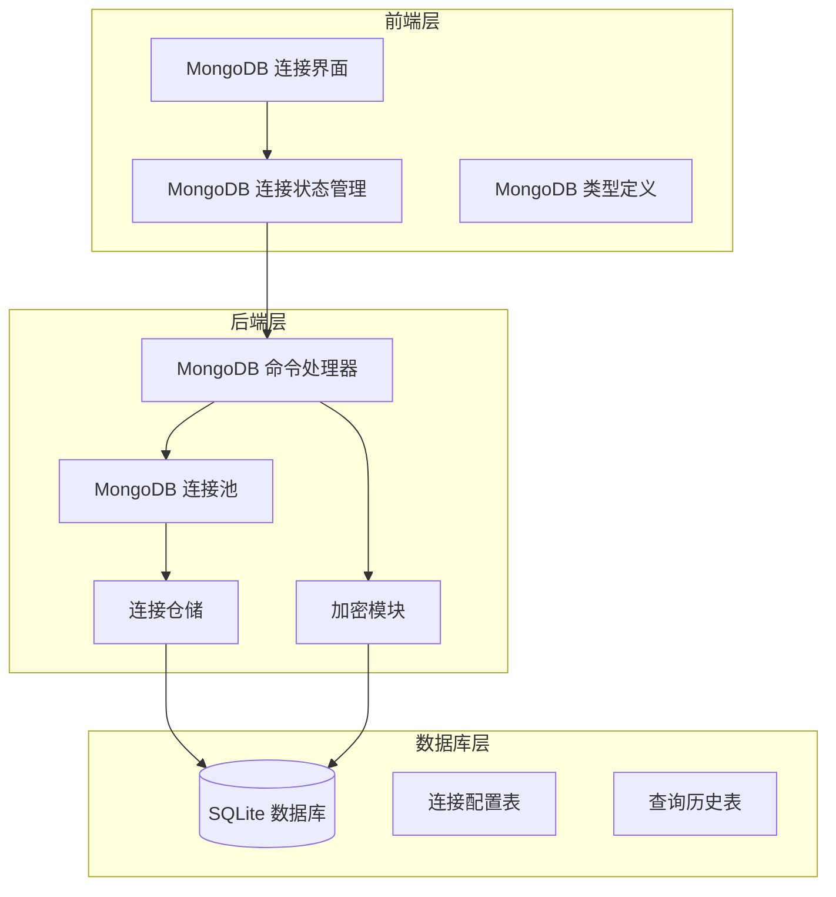

**图表来源**
- [lib.rs:134-184](file://src-tauri/src/lib.rs#L134-L184)
- [mongodb-connections.ts:96-295](file://src/plugins/mongodb-client/store/mongodb-connections.ts#L96-L295)

**章节来源**
- [lib.rs:134-184](file://src-tauri/src/lib.rs#L134-L184)
- [init.rs:117-143](file://src-tauri/src/db/init.rs#L117-L143)

## 核心组件

### 连接配置模型

系统定义了完整的 MongoDB 连接配置模型，支持多种连接参数：

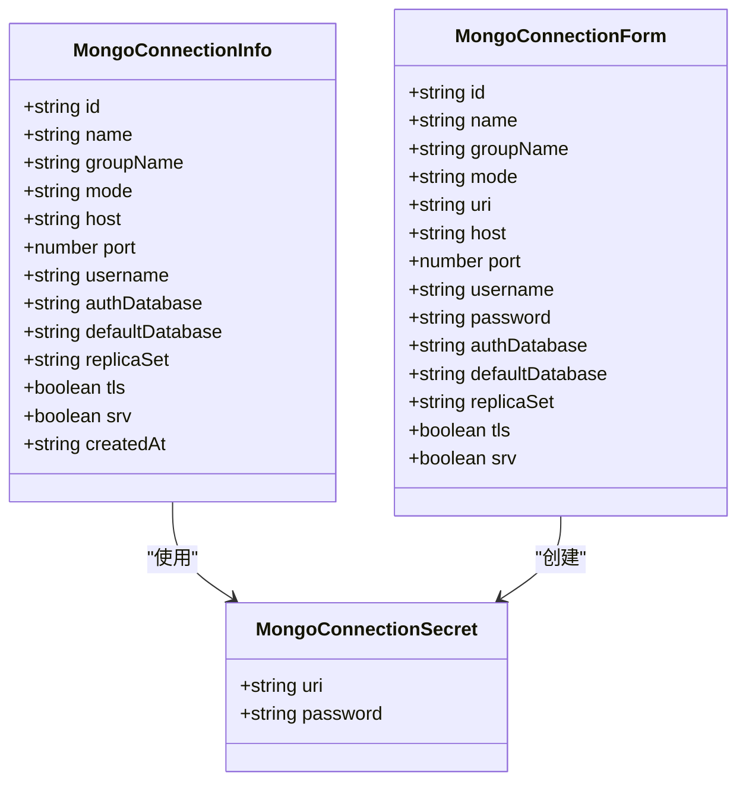

**图表来源**
- [mongodb_connection_repo.rs:3-38](file://src-tauri/src/db/mongodb_connection_repo.rs#L3-L38)
- [types.ts:20-34](file://src/plugins/mongodb-client/types.ts#L20-L34)

### 连接池管理

系统实现了线程安全的连接池管理机制，支持多连接并发访问：

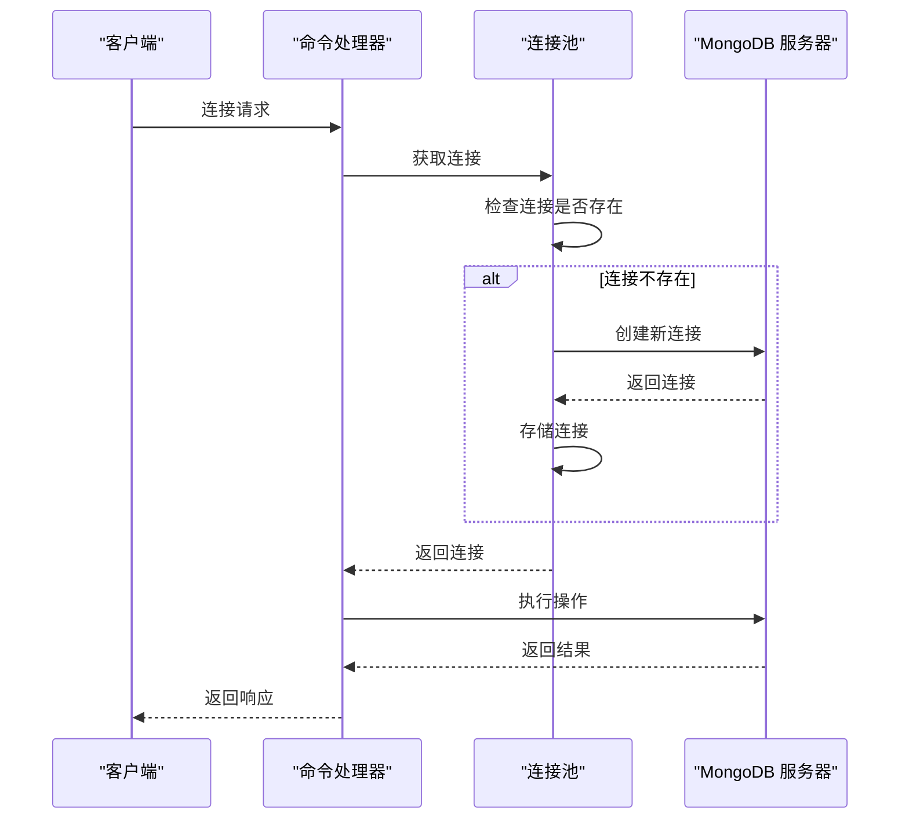

**图表来源**
- [client_pool.rs:107-131](file://src-tauri/src/plugins/mongodb/client_pool.rs#L107-L131)

**章节来源**
- [mongodb_connection_repo.rs:3-38](file://src-tauri/src/db/mongodb_connection_repo.rs#L3-L38)
- [client_pool.rs:14-105](file://src-tauri/src/plugins/mongodb/client_pool.rs#L14-L105)

## 架构概览

DevNexus 的 MongoDB 连接仓储采用分层架构设计，确保了良好的可维护性和扩展性：

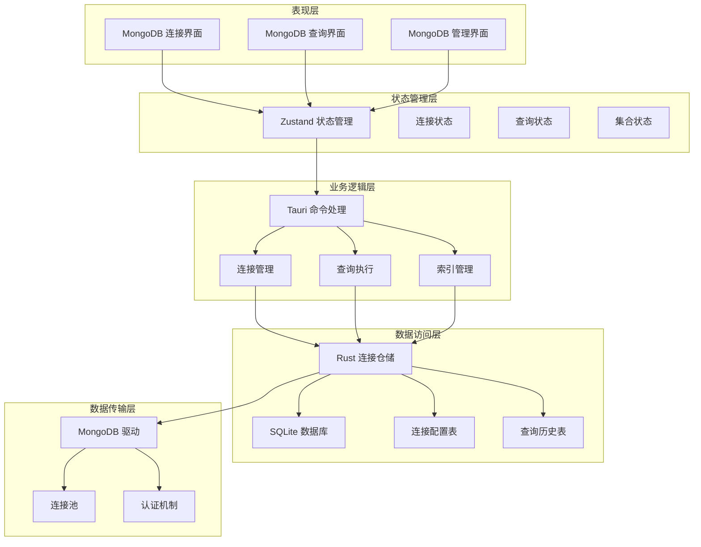

**图表来源**
- [lib.rs:134-184](file://src-tauri/src/lib.rs#L134-L184)
- [mongodb-connections.ts:96-295](file://src/plugins/mongodb-client/store/mongodb-connections.ts#L96-L295)

## 详细组件分析

### 连接配置与存储

#### 连接配置模型

MongoDB 连接配置支持多种参数组合，满足不同场景的需求：

| 参数名称 | 类型 | 必需 | 描述 |
|---------|------|------|------|
| id | string | 否 | 连接标识符 |
| name | string | 是 | 连接名称 |
| groupName | string | 否 | 分组名称 |
| mode | string | 是 | 连接模式（uri/form） |
| uri | string | 可选 | 完整的 MongoDB URI |
| host | string | 可选 | 主机地址 |
| port | number | 可选 | 端口号，默认 27017 |
| username | string | 可选 | 用户名 |
| password | string | 可选 | 密码 |
| authDatabase | string | 可选 | 认证数据库 |
| defaultDatabase | string | 可选 | 默认数据库 |
| replicaSet | string | 可选 | 副本集名称 |
| tls | boolean | 可选 | 是否启用 TLS |
| srv | boolean | 可选 | 是否使用 SRV 记录 |

#### 数据库存储结构

连接信息存储在 SQLite 数据库中，采用加密方式保护敏感数据：

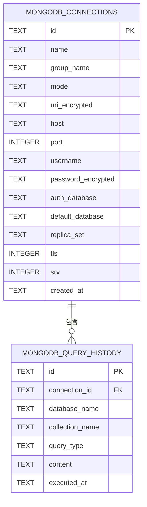

**图表来源**
- [init.rs:117-143](file://src-tauri/src/db/init.rs#L117-L143)

**章节来源**
- [mongodb_connection_repo.rs:72-248](file://src-tauri/src/db/mongodb_connection_repo.rs#L72-L248)
- [init.rs:117-143](file://src-tauri/src/db/init.rs#L117-L143)

### 连接构建与认证

#### 连接构建策略

系统支持三种连接构建策略：

1. **URI 模式**：直接使用完整的 MongoDB URI
2. **SRV 模式**：使用 DNS SRV 记录自动发现集群
3. **表单模式**：通过表单参数手动配置连接

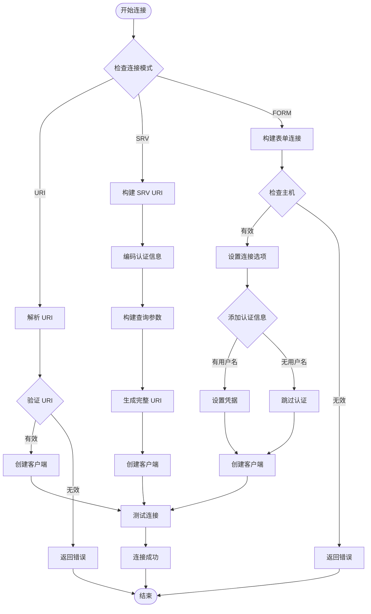

**图表来源**
- [client_pool.rs:14-105](file://src-tauri/src/plugins/mongodb/client_pool.rs#L14-L105)

#### 认证机制

系统支持多种认证方式：

1. **用户名/密码认证**：标准的用户名密码认证
2. **认证数据库指定**：通过 `authSource` 指定认证数据库
3. **TLS/SSL 支持**：支持加密连接
4. **副本集认证**：支持副本集环境下的认证

**章节来源**
- [client_pool.rs:14-105](file://src-tauri/src/plugins/mongodb/client_pool.rs#L14-L105)

### 查询执行与管理

#### 查询执行流程

系统提供了完整的查询执行框架，支持多种查询类型：

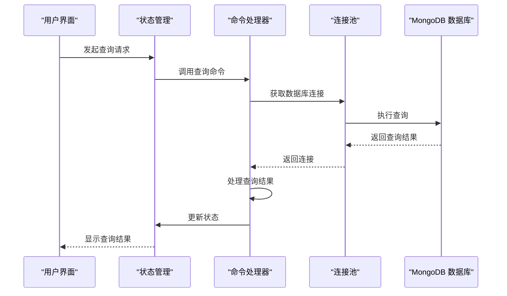

**图表来源**
- [commands.rs:267-306](file://src-tauri/src/plugins/mongodb/commands.rs#L267-L306)

#### 支持的查询类型

系统支持以下查询操作：

1. **文档查询**：基本的文档查找操作
2. **聚合查询**：复杂的聚合管道操作
3. **数据库命令**：执行 MongoDB 原生命令
4. **索引管理**：创建、删除和查询索引
5. **集合管理**：创建、删除集合
6. **导入导出**：批量数据导入导出

**章节来源**
- [commands.rs:267-520](file://src-tauri/src/plugins/mongodb/commands.rs#L267-L520)

### 连接测试与验证

#### 连接测试流程

系统提供了完整的连接测试机制，确保连接的有效性：

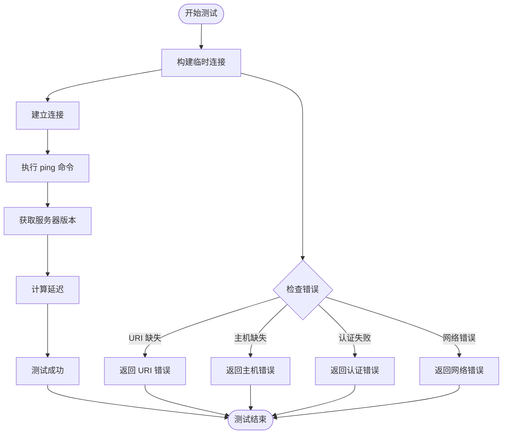

**图表来源**
- [commands.rs:146-154](file://src-tauri/src/plugins/mongodb/commands.rs#L146-L154)

**章节来源**
- [commands.rs:146-154](file://src-tauri/src/plugins/mongodb/commands.rs#L146-L154)

## 依赖关系分析

### 组件依赖图

DevNexus 的 MongoDB 连接仓储具有清晰的依赖关系：

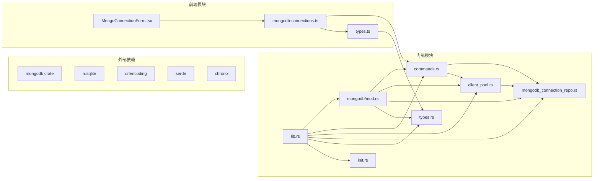

**图表来源**
- [lib.rs:134-184](file://src-tauri/src/lib.rs#L134-L184)
- [mongodb_connection_repo.rs:1-249](file://src-tauri/src/db/mongodb_connection_repo.rs#L1-L249)

### 数据流分析

系统的数据流遵循严格的分层设计：

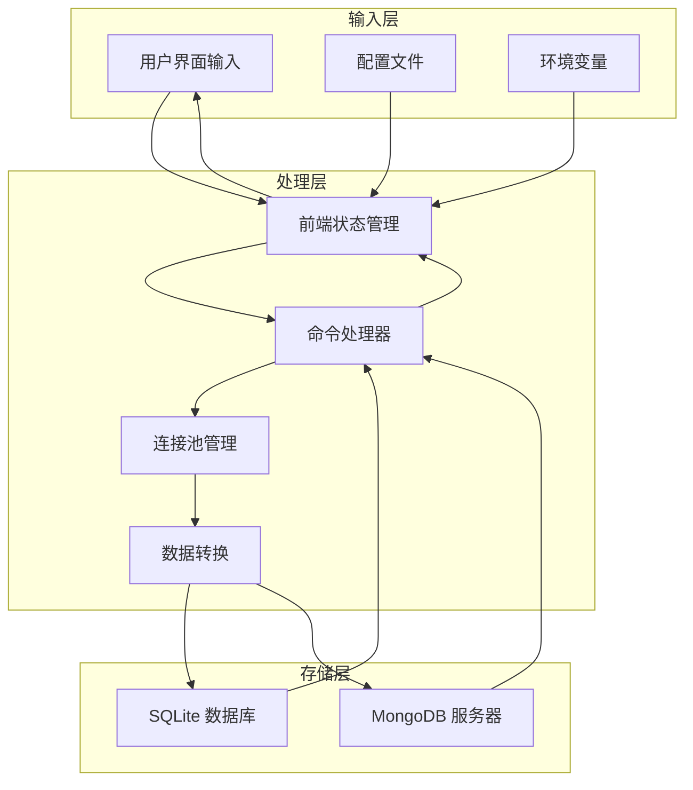

**图表来源**
- [mongodb-connections.ts:123-160](file://src/plugins/mongodb-client/store/mongodb-connections.ts#L123-L160)
- [commands.rs:157-164](file://src-tauri/src/plugins/mongodb/commands.rs#L157-L164)

**章节来源**
- [lib.rs:134-184](file://src-tauri/src/lib.rs#L134-L184)
- [mongodb-connections.ts:123-160](file://src/plugins/mongodb-client/store/mongodb-connections.ts#L123-L160)

## 性能考虑

### 连接池优化

系统实现了高效的连接池管理，支持以下优化特性：

1. **连接复用**：避免重复创建连接，提高性能
2. **线程安全**：使用互斥锁确保并发安全
3. **内存管理**：及时清理断开的连接
4. **超时控制**：防止连接泄漏

### 查询优化

系统提供了多种查询优化策略：

1. **批量操作**：支持批量插入和更新
2. **索引利用**：自动利用现有索引
3. **投影优化**：只返回需要的字段
4. **分页处理**：支持大数据集的分页查询

### 内存管理

系统采用以下内存管理策略：

1. **懒加载**：按需加载数据
2. **缓存机制**：缓存常用查询结果
3. **垃圾回收**：及时释放不再使用的资源
4. **连接复用**：避免频繁创建销毁连接

## 故障排除指南

### 常见连接问题

#### 连接超时问题

**症状**：连接建立超时或查询响应缓慢

**可能原因**：
1. 网络延迟过高
2. MongoDB 服务器负载过重
3. 连接池配置不当
4. 防火墙阻断连接

**解决方法**：
1. 检查网络连通性
2. 增加连接超时时间
3. 优化查询语句
4. 检查服务器资源使用情况

#### 认证失败问题

**症状**：连接时出现认证错误

**可能原因**：
1. 用户名或密码错误
2. 认证数据库配置错误
3. 权限不足
4. TLS 配置问题

**解决方法**：
1. 验证用户名密码
2. 检查 `authSource` 配置
3. 确认用户权限
4. 测试 TLS 连接

#### 副本集连接问题

**症状**：副本集环境连接不稳定

**可能原因**：
1. 副本集名称配置错误
2. 主节点不可用
3. 网络分区
4. 配置同步延迟

**解决方法**：
1. 验证副本集名称
2. 检查主节点状态
3. 网络连通性测试
4. 等待配置同步完成

### 性能监控

#### 连接状态监控

系统提供了详细的连接状态监控：

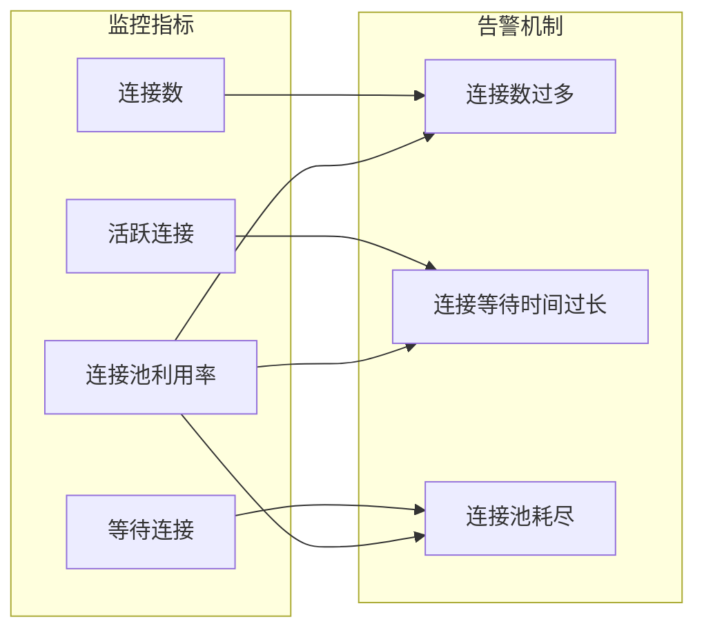

#### 性能分析工具

系统内置了多种性能分析工具：

1. **查询执行时间统计**
2. **连接池使用率监控**
3. **内存使用情况跟踪**
4. **网络延迟测量**

**章节来源**
- [commands.rs:758-781](file://src-tauri/src/plugins/mongodb/commands.rs#L758-L781)

### 日志记录

系统提供了完整的日志记录机制：

1. **连接事件日志**：记录连接建立和断开
2. **查询执行日志**：记录所有查询操作
3. **错误日志**：记录所有错误信息
4. **性能日志**：记录性能相关指标

## 结论

DevNexus 的 MongoDB 连接仓储是一个功能完整、设计合理的数据库连接管理解决方案。系统采用了现代化的架构设计，结合了前端状态管理和后端 Rust 实现，提供了高效、安全、易用的 MongoDB 连接管理能力。

### 主要优势

1. **安全性**：采用加密存储敏感信息，支持多种认证方式
2. **性能**：实现连接池优化，支持并发访问
3. **易用性**：提供直观的用户界面和丰富的功能
4. **可靠性**：完善的错误处理和故障恢复机制
5. **可扩展性**：模块化设计便于功能扩展

### 技术特色

1. **双模式连接**：支持 URI 和表单两种连接模式
2. **智能连接池**：自动管理连接生命周期
3. **全面的查询支持**：支持各种 MongoDB 操作
4. **完善的监控**：提供详细的性能和状态监控
5. **安全的存储**：SQLite 数据库配合加密机制

### 未来发展方向

1. **连接池优化**：进一步提升连接池性能
2. **查询优化器**：智能优化查询执行计划
3. **分布式支持**：增强对分布式 MongoDB 集群的支持
4. **监控增强**：提供更详细的性能分析工具
5. **自动化运维**：增加连接健康检查和自动修复功能

通过持续的优化和完善，DevNexus 的 MongoDB 连接仓储将成为一个成熟可靠的数据库连接管理解决方案，为用户提供优质的 MongoDB 连接体验。