# MySQL 连接仓储

<cite>
**本文档引用的文件**
- [mysql_connection_repo.rs](file://src-tauri/src/db/mysql_connection_repo.rs)
- [connection_repo.rs](file://src-tauri/src/db/connection_repo.rs)
- [client_pool.rs](file://src-tauri/src/plugins/mysql/client_pool.rs)
- [commands.rs](file://src-tauri/src/plugins/mysql/commands.rs)
- [types.rs](file://src-tauri/src/plugins/mysql/types.rs)
- [init.rs](file://src-tauri/src/db/init.rs)
- [mod.rs](file://src-tauri/src/plugins/mysql/mod.rs)
- [crypto.rs](file://src-tauri/src/crypto/mod.rs)
- [Cargo.toml](file://src-tauri/Cargo.toml)
- [MysqlConnectionForm.tsx](file://src/plugins/mysql-client/components/MysqlConnectionForm.tsx)
- [mysql-connections.ts](file://src/plugins/mysql-client/store/mysql-connections.ts)
</cite>

## 目录
1. [简介](#简介)
2. [项目结构](#项目结构)
3. [核心组件](#核心组件)
4. [架构概览](#架构概览)
5. [详细组件分析](#详细组件分析)
6. [依赖分析](#依赖分析)
7. [性能考虑](#性能考虑)
8. [故障排除指南](#故障排除指南)
9. [结论](#结论)

## 简介

DevNexus 的 MySQL 连接仓储是一个专门设计用于管理 MySQL 数据库连接的模块化系统。该系统提供了完整的连接生命周期管理、安全的凭据存储、连接池优化以及丰富的数据库操作功能。本文档将深入分析 MySQL 连接仓储的实现特点，包括 MySQL 特有的连接参数、连接验证流程、连接信息存储格式，以及与核心连接仓储的扩展关系。

## 项目结构

MySQL 连接仓储在 DevNexus 中采用分层架构设计，主要包含以下层次：

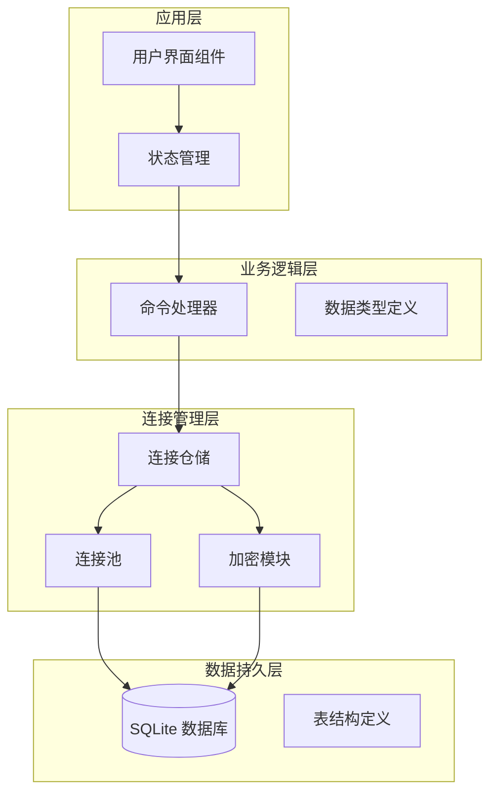

**图表来源**
- [mysql_connection_repo.rs:1-209](file://src-tauri/src/db/mysql_connection_repo.rs#L1-L209)
- [client_pool.rs:1-65](file://src-tauri/src/plugins/mysql/client_pool.rs#L1-L65)
- [commands.rs:1-615](file://src-tauri/src/plugins/mysql/commands.rs#L1-L615)

**章节来源**
- [mysql_connection_repo.rs:1-209](file://src-tauri/src/db/mysql_connection_repo.rs#L1-L209)
- [client_pool.rs:1-65](file://src-tauri/src/plugins/mysql/client_pool.rs#L1-L65)
- [commands.rs:1-615](file://src-tauri/src/plugins/mysql/commands.rs#L1-L615)

## 核心组件

### 连接信息模型

MySQL 连接仓储定义了完整的连接信息模型，支持 MySQL 特有的配置参数：

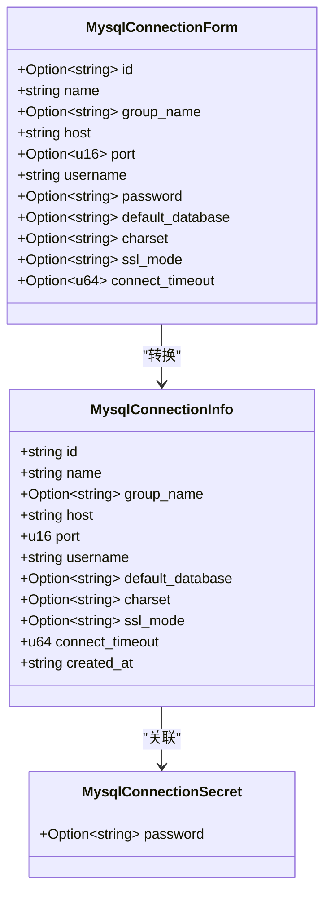

**图表来源**
- [mysql_connection_repo.rs:3-38](file://src-tauri/src/db/mysql_connection_repo.rs#L3-L38)

### 连接池管理

连接池是 MySQL 连接仓储的核心组件，负责高效的连接复用和资源管理：

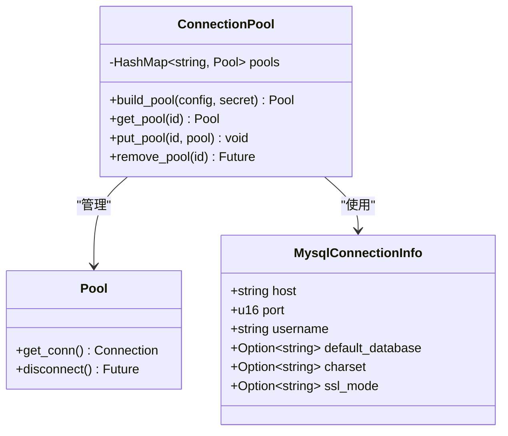

**图表来源**
- [client_pool.rs:1-65](file://src-tauri/src/plugins/mysql/client_pool.rs#L1-L65)

**章节来源**
- [mysql_connection_repo.rs:3-38](file://src-tauri/src/db/mysql_connection_repo.rs#L3-L38)
- [client_pool.rs:1-65](file://src-tauri/src/plugins/mysql/client_pool.rs#L1-L65)

## 架构概览

MySQL 连接仓储采用分层架构，实现了清晰的关注点分离：

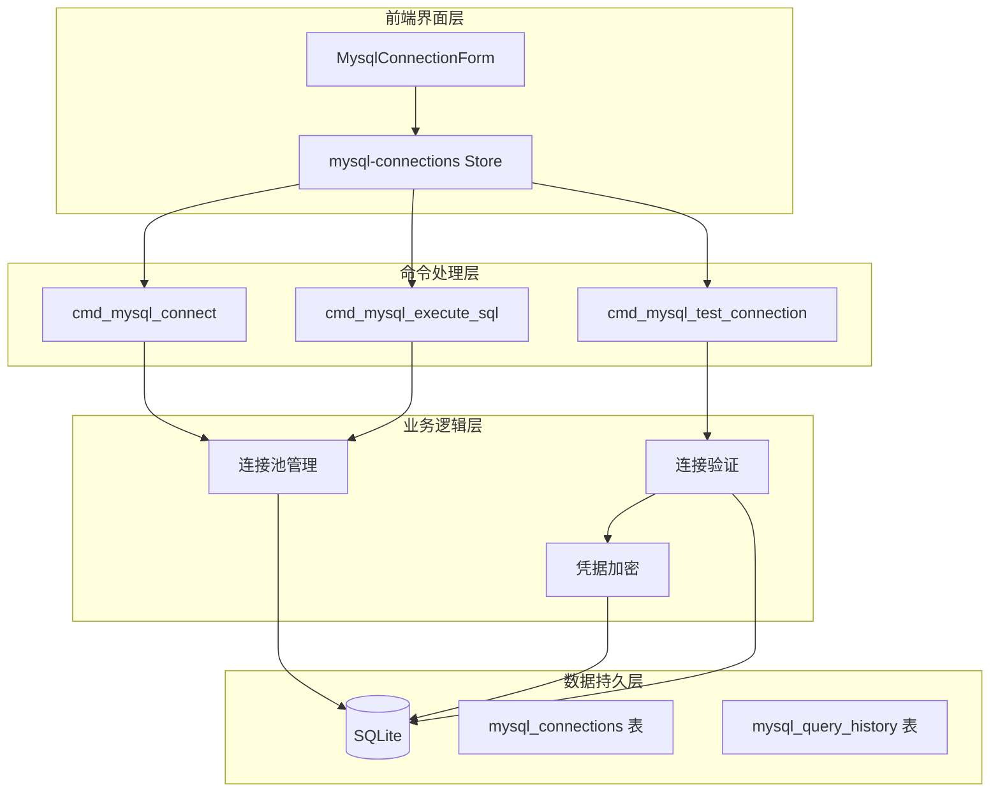

**图表来源**
- [commands.rs:176-214](file://src-tauri/src/plugins/mysql/commands.rs#L176-L214)
- [mysql_connection_repo.rs:108-183](file://src-tauri/src/db/mysql_connection_repo.rs#L108-L183)

**章节来源**
- [commands.rs:176-214](file://src-tauri/src/plugins/mysql/commands.rs#L176-L214)
- [mysql_connection_repo.rs:108-183](file://src-tauri/src/db/mysql_connection_repo.rs#L108-L183)

## 详细组件分析

### 连接验证流程

MySQL 连接验证流程确保连接的安全性和稳定性：

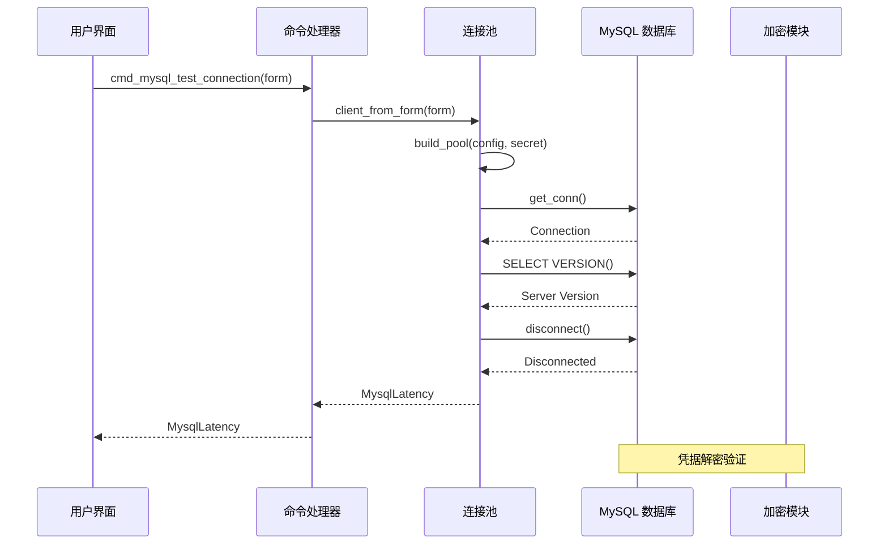

**图表来源**
- [commands.rs:193-199](file://src-tauri/src/plugins/mysql/commands.rs#L193-L199)
- [client_pool.rs:12-30](file://src-tauri/src/plugins/mysql/client_pool.rs#L12-L30)

连接验证包含以下关键步骤：
1. **服务器版本检测**：通过 `SELECT VERSION()` 获取 MySQL 服务器版本信息
2. **权限验证**：尝试建立数据库连接验证用户权限
3. **连接稳定性测试**：执行基本查询确保连接稳定
4. **超时控制**：基于 `connect_timeout` 参数控制连接超时

**章节来源**
- [commands.rs:193-199](file://src-tauri/src/plugins/mysql/commands.rs#L193-L199)
- [client_pool.rs:12-30](file://src-tauri/src/plugins/mysql/client_pool.rs#L12-L30)

### MySQL 特有连接参数

MySQL 连接仓储支持以下特有参数：

| 参数名称 | 类型 | 默认值 | 描述 |
|---------|------|--------|------|
| charset | String | utf8mb4 | 字符集设置，支持 utf8mb4 |
| ssl_mode | String | preferred | SSL 模式，支持 disabled/required |
| connect_timeout | u64 | 10秒 | 连接超时时间 |
| default_database | String | 可选 | 默认连接数据库 |

这些参数通过 `MysqlConnectionInfo` 和 `MysqlConnectionForm` 结构体进行管理，并在连接池构建时应用到 MySQL 连接配置中。

**章节来源**
- [mysql_connection_repo.rs:5-38](file://src-tauri/src/db/mysql_connection_repo.rs#L5-L38)
- [client_pool.rs:27-29](file://src-tauri/src/plugins/mysql/client_pool.rs#L27-L29)

### 连接信息存储格式

MySQL 连接信息采用 SQLite 数据库存储，表结构定义如下：

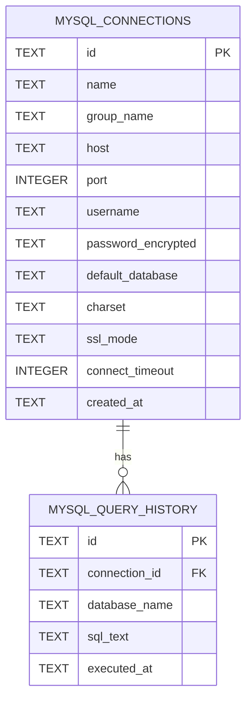

**图表来源**
- [init.rs:144-165](file://src-tauri/src/db/init.rs#L144-L165)

存储格式特点：
- **主键约束**：使用 UUID 作为连接 ID
- **默认值设置**：所有字段都有合理的默认值
- **索引优化**：按创建时间倒序排列便于最近连接查找
- **历史记录**：自动记录查询历史便于审计

**章节来源**
- [init.rs:144-165](file://src-tauri/src/db/init.rs#L144-L165)
- [mysql_connection_repo.rs:70-106](file://src-tauri/src/db/mysql_connection_repo.rs#L70-L106)

### 与核心连接仓储的扩展关系

MySQL 连接仓储继承自通用连接仓储，扩展了 MySQL 特有的功能：

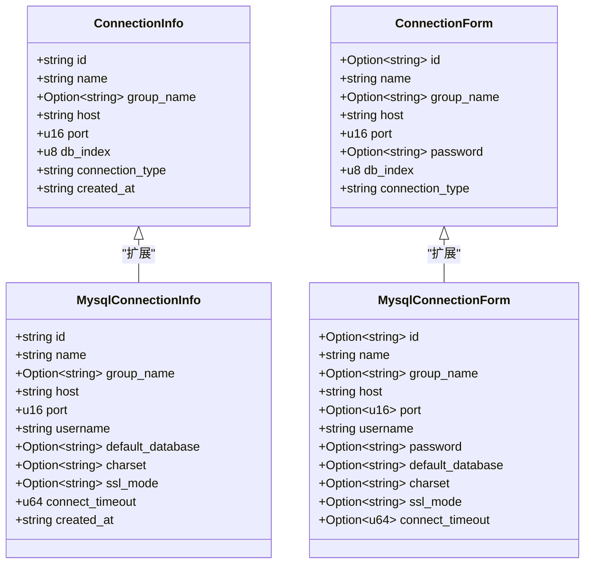

**图表来源**
- [connection_repo.rs:3-27](file://src-tauri/src/db/connection_repo.rs#L3-L27)
- [mysql_connection_repo.rs:3-38](file://src-tauri/src/db/mysql_connection_repo.rs#L3-L38)

**章节来源**
- [connection_repo.rs:3-27](file://src-tauri/src/db/connection_repo.rs#L3-L27)
- [mysql_connection_repo.rs:3-38](file://src-tauri/src/db/mysql_connection_repo.rs#L3-L38)

### 数据库操作功能

MySQL 连接仓储提供了完整的数据库操作功能：

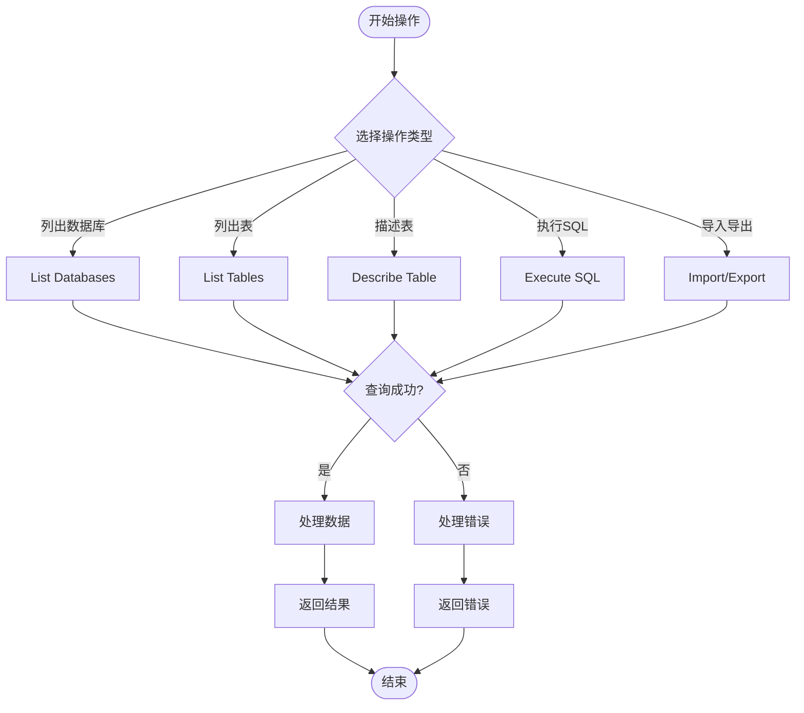

**图表来源**
- [commands.rs:217-230](file://src-tauri/src/plugins/mysql/commands.rs#L217-L230)
- [commands.rs:233-245](file://src-tauri/src/plugins/mysql/commands.rs#L233-L245)

**章节来源**
- [commands.rs:217-230](file://src-tauri/src/plugins/mysql/commands.rs#L217-L230)
- [commands.rs:233-245](file://src-tauri/src/plugins/mysql/commands.rs#L233-L245)

## 依赖分析

MySQL 连接仓储的依赖关系复杂且精心设计：

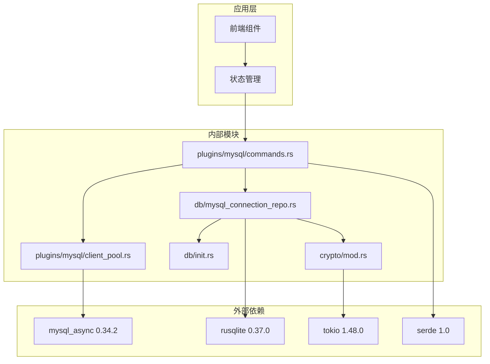

**图表来源**
- [Cargo.toml:20-48](file://src-tauri/Cargo.toml#L20-L48)
- [commands.rs:1-16](file://src-tauri/src/plugins/mysql/commands.rs#L1-L16)

**章节来源**
- [Cargo.toml:20-48](file://src-tauri/Cargo.toml#L20-L48)
- [commands.rs:1-16](file://src-tauri/src/plugins/mysql/commands.rs#L1-L16)

## 性能考虑

### 连接池优化策略

MySQL 连接仓储采用了多种连接池优化策略：

1. **静态连接池映射**：使用 `OnceLock` 实现线程安全的连接池缓存
2. **延迟初始化**：仅在需要时创建连接池实例
3. **智能重用**：连接断开后重新连接时自动复用现有池
4. **内存管理**：使用 `Arc<Mutex<HashMap>>` 确保并发安全

### 查询性能优化

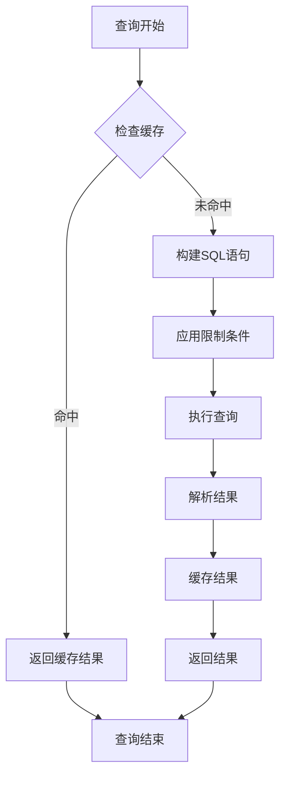

**图表来源**
- [commands.rs:297-322](file://src-tauri/src/plugins/mysql/commands.rs#L297-L322)

### 慢查询分析

MySQL 连接仓储内置了慢查询分析功能：

| 功能特性 | 实现方式 | 性能影响 |
|---------|----------|----------|
| 查询历史记录 | 自动记录每次查询 | 轻量级，可配置 |
| 执行时间统计 | 使用 `Instant::now()` | 微秒级精度 |
| 服务器状态监控 | `SHOW GLOBAL STATUS` | 定期轮询 |
| 连接池监控 | 连接池状态跟踪 | 实时监控 |

**章节来源**
- [commands.rs:418-444](file://src-tauri/src/plugins/mysql/commands.rs#L418-L444)
- [commands.rs:604-614](file://src-tauri/src/plugins/mysql/commands.rs#L604-L614)

## 故障排除指南

### 常见连接问题

| 问题类型 | 症状 | 解决方案 |
|---------|------|----------|
| 认证失败 | `Access denied` 错误 | 检查用户名密码，确认权限 |
| 连接超时 | `Connection timed out` | 增加 `connect_timeout`，检查网络 |
| SSL 连接失败 | `SSL connection failed` | 配置正确的 `ssl_mode` |
| 字符集问题 | `Illegal mix of collations` | 设置正确的 `charset` |

### 调试工具

MySQL 连接仓储提供了完善的调试工具：

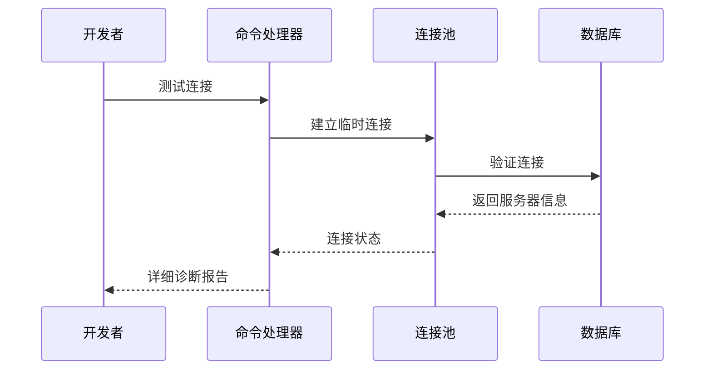

**图表来源**
- [commands.rs:193-199](file://src-tauri/src/plugins/mysql/commands.rs#L193-L199)

**章节来源**
- [commands.rs:193-199](file://src-tauri/src/plugins/mysql/commands.rs#L193-L199)

### 最佳实践建议

1. **连接池配置**：根据应用负载调整连接池大小
2. **超时设置**：合理设置连接和查询超时时间
3. **字符集统一**：确保客户端和服务器字符集一致
4. **SSL 配置**：生产环境使用 `ssl_mode = required`
5. **监控告警**：定期检查连接池健康状态

**章节来源**
- [mysql_connection_repo.rs:166-168](file://src-tauri/src/db/mysql_connection_repo.rs#L166-L168)
- [client_pool.rs:27-29](file://src-tauri/src/plugins/mysql/client_pool.rs#L27-L29)

## 结论

DevNexus 的 MySQL 连接仓储是一个设计精良、功能完备的数据库连接管理系统。它通过以下关键特性实现了高性能和高可用性：

1. **模块化设计**：清晰的分层架构便于维护和扩展
2. **安全性保障**：完整的凭据加密和访问控制机制
3. **性能优化**：智能连接池管理和查询优化策略
4. **监控能力**：全面的连接状态监控和慢查询分析
5. **用户体验**：直观的前端界面和丰富的数据库操作功能

该系统为开发者提供了可靠的 MySQL 连接管理解决方案，适用于各种规模的应用场景。通过遵循最佳实践和定期监控，可以确保系统的稳定运行和优异性能。