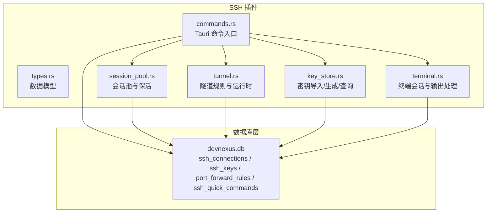
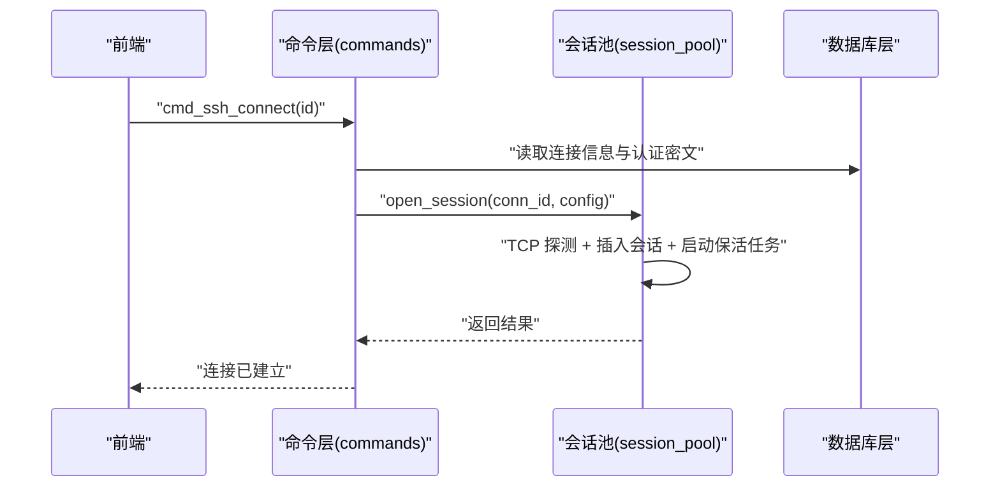
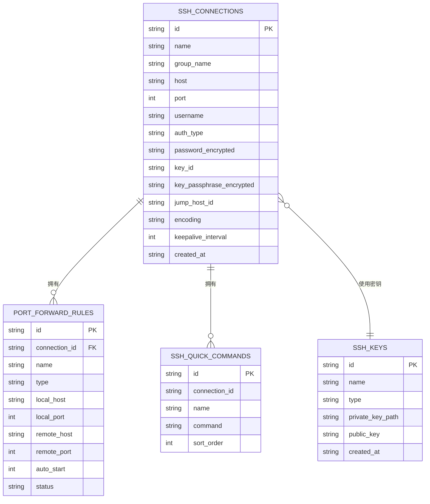
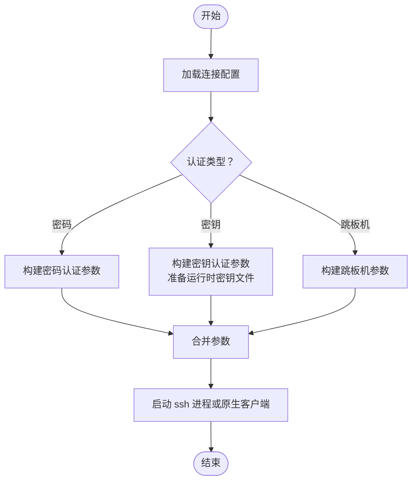
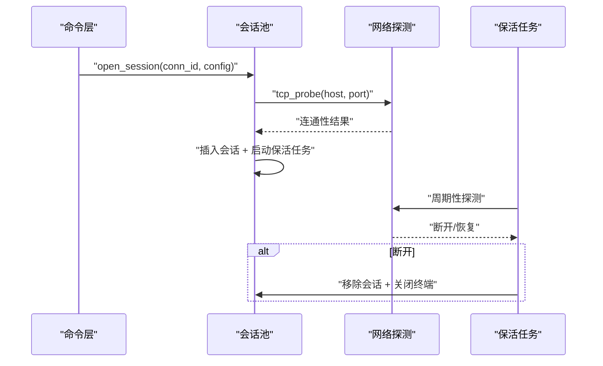
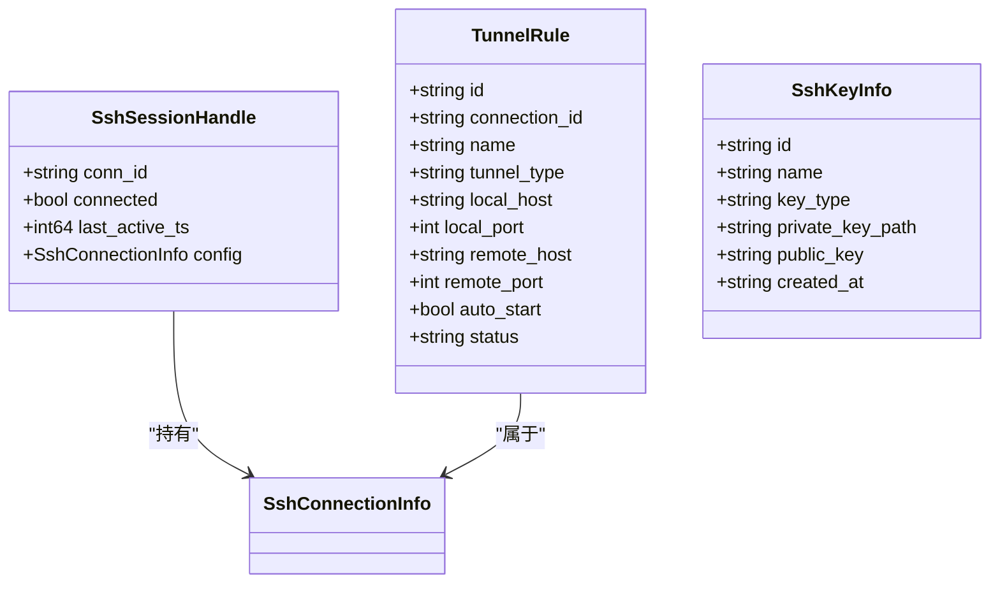
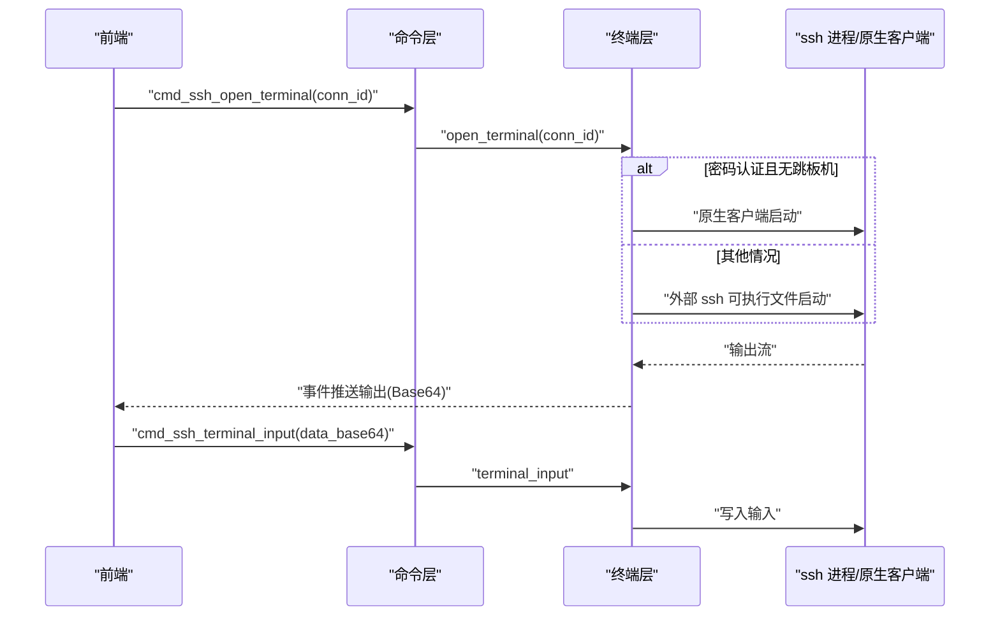
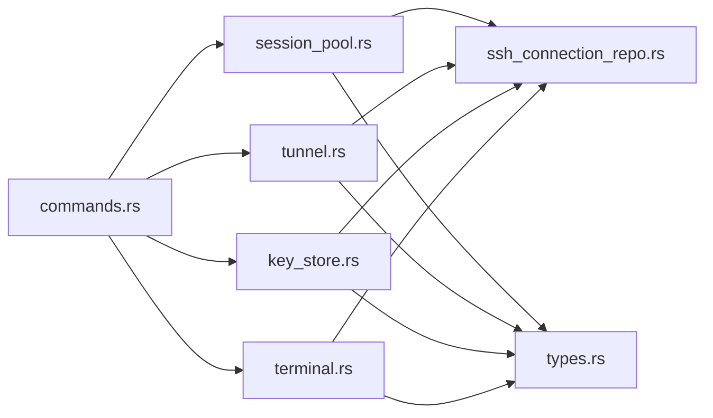

# SSH 连接仓储

<cite>
**本文引用的文件**
- [src-tauri/src/db/ssh_connection_repo.rs](file://src-tauri/src/db/ssh_connection_repo.rs)
- [src-tauri/src/plugins/ssh/mod.rs](file://src-tauri/src/plugins/ssh/mod.rs)
- [src-tauri/src/plugins/ssh/types.rs](file://src-tauri/src/plugins/ssh/types.rs)
- [src-tauri/src/plugins/ssh/key_store.rs](file://src-tauri/src/plugins/ssh/key_store.rs)
- [src-tauri/src/plugins/ssh/session_pool.rs](file://src-tauri/src/plugins/ssh/session_pool.rs)
- [src-tauri/src/plugins/ssh/tunnel.rs](file://src-tauri/src/plugins/ssh/tunnel.rs)
- [src-tauri/src/plugins/ssh/commands.rs](file://src-tauri/src/plugins/ssh/commands.rs)
- [src-tauri/src/plugins/ssh/terminal.rs](file://src-tauri/src/plugins/ssh/terminal.rs)
- [src-tauri/src/db/init.rs](file://src-tauri/src/db/init.rs)
</cite>

## 目录
1. [简介](#简介)
2. [项目结构](#项目结构)
3. [核心组件](#核心组件)
4. [架构总览](#架构总览)
5. [详细组件分析](#详细组件分析)
6. [依赖分析](#依赖分析)
7. [性能考量](#性能考量)
8. [故障排除指南](#故障排除指南)
9. [结论](#结论)
10. [附录](#附录)

## 简介
本文件面向 DevNexus 的 SSH 连接仓储，系统性阐述其设计与实现要点，覆盖以下主题：
- SSH 连接仓储的数据模型与持久化
- SSH 认证方式（密码认证、密钥认证、跳板机支持）
- 连接参数配置与安全策略
- 连接验证流程（TCP 探测、认证成功测试、连接稳定性检查）
- 连接信息存储格式与密钥管理
- 与核心连接仓储的扩展关系与集成点
- 会话管理、隧道配置与密钥存储的安全考虑
- 故障排除、密钥管理与安全最佳实践

## 项目结构
SSH 功能由 Rust 后端插件与数据库层共同组成，前端通过 Tauri 命令调用后端能力。关键模块如下：
- 数据库层：负责 SSH 连接信息、密钥、快速命令、端口转发规则等的持久化
- SSH 插件：提供命令接口、会话池、密钥存储、隧道管理、终端会话
- 类型定义：统一前后端交互的数据结构

**图表来源**
- [src-tauri/src/plugins/ssh/commands.rs:1-266](file://src-tauri/src/plugins/ssh/commands.rs#L1-L266)
- [src-tauri/src/db/ssh_connection_repo.rs:1-218](file://src-tauri/src/db/ssh_connection_repo.rs#L1-L218)
- [src-tauri/src/plugins/ssh/session_pool.rs:1-172](file://src-tauri/src/plugins/ssh/session_pool.rs#L1-L172)
- [src-tauri/src/plugins/ssh/tunnel.rs:1-220](file://src-tauri/src/plugins/ssh/tunnel.rs#L1-L220)
- [src-tauri/src/plugins/ssh/key_store.rs:1-153](file://src-tauri/src/plugins/ssh/key_store.rs#L1-L153)
- [src-tauri/src/plugins/ssh/terminal.rs:1-870](file://src-tauri/src/plugins/ssh/terminal.rs#L1-L870)

**章节来源**
- [src-tauri/src/plugins/ssh/mod.rs:1-7](file://src-tauri/src/plugins/ssh/mod.rs#L1-L7)
- [src-tauri/src/db/init.rs:1-373](file://src-tauri/src/db/init.rs#L1-L373)

## 核心组件
- SSH 连接信息模型：包含主机、端口、用户名、认证类型、密钥 ID、跳板机 ID、编码、保活间隔等字段
- SSH 连接表单模型：用于保存连接时的输入，含可选密码、密钥口令等
- 密钥模型：密钥名称、类型、私钥路径、公钥摘要、创建时间
- 隧道规则模型：本地/远程/动态三种类型，支持自动启动与状态管理
- 快速命令模型：按连接分组或全局的命令模板
- 会话句柄：记录连接 ID、连接状态、最后活跃时间与配置副本
- 终端会话：封装进程或原生客户端会话，负责输入输出与事件广播

**章节来源**
- [src-tauri/src/db/ssh_connection_repo.rs:5-36](file://src-tauri/src/db/ssh_connection_repo.rs#L5-L36)
- [src-tauri/src/plugins/ssh/types.rs:1-93](file://src-tauri/src/plugins/ssh/types.rs#L1-L93)
- [src-tauri/src/plugins/ssh/session_pool.rs:8-15](file://src-tauri/src/plugins/ssh/session_pool.rs#L8-L15)

## 架构总览
SSH 连接仓储采用“命令入口 + 模块化子系统”的分层设计：
- 命令层：暴露 Tauri 命令，协调各子模块完成业务操作
- 会话层：维护连接生命周期与网络保活
- 隧道层：管理端口转发规则与运行时状态
- 终端层：封装 SSH 客户端或系统 ssh 可执行文件，处理交互式会话
- 密钥层：安全存储与派生公钥，支持导入与生成
- 数据层：SQLite 持久化，提供 CRUD 与查询

**图表来源**
- [src-tauri/src/plugins/ssh/commands.rs:65-75](file://src-tauri/src/plugins/ssh/commands.rs#L65-L75)
- [src-tauri/src/plugins/ssh/session_pool.rs:105-139](file://src-tauri/src/plugins/ssh/session_pool.rs#L105-L139)

**章节来源**
- [src-tauri/src/plugins/ssh/commands.rs:1-266](file://src-tauri/src/plugins/ssh/commands.rs#L1-L266)
- [src-tauri/src/plugins/ssh/session_pool.rs:1-172](file://src-tauri/src/plugins/ssh/session_pool.rs#L1-L172)

## 详细组件分析

### SSH 连接仓储与数据模型
- 连接信息模型包含认证类型、可选密钥 ID、可选跳板机 ID、编码与保活间隔
- 表单模型支持保存密码与密钥口令，并在入库前进行加密
- 数据库初始化时创建 ssh_connections、ssh_keys、port_forward_rules、ssh_quick_commands 等表

**图表来源**
- [src-tauri/src/db/init.rs:56-101](file://src-tauri/src/db/init.rs#L56-L101)
- [src-tauri/src/db/ssh_connection_repo.rs:5-36](file://src-tauri/src/db/ssh_connection_repo.rs#L5-L36)

**章节来源**
- [src-tauri/src/db/ssh_connection_repo.rs:1-218](file://src-tauri/src/db/ssh_connection_repo.rs#L1-L218)
- [src-tauri/src/db/init.rs:35-101](file://src-tauri/src/db/init.rs#L35-L101)

### SSH 认证方式与连接参数配置
- 支持的认证类型：
  - 密码认证：通过表单保存并加密存储，连接时解密使用
  - 密钥认证：通过 key_id 关联到密钥表，运行时将私钥复制到受控目录并设置权限
  - 跳板机支持：当存在 jump_host_id 时，构建 -J 参数并注入跳板机密码响应
- 连接参数：
  - 主机、端口、用户名
  - 编码（默认 utf-8）
  - 保活间隔（默认 30 秒）
  - 主机密钥检查策略（严格模式下接受新密钥）

**图表来源**
- [src-tauri/src/plugins/ssh/terminal.rs:286-368](file://src-tauri/src/plugins/ssh/terminal.rs#L286-L368)
- [src-tauri/src/plugins/ssh/terminal.rs:522-694](file://src-tauri/src/plugins/ssh/terminal.rs#L522-L694)

**章节来源**
- [src-tauri/src/db/ssh_connection_repo.rs:22-36](file://src-tauri/src/db/ssh_connection_repo.rs#L22-L36)
- [src-tauri/src/plugins/ssh/terminal.rs:286-368](file://src-tauri/src/plugins/ssh/terminal.rs#L286-L368)

### 连接验证流程
- TCP 握手验证：在打开会话前对目标主机与端口进行 TCP 探测，确保可达
- 认证成功测试：通过原生客户端路径进行密码认证，验证凭据正确性
- 连接稳定性检查：启动保活任务，周期性探测目标连通性；若断开则尝试重连，失败则清理会话与终端资源

**图表来源**
- [src-tauri/src/plugins/ssh/session_pool.rs:105-139](file://src-tauri/src/plugins/ssh/session_pool.rs#L105-L139)
- [src-tauri/src/plugins/ssh/session_pool.rs:50-103](file://src-tauri/src/plugins/ssh/session_pool.rs#L50-L103)

**章节来源**
- [src-tauri/src/plugins/ssh/session_pool.rs:1-172](file://src-tauri/src/plugins/ssh/session_pool.rs#L1-L172)
- [src-tauri/src/plugins/ssh/commands.rs:30-62](file://src-tauri/src/plugins/ssh/commands.rs#L30-L62)

### SSH 连接信息存储格式
- 连接信息字段：id、name、group_name、host、port、username、auth_type、key_id、jump_host_id、encoding、keepalive_interval、created_at
- 认证密文：password_encrypted、key_passphrase_encrypted，均通过加密模块进行加解密
- 密钥信息：id、name、type、private_key_path、public_key、created_at
- 快速命令：id、connection_id、name、command、sort_order
- 隧道规则：id、connection_id、name、type、local_host、local_port、remote_host、remote_port、auto_start、status

**章节来源**
- [src-tauri/src/db/ssh_connection_repo.rs:5-36](file://src-tauri/src/db/ssh_connection_repo.rs#L5-L36)
- [src-tauri/src/plugins/ssh/types.rs:17-92](file://src-tauri/src/plugins/ssh/types.rs#L17-L92)

### 与核心连接仓储的扩展关系
- SSH 连接仓储独立于其他数据库连接类型，但共享同一 SQLite 数据库与初始化流程
- 通过统一的命令入口暴露功能，便于前端以一致的方式调用不同类型的连接仓储
- 加密模块在保存连接时统一处理敏感信息，保证跨类型的一致安全性

**章节来源**
- [src-tauri/src/db/init.rs:35-101](file://src-tauri/src/db/init.rs#L35-L101)
- [src-tauri/src/plugins/ssh/commands.rs:16-21](file://src-tauri/src/plugins/ssh/commands.rs#L16-L21)

### 会话管理、隧道配置与密钥存储安全
- 会话管理：
  - 使用静态互斥池维护会话句柄，支持并发安全访问
  - 保活任务基于 TCP 探测与指数回退重连策略，断线后清理资源并发出关闭事件
- 隧道配置：
  - 规则持久化与运行时映射分离，支持本地/远程/动态三种转发类型
  - 启动时校验必需参数，运行中更新状态并支持停止
- 密钥存储安全：
  - 导入密钥时推断类型与派生公钥摘要
  - 生成虚拟公钥用于显示，不暴露真实公钥内容
  - 运行时密钥文件写入应用数据目录的受控子目录，Windows 下设置 ACL 权限

**图表来源**
- [src-tauri/src/plugins/ssh/session_pool.rs:8-15](file://src-tauri/src/plugins/ssh/session_pool.rs#L8-L15)
- [src-tauri/src/plugins/ssh/types.rs:56-92](file://src-tauri/src/plugins/ssh/types.rs#L56-L92)
- [src-tauri/src/plugins/ssh/key_store.rs:17-24](file://src-tauri/src/plugins/ssh/key_store.rs#L17-L24)

**章节来源**
- [src-tauri/src/plugins/ssh/session_pool.rs:1-172](file://src-tauri/src/plugins/ssh/session_pool.rs#L1-L172)
- [src-tauri/src/plugins/ssh/tunnel.rs:1-220](file://src-tauri/src/plugins/ssh/tunnel.rs#L1-L220)
- [src-tauri/src/plugins/ssh/key_store.rs:1-153](file://src-tauri/src/plugins/ssh/key_store.rs#L1-L153)

### 终端会话与交互
- 终端会话分为两类：
  - 原生密码会话：直接使用 russh 客户端进行密码认证与交互
  - 外部 ssh 会话：通过系统 ssh 可执行文件启动，自动注入密钥与跳板机参数
- 输出处理：将二进制输出进行 Base64 编码并通过事件广播给前端
- 输入处理：支持 resize 与数据输入，动态调整伪终端大小
- 密钥安全：运行时密钥文件在会话结束后清理

**图表来源**
- [src-tauri/src/plugins/ssh/commands.rs:78-101](file://src-tauri/src/plugins/ssh/commands.rs#L78-L101)
- [src-tauri/src/plugins/ssh/terminal.rs:522-694](file://src-tauri/src/plugins/ssh/terminal.rs#L522-L694)

**章节来源**
- [src-tauri/src/plugins/ssh/commands.rs:78-106](file://src-tauri/src/plugins/ssh/commands.rs#L78-L106)
- [src-tauri/src/plugins/ssh/terminal.rs:1-870](file://src-tauri/src/plugins/ssh/terminal.rs#L1-L870)

## 依赖分析
- 模块内聚与耦合：
  - commands.rs 作为单一职责的命令入口，依赖各子模块的公共接口
  - session_pool.rs 与 terminal.rs 通过会话句柄与命令入口交互
  - key_store.rs 与 ssh_connection_repo.rs 通过数据库层协同工作
- 外部依赖：
  - russh：用于原生客户端认证与通道管理
  - tokio：异步运行时，支撑保活与事件循环
  - rusqlite：SQLite 访问
  - base64：输出编码与密钥派生辅助

**图表来源**
- [src-tauri/src/plugins/ssh/commands.rs:1-266](file://src-tauri/src/plugins/ssh/commands.rs#L1-L266)
- [src-tauri/src/plugins/ssh/session_pool.rs:1-172](file://src-tauri/src/plugins/ssh/session_pool.rs#L1-L172)
- [src-tauri/src/plugins/ssh/tunnel.rs:1-220](file://src-tauri/src/plugins/ssh/tunnel.rs#L1-L220)
- [src-tauri/src/plugins/ssh/key_store.rs:1-153](file://src-tauri/src/plugins/ssh/key_store.rs#L1-L153)
- [src-tauri/src/plugins/ssh/terminal.rs:1-870](file://src-tauri/src/plugins/ssh/terminal.rs#L1-L870)
- [src-tauri/src/plugins/ssh/types.rs:1-93](file://src-tauri/src/plugins/ssh/types.rs#L1-L93)
- [src-tauri/src/db/ssh_connection_repo.rs:1-218](file://src-tauri/src/db/ssh_connection_repo.rs#L1-L218)

**章节来源**
- [src-tauri/src/plugins/ssh/mod.rs:1-7](file://src-tauri/src/plugins/ssh/mod.rs#L1-L7)

## 性能考量
- 会话保活：基于配置的 keepalive_interval 周期探测，避免长时间空闲导致的连接中断
- 异步 I/O：终端输出与输入采用异步通道与阻塞读取结合，减少主线程压力
- 资源回收：断线与关闭时及时释放锁、终止任务、删除临时密钥文件
- 数据库访问：所有 CRUD 操作在必要范围内批量执行，避免频繁 IO

[本节为通用指导，无需列出具体文件来源]

## 故障排除指南
- 连接无法建立
  - 检查主机与端口是否可达（TCP 探测失败会报错）
  - 确认认证类型与凭据匹配（密码为空或密钥缺失会导致认证失败）
  - 若使用密钥认证，确认密钥文件存在且可读
- 认证失败
  - 密码认证：确认密码正确且服务器允许该认证方式
  - 密钥认证：确认私钥与公钥匹配，运行时密钥文件权限正确
  - 跳板机：确认跳板机凭据正确且可达
- 连接不稳定
  - 提高 keepalive_interval 或启用自动重连
  - 检查网络波动与防火墙策略
- 终端无输出
  - 检查 Base64 输出事件是否被前端监听
  - 确认会话未提前退出（查看退出事件）
- 隧道无法启动
  - 校验规则参数（本地/远程端口、主机等）
  - 确认会话处于活动状态后再启动隧道

**章节来源**
- [src-tauri/src/plugins/ssh/session_pool.rs:105-139](file://src-tauri/src/plugins/ssh/session_pool.rs#L105-L139)
- [src-tauri/src/plugins/ssh/terminal.rs:522-694](file://src-tauri/src/plugins/ssh/terminal.rs#L522-L694)
- [src-tauri/src/plugins/ssh/tunnel.rs:132-199](file://src-tauri/src/plugins/ssh/tunnel.rs#L132-L199)

## 结论
DevNexus 的 SSH 连接仓储通过清晰的模块划分与严格的生命周期管理，提供了稳定、安全且易用的 SSH 连接能力。其特性包括：
- 完整的认证支持与灵活的连接参数配置
- 健壮的会话保活与断线恢复机制
- 安全的密钥存储与运行时密钥处理
- 可靠的隧道管理与终端交互
- 与核心连接仓储的良好扩展关系

[本节为总结性内容，无需列出具体文件来源]

## 附录

### 安全最佳实践
- 密钥管理
  - 优先使用受控目录下的运行时密钥文件，避免长期暴露
  - 在 Windows 上设置最小权限 ACL，仅授予当前用户读取权限
  - 定期轮换密钥并清理不再使用的密钥文件
- 认证策略
  - 优先使用密钥认证，避免长期使用弱密码
  - 对于跳板机，建议同样采用密钥认证
- 网络与会话
  - 合理设置 keepalive_interval，平衡资源占用与连接稳定性
  - 在不可信网络中谨慎使用“接受新主机密钥”策略，建议手动校验首次连接
- 日志与监控
  - 记录连接事件与错误日志，便于审计与排障
  - 监控会话池与隧道运行状态，及时发现异常

**章节来源**
- [src-tauri/src/plugins/ssh/key_store.rs:218-284](file://src-tauri/src/plugins/ssh/key_store.rs#L218-L284)
- [src-tauri/src/plugins/ssh/terminal.rs:174-179](file://src-tauri/src/plugins/ssh/terminal.rs#L174-L179)
- [src-tauri/src/plugins/ssh/session_pool.rs:50-103](file://src-tauri/src/plugins/ssh/session_pool.rs#L50-L103)