# 仓储模式实现

<cite>
**本文档引用的文件**
- [connection_repo.rs](file://src-tauri/src/db/connection_repo.rs)
- [mongodb_connection_repo.rs](file://src-tauri/src/db/mongodb_connection_repo.rs)
- [mysql_connection_repo.rs](file://src-tauri/src/db/mysql_connection_repo.rs)
- [s3_connection_repo.rs](file://src-tauri/src/db/s3_connection_repo.rs)
- [ssh_connection_repo.rs](file://src-tauri/src/db/ssh_connection_repo.rs)
- [init.rs](file://src-tauri/src/db/init.rs)
- [mod.rs](file://src-tauri/src/db/mod.rs)
- [mod.rs](file://src-tauri/src/crypto/mod.rs)
- [commands.rs](file://src-tauri/src/plugins/redis/commands.rs)
- [commands.rs](file://src-tauri/src/plugins/mongodb/commands.rs)
- [commands.rs](file://src-tauri/src/plugins/mysql/commands.rs)
</cite>

## 目录
1. [引言](#引言)
2. [项目结构](#项目结构)
3. [核心组件](#核心组件)
4. [架构概览](#架构概览)
5. [详细组件分析](#详细组件分析)
6. [依赖关系分析](#依赖关系分析)
7. [性能考虑](#性能考虑)
8. [故障排除指南](#故障排除指南)
9. [结论](#结论)

## 引言

DevNexus 采用仓储模式（Repository Pattern）实现了统一的数据访问层抽象，通过将不同类型的连接配置存储在本地 SQLite 数据库中，为各种数据库和云服务客户端提供了标准化的数据访问接口。该模式的核心目标是实现数据访问层与业务逻辑的分离，提高代码的可测试性和可维护性。

仓储模式在 DevNexus 中通过以下方式实现：
- 统一的数据访问接口：所有连接类型都遵循相同的 CRUD 操作规范
- 数据验证和业务规则：在保存连接时执行必要的数据验证和业务规则检查
- 加密存储：敏感信息（密码、密钥等）通过 AES-GCM 加密算法进行安全存储
- 测试友好性：通过接口抽象使得单元测试更加简单直接

## 项目结构

DevNexus 的仓储模式实现主要位于 `src-tauri/src/db/` 目录下，采用模块化设计：

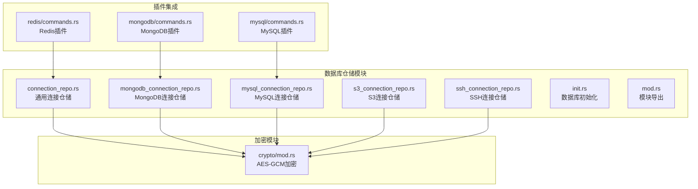

**图表来源**
- [mod.rs:1-8](file://src-tauri/src/db/mod.rs#L1-L8)
- [init.rs:35-133](file://src-tauri/src/db/init.rs#L35-L133)

**章节来源**
- [mod.rs:1-8](file://src-tauri/src/db/mod.rs#L1-L8)
- [init.rs:35-133](file://src-tauri/src/db/init.rs#L35-L133)

## 核心组件

### 数据库初始化和表结构

系统启动时会自动初始化数据库结构，创建所有必要的表：

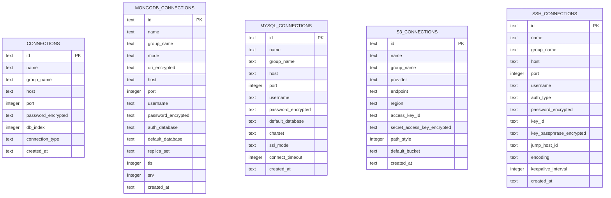

**图表来源**
- [init.rs:37-133](file://src-tauri/src/db/init.rs#L37-L133)

### 加密模块设计

系统使用 AES-GCM 对称加密算法保护敏感数据：

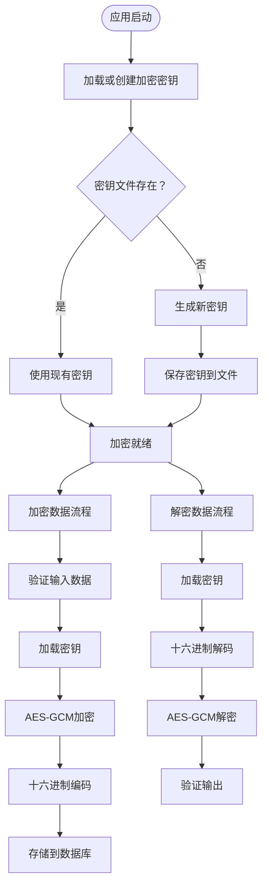

**图表来源**
- [mod.rs:21-74](file://src-tauri/src/crypto/mod.rs#L21-L74)

**章节来源**
- [init.rs:35-363](file://src-tauri/src/db/init.rs#L35-L363)
- [mod.rs:1-75](file://src-tauri/src/crypto/mod.rs#L1-L75)

## 架构概览

DevNexus 的仓储模式采用分层架构设计，实现了清晰的关注点分离：

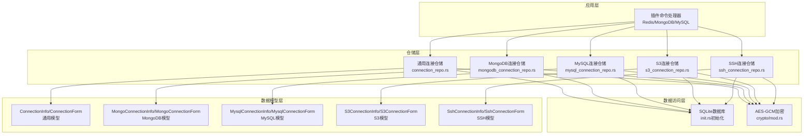

**图表来源**
- [connection_repo.rs:1-174](file://src-tauri/src/db/connection_repo.rs#L1-L174)
- [mongodb_connection_repo.rs:1-249](file://src-tauri/src/db/mongodb_connection_repo.rs#L1-L249)
- [mysql_connection_repo.rs:1-209](file://src-tauri/src/db/mysql_connection_repo.rs#L1-L209)
- [s3_connection_repo.rs:1-188](file://src-tauri/src/db/s3_connection_repo.rs#L1-L188)
- [ssh_connection_repo.rs:1-218](file://src-tauri/src/db/ssh_connection_repo.rs#L1-L218)

## 详细组件分析

### 通用连接仓储（connection_repo.rs）

通用连接仓储为 Redis 等基于简单连接参数的服务提供基础实现：

#### 核心数据结构

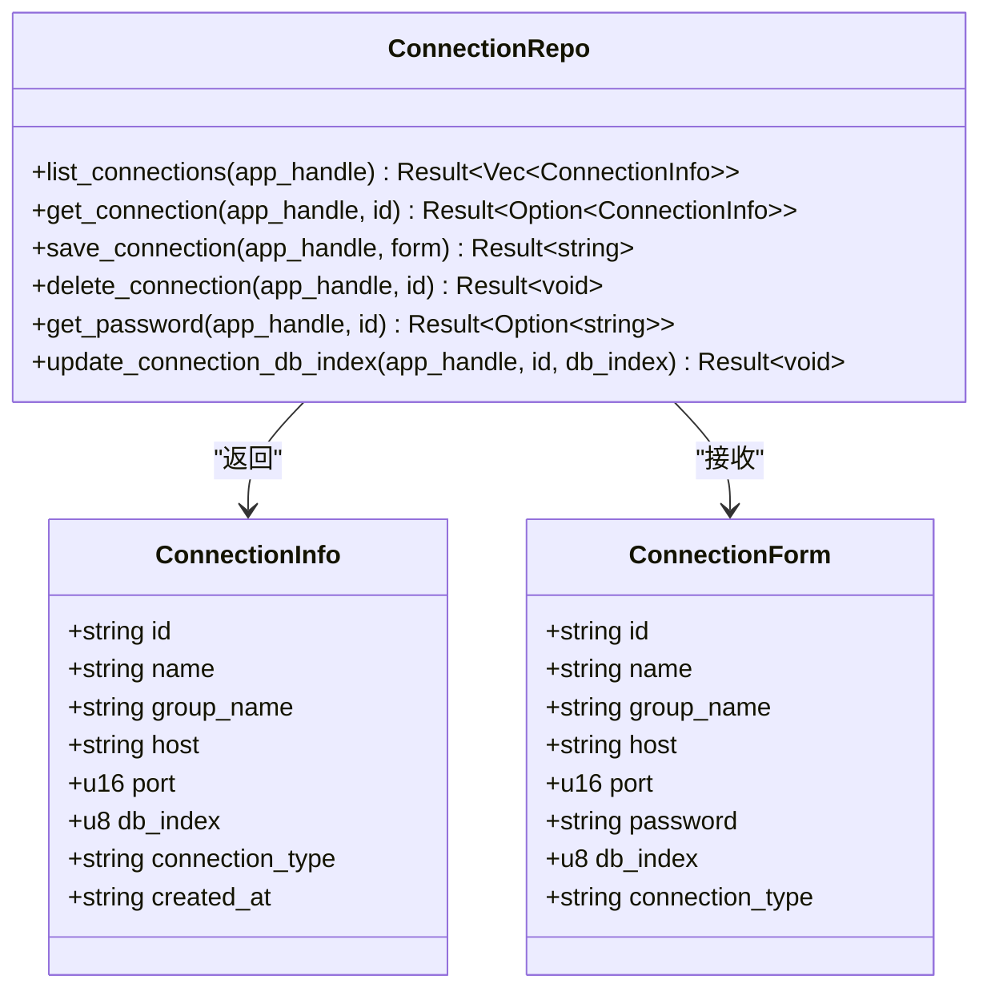

**图表来源**
- [connection_repo.rs:3-27](file://src-tauri/src/db/connection_repo.rs#L3-L27)

#### CRUD 操作流程

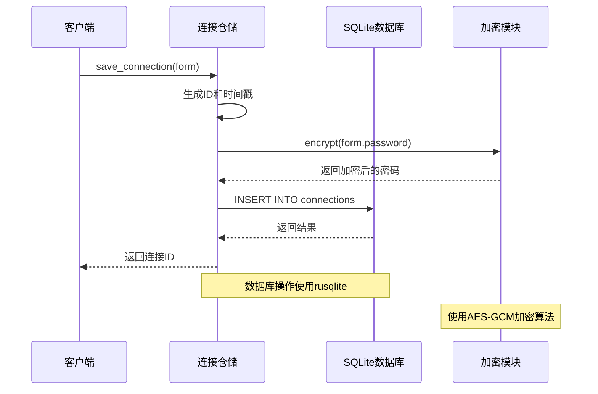

**图表来源**
- [connection_repo.rs:96-131](file://src-tauri/src/db/connection_repo.rs#L96-L131)

**章节来源**
- [connection_repo.rs:1-174](file://src-tauri/src/db/connection_repo.rs#L1-L174)

### MongoDB 连接仓储

MongoDB 连接仓储支持两种连接模式：URI 模式和表单模式，并提供更复杂的安全配置选项。

#### 连接模式对比

| 特性 | URI 模式 | 表单模式 |
|------|----------|----------|
| 连接字符串 | 支持完整的 MongoDB URI | 需要手动填写各参数 |
| 认证方式 | 支持多种认证机制 | 仅支持用户名密码 |
| TLS 支持 | 完整支持 | 支持 TLS 和 SRV |
| 复制集 | 支持副本集配置 | 支持副本集名称 |
| 默认数据库 | 从 URI 解析 | 需要单独设置 |

#### 数据验证流程

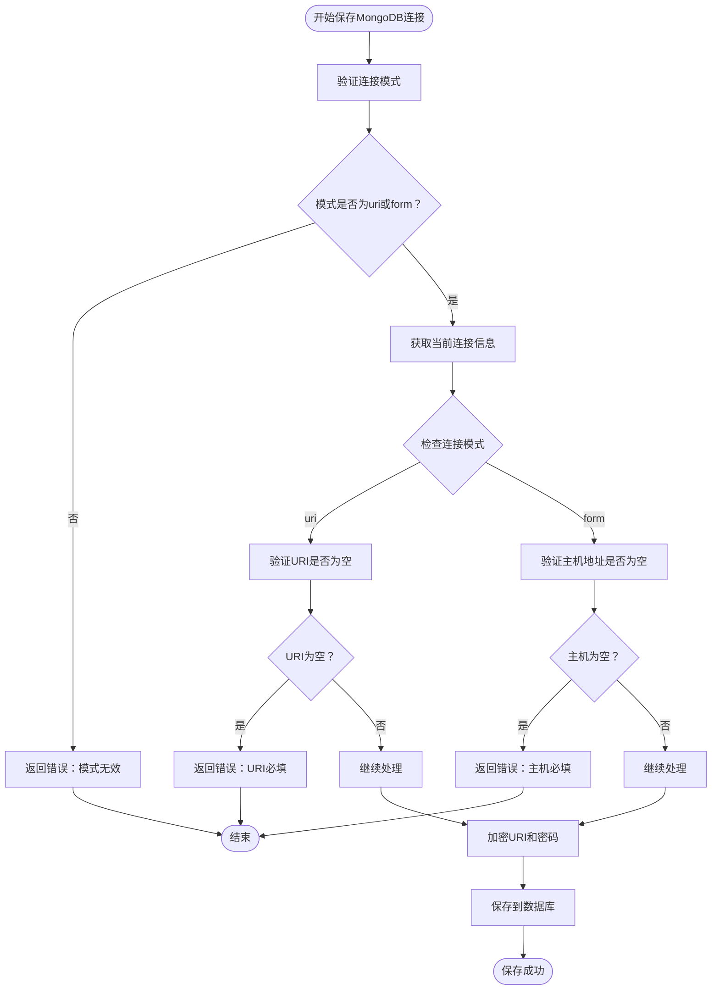

**图表来源**
- [mongodb_connection_repo.rs:115-202](file://src-tauri/src/db/mongodb_connection_repo.rs#L115-L202)

**章节来源**
- [mongodb_connection_repo.rs:1-249](file://src-tauri/src/db/mongodb_connection_repo.rs#L1-L249)

### MySQL 连接仓储

MySQL 连接仓储专注于关系型数据库连接，提供详细的字符集和 SSL 配置选项。

#### 核心特性

- **字符集配置**：默认 utf8mb4，支持自定义字符集
- **SSL 模式**：支持 preferred、required、disabled 等多种模式
- **连接超时**：可配置连接超时时间，默认 10 秒
- **默认数据库**：支持指定默认连接的数据库

#### 数据验证规则

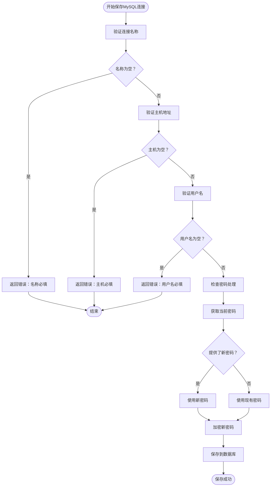

**图表来源**
- [mysql_connection_repo.rs:108-176](file://src-tauri/src/db/mysql_connection_repo.rs#L108-L176)

**章节来源**
- [mysql_connection_repo.rs:1-209](file://src-tauri/src/db/mysql_connection_repo.rs#L1-L209)

### S3 连接仓储

S3 连接仓储支持多种云存储提供商，提供灵活的访问密钥管理和区域配置。

#### 支持的提供商

- **AWS S3**：标准 AWS 服务
- **MinIO**：开源对象存储
- **阿里云 OSS**：阿里云对象存储服务
- **腾讯云 COS**：腾讯云对象存储
- **其他兼容 S3 API 的服务**

#### 关键配置项

| 配置项 | 描述 | 默认值 |
|--------|------|--------|
| provider | 云存储提供商 | 必填 |
| endpoint | 自定义端点 | 可选 |
| region | 区域标识 | 必填 |
| access_key_id | 访问密钥ID | 必填 |
| secret_access_key | 秘密访问密钥 | 必填 |
| path_style | 路径样式访问 | false |
| default_bucket | 默认存储桶 | 可选 |

**章节来源**
- [s3_connection_repo.rs:1-188](file://src-tauri/src/db/s3_connection_repo.rs#L1-L188)

### SSH 连接仓储

SSH 连接仓储支持多种认证方式和高级连接选项。

#### 认证方式

- **密码认证**：使用用户名和密码登录
- **密钥认证**：使用私钥文件进行认证
- **混合认证**：支持多种认证方式组合

#### 高级功能

- **跳板机支持**：通过中间服务器连接目标主机
- **Keep-Alive**：配置连接保活间隔
- **编码设置**：自定义终端编码格式
- **密钥管理**：内置 SSH 密钥存储和管理

**章节来源**
- [ssh_connection_repo.rs:1-218](file://src-tauri/src/db/ssh_connection_repo.rs#L1-L218)

## 依赖关系分析

### 模块依赖图

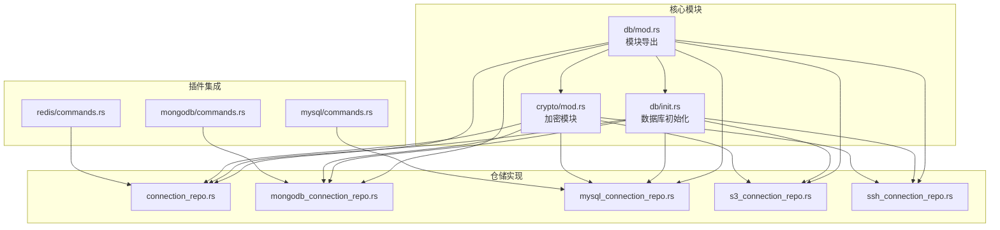

**图表来源**
- [mod.rs:1-8](file://src-tauri/src/db/mod.rs#L1-L8)
- [commands.rs:9-14](file://src-tauri/src/plugins/redis/commands.rs#L9-L14)

### 数据流分析

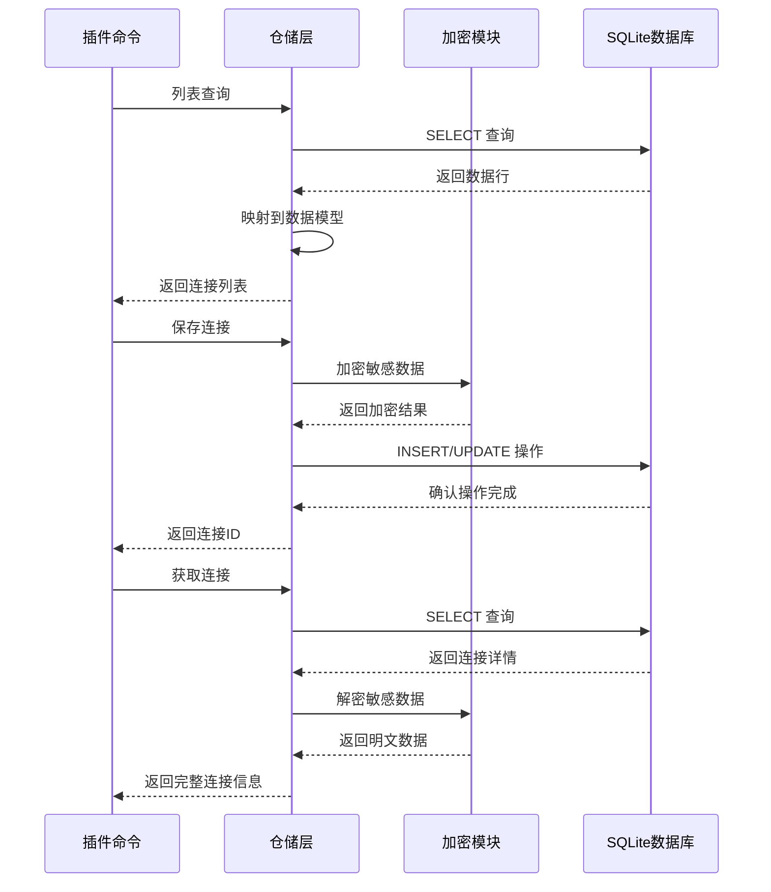

**图表来源**
- [connection_repo.rs:34-94](file://src-tauri/src/db/connection_repo.rs#L34-L94)
- [mod.rs:40-74](file://src-tauri/src/crypto/mod.rs#L40-L74)

**章节来源**
- [mod.rs:1-8](file://src-tauri/src/db/mod.rs#L1-L8)
- [commands.rs:139-156](file://src-tauri/src/plugins/redis/commands.rs#L139-L156)

## 性能考虑

### 数据库性能优化

1. **索引策略**：所有连接表都使用 `id` 作为主键，确保快速查找
2. **批量操作**：使用 `ON CONFLICT` 语法进行高效的更新操作
3. **连接池管理**：插件层使用连接池减少数据库连接开销

### 加密性能优化

1. **密钥复用**：加密密钥在内存中缓存，避免重复加载
2. **零拷贝优化**：使用 `hex::encode` 和 `hex::decode` 进行高效编码转换
3. **条件加密**：空字符串不进行加密操作，减少不必要的计算

### 缓存策略

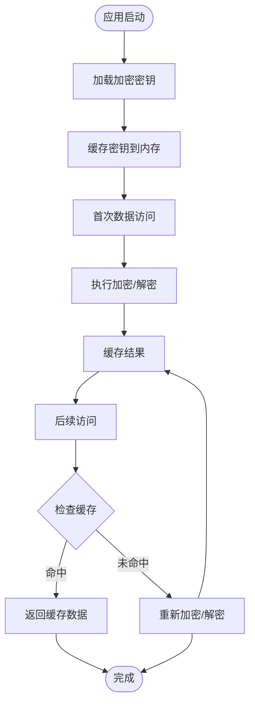

### 并发安全考虑

1. **线程安全**：加密模块使用 `static` 变量存储密钥，确保线程安全
2. **数据库事务**：所有仓储操作都在单个事务中执行，保证数据一致性
3. **资源管理**：正确管理数据库连接和文件句柄，防止资源泄漏

## 故障排除指南

### 常见问题诊断

#### 数据库连接问题

**症状**：应用启动时报数据库连接错误
**排查步骤**：
1. 检查数据目录权限
2. 验证数据库文件完整性
3. 确认数据库版本兼容性

#### 加密失败问题

**症状**：保存连接时报加密错误
**排查步骤**：
1. 检查密钥文件是否存在且可读
2. 验证密钥文件格式是否正确
3. 确认磁盘空间充足

#### 连接验证失败

**症状**：测试连接时报验证错误
**排查步骤**：
1. 检查连接参数格式
2. 验证网络连通性
3. 确认认证凭据正确性

### 错误处理机制

仓储层采用统一的错误处理模式：

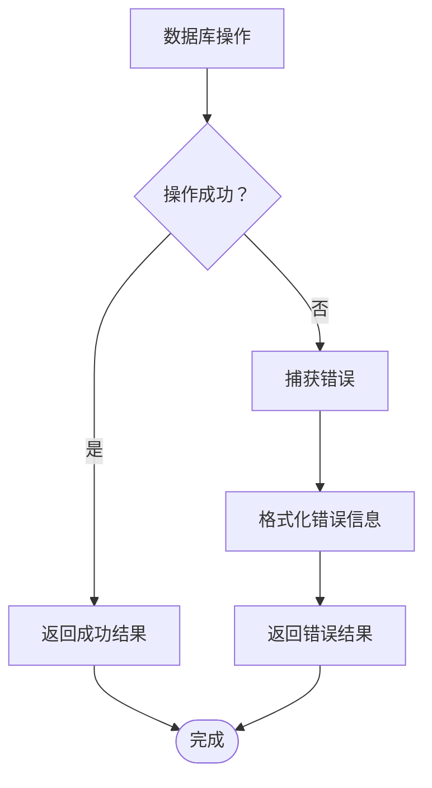

**章节来源**
- [connection_repo.rs:29-32](file://src-tauri/src/db/connection_repo.rs#L29-L32)
- [mod.rs:21-38](file://src-tauri/src/crypto/mod.rs#L21-L38)

## 结论

DevNexus 的仓储模式实现展现了现代应用程序架构的最佳实践：

### 设计优势

1. **统一抽象**：所有连接类型都遵循相同的接口规范
2. **数据安全**：内置加密机制保护敏感信息
3. **扩展性强**：模块化设计便于添加新的连接类型
4. **测试友好**：清晰的接口抽象支持单元测试

### 技术亮点

1. **多数据库支持**：通过统一接口支持多种数据库和云服务
2. **智能验证**：针对不同连接类型的特定验证规则
3. **性能优化**：合理的缓存策略和连接管理
4. **错误处理**：完善的错误处理和恢复机制

### 未来改进方向

1. **异步支持**：引入异步数据库操作提升性能
2. **连接池优化**：实现更智能的连接池管理
3. **监控集成**：添加详细的性能监控和日志记录
4. **配置热重载**：支持运行时配置更新而不重启应用

该仓储模式为 DevNexus 提供了坚实的数据访问层基础，通过清晰的架构设计和完善的错误处理机制，确保了系统的稳定性、安全性和可维护性。