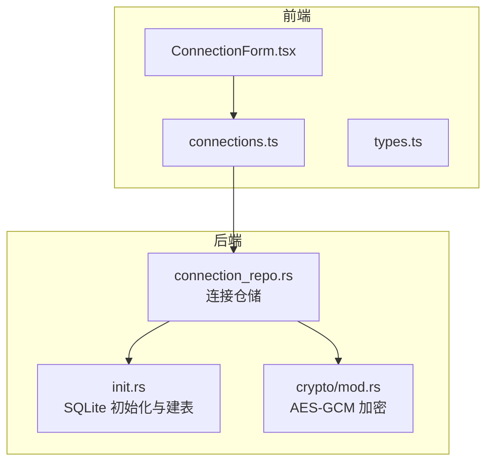
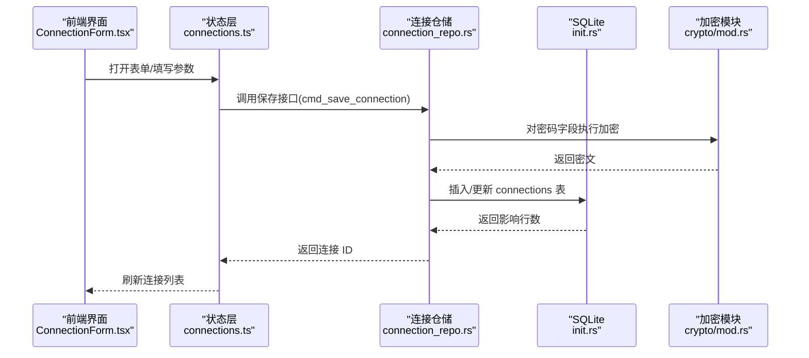
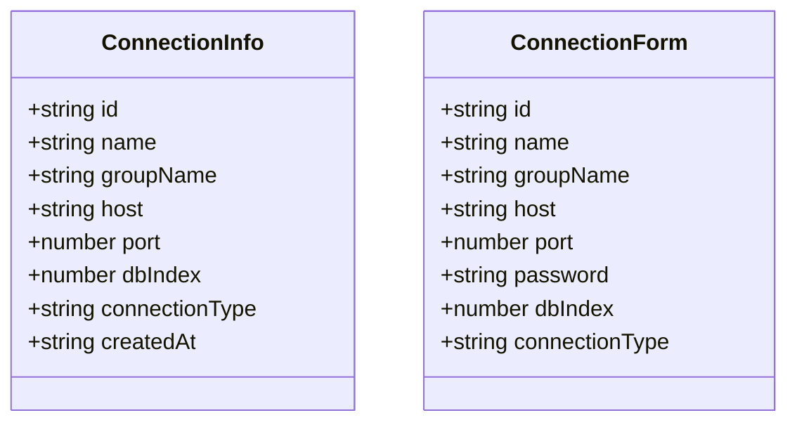
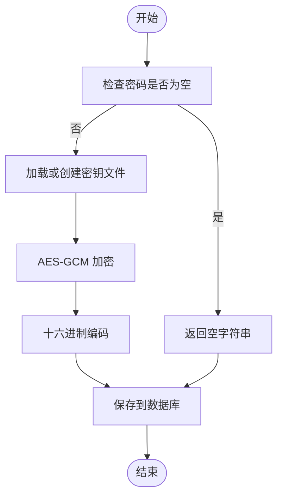
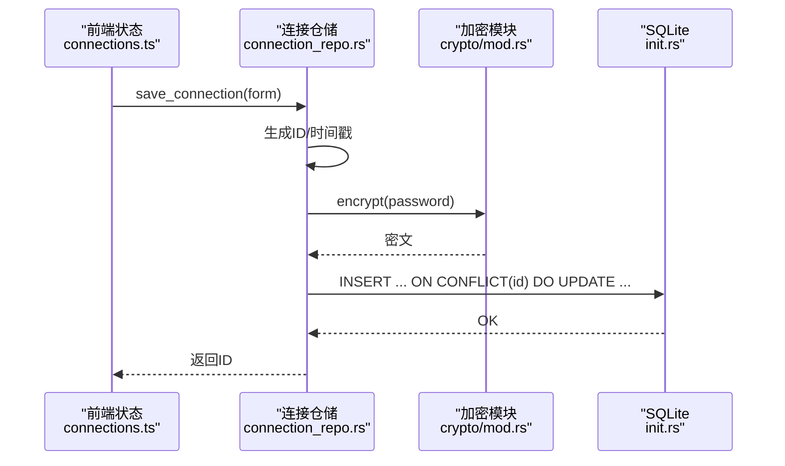
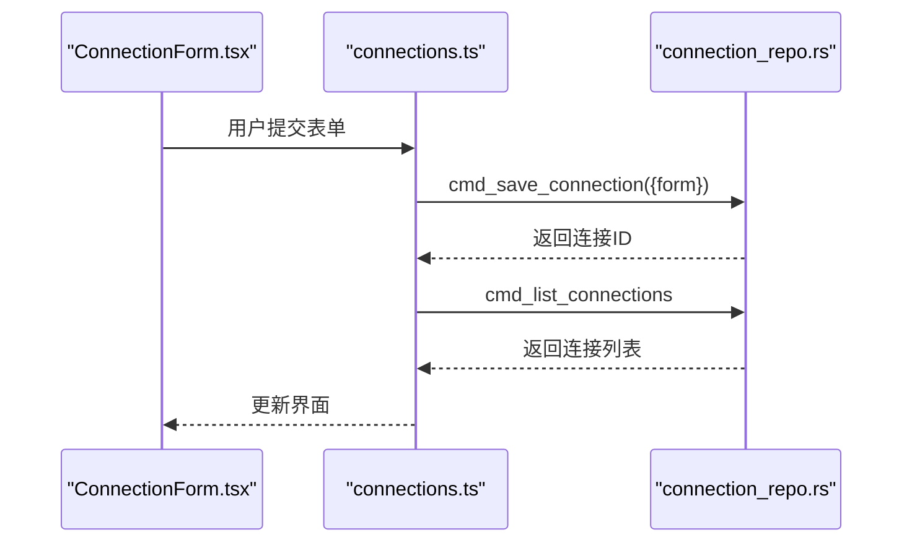
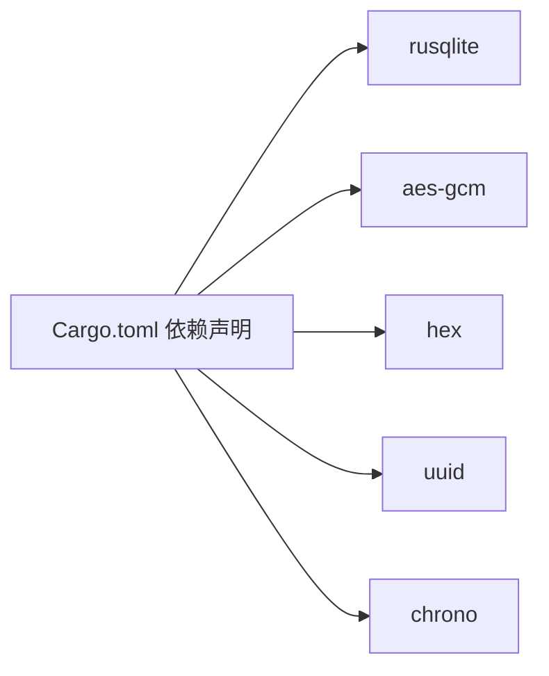

# 核心连接仓储

<cite>
**本文引用的文件**
- [connection_repo.rs](file://src-tauri/src/db/connection_repo.rs)
- [init.rs](file://src-tauri/src/db/init.rs)
- [mod.rs](file://src-tauri/src/crypto/mod.rs)
- [Cargo.toml](file://src-tauri/Cargo.toml)
- [ConnectionForm.tsx](file://src/plugins/redis-manager/components/ConnectionForm.tsx)
- [types.ts](file://src/plugins/redis-manager/types.ts)
- [connections.ts](file://src/plugins/redis-manager/store/connections.ts)
</cite>

## 目录
1. [简介](#简介)
2. [项目结构](#项目结构)
3. [核心组件](#核心组件)
4. [架构总览](#架构总览)
5. [详细组件分析](#详细组件分析)
6. [依赖关系分析](#依赖关系分析)
7. [性能考量](#性能考量)
8. [故障排查指南](#故障排查指南)
9. [结论](#结论)
10. [附录](#附录)

## 简介
本文件系统性地梳理 DevNexus 的“核心连接仓储”，聚焦于通用 Redis 连接的持久化与安全存储能力。内容涵盖：
- 基础架构设计：ConnectionInfo 与 ConnectionForm 数据模型的定义与用途
- 核心 CRUD 操作：连接列表查询、单个连接获取、连接保存、删除与密码管理
- 加密存储机制：基于 AES-GCM 的密码字段加密与解密流程
- 数据库层：SQLite 初始化、表结构、事务与错误处理策略
- 使用示例与最佳实践：调用链路、并发安全与性能优化建议

## 项目结构
围绕“核心连接仓储”的相关代码分布在 Rust 后端与前端 TypeScript 两部分：
- 后端（Tauri/Rust）
  - 数据库初始化与表结构：init.rs
  - 连接仓储（通用 Redis）：connection_repo.rs
  - 加密模块：crypto/mod.rs
  - 依赖声明：Cargo.toml
- 前端（React + Zustand）
  - 连接表单组件：ConnectionForm.tsx
  - 类型定义：types.ts
  - 状态与命令调用：connections.ts

图表来源
- [connection_repo.rs:1-174](file://src-tauri/src/db/connection_repo.rs#L1-L174)
- [init.rs:1-363](file://src-tauri/src/db/init.rs#L1-L363)
- [mod.rs:1-75](file://src-tauri/src/crypto/mod.rs#L1-L75)
- [ConnectionForm.tsx:1-115](file://src/plugins/redis-manager/components/ConnectionForm.tsx#L1-L115)
- [connections.ts:1-91](file://src/plugins/redis-manager/store/connections.ts#L1-L91)

章节来源
- [connection_repo.rs:1-174](file://src-tauri/src/db/connection_repo.rs#L1-L174)
- [init.rs:1-363](file://src-tauri/src/db/init.rs#L1-L363)
- [mod.rs:1-75](file://src-tauri/src/crypto/mod.rs#L1-L75)
- [ConnectionForm.tsx:1-115](file://src/plugins/redis-manager/components/ConnectionForm.tsx#L1-L115)
- [connections.ts:1-91](file://src/plugins/redis-manager/store/connections.ts#L1-L91)

## 核心组件
- 数据模型
  - ConnectionInfo：用于展示与返回的连接信息，包含标识、名称、分组、主机、端口、DB 索引、连接类型、创建时间等字段。
  - ConnectionForm：用于保存时的表单数据，包含可选 ID、名称、分组、主机、端口、可选密码、DB 索引、连接类型等字段。
- 仓储接口
  - 列表查询：按创建时间倒序列出连接
  - 单个获取：按 ID 查询连接
  - 保存：支持新增或更新；密码字段进行加密存储
  - 删除：按 ID 删除连接
  - 密码管理：单独查询并解密指定连接的密码
  - DB 索引更新：按 ID 更新连接的 DB 索引
- 加密模块
  - AES-GCM 加密/解密：对称加密，使用固定长度的 12 字节 nonce 与 256 位密钥
  - 密钥管理：在应用数据目录生成或迁移密钥文件，首次运行自动生成
- 数据库层
  - SQLite 初始化：自动创建 connections 表及其它业务表
  - 事务与约束：使用 SQLite 的 UPSERT（ON CONFLICT）实现幂等保存
  - 错误处理：统一包装底层错误，返回字符串错误消息

章节来源
- [connection_repo.rs:3-27](file://src-tauri/src/db/connection_repo.rs#L3-L27)
- [connection_repo.rs:34-174](file://src-tauri/src/db/connection_repo.rs#L34-L174)
- [mod.rs:1-75](file://src-tauri/src/crypto/mod.rs#L1-L75)
- [init.rs:35-47](file://src-tauri/src/db/init.rs#L35-L47)

## 架构总览
下图展示了从前端到后端的调用链路与数据流：

图表来源
- [ConnectionForm.tsx:42-53](file://src/plugins/redis-manager/components/ConnectionForm.tsx#L42-L53)
- [connections.ts:42-47](file://src/plugins/redis-manager/store/connections.ts#L42-L47)
- [connection_repo.rs:96-131](file://src-tauri/src/db/connection_repo.rs#L96-L131)
- [init.rs:35-47](file://src-tauri/src/db/init.rs#L35-L47)
- [mod.rs:40-74](file://src-tauri/src/crypto/mod.rs#L40-L74)

## 详细组件分析

### 数据模型：ConnectionInfo 与 ConnectionForm
- ConnectionInfo
  - 字段：id、name、groupName、host、port、dbIndex、connectionType、createdAt
  - 用途：作为查询结果返回给前端展示与交互
- ConnectionForm
  - 字段：id（可选）、name、groupName、host、port、password（可选）、dbIndex、connectionType
  - 用途：接收前端表单输入，保存时转换为数据库记录

图表来源
- [connection_repo.rs:3-27](file://src-tauri/src/db/connection_repo.rs#L3-L27)

章节来源
- [connection_repo.rs:3-27](file://src-tauri/src/db/connection_repo.rs#L3-L27)

### 数据库初始化与表结构
- 初始化流程
  - 解析应用数据目录，确保目录存在
  - 解析数据库文件路径，兼容旧版本迁移
  - 执行建表脚本，创建 connections 表及其他业务表
- connections 表结构要点
  - 主键：id
  - 关键字段：name、host、port、password_encrypted、db_index、connection_type、created_at
  - 默认值与约束：db_index 默认 0、connection_type 默认 Standalone
- 兼容性与演进
  - 支持 ALTER TABLE 动态添加列（如 lan_chat_rooms 的 channel 字段）

章节来源
- [init.rs:6-26](file://src-tauri/src/db/init.rs#L6-L26)
- [init.rs:35-47](file://src-tauri/src/db/init.rs#L35-L47)
- [init.rs:356-361](file://src-tauri/src/db/init.rs#L356-L361)

### 加密模块：AES-GCM 密码存储
- 密钥管理
  - 密钥文件名：devnexus.key（兼容旧版 rdmm.key 自动迁移）
  - 首次运行自动生成 32 字节密钥并以十六进制写入文件
- 加密/解密流程
  - 加密：对明文密码进行 AES-GCM 加密，输出十六进制字符串
  - 解密：对密文进行 AES-GCM 解密，再转回 UTF-8 字符串
  - 非对称场景：空密码直接返回空字符串，避免无意义加密
- 安全注意事项
  - 固定长度 nonce（12 字节），确保同一密钥下的唯一性与安全性
  - 密钥文件位于应用数据目录，受操作系统权限保护

图表来源
- [mod.rs:40-74](file://src-tauri/src/crypto/mod.rs#L40-L74)

章节来源
- [mod.rs:10-38](file://src-tauri/src/crypto/mod.rs#L10-L38)
- [mod.rs:40-74](file://src-tauri/src/crypto/mod.rs#L40-L74)

### 核心 CRUD 实现细节

#### 列表查询：按创建时间倒序
- SQL：选择指定字段，ORDER BY created_at DESC
- 结果映射：将每行映射为 ConnectionInfo
- 复杂度：O(n) 遍历结果集

章节来源
- [connection_repo.rs:34-63](file://src-tauri/src/db/connection_repo.rs#L34-L63)

#### 单个连接获取：按 ID 查询
- SQL：WHERE id = ?1
- 结果：Option<ConnectionInfo>，未找到返回 None
- 复杂度：O(1) 基于主键索引

章节来源
- [connection_repo.rs:65-94](file://src-tauri/src/db/connection_repo.rs#L65-L94)

#### 保存连接：新增/更新（幂等）
- 逻辑
  - 若未提供 ID，则生成新 UUID
  - 当前时间戳格式化为 RFC3339 字符串
  - 密码字段通过加密模块加密后存入 password_encrypted
  - 使用 SQLite 的 UPSERT（ON CONFLICT(id) DO UPDATE）实现幂等保存
- 参数绑定：按顺序传入 id、name、groupName、host、port、password_encrypted、db_index、connection_type、created_at

图表来源
- [connection_repo.rs:96-131](file://src-tauri/src/db/connection_repo.rs#L96-L131)
- [mod.rs:40-55](file://src-tauri/src/crypto/mod.rs#L40-L55)
- [init.rs:35-47](file://src-tauri/src/db/init.rs#L35-L47)

章节来源
- [connection_repo.rs:96-131](file://src-tauri/src/db/connection_repo.rs#L96-L131)

#### 删除连接：按 ID 删除
- SQL：DELETE FROM connections WHERE id = ?1
- 异常：若受影响行数为 0，返回“未找到”错误

章节来源
- [connection_repo.rs:133-138](file://src-tauri/src/db/connection_repo.rs#L133-L138)

#### 密码管理：查询并解密
- 查询：SELECT password_encrypted FROM connections WHERE id = ?1
- 解密：若存在密文则解密，否则返回 None
- 场景：仅在需要显示或使用密码时触发解密

章节来源
- [connection_repo.rs:140-155](file://src-tauri/src/db/connection_repo.rs#L140-L155)
- [mod.rs:57-74](file://src-tauri/src/crypto/mod.rs#L57-L74)

#### DB 索引更新：按 ID 更新
- SQL：UPDATE connections SET db_index = ?1 WHERE id = ?2
- 异常：若受影响行数为 0，返回“未找到”错误

章节来源
- [connection_repo.rs:157-173](file://src-tauri/src/db/connection_repo.rs#L157-L173)

### 前端集成与调用链
- 表单组件：ConnectionForm.tsx 提供名称、分组、主机、端口、密码、DB 索引、连接类型等输入项
- 状态层：connections.ts 将用户输入封装为 ConnectionFormData，调用后端命令：
  - cmd_list_connections：刷新连接列表
  - cmd_save_connection：保存连接（含密码加密）
  - cmd_delete_connection：删除连接
  - cmd_get_password：按需解密并返回密码
- 类型定义：types.ts 明确了 ConnectionFormData 与 ConnectionInfo 的字段与约束

图表来源
- [ConnectionForm.tsx:42-53](file://src/plugins/redis-manager/components/ConnectionForm.tsx#L42-L53)
- [connections.ts:36-47](file://src/plugins/redis-manager/store/connections.ts#L36-L47)
- [connection_repo.rs:34-63](file://src-tauri/src/db/connection_repo.rs#L34-L63)

章节来源
- [ConnectionForm.tsx:14-53](file://src/plugins/redis-manager/components/ConnectionForm.tsx#L14-L53)
- [connections.ts:11-25](file://src/plugins/redis-manager/store/connections.ts#L11-L25)
- [types.ts:3-23](file://src/plugins/redis-manager/types.ts#L3-L23)

## 依赖关系分析
- 外部依赖
  - rusqlite：SQLite 访问与事务控制
  - aes-gcm：AES-GCM 对称加密
  - hex：十六进制编解码
  - uuid：UUID 生成
  - chrono：时间戳格式化
- 内部模块
  - db::init：数据库初始化与建表
  - crypto：加密/解密与密钥管理
  - db::connection_repo：连接仓储核心逻辑

图表来源
- [Cargo.toml:20-48](file://src-tauri/Cargo.toml#L20-L48)

章节来源
- [Cargo.toml:20-48](file://src-tauri/Cargo.toml#L20-L48)

## 性能考量
- 查询性能
  - 列表查询按 created_at 倒序，适合频繁刷新；建议在前端做虚拟滚动与分页（如需扩展）
- 写入性能
  - 使用 UPSERT（ON CONFLICT）减少重复插入成本
  - 批量保存时建议合并事务（当前实现逐条执行，可结合业务场景评估批量接口）
- 加密开销
  - AES-GCM 加密/解密为 CPU 密集型；仅在必要时解密（如测试连接或实际使用密码时）
- I/O 优化
  - 数据库存放在应用数据目录，避免跨盘符移动；定期备份数据库文件
- 并发安全
  - SQLite 在单进程内默认串行化访问；多线程场景建议使用连接池或限制并发写入
  - 建议在前端层做防抖与去重提交，避免重复保存

## 故障排查指南
- 数据库打开失败
  - 检查数据目录权限与磁盘空间
  - 确认数据库文件路径解析（兼容旧版迁移）
- 建表失败
  - 查看建表语句语法与权限
  - 确保 SQLite 版本满足 rusqlite 要求
- 加密/解密异常
  - 检查密钥文件是否存在且为 32 字节十六进制
  - 确认密文格式正确且未被篡改
- 保存失败
  - 核对必填字段（如 name、host、port）
  - 检查 ON CONFLICT 更新字段是否匹配
- 删除/更新未生效
  - 确认 ID 是否正确
  - 检查受影响行数（0 表示未找到）

章节来源
- [init.rs:33-35](file://src-tauri/src/db/init.rs#L33-L35)
- [mod.rs:24-37](file://src-tauri/src/crypto/mod.rs#L24-L37)
- [connection_repo.rs:102-128](file://src-tauri/src/db/connection_repo.rs#L102-L128)
- [connection_repo.rs:133-138](file://src-tauri/src/db/connection_repo.rs#L133-L138)
- [connection_repo.rs:157-173](file://src-tauri/src/db/connection_repo.rs#L157-L173)

## 结论
DevNexus 的核心连接仓储以 SQLite 为基础，结合 AES-GCM 对敏感字段进行加密存储，提供了完整的连接 CRUD 能力。通过明确的数据模型、幂等保存与严格的错误处理，系统在易用性与安全性之间取得平衡。建议在生产环境中进一步完善并发控制、批量写入与日志审计，以提升稳定性与可观测性。

## 附录
- 最佳实践
  - 保存前校验必填字段与范围（端口、DB 索引）
  - 仅在需要时解密密码，避免不必要的 CPU 开销
  - 前端做防抖与去重提交，降低数据库压力
  - 定期备份数据库文件，保障数据可恢复
- 并发安全
  - 单进程内 SQLite 默认串行化；多线程场景建议引入连接池或限制并发写入
  - 前端状态更新采用不可变更新策略，避免竞态条件