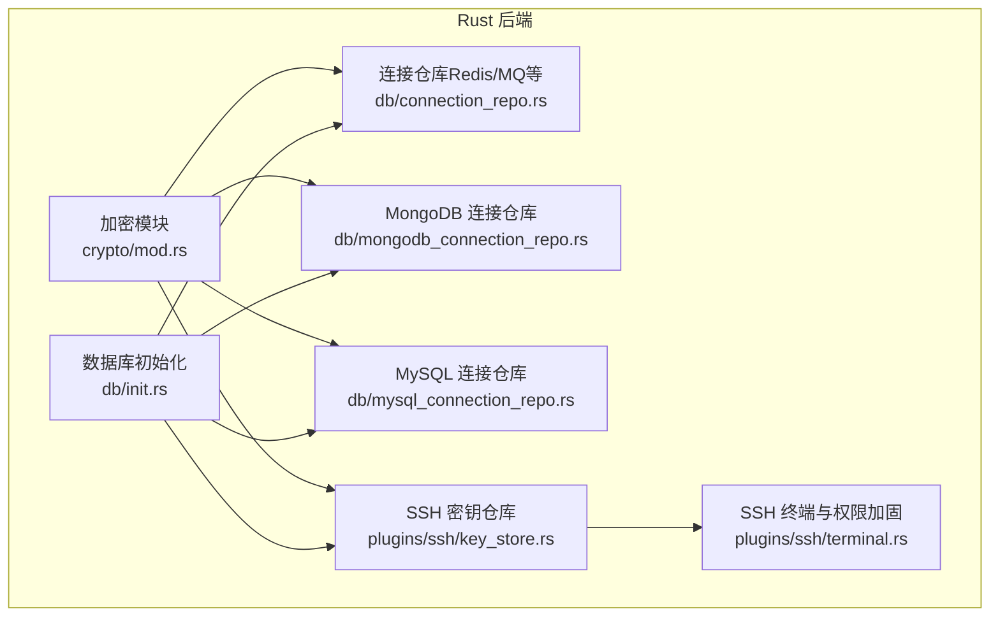
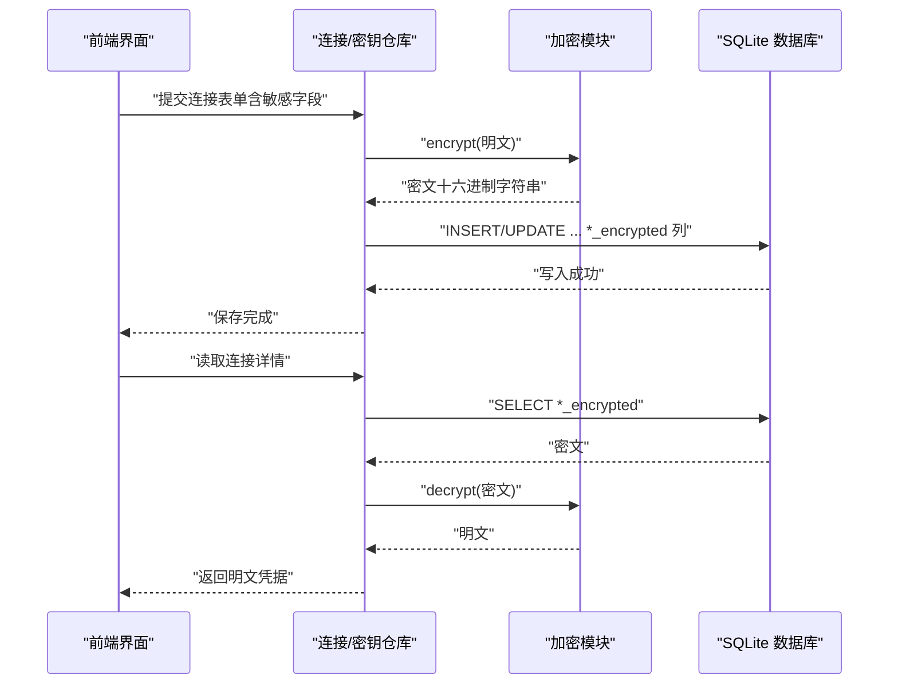
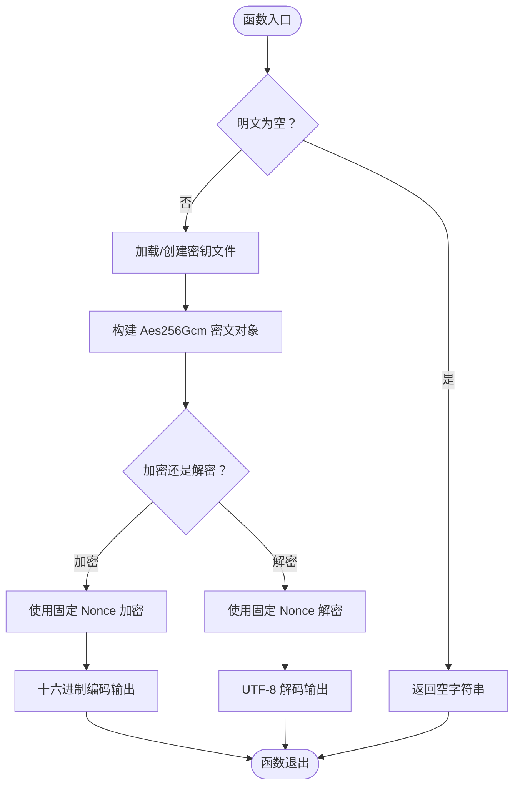
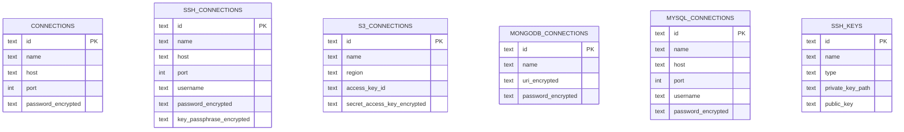
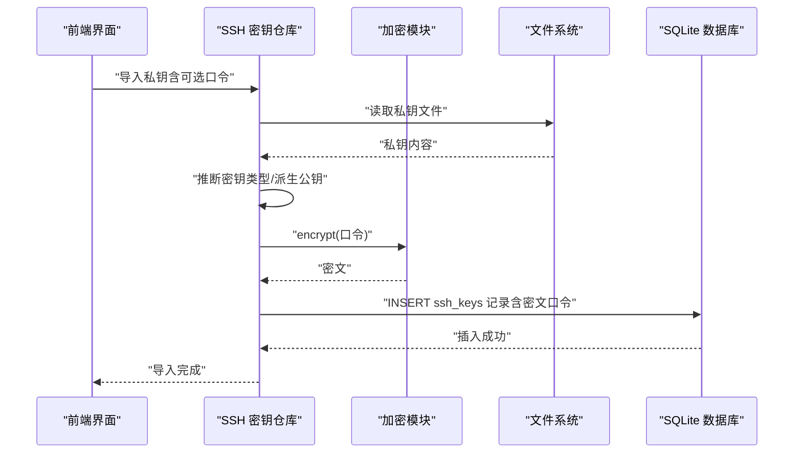
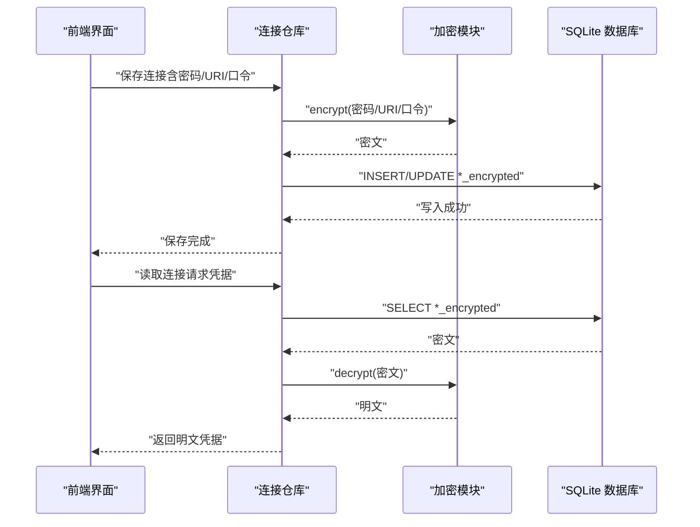
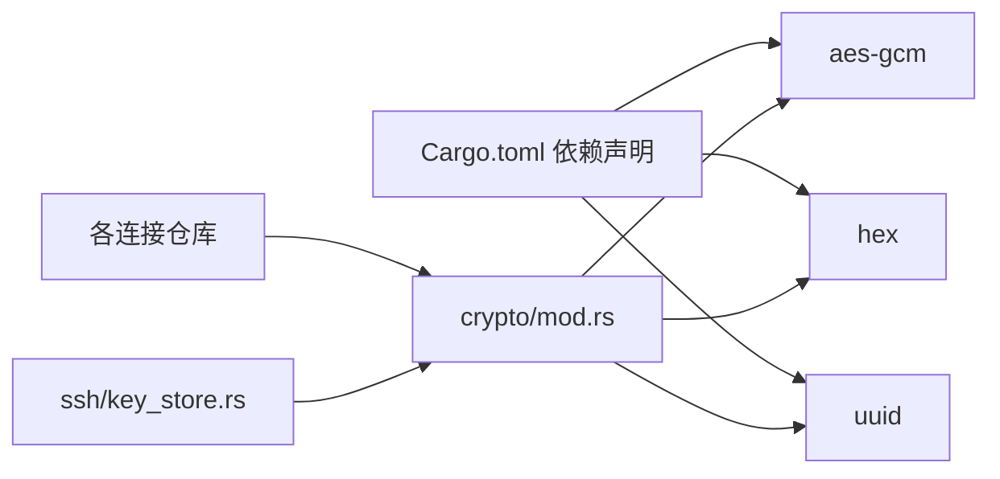

# 加密存储机制

<cite>
**本文引用的文件**
- [src-tauri/src/crypto/mod.rs](file://src-tauri/src/crypto/mod.rs)
- [src-tauri/src/db/init.rs](file://src-tauri/src/db/init.rs)
- [src-tauri/src/db/connection_repo.rs](file://src-tauri/src/db/connection_repo.rs)
- [src-tauri/src/db/mongodb_connection_repo.rs](file://src-tauri/src/db/mongodb_connection_repo.rs)
- [src-tauri/src/db/mysql_connection_repo.rs](file://src-tauri/src/db/mysql_connection_repo.rs)
- [src-tauri/src/plugins/ssh/key_store.rs](file://src-tauri/src/plugins/ssh/key_store.rs)
- [src-tauri/src/plugins/ssh/terminal.rs](file://src-tauri/src/plugins/ssh/terminal.rs)
- [src-tauri/Cargo.toml](file://src-tauri/Cargo.toml)
- [PLAN.md](file://PLAN.md)
</cite>

## 目录
1. [简介](#简介)
2. [项目结构](#项目结构)
3. [核心组件](#核心组件)
4. [架构总览](#架构总览)
5. [详细组件分析](#详细组件分析)
6. [依赖关系分析](#依赖关系分析)
7. [性能考虑](#性能考虑)
8. [故障排查指南](#故障排查指南)
9. [结论](#结论)
10. [附录](#附录)

## 简介
本文件系统性梳理 DevNexus 的加密存储机制，围绕 AES-GCM 加密算法在 Rust 后端的具体实现，解释密钥生成与管理、初始化向量（IV）策略、加密与解密流程，以及敏感数据（如密码、密钥、访问令牌等）的落地存储方式。同时给出完整性验证（认证标签 Tag）的工作原理、密钥轮换与销毁策略建议、性能优化建议及安全威胁与防护措施。

## 项目结构
DevNexus 的加密相关逻辑集中在 Rust 后端，主要涉及：
- 加密模块：AES-GCM 封装与密钥文件管理
- 数据库存储：敏感字段以“*_encrypted”形式存储
- 插件集成：SSH 私钥导入与存储、部分连接类型的敏感信息加密

**图示来源**
- [src-tauri/src/crypto/mod.rs:1-75](file://src-tauri/src/crypto/mod.rs#L1-L75)
- [src-tauri/src/db/init.rs:35-354](file://src-tauri/src/db/init.rs#L35-L354)
- [src-tauri/src/db/connection_repo.rs:96-131](file://src-tauri/src/db/connection_repo.rs#L96-L131)
- [src-tauri/src/db/mongodb_connection_repo.rs:115-202](file://src-tauri/src/db/mongodb_connection_repo.rs#L115-L202)
- [src-tauri/src/db/mysql_connection_repo.rs:108-176](file://src-tauri/src/db/mysql_connection_repo.rs#L108-L176)
- [src-tauri/src/plugins/ssh/key_store.rs:66-108](file://src-tauri/src/plugins/ssh/key_store.rs#L66-L108)
- [src-tauri/src/plugins/ssh/terminal.rs:218-252](file://src-tauri/src/plugins/ssh/terminal.rs#L218-L252)

**章节来源**
- [src-tauri/src/crypto/mod.rs:1-75](file://src-tauri/src/crypto/mod.rs#L1-L75)
- [src-tauri/src/db/init.rs:35-354](file://src-tauri/src/db/init.rs#L35-L354)

## 核心组件
- 加密模块（AES-GCM）
  - 提供统一的加密/解密接口，使用固定长度密钥与固定 IV（全零 12 字节）。
  - 密钥文件位于应用数据目录，首次运行自动生成并持久化；支持从旧文件名迁移。
- 数据库存储
  - 敏感信息以“*_encrypted”列存储，涵盖 Redis/MQ/MySQL/MongoDB/SSH 等连接配置。
  - 数据库初始化时创建相应表结构，并在后续版本中持续演进。
- 插件集成
  - SSH 密钥导入时对可选口令进行加密存储；终端运行时对密钥文件权限进行加固（Windows ACL）。

**章节来源**
- [src-tauri/src/crypto/mod.rs:10-38](file://src-tauri/src/crypto/mod.rs#L10-L38)
- [src-tauri/src/db/init.rs:35-354](file://src-tauri/src/db/init.rs#L35-L354)
- [src-tauri/src/plugins/ssh/key_store.rs:66-108](file://src-tauri/src/plugins/ssh/key_store.rs#L66-L108)
- [src-tauri/src/plugins/ssh/terminal.rs:218-252](file://src-tauri/src/plugins/ssh/terminal.rs#L218-L252)

## 架构总览
下图展示了敏感数据从输入到落库、再到读取解密的关键路径。

**图示来源**
- [src-tauri/src/db/connection_repo.rs:96-131](file://src-tauri/src/db/connection_repo.rs#L96-L131)
- [src-tauri/src/db/mongodb_connection_repo.rs:115-202](file://src-tauri/src/db/mongodb_connection_repo.rs#L115-L202)
- [src-tauri/src/db/mysql_connection_repo.rs:108-176](file://src-tauri/src/db/mysql_connection_repo.rs#L108-L176)
- [src-tauri/src/plugins/ssh/key_store.rs:66-108](file://src-tauri/src/plugins/ssh/key_store.rs#L66-L108)
- [src-tauri/src/crypto/mod.rs:40-74](file://src-tauri/src/crypto/mod.rs#L40-L74)

## 详细组件分析

### 加密模块（AES-GCM）
- 算法与密钥
  - 使用 AES-256-GCM，密钥长度 32 字节（256 位）。
  - 密钥文件位于应用数据目录，首次运行通过 UUID 派生并写入；若存在旧文件名则自动迁移。
- 初始化向量（IV）
  - 固定使用全零 12 字节 Nonce；该做法在单密钥场景下简化实现，但需注意安全性权衡。
- 加密/解密流程
  - 加密：加载密钥 → 构造 Aes256Gcm → 使用固定 Nonce → 加密明文字节 → 十六进制编码输出。
  - 解密：十六进制解码 → 使用相同密钥与固定 Nonce → 解密并转换为 UTF-8 字符串。
- 错误处理
  - 读写密钥文件、Hex 解码、UTF-8 转换、加解密失败均返回错误信息。

**图示来源**
- [src-tauri/src/crypto/mod.rs:40-74](file://src-tauri/src/crypto/mod.rs#L40-L74)

**章节来源**
- [src-tauri/src/crypto/mod.rs:1-75](file://src-tauri/src/crypto/mod.rs#L1-L75)

### 数据库存储策略
- 存储字段命名规范
  - 敏感信息字段统一以“*_encrypted”结尾，便于识别与审计。
- 关键表与敏感字段
  - connections：password_encrypted
  - ssh_connections：password_encrypted、key_passphrase_encrypted
  - s3_connections：secret_access_key_encrypted
  - mongodb_connections：uri_encrypted、password_encrypted
  - mysql_connections：password_encrypted
  - ssh_keys：public_key（公钥文本，不加密）
- 写入与读取
  - 写入：前端提交明文，后端调用加密模块得到密文后入库。
  - 读取：后端查询密文，调用解密模块还原明文返回前端。

**图示来源**
- [src-tauri/src/db/init.rs:37-157](file://src-tauri/src/db/init.rs#L37-L157)
- [src-tauri/src/db/connection_repo.rs:96-131](file://src-tauri/src/db/connection_repo.rs#L96-L131)
- [src-tauri/src/db/mongodb_connection_repo.rs:115-202](file://src-tauri/src/db/mongodb_connection_repo.rs#L115-L202)
- [src-tauri/src/db/mysql_connection_repo.rs:108-176](file://src-tauri/src/db/mysql_connection_repo.rs#L108-L176)
- [src-tauri/src/plugins/ssh/key_store.rs:66-108](file://src-tauri/src/plugins/ssh/key_store.rs#L66-L108)

**章节来源**
- [src-tauri/src/db/init.rs:35-354](file://src-tauri/src/db/init.rs#L35-L354)
- [src-tauri/src/db/connection_repo.rs:96-155](file://src-tauri/src/db/connection_repo.rs#L96-L155)
- [src-tauri/src/db/mongodb_connection_repo.rs:115-248](file://src-tauri/src/db/mongodb_connection_repo.rs#L115-L248)
- [src-tauri/src/db/mysql_connection_repo.rs:108-208](file://src-tauri/src/db/mysql_connection_repo.rs#L108-L208)
- [src-tauri/src/plugins/ssh/key_store.rs:66-108](file://src-tauri/src/plugins/ssh/key_store.rs#L66-L108)

### SSH 密钥管理
- 导入流程
  - 校验私钥文件存在与格式；推断密钥类型；可选口令经加密后入库；公钥派生并入库。
- 权限加固（Windows）
  - 运行时重置 ACL、禁用继承、仅授予当前用户权限，降低密钥文件被越权访问的风险。

**图示来源**
- [src-tauri/src/plugins/ssh/key_store.rs:66-108](file://src-tauri/src/plugins/ssh/key_store.rs#L66-L108)
- [src-tauri/src/crypto/mod.rs:40-74](file://src-tauri/src/crypto/mod.rs#L40-L74)

**章节来源**
- [src-tauri/src/plugins/ssh/key_store.rs:66-108](file://src-tauri/src/plugins/ssh/key_store.rs#L66-L108)
- [src-tauri/src/plugins/ssh/terminal.rs:218-252](file://src-tauri/src/plugins/ssh/terminal.rs#L218-L252)

### 连接仓库（Redis/MQ/MySQL/MongoDB）
- Redis/MQ
  - 保存连接时对密码进行加密；读取时解密返回。
- MySQL
  - 保存连接时对密码进行加密；读取时解密返回。
- MongoDB
  - 支持两种模式：URI 或表单；URI 与密码均加密存储；读取时分别解密。

**图示来源**
- [src-tauri/src/db/connection_repo.rs:96-155](file://src-tauri/src/db/connection_repo.rs#L96-L155)
- [src-tauri/src/db/mongodb_connection_repo.rs:115-248](file://src-tauri/src/db/mongodb_connection_repo.rs#L115-L248)
- [src-tauri/src/db/mysql_connection_repo.rs:108-208](file://src-tauri/src/db/mysql_connection_repo.rs#L108-L208)
- [src-tauri/src/crypto/mod.rs:40-74](file://src-tauri/src/crypto/mod.rs#L40-L74)

**章节来源**
- [src-tauri/src/db/connection_repo.rs:96-155](file://src-tauri/src/db/connection_repo.rs#L96-L155)
- [src-tauri/src/db/mongodb_connection_repo.rs:115-248](file://src-tauri/src/db/mongodb_connection_repo.rs#L115-L248)
- [src-tauri/src/db/mysql_connection_repo.rs:108-208](file://src-tauri/src/db/mysql_connection_repo.rs#L108-L208)

## 依赖关系分析
- 外部依赖
  - aes-gcm：提供 AES-GCM 加密算法实现。
  - hex：用于密文与十六进制字符串互转。
  - uuid：首次生成密钥时用于派生随机字节。
- 内部依赖
  - 加密模块被各连接仓库与 SSH 密钥仓库复用。
  - 数据库初始化模块负责建表与迁移，确保敏感字段结构稳定。

**图示来源**
- [src-tauri/Cargo.toml:28-33](file://src-tauri/Cargo.toml#L28-L33)
- [src-tauri/src/crypto/mod.rs:1-4](file://src-tauri/src/crypto/mod.rs#L1-L4)

**章节来源**
- [src-tauri/Cargo.toml:28-33](file://src-tauri/Cargo.toml#L28-L33)
- [src-tauri/src/crypto/mod.rs:1-4](file://src-tauri/src/crypto/mod.rs#L1-L4)

## 性能考虑
- 批量加密处理
  - 建议在业务层聚合多个明文后再调用加密模块，减少跨语言边界调用次数。
- 内存使用优化
  - 避免在加密/解密过程中重复拷贝大对象；优先使用字节切片与就地解码。
- 计算资源管理
  - AES-GCM 为对称加密，计算开销较小；在高频场景下可考虑缓存密钥对象，避免重复构造。
- I/O 优化
  - 密钥文件与数据库 I/O 是瓶颈所在；建议：
    - 密钥文件只在首次生成时写入，后续直接读取；
    - 数据库写入采用事务批处理，减少磁盘同步次数。

[本节为通用性能建议，不直接分析特定文件，故无“章节来源”标注]

## 故障排查指南
- 常见错误与定位
  - 密钥文件读取失败：检查应用数据目录权限与文件是否存在。
  - 密钥尺寸无效：确认密钥文件为 32 字节（64 十六进制字符）。
  - 十六进制解码失败：确认存储为合法十六进制字符串。
  - UTF-8 解码失败：确认解密后数据为有效 UTF-8 文本。
  - 解密失败：核对密钥一致性与固定 Nonce 是否一致。
- SSH 密钥权限问题（Windows）
  - 若出现权限异常，检查 ACL 重置与继承禁用是否成功执行。

**章节来源**
- [src-tauri/src/crypto/mod.rs:24-37](file://src-tauri/src/crypto/mod.rs#L24-L37)
- [src-tauri/src/crypto/mod.rs:66-73](file://src-tauri/src/crypto/mod.rs#L66-L73)
- [src-tauri/src/plugins/ssh/terminal.rs:218-252](file://src-tauri/src/plugins/ssh/terminal.rs#L218-L252)

## 结论
DevNexus 当前采用 AES-256-GCM 对敏感数据进行统一加密存储，密钥由应用数据目录中的密钥文件管理，首次运行自动生成并持久化。加密模块简单可靠，满足桌面应用本地存储的安全需求。建议在后续版本中引入更强的密钥管理方案（如平台密钥链、硬件安全模块）与动态 IV 策略，以进一步提升安全性与合规性。

[本节为总结性内容，不直接分析特定文件，故无“章节来源”标注]

## 附录

### 安全威胁与防护措施
- 威胁模型
  - 本地文件系统泄露（密钥文件、数据库文件）。
  - 进程内内存驻留敏感信息导致转储。
  - 固定 IV 引发重放与统计分析风险。
- 防护建议
  - 平台密钥管理：利用操作系统密钥链（Windows DPAPI、macOS Keychain、Linux Secret-tool）存储密钥。
  - 动态 IV：为每次加密生成唯一 Nonce，避免固定 IV。
  - 最小权限：限制密钥文件与数据库文件的访问权限，仅授予当前用户。
  - 内存保护：及时清理敏感字符串，避免在日志与堆栈中暴露。

[本节为通用安全建议，不直接分析特定文件，故无“章节来源”标注]

### 开发计划中的安全定位
- 计划明确将“密码加密”定位为 AES-256-GCM（Rust aes-gcm），体现了对对称加密的采用与对 Rust 生态的依赖。

**章节来源**
- [PLAN.md:20-21](file://PLAN.md#L20-L21)