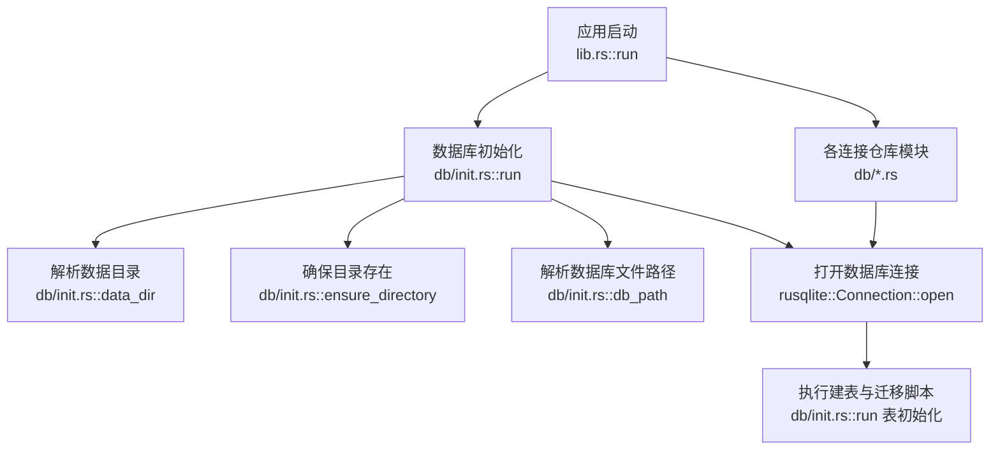
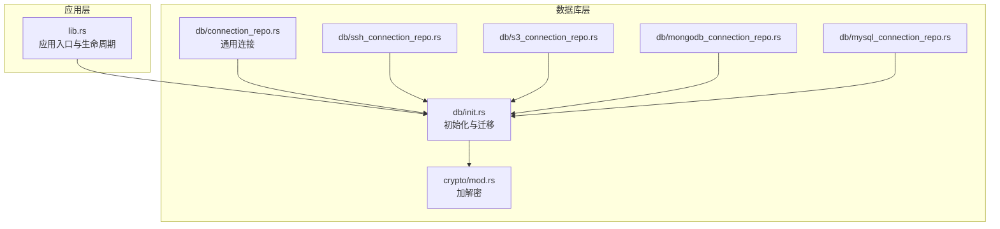
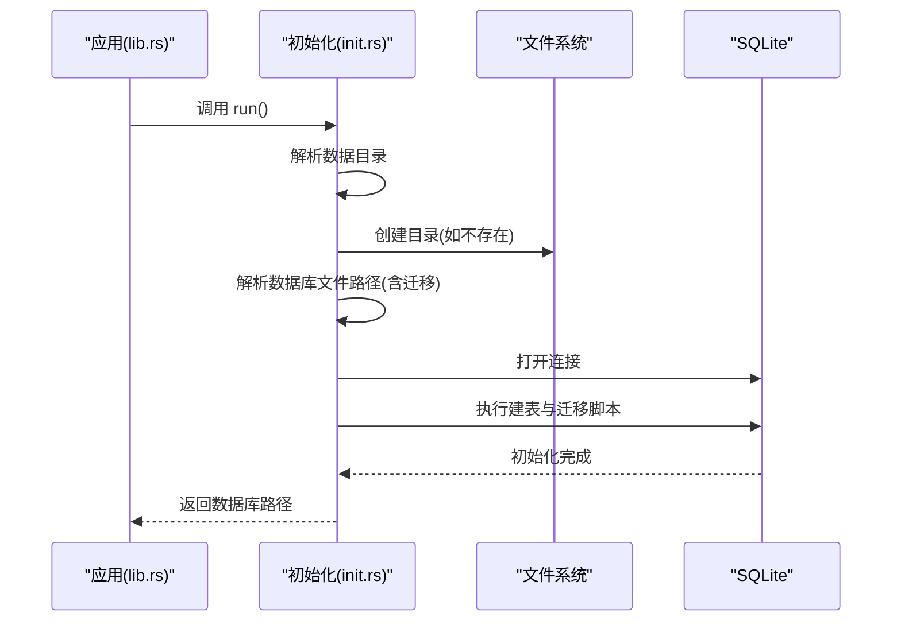
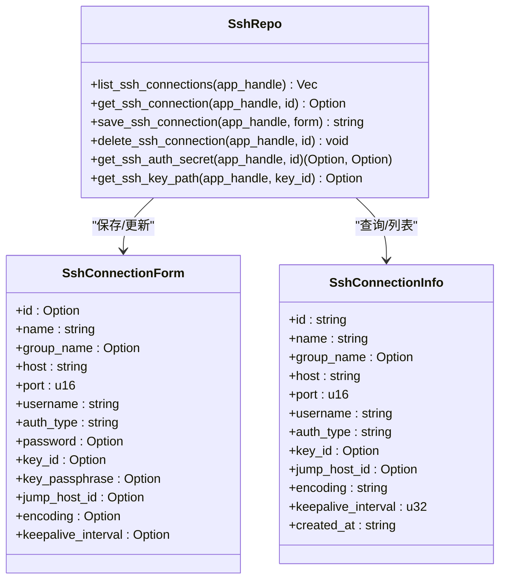
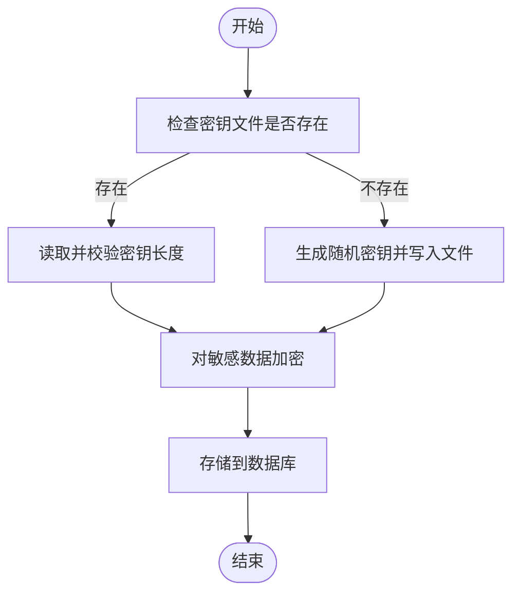
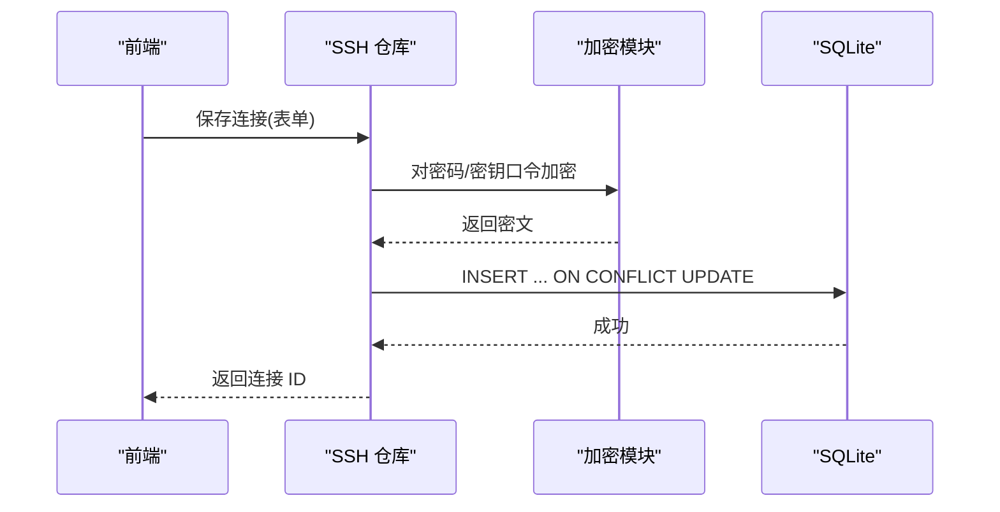
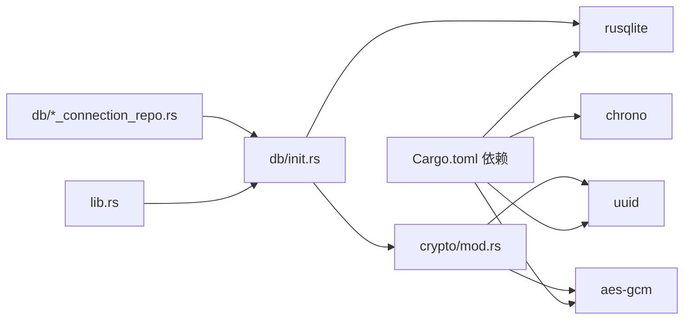

# 数据库架构

<cite>
**本文引用的文件**
- [src-tauri/src/db/mod.rs](file://src-tauri/src/db/mod.rs)
- [src-tauri/src/db/init.rs](file://src-tauri/src/db/init.rs)
- [src-tauri/src/db/connection_repo.rs](file://src-tauri/src/db/connection_repo.rs)
- [src-tauri/src/db/mongodb_connection_repo.rs](file://src-tauri/src/db/mongodb_connection_repo.rs)
- [src-tauri/src/db/mysql_connection_repo.rs](file://src-tauri/src/db/mysql_connection_repo.rs)
- [src-tauri/src/db/s3_connection_repo.rs](file://src-tauri/src/db/s3_connection_repo.rs)
- [src-tauri/src/db/ssh_connection_repo.rs](file://src-tauri/src/db/ssh_connection_repo.rs)
- [src-tauri/src/crypto/mod.rs](file://src-tauri/src/crypto/mod.rs)
- [src-tauri/src/lib.rs](file://src-tauri/src/lib.rs)
- [src-tauri/src/main.rs](file://src-tauri/src/main.rs)
- [src-tauri/Cargo.toml](file://src-tauri/Cargo.toml)
</cite>

## 目录
1. [简介](#简介)
2. [项目结构](#项目结构)
3. [核心组件](#核心组件)
4. [架构总览](#架构总览)
5. [详细组件分析](#详细组件分析)
6. [依赖关系分析](#依赖关系分析)
7. [性能考虑](#性能考虑)
8. [故障排查指南](#故障排查指南)
9. [结论](#结论)
10. [附录](#附录)

## 简介
本文件系统化梳理 DevNexus 的数据库架构与实现，重点覆盖以下方面：
- SQLite 数据库的整体设计：数据库文件位置管理、数据目录结构与文件命名规范
- 初始化流程：数据目录创建、数据库文件创建与表结构初始化
- 连接管理：当前实现采用单连接直连模式（无连接池），并发访问控制策略
- 版本管理：版本检查、迁移策略与向后兼容性保障
- 性能优化：索引设计原则、查询优化技巧与内存管理策略
- 备份与恢复：备份与恢复机制及故障处理方案
- 故障排查：常见错误定位与修复建议

## 项目结构
DevNexus 的数据库层位于 Rust 后端模块中，核心入口在 Tauri 应用启动时执行初始化；数据库操作通过各连接仓库模块封装，统一从初始化模块解析的数据库路径打开连接。

**图示来源**
- [src-tauri/src/lib.rs:10-24](file://src-tauri/src/lib.rs#L10-L24)
- [src-tauri/src/db/init.rs:28-362](file://src-tauri/src/db/init.rs#L28-L362)

**章节来源**
- [src-tauri/src/lib.rs:10-24](file://src-tauri/src/lib.rs#L10-L24)
- [src-tauri/src/db/mod.rs:1-8](file://src-tauri/src/db/mod.rs#L1-L8)
- [src-tauri/src/db/init.rs:6-362](file://src-tauri/src/db/init.rs#L6-L362)

## 核心组件
- 数据库初始化模块：负责数据目录解析、数据库文件路径迁移、数据库连接建立与表结构初始化
- 连接仓库模块：按资源类型拆分（Redis、SSH、S3、MongoDB、MySQL、LAN Chat 等），每个模块提供列表、保存、删除、查询等 CRUD 操作
- 加密模块：提供对敏感字段（如密码、URI）的加解密能力，用于安全存储
- 应用入口：Tauri 启动时调用初始化流程，随后注册命令供前端调用

关键职责划分：
- db/init.rs：集中式初始化与迁移
- db/*_connection_repo.rs：按资源类型封装 CRUD
- crypto/mod.rs：密钥生成与敏感信息加解密
- lib.rs：应用生命周期与初始化钩子

**章节来源**
- [src-tauri/src/db/init.rs:28-362](file://src-tauri/src/db/init.rs#L28-L362)
- [src-tauri/src/db/connection_repo.rs:29-174](file://src-tauri/src/db/connection_repo.rs#L29-L174)
- [src-tauri/src/db/mongodb_connection_repo.rs:40-249](file://src-tauri/src/db/mongodb_connection_repo.rs#L40-L249)
- [src-tauri/src/db/mysql_connection_repo.rs:40-209](file://src-tauri/src/db/mysql_connection_repo.rs#L40-L209)
- [src-tauri/src/db/s3_connection_repo.rs:33-188](file://src-tauri/src/db/s3_connection_repo.rs#L33-L188)
- [src-tauri/src/db/ssh_connection_repo.rs:38-218](file://src-tauri/src/db/ssh_connection_repo.rs#L38-L218)
- [src-tauri/src/crypto/mod.rs:10-75](file://src-tauri/src/crypto/mod.rs#L10-L75)
- [src-tauri/src/lib.rs:10-24](file://src-tauri/src/lib.rs#L10-L24)

## 架构总览
数据库层采用“集中初始化 + 分域仓库”的架构：
- 集中式初始化：在应用启动阶段完成数据目录与数据库文件路径解析、文件迁移、连接建立与表结构初始化
- 分域仓库：每种连接类型维护独立的表结构与 CRUD 接口，统一通过 db_path 获取连接
- 安全策略：敏感字段加密存储，密钥文件与数据库文件同处数据目录
- 并发模型：当前未引入连接池，所有仓库直接打开连接执行 SQL，适合桌面应用低并发场景

**图示来源**
- [src-tauri/src/lib.rs:10-24](file://src-tauri/src/lib.rs#L10-L24)
- [src-tauri/src/db/init.rs:28-362](file://src-tauri/src/db/init.rs#L28-L362)
- [src-tauri/src/crypto/mod.rs:10-75](file://src-tauri/src/crypto/mod.rs#L10-L75)
- [src-tauri/src/db/connection_repo.rs:29-174](file://src-tauri/src/db/connection_repo.rs#L29-L174)
- [src-tauri/src/db/ssh_connection_repo.rs:38-218](file://src-tauri/src/db/ssh_connection_repo.rs#L38-L218)
- [src-tauri/src/db/s3_connection_repo.rs:33-188](file://src-tauri/src/db/s3_connection_repo.rs#L33-L188)
- [src-tauri/src/db/mongodb_connection_repo.rs:40-249](file://src-tauri/src/db/mongodb_connection_repo.rs#L40-L249)
- [src-tauri/src/db/mysql_connection_repo.rs:40-209](file://src-tauri/src/db/mysql_connection_repo.rs#L40-L209)

## 详细组件分析

### 数据库初始化与文件管理
- 数据目录解析：通过 Tauri 提供的应用数据目录接口解析，确保跨平台一致性
- 目录创建：若不存在则递归创建
- 数据库文件路径：优先使用新路径 devnexus.db；若检测到旧版 rdmm.db 则自动迁移
- 连接建立：打开 SQLite 文件并执行批量建表与迁移语句
- 迁移策略：通过 ALTER 语句对现有表进行列级扩展，保证向后兼容

**图示来源**
- [src-tauri/src/lib.rs:14-20](file://src-tauri/src/lib.rs#L14-L20)
- [src-tauri/src/db/init.rs:28-362](file://src-tauri/src/db/init.rs#L28-L362)

**章节来源**
- [src-tauri/src/db/init.rs:6-362](file://src-tauri/src/db/init.rs#L6-L362)

### 连接仓库模块（以 SSH 为例）
- 连接信息模型：定义序列化结构体，映射数据库表字段
- 打开连接：每次操作前根据 db_path 打开新连接
- CRUD 操作：提供列表、查询、保存（支持 ON CONFLICT 更新）、删除等
- 密钥管理：敏感字段加密存储，读取时解密返回

**图示来源**
- [src-tauri/src/db/ssh_connection_repo.rs:20-218](file://src-tauri/src/db/ssh_connection_repo.rs#L20-L218)

**章节来源**
- [src-tauri/src/db/ssh_connection_repo.rs:38-218](file://src-tauri/src/db/ssh_connection_repo.rs#L38-L218)

### 加密模块与安全存储
- 密钥文件：位于数据目录下，文件名从旧版迁移而来，首次运行自动生成
- 加密算法：AES-GCM，固定长度密钥，固定 nonce
- 使用方式：保存连接时对敏感字段加密；读取时解密返回

**图示来源**
- [src-tauri/src/crypto/mod.rs:10-75](file://src-tauri/src/crypto/mod.rs#L10-L75)

**章节来源**
- [src-tauri/src/crypto/mod.rs:10-75](file://src-tauri/src/crypto/mod.rs#L10-L75)

### 典型业务流程（保存 SSH 连接）

**图示来源**
- [src-tauri/src/db/ssh_connection_repo.rs:117-167](file://src-tauri/src/db/ssh_connection_repo.rs#L117-L167)
- [src-tauri/src/crypto/mod.rs:40-74](file://src-tauri/src/crypto/mod.rs#L40-L74)

**章节来源**
- [src-tauri/src/db/ssh_connection_repo.rs:117-167](file://src-tauri/src/db/ssh_connection_repo.rs#L117-L167)
- [src-tauri/src/crypto/mod.rs:40-74](file://src-tauri/src/crypto/mod.rs#L40-L74)

## 依赖关系分析
- 外部依赖：rusqlite（SQLite 绑定，启用 bundled 功能）、uuid、chrono、aes-gcm 等
- 内部依赖：db 模块内部通过 init.rs 解析路径，各仓库模块依赖 init.rs 的 db_path；加密模块依赖 db::init::data_dir 获取密钥文件路径

**图示来源**
- [src-tauri/Cargo.toml:20-48](file://src-tauri/Cargo.toml#L20-L48)
- [src-tauri/src/lib.rs:10-24](file://src-tauri/src/lib.rs#L10-L24)
- [src-tauri/src/db/init.rs:28-362](file://src-tauri/src/db/init.rs#L28-L362)
- [src-tauri/src/crypto/mod.rs:10-75](file://src-tauri/src/crypto/mod.rs#L10-L75)

**章节来源**
- [src-tauri/Cargo.toml:20-48](file://src-tauri/Cargo.toml#L20-L48)
- [src-tauri/src/lib.rs:10-24](file://src-tauri/src/lib.rs#L10-L24)

## 性能考虑
- 连接模型：当前未使用连接池，每次操作新建连接。该模型适合桌面应用低并发场景，避免了连接池管理复杂度
- 查询优化建议：
  - 为高频查询字段添加索引（例如连接表的 group_name、created_at 等）
  - 对历史表（如查询历史、消息历史）按时间字段建立复合索引，限制查询范围
  - 使用 LIMIT 控制结果集大小，避免一次性加载大量历史记录
- 索引设计原则：
  - 唯一约束字段（如设备表的 device_id）已具备唯一索引
  - 复合查询条件字段组合建立复合索引，减少排序与过滤成本
- 内存管理：
  - 使用 query_map 流式遍历结果，避免一次性载入大结果集
  - 合理关闭连接与释放资源，避免句柄泄漏
- I/O 优化：
  - 将数据目录与密钥文件置于本地磁盘，减少跨盘符或网络路径带来的延迟
  - 避免频繁重命名与移动数据库文件，初始化阶段完成迁移即可

[本节为通用性能建议，不直接分析具体文件，故无“章节来源”]

## 故障排查指南
- 初始化失败
  - 检查数据目录权限与可用空间
  - 确认数据库文件路径解析逻辑（新旧文件名迁移）
  - 查看建表与迁移脚本执行日志
- 连接失败
  - 确认数据库文件可读写
  - 检查 rusqlite 版本与编译选项（bundled）
- 加密异常
  - 检查密钥文件是否存在且长度正确
  - 确认 nonce 与密钥一致，避免跨版本修改
- 数据不一致
  - 检查 ON CONFLICT 更新是否按预期执行
  - 对历史表进行定期清理，避免数据膨胀影响性能

**章节来源**
- [src-tauri/src/db/init.rs:28-362](file://src-tauri/src/db/init.rs#L28-L362)
- [src-tauri/src/crypto/mod.rs:10-75](file://src-tauri/src/crypto/mod.rs#L10-L75)

## 结论
DevNexus 的数据库架构以“集中初始化 + 分域仓库”为核心，结合内置加密模块，实现了安全、简洁且可扩展的数据持久化方案。当前采用单连接直连模式，满足桌面应用低并发需求；未来可根据业务增长引入连接池与更细粒度的索引策略，进一步提升性能与稳定性。

[本节为总结性内容，不直接分析具体文件，故无“章节来源”]

## 附录

### 数据库文件位置与命名规范
- 数据目录：由 Tauri 应用数据目录接口解析
- 数据库文件：devnexus.db（新）；若检测到旧版 rdmm.db，则自动迁移
- 密钥文件：devnexus.key（新）；若检测到旧版 rdmm.key，则自动迁移

**章节来源**
- [src-tauri/src/db/init.rs:17-26](file://src-tauri/src/db/init.rs#L17-L26)
- [src-tauri/src/crypto/mod.rs:10-19](file://src-tauri/src/crypto/mod.rs#L10-L19)

### 初始化流程清单
- 解析数据目录
- 确保目录存在
- 解析数据库文件路径（含旧版迁移）
- 打开数据库连接
- 执行建表与迁移脚本
- 返回数据库路径

**章节来源**
- [src-tauri/src/db/init.rs:28-362](file://src-tauri/src/db/init.rs#L28-L362)

### 连接管理现状与建议
- 现状：每次操作新建连接，无连接池
- 建议：在高并发或频繁操作场景引入连接池；同时保持单连接模式作为默认路径，降低复杂度

**章节来源**
- [src-tauri/src/db/connection_repo.rs:29-32](file://src-tauri/src/db/connection_repo.rs#L29-L32)
- [src-tauri/src/db/ssh_connection_repo.rs:38-41](file://src-tauri/src/db/ssh_connection_repo.rs#L38-L41)

### 版本管理与迁移策略
- 版本检查：通过文件名判断是否需要迁移
- 迁移策略：在初始化阶段执行 ALTER 语句扩展表结构，保证向后兼容
- 向后兼容：新增列默认值与类型转换逻辑，避免破坏既有数据

**章节来源**
- [src-tauri/src/db/init.rs:21-24](file://src-tauri/src/db/init.rs#L21-L24)
- [src-tauri/src/db/init.rs:356-359](file://src-tauri/src/db/init.rs#L356-L359)

### 备份与恢复机制
- 备份：复制数据库文件与密钥文件至安全位置
- 恢复：停止应用后替换数据库文件与密钥文件，重启应用验证初始化流程

**章节来源**
- [src-tauri/src/db/init.rs:17-26](file://src-tauri/src/db/init.rs#L17-L26)
- [src-tauri/src/crypto/mod.rs:10-19](file://src-tauri/src/crypto/mod.rs#L10-L19)