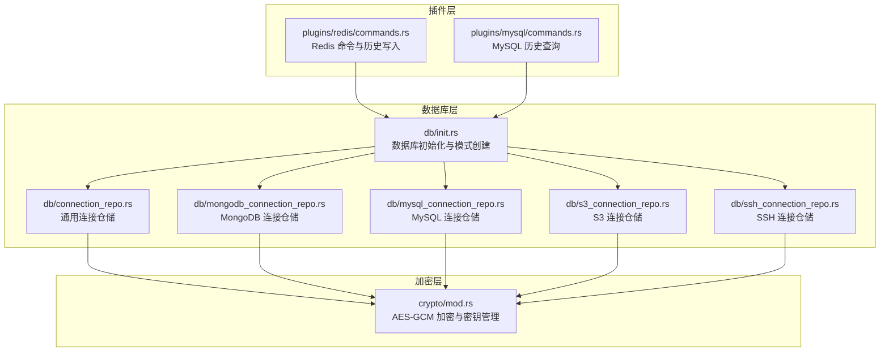
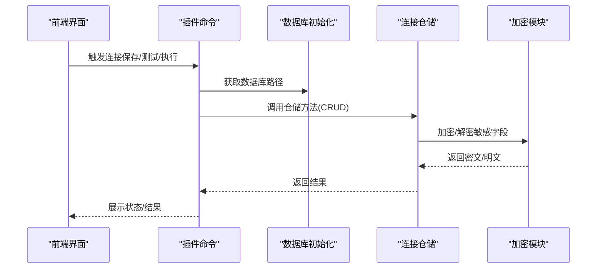
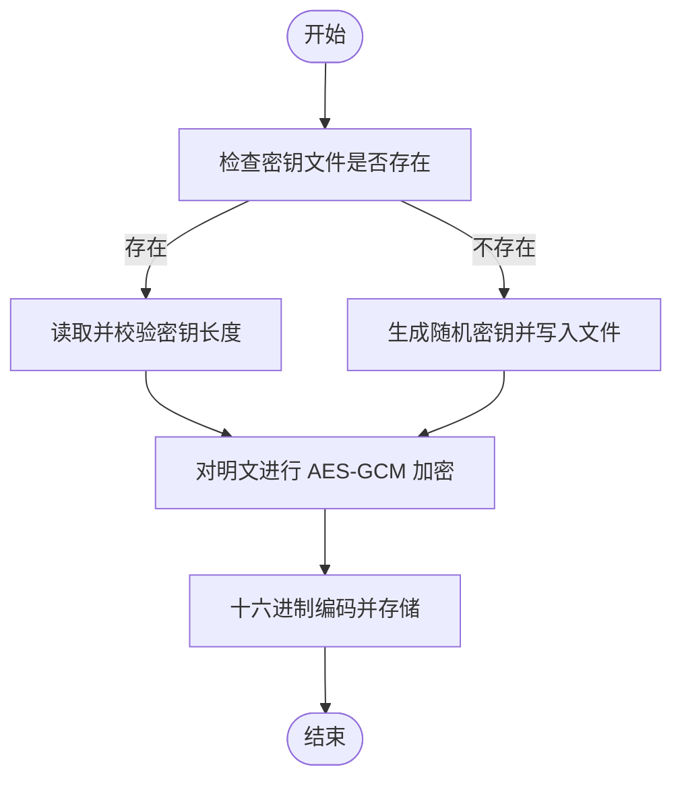
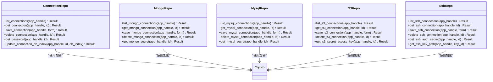
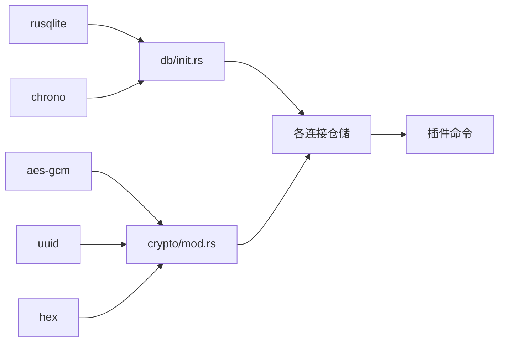

# 数据库设计

<cite>
**本文引用的文件**
- [src-tauri/src/db/mod.rs](file://src-tauri/src/db/mod.rs)
- [src-tauri/src/db/init.rs](file://src-tauri/src/db/init.rs)
- [src-tauri/src/db/connection_repo.rs](file://src-tauri/src/db/connection_repo.rs)
- [src-tauri/src/db/mongodb_connection_repo.rs](file://src-tauri/src/db/mongodb_connection_repo.rs)
- [src-tauri/src/db/mysql_connection_repo.rs](file://src-tauri/src/db/mysql_connection_repo.rs)
- [src-tauri/src/db/s3_connection_repo.rs](file://src-tauri/src/db/s3_connection_repo.rs)
- [src-tauri/src/db/ssh_connection_repo.rs](file://src-tauri/src/db/ssh_connection_repo.rs)
- [src-tauri/src/crypto/mod.rs](file://src-tauri/src/crypto/mod.rs)
- [src-tauri/Cargo.toml](file://src-tauri/Cargo.toml)
- [src-tauri/src/plugins/redis/commands.rs](file://src-tauri/src/plugins/redis/commands.rs)
- [src-tauri/src/plugins/mysql/commands.rs](file://src-tauri/src/plugins/mysql/commands.rs)
</cite>

## 目录
1. [简介](#简介)
2. [项目结构](#项目结构)
3. [核心组件](#核心组件)
4. [架构总览](#架构总览)
5. [详细组件分析](#详细组件分析)
6. [依赖分析](#依赖分析)
7. [性能考虑](#性能考虑)
8. [故障排查指南](#故障排查指南)
9. [结论](#结论)
10. [附录](#附录)

## 简介
本文件为 DevNexus 的数据库设计文档，聚焦于基于 SQLite 的本地数据库架构与实现。内容涵盖：
- 数据库模式设计：表结构、主键、外键与索引策略
- 连接配置存储机制：Redis、SSH、S3、MongoDB、MySQL、MQ 等连接信息的持久化与安全存储
- 加密存储机制：AES-GCM 实现、密钥管理与敏感数据保护
- 数据迁移策略：版本升级、模式变更与向后兼容
- 仓储模式实现：连接仓储与各类型连接仓储的设计与 CRUD 封装
- 性能优化建议：索引、查询与连接池管理
- 数据完整性、事务与错误恢复

## 项目结构
DevNexus 的数据库相关代码集中在 Tauri 后端模块中，采用“按功能域划分”的组织方式：
- db 模块：数据库初始化、通用连接仓储与各类连接仓储
- crypto 模块：对称加密与密钥管理
- 插件模块：各客户端插件通过命令调用数据库与加密模块进行历史记录与连接信息持久化

图表来源
- [src-tauri/src/db/init.rs:35-362](file://src-tauri/src/db/init.rs#L35-L362)
- [src-tauri/src/db/connection_repo.rs:29-174](file://src-tauri/src/db/connection_repo.rs#L29-L174)
- [src-tauri/src/db/mongodb_connection_repo.rs:40-249](file://src-tauri/src/db/mongodb_connection_repo.rs#L40-L249)
- [src-tauri/src/db/mysql_connection_repo.rs:40-209](file://src-tauri/src/db/mysql_connection_repo.rs#L40-L209)
- [src-tauri/src/db/s3_connection_repo.rs:33-188](file://src-tauri/src/db/s3_connection_repo.rs#L33-L188)
- [src-tauri/src/db/ssh_connection_repo.rs:38-218](file://src-tauri/src/db/ssh_connection_repo.rs#L38-L218)
- [src-tauri/src/crypto/mod.rs:40-74](file://src-tauri/src/crypto/mod.rs#L40-L74)
- [src-tauri/src/plugins/redis/commands.rs:92-137](file://src-tauri/src/plugins/redis/commands.rs#L92-L137)
- [src-tauri/src/plugins/mysql/commands.rs:418-441](file://src-tauri/src/plugins/mysql/commands.rs#L418-L441)

章节来源
- [src-tauri/src/db/mod.rs:1-8](file://src-tauri/src/db/mod.rs#L1-L8)
- [src-tauri/src/db/init.rs:28-362](file://src-tauri/src/db/init.rs#L28-L362)

## 核心组件
- 数据库初始化与模式创建：负责应用数据目录解析、数据库文件路径迁移、SQLite 表结构创建与部分列的在线迁移
- 通用连接仓储：提供 Redis 连接信息的增删改查与密码解密
- 各类连接仓储：分别封装 MongoDB、MySQL、S3、SSH 的连接信息持久化与敏感字段解密
- 加密模块：提供 AES-GCM 对称加密封装与密钥文件管理（首次生成、迁移与校验）
- 插件命令：在执行查询或操作时写入历史记录，并通过仓储读取连接配置

章节来源
- [src-tauri/src/db/init.rs:28-362](file://src-tauri/src/db/init.rs#L28-L362)
- [src-tauri/src/db/connection_repo.rs:34-174](file://src-tauri/src/db/connection_repo.rs#L34-L174)
- [src-tauri/src/db/mongodb_connection_repo.rs:72-249](file://src-tauri/src/db/mongodb_connection_repo.rs#L72-L249)
- [src-tauri/src/db/mysql_connection_repo.rs:69-209](file://src-tauri/src/db/mysql_connection_repo.rs#L69-L209)
- [src-tauri/src/db/s3_connection_repo.rs:38-188](file://src-tauri/src/db/s3_connection_repo.rs#L38-L188)
- [src-tauri/src/db/ssh_connection_repo.rs:43-218](file://src-tauri/src/db/ssh_connection_repo.rs#L43-L218)
- [src-tauri/src/crypto/mod.rs:21-74](file://src-tauri/src/crypto/mod.rs#L21-L74)
- [src-tauri/src/plugins/redis/commands.rs:92-137](file://src-tauri/src/plugins/redis/commands.rs#L92-L137)
- [src-tauri/src/plugins/mysql/commands.rs:418-441](file://src-tauri/src/plugins/mysql/commands.rs#L418-L441)

## 架构总览
数据库层以 SQLite 为核心，通过 rusqlite 访问；敏感信息统一经由加密模块进行加解密；各插件通过命令接口与数据库交互。

图表来源
- [src-tauri/src/db/init.rs:28-362](file://src-tauri/src/db/init.rs#L28-L362)
- [src-tauri/src/db/connection_repo.rs:96-155](file://src-tauri/src/db/connection_repo.rs#L96-L155)
- [src-tauri/src/crypto/mod.rs:40-74](file://src-tauri/src/crypto/mod.rs#L40-L74)
- [src-tauri/src/plugins/redis/commands.rs:140-156](file://src-tauri/src/plugins/redis/commands.rs#L140-L156)

## 详细组件分析

### 数据库模式与表结构
- 数据库文件位置：位于应用数据目录下，支持从旧路径迁移
- 初始化 SQL：一次性创建所有业务表，包含连接信息、查询历史、SSH 密钥、SSH 连接、端口转发规则、S3、MongoDB、MySQL、网络诊断、API 集合/请求/环境、MQ 连接/消息历史/已保存消息、局域网聊天设备/房间/成员/消息/传输/共享文件等
- 在线迁移：对某些表新增列时使用 ALTER TABLE 语句进行增量升级

```mermaid
erDiagram
CONNECTIONS {
text id PK
text name
text group_name
text host
int port
text password_encrypted
int db_index
text connection_type
text created_at
}
QUERY_HISTORY {
text id PK
text connection_id FK
text command
text executed_at
}
SSH_KEYS {
text id PK
text name
text type
text private_key_path
text public_key
text created_at
}
SSH_CONNECTIONS {
text id PK
text name
text group_name
text host
int port
text username
text auth_type
text password_encrypted
text key_id
text key_passphrase_encrypted
text jump_host_id
text encoding
int keepalive_interval
text created_at
}
PORT_FORWARD_RULES {
text id PK
text connection_id FK
text name
text type
text local_host
int local_port
text remote_host
int remote_port
int auto_start
text status
}
S3_CONNECTIONS {
text id PK
text name
text group_name
text provider
text endpoint
text region
text access_key_id
text secret_access_key_encrypted
int path_style
text default_bucket
text created_at
}
MONGODB_CONNECTIONS {
text id PK
text name
text group_name
text mode
text uri_encrypted
text host
int port
text username
text password_encrypted
text auth_database
text default_database
text replica_set
int tls
int srv
text created_at
}
MYSQL_CONNECTIONS {
text id PK
text name
text group_name
text host
int port
text username
text password_encrypted
text default_database
text charset
text ssl_mode
int connect_timeout
text created_at
}
MQ_CONNECTIONS {
text id PK
text name
text group_name
text broker_type
text hosts_json
text username
text password_encrypted
int connect_timeout
text rabbitmq_json
text rabbitmq_management_password_encrypted
text kafka_json
text kafka_sasl_password_encrypted
text created_at
text updated_at
}
API_COLLECTIONS {
text id PK
text name
text description
text created_at
text updated_at
}
API_FOLDERS {
text id PK
text collection_id FK
text parent_id
text name
int sort_order
text created_at
text updated_at
}
API_REQUESTS {
text id PK
text collection_id
text folder_id
text name
text method
text url
text params_json
text headers_json
text cookies_json
text auth_json
text body_json
text pre_request
int timeout_ms
int follow_redirects
int validate_ssl
text created_at
text updated_at
}
API_ENVIRONMENTS {
text id PK
text name
text variables_json
text created_at
text updated_at
}
API_REQUEST_HISTORY {
text id PK
text method
text url
text host
text status
int status_code
int duration_ms
text request_json
text response_json
text created_at
}
LAN_CHAT_DEVICES {
text id PK
text device_id UK
text nickname
text host
int port
int online
int is_local
text last_seen
text client_version
text created_at
text updated_at
}
LAN_CHAT_ROOMS {
text id PK
text name
text coordinator_device_id
text channel
text status
text created_at
text updated_at
}
LAN_CHAT_ROOM_MEMBERS {
text id PK
text room_id FK
text device_id FK
text role
int online
text last_seen
text created_at
text updated_at
}
LAN_CHAT_MESSAGES {
text id PK
text conversation_id
text conversation_type
text sender_device_id
text message_type
text content
text metadata_json
text status
text created_at
}
LAN_CHAT_TRANSFERS {
text id PK
text conversation_id
text conversation_type
text peer_device_id
text file_name
int file_size
text sha256
text save_path
text direction
text status
int progress
text created_at
text updated_at
}
LAN_CHAT_SHARED_FILES {
text file_id PK
text token
text path
text file_name
text mime_type
int file_size
text created_at
}
CONNECTIONS ||--o{ QUERY_HISTORY : "has"
SSH_CONNECTIONS ||--o{ PORT_FORWARD_RULES : "has"
API_COLLECTIONS ||--o{ API_FOLDERS : "contains"
API_FOLDERS ||--o{ API_REQUESTS : "contains"
API_COLLECTIONS ||--o{ API_REQUESTS : "contains"
API_ENVIRONMENTS ||--o{ API_REQUESTS : "provides vars"
```

图表来源
- [src-tauri/src/db/init.rs:35-362](file://src-tauri/src/db/init.rs#L35-L362)

章节来源
- [src-tauri/src/db/init.rs:28-362](file://src-tauri/src/db/init.rs#L28-L362)

### 连接配置存储机制
- Redis 连接：存储基本信息与加密后的密码；提供列表、获取、保存、删除、更新 db_index、按 id 查询密码等操作
- SSH 连接：存储主机、端口、用户名、认证方式、加密后的密码与密钥口令、跳板机、编码、保活间隔等；提供列表、获取、保存、删除、查询认证密文并解密
- S3 连接：存储提供商、端点、区域、访问密钥 ID、加密后的密钥；提供列表、获取、保存、删除、查询密钥并解密
- MongoDB 连接：支持 URI 或表单两种模式，存储模式、加密后的 URI 与密码；提供列表、获取、保存、删除、查询密文并解密
- MySQL 连接：存储主机、端口、用户名、默认库、字符集、SSL 模式、连接超时、加密后的密码；提供列表、获取、保存、删除、查询密文并解密
- MQ 连接：存储 Broker 类型、主机列表、用户名、加密后的密码、连接超时、各 Broker 的额外配置与密文

章节来源
- [src-tauri/src/db/connection_repo.rs:34-174](file://src-tauri/src/db/connection_repo.rs#L34-L174)
- [src-tauri/src/db/ssh_connection_repo.rs:43-218](file://src-tauri/src/db/ssh_connection_repo.rs#L43-L218)
- [src-tauri/src/db/s3_connection_repo.rs:38-188](file://src-tauri/src/db/s3_connection_repo.rs#L38-L188)
- [src-tauri/src/db/mongodb_connection_repo.rs:72-249](file://src-tauri/src/db/mongodb_connection_repo.rs#L72-L249)
- [src-tauri/src/db/mysql_connection_repo.rs:69-209](file://src-tauri/src/db/mysql_connection_repo.rs#L69-L209)

### 加密存储机制与密钥管理
- 加密算法：AES-GCM（256 位密钥）
- 密钥来源：应用数据目录下的密钥文件；若不存在则随机生成并以十六进制形式写入；支持从旧文件名迁移
- 加密流程：对敏感字符串进行 AES-GCM 加密并以十六进制存储；解密时先 hex 解码再解密
- 安全注意：当前实现使用固定 nonce，不满足严格 AEAD 最佳实践；生产环境建议使用随机 nonce 并随密文一起存储

图表来源
- [src-tauri/src/crypto/mod.rs:21-74](file://src-tauri/src/crypto/mod.rs#L21-L74)

章节来源
- [src-tauri/src/crypto/mod.rs:21-74](file://src-tauri/src/crypto/mod.rs#L21-L74)

### 数据迁移策略
- 数据库路径迁移：若检测到旧文件名存在则重命名为新名称
- 模式初始化：首次运行时创建所有表；后续版本通过 ALTER TABLE 增量添加列
- 版本升级：通过在初始化逻辑中追加 ALTER 语句实现向后兼容；建议未来引入显式的 schema 版本号与迁移脚本

章节来源
- [src-tauri/src/db/init.rs:17-26](file://src-tauri/src/db/init.rs#L17-L26)
- [src-tauri/src/db/init.rs:356-359](file://src-tauri/src/db/init.rs#L356-L359)

### 仓储模式实现
- 通用连接仓储（Redis）：封装连接列表、按 id 获取、保存（含密码加密）、删除、按 id 查询密码、更新 db_index
- 各类连接仓储：均遵循统一的 CRUD 接口，内部完成敏感字段加密/解密与参数校验
- 数据访问层抽象：仓储函数统一通过 open_db 打开数据库连接，避免重复连接逻辑

图表来源
- [src-tauri/src/db/connection_repo.rs:34-174](file://src-tauri/src/db/connection_repo.rs#L34-L174)
- [src-tauri/src/db/mongodb_connection_repo.rs:72-249](file://src-tauri/src/db/mongodb_connection_repo.rs#L72-L249)
- [src-tauri/src/db/mysql_connection_repo.rs:69-209](file://src-tauri/src/db/mysql_connection_repo.rs#L69-L209)
- [src-tauri/src/db/s3_connection_repo.rs:38-188](file://src-tauri/src/db/s3_connection_repo.rs#L38-L188)
- [src-tauri/src/db/ssh_connection_repo.rs:43-218](file://src-tauri/src/db/ssh_connection_repo.rs#L43-L218)
- [src-tauri/src/crypto/mod.rs:40-74](file://src-tauri/src/crypto/mod.rs#L40-L74)

章节来源
- [src-tauri/src/db/connection_repo.rs:34-174](file://src-tauri/src/db/connection_repo.rs#L34-L174)
- [src-tauri/src/db/mongodb_connection_repo.rs:72-249](file://src-tauri/src/db/mongodb_connection_repo.rs#L72-L249)
- [src-tauri/src/db/mysql_connection_repo.rs:69-209](file://src-tauri/src/db/mysql_connection_repo.rs#L69-L209)
- [src-tauri/src/db/s3_connection_repo.rs:38-188](file://src-tauri/src/db/s3_connection_repo.rs#L38-L188)
- [src-tauri/src/db/ssh_connection_repo.rs:43-218](file://src-tauri/src/db/ssh_connection_repo.rs#L43-L218)

### 查询历史与数据完整性
- Redis 查询历史：每次执行命令时写入历史表，包含连接 id、命令文本与时间戳
- MySQL 查询历史：插件侧提供历史查询接口，按连接 id 与限制条数返回历史记录
- 数据完整性：通过主键约束确保每张表的唯一标识；外键约束用于表达表间关系；敏感字段统一加密存储

章节来源
- [src-tauri/src/plugins/redis/commands.rs:92-137](file://src-tauri/src/plugins/redis/commands.rs#L92-L137)
- [src-tauri/src/plugins/mysql/commands.rs:418-441](file://src-tauri/src/plugins/mysql/commands.rs#L418-L441)
- [src-tauri/src/db/init.rs:49-54](file://src-tauri/src/db/init.rs#L49-L54)
- [src-tauri/src/db/init.rs:159-165](file://src-tauri/src/db/init.rs#L159-L165)

## 依赖分析
- 外部依赖：rusqlite（SQLite）、aes-gcm（对称加密）、uuid、hex、chrono 等
- 内部依赖：db 模块各子模块之间无循环依赖；加密模块被所有仓储模块依赖；插件命令依赖 db 初始化与仓储模块

图表来源
- [src-tauri/Cargo.toml:27-30](file://src-tauri/Cargo.toml#L27-L30)
- [src-tauri/src/db/init.rs:35-362](file://src-tauri/src/db/init.rs#L35-L362)
- [src-tauri/src/crypto/mod.rs:40-74](file://src-tauri/src/crypto/mod.rs#L40-L74)

章节来源
- [src-tauri/Cargo.toml:20-48](file://src-tauri/Cargo.toml#L20-L48)

## 性能考虑
- 索引设计建议
  - 为高频过滤与排序字段建立索引：如连接表的 group_name、created_at；历史表的 connection_id、executed_at
  - 对查询条件较多的表（如 API 请求、MQ 消息历史）评估复合索引
- 查询优化建议
  - 使用 LIMIT 控制历史记录返回数量；避免一次性加载大量数据
  - 对嵌套 JSON 字段（如 hosts_json、params_json、headers_json）尽量减少解析次数
- 连接池管理
  - 对外部服务（Redis、MySQL、MongoDB、S3、MQ）使用连接池；仓储层仅负责配置持久化，不直接管理外部连接池
  - 建议在插件层维护连接池生命周期，仓储层专注配置与历史

## 故障排查指南
- 数据库打开失败：检查数据目录权限与数据库文件路径是否正确
- 加密/解密异常：确认密钥文件存在且为 32 字节十六进制；检查 hex 编码与 UTF-8 解码过程
- 迁移失败：核对 ALTER 语句语法与目标列是否存在；确保数据库版本一致
- 历史记录写入失败：确认历史表已初始化；检查时间戳格式与参数绑定

章节来源
- [src-tauri/src/db/init.rs:33-354](file://src-tauri/src/db/init.rs#L33-L354)
- [src-tauri/src/crypto/mod.rs:57-74](file://src-tauri/src/crypto/mod.rs#L57-L74)
- [src-tauri/src/plugins/redis/commands.rs:96-110](file://src-tauri/src/plugins/redis/commands.rs#L96-L110)

## 结论
DevNexus 的数据库设计以 SQLite 为基础，结合 AES-GCM 对敏感信息进行加密存储，并通过仓储模式实现连接配置的统一管理。初始化阶段完成全量表结构创建与必要的在线迁移，插件通过命令接口与数据库交互。建议在未来版本中引入更严格的密钥管理（随机 nonce）、显式的 schema 版本控制与自动化迁移脚本，以进一步提升安全性与可维护性。

## 附录
- 关键实现参考路径
  - 数据库初始化与模式：[src-tauri/src/db/init.rs:35-362](file://src-tauri/src/db/init.rs#L35-L362)
  - 通用连接仓储（Redis）：[src-tauri/src/db/connection_repo.rs:34-174](file://src-tauri/src/db/connection_repo.rs#L34-L174)
  - 加密模块：[src-tauri/src/crypto/mod.rs:40-74](file://src-tauri/src/crypto/mod.rs#L40-L74)
  - 插件命令（Redis/MySQL 历史）：[src-tauri/src/plugins/redis/commands.rs:92-137](file://src-tauri/src/plugins/redis/commands.rs#L92-L137), [src-tauri/src/plugins/mysql/commands.rs:418-441](file://src-tauri/src/plugins/mysql/commands.rs#L418-L441)