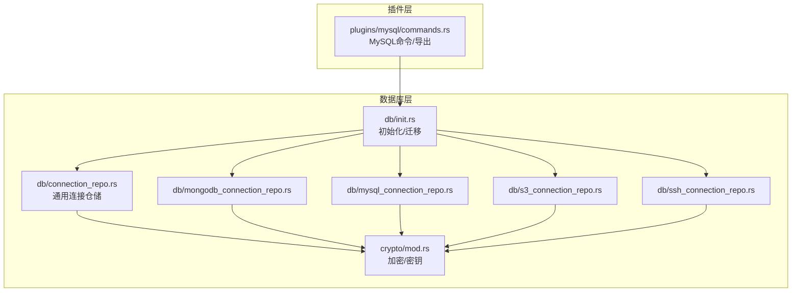
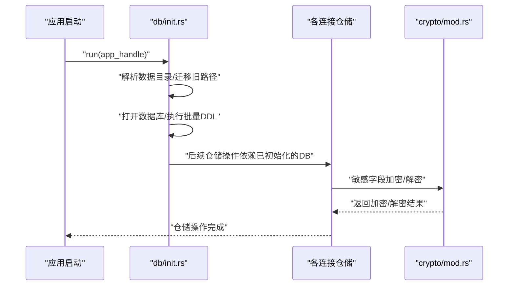
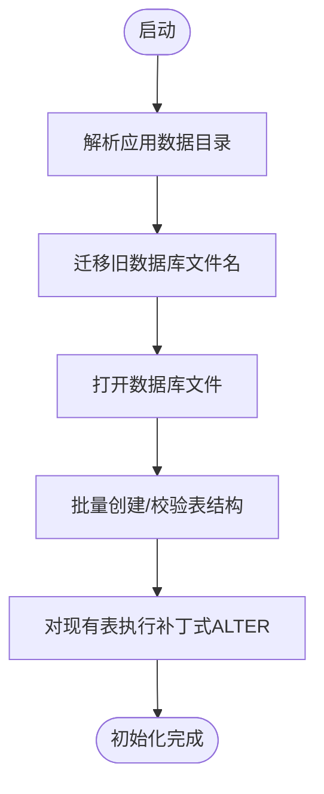
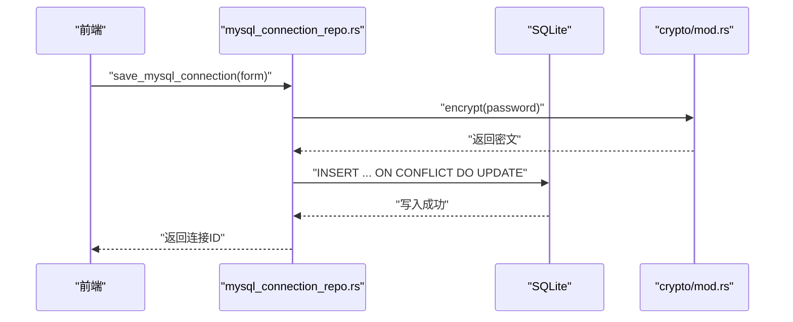
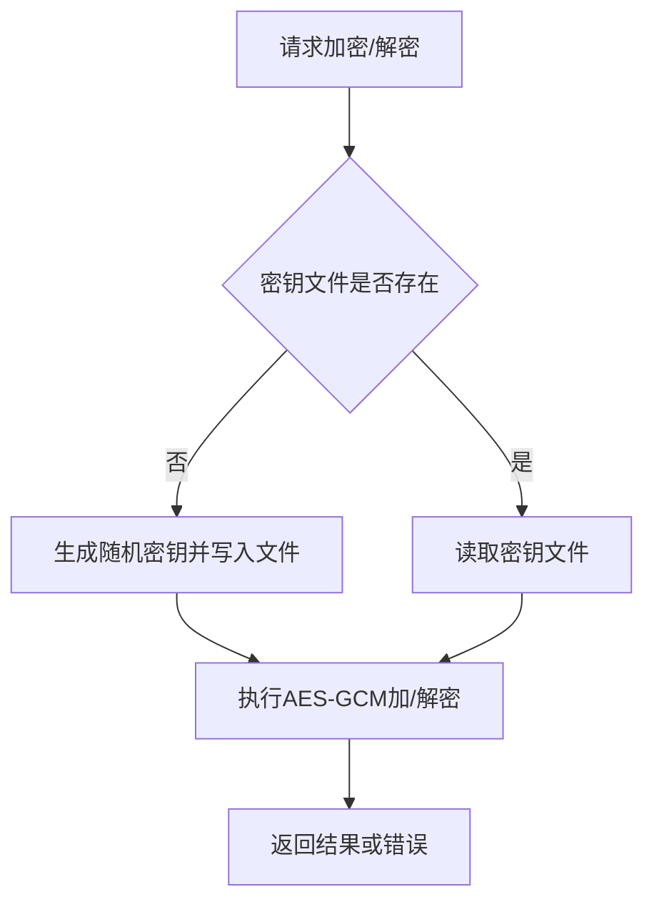
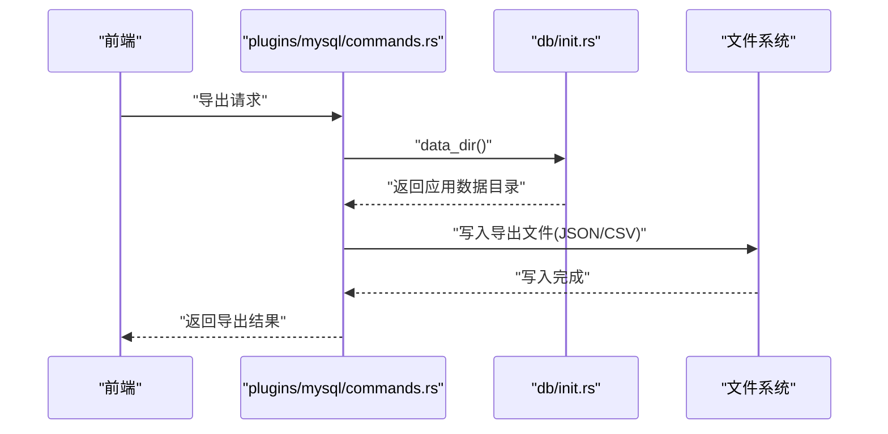
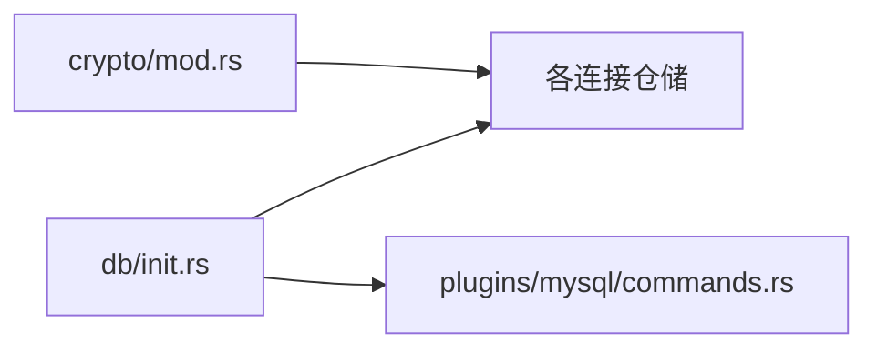

# 数据迁移策略

<cite>
**本文引用的文件**
- [init.rs](file://src-tauri/src/db/init.rs)
- [connection_repo.rs](file://src-tauri/src/db/connection_repo.rs)
- [mongodb_connection_repo.rs](file://src-tauri/src/db/mongodb_connection_repo.rs)
- [mysql_connection_repo.rs](file://src-tauri/src/db/mysql_connection_repo.rs)
- [s3_connection_repo.rs](file://src-tauri/src/db/s3_connection_repo.rs)
- [ssh_connection_repo.rs](file://src-tauri/src/db/ssh_connection_repo.rs)
- [mod.rs](file://src-tauri/src/db/mod.rs)
- [mod.rs](file://src-tauri/src/crypto/mod.rs)
- [Cargo.toml](file://src-tauri/Cargo.toml)
- [commands.rs](file://src-tauri/src/plugins/mysql/commands.rs)
</cite>

## 目录
1. [简介](#简介)
2. [项目结构](#项目结构)
3. [核心组件](#核心组件)
4. [架构总览](#架构总览)
5. [详细组件分析](#详细组件分析)
6. [依赖关系分析](#依赖关系分析)
7. [性能考量](#性能考量)
8. [故障排查指南](#故障排查指南)
9. [结论](#结论)
10. [附录](#附录)

## 简介
本文件面向 DevNexus 的数据迁移策略，聚焦于本地嵌入式数据库（SQLite）的版本管理与迁移实践。当前代码库未实现通用的“数据库版本号 + 自动迁移脚本”框架，而是通过启动初始化流程在首次运行或路径迁移时执行 DDL/DML，以确保表结构与默认列存在性满足功能需求。本文基于现有实现，总结版本管理机制、迁移脚本编写规范、向后兼容性保障、数据完整性保护、测试策略与常见问题排查，帮助团队在演进过程中保持数据一致性与可维护性。

## 项目结构
DevNexus 的数据层位于 Tauri 后端模块中，采用按功能域划分的模块化组织方式：
- 数据库初始化与模式管理：db/init.rs
- 各类连接信息的仓储层：db/*_connection_repo.rs
- 加密与密钥管理：crypto/mod.rs
- 插件侧的数据访问与导出：plugins/mysql/commands.rs
- 模块入口：db/mod.rs

**图表来源**
- [init.rs:28-362](file://src-tauri/src/db/init.rs#L28-L362)
- [connection_repo.rs:29-32](file://src-tauri/src/db/connection_repo.rs#L29-L32)
- [mongodb_connection_repo.rs:40-43](file://src-tauri/src/db/mongodb_connection_repo.rs#L40-L43)
- [mysql_connection_repo.rs:40-43](file://src-tauri/src/db/mysql_connection_repo.rs#L40-L43)
- [s3_connection_repo.rs:33-36](file://src-tauri/src/db/s3_connection_repo.rs#L33-L36)
- [ssh_connection_repo.rs:38-41](file://src-tauri/src/db/ssh_connection_repo.rs#L38-L41)
- [mod.rs:1-8](file://src-tauri/src/db/mod.rs#L1-L8)
- [mod.rs:10-19](file://src-tauri/src/crypto/mod.rs#L10-L19)
- [commands.rs:368-386](file://src-tauri/src/plugins/mysql/commands.rs#L368-L386)

**章节来源**
- [mod.rs:1-8](file://src-tauri/src/db/mod.rs#L1-L8)
- [Cargo.toml:20-48](file://src-tauri/Cargo.toml#L20-L48)

## 核心组件
- 数据库初始化与迁移
  - 负责应用数据目录解析、旧数据库路径迁移、数据库文件定位、首次建表与必要列补丁（例如为现有表添加新列并设置默认值）。
  - 关键点：使用批量执行 DDL，确保幂等；对历史表结构进行“补丁式”变更，避免破坏已有数据。
- 连接信息仓储
  - 提供各类连接（Redis/MongoDB/MySQL/S3/SSH）的 CRUD 与敏感信息读取/加密写入。
  - 关键点：统一使用 SQLite 存储连接元数据；敏感字段均经加密存储；ON CONFLICT UPSERT 保证幂等写入。
- 加密与密钥
  - 统一密钥文件管理与 AES-GCM 加解密，支持旧密钥文件迁移。
  - 关键点：密钥文件路径与数据库文件路径同属应用数据目录；空明文/密文分支处理；错误路径清晰。

**章节来源**
- [init.rs:6-362](file://src-tauri/src/db/init.rs#L6-L362)
- [connection_repo.rs:96-131](file://src-tauri/src/db/connection_repo.rs#L96-L131)
- [mongodb_connection_repo.rs:115-202](file://src-tauri/src/db/mongodb_connection_repo.rs#L115-L202)
- [mysql_connection_repo.rs:108-176](file://src-tauri/src/db/mysql_connection_repo.rs#L108-L176)
- [s3_connection_repo.rs:110-161](file://src-tauri/src/db/s3_connection_repo.rs#L110-L161)
- [ssh_connection_repo.rs:117-167](file://src-tauri/src/db/ssh_connection_repo.rs#L117-L167)
- [mod.rs:10-75](file://src-tauri/src/crypto/mod.rs#L10-L75)

## 架构总览
下图展示启动阶段的数据库初始化与迁移流程，以及各仓储模块如何依赖初始化与加密模块。

**图表来源**
- [init.rs:28-362](file://src-tauri/src/db/init.rs#L28-L362)
- [connection_repo.rs:29-32](file://src-tauri/src/db/connection_repo.rs#L29-L32)
- [mod.rs:40-74](file://src-tauri/src/crypto/mod.rs#L40-L74)

## 详细组件分析

### 数据库初始化与迁移（db/init.rs）
- 版本管理机制
  - 当前未实现显式的“版本号表/迁移脚本清单”。版本演进通过“首次初始化 + 补丁式 ALTER”实现。
  - 旧数据库文件路径迁移：若检测到旧文件名存在则重命名为新名称，确保用户数据无缝迁移。
- 版本检查逻辑
  - 无显式版本号检查；通过“表是否存在 + 列是否存在”作为“软检查”，配合补丁式 ALTER 保证结构可用。
- 自动迁移流程
  - 打开数据库后，执行批量 DDL 创建所有表；随后对现有表执行必要的 ALTER 以增加新列并设置默认值。
  - 流程具备幂等性：CREATE TABLE IF NOT EXISTS + ALTER IF NOT EXISTS（通过 SQLite 语法与错误忽略实现）。

**图表来源**
- [init.rs:28-362](file://src-tauri/src/db/init.rs#L28-L362)

**章节来源**
- [init.rs:6-362](file://src-tauri/src/db/init.rs#L6-L362)

### 连接信息仓储（以 MySQL 为例）
- ORM/模型
  - 定义连接信息与表单结构体，字段与数据库表一一对应，便于序列化/反序列化。
- 事务与幂等
  - 仓储内部未显式开启事务；所有写入使用 SQLite 的 UPSERT（ON CONFLICT DO UPDATE），保证幂等。
- 敏感信息处理
  - 密码等敏感字段在入库前加密，查询时再解密；避免明文落盘。
- 默认值与兼容性
  - 写入时对可选字段进行裁剪与默认值填充，确保新旧字段兼容。

**图表来源**
- [mysql_connection_repo.rs:108-176](file://src-tauri/src/db/mysql_connection_repo.rs#L108-L176)
- [mod.rs:40-74](file://src-tauri/src/crypto/mod.rs#L40-L74)

**章节来源**
- [mysql_connection_repo.rs:1-209](file://src-tauri/src/db/mysql_connection_repo.rs#L1-L209)
- [connection_repo.rs:96-131](file://src-tauri/src/db/connection_repo.rs#L96-L131)
- [mod.rs:10-75](file://src-tauri/src/crypto/mod.rs#L10-L75)

### 加密与密钥管理（crypto/mod.rs）
- 密钥文件迁移
  - 支持从旧密钥文件名迁移到新密钥文件名，避免用户升级后无法读取历史加密数据。
- 加密算法与错误处理
  - 使用固定 nonce 的 AES-GCM 对称加密；对空明文/密文进行特殊处理；错误路径明确。
- 与仓储协作
  - 仓储在保存敏感字段前调用加密，在读取时调用解密，形成闭环。

**图表来源**
- [mod.rs:10-75](file://src-tauri/src/crypto/mod.rs#L10-L75)

**章节来源**
- [mod.rs:10-75](file://src-tauri/src/crypto/mod.rs#L10-L75)

### 插件侧数据访问与导出（plugins/mysql/commands.rs）
- 数据导出
  - 提供导出接口，将查询结果写入应用数据目录下的 exports 文件夹，支持 JSON/CSV 格式。
- 与数据库层协作
  - 导出流程依赖 db/init.rs 中定义的应用数据目录路径，确保导出位置一致。

**图表来源**
- [commands.rs:850-883](file://src-tauri/src/plugins/mysql/commands.rs#L850-L883)
- [init.rs:6-11](file://src-tauri/src/db/init.rs#L6-L11)

**章节来源**
- [commands.rs:850-883](file://src-tauri/src/plugins/mysql/commands.rs#L850-L883)
- [init.rs:6-11](file://src-tauri/src/db/init.rs#L6-L11)

## 依赖关系分析
- 模块耦合
  - db/init.rs 为全局入口，其他仓储模块均依赖其初始化结果。
  - 各仓储模块依赖 crypto/mod.rs 处理敏感字段。
  - 插件层（如 MySQL）依赖 db/init.rs 获取应用数据目录，用于导出。
- 外部依赖
  - rusqlite：SQLite 访问与事务/批处理。
  - aes-gcm/hex：对称加密与十六进制编解码。
  - uuid/chrono：生成 ID 与时间戳。

**图表来源**
- [init.rs:28-362](file://src-tauri/src/db/init.rs#L28-L362)
- [mod.rs:10-75](file://src-tauri/src/crypto/mod.rs#L10-L75)
- [commands.rs:850-883](file://src-tauri/src/plugins/mysql/commands.rs#L850-L883)

**章节来源**
- [Cargo.toml:20-48](file://src-tauri/Cargo.toml#L20-L48)

## 性能考量
- 初始化性能
  - 批量 DDL 在首次启动时执行，建议避免在热路径重复执行；当前实现通过“表/列存在性检查”降低重复成本。
- 查询性能
  - 仓储查询使用简单 WHERE 主键过滤，未见复杂 JOIN 或大结果集扫描；建议在高频查询列上建立索引（遵循“迁移后重建索引”的最佳实践）。
- 写入性能
  - UPSERT 幂等写入减少冲突处理成本；加密/解密为轻量 CPU 操作，建议在批量导入时合并处理以减少往返。

[本节为通用指导，无需列出具体文件来源]

## 故障排查指南
- 数据库文件无法打开
  - 检查应用数据目录权限与磁盘空间；确认旧文件名是否已正确迁移为新文件名。
  - 参考：[init.rs:17-26](file://src-tauri/src/db/init.rs#L17-L26)
- 迁移后列缺失或默认值异常
  - 确认补丁式 ALTER 是否执行；若失败，检查数据库版本与 SQLite 语法兼容性。
  - 参考：[init.rs:356-359](file://src-tauri/src/db/init.rs#L356-L359)
- 密钥文件损坏或不存在
  - 删除旧密钥文件后重启应用会重新生成；注意备份用户数据以防密钥丢失导致历史数据不可读。
  - 参考：[mod.rs:21-38](file://src-tauri/src/crypto/mod.rs#L21-L38)
- 仓储写入失败
  - 检查表结构是否与模型一致；确认 ON CONFLICT UPSERT 的字段是否匹配。
  - 参考：[mysql_connection_repo.rs:140-173](file://src-tauri/src/db/mysql_connection_repo.rs#L140-L173)
- 导出失败
  - 检查导出目录是否存在且可写；确认导出格式与数据编码。
  - 参考：[commands.rs:859-883](file://src-tauri/src/plugins/mysql/commands.rs#L859-L883)

**章节来源**
- [init.rs:17-26](file://src-tauri/src/db/init.rs#L17-L26)
- [init.rs:356-359](file://src-tauri/src/db/init.rs#L356-L359)
- [mod.rs:21-38](file://src-tauri/src/crypto/mod.rs#L21-L38)
- [mysql_connection_repo.rs:140-173](file://src-tauri/src/db/mysql_connection_repo.rs#L140-L173)
- [commands.rs:859-883](file://src-tauri/src/plugins/mysql/commands.rs#L859-L883)

## 结论
DevNexus 当前采用“启动即初始化 + 补丁式 ALTER”的轻量迁移策略，通过幂等的 DDL 与 UPSERT 写入保障了基本的向前兼容与数据安全。建议在后续版本中引入更严格的版本号管理与迁移脚本框架，以提升可审计性与可控性；同时完善索引与统计信息的迁移与重建流程，进一步优化查询性能。

[本节为总结性内容，无需列出具体文件来源]

## 附录

### 迁移脚本编写规范（基于现有实践提炼）
- SQL 语句组织
  - 使用批量 DDL，先创建/校验表，再执行补丁式 ALTER，最后进行数据迁移（如有需要）。
  - 参考：[init.rs:35-354](file://src-tauri/src/db/init.rs#L35-L354)
- 事务处理与回滚
  - 仓储层未显式开启事务；建议在需要强一致性的场景（多表联动）使用显式事务包裹，并在失败时回滚。
- 向后兼容性
  - 新增列时提供默认值；对可选字段进行裁剪与默认填充；保留旧字段一段时间后清理。
  - 参考：[mysql_connection_repo.rs:167-168](file://src-tauri/src/db/mysql_connection_repo.rs#L167-L168)
- 数据完整性保护
  - 迁移后重建索引与更新统计信息；对主外键约束进行一致性校验。
  - 参考：[init.rs:356-359](file://src-tauri/src/db/init.rs#L356-L359)
- 测试策略
  - 测试环境搭建：准备多版本数据库快照；模拟旧表结构与新表结构并行运行。
  - 数据备份验证：导出关键表数据，迁移后比对一致性。
  - 迁移风险评估：对关键业务表进行抽样迁移，观察性能与稳定性。
  - 参考：[commands.rs:859-883](file://src-tauri/src/plugins/mysql/commands.rs#L859-L883)

**章节来源**
- [init.rs:35-354](file://src-tauri/src/db/init.rs#L35-L354)
- [mysql_connection_repo.rs:167-168](file://src-tauri/src/db/mysql_connection_repo.rs#L167-L168)
- [commands.rs:859-883](file://src-tauri/src/plugins/mysql/commands.rs#L859-L883)