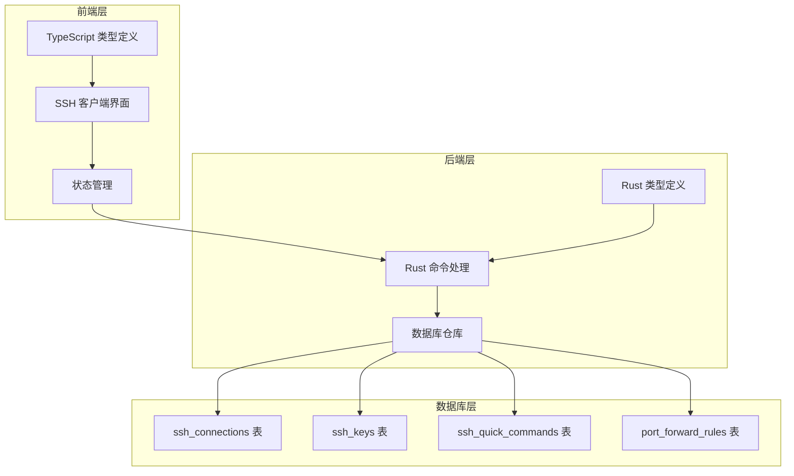
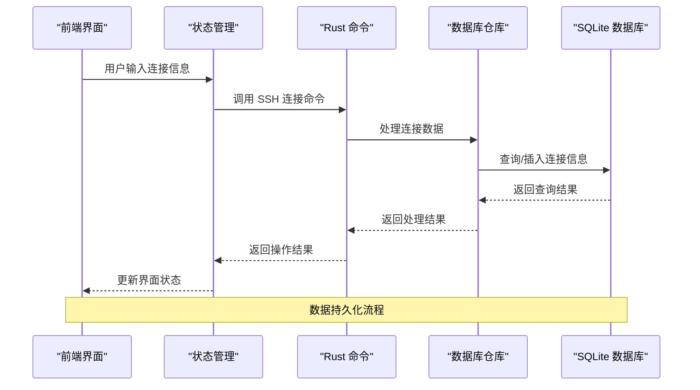
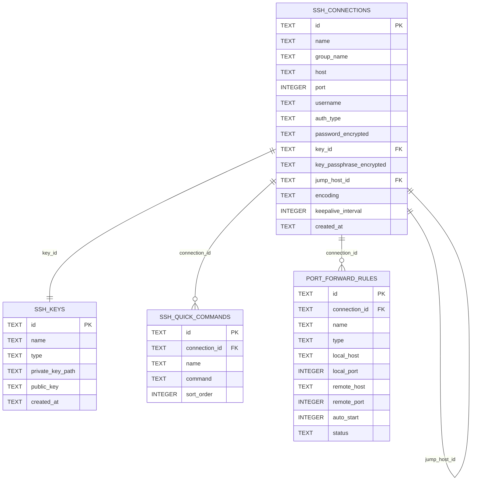

# SSH 连接相关表

<cite>
**本文档引用的文件**
- [ssh_connection_repo.rs](file://src-tauri/src/db/ssh_connection_repo.rs)
- [types.rs](file://src-tauri/src/plugins/ssh/types.rs)
- [init.rs](file://src-tauri/src/db/init.rs)
- [commands.rs](file://src-tauri/src/plugins/ssh/commands.rs)
- [key_store.rs](file://src-tauri/src/plugins/ssh/key_store.rs)
- [tunnel.rs](file://src-tauri/src/plugins/ssh/tunnel.rs)
- [types.ts](file://src/plugins/ssh-client/types.ts)
</cite>

## 目录
1. [简介](#简介)
2. [项目结构](#项目结构)
3. [核心组件](#核心组件)
4. [架构概览](#架构概览)
5. [详细组件分析](#详细组件分析)
6. [依赖关系分析](#依赖关系分析)
7. [性能考虑](#性能考虑)
8. [故障排除指南](#故障排除指南)
9. [结论](#结论)

## 简介

本文档详细说明了 DevNexus 中 SSH 连接相关的数据库表设计，包括 ssh_connections、ssh_keys、ssh_quick_commands 和 port_forward_rules 四个核心表。这些表共同构成了 SSH 连接管理系统的数据基础，支持用户通过图形界面进行 SSH 连接配置、密钥管理、快速命令执行和端口转发等功能。

## 项目结构

SSH 连接相关功能分布在前端和后端两个层面：

**图表来源**
- [ssh_connection_repo.rs:1-218](file://src-tauri/src/db/ssh_connection_repo.rs#L1-L218)
- [commands.rs:1-266](file://src-tauri/src/plugins/ssh/commands.rs#L1-L266)
- [init.rs:56-101](file://src-tauri/src/db/init.rs#L56-L101)

**章节来源**
- [ssh_connection_repo.rs:1-218](file://src-tauri/src/db/ssh_connection_repo.rs#L1-L218)
- [commands.rs:1-266](file://src-tauri/src/plugins/ssh/commands.rs#L1-L266)
- [init.rs:56-101](file://src-tauri/src/db/init.rs#L56-L101)

## 核心组件

### 数据库表概述

DevNexus 的 SSH 连接系统包含四个核心数据库表，每个表都有其特定的功能和设计目的：

1. **ssh_connections**: 存储 SSH 连接配置信息
2. **ssh_keys**: 管理 SSH 密钥对信息
3. **ssh_quick_commands**: 提供快速命令执行功能
4. **port_forward_rules**: 实现端口转发规则管理

**章节来源**
- [init.rs:65-101](file://src-tauri/src/db/init.rs#L65-L101)

## 架构概览

SSH 连接系统的整体架构采用分层设计，从前端界面到后端数据库形成完整的数据流：

**图表来源**
- [commands.rs:8-75](file://src-tauri/src/plugins/ssh/commands.rs#L8-L75)
- [ssh_connection_repo.rs:117-167](file://src-tauri/src/db/ssh_connection_repo.rs#L117-L167)

## 详细组件分析

### ssh_connections 表设计

ssh_connections 表是 SSH 连接系统的核心表，负责存储所有 SSH 连接的配置信息。

#### 表结构定义

| 字段名 | 数据类型 | 约束条件 | 默认值 | 描述 |
|--------|----------|----------|--------|------|
| id | TEXT | PRIMARY KEY NOT NULL | 无 | 连接唯一标识符（UUID） |
| name | TEXT | NOT NULL | 无 | 连接名称 |
| group_name | TEXT | 可空 | 无 | 连接分组名称 |
| host | TEXT | NOT NULL | 无 | SSH 服务器主机地址 |
| port | INTEGER | NOT NULL | 22 | SSH 服务器端口号 |
| username | TEXT | NOT NULL | 无 | 用户名 |
| auth_type | TEXT | NOT NULL | 无 | 认证类型（password/key/key_password） |
| password_encrypted | TEXT | 可空 | 无 | 加密后的密码 |
| key_id | TEXT | 可空 | 无 | 关联的密钥 ID |
| key_passphrase_encrypted | TEXT | 可空 | 无 | 加密后的密钥口令 |
| jump_host_id | TEXT | 可空 | 无 | 跳板机连接 ID |
| encoding | TEXT | NOT NULL | 'utf-8' | 编码格式 |
| keepalive_interval | INTEGER | NOT NULL | 30 | 保活间隔（秒） |
| created_at | TEXT | NOT NULL | 无 | 创建时间 |

#### 认证类型说明

支持三种认证方式：
- `password`: 使用密码认证
- `key`: 使用密钥认证
- `key_password`: 使用密钥和密钥口令认证

#### 复杂度分析

- **查询复杂度**: O(log n) - 基于主键查询
- **插入复杂度**: O(1) - 直接插入新记录
- **更新复杂度**: O(1) - 基于主键更新

**章节来源**
- [init.rs:65-80](file://src-tauri/src/db/init.rs#L65-L80)
- [ssh_connection_repo.rs:5-18](file://src-tauri/src/db/ssh_connection_repo.rs#L5-L18)
- [ssh_connection_repo.rs:22-36](file://src-tauri/src/db/ssh_connection_repo.rs#L22-L36)

### ssh_keys 表设计

ssh_keys 表用于管理 SSH 密钥对信息，支持多种密钥类型。

#### 表结构定义

| 字段名 | 数据类型 | 约束条件 | 默认值 | 描述 |
|--------|----------|----------|--------|------|
| id | TEXT | PRIMARY KEY NOT NULL | 无 | 密钥唯一标识符（UUID） |
| name | TEXT | NOT NULL | 无 | 密钥名称 |
| type | TEXT | NOT NULL | 无 | 密钥类型（rsa/ed25519/ecdsa） |
| private_key_path | TEXT | NOT NULL | 无 | 私钥文件路径 |
| public_key | TEXT | NOT NULL | 无 | 公钥内容 |
| created_at | TEXT | NOT NULL | 无 | 创建时间 |

#### 支持的密钥类型

- **RSA**: 标准 RSA 密钥对
- **ED25519**: 现代 Ed25519 曲线密钥对
- **ECDSA**: 椭圆曲线 ECDSA 密钥对

#### 复杂度分析

- **查询复杂度**: O(log n) - 基于主键查询
- **插入复杂度**: O(1) - 直接插入新记录
- **删除复杂度**: O(1) - 基于主键删除

**章节来源**
- [init.rs:56-63](file://src-tauri/src/db/init.rs#L56-L63)
- [types.rs:17-24](file://src-tauri/src/plugins/ssh/types.rs#L17-L24)
- [key_store.rs:39-64](file://src-tauri/src/plugins/ssh/key_store.rs#L39-L64)

### ssh_quick_commands 表设计

ssh_quick_commands 表提供快速命令执行功能，支持全局和连接特定的命令。

#### 表结构定义

| 字段名 | 数据类型 | 约束条件 | 默认值 | 描述 |
|--------|----------|----------|--------|------|
| id | TEXT | PRIMARY KEY NOT NULL | 无 | 命令唯一标识符（UUID） |
| connection_id | TEXT | 可空 | 无 | 关联的连接 ID（可为空表示全局命令） |
| name | TEXT | NOT NULL | 无 | 命令名称 |
| command | TEXT | NOT NULL | 无 | 实际执行的命令 |
| sort_order | INTEGER | NOT NULL | 0 | 排序顺序 |

#### 功能特性

- **全局命令**: 当 `connection_id` 为 NULL 时，命令对所有连接可用
- **连接特定命令**: 当 `connection_id` 指定具体连接时，仅该连接可见
- **排序机制**: 通过 `sort_order` 字段控制命令显示顺序

#### 复杂度分析

- **查询复杂度**: O(n log n) - 需要按排序字段排序
- **插入复杂度**: O(1) - 直接插入新记录
- **删除复杂度**: O(1) - 基于主键删除

**章节来源**
- [init.rs:82-88](file://src-tauri/src/db/init.rs#L82-L88)
- [types.rs:36-42](file://src-tauri/src/plugins/ssh/types.rs#L36-L42)
- [commands.rs:147-175](file://src-tauri/src/plugins/ssh/commands.rs#L147-L175)

### port_forward_rules 表设计

port_forward_rules 表实现 SSH 端口转发功能，支持本地、远程和动态转发模式。

#### 表结构定义

| 字段名 | 数据类型 | 约束条件 | 默认值 | 描述 |
|--------|----------|----------|--------|------|
| id | TEXT | PRIMARY KEY NOT NULL | 无 | 规则唯一标识符（UUID） |
| connection_id | TEXT | NOT NULL | 无 | 关联的连接 ID |
| name | TEXT | NOT NULL | 无 | 规则名称 |
| type | TEXT | NOT NULL | 无 | 转发类型（local/remote/dynamic） |
| local_host | TEXT | 可空 | 无 | 本地主机地址 |
| local_port | INTEGER | 可空 | 无 | 本地端口号 |
| remote_host | TEXT | 可空 | 无 | 远程主机地址 |
| remote_port | INTEGER | 可空 | 无 | 远程端口号 |
| auto_start | INTEGER | NOT NULL | 0 | 是否自动启动（布尔值存储） |
| status | TEXT | NOT NULL | 'stopped' | 规则状态（stopped/running/error） |

#### 转发类型说明

- **local**: 本地转发 - 将本地端口转发到远程主机
- **remote**: 远程转发 - 将远程端口转发到本地主机
- **dynamic**: 动态转发 - SOCKS 代理转发

#### 状态管理

- **stopped**: 规则已停止
- **running**: 规则正在运行
- **error**: 规则运行出错

#### 复杂度分析

- **查询复杂度**: O(n log n) - 需要按名称排序
- **插入复杂度**: O(1) - 直接插入新记录
- **删除复杂度**: O(1) - 基于主键删除

**章节来源**
- [init.rs:90-101](file://src-tauri/src/db/init.rs#L90-L101)
- [types.rs:56-67](file://src-tauri/src/plugins/ssh/types.rs#L56-L67)
- [tunnel.rs:45-62](file://src-tauri/src/plugins/ssh/tunnel.rs#L45-L62)

## 依赖关系分析

SSH 连接相关表之间存在以下依赖关系：

**图表来源**
- [init.rs:65-101](file://src-tauri/src/db/init.rs#L65-L101)
- [ssh_connection_repo.rs:13-14](file://src-tauri/src/db/ssh_connection_repo.rs#L13-L14)

### 外键约束说明

1. **ssh_connections.key_id → ssh_keys.id**: 连接表中的密钥 ID 引用密钥表的主键
2. **ssh_quick_commands.connection_id → ssh_connections.id**: 快速命令表中的连接 ID 引用连接表的主键
3. **port_forward_rules.connection_id → ssh_connections.id**: 端口转发规则表中的连接 ID 引用连接表的主键
4. **ssh_connections.jump_host_id → ssh_connections.id**: 跳板机功能支持自引用，允许连接指向其他连接

### 数据完整性保证

- **主键约束**: 所有表都使用 UUID 作为主键，确保唯一性
- **非空约束**: 关键字段如 name、host、username 等都设置为 NOT NULL
- **默认值**: 关键字段设置了合理的默认值，如端口默认 22、编码默认 utf-8、保活间隔默认 30
- **类型约束**: 字段类型与业务需求相匹配，如端口使用 INTEGER，布尔值使用 INTEGER 存储

**章节来源**
- [init.rs:65-101](file://src-tauri/src/db/init.rs#L65-L101)
- [ssh_connection_repo.rs:13-14](file://src-tauri/src/db/ssh_connection_repo.rs#L13-L14)

## 性能考虑

### 查询优化策略

1. **索引设计**: 建议在常用查询字段上建立索引，如 `ssh_connections.host`、`ssh_connections.username`、`ssh_quick_commands.connection_id`
2. **连接池**: 使用 SQLite 连接池减少连接开销
3. **批量操作**: 对于大量数据操作，使用批量插入和更新

### 内存管理

1. **数据序列化**: 使用 serde 序列化/反序列化，减少内存占用
2. **异步操作**: 对于耗时操作使用异步处理，避免阻塞主线程
3. **缓存策略**: 对频繁访问的数据建立缓存机制

### 安全考虑

1. **数据加密**: 敏感信息如密码和密钥口令使用加密存储
2. **访问控制**: 通过 Rust 的类型系统确保类型安全
3. **SQL 注入防护**: 使用参数化查询防止 SQL 注入攻击

## 故障排除指南

### 常见问题及解决方案

#### 连接失败问题

1. **网络连接问题**: 检查主机地址和端口配置
2. **认证失败**: 验证用户名、密码或密钥配置
3. **超时问题**: 调整 keepalive_interval 参数

#### 数据库操作问题

1. **连接创建失败**: 检查数据库文件权限和路径
2. **数据查询异常**: 验证表结构和字段类型
3. **数据更新冲突**: 检查并发访问情况

#### 性能问题

1. **查询响应慢**: 分析查询计划，添加必要的索引
2. **内存占用高**: 检查数据序列化和缓存策略
3. **磁盘空间不足**: 定期清理日志和临时文件

**章节来源**
- [ssh_connection_repo.rs:38-41](file://src-tauri/src/db/ssh_connection_repo.rs#L38-L41)
- [commands.rs:30-62](file://src-tauri/src/plugins/ssh/commands.rs#L30-L62)

## 结论

DevNexus 的 SSH 连接相关表设计体现了良好的数据库规范化原则和实际业务需求的平衡。通过四个核心表的协同工作，系统提供了完整的 SSH 连接管理功能，包括连接配置、密钥管理、快速命令执行和端口转发等特性。

设计特点包括：
- **安全性**: 敏感信息加密存储
- **灵活性**: 支持多种认证方式和转发类型
- **可扩展性**: 清晰的表结构便于功能扩展
- **易用性**: 合理的默认值和约束条件

这些设计为后续功能扩展和维护奠定了坚实的基础。