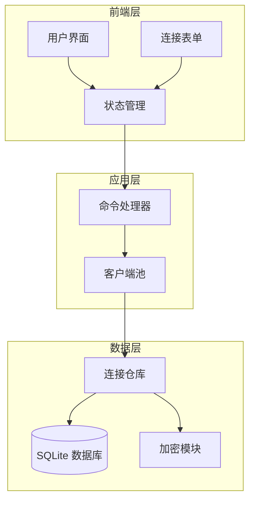
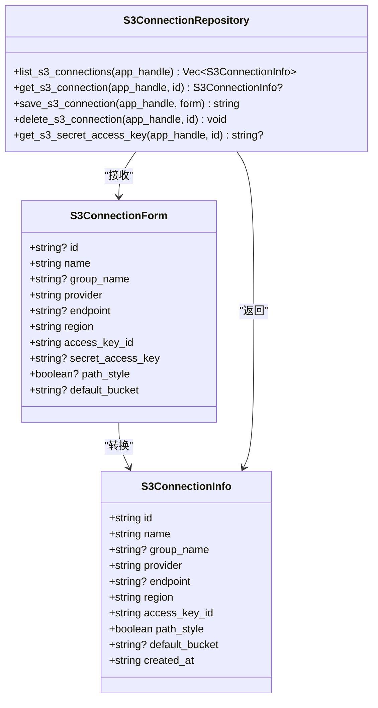
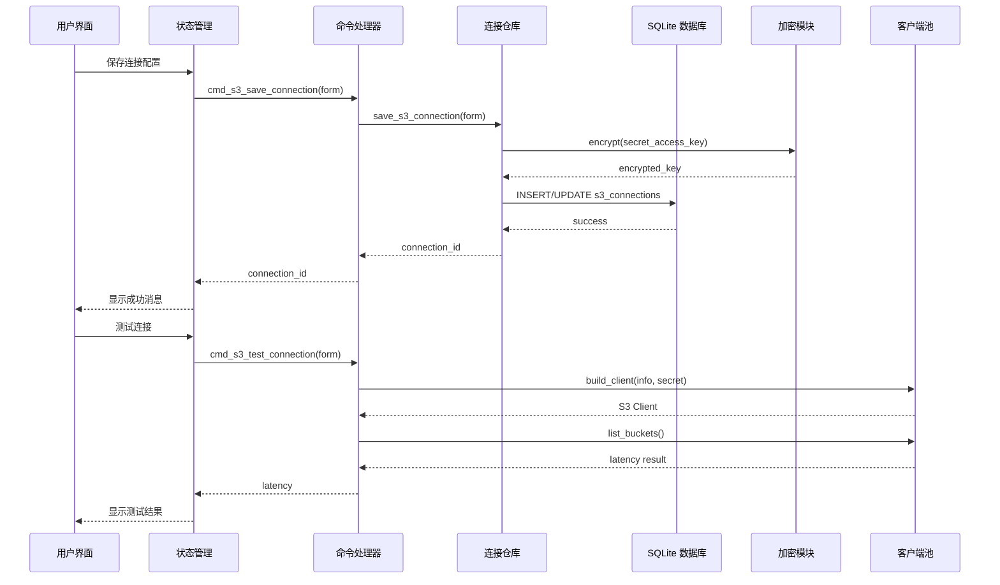
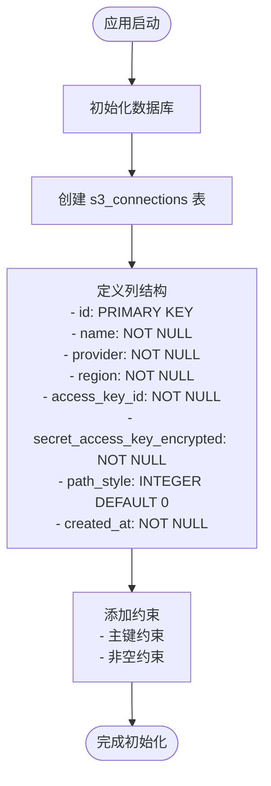
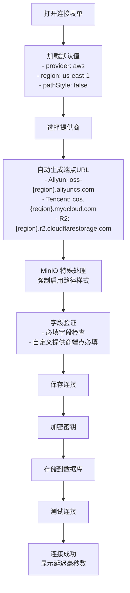
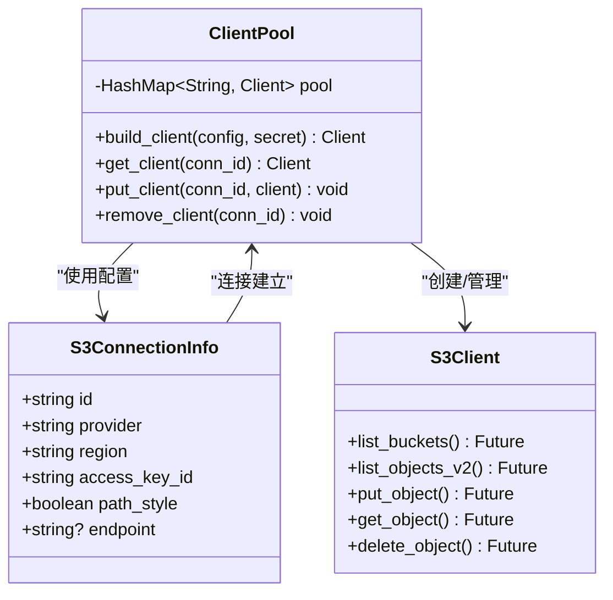
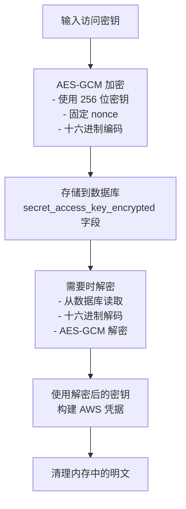
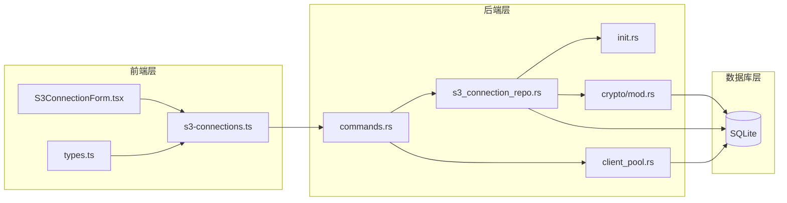

# 云存储连接表

<cite>
**本文档引用的文件**
- [s3_connection_repo.rs](file://src-tauri/src/db/s3_connection_repo.rs)
- [init.rs](file://src-tauri/src/db/init.rs)
- [s3-connections.ts](file://src/plugins/s3-client/store/s3-connections.ts)
- [types.ts](file://src/plugins/s3-client/types.ts)
- [S3ConnectionForm.tsx](file://src/plugins/s3-client/components/S3ConnectionForm.tsx)
- [commands.rs](file://src-tauri/src/plugins/s3/commands.rs)
- [client_pool.rs](file://src-tauri/src/plugins/s3/client_pool.rs)
- [mod.rs](file://src-tauri/src/plugins/s3/mod.rs)
- [mod.rs](file://src-tauri/src/crypto/mod.rs)
</cite>

## 目录
1. [简介](#简介)
2. [项目结构](#项目结构)
3. [核心组件](#核心组件)
4. [架构概览](#架构概览)
5. [详细组件分析](#详细组件分析)
6. [依赖分析](#依赖分析)
7. [性能考虑](#性能考虑)
8. [故障排除指南](#故障排除指南)
9. [结论](#结论)

## 简介

DevNexus 是一个功能丰富的开发者工具平台，提供了多种数据库和云存储连接管理能力。本文档专注于云存储连接表的设计与实现，特别是 s3_connections 表的结构设计、字段含义以及与云存储插件的集成关系。

s3_connections 表是 DevNexus 中用于存储 S3 兼容云存储连接信息的核心数据结构，支持多种云存储提供商（AWS S3、MinIO、阿里云 OSS、腾讯云 COS、Cloudflare R2 等），并通过加密机制确保敏感凭据的安全存储。

## 项目结构

DevNexus 的云存储连接系统采用分层架构设计，主要包含以下层次：

**图表来源**
- [s3-connections.ts:137-431](file://src/plugins/s3-client/store/s3-connections.ts#L137-L431)
- [commands.rs:14-95](file://src-tauri/src/plugins/s3/commands.rs#L14-L95)
- [s3_connection_repo.rs:38-187](file://src-tauri/src/db/s3_connection_repo.rs#L38-L187)

**章节来源**
- [s3-connections.ts:1-432](file://src/plugins/s3-client/store/s3-connections.ts#L1-L432)
- [commands.rs:1-1080](file://src-tauri/src/plugins/s3/commands.rs#L1-L1080)
- [s3_connection_repo.rs:1-188](file://src-tauri/src/db/s3_connection_repo.rs#L1-L188)

## 核心组件

### 数据库表结构

s3_connections 表采用 SQLite 关系型数据库存储，包含以下核心字段：

| 字段名 | 类型 | 默认值 | 说明 |
|--------|------|--------|------|
| id | TEXT | PRIMARY KEY | 连接唯一标识符 |
| name | TEXT | NOT NULL | 连接名称 |
| group_name | TEXT | NULL | 连接分组 |
| provider | TEXT | NOT NULL | 云存储提供商类型 |
| endpoint | TEXT | NULL | 自定义端点URL |
| region | TEXT | NOT NULL | 区域信息 |
| access_key_id | TEXT | NOT NULL | 访问密钥ID |
| secret_access_key_encrypted | TEXT | NOT NULL | 加密后的密钥 |
| path_style | INTEGER | 0 (默认) | 路径样式标志 |
| default_bucket | TEXT | NULL | 默认存储桶 |
| created_at | TEXT | NOT NULL | 创建时间戳 |

### 数据模型映射

**图表来源**
- [s3_connection_repo.rs:3-31](file://src-tauri/src/db/s3_connection_repo.rs#L3-L31)
- [init.rs:103-115](file://src-tauri/src/db/init.rs#L103-L115)

**章节来源**
- [s3_connection_repo.rs:3-31](file://src-tauri/src/db/s3_connection_repo.rs#L3-L31)
- [init.rs:103-115](file://src-tauri/src/db/init.rs#L103-L115)

## 架构概览

DevNexus 的云存储连接架构采用命令模式和客户端池化设计，实现了高效且安全的连接管理：

**图表来源**
- [commands.rs:22-80](file://src-tauri/src/plugins/s3/commands.rs#L22-L80)
- [s3_connection_repo.rs:110-161](file://src-tauri/src/db/s3_connection_repo.rs#L110-L161)
- [client_pool.rs:34-59](file://src-tauri/src/plugins/s3/client_pool.rs#L34-L59)

## 详细组件分析

### 数据库初始化与表创建

s3_connections 表在应用启动时通过数据库初始化脚本自动创建。该表设计遵循 SQLite 最佳实践，使用适当的索引和约束来确保数据完整性和查询性能。

**图表来源**
- [init.rs:103-115](file://src-tauri/src/db/init.rs#L103-L115)

**章节来源**
- [init.rs:28-372](file://src-tauri/src/db/init.rs#L28-L372)

### 连接配置表单与验证

前端提供了完整的 S3 连接配置界面，支持多种提供商类型和高级配置选项：

**图表来源**
- [S3ConnectionForm.tsx:42-107](file://src/plugins/s3-client/components/S3ConnectionForm.tsx#L42-L107)
- [types.ts:3-14](file://src/plugins/s3-client/types.ts#L3-L14)

**章节来源**
- [S3ConnectionForm.tsx:1-220](file://src/plugins/s3-client/components/S3ConnectionForm.tsx#L1-L220)
- [types.ts:1-110](file://src/plugins/s3-client/types.ts#L1-L110)

### 客户端池化与连接管理

DevNexus 实现了高效的客户端池化机制，避免频繁创建和销毁 S3 客户端实例：

**图表来源**
- [client_pool.rs:10-85](file://src-tauri/src/plugins/s3/client_pool.rs#L10-L85)

**章节来源**
- [client_pool.rs:1-86](file://src-tauri/src/plugins/s3/client_pool.rs#L1-L86)

### 加密存储机制

敏感的访问密钥通过 AES-GCM 加密算法进行安全存储，确保即使数据库被窃取也不会泄露真实密钥：

**图表来源**
- [mod.rs:40-74](file://src-tauri/src/crypto/mod.rs#L40-L74)

**章节来源**
- [mod.rs:1-75](file://src-tauri/src/crypto/mod.rs#L1-L75)

## 依赖分析

### 组件间依赖关系

**图表来源**
- [mod.rs:1-4](file://src-tauri/src/plugins/s3/mod.rs#L1-L4)
- [s3-connections.ts:1-432](file://src/plugins/s3-client/store/s3-connections.ts#L1-L432)
- [commands.rs:1-1080](file://src-tauri/src/plugins/s3/commands.rs#L1-L1080)

### 外部依赖

- **aws-sdk-s3**: AWS SDK for Rust，提供 S3 操作能力
- **rusqlite**: SQLite 数据库绑定，用于本地数据存储
- **aes-gcm**: 高级加密标准，用于密钥加密
- **uuid**: 唯一标识符生成
- **chrono**: 时间戳处理

**章节来源**
- [commands.rs:1-13](file://src-tauri/src/plugins/s3/commands.rs#L1-L13)
- [s3_connection_repo.rs:1-6](file://src-tauri/src/db/s3_connection_repo.rs#L1-L6)

## 性能考虑

### 查询优化策略

1. **索引设计**: s3_connections 表的主键索引确保快速查找
2. **批量操作**: 支持批量删除和上传操作，减少网络往返
3. **连接复用**: 客户端池化避免重复创建连接
4. **分页处理**: 对象列表支持分页，限制每次请求的数据量

### 内存管理

- 使用 OnceLock 确保客户端池的线程安全初始化
- 及时清理不再使用的连接引用
- 加密和解密过程中的内存清理

## 故障排除指南

### 常见问题及解决方案

#### 连接失败问题

**症状**: 测试连接时报错或超时
**可能原因**:
- 网络连接问题
- 凭据错误
- 端点配置不正确
- 防火墙阻止

**解决步骤**:
1. 验证网络连通性
2. 检查访问密钥和密钥 ID
3. 确认端点 URL 正确性
4. 检查防火墙设置

#### 路径样式问题

**症状**: 访问某些 S3 兼容服务时出现 404 错误
**解决方案**:
- 对于 MinIO 和其他兼容服务，启用路径样式选项
- 确保端点 URL 使用正确的格式

#### 加密问题

**症状**: 无法读取已保存的连接信息
**可能原因**:
- 密钥文件损坏
- 数据库迁移问题

**解决方法**:
1. 检查密钥文件是否存在且可读
2. 重新创建连接配置
3. 备份并恢复数据库

**章节来源**
- [S3ConnectionForm.tsx:82-94](file://src/plugins/s3-client/components/S3ConnectionForm.tsx#L82-L94)
- [commands.rs:36-80](file://src-tauri/src/plugins/s3/commands.rs#L36-L80)

## 结论

DevNexus 的云存储连接表设计体现了现代应用程序架构的最佳实践：

1. **安全性**: 通过加密存储敏感凭据，确保数据安全
2. **可扩展性**: 支持多种云存储提供商，适应不同的部署需求
3. **易用性**: 提供直观的配置界面和完善的错误处理
4. **性能**: 采用客户端池化和优化的查询策略
5. **可靠性**: 完善的连接管理和故障恢复机制

s3_connections 表作为云存储功能的核心数据结构，为 DevNexus 提供了强大而灵活的云存储连接管理能力，满足了从个人开发者到企业用户的多样化需求。