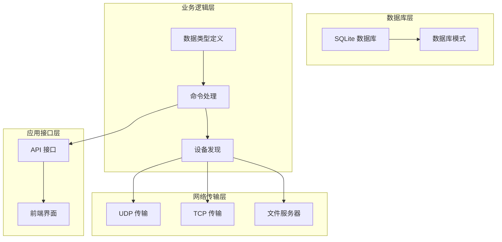
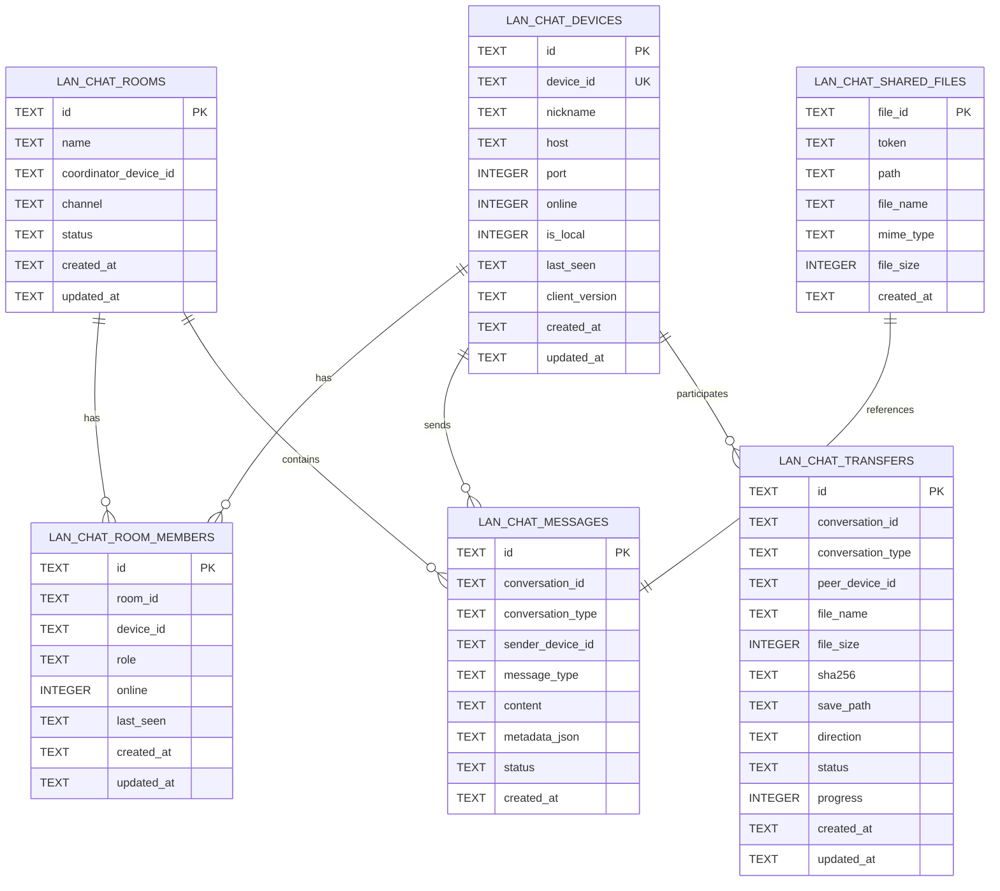
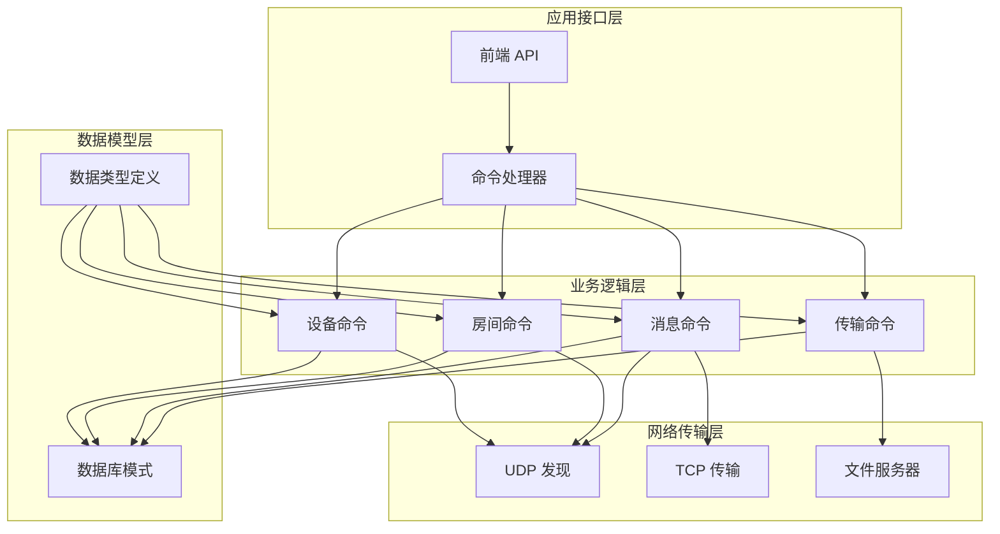

# 局域网聊天表

<cite>
**本文档引用的文件**
- [init.rs](file://src-tauri/src/db/init.rs)
- [types.rs](file://src-tauri/src/plugins/lan_chat/types.rs)
- [commands.rs](file://src-tauri/src/plugins/lan_chat/commands.rs)
- [discovery.rs](file://src-tauri/src/plugins/lan_chat/discovery.rs)
</cite>

## 目录
1. [简介](#简介)
2. [项目结构](#项目结构)
3. [核心组件](#核心组件)
4. [架构概览](#架构概览)
5. [详细组件分析](#详细组件分析)
6. [依赖关系分析](#依赖关系分析)
7. [性能考虑](#性能考虑)
8. [故障排除指南](#故障排除指南)
9. [结论](#结论)

## 简介

DevNexus 的局域网聊天系统是一个基于 SQLite 数据库的分布式通信解决方案，专为局域网环境设计。该系统提供了设备发现、房间管理、消息传递和文件传输等核心功能，支持 UDP 和 TCP 协议的混合传输模式。

## 项目结构

DevNexus 的局域网聊天功能主要分布在以下模块中：

**图表来源**
- [init.rs:35-372](file://src-tauri/src/db/init.rs#L35-L372)
- [types.rs:1-159](file://src-tauri/src/plugins/lan_chat/types.rs#L1-L159)
- [commands.rs:1-1242](file://src-tauri/src/plugins/lan_chat/commands.rs#L1-L1242)

**章节来源**
- [init.rs:1-373](file://src-tauri/src/db/init.rs#L1-L373)
- [types.rs:1-159](file://src-tauri/src/plugins/lan_chat/types.rs#L1-L159)

## 核心组件

DevNexus 局域网聊天系统包含以下核心数据表：

### 设备表 (lan_chat_devices)
存储所有已知设备的信息，包括本地设备和远程设备。

### 房间表 (lan_chat_rooms)
管理聊天房间的元数据，当前仅支持公共聊天室。

### 房间成员表 (lan_chat_room_members)
跟踪房间成员的状态和权限。

### 消息表 (lan_chat_messages)
存储聊天消息和文件传输引用。

### 文件传输表 (lan_chat_transfers)
管理文件传输任务的状态和进度。

### 共享文件表 (lan_chat_shared_files)
维护共享文件的元数据和访问令牌。

**章节来源**
- [init.rs:280-351](file://src-tauri/src/db/init.rs#L280-L351)

## 架构概览

**图表来源**
- [init.rs:280-351](file://src-tauri/src/db/init.rs#L280-L351)

## 详细组件分析

### 设备表 (lan_chat_devices) 设计详解

设备表是整个聊天系统的核心，负责存储所有设备的标识信息和状态。

#### 字段详细说明

| 字段名 | 类型 | 约束 | 默认值 | 描述 |
|--------|------|------|--------|------|
| id | TEXT | PRIMARY KEY | - | 主键，UUID 格式 |
| device_id | TEXT | UNIQUE, NOT NULL | - | 设备唯一标识符，支持 MAC 地址或 UUID |
| nickname | TEXT | NOT NULL | - | 设备昵称，用户可自定义 |
| host | TEXT | - | - | 设备主机地址，用于 TCP 连接 |
| port | INTEGER | NOT NULL | 45881 | 设备端口号，默认 45881 |
| online | INTEGER | NOT NULL | 0 | 在线状态，0/1 布尔值 |
| is_local | INTEGER | NOT NULL | 0 | 是否为本地设备，0/1 布尔值 |
| last_seen | TEXT | - | - | 最后在线时间戳 |
| client_version | TEXT | - | - | 客户端版本信息 |
| created_at | TEXT | NOT NULL | - | 创建时间戳 |
| updated_at | TEXT | NOT NULL | - | 更新时间戳 |

#### 关键特性

1. **唯一性约束**: `device_id` 字段具有 UNIQUE 约束，确保设备标识的唯一性
2. **状态管理**: 通过 `online` 和 `last_seen` 字段实现设备状态追踪
3. **本地设备标记**: `is_local` 字段区分本地设备和远程设备
4. **时间戳管理**: 自动维护 `created_at` 和 `updated_at` 时间戳

**章节来源**
- [init.rs:280-292](file://src-tauri/src/db/init.rs#L280-L292)
- [commands.rs:216-337](file://src-tauri/src/plugins/lan_chat/commands.rs#L216-L337)

### 房间表 (lan_chat_rooms) 设计详解

房间表管理聊天房间的元数据，当前系统仅支持公共聊天室。

#### 字段详细说明

| 字段名 | 类型 | 约束 | 默认值 | 描述 |
|--------|------|------|--------|------|
| id | TEXT | PRIMARY KEY | - | 主键，UUID 格式 |
| name | TEXT | NOT NULL | - | 房间名称 |
| coordinator_device_id | TEXT | NOT NULL | - | 房间协调设备 ID |
| channel | TEXT | NOT NULL | 'udp' | 传输通道，支持 'udp' 或 'tcp' |
| status | TEXT | NOT NULL | 'active' | 房间状态，当前仅支持 'active' |
| created_at | TEXT | NOT NULL | - | 创建时间戳 |
| updated_at | TEXT | NOT NULL | - | 更新时间戳 |

#### 特殊设计

1. **通道支持**: 支持 UDP 和 TCP 两种传输通道
2. **状态管理**: 当前仅支持 'active' 状态
3. **协调员机制**: 每个房间有一个协调设备负责房间管理

**章节来源**
- [init.rs:294-302](file://src-tauri/src/db/init.rs#L294-L302)
- [commands.rs:234-257](file://src-tauri/src/plugins/lan_chat/commands.rs#L234-L257)

### 房间成员表 (lan_chat_room_members) 设计详解

房间成员表跟踪房间成员的状态和权限。

#### 字段详细说明

| 字段名 | 类型 | 约束 | 默认值 | 描述 |
|--------|------|------|--------|------|
| id | TEXT | PRIMARY KEY | - | 主键，UUID 格式 |
| room_id | TEXT | NOT NULL | - | 房间 ID，外键关联房间表 |
| device_id | TEXT | NOT NULL | - | 设备 ID，外键关联设备表 |
| role | TEXT | NOT NULL | 'member' | 成员角色，默认 'member' |
| online | INTEGER | NOT NULL | 0 | 在线状态，0/1 布尔值 |
| last_seen | TEXT | - | - | 最后在线时间戳 |
| created_at | TEXT | NOT NULL | - | 创建时间戳 |
| updated_at | TEXT | NOT NULL | - | 更新时间戳 |

#### 角色管理

1. **成员角色**: 默认 'member' 角色
2. **状态同步**: 与设备表的在线状态保持同步
3. **时间追踪**: 记录成员的活跃时间

**章节来源**
- [init.rs:304-313](file://src-tauri/src/db/init.rs#L304-L313)
- [commands.rs:264-282](file://src-tauri/src/plugins/lan_chat/commands.rs#L264-L282)

### 消息表 (lan_chat_messages) 设计详解

消息表存储聊天消息和文件传输引用。

#### 字段详细说明

| 字段名 | 类型 | 约束 | 默认值 | 描述 |
|--------|------|------|--------|------|
| id | TEXT | PRIMARY KEY | - | 主键，UUID 格式 |
| conversation_id | TEXT | NOT NULL | - | 会话 ID，关联房间或设备 |
| conversation_type | TEXT | NOT NULL | - | 会话类型，'room' 或 'direct' |
| sender_device_id | TEXT | NOT NULL | - | 发送设备 ID |
| message_type | TEXT | NOT NULL | - | 消息类型，如 'text', 'image', 'file' |
| content | TEXT | NOT NULL | - | 消息内容或文件引用 |
| metadata_json | TEXT | NOT NULL | '{}' | JSON 格式的元数据 |
| status | TEXT | NOT NULL | 'sent' | 消息状态 |
| created_at | TEXT | NOT NULL | - | 创建时间戳 |

#### 消息类型

1. **文本消息**: 'text' 类型的消息
2. **文件消息**: 'image', 'audio', 'video', 'file' 类型
3. **文件引用**: 使用特殊内容标识文件传输

**章节来源**
- [init.rs:315-325](file://src-tauri/src/db/init.rs#L315-L325)
- [commands.rs:721-893](file://src-tauri/src/plugins/lan_chat/commands.rs#L721-L893)

### 文件传输表 (lan_chat_transfers) 设计详解

文件传输表管理文件传输任务的状态和进度。

#### 字段详细说明

| 字段名 | 类型 | 约束 | 默认值 | 描述 |
|--------|------|------|--------|------|
| id | TEXT | PRIMARY KEY | - | 主键，UUID 格式 |
| conversation_id | TEXT | NOT NULL | - | 会话 ID |
| conversation_type | TEXT | NOT NULL | - | 会话类型 |
| peer_device_id | TEXT | - | - | 对端设备 ID |
| file_name | TEXT | NOT NULL | - | 文件名 |
| file_size | INTEGER | NOT NULL | 0 | 文件大小（字节） |
| sha256 | TEXT | - | - | 文件 SHA256 哈希值 |
| save_path | TEXT | - | - | 保存路径 |
| direction | TEXT | NOT NULL | - | 传输方向，'inbound' 或 'outbound' |
| status | TEXT | NOT NULL | - | 传输状态 |
| progress | INTEGER | NOT NULL | 0 | 传输进度百分比 |
| created_at | TEXT | NOT NULL | - | 创建时间戳 |
| updated_at | TEXT | NOT NULL | - | 更新时间戳 |

#### 传输状态

1. **队列状态**: 'queued' - 等待传输
2. **进行状态**: 'in_progress' - 正在传输
3. **完成状态**: 'completed' - 传输完成
4. **错误状态**: 'failed' - 传输失败

**章节来源**
- [init.rs:327-341](file://src-tauri/src/db/init.rs#L327-L341)
- [commands.rs:1041-1088](file://src-tauri/src/plugins/lan_chat/commands.rs#L1041-L1088)

### 共享文件表 (lan_chat_shared_files) 设计详解

共享文件表维护共享文件的元数据和访问令牌。

#### 字段详细说明

| 字段名 | 类型 | 约束 | 默认值 | 描述 |
|--------|------|------|--------|------|
| file_id | TEXT | PRIMARY KEY | - | 文件主键，UUID 格式 |
| token | TEXT | NOT NULL | - | 访问令牌 |
| path | TEXT | NOT NULL | - | 文件实际路径 |
| file_name | TEXT | NOT NULL | - | 文件名 |
| mime_type | TEXT | - | - | MIME 类型 |
| file_size | INTEGER | NOT NULL | 0 | 文件大小（字节） |
| created_at | TEXT | NOT NULL | - | 创建时间戳 |

#### 安全机制

1. **访问令牌**: 每个共享文件都有唯一的访问令牌
2. **临时访问**: 通过令牌控制文件的临时访问权限
3. **安全传输**: 文件下载时需要正确的令牌验证

**章节来源**
- [init.rs:343-351](file://src-tauri/src/db/init.rs#L343-L351)
- [commands.rs:896-957](file://src-tauri/src/plugins/lan_chat/commands.rs#L896-L957)

## 依赖关系分析

**图表来源**
- [types.rs:1-159](file://src-tauri/src/plugins/lan_chat/types.rs#L1-L159)
- [commands.rs:1-1242](file://src-tauri/src/plugins/lan_chat/commands.rs#L1-L1242)
- [discovery.rs:1-831](file://src-tauri/src/plugins/lan_chat/discovery.rs#L1-L831)

### 复杂关联关系

系统中的复杂关联关系通过以下方式实现：

1. **设备到房间成员**: 一个设备可以是多个房间的成员
2. **房间到消息**: 一个房间包含多条消息
3. **设备到消息**: 一个设备可以发送多条消息
4. **共享文件到消息**: 一条消息可以引用多个共享文件

**章节来源**
- [commands.rs:162-197](file://src-tauri/src/plugins/lan_chat/commands.rs#L162-L197)
- [discovery.rs:288-316](file://src-tauri/src/plugins/lan_chat/discovery.rs#L288-L316)

### 数据一致性保证机制

系统通过多种机制确保数据一致性：

1. **事务处理**: 关键操作使用 SQLite 事务确保原子性
2. **唯一约束**: 设备 ID 使用 UNIQUE 约束防止重复
3. **状态同步**: 设备在线状态与房间成员状态保持同步
4. **时间戳更新**: 所有更新操作自动更新 updated_at 字段

**章节来源**
- [commands.rs:162-197](file://src-tauri/src/plugins/lan_chat/commands.rs#L162-L197)
- [discovery.rs:215-286](file://src-tauri/src/plugins/lan_chat/discovery.rs#L215-L286)

## 性能考虑

### 存储优化

1. **索引策略**: 虽然没有显式索引定义，但 SQLite 会在主键上自动创建索引
2. **数据类型选择**: 使用 TEXT 存储时间戳，便于排序和查询
3. **JSON 存储**: 使用 metadata_json 字段存储动态元数据

### 网络性能

1. **UDP 优先**: 对于小消息使用 UDP 广播，提高传输效率
2. **TCP 回退**: 对于大消息使用 TCP 保证可靠性
3. **文件服务器**: 独立的文件服务器端口减少主聊天端口压力

### 内存管理

1. **批量操作**: 支持批量消息查询，限制最大返回数量
2. **过期清理**: 自动清理长时间不活跃的设备记录
3. **连接池**: 使用 SQLite 连接池避免频繁连接开销

## 故障排除指南

### 常见问题及解决方案

#### 设备无法发现
1. **检查网络连接**: 确保设备在同一局域网内
2. **验证端口**: 确认端口 45881 可用且未被防火墙阻止
3. **检查广播**: 验证 UDP 广播功能正常工作

#### 消息传输失败
1. **检查目标设备**: 确认目标设备在线且有可用的主机地址
2. **验证网络路由**: 检查网络路由是否正确
3. **查看日志**: 检查系统日志中的错误信息

#### 文件传输超时
1. **检查文件大小**: 确认文件大小在合理范围内
2. **验证磁盘空间**: 确保有足够的磁盘空间
3. **检查令牌**: 验证共享文件令牌的有效性

**章节来源**
- [discovery.rs:381-472](file://src-tauri/src/plugins/lan_chat/discovery.rs#L381-L472)
- [commands.rs:896-957](file://src-tauri/src/plugins/lan_chat/commands.rs#L896-L957)

## 结论

DevNexus 的局域网聊天系统通过精心设计的数据库模式和网络协议实现了高效的局域网通信。系统的主要特点包括：

1. **简洁的数据模型**: 清晰的表结构设计，易于理解和维护
2. **灵活的传输机制**: 支持 UDP 和 TCP 的混合传输模式
3. **强大的扩展性**: 通过 JSON 元数据支持未来功能扩展
4. **完善的错误处理**: 全面的错误检测和恢复机制

该系统为局域网环境下的实时通信提供了可靠的技术基础，适合在企业内部网络、教育机构和开发团队中使用。