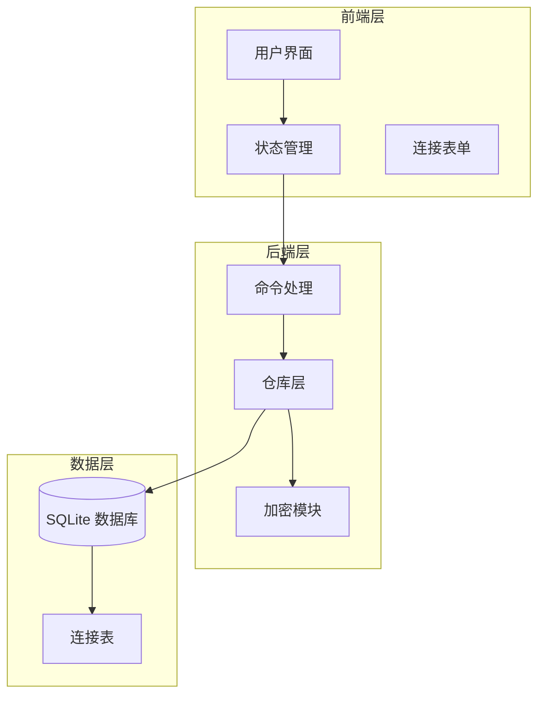
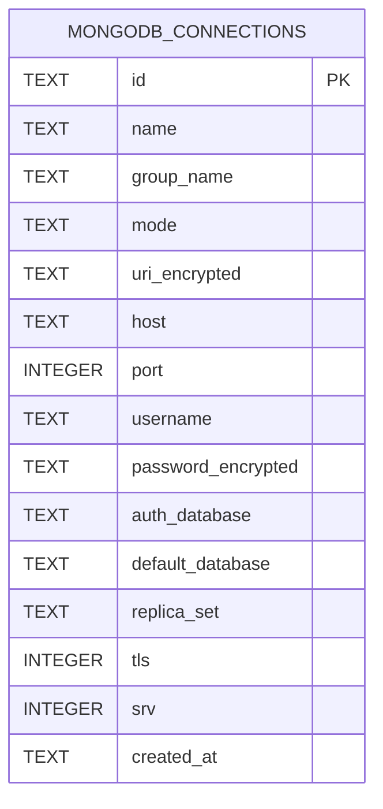
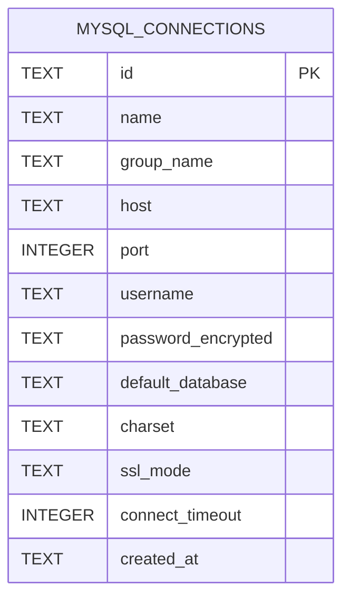
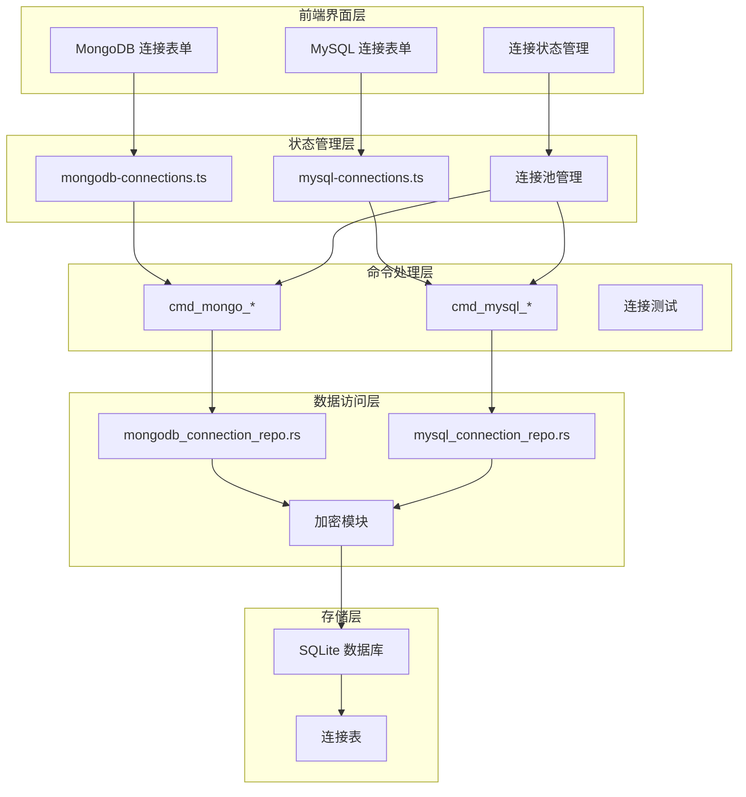
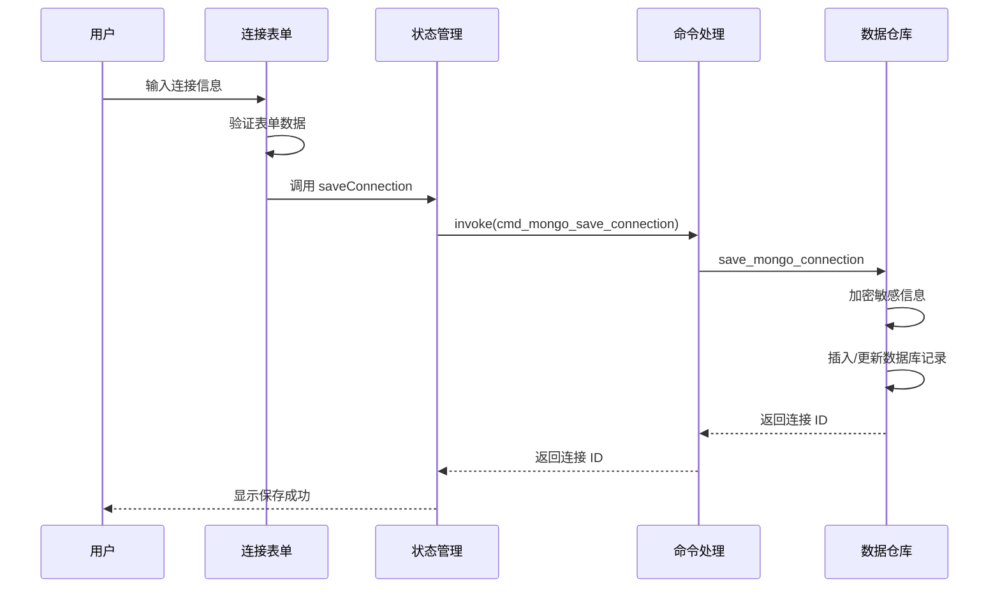
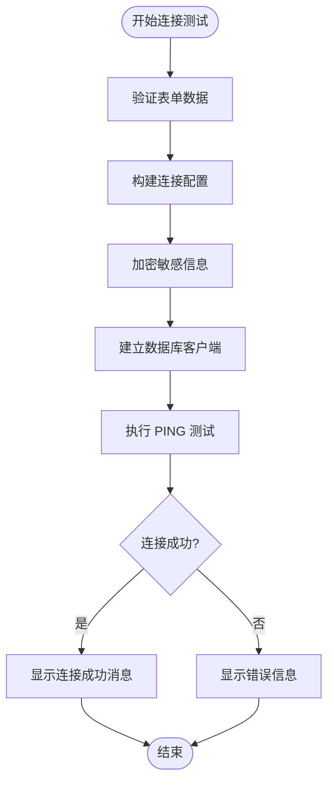
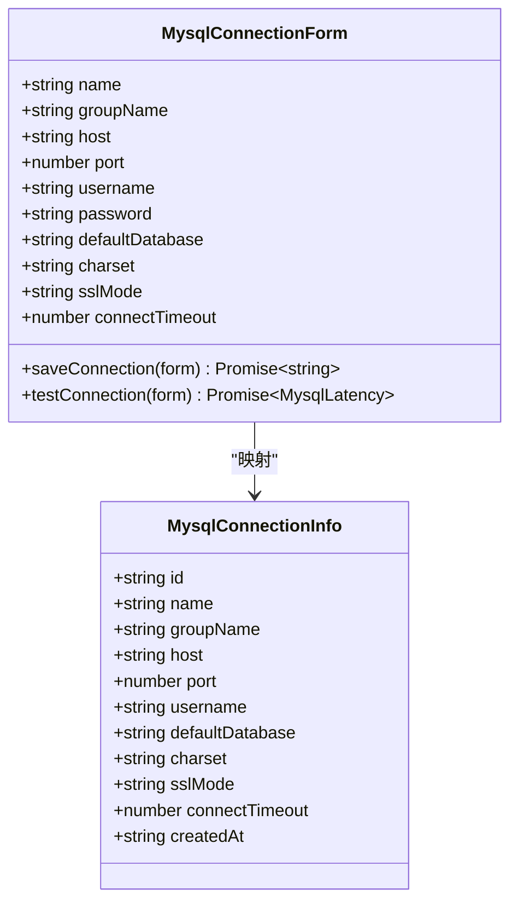
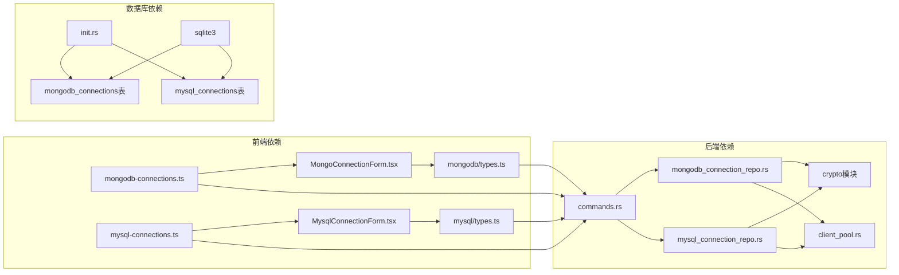
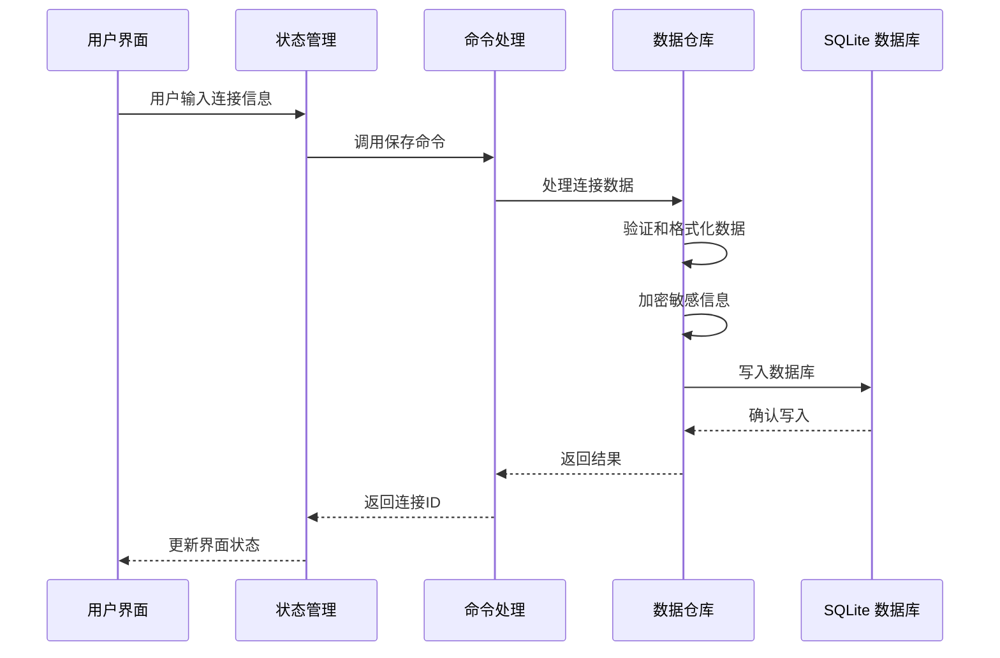

# 数据库连接表

<cite>
**本文档引用的文件**
- [mongodb_connection_repo.rs](file://src-tauri/src/db/mongodb_connection_repo.rs)
- [mysql_connection_repo.rs](file://src-tauri/src/db/mysql_connection_repo.rs)
- [init.rs](file://src-tauri/src/db/init.rs)
- [mongodb-connections.ts](file://src/plugins/mongodb-client/store/mongodb-connections.ts)
- [mysql-connections.ts](file://src/plugins/mysql-client/store/mysql-connections.ts)
- [MongoConnectionForm.tsx](file://src/plugins/mongodb-client/components/MongoConnectionForm.tsx)
- [MysqlConnectionForm.tsx](file://src/plugins/mysql-client/components/MysqlConnectionForm.tsx)
- [types.ts](file://src/plugins/mongodb-client/types.ts)
- [types.ts](file://src/plugins/mysql-client/types.ts)
- [commands.rs](file://src-tauri/src/plugins/mongodb/commands.rs)
- [commands.rs](file://src-tauri/src/plugins/mysql/commands.rs)
</cite>

## 目录
1. [简介](#简介)
2. [项目结构](#项目结构)
3. [核心组件](#核心组件)
4. [架构概览](#架构概览)
5. [详细组件分析](#详细组件分析)
6. [依赖关系分析](#依赖关系分析)
7. [性能考虑](#性能考虑)
8. [故障排除指南](#故障排除指南)
9. [结论](#结论)

## 简介

DevNexus 是一个跨平台的数据库管理工具，支持多种数据库类型的连接管理。本文档专注于数据库连接表的设计与实现，特别是 MongoDB 和 MySQL 连接表的结构、功能和最佳实践。

系统采用 Rust 后端 + TypeScript 前端的架构，使用 SQLite 作为本地存储，通过 Tauri 框架实现跨平台应用。数据库连接信息以加密形式存储在本地数据库中，确保安全性。

## 项目结构

DevNexus 的数据库连接表设计遵循统一的架构模式：

**图表来源**
- [init.rs:35-177](file://src-tauri/src/db/init.rs#L35-L177)
- [mongodb-connections.ts:96-137](file://src/plugins/mongodb-client/store/mongodb-connections.ts#L96-L137)
- [mysql-connections.ts:77-102](file://src/plugins/mysql-client/store/mysql-connections.ts#L77-L102)

**章节来源**
- [init.rs:17-372](file://src-tauri/src/db/init.rs#L17-L372)
- [mongodb-connections.ts:1-296](file://src/plugins/mongodb-client/store/mongodb-connections.ts#L1-L296)
- [mysql-connections.ts:1-153](file://src/plugins/mysql-client/store/mysql-connections.ts#L1-L153)

## 核心组件

### 数据库连接表概述

DevNexus 在 SQLite 中维护了专门的连接表，用于存储各种数据库的连接配置信息。这些表具有以下共同特征：

- **主键约束**: 所有连接表都使用 `id` 作为主键
- **分组管理**: 支持 `group_name` 字段进行连接分组
- **时间戳**: 包含 `created_at` 字段记录创建时间
- **加密存储**: 敏感信息如密码和连接字符串进行加密存储
- **默认值**: 关键字段设置合理的默认值

**章节来源**
- [init.rs:117-157](file://src-tauri/src/db/init.rs#L117-L157)

### MongoDB 连接表设计

MongoDB 连接表 (`mongodb_connections`) 设计体现了灵活的连接方式：

**图表来源**
- [init.rs:117-133](file://src-tauri/src/db/init.rs#L117-L133)

**章节来源**
- [mongodb_connection_repo.rs:3-38](file://src-tauri/src/db/mongodb_connection_repo.rs#L3-L38)
- [init.rs:117-133](file://src-tauri/src/db/init.rs#L117-L133)

### MySQL 连接表设计

MySQL 连接表 (`mysql_connections`) 专注于关系型数据库的连接配置：

**图表来源**
- [init.rs:144-157](file://src-tauri/src/db/init.rs#L144-L157)

**章节来源**
- [mysql_connection_repo.rs:3-33](file://src-tauri/src/db/mysql_connection_repo.rs#L3-L33)
- [init.rs:144-157](file://src-tauri/src/db/init.rs#L144-L157)

## 架构概览

DevNexus 的数据库连接架构采用分层设计，确保了良好的可维护性和扩展性：

**图表来源**
- [mongodb-connections.ts:96-137](file://src/plugins/mongodb-client/store/mongodb-connections.ts#L96-L137)
- [mysql-connections.ts:77-102](file://src/plugins/mysql-client/store/mysql-connections.ts#L77-L102)
- [commands.rs:124-169](file://src-tauri/src/plugins/mongodb/commands.rs#L124-L169)
- [commands.rs:160-214](file://src-tauri/src/plugins/mysql/commands.rs#L160-L214)

## 详细组件分析

### MongoDB 连接表组件

#### 数据模型设计

MongoDB 连接表采用了灵活的双模式设计，支持 URI 和表单两种连接方式：

**核心字段说明**:
- `mode`: 连接模式，支持 "uri" 和 "form" 两种模式
- `uri_encrypted`: 加密存储的完整连接字符串
- `host/port`: 主机和端口配置
- `username/password_encrypted`: 用户名和加密密码
- `auth_database`: 认证数据库名称
- `default_database`: 默认数据库
- `replica_set`: 副本集名称
- `tls/srv`: TLS 支持和 SRV 记录标志

**章节来源**
- [mongodb_connection_repo.rs:3-38](file://src-tauri/src/db/mongodb_connection_repo.rs#L3-L38)
- [types.ts:20-34](file://src/plugins/mongodb-client/types.ts#L20-L34)

#### 连接表单组件

MongoDB 连接表单提供了直观的用户界面：

**图表来源**
- [MongoConnectionForm.tsx:42-63](file://src/plugins/mongodb-client/components/MongoConnectionForm.tsx#L42-L63)
- [mongodb-connections.ts:132-137](file://src/plugins/mongodb-client/store/mongodb-connections.ts#L132-L137)
- [commands.rs:131-137](file://src-tauri/src/plugins/mongodb/commands.rs#L131-L137)

**章节来源**
- [MongoConnectionForm.tsx:13-40](file://src/plugins/mongodb-client/components/MongoConnectionForm.tsx#L13-L40)
- [mongodb-connections.ts:132-137](file://src/plugins/mongodb-client/store/mongodb-connections.ts#L132-L137)

#### 连接测试流程

连接测试功能确保连接配置的有效性：

**图表来源**
- [commands.rs:146-154](file://src-tauri/src/plugins/mongodb/commands.rs#L146-L154)
- [MongoConnectionForm.tsx:54-63](file://src/plugins/mongodb-client/components/MongoConnectionForm.tsx#L54-L63)

**章节来源**
- [commands.rs:146-154](file://src-tauri/src/plugins/mongodb/commands.rs#L146-L154)
- [MongoConnectionForm.tsx:54-63](file://src/plugins/mongodb-client/components/MongoConnectionForm.tsx#L54-L63)

### MySQL 连接表组件

#### 数据模型设计

MySQL 连接表专注于关系型数据库的连接配置：

**核心字段说明**:
- `host/port`: 主机地址和端口
- `username/password_encrypted`: 用户凭据
- `default_database`: 默认数据库
- `charset`: 字符集设置，默认 "utf8mb4"
- `ssl_mode`: SSL 模式，默认 "preferred"
- `connect_timeout`: 连接超时时间，默认 10 秒

**章节来源**
- [mysql_connection_repo.rs:3-33](file://src-tauri/src/db/mysql_connection_repo.rs#L3-L33)
- [types.ts:15-27](file://src/plugins/mysql-client/types.ts#L15-L27)

#### 连接表单组件

MySQL 连接表单提供了简洁的配置界面：

**图表来源**
- [MysqlConnectionForm.tsx:9-17](file://src/plugins/mysql-client/components/MysqlConnectionForm.tsx#L9-L17)
- [types.ts:15-27](file://src/plugins/mysql-client/types.ts#L15-L27)

**章节来源**
- [MysqlConnectionForm.tsx:9-17](file://src/plugins/mysql-client/components/MysqlConnectionForm.tsx#L9-L17)
- [mysql-connections.ts:77-102](file://src/plugins/mysql-client/store/mysql-connections.ts#L77-L102)

### 共同设计原则

#### 数据加密策略

所有敏感信息都经过加密存储：
- 密码和连接字符串使用加密模块进行加密
- 解密操作仅在需要时进行
- 支持更新现有连接而不暴露明文密码

**章节来源**
- [mongodb_connection_repo.rs:149-158](file://src-tauri/src/db/mongodb_connection_repo.rs#L149-L158)
- [mysql_connection_repo.rs:134-138](file://src-tauri/src/db/mysql_connection_repo.rs#L134-L138)

#### 默认值管理

系统为关键字段设置了合理的默认值：
- MongoDB: 端口默认 27017，TLS/SRV 默认关闭
- MySQL: 端口默认 3306，字符集默认 "utf8mb4"，SSL 模式默认 "preferred"

**章节来源**
- [mongodb_connection_repo.rs:188](file://src-tauri/src/db/mongodb_connection_repo.rs#L188)
- [mysql_connection_repo.rs:163](file://src-tauri/src/db/mysql_connection_repo.rs#L163)

#### 错误处理机制

实现了完善的错误处理：
- 参数验证和必填字段检查
- 数据库操作的异常捕获
- 友好的错误消息反馈

**章节来源**
- [mongodb_connection_repo.rs:123-147](file://src-tauri/src/db/mongodb_connection_repo.rs#L123-L147)
- [mysql_connection_repo.rs:115-125](file://src-tauri/src/db/mysql_connection_repo.rs#L115-L125)

## 依赖关系分析

### 组件间依赖关系

**图表来源**
- [mongodb-connections.ts:1-296](file://src/plugins/mongodb-client/store/mongodb-connections.ts#L1-L296)
- [mysql-connections.ts:1-153](file://src/plugins/mysql-client/store/mysql-connections.ts#L1-L153)
- [commands.rs:124-169](file://src-tauri/src/plugins/mongodb/commands.rs#L124-L169)
- [commands.rs:160-214](file://src-tauri/src/plugins/mysql/commands.rs#L160-L214)

### 数据流分析

连接信息在系统中的流转过程：

**图表来源**
- [mongodb-connections.ts:132-137](file://src/plugins/mongodb-client/store/mongodb-connections.ts#L132-L137)
- [mysql-connections.ts:99-102](file://src/plugins/mysql-client/store/mysql-connections.ts#L99-L102)
- [commands.rs:131-137](file://src-tauri/src/plugins/mongodb/commands.rs#L131-L137)

**章节来源**
- [mongodb-connections.ts:132-137](file://src/plugins/mongodb-client/store/mongodb-connections.ts#L132-L137)
- [mysql-connections.ts:99-102](file://src/plugins/mysql-client/store/mysql-connections.ts#L99-L102)

## 性能考虑

### 连接池管理

系统实现了高效的连接池管理机制：

- **延迟创建**: 连接在实际使用时才建立
- **自动清理**: 断开连接时自动清理资源
- **重用机制**: 支持连接复用减少建立成本

### 查询优化

- **索引策略**: 连接表使用适当的索引提高查询性能
- **批量操作**: 支持批量读取连接列表
- **缓存机制**: 常用连接信息进行内存缓存

### 安全优化

- **最小权限原则**: 连接信息仅在需要时解密
- **加密算法**: 使用安全的加密算法保护敏感数据
- **访问控制**: 限制对敏感信息的访问范围

## 故障排除指南

### 常见问题诊断

#### 连接失败排查

1. **网络连接问题**
   - 检查主机地址和端口配置
   - 验证防火墙设置
   - 确认数据库服务运行状态

2. **认证失败**
   - 验证用户名和密码
   - 检查认证数据库配置
   - 确认用户权限设置

3. **SSL/TLS 问题**
   - 检查证书配置
   - 验证 SSL 模式设置
   - 确认客户端支持情况

#### 数据库连接表问题

1. **表结构不匹配**
   - 检查数据库版本兼容性
   - 验证表结构完整性
   - 确认迁移脚本执行

2. **数据损坏**
   - 检查加密数据完整性
   - 验证数据格式正确性
   - 确认备份文件可用性

**章节来源**
- [mongodb_connection_repo.rs:123-147](file://src-tauri/src/db/mongodb_connection_repo.rs#L123-L147)
- [mysql_connection_repo.rs:115-125](file://src-tauri/src/db/mysql_connection_repo.rs#L115-L125)

### 调试技巧

1. **启用调试日志**
   - 查看详细的错误信息
   - 跟踪连接建立过程
   - 分析性能瓶颈

2. **单元测试**
   - 编写连接测试用例
   - 验证数据处理逻辑
   - 测试边界条件

3. **监控指标**
   - 监控连接成功率
   - 跟踪响应时间
   - 分析资源使用情况

## 结论

DevNexus 的数据库连接表设计体现了现代应用程序的最佳实践：

### 设计优势

1. **安全性优先**: 所有敏感信息都经过加密存储
2. **灵活性强**: 支持多种连接方式和配置选项
3. **用户体验好**: 提供直观的配置界面和完善的错误处理
4. **可扩展性**: 清晰的架构设计便于功能扩展

### 技术亮点

- **统一的数据模型**: MongoDB 和 MySQL 连接表遵循相似的设计原则
- **高效的存储方案**: SQLite 本地存储确保快速访问
- **健壮的错误处理**: 完善的异常处理机制提升系统稳定性
- **安全的加密机制**: 专业的加密模块保护敏感数据

### 发展方向

未来可以考虑的功能增强：
- 支持更多数据库类型
- 实现连接健康检查
- 添加连接模板功能
- 优化大连接数量的性能表现

通过持续的优化和改进，DevNexus 的数据库连接表设计将继续为用户提供可靠、安全、易用的数据库管理体验。