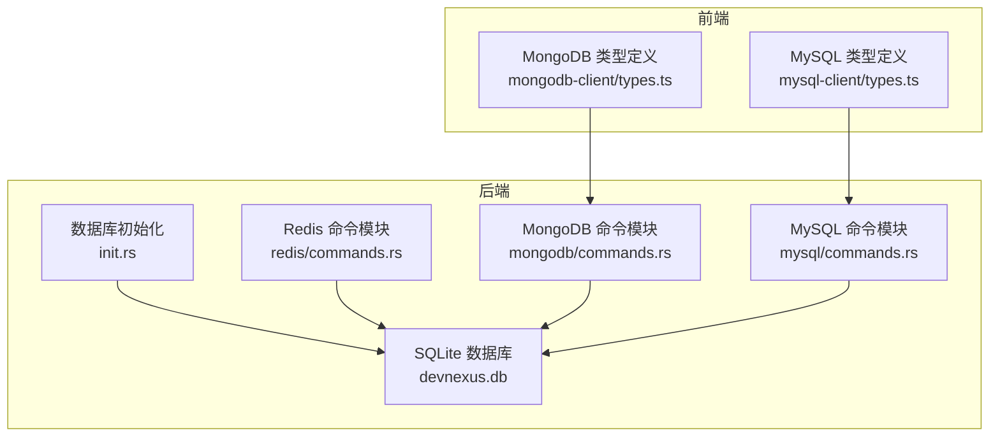
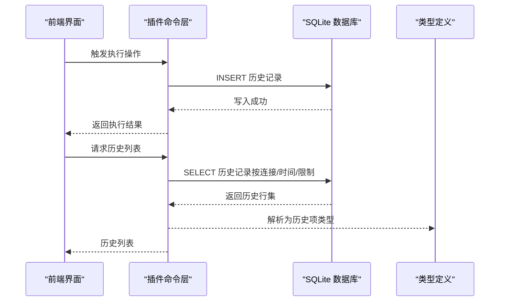
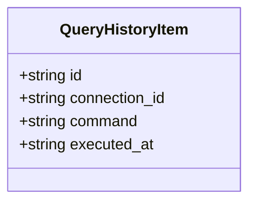
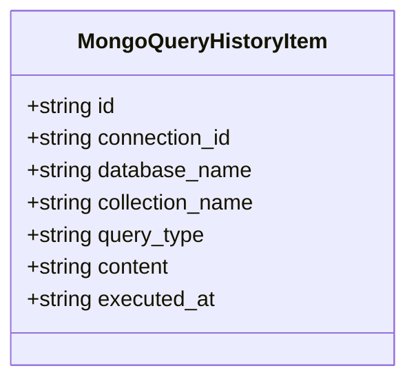
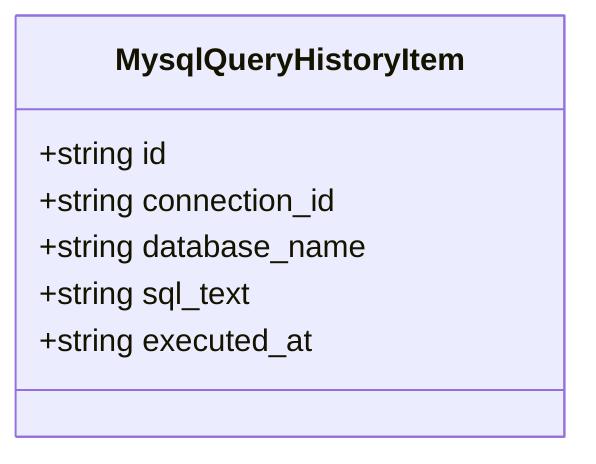
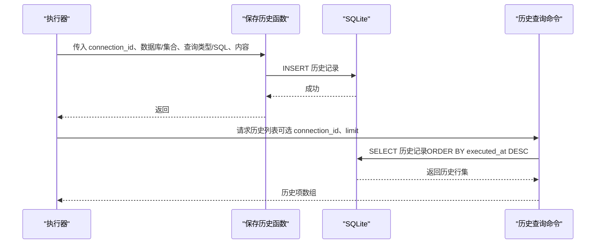
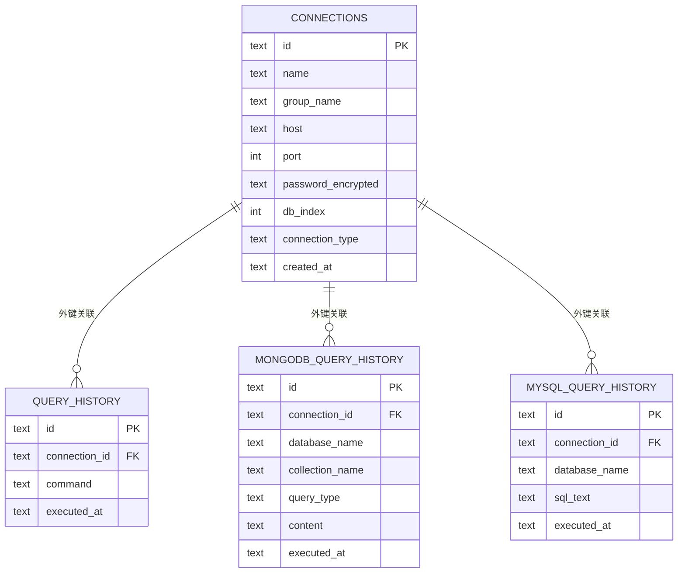

# 查询历史表

<cite>
**本文档引用的文件**
- [src-tauri/src/db/init.rs](file://src-tauri/src/db/init.rs)
- [src-tauri/src/plugins/redis/commands.rs](file://src-tauri/src/plugins/redis/commands.rs)
- [src-tauri/src/plugins/mongodb/commands.rs](file://src-tauri/src/plugins/mongodb/commands.rs)
- [src-tauri/src/plugins/mysql/commands.rs](file://src-tauri/src/plugins/mysql/commands.rs)
- [src/plugins/mongodb-client/types.ts](file://src/plugins/mongodb-client/types.ts)
- [src/plugins/mysql-client/types.ts](file://src/plugins/mysql-client/types.ts)
- [src-tauri/src/plugins/mongodb/types.rs](file://src-tauri/src/plugins/mongodb/types.rs)
- [src-tauri/src/plugins/mysql/types.rs](file://src-tauri/src/plugins/mysql/types.rs)
</cite>

## 目录
1. [简介](#简介)
2. [项目结构](#项目结构)
3. [核心组件](#核心组件)
4. [架构总览](#架构总览)
5. [详细组件分析](#详细组件分析)
6. [依赖关系分析](#依赖关系分析)
7. [性能考量](#性能考量)
8. [故障排查指南](#故障排查指南)
9. [结论](#结论)

## 简介
本文件系统性梳理 DevNexus 中查询历史表的设计与实现，重点覆盖以下三张表：
- query_history：通用 Redis 查询历史表，记录命令级历史
- mongodb_query_history：MongoDB 查询历史表，记录数据库、集合、查询类型与内容
- mysql_query_history：MySQL 查询历史表，记录数据库与 SQL 文本

文档从表结构、字段语义、写入流程、查询接口、索引与性能优化、以及数据保留策略等方面进行深入解析，并提供可视化图示帮助理解。

## 项目结构
查询历史相关的核心代码分布在后端数据库初始化脚本与各插件的命令实现中：
- 数据库初始化：在 SQLite 中创建查询历史表及连接表等
- 插件命令：在各协议插件中实现历史写入与查询列表功能
- 前端类型：定义历史项的数据结构，用于前后端交互

图表来源
- [src-tauri/src/db/init.rs:35-165](file://src-tauri/src/db/init.rs#L35-L165)
- [src-tauri/src/plugins/redis/commands.rs:95-137](file://src-tauri/src/plugins/redis/commands.rs#L95-L137)
- [src-tauri/src/plugins/mongodb/commands.rs:373-435](file://src-tauri/src/plugins/mongodb/commands.rs#L373-L435)
- [src-tauri/src/plugins/mysql/commands.rs:157-174](file://src-tauri/src/plugins/mysql/commands.rs#L157-L174)
- [src/plugins/mongodb-client/types.ts:73-81](file://src/plugins/mongodb-client/types.ts#L73-L81)
- [src/plugins/mysql-client/types.ts](file://src/plugins/mysql-client/types.ts#L37)

章节来源
- [src-tauri/src/db/init.rs:35-165](file://src-tauri/src/db/init.rs#L35-L165)

## 核心组件
本节对三张查询历史表进行逐项说明，包括表结构、字段含义、典型用途与约束。

- query_history（通用 Redis 历史表）
  - 字段
    - id：主键，唯一标识一条历史记录
    - connection_id：外键关联 connections 表 id，标识所属连接
    - command：执行的命令文本
    - executed_at：执行时间（RFC3339 字符串）
  - 用途：记录 Redis 执行过的命令历史，便于回溯与重放
  - 写入位置：Redis 插件命令中调用 SQLite 写入
  - 查询位置：Redis 插件命令中按连接与时间倒序查询

- mongodb_query_history（MongoDB 历史表）
  - 字段
    - id：主键，唯一标识一条历史记录
    - connection_id：外键关联 connections 表 id，标识所属连接
    - database_name：数据库名称（可空）
    - collection_name：集合名称（可空）
    - query_type：查询类型（如 find、aggregate、command 等）
    - content：查询内容（JSON 文本）
    - executed_at：执行时间（RFC3339 字符串）
  - 用途：记录 MongoDB 的查询行为，包含数据库、集合、查询类型与内容
  - 写入位置：MongoDB 插件在执行查询后调用保存函数写入
  - 查询位置：MongoDB 插件提供历史列表命令，支持按连接过滤与限制条数

- mysql_query_history（MySQL 历史表）
  - 字段
    - id：主键，唯一标识一条历史记录
    - connection_id：外键关联 connections 表 id，标识所属连接
    - database_name：数据库名称（可空）
    - sql_text：SQL 文本
    - executed_at：执行时间（RFC3339 字符串）
  - 用途：记录 MySQL 的 SQL 执行历史，便于审计与复盘
  - 写入位置：MySQL 插件在执行 SQL 后调用保存函数写入
  - 查询位置：MySQL 插件提供历史列表命令，支持按连接与限制条数查询

章节来源
- [src-tauri/src/db/init.rs:49-54](file://src-tauri/src/db/init.rs#L49-L54)
- [src-tauri/src/db/init.rs:135-143](file://src-tauri/src/db/init.rs#L135-L143)
- [src-tauri/src/db/init.rs:159-165](file://src-tauri/src/db/init.rs#L159-L165)
- [src-tauri/src/plugins/redis/commands.rs:95-137](file://src-tauri/src/plugins/redis/commands.rs#L95-L137)
- [src-tauri/src/plugins/mongodb/commands.rs:373-435](file://src-tauri/src/plugins/mongodb/commands.rs#L373-L435)
- [src-tauri/src/plugins/mysql/commands.rs:157-174](file://src-tauri/src/plugins/mysql/commands.rs#L157-L174)

## 架构总览
下图展示了查询历史的写入与查询路径，涵盖 Redis、MongoDB、MySQL 三大插件如何与 SQLite 数据库存储交互。

图表来源
- [src-tauri/src/plugins/redis/commands.rs:95-137](file://src-tauri/src/plugins/redis/commands.rs#L95-L137)
- [src-tauri/src/plugins/mongodb/commands.rs:373-435](file://src-tauri/src/plugins/mongodb/commands.rs#L373-L435)
- [src-tauri/src/plugins/mysql/commands.rs:157-174](file://src-tauri/src/plugins/mysql/commands.rs#L157-L174)
- [src/plugins/mongodb-client/types.ts:73-81](file://src/plugins/mongodb-client/types.ts#L73-L81)
- [src/plugins/mysql-client/types.ts](file://src/plugins/mysql-client/types.ts#L37)

## 详细组件分析

### Redis 查询历史（query_history）
- 写入流程
  - 在执行命令后，调用 SQLite 写入函数，插入 id、connection_id、command、executed_at
  - 时间戳采用 RFC3339 字符串格式
- 查询流程
  - 支持按 connection_id 过滤与 limit 限制
  - 结果按 executed_at 降序排列
- 数据模型类图

图表来源
- [src-tauri/src/db/init.rs:49-54](file://src-tauri/src/db/init.rs#L49-L54)
- [src-tauri/src/plugins/redis/commands.rs:95-137](file://src-tauri/src/plugins/redis/commands.rs#L95-L137)

章节来源
- [src-tauri/src/db/init.rs:49-54](file://src-tauri/src/db/init.rs#L49-L54)
- [src-tauri/src/plugins/redis/commands.rs:95-137](file://src-tauri/src/plugins/redis/commands.rs#L95-L137)

### MongoDB 查询历史（mongodb_query_history）
- 写入流程
  - 在执行 find、aggregate、command 等查询后，调用保存函数写入
  - 内容字段保存查询参数的 JSON 文本
- 查询流程
  - 支持按 connection_id 过滤与 limit 限制
  - 结果按 executed_at 降序排列
- 数据模型类图

图表来源
- [src-tauri/src/db/init.rs:135-143](file://src-tauri/src/db/init.rs#L135-L143)
- [src-tauri/src/plugins/mongodb/commands.rs:373-435](file://src-tauri/src/plugins/mongodb/commands.rs#L373-L435)
- [src/plugins/mongodb-client/types.ts:73-81](file://src/plugins/mongodb-client/types.ts#L73-L81)
- [src-tauri/src/plugins/mongodb/types.rs:54-62](file://src-tauri/src/plugins/mongodb/types.rs#L54-L62)

章节来源
- [src-tauri/src/db/init.rs:135-143](file://src-tauri/src/db/init.rs#L135-L143)
- [src-tauri/src/plugins/mongodb/commands.rs:373-435](file://src-tauri/src/plugins/mongodb/commands.rs#L373-L435)
- [src/plugins/mongodb-client/types.ts:73-81](file://src/plugins/mongodb-client/types.ts#L73-L81)
- [src-tauri/src/plugins/mongodb/types.rs:54-62](file://src-tauri/src/plugins/mongodb/types.rs#L54-L62)

### MySQL 查询历史（mysql_query_history）
- 写入流程
  - 在执行 SQL 后，调用保存函数写入
  - 内容字段保存 SQL 文本
- 查询流程
  - 支持按 connection_id 过滤与 limit 限制
  - 结果按 executed_at 降序排列
- 数据模型类图

图表来源
- [src-tauri/src/db/init.rs:159-165](file://src-tauri/src/db/init.rs#L159-L165)
- [src-tauri/src/plugins/mysql/commands.rs:157-174](file://src-tauri/src/plugins/mysql/commands.rs#L157-L174)
- [src/plugins/mysql-client/types.ts](file://src/plugins/mysql-client/types.ts#L37)
- [src-tauri/src/plugins/mysql/types.rs:75-81](file://src-tauri/src/plugins/mysql/types.rs#L75-L81)

章节来源
- [src-tauri/src/db/init.rs:159-165](file://src-tauri/src/db/init.rs#L159-L165)
- [src-tauri/src/plugins/mysql/commands.rs:157-174](file://src-tauri/src/plugins/mysql/commands.rs#L157-L174)
- [src/plugins/mysql-client/types.ts](file://src/plugins/mysql-client/types.ts#L37)
- [src-tauri/src/plugins/mysql/types.rs:75-81](file://src-tauri/src/plugins/mysql/types.rs#L75-L81)

### 查询历史写入时序
以下序列图展示各插件在执行查询后写入历史的典型流程。

图表来源
- [src-tauri/src/plugins/redis/commands.rs:95-137](file://src-tauri/src/plugins/redis/commands.rs#L95-L137)
- [src-tauri/src/plugins/mongodb/commands.rs:373-435](file://src-tauri/src/plugins/mongodb/commands.rs#L373-L435)
- [src-tauri/src/plugins/mysql/commands.rs:157-174](file://src-tauri/src/plugins/mysql/commands.rs#L157-L174)

## 依赖关系分析
- 表间依赖
  - query_history、mongodb_query_history、mysql_query_history 的 connection_id 外键均指向 connections 表 id
- 组件耦合
  - 各插件命令模块与 SQLite 存储强耦合，负责写入与查询
  - 前端类型定义与后端历史项结构一一对应，保证序列化/反序列化一致性

图表来源
- [src-tauri/src/db/init.rs:37-47](file://src-tauri/src/db/init.rs#L37-L47)
- [src-tauri/src/db/init.rs:49-54](file://src-tauri/src/db/init.rs#L49-L54)
- [src-tauri/src/db/init.rs:135-143](file://src-tauri/src/db/init.rs#L135-L143)
- [src-tauri/src/db/init.rs:159-165](file://src-tauri/src/db/init.rs#L159-L165)

章节来源
- [src-tauri/src/db/init.rs:37-47](file://src-tauri/src/db/init.rs#L37-L47)
- [src-tauri/src/db/init.rs:49-54](file://src-tauri/src/db/init.rs#L49-L54)
- [src-tauri/src/db/init.rs:135-143](file://src-tauri/src/db/init.rs#L135-L143)
- [src-tauri/src/db/init.rs:159-165](file://src-tauri/src/db/init.rs#L159-L165)

## 性能考量
- 存储策略
  - 使用 SQLite 本地文件存储，无需额外服务进程，部署简单
  - 历史记录以文本形式存储（SQL 文本、JSON 内容），便于检索但占用空间较大
- 查询优化建议
  - 建议在 executed_at 上建立索引，以提升按时间排序与分页查询效率
  - 在 connection_id 上建立索引，以提升按连接过滤查询效率
  - 对于高频查询，可考虑限制返回条数（limit）并结合分页
- 数据保留机制
  - 当前未发现自动清理过期历史的实现
  - 建议引入基于时间或容量的清理策略（例如保留最近 N 条或最近 30 天），并在 UI 提供清理入口

[本节为通用性能建议，不直接分析具体文件，故无章节来源]

## 故障排查指南
- 写入失败
  - 现象：调用写入函数返回错误
  - 可能原因：数据库打开失败、SQL 执行失败、参数为空
  - 排查步骤：检查数据库路径、权限、参数完整性
- 查询异常
  - 现象：历史列表为空或排序异常
  - 可能原因：连接 ID 不匹配、limit 设置过小、时间格式不一致
  - 排查步骤：确认 connection_id、executed_at 格式（RFC3339）、limit 参数
- 前后端类型不一致
  - 现象：历史项字段缺失或类型不符
  - 可能原因：前端类型定义与后端结构不一致
  - 排查步骤：核对前后端类型定义，确保字段与命名一致

章节来源
- [src-tauri/src/plugins/redis/commands.rs:95-137](file://src-tauri/src/plugins/redis/commands.rs#L95-L137)
- [src-tauri/src/plugins/mongodb/commands.rs:373-435](file://src-tauri/src/plugins/mongodb/commands.rs#L373-L435)
- [src-tauri/src/plugins/mysql/commands.rs:157-174](file://src-tauri/src/plugins/mysql/commands.rs#L157-L174)

## 结论
DevNexus 的查询历史表设计简洁清晰，分别针对 Redis、MongoDB、MySQL 提供了统一的历史记录能力。通过 SQLite 本地存储与标准的 SQL 接口，实现了跨协议的历史追踪。建议后续完善索引与数据保留策略，以进一步提升查询性能与资源利用率。