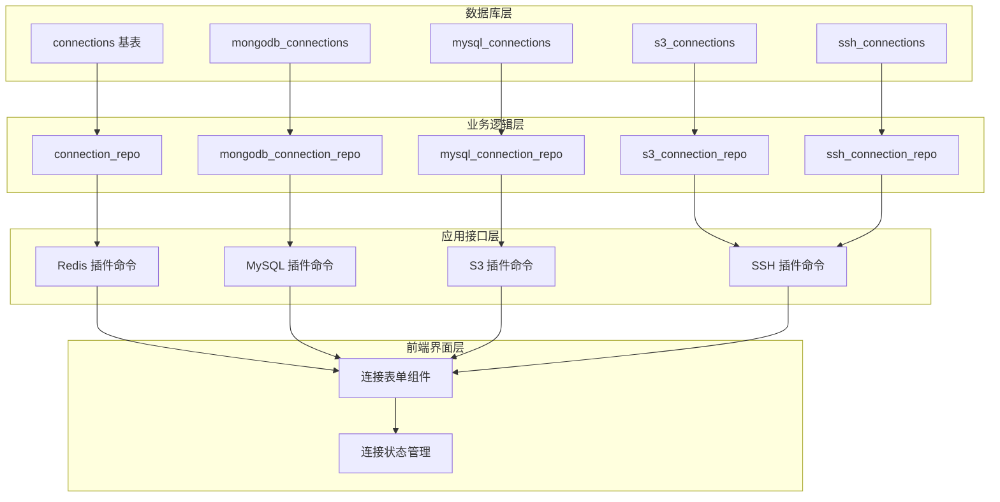
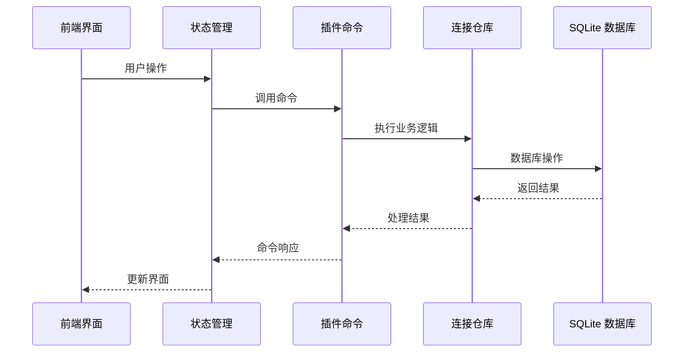
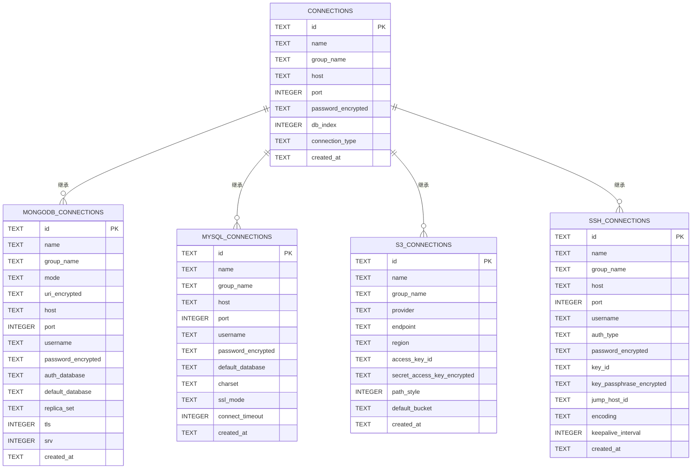
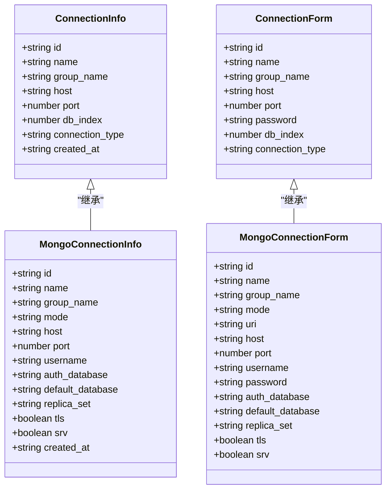
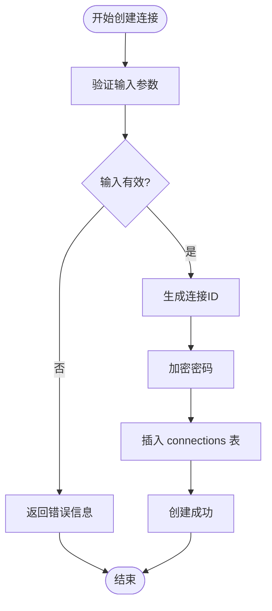
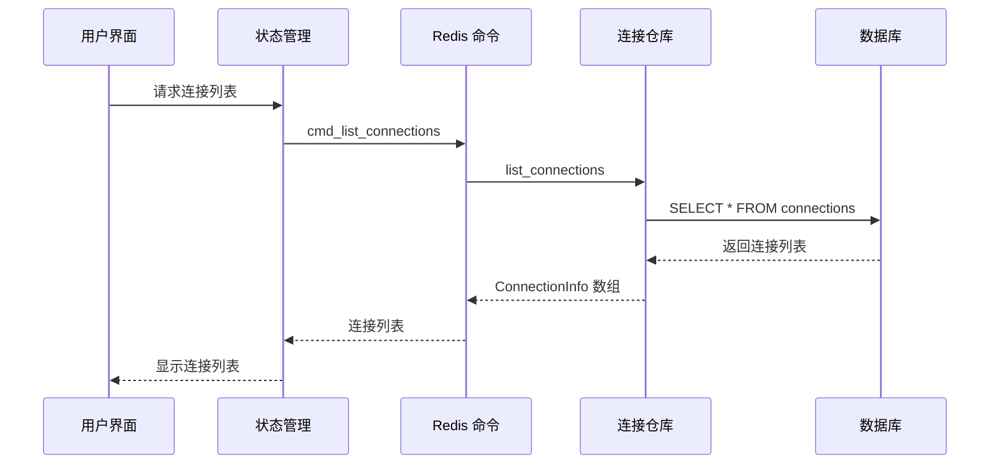
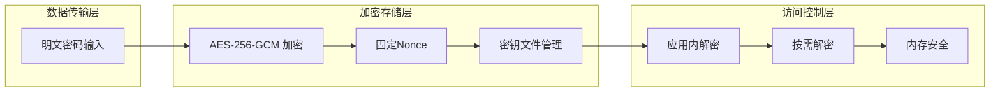
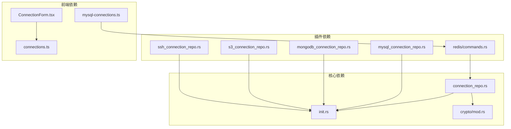
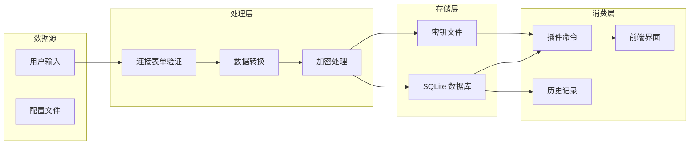

# 核心连接表

<cite>
**本文档引用的文件**
- [connection_repo.rs](file://src-tauri/src/db/connection_repo.rs)
- [init.rs](file://src-tauri/src/db/init.rs)
- [mod.rs](file://src-tauri/src/db/mod.rs)
- [commands.rs](file://src-tauri/src/plugins/redis/commands.rs)
- [ConnectionForm.tsx](file://src/plugins/redis-manager/components/ConnectionForm.tsx)
- [connections.ts](file://src/plugins/redis-manager/store/connections.ts)
- [mysql-connections.ts](file://src/plugins/mysql-client/store/mysql-connections.ts)
- [mongodb_connection_repo.rs](file://src-tauri/src/db/mongodb_connection_repo.rs)
- [mysql_connection_repo.rs](file://src-tauri/src/db/mysql_connection_repo.rs)
- [s3_connection_repo.rs](file://src-tauri/src/db/s3_connection_repo.rs)
- [ssh_connection_repo.rs](file://src-tauri/src/db/ssh_connection_repo.rs)
- [mod.rs](file://src-tauri/src/crypto/mod.rs)
</cite>

## 目录
1. [简介](#简介)
2. [项目结构](#项目结构)
3. [核心组件](#核心组件)
4. [架构概览](#架构概览)
5. [详细组件分析](#详细组件分析)
6. [依赖分析](#依赖分析)
7. [性能考虑](#性能考虑)
8. [故障排除指南](#故障排除指南)
9. [结论](#结论)

## 简介

DevNexus 的核心连接表设计采用了一种创新的"通用连接基表"架构模式。connections 表作为所有连接类型的统一基础表，通过标准化的字段定义和灵活的连接类型机制，实现了多协议连接管理的一致性和可扩展性。

这种设计理念的核心价值在于：
- **统一抽象**：将不同协议的连接信息标准化到单一数据结构中
- **类型安全**：通过连接类型枚举确保数据完整性
- **扩展性**：支持未来新增连接类型的无缝集成
- **安全性**：内置密码加密存储机制

## 项目结构

DevNexus 的连接表系统采用模块化架构，主要由以下层次组成：

**图表来源**
- [init.rs:37-47](file://src-tauri/src/db/init.rs#L37-L47)
- [connection_repo.rs:1-27](file://src-tauri/src/db/connection_repo.rs#L1-L27)
- [mod.rs:1-7](file://src-tauri/src/db/mod.rs#L1-L7)

**章节来源**
- [init.rs:37-47](file://src-tauri/src/db/init.rs#L37-L47)
- [mod.rs:1-7](file://src-tauri/src/db/mod.rs#L1-L7)

## 核心组件

### connections 基表设计

connections 表作为所有连接类型的基础表，采用了精心设计的字段结构：

| 字段名 | 数据类型 | 约束条件 | 描述 | 默认值 |
|--------|----------|----------|------|--------|
| id | TEXT | PRIMARY KEY NOT NULL | 连接唯一标识符 | 自动生成 |
| name | TEXT | NOT NULL | 连接名称 | 用户输入 |
| group_name | TEXT | NULL | 连接分组名称 | NULL |
| host | TEXT | NOT NULL | 主机地址 | 用户输入 |
| port | INTEGER | NOT NULL | 端口号 | 用户输入 |
| password_encrypted | TEXT | NULL | 加密后的密码 | NULL |
| db_index | INTEGER | NOT NULL DEFAULT 0 | 数据库索引 | 0 |
| connection_type | TEXT | NOT NULL DEFAULT 'Standalone' | 连接类型 | 'Standalone' |
| created_at | TEXT | NOT NULL | 创建时间 | 当前时间戳 |

### 连接类型枚举设计

连接类型采用字符串枚举机制，当前支持的类型包括：
- **Standalone**：单机模式（默认值）
- **Sentinel**：哨兵模式（预留，暂不开放）
- **Cluster**：集群模式（预留，暂不开放）

这种设计考虑了向后兼容性和功能扩展性，通过预留机制为未来的高级连接模式做好准备。

**章节来源**
- [init.rs:37-47](file://src-tauri/src/db/init.rs#L37-L47)
- [connection_repo.rs:5-14](file://src-tauri/src/db/connection_repo.rs#L5-L14)
- [ConnectionForm.tsx:102-110](file://src/plugins/redis-manager/components/ConnectionForm.tsx#L102-L110)

## 架构概览

DevNexus 的连接表系统采用分层架构设计，实现了数据访问、业务逻辑和应用接口的有效分离：

**图表来源**
- [commands.rs:140-150](file://src-tauri/src/plugins/redis/commands.rs#L140-L150)
- [connection_repo.rs:34-63](file://src-tauri/src/db/connection_repo.rs#L34-L63)

### 继承关系设计

虽然 SQLite 不支持传统面向对象的继承，但 DevNexus 通过以下方式实现了逻辑上的继承关系：

**图表来源**
- [init.rs:37-157](file://src-tauri/src/db/init.rs#L37-L157)

**章节来源**
- [init.rs:37-157](file://src-tauri/src/db/init.rs#L37-L157)

## 详细组件分析

### 数据模型类图

**图表来源**
- [connection_repo.rs:5-27](file://src-tauri/src/db/connection_repo.rs#L5-L27)
- [mongodb_connection_repo.rs:5-38](file://src-tauri/src/db/mongodb_connection_repo.rs#L5-L38)

### CRUD 操作流程

#### 创建连接流程

**图表来源**
- [connection_repo.rs:96-131](file://src-tauri/src/db/connection_repo.rs#L96-L131)

#### 查询连接流程

**图表来源**
- [commands.rs:140-142](file://src-tauri/src/plugins/redis/commands.rs#L140-L142)
- [connection_repo.rs:34-63](file://src-tauri/src/db/connection_repo.rs#L34-L63)

**章节来源**
- [connection_repo.rs:96-131](file://src-tauri/src/db/connection_repo.rs#L96-L131)
- [commands.rs:140-142](file://src-tauri/src/plugins/redis/commands.rs#L140-L142)

### 安全性设计

DevNexus 在连接表设计中融入了多层次的安全保护机制：

**图表来源**
- [mod.rs:40-74](file://src-tauri/src/crypto/mod.rs#L40-L74)
- [connection_repo.rs:100](file://src-tauri/src/db/connection_repo.rs#L100)

**章节来源**
- [mod.rs:40-74](file://src-tauri/src/crypto/mod.rs#L40-L74)
- [connection_repo.rs:100](file://src-tauri/src/db/connection_repo.rs#L100)

## 依赖分析

### 组件耦合关系

**图表来源**
- [connection_repo.rs:1-32](file://src-tauri/src/db/connection_repo.rs#L1-L32)
- [commands.rs:9](file://src-tauri/src/plugins/redis/commands.rs#L9)

### 数据流依赖

**图表来源**
- [ConnectionForm.tsx:42-53](file://src/plugins/redis-manager/components/ConnectionForm.tsx#L42-L53)
- [connections.ts:42-46](file://src/plugins/redis-manager/store/connections.ts#L42-L46)

**章节来源**
- [connection_repo.rs:1-32](file://src-tauri/src/db/connection_repo.rs#L1-L32)
- [commands.rs:9](file://src-tauri/src/plugins/redis/commands.rs#L9)

## 性能考虑

### 查询优化策略

1. **索引设计**：connections 表的主键索引确保了高效的查找性能
2. **批量操作**：支持批量查询和更新操作，减少数据库往返次数
3. **缓存机制**：前端状态管理提供了本地缓存，减少重复请求

### 存储优化

1. **数据压缩**：敏感数据采用加密存储，同时保持较小的存储开销
2. **增量更新**：支持部分字段更新，避免不必要的全量更新
3. **历史记录分离**：查询历史单独存储，不影响连接表性能

## 故障排除指南

### 常见问题及解决方案

#### 连接保存失败
- **症状**：保存连接时出现错误
- **原因**：可能由于数据库锁定或权限问题
- **解决**：检查数据库文件权限，确保应用程序有写入权限

#### 密码解密失败
- **症状**：无法获取已保存的密码
- **原因**：密钥文件损坏或丢失
- **解决**：重新启动应用程序以生成新的密钥文件

#### 连接类型验证错误
- **症状**：设置无效的连接类型时出现错误
- **原因**：连接类型不在允许的枚举值范围内
- **解决**：使用预定义的连接类型值："Standalone"、"Sentinel"、"Cluster"

**章节来源**
- [connection_repo.rs:133-138](file://src-tauri/src/db/connection_repo.rs#L133-L138)
- [connection_repo.rs:140-155](file://src-tauri/src/db/connection_repo.rs#L140-L155)

## 结论

DevNexus 的核心连接表设计体现了现代软件架构的最佳实践，通过统一的抽象层实现了多协议连接管理的灵活性和安全性。该设计的主要优势包括：

1. **架构清晰**：分层设计确保了各组件职责明确，便于维护和扩展
2. **安全可靠**：内置的加密机制和严格的输入验证确保了数据安全
3. **易于扩展**：基于接口的设计为未来添加新的连接类型提供了便利
4. **用户体验**：简洁的前端界面和流畅的操作流程提升了用户满意度

这种设计模式为类似的数据管理应用场景提供了有价值的参考，展示了如何在保证安全性的前提下实现系统的可扩展性和易用性。