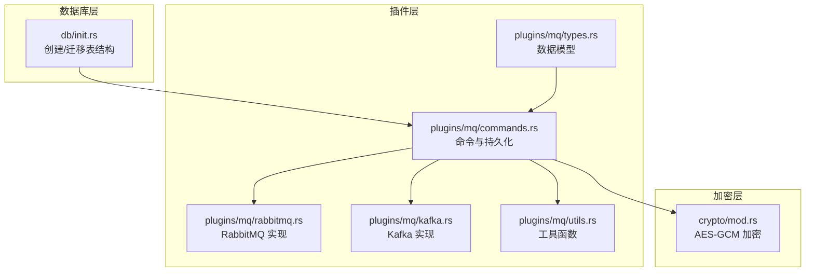
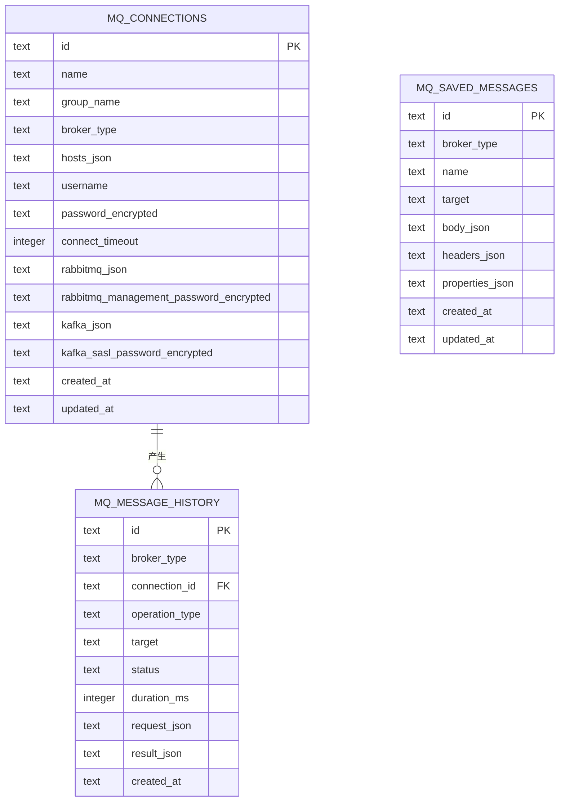
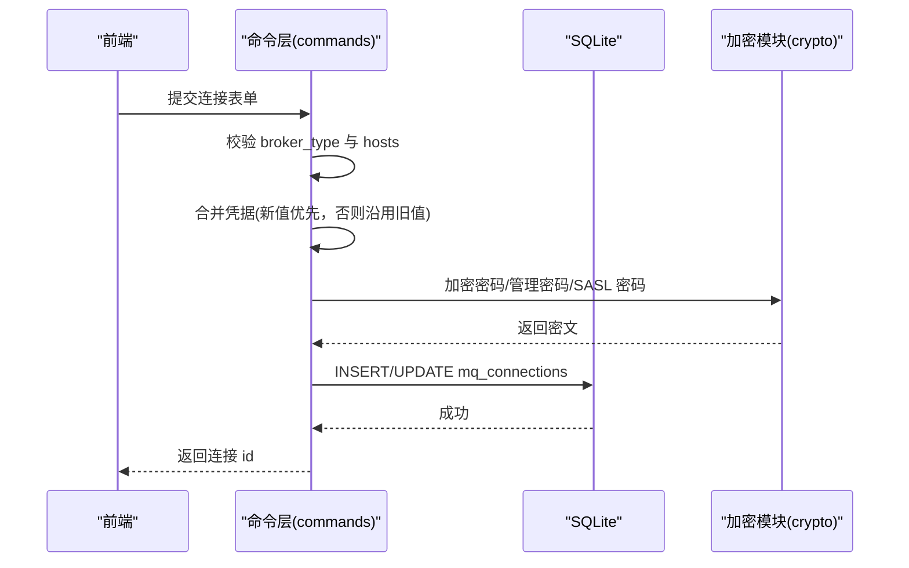
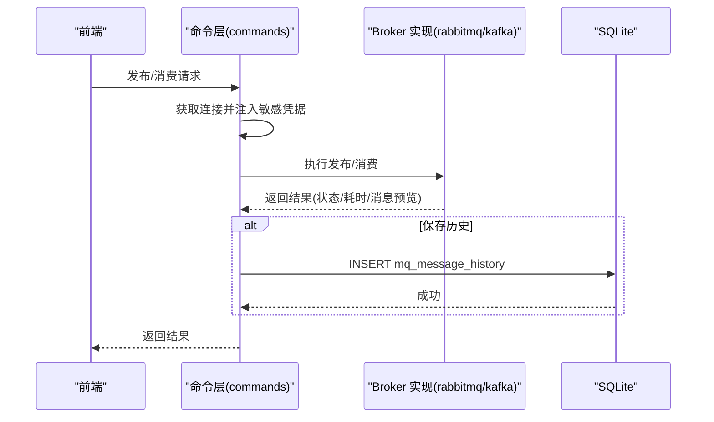
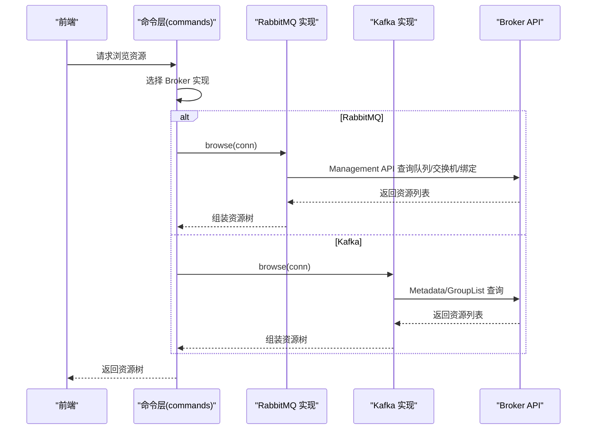
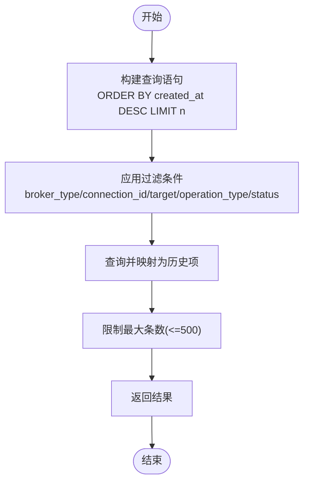
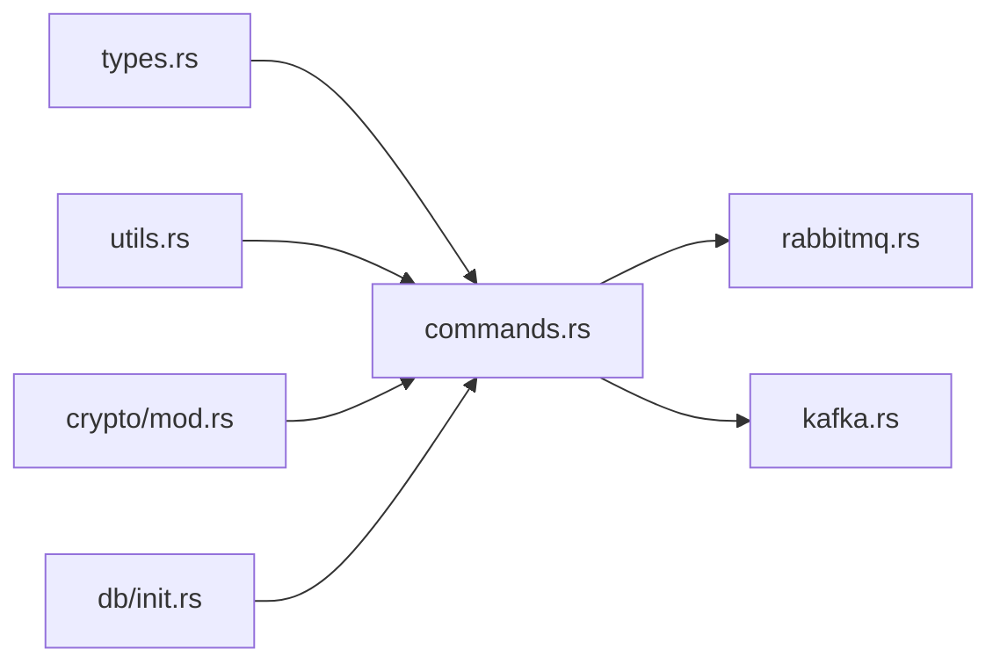

# 消息队列连接表

<cite>
**本文引用的文件**
- [src-tauri/src/db/init.rs](file://src-tauri/src/db/init.rs)
- [src-tauri/src/plugins/mq/types.rs](file://src-tauri/src/plugins/mq/types.rs)
- [src-tauri/src/plugins/mq/commands.rs](file://src-tauri/src/plugins/mq/commands.rs)
- [src-tauri/src/plugins/mq/rabbitmq.rs](file://src-tauri/src/plugins/mq/rabbitmq.rs)
- [src-tauri/src/plugins/mq/kafka.rs](file://src-tauri/src/plugins/mq/kafka.rs)
- [src-tauri/src/crypto/mod.rs](file://src-tauri/src/crypto/mod.rs)
- [src-tauri/src/plugins/mq/utils.rs](file://src-tauri/src/plugins/mq/utils.rs)
</cite>

## 目录
1. [简介](#简介)
2. [项目结构](#项目结构)
3. [核心组件](#核心组件)
4. [架构总览](#架构总览)
5. [详细组件分析](#详细组件分析)
6. [依赖关系分析](#依赖关系分析)
7. [性能考量](#性能考量)
8. [故障排查指南](#故障排查指南)
9. [结论](#结论)
10. [附录](#附录)

## 简介
本文件聚焦于 DevNexus 中“消息队列连接表”的设计与实现，系统性说明以下三张表的字段、数据模型、处理流程与安全机制：
- mq_connections：消息队列连接信息表，支持 RabbitMQ 与 Kafka，包含连接元数据、主机列表、认证凭据与各 Broker 的专用配置。
- mq_message_history：消息队列操作历史表，记录发布/消费等操作的请求与结果摘要、耗时与状态。
- mq_saved_messages：消息模板表，保存可复用的消息体、头与属性。

同时，本文将深入解析连接配置的复杂性与安全性考虑，帮助读者在实际使用中做出正确决策。

## 项目结构
消息队列功能位于 Rust 后端插件模块中，数据库初始化与迁移逻辑集中于数据库模块，加密与工具函数分别位于独立模块，形成清晰的分层：
- 数据库层：负责表结构定义与初始化
- 插件层：提供命令接口与业务逻辑（RabbitMQ/Kafka）
- 加密层：提供对敏感字段的加解密能力
- 工具层：提供通用工具（时间戳、JSON 处理、敏感信息脱敏）

图表来源
- [src-tauri/src/db/init.rs:238-278](file://src-tauri/src/db/init.rs#L238-L278)
- [src-tauri/src/plugins/mq/commands.rs:1-276](file://src-tauri/src/plugins/mq/commands.rs#L1-L276)
- [src-tauri/src/plugins/mq/types.rs:1-213](file://src-tauri/src/plugins/mq/types.rs#L1-L213)
- [src-tauri/src/plugins/mq/rabbitmq.rs:1-211](file://src-tauri/src/plugins/mq/rabbitmq.rs#L1-L211)
- [src-tauri/src/plugins/mq/kafka.rs:1-243](file://src-tauri/src/plugins/mq/kafka.rs#L1-L243)
- [src-tauri/src/crypto/mod.rs:1-75](file://src-tauri/src/crypto/mod.rs#L1-L75)
- [src-tauri/src/plugins/mq/utils.rs:1-103](file://src-tauri/src/plugins/mq/utils.rs#L1-L103)

章节来源
- [src-tauri/src/db/init.rs:238-278](file://src-tauri/src/db/init.rs#L238-L278)
- [src-tauri/src/plugins/mq/commands.rs:1-276](file://src-tauri/src/plugins/mq/commands.rs#L1-L276)
- [src-tauri/src/plugins/mq/types.rs:1-213](file://src-tauri/src/plugins/mq/types.rs#L1-L213)

## 核心组件
本节从数据模型与命令接口两个维度，概述消息队列连接表的设计要点与实现细节。

- 连接模型与表结构
  - mq_connections：存储连接基本信息、主机列表、用户名、连接超时、Broker 类型以及各 Broker 的 JSON 配置与对应加密凭据。
  - mq_message_history：记录每次操作的请求/结果摘要、耗时、状态与时间戳。
  - mq_saved_messages：保存可复用的消息模板，包含消息体、头与属性。

- 命令接口职责
  - 列表/获取/保存/删除连接：封装对 mq_connections 的增删改查，并处理敏感凭据的加密与合并。
  - 测试连接：按 Broker 类型调用对应诊断流程，返回阶段化诊断结果。
  - 浏览资源：按 Broker 类型返回资源树（RabbitMQ 的交换机/队列/绑定；Kafka 的主题/分区/消费者组）。
  - 发布/预览：根据请求构造消息并执行发布或消费预览，自动写入历史记录（可选）。
  - 历史查询/清理：支持过滤与分页查询，提供清空历史的能力。
  - 模板管理：保存/删除/列出消息模板。

章节来源
- [src-tauri/src/plugins/mq/types.rs:1-213](file://src-tauri/src/plugins/mq/types.rs#L1-L213)
- [src-tauri/src/plugins/mq/commands.rs:68-276](file://src-tauri/src/plugins/mq/commands.rs#L68-L276)

## 架构总览
下图展示消息队列连接表在系统中的位置与交互关系：

图表来源
- [src-tauri/src/db/init.rs:238-278](file://src-tauri/src/db/init.rs#L238-L278)

## 详细组件分析

### mq_connections 表设计与字段说明
- 字段清单与含义
  - id：主键，唯一标识一条连接记录
  - name：连接名称
  - group_name：连接分组名（可选）
  - broker_type：代理类型，仅允许 "rabbitmq" 或 "kafka"
  - hosts_json：主机列表（JSON 数组），用于连接 Broker
  - username：用户名（可选）
  - password_encrypted：连接密码的加密存储
  - connect_timeout：连接超时（秒），默认 10，最小为 1
  - rabbitmq_json：RabbitMQ 专属配置（JSON 对象），可能包含 AMQP URL、虚拟主机、管理端地址与凭据等
  - rabbitmq_management_password_encrypted：RabbitMQ 管理端密码的加密存储
  - kafka_json：Kafka 专属配置（JSON 对象），可能包含 bootstrap.servers、client.id、安全协议、SASL 机制与凭据等
  - kafka_sasl_password_encrypted：Kafka SASL 密码的加密存储
  - created_at / updated_at：创建与更新时间戳（RFC3339 字符串）

- 设计要点
  - 主机列表采用 JSON 存储，便于扩展多主机场景
  - Broker 专属配置与通用凭据分离，降低耦合
  - 所有敏感凭据均加密存储，避免明文泄露
  - connect_timeout 统一为整数秒，便于上层逻辑统一处理

章节来源
- [src-tauri/src/db/init.rs:238-253](file://src-tauri/src/db/init.rs#L238-L253)
- [src-tauri/src/plugins/mq/commands.rs:92-143](file://src-tauri/src/plugins/mq/commands.rs#L92-L143)
- [src-tauri/src/plugins/mq/types.rs:3-30](file://src-tauri/src/plugins/mq/types.rs#L3-L30)

### mq_message_history 表设计与字段说明
- 字段清单与含义
  - id：主键，唯一标识一次操作历史
  - broker_type：关联的代理类型
  - connection_id：所属连接 id
  - operation_type：操作类型，如 "publish" 或 "consume"
  - target：目标（如队列名、主题名或交换机名）
  - status：操作状态（如 "success" 或 "error"）
  - duration_ms：操作耗时（毫秒）
  - request_json / result_json：请求与结果的 JSON 摘要（敏感字段已脱敏）
  - created_at：记录时间戳

- 设计要点
  - 历史记录包含请求与结果摘要，便于回溯与审计
  - 敏感字段通过脱敏策略保护隐私
  - 支持按连接、目标、操作类型与状态进行过滤查询

章节来源
- [src-tauri/src/db/init.rs:255-266](file://src-tauri/src/db/init.rs#L255-L266)
- [src-tauri/src/plugins/mq/commands.rs:172-229](file://src-tauri/src/plugins/mq/commands.rs#L172-L229)
- [src-tauri/src/plugins/mq/utils.rs:39-55](file://src-tauri/src/plugins/mq/utils.rs#L39-L55)

### mq_saved_messages 表设计与字段说明
- 字段清单与含义
  - id：主键，唯一标识一条消息模板
  - broker_type：模板适用的代理类型
  - name：模板名称
  - target：目标（可选，如主题或队列）
  - body_json：消息体（JSON 对象），包含编码方式、文本内容、内容类型与字节数
  - headers_json / properties_json：消息头与属性（JSON 数组）
  - created_at / updated_at：创建与更新时间戳

- 设计要点
  - 模板化消息便于重复使用与快速发布
  - 消息体支持多种编码（UTF-8/base64），兼容二进制内容
  - 头与属性以数组形式存储，便于编辑与序列化

章节来源
- [src-tauri/src/db/init.rs:268-278](file://src-tauri/src/db/init.rs#L268-L278)
- [src-tauri/src/plugins/mq/commands.rs:250-275](file://src-tauri/src/plugins/mq/commands.rs#L250-L275)
- [src-tauri/src/plugins/mq/types.rs:190-212](file://src-tauri/src/plugins/mq/types.rs#L190-L212)

### 连接保存流程（含凭据加密与合并）
该流程展示了保存连接时如何处理敏感凭据与配置合并逻辑。

图表来源
- [src-tauri/src/plugins/mq/commands.rs:92-143](file://src-tauri/src/plugins/mq/commands.rs#L92-L143)
- [src-tauri/src/crypto/mod.rs:40-74](file://src-tauri/src/crypto/mod.rs#L40-L74)

章节来源
- [src-tauri/src/plugins/mq/commands.rs:48-66](file://src-tauri/src/plugins/mq/commands.rs#L48-L66)
- [src-tauri/src/plugins/mq/commands.rs:92-143](file://src-tauri/src/plugins/mq/commands.rs#L92-L143)
- [src-tauri/src/crypto/mod.rs:40-74](file://src-tauri/src/crypto/mod.rs#L40-L74)

### 发布/消费流程（含历史记录）
该流程展示发布与消费操作如何执行并生成历史记录。

图表来源
- [src-tauri/src/plugins/mq/commands.rs:182-207](file://src-tauri/src/plugins/mq/commands.rs#L182-L207)
- [src-tauri/src/plugins/mq/rabbitmq.rs:136-165](file://src-tauri/src/plugins/mq/rabbitmq.rs#L136-L165)
- [src-tauri/src/plugins/mq/kafka.rs:148-176](file://src-tauri/src/plugins/mq/kafka.rs#L148-L176)

章节来源
- [src-tauri/src/plugins/mq/commands.rs:172-207](file://src-tauri/src/plugins/mq/commands.rs#L172-L207)
- [src-tauri/src/plugins/mq/rabbitmq.rs:136-165](file://src-tauri/src/plugins/mq/rabbitmq.rs#L136-L165)
- [src-tauri/src/plugins/mq/kafka.rs:148-176](file://src-tauri/src/plugins/mq/kafka.rs#L148-L176)

### 资源浏览流程（RabbitMQ/Kafka）
该流程展示按 Broker 类型返回资源树的过程。

图表来源
- [src-tauri/src/plugins/mq/commands.rs:163-170](file://src-tauri/src/plugins/mq/commands.rs#L163-L170)
- [src-tauri/src/plugins/mq/rabbitmq.rs:123-134](file://src-tauri/src/plugins/mq/rabbitmq.rs#L123-L134)
- [src-tauri/src/plugins/mq/kafka.rs:74-146](file://src-tauri/src/plugins/mq/kafka.rs#L74-L146)

章节来源
- [src-tauri/src/plugins/mq/commands.rs:163-170](file://src-tauri/src/plugins/mq/commands.rs#L163-L170)
- [src-tauri/src/plugins/mq/rabbitmq.rs:123-134](file://src-tauri/src/plugins/mq/rabbitmq.rs#L123-L134)
- [src-tauri/src/plugins/mq/kafka.rs:74-146](file://src-tauri/src/plugins/mq/kafka.rs#L74-L146)

### 历史查询与清理流程
该流程展示历史记录的查询与清理能力。

图表来源
- [src-tauri/src/plugins/mq/commands.rs:214-229](file://src-tauri/src/plugins/mq/commands.rs#L214-L229)

章节来源
- [src-tauri/src/plugins/mq/commands.rs:214-241](file://src-tauri/src/plugins/mq/commands.rs#L214-L241)

## 依赖关系分析
- 表结构依赖
  - mq_message_history 通过 connection_id 关联 mq_connections
  - 三表之间无循环依赖，关系清晰
- 模块间依赖
  - commands.rs 依赖 types.rs 的数据模型、utils.rs 的工具函数与 crypto.rs 的加密能力
  - rabbitmq.rs 与 kafka.rs 分别实现不同 Broker 的连接与操作
  - init.rs 在应用启动时创建/迁移所有表结构

图表来源
- [src-tauri/src/plugins/mq/commands.rs:1-276](file://src-tauri/src/plugins/mq/commands.rs#L1-L276)
- [src-tauri/src/plugins/mq/types.rs:1-213](file://src-tauri/src/plugins/mq/types.rs#L1-L213)
- [src-tauri/src/plugins/mq/utils.rs:1-103](file://src-tauri/src/plugins/mq/utils.rs#L1-L103)
- [src-tauri/src/crypto/mod.rs:1-75](file://src-tauri/src/crypto/mod.rs#L1-L75)
- [src-tauri/src/db/init.rs:238-278](file://src-tauri/src/db/init.rs#L238-L278)

章节来源
- [src-tauri/src/plugins/mq/commands.rs:1-276](file://src-tauri/src/plugins/mq/commands.rs#L1-L276)
- [src-tauri/src/db/init.rs:238-278](file://src-tauri/src/db/init.rs#L238-L278)

## 性能考量
- 连接超时控制
  - Kafka 客户端在元数据请求与生产/消费操作中使用 connect_timeout 控制等待时间，避免长时间阻塞
- 查询限制
  - 历史查询默认限制 200 条，最大 500 条，防止大量数据导致 UI 卡顿
- 资源浏览
  - RabbitMQ 使用 Management API 获取资源列表，Kafka 通过元数据与组列表查询，避免全量扫描
- 敏感信息处理
  - 历史记录中的敏感字段会被脱敏，减少潜在风险

章节来源
- [src-tauri/src/plugins/mq/kafka.rs:44-72](file://src-tauri/src/plugins/mq/kafka.rs#L44-L72)
- [src-tauri/src/plugins/mq/commands.rs:217-218](file://src-tauri/src/plugins/mq/commands.rs#L217-L218)
- [src-tauri/src/plugins/mq/utils.rs:39-55](file://src-tauri/src/plugins/mq/utils.rs#L39-L55)

## 故障排查指南
- 连接失败
  - RabbitMQ：检查 AMQP URL 与 Management URL 是否可用，确认凭据是否正确
  - Kafka：检查 bootstrap.servers 与安全协议配置，确认元数据请求是否成功
- 认证问题
  - 确认密码、管理密码与 SASL 密码是否正确，必要时重新保存连接
- 历史记录异常
  - 检查历史表是否存在，确认过滤条件是否正确
  - 如需重放，可使用消息模板重新发布
- 性能问题
  - 调整 connect_timeout，优化主机列表与网络环境
  - 清理历史记录以释放空间

章节来源
- [src-tauri/src/plugins/mq/rabbitmq.rs:66-104](file://src-tauri/src/plugins/mq/rabbitmq.rs#L66-L104)
- [src-tauri/src/plugins/mq/kafka.rs:44-72](file://src-tauri/src/plugins/mq/kafka.rs#L44-L72)
- [src-tauri/src/plugins/mq/commands.rs:231-241](file://src-tauri/src/plugins/mq/commands.rs#L231-L241)

## 结论
DevNexus 的消息队列连接表设计遵循“配置与凭据分离、敏感信息加密、历史记录可审计”的原则，既满足 RabbitMQ 与 Kafka 的差异化需求，又通过统一的数据模型与命令接口简化了使用体验。配合严格的凭据加密与历史脱敏策略，有效提升了系统的安全性与可维护性。

## 附录

### 字段与类型对照表
- mq_connections
  - id：text（PK）
  - name：text
  - group_name：text
  - broker_type：text（"rabbitmq"|"kafka"）
  - hosts_json：text（JSON 数组）
  - username：text
  - password_encrypted：text
  - connect_timeout：integer（秒）
  - rabbitmq_json：text（JSON 对象）
  - rabbitmq_management_password_encrypted：text
  - kafka_json：text（JSON 对象）
  - kafka_sasl_password_encrypted：text
  - created_at / updated_at：text（RFC3339）

- mq_message_history
  - id：text（PK）
  - broker_type：text
  - connection_id：text（FK）
  - operation_type：text
  - target：text
  - status：text
  - duration_ms：integer（ms）
  - request_json / result_json：text（JSON）
  - created_at：text（RFC3339）

- mq_saved_messages
  - id：text（PK）
  - broker_type：text
  - name：text
  - target：text
  - body_json：text（JSON 对象）
  - headers_json / properties_json：text（JSON 数组）
  - created_at / updated_at：text（RFC3339）

章节来源
- [src-tauri/src/db/init.rs:238-278](file://src-tauri/src/db/init.rs#L238-L278)
- [src-tauri/src/plugins/mq/types.rs:3-30](file://src-tauri/src/plugins/mq/types.rs#L3-L30)
- [src-tauri/src/plugins/mq/types.rs:164-212](file://src-tauri/src/plugins/mq/types.rs#L164-L212)