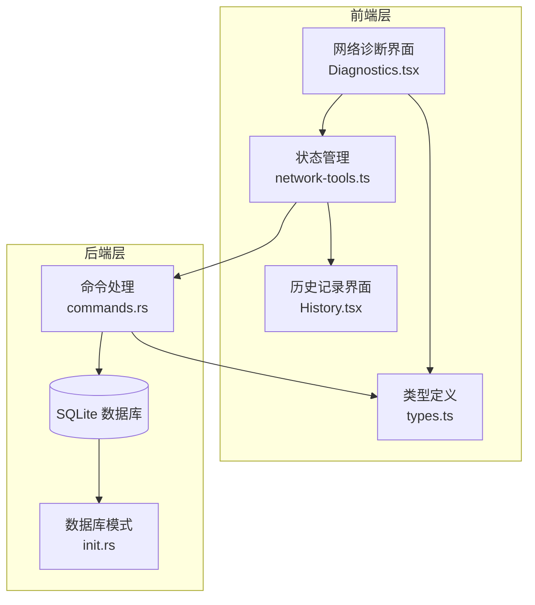
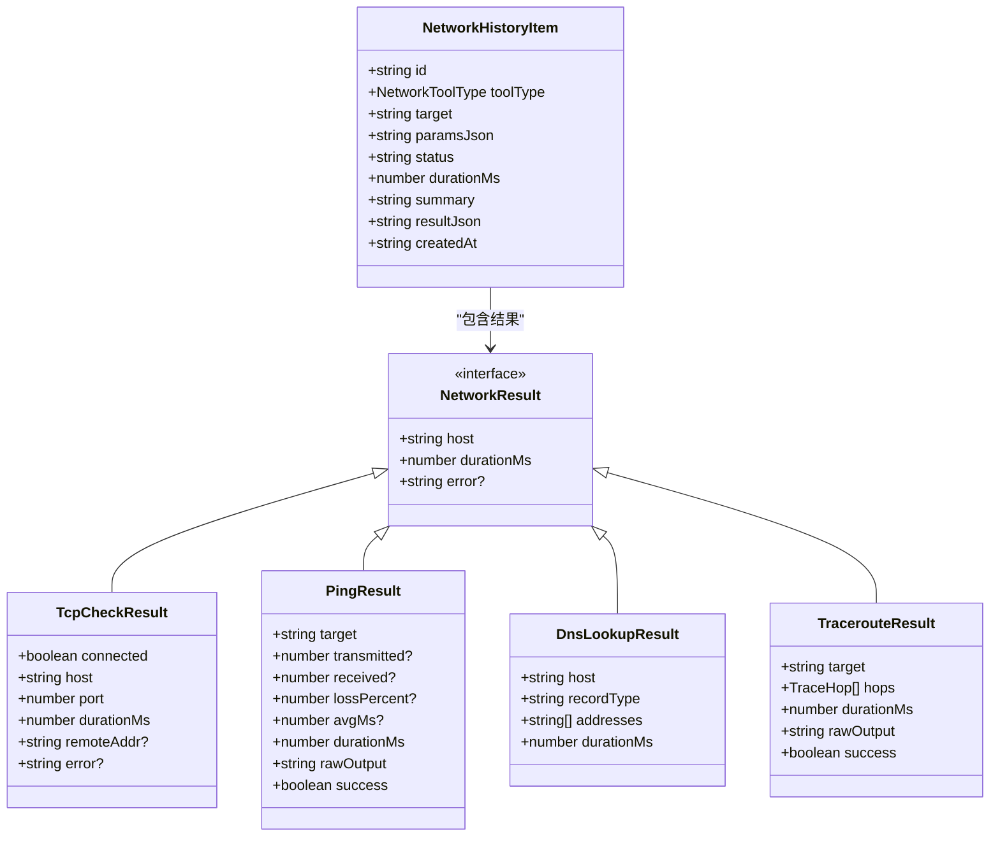
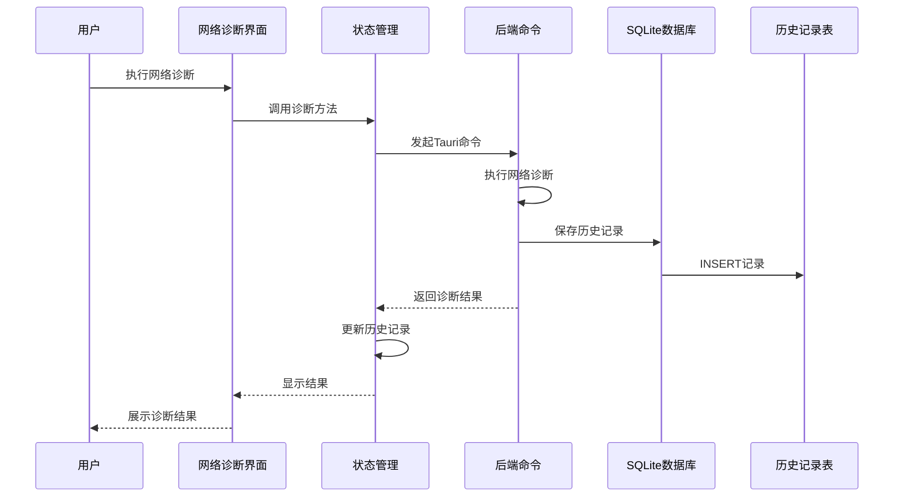
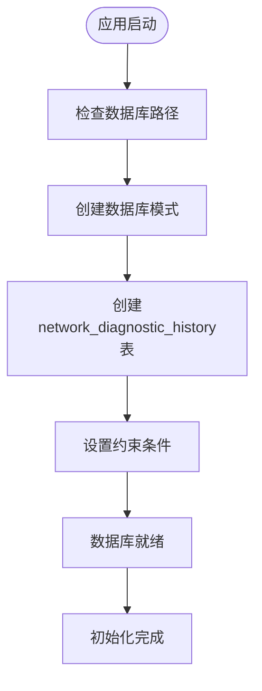
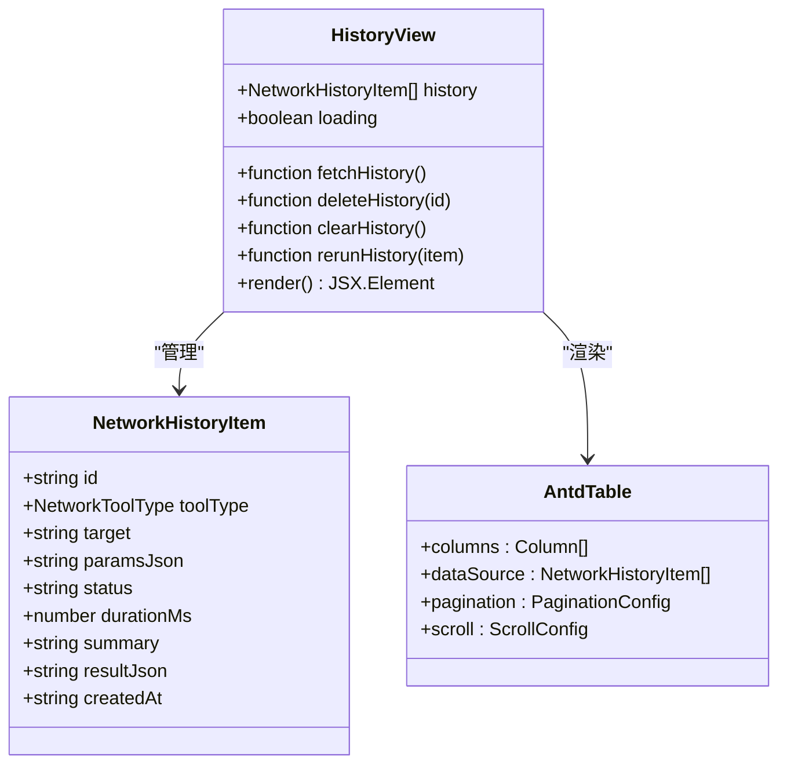
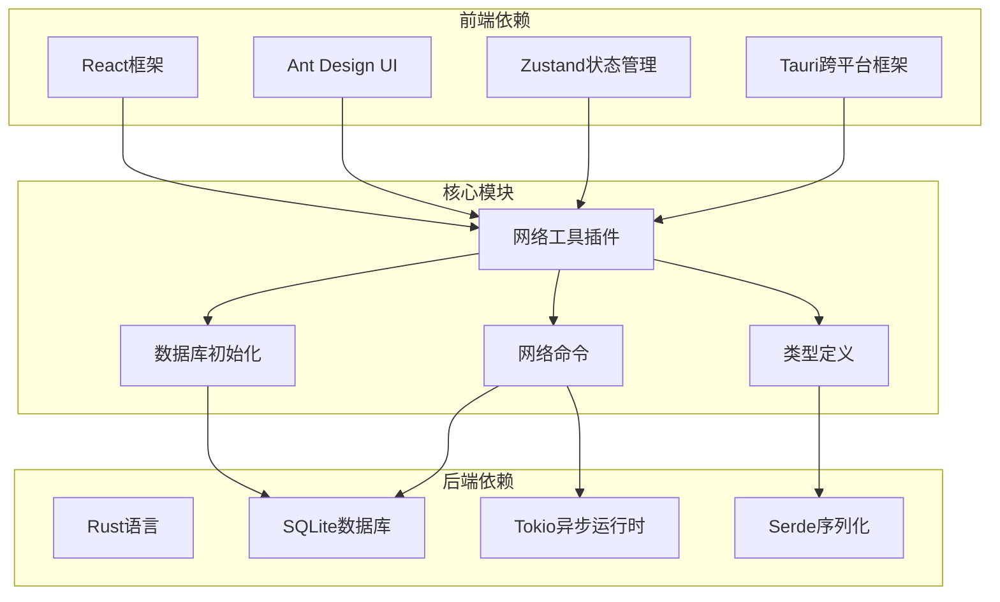

# 网络诊断表

<cite>
**本文档引用的文件**
- [types.ts](file://src/plugins/network-tools/types.ts)
- [network-tools.ts](file://src/plugins/network-tools/store/network-tools.ts)
- [History.tsx](file://src/plugins/network-tools/views/History.tsx)
- [Diagnostics.tsx](file://src/plugins/network-tools/views/Diagnostics.tsx)
- [init.rs](file://src-tauri/src/db/init.rs)
- [commands.rs](file://src-tauri/src/plugins/network/commands.rs)
- [types.rs](file://src-tauri/src/plugins/network/types.rs)
- [index.tsx](file://src/plugins/network-tools/index.tsx)
</cite>

## 目录
1. [简介](#简介)
2. [项目结构](#项目结构)
3. [核心组件](#核心组件)
4. [架构概览](#架构概览)
5. [详细组件分析](#详细组件分析)
6. [依赖关系分析](#依赖关系分析)
7. [性能考虑](#性能考虑)
8. [故障排除指南](#故障排除指南)
9. [结论](#结论)

## 简介

DevNexus 的网络诊断表（`network_diagnostic_history`）是网络工具插件的核心数据存储组件，用于记录所有网络诊断操作的历史记录。该表设计用于存储不同网络诊断工具（TCP连接检查、Ping测试、DNS查询、Traceroute路由追踪）的执行结果，为用户提供完整的网络问题诊断历史和分析能力。

网络诊断表的主要目的是：
- 持久化保存网络诊断历史记录
- 支持历史记录的查询、筛选和分析
- 提供诊断结果的重放功能
- 帮助用户识别和解决网络连接问题
- 支持网络性能监控和趋势分析

## 项目结构

网络诊断功能涉及前端和后端两个层面的协作：

**图表来源**
- [Diagnostics.tsx:1-148](file://src/plugins/network-tools/views/Diagnostics.tsx#L1-L148)
- [network-tools.ts:1-97](file://src/plugins/network-tools/store/network-tools.ts#L1-L97)
- [commands.rs:1-537](file://src-tauri/src/plugins/network/commands.rs#L1-L537)
- [init.rs:167-177](file://src-tauri/src/db/init.rs#L167-L177)

**章节来源**
- [index.tsx:1-27](file://src/plugins/network-tools/index.tsx#L1-L27)
- [types.ts:1-57](file://src/plugins/network-tools/types.ts#L1-L57)

## 核心组件

### 数据表结构设计

网络诊断表采用 SQLite 关系型数据库存储，具有以下字段设计：

| 字段名 | 数据类型 | 约束条件 | 描述 |
|--------|----------|----------|------|
| id | TEXT | PRIMARY KEY NOT NULL | 历史记录唯一标识符（UUID） |
| tool_type | TEXT | NOT NULL | 工具类型（ping/tcp/dns/traceroute） |
| target | TEXT | NOT NULL | 目标地址或主机名 |
| params_json | TEXT | NOT NULL | 参数的JSON序列化字符串 |
| status | TEXT | NOT NULL | 执行状态（success/failed） |
| duration_ms | INTEGER | NOT NULL DEFAULT 0 | 执行耗时（毫秒） |
| summary | TEXT | NOT NULL | 执行摘要信息 |
| result_json | TEXT | NOT NULL | 结果的JSON序列化字符串 |
| created_at | TEXT | NOT NULL | 创建时间（RFC3339格式） |

### 数据模型映射

前端和后端使用统一的数据模型进行交互：

**图表来源**
- [types.ts:3-57](file://src/plugins/network-tools/types.ts#L3-L57)
- [types.rs:3-65](file://src-tauri/src/plugins/network/types.rs#L3-L65)

**章节来源**
- [init.rs:167-177](file://src-tauri/src/db/init.rs#L167-L177)
- [types.ts:1-57](file://src/plugins/network-tools/types.ts#L1-L57)

## 架构概览

网络诊断表的完整工作流程包括前端交互、后端处理和数据库持久化三个层次：

**图表来源**
- [network-tools.ts:42-77](file://src/plugins/network-tools/store/network-tools.ts#L42-L77)
- [commands.rs:258-314](file://src-tauri/src/plugins/network/commands.rs#L258-L314)
- [commands.rs:38-69](file://src-tauri/src/plugins/network/commands.rs#L38-L69)

## 详细组件分析

### 数据库初始化与表创建

网络诊断表在应用启动时自动创建，确保数据存储的可用性：

**图表来源**
- [init.rs:28-372](file://src-tauri/src/db/init.rs#L28-L372)

### 诊断工具历史记录存储策略

不同诊断工具使用统一的存储策略，但参数和结果格式有所不同：

#### TCP连接检查历史记录
- **参数格式**: `{ host: string, port: number, timeoutMs: number }`
- **结果格式**: 包含连接状态、远程地址、错误信息等
- **状态判断**: connected 字段为 true 时表示成功

#### Ping测试历史记录
- **参数格式**: `{ target: string, count: number, timeoutMs: number }`
- **结果格式**: 包含传输包数、接收包数、丢包率、平均延迟等
- **状态判断**: success 字段为 true 或 avg_ms 存在时表示成功

#### DNS查询历史记录
- **参数格式**: `{ host: string, recordType: string, timeoutMs: number }`
- **结果格式**: 包含解析到的IP地址列表
- **状态判断**: addresses 数组长度大于 0 时表示成功

#### Traceroute路由追踪历史记录
- **参数格式**: `{ target: string, maxHops: number, timeoutMs: number }`
- **结果格式**: 包含路由跳点信息和原始输出
- **状态判断**: success 字段为 true 时表示成功

**章节来源**
- [commands.rs:258-481](file://src-tauri/src/plugins/network/commands.rs#L258-L481)
- [network-tools.ts:26-32](file://src/plugins/network-tools/store/network-tools.ts#L26-L32)

### 前端历史记录展示

历史记录界面提供了完整的诊断历史浏览和管理功能：

**图表来源**
- [History.tsx:15-76](file://src/plugins/network-tools/views/History.tsx#L15-L76)
- [network-tools.ts:78-96](file://src/plugins/network-tools/store/network-tools.ts#L78-L96)

**章节来源**
- [History.tsx:1-76](file://src/plugins/network-tools/views/History.tsx#L1-L76)
- [Diagnostics.tsx:1-148](file://src/plugins/network-tools/views/Diagnostics.tsx#L1-L148)

## 依赖关系分析

网络诊断表的依赖关系体现了清晰的分层架构：

**图表来源**
- [network-tools.ts:1-97](file://src/plugins/network-tools/store/network-tools.ts#L1-L97)
- [commands.rs:1-11](file://src-tauri/src/plugins/network/commands.rs#L1-L11)
- [init.rs:1-5](file://src-tauri/src/db/init.rs#L1-L5)

**章节来源**
- [network-tools.ts:1-97](file://src/plugins/network-tools/store/network-tools.ts#L1-L97)
- [commands.rs:1-537](file://src-tauri/src/plugins/network/commands.rs#L1-L537)

## 性能考虑

网络诊断表在设计时考虑了多个性能优化方面：

### 数据存储优化
- 使用 SQLite 本地存储，避免网络延迟
- JSON 字段采用 TEXT 类型存储，便于查询和分析
- UUID 作为主键，确保唯一性和查询效率

### 查询性能优化
- 历史记录按创建时间倒序排列，支持快速访问最新记录
- 提供可选的限制参数，控制返回记录数量
- 使用索引优化常用查询字段

### 内存管理
- 前端仅加载必要的历史记录数据
- 支持分页显示，避免大量数据一次性加载
- 及时清理不再使用的状态数据

## 故障排除指南

### 常见问题及解决方案

#### 历史记录无法显示
1. **检查数据库连接**: 确认数据库文件存在且可访问
2. **验证表结构**: 确认 `network_diagnostic_history` 表已正确创建
3. **检查权限**: 确保应用程序有读取数据库的权限

#### 诊断结果不准确
1. **验证网络连接**: 确认系统网络环境正常
2. **检查超时设置**: 调整超时参数以适应网络环境
3. **查看原始输出**: 分析原始命令输出以识别问题

#### 性能问题
1. **清理历史记录**: 定期清理不需要的历史记录
2. **优化查询**: 使用更精确的查询条件
3. **检查系统资源**: 确认系统有足够的内存和CPU资源

**章节来源**
- [commands.rs:484-517](file://src-tauri/src/plugins/network/commands.rs#L484-L517)
- [network-tools.ts:78-96](file://src/plugins/network-tools/store/network-tools.ts#L78-L96)

## 结论

DevNexus 的网络诊断表设计体现了现代应用程序的最佳实践，通过前后端分离的架构、统一的数据模型和完善的错误处理机制，为用户提供了一个强大而易用的网络诊断工具。

该设计的主要优势包括：
- **一致性**: 前后端使用相同的类型定义，确保数据完整性
- **可扩展性**: 支持添加新的诊断工具和结果格式
- **可维护性**: 清晰的代码结构和文档，便于后续开发
- **用户体验**: 提供直观的界面和丰富的功能特性

网络诊断表不仅满足了当前的功能需求，还为未来的功能扩展奠定了坚实的基础。通过合理的数据设计和架构规划，用户可以有效地诊断和解决各种网络连接问题。