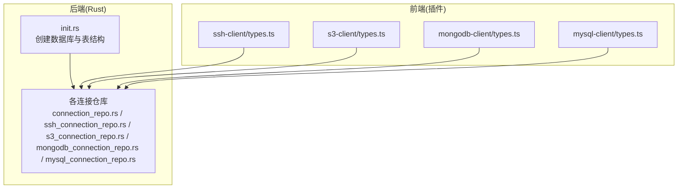
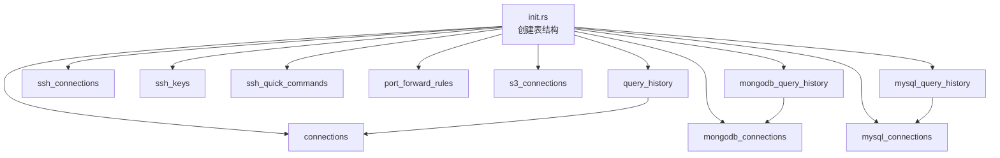
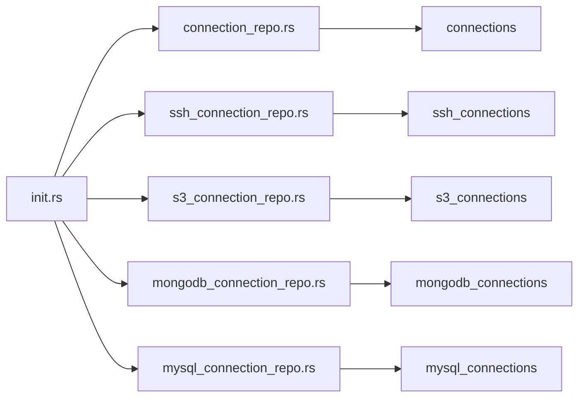

# 表结构设计

<cite>
**本文档引用的文件**
- [init.rs](file://src-tauri/src/db/init.rs)
- [connection_repo.rs](file://src-tauri/src/db/connection_repo.rs)
- [ssh_connection_repo.rs](file://src-tauri/src/db/ssh_connection_repo.rs)
- [s3_connection_repo.rs](file://src-tauri/src/db/s3_connection_repo.rs)
- [mongodb_connection_repo.rs](file://src-tauri/src/db/mongodb_connection_repo.rs)
- [mysql_connection_repo.rs](file://src-tauri/src/db/mysql_connection_repo.rs)
- [types.ts (SSH)](file://src/plugins/ssh-client/types.ts)
- [types.ts (S3)](file://src/plugins/s3-client/types.ts)
- [types.ts (MongoDB)](file://src/plugins/mongodb-client/types.ts)
- [types.ts (MySQL)](file://src/plugins/mysql-client/types.ts)
- [v0.4.0.md](file://docs/releases/v0.4.0.md)
- [v0.5.0.md](file://docs/releases/v0.5.0.md)
</cite>

## 目录
1. [简介](#简介)
2. [项目结构](#项目结构)
3. [核心组件](#核心组件)
4. [架构总览](#架构总览)
5. [详细组件分析](#详细组件分析)
6. [依赖分析](#依赖分析)
7. [性能考虑](#性能考虑)
8. [故障排除指南](#故障排除指南)
9. [结论](#结论)
10. [附录](#附录)

## 简介
本文件系统性梳理 DevNexus 的数据库表结构设计，覆盖通用连接信息、查询历史以及各类客户端连接配置表。重点说明各表的字段定义、数据类型、约束与默认值，解释表间关系与索引策略，并结合版本发布说明给出表结构演进与兼容性说明。

## 项目结构
DevNexus 的数据库初始化与表结构定义集中在 Rust 后端模块中，采用 SQLite 作为本地存储，通过迁移脚本创建并维护表结构。前端插件通过类型定义与后端仓库交互，确保数据一致性。

**图表来源**
- [init.rs:35-354](file://src-tauri/src/db/init.rs#L35-L354)
- [connection_repo.rs:1-174](file://src-tauri/src/db/connection_repo.rs#L1-L174)
- [ssh_connection_repo.rs:1-218](file://src-tauri/src/db/ssh_connection_repo.rs#L1-L218)
- [s3_connection_repo.rs:1-188](file://src-tauri/src/db/s3_connection_repo.rs#L1-L188)
- [mongodb_connection_repo.rs:1-249](file://src-tauri/src/db/mongodb_connection_repo.rs#L1-L249)
- [mysql_connection_repo.rs:1-209](file://src-tauri/src/db/mysql_connection_repo.rs#L1-L209)

**章节来源**
- [init.rs:1-363](file://src-tauri/src/db/init.rs#L1-L363)

## 核心组件
本节概述数据库初始化流程与核心表结构，包括 connections、query_history、ssh_connections、s3_connections、mongodb_connections、mysql_connections 等。

- 数据库初始化
  - 初始化函数负责解析应用数据目录、确保目录存在、迁移旧数据库文件、打开数据库并执行建表脚本。
  - 建表脚本包含多张业务相关表，涵盖连接配置、查询历史、密钥与隧道规则等。
- 连接信息表
  - connections：通用 Redis 连接配置，包含标识、名称、分组、主机、端口、密码加密、数据库索引、连接类型与创建时间。
  - ssh_connections：SSH 连接配置，包含认证方式、用户名、主机、端口、密钥、跳板机、编码与保活间隔等。
  - s3_connections：S3 连接配置，包含提供商、端点、区域、访问密钥、路径风格、默认桶等。
  - mongodb_connections：MongoDB 连接配置，支持 URI 或表单两种模式，包含 TLS/SRV、副本集等。
  - mysql_connections：MySQL 连接配置，包含字符集、SSL 模式、超时等。
- 查询历史表
  - query_history：Redis 查询历史，关联 connection_id。
  - mongodb_query_history：MongoDB 查询历史，包含数据库名、集合名、查询类型与内容。
  - mysql_query_history：MySQL 查询历史，包含数据库名、SQL 文本与执行时间。
- 其他辅助表
  - ssh_keys：SSH 密钥信息，包含私钥路径、公钥与创建时间。
  - ssh_quick_commands：SSH 快捷命令，按排序字段组织。
  - port_forward_rules：端口转发规则，包含本地/远端主机与端口、自动启动与状态。
  - lan_chat_*：局域网聊天相关表（设备、房间、成员、消息、传输、共享文件），用于聊天功能。

**章节来源**
- [init.rs:35-354](file://src-tauri/src/db/init.rs#L35-L354)

## 架构总览
下图展示数据库初始化与各连接仓库的关系，以及表之间的潜在引用关系（如查询历史与连接表）。

**图表来源**
- [init.rs:35-354](file://src-tauri/src/db/init.rs#L35-L354)

## 详细组件分析

### connections 表（通用连接信息）
- 字段定义
  - id：主键，文本类型，非空。
  - name：名称，文本类型，非空。
  - group_name：分组名，文本类型，可空。
  - host：主机地址，文本类型，非空。
  - port：端口，整型，非空。
  - password_encrypted：密码加密字段，文本类型，可空。
  - db_index：数据库索引，整型，非空，默认 0。
  - connection_type：连接类型，文本类型，非空，默认 'Standalone'。
  - created_at：创建时间，文本类型，非空。
- 约束与默认值
  - 主键：id。
  - 默认值：db_index=0，connection_type='Standalone'。
- 关系设计
  - query_history.connection_id 引用该表 id（逻辑外键，未声明显式外键约束）。
- 索引策略
  - 主键索引：id。
  - 建议：可考虑对 host、port、group_name 建立复合索引以优化查询。
- 典型用途
  - 存储 Redis 连接配置，供查询历史与连接管理使用。

**章节来源**
- [init.rs:37-47](file://src-tauri/src/db/init.rs#L37-L47)
- [connection_repo.rs:34-94](file://src-tauri/src/db/connection_repo.rs#L34-L94)

### query_history 表（查询历史）
- 字段定义
  - id：主键，文本类型，非空。
  - connection_id：连接标识，文本类型，非空。
  - command：命令文本，文本类型，非空。
  - executed_at：执行时间，文本类型，非空。
- 约束与默认值
  - 主键：id。
- 关系设计
  - 逻辑外键：connection_id 引用 connections.id。
- 索引策略
  - 主键索引：id。
  - 建议：对 connection_id、executed_at 建立复合索引以提升按连接与时间范围查询效率。
- 典型用途
  - 记录 Redis 查询历史，便于回溯与重放。

**章节来源**
- [init.rs:49-54](file://src-tauri/src/db/init.rs#L49-L54)
- [connection_repo.rs:34-94](file://src-tauri/src/db/connection_repo.rs#L34-L94)

### ssh_connections 表（SSH 连接）
- 字段定义
  - id：主键，文本类型，非空。
  - name：名称，文本类型，非空。
  - group_name：分组名，文本类型，可空。
  - host：主机地址，文本类型，非空。
  - port：端口，整型，默认 22。
  - username：用户名，文本类型，非空。
  - auth_type：认证类型，文本类型，非空。
  - password_encrypted：密码加密字段，文本类型，可空。
  - key_id：密钥标识，文本类型，可空。
  - key_passphrase_encrypted：密钥口令加密字段，文本类型，可空。
  - jump_host_id：跳板机标识，文本类型，可空。
  - encoding：终端编码，文本类型，默认 'utf-8'。
  - keepalive_interval：保活间隔，整型，默认 30。
  - created_at：创建时间，文本类型，非空。
- 约束与默认值
  - 主键：id；默认值：port=22，encoding='utf-8'，keepalive_interval=30。
- 关系设计
  - 逻辑外键：key_id 引用 ssh_keys.id；jump_host_id 引用自身 id（自引用）。
- 索引策略
  - 主键索引：id。
  - 建议：对 host、port、username 建立复合索引以优化登录与筛选。
- 典型用途
  - 存储 SSH 连接配置，配合 ssh_keys 与 port_forward_rules 使用。

**章节来源**
- [init.rs:65-80](file://src-tauri/src/db/init.rs#L65-L80)
- [ssh_connection_repo.rs:43-115](file://src-tauri/src/db/ssh_connection_repo.rs#L43-L115)

### ssh_keys 表（SSH 密钥）
- 字段定义
  - id：主键，文本类型，非空。
  - name：名称，文本类型，非空。
  - type：密钥类型，文本类型，非空。
  - private_key_path：私钥路径，文本类型，非空。
  - public_key：公钥文本，文本类型，非空。
  - created_at：创建时间，文本类型，非空。
- 约束与默认值
  - 主键：id。
- 关系设计
  - 逻辑外键：ssh_connections.key_id 引用该表 id。
- 索引策略
  - 主键索引：id。
  - 建议：对 name、type 建立复合索引以优化检索。
- 典型用途
  - 存储 SSH 密钥信息，供 ssh_connections 使用。

**章节来源**
- [init.rs:56-63](file://src-tauri/src/db/init.rs#L56-L63)
- [ssh_connection_repo.rs:205-217](file://src-tauri/src/db/ssh_connection_repo.rs#L205-L217)

### ssh_quick_commands 表（SSH 快捷命令）
- 字段定义
  - id：主键，文本类型，非空。
  - connection_id：连接标识，文本类型，可空。
  - name：命令名称，文本类型，非空。
  - command：命令文本，文本类型，非空。
  - sort_order：排序字段，整型，默认 0。
- 约束与默认值
  - 主键：id；默认值：sort_order=0。
- 关系设计
  - 逻辑外键：connection_id 引用 ssh_connections.id。
- 索引策略
  - 主键索引：id。
  - 建议：对 connection_id、sort_order 建立复合索引以优化按连接与排序查询。
- 典型用途
  - 存储常用命令模板，提升操作效率。

**章节来源**
- [init.rs:82-88](file://src-tauri/src/db/init.rs#L82-L88)
- [ssh_connection_repo.rs:43-78](file://src-tauri/src/db/ssh_connection_repo.rs#L43-L78)

### port_forward_rules 表（端口转发规则）
- 字段定义
  - id：主键，文本类型，非空。
  - connection_id：连接标识，文本类型，非空。
  - name：规则名称，文本类型，非空。
  - type：规则类型，文本类型，非空。
  - local_host：本地主机，文本类型，可空。
  - local_port：本地端口，整型，可空。
  - remote_host：远端主机，文本类型，可空。
  - remote_port：远端端口，整型，可空。
  - auto_start：自动启动，整型，默认 0。
  - status：状态，文本类型，默认 'stopped'。
- 约束与默认值
  - 主键：id；默认值：auto_start=0，status='stopped'。
- 关系设计
  - 逻辑外键：connection_id 引用 ssh_connections.id。
- 索引策略
  - 主键索引：id。
  - 建议：对 connection_id、status 建立复合索引以优化状态筛选。
- 典型用途
  - 存储隧道规则，支持本地/远程/动态三种类型。

**章节来源**
- [init.rs:90-101](file://src-tauri/src/db/init.rs#L90-L101)
- [ssh_connection_repo.rs:43-78](file://src-tauri/src/db/ssh_connection_repo.rs#L43-L78)

### s3_connections 表（S3 连接）
- 字段定义
  - id：主键，文本类型，非空。
  - name：名称，文本类型，非空。
  - group_name：分组名，文本类型，可空。
  - provider：提供商，文本类型，非空。
  - endpoint：端点，文本类型，可空。
  - region：区域，文本类型，非空。
  - access_key_id：访问密钥 ID，文本类型，非空。
  - secret_access_key_encrypted：密钥加密字段，文本类型，非空。
  - path_style：路径风格布尔，整型，默认 0。
  - default_bucket：默认桶，文本类型，可空。
  - created_at：创建时间，文本类型，非空。
- 约束与默认值
  - 主键：id；默认值：path_style=0。
- 关系设计
  - 无显式外键约束。
- 索引策略
  - 主键索引：id。
  - 建议：对 provider、region、default_bucket 建立复合索引以优化筛选。
- 典型用途
  - 存储 S3 连接配置，支持多种提供商与路径风格。

**章节来源**
- [init.rs:103-115](file://src-tauri/src/db/init.rs#L103-L115)
- [s3_connection_repo.rs:38-108](file://src-tauri/src/db/s3_connection_repo.rs#L38-L108)

### mongodb_connections 表（MongoDB 连接）
- 字段定义
  - id：主键，文本类型，非空。
  - name：名称，文本类型，非空。
  - group_name：分组名，文本类型，可空。
  - mode：连接模式，文本类型，默认 'uri'。
  - uri_encrypted：URI 加密字段，文本类型，可空。
  - host：主机，文本类型，可空。
  - port：端口，整型，默认 27017。
  - username：用户名，文本类型，可空。
  - password_encrypted：密码加密字段，文本类型，可空。
  - auth_database：认证数据库，文本类型，可空。
  - default_database：默认数据库，文本类型，可空。
  - replica_set：副本集，文本类型，可空。
  - tls：TLS 开关，整型，默认 0。
  - srv：SRV 记录开关，整型，默认 0。
  - created_at：创建时间，文本类型，非空。
- 约束与默认值
  - 主键：id；默认值：mode='uri'，port=27017，tls=0，srv=0。
- 关系设计
  - 逻辑外键：无显式外键约束。
- 索引策略
  - 主键索引：id。
  - 建议：对 host、port、username 建立复合索引以优化筛选。
- 典型用途
  - 支持 URI 与表单两种模式，满足不同部署形态。

**章节来源**
- [init.rs:117-133](file://src-tauri/src/db/init.rs#L117-L133)
- [mongodb_connection_repo.rs:72-113](file://src-tauri/src/db/mongodb_connection_repo.rs#L72-L113)

### mongodb_query_history 表（MongoDB 查询历史）
- 字段定义
  - id：主键，文本类型，非空。
  - connection_id：连接标识，文本类型，非空。
  - database_name：数据库名，文本类型，可空。
  - collection_name：集合名，文本类型，可空。
  - query_type：查询类型，文本类型，非空。
  - content：查询内容，文本类型，非空。
  - executed_at：执行时间，文本类型，非空。
- 约束与默认值
  - 主键：id。
- 关系设计
  - 逻辑外键：connection_id 引用 mongodb_connections.id。
- 索引策略
  - 主键索引：id。
  - 建议：对 connection_id、executed_at 建立复合索引以优化查询。
- 典型用途
  - 记录 MongoDB 查询历史，便于审计与复盘。

**章节来源**
- [init.rs:135-143](file://src-tauri/src/db/init.rs#L135-L143)
- [mongodb_connection_repo.rs:72-92](file://src-tauri/src/db/mongodb_connection_repo.rs#L72-L92)

### mysql_connections 表（MySQL 连接）
- 字段定义
  - id：主键，文本类型，非空。
  - name：名称，文本类型，非空。
  - group_name：分组名，文本类型，可空。
  - host：主机，文本类型，非空。
  - port：端口，整型，默认 3306。
  - username：用户名，文本类型，非空。
  - password_encrypted：密码加密字段，文本类型，可空。
  - default_database：默认数据库，文本类型，可空。
  - charset：字符集，文本类型，默认 'utf8mb4'。
  - ssl_mode：SSL 模式，文本类型，默认 'preferred'。
  - connect_timeout：连接超时，整型，默认 10。
  - created_at：创建时间，文本类型，非空。
- 约束与默认值
  - 主键：id；默认值：port=3306，charset='utf8mb4'，ssl_mode='preferred'，connect_timeout=10。
- 关系设计
  - 逻辑外键：无显式外键约束。
- 索引策略
  - 主键索引：id。
  - 建议：对 host、port、username 建立复合索引以优化筛选。
- 典型用途
  - 存储 MySQL 连接配置，支持字符集与 SSL 模式定制。

**章节来源**
- [init.rs:144-157](file://src-tauri/src/db/init.rs#L144-L157)
- [mysql_connection_repo.rs:69-106](file://src-tauri/src/db/mysql_connection_repo.rs#L69-L106)

### mysql_query_history 表（MySQL 查询历史）
- 字段定义
  - id：主键，文本类型，非空。
  - connection_id：连接标识，文本类型，非空。
  - database_name：数据库名，文本类型，可空。
  - sql_text：SQL 文本，文本类型，非空。
  - executed_at：执行时间，文本类型，非空。
- 约束与默认值
  - 主键：id。
- 关系设计
  - 逻辑外键：connection_id 引用 mysql_connections.id。
- 索引策略
  - 主键索引：id。
  - 建议：对 connection_id、executed_at 建立复合索引以优化查询。
- 典型用途
  - 记录 MySQL 查询历史，便于审计与复盘。

**章节来源**
- [init.rs:159-165](file://src-tauri/src/db/init.rs#L159-L165)
- [mysql_connection_repo.rs:69-86](file://src-tauri/src/db/mysql_connection_repo.rs#L69-L86)

### 其他辅助表（概念性说明）
- network_diagnostic_history：网络诊断历史，包含工具类型、目标、参数、结果等。
- api_*：API 调试相关表（集合、文件夹、请求、环境、历史）。
- mq_*：消息队列连接与消息历史、保存消息。
- lan_chat_*：局域网聊天设备、房间、成员、消息、传输、共享文件。
- 设计要点
  - 以上表均采用主键 id，部分表包含 created_at/updated_at 时间戳字段，便于审计与排序。
  - 建议对高频查询字段建立复合索引，以提升性能。

**章节来源**
- [init.rs:167-351](file://src-tauri/src/db/init.rs#L167-L351)

## 依赖分析
- 组件耦合
  - 各连接仓库依赖 init.rs 中的数据库路径与连接实例，确保统一的数据访问入口。
  - 查询历史表与连接表之间存在逻辑外键关系，但未声明显式外键约束。
- 外键与引用完整性
  - 当前脚本未显式声明外键约束，依赖业务层保证引用完整性。
  - 建议在后续版本中为关键关系添加外键约束与级联规则，以增强数据一致性。
- 循环依赖
  - 未发现循环依赖；ssh_connections 的 jump_host_id 字段为自引用，属于合理设计。

**图表来源**
- [init.rs:35-354](file://src-tauri/src/db/init.rs#L35-L354)
- [connection_repo.rs:29-32](file://src-tauri/src/db/connection_repo.rs#L29-L32)
- [ssh_connection_repo.rs:38-41](file://src-tauri/src/db/ssh_connection_repo.rs#L38-L41)
- [s3_connection_repo.rs:33-36](file://src-tauri/src/db/s3_connection_repo.rs#L33-L36)
- [mongodb_connection_repo.rs:40-43](file://src-tauri/src/db/mongodb_connection_repo.rs#L40-L43)
- [mysql_connection_repo.rs:40-43](file://src-tauri/src/db/mysql_connection_repo.rs#L40-L43)

**章节来源**
- [init.rs:35-354](file://src-tauri/src/db/init.rs#L35-L354)

## 性能考虑
- 索引策略
  - 主键索引：所有表均具备主键索引，满足唯一性与快速定位。
  - 复合索引：建议对高频查询字段组合建立复合索引，如 connections(host, port)、query_history(connection_id, executed_at)、ssh_connections(host, port, username) 等。
- 查询优化
  - 使用 LIMIT 与排序字段（created_at、executed_at）进行分页与时间范围筛选。
  - 对于大文本字段（command、content、sql_text），避免在 WHERE 条件中直接使用，优先通过主键或时间范围定位。
- 写入优化
  - 使用 UPSERT（ON CONFLICT）减少重复写入开销，如各连接表的保存逻辑。
- 存储与迁移
  - 数据库路径迁移逻辑确保向后兼容，避免破坏现有数据。

## 故障排除指南
- 常见问题
  - 连接保存失败：检查必填字段（如 name、host、username）是否为空，确认加密流程是否成功。
  - 查询历史缺失：确认 connection_id 是否正确，是否存在逻辑外键引用问题。
  - SSH 密钥读取异常：检查 ssh_keys 表中 id 是否与 ssh_connections.key_id 匹配。
- 排查步骤
  - 核对数据库路径与权限，确保 init.rs 成功打开并执行建表脚本。
  - 检查各连接表的默认值与约束，确认插入/更新语句符合要求。
  - 对高频查询字段建立索引，观察执行计划与性能变化。

**章节来源**
- [connection_repo.rs:96-131](file://src-tauri/src/db/connection_repo.rs#L96-L131)
- [ssh_connection_repo.rs:117-167](file://src-tauri/src/db/ssh_connection_repo.rs#L117-L167)
- [s3_connection_repo.rs:110-161](file://src-tauri/src/db/s3_connection_repo.rs#L110-L161)
- [mongodb_connection_repo.rs:115-202](file://src-tauri/src/db/mongodb_connection_repo.rs#L115-L202)
- [mysql_connection_repo.rs:108-175](file://src-tauri/src/db/mysql_connection_repo.rs#L108-L175)

## 结论
DevNexus 的数据库表结构围绕连接配置与查询历史展开，采用 SQLite 本地存储并提供完善的初始化与迁移机制。当前脚本未声明显式外键约束，建议在后续版本中补充外键与级联规则，以进一步保障数据一致性与引用完整性。同时，针对高频查询字段建立复合索引，将显著提升整体性能。

## 附录

### 表结构演进与版本兼容性
- v0.4.0：新增 MongoDB 客户端插件，引入 mongodb_connections 与 mongodb_query_history 表，支持 URI 与表单两种连接模式。
- v0.5.0：新增 MySQL 客户端插件，引入 mysql_connections 与 mysql_query_history 表，完善查询历史体系。
- 版本兼容性
  - 数据库路径迁移：从旧文件名 rdmm.db 自动迁移到 devnexus.db，确保用户数据无缝升级。
  - 表结构扩展：新增表与字段遵循向后兼容原则，不影响既有数据读取。

**章节来源**
- [v0.4.0.md:1-20](file://docs/releases/v0.4.0.md#L1-L20)
- [v0.5.0.md:1-20](file://docs/releases/v0.5.0.md#L1-L20)
- [init.rs:17-26](file://src-tauri/src/db/init.rs#L17-L26)