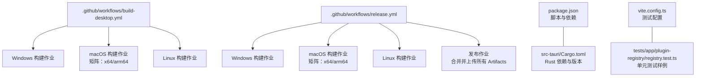
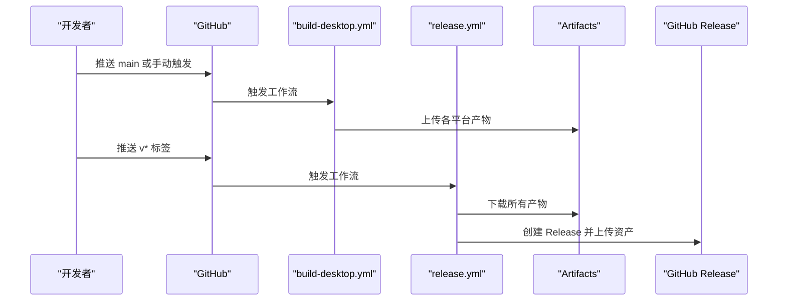
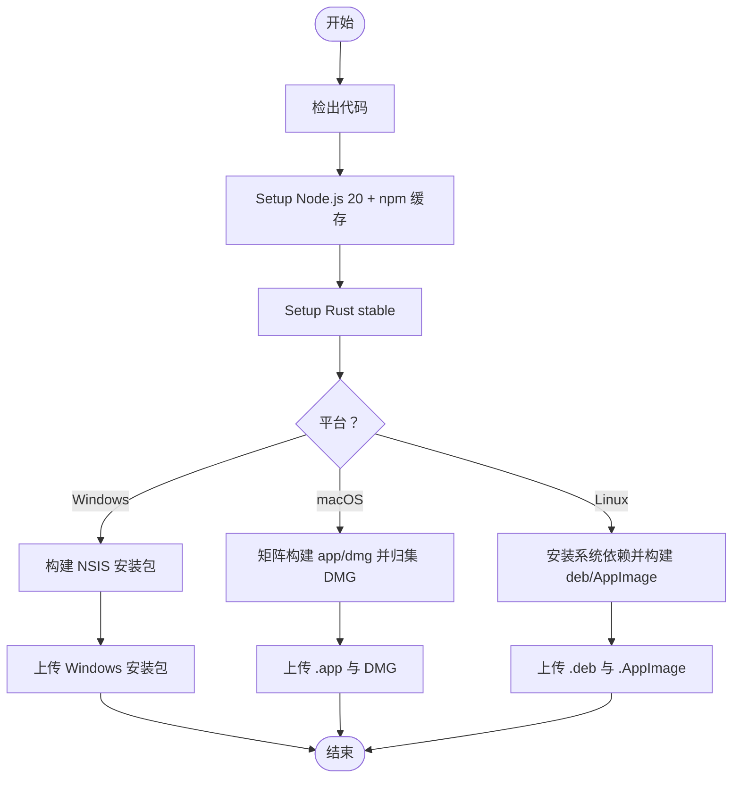
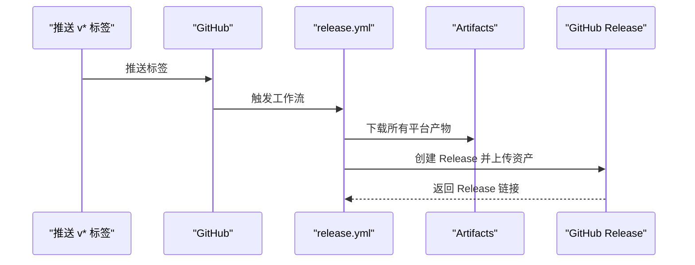
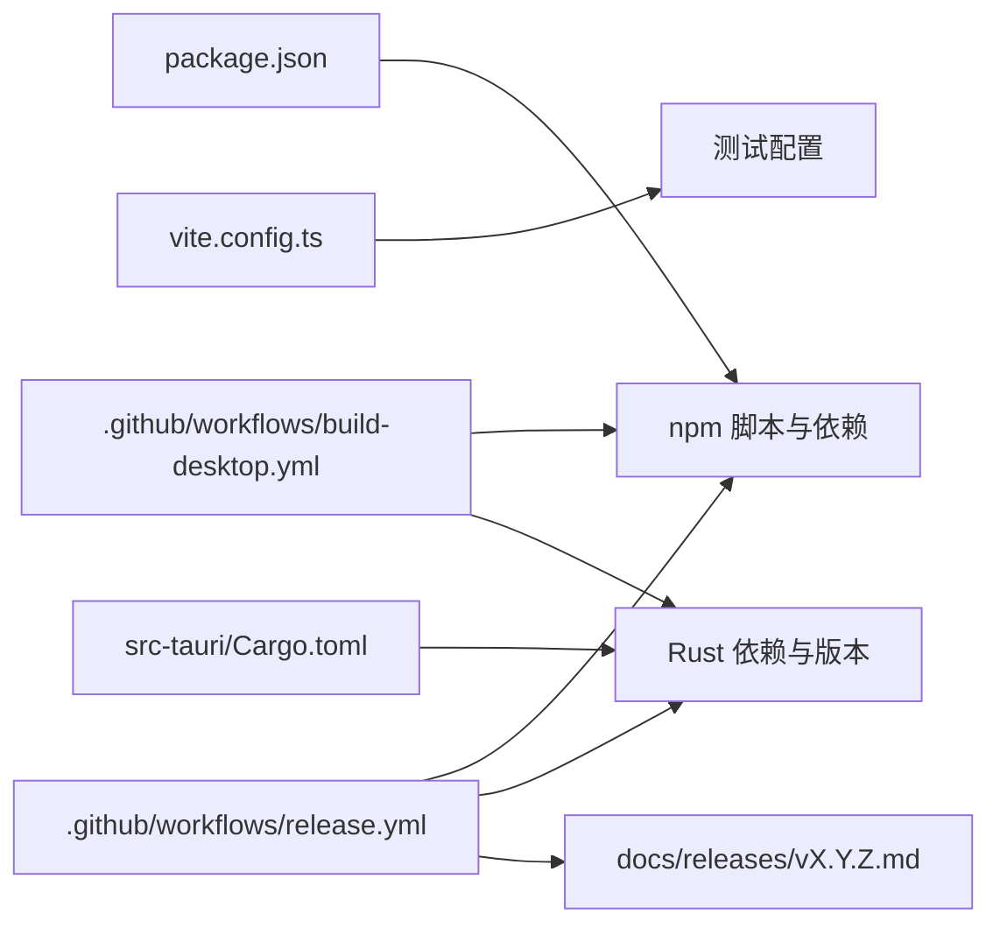

# CI/CD 工作流

<cite>
**本文引用的文件**
- [.github/workflows/build-desktop.yml](file://.github/workflows/build-desktop.yml)
- [.github/workflows/release.yml](file://.github/workflows/release.yml)
- [package.json](file://package.json)
- [src-tauri/Cargo.toml](file://src-tauri/Cargo.toml)
- [README.md](file://README.md)
- [vite.config.ts](file://vite.config.ts)
- [tests/app/plugin-registry/registry.test.ts](file://tests/app/plugin-registry/registry.test.ts)
- [docs/releases/v0.9.3.md](file://docs/releases/v0.9.3.md)
</cite>

## 目录
1. [简介](#简介)
2. [项目结构](#项目结构)
3. [核心组件](#核心组件)
4. [架构总览](#架构总览)
5. [详细组件分析](#详细组件分析)
6. [依赖关系分析](#依赖关系分析)
7. [性能考量](#性能考量)
8. [故障排除指南](#故障排除指南)
9. [结论](#结论)
10. [附录](#附录)

## 简介
本文件系统性梳理 DevNexus 的 GitHub Actions CI/CD 工作流，覆盖构建触发条件、环境准备、依赖安装、并行任务执行、自动化构建流程（含多平台并行构建与产物收集）、测试集成策略（单元测试与质量门禁）、发布流程自动化（版本标签识别、变更日志生成、发布资产上传与通知）、监控与故障排除（失败诊断、日志分析、重试策略），以及自定义工作流的最佳实践与性能优化建议。目标是帮助贡献者与维护者快速理解并高效维护该流水线。

## 项目结构
DevNexus 的 CI/CD 由两条工作流构成：
- build-desktop.yml：在推送到 main 分支或手动触发时，构建并上传各平台产物（Artifacts）。
- release.yml：在推送 v* 标签时触发，构建 Windows/macOS/Linux 产物并创建 GitHub Release，同时上传 Portable Windows 包。

图表来源
- [.github/workflows/build-desktop.yml:1-142](file://.github/workflows/build-desktop.yml#L1-L142)
- [.github/workflows/release.yml:1-178](file://.github/workflows/release.yml#L1-L178)
- [package.json:1-40](file://package.json#L1-L40)
- [src-tauri/Cargo.toml:1-48](file://src-tauri/Cargo.toml#L1-L48)
- [vite.config.ts:1-42](file://vite.config.ts#L1-L42)
- [tests/app/plugin-registry/registry.test.ts:1-40](file://tests/app/plugin-registry/registry.test.ts#L1-L40)

章节来源
- [.github/workflows/build-desktop.yml:1-142](file://.github/workflows/build-desktop.yml#L1-L142)
- [.github/workflows/release.yml:1-178](file://.github/workflows/release.yml#L1-L178)
- [README.md:160-177](file://README.md#L160-L177)

## 核心组件
- 触发器与权限
  - build-desktop.yml：手动触发与推送 main 分支触发；权限为 contents: read。
  - release.yml：推送 v* 标签触发；权限为 contents: write。
- 平台构建矩阵
  - macOS 使用矩阵并行构建 x64 与 arm64，分别指定 runner 与 target。
  - Windows 与 Linux 采用独立作业并行执行。
- 依赖与环境
  - Node.js 20 + npm ci 缓存；Rust stable 工具链；Linux 安装 GTK/Webkit 等系统依赖。
- 产物收集
  - Windows：NSIS 安装包。
  - macOS：.app 与 .dmg（按架构命名），并归集到 artifacts 目录。
  - Linux：.deb 与 .AppImage。
- 发布阶段
  - release.yml 在三平台构建完成后，统一下载并上传至 GitHub Release，并从 docs/releases 中读取变更日志。

章节来源
- [.github/workflows/build-desktop.yml:3-142](file://.github/workflows/build-desktop.yml#L3-L142)
- [.github/workflows/release.yml:3-178](file://.github/workflows/release.yml#L3-L178)
- [package.json:6-14](file://package.json#L6-L14)
- [src-tauri/Cargo.toml:1-48](file://src-tauri/Cargo.toml#L1-L48)

## 架构总览
下图展示两条工作流的总体交互与关键步骤。

图表来源
- [.github/workflows/build-desktop.yml:1-142](file://.github/workflows/build-desktop.yml#L1-L142)
- [.github/workflows/release.yml:1-178](file://.github/workflows/release.yml#L1-L178)

## 详细组件分析

### 构建触发与环境设置
- 触发条件
  - build-desktop.yml：workflow_dispatch 与 push: branches: [main]。
  - release.yml：push: tags: ["v*"]。
- 权限
  - build-desktop.yml：contents: read。
  - release.yml：contents: write。
- 环境准备
  - Node.js 20 + npm ci 缓存。
  - Rust stable 工具链；macOS 额外安装目标交叉编译工具链。
  - Linux 安装 WebKit/GTK/AppIndicator 等系统依赖。
- 并行策略
  - macOS 使用 strategy.matrix 并行构建 x64 与 arm64。
  - Windows、Linux 各自独立作业并行。

章节来源
- [.github/workflows/build-desktop.yml:3-142](file://.github/workflows/build-desktop.yml#L3-L142)
- [.github/workflows/release.yml:3-178](file://.github/workflows/release.yml#L3-L178)

### 自动化构建流程（代码检出、依赖缓存、多平台并行构建与产物收集）
- 代码检出
  - 所有作业均使用 actions/checkout@v4。
- 依赖缓存
  - Node.js 使用 actions/setup-node@v4 并启用 npm 缓存。
- 多平台并行构建
  - Windows：调用 npm run tauri build -- --bundles nsis。
  - macOS：矩阵构建，分别传入 --target 与 --bundles app,dmg；随后归集 DMG 至 artifacts/macos-{arch}/。
  - Linux：安装系统依赖后调用 npm run tauri build -- --bundles deb,appimage。
- 产物收集
  - 使用 actions/upload-artifact@v4 上传各平台产物，命名规范明确，便于发布阶段统一下载与上传。

图表来源
- [.github/workflows/build-desktop.yml:16-141](file://.github/workflows/build-desktop.yml#L16-L141)

章节来源
- [.github/workflows/build-desktop.yml:16-141](file://.github/workflows/build-desktop.yml#L16-L141)

### 测试集成策略（单元测试执行与质量门禁）
- 单元测试
  - package.json 定义了 test 脚本，Vitest 作为测试运行器。
  - vite.config.ts 指定测试目录 tests/**/*.test.ts。
  - tests/app/plugin-registry/registry.test.ts 展示了基础测试用法。
- 质量门禁
  - README.md 明确了发布前需执行的验证命令：npm test、npm run build、cd src-tauri && cargo check。
  - 当前工作流未在构建阶段直接执行 npm test，建议在构建作业中加入测试步骤以形成质量门禁。

章节来源
- [package.json:6-14](file://package.json#L6-L14)
- [vite.config.ts:16-18](file://vite.config.ts#L16-L18)
- [tests/app/plugin-registry/registry.test.ts:1-40](file://tests/app/plugin-registry/registry.test.ts#L1-L40)
- [README.md:307-317](file://README.md#L307-L317)

### 发布流程自动化（版本标签识别、变更日志生成、发布资产上传与通知）
- 版本标签识别
  - release.yml 通过 push: tags: ["v*"] 触发。
- 变更日志生成
  - release.yml 从 docs/releases/${{ github.ref_name }}.md 读取正文内容。
  - docs/releases/v0.9.3.md 展示了标准格式与验证清单。
- 发布资产上传
  - release.yml 在发布作业中下载所有 Artifacts，然后使用 softprops/action-gh-release@v2 上传至 GitHub Release。
  - Windows 产物包含 NSIS 安装包与 Portable ZIP；macOS 产物为归集后的 DMG；Linux 产物为 .deb 与 .AppImage。
- 通知机制
  - README.md 提及“通知机制”相关内容，但当前工作流未包含外部通知步骤。可在发布作业末尾增加通知步骤（如 Slack、邮件等）以完善闭环。

图表来源
- [.github/workflows/release.yml:151-178](file://.github/workflows/release.yml#L151-L178)
- [docs/releases/v0.9.3.md:1-20](file://docs/releases/v0.9.3.md#L1-L20)

章节来源
- [.github/workflows/release.yml:151-178](file://.github/workflows/release.yml#L151-L178)
- [docs/releases/v0.9.3.md:1-20](file://docs/releases/v0.9.3.md#L1-L20)
- [README.md:343-362](file://README.md#L343-L362)

### 并行任务与产物命名规范
- 并行策略
  - macOS 使用 strategy.fail-fast:false，确保一个架构失败不影响另一个架构的构建结果。
  - Windows 与 Linux 作为独立作业并行执行。
- 产物命名
  - Windows：DevNexus-windows-nsis。
  - macOS：DevNexus-macOS-{arch}-app 与 DevNexus-macOS-{arch}-dmg。
  - Linux：DevNexus-linux-appimage 与 DevNexus-linux-deb。
- 归集与上传
  - macOS DMG 通过脚本归集到 artifacts/macos-{arch}/，再统一上传，避免命名冲突。

章节来源
- [.github/workflows/build-desktop.yml:44-96](file://.github/workflows/build-desktop.yml#L44-L96)
- [.github/workflows/release.yml:65-110](file://.github/workflows/release.yml#L65-L110)

## 依赖关系分析
- Node 生态与前端构建
  - package.json 定义了 tauri、vitest、vite、react 等依赖与脚本。
  - vite.config.ts 指定测试目录与开发服务器端口等。
- Rust 生态与后端构建
  - src-tauri/Cargo.toml 定义了 Tauri 2、插件与第三方库依赖。
- 工作流对项目结构的依赖
  - 构建产物路径遵循 src-tauri/target/release/bundle/{nsis,app,dmg,deb,appimage}。
  - 变更日志路径遵循 docs/releases/vX.Y.Z.md。

图表来源
- [package.json:1-40](file://package.json#L1-L40)
- [vite.config.ts:1-42](file://vite.config.ts#L1-L42)
- [src-tauri/Cargo.toml:1-48](file://src-tauri/Cargo.toml#L1-L48)
- [.github/workflows/build-desktop.yml:1-142](file://.github/workflows/build-desktop.yml#L1-L142)
- [.github/workflows/release.yml:1-178](file://.github/workflows/release.yml#L1-L178)
- [docs/releases/v0.9.3.md:1-20](file://docs/releases/v0.9.3.md#L1-L20)

章节来源
- [package.json:1-40](file://package.json#L1-L40)
- [src-tauri/Cargo.toml:1-48](file://src-tauri/Cargo.toml#L1-L48)
- [.github/workflows/build-desktop.yml:1-142](file://.github/workflows/build-desktop.yml#L1-L142)
- [.github/workflows/release.yml:1-178](file://.github/workflows/release.yml#L1-L178)

## 性能考量
- 依赖缓存
  - actions/setup-node@v4 的 npm 缓存可显著减少依赖安装时间。
- 并行度
  - macOS 使用矩阵并行构建，Windows 与 Linux 各自独立作业，整体提升吞吐。
- 产物归集
  - macOS DMG 归集到 artifacts 目录，避免重复上传与命名冲突。
- 建议优化
  - 将 npm test 放入构建作业，形成质量门禁，避免无谓的发布。
  - 对大型依赖（如 Rust 交叉编译工具链）考虑缓存工具链或使用预构建镜像。
  - 在发布阶段增加校验步骤（如哈希校验、签名校验）以增强安全性。

[本节为通用性能建议，无需特定文件引用]

## 故障排除指南
- 构建失败诊断
  - 查看各平台作业日志，定位具体步骤（检出、依赖安装、构建、上传）。
  - macOS 架构差异：若某一架构失败，检查目标工具链与依赖是否匹配。
  - Linux 依赖缺失：确认系统依赖安装步骤是否成功。
- 日志分析
  - 使用 GitHub Actions 日志面板筛选错误堆栈与退出码。
  - 对于发布阶段，关注 action-gh-release 的文件匹配与上传状态。
- 重试策略
  - 对不稳定网络或偶发性依赖下载失败，可在失败步骤添加重试逻辑（例如使用 bash 循环 + set -e）。
  - 对于 macOS 交叉编译失败，可尝试更换 runner 或升级 dtolnay/rust-toolchain 版本。
- 常见问题
  - 变更日志文件不存在：确保 docs/releases/vX.Y.Z.md 存在且命名与标签一致。
  - 产物路径不匹配：核对 src-tauri/target/release/bundle 下的实际产物路径与工作流上传路径。

章节来源
- [.github/workflows/build-desktop.yml:1-142](file://.github/workflows/build-desktop.yml#L1-L142)
- [.github/workflows/release.yml:1-178](file://.github/workflows/release.yml#L1-L178)
- [README.md:343-362](file://README.md#L343-L362)

## 结论
DevNexus 的 CI/CD 工作流已具备完善的多平台并行构建与发布能力，通过明确的触发条件、环境准备与产物收集策略，实现了稳定的自动化交付。建议进一步将测试纳入构建门禁、完善通知机制与安全校验，以提升质量与可观测性。

[本节为总结，无需特定文件引用]

## 附录

### 最佳实践与性能优化建议
- 将 npm test 纳入构建作业，形成质量门禁。
- 在发布阶段增加变更日志校验与产物完整性校验。
- 使用更细粒度的日志与分步报告，便于定位问题。
- 对跨平台构建引入缓存策略（如 Rust 工具链缓存、apt 缓存）。
- 在发布作业中增加通知步骤（Slack、邮件等）。

[本节为通用建议，无需特定文件引用]