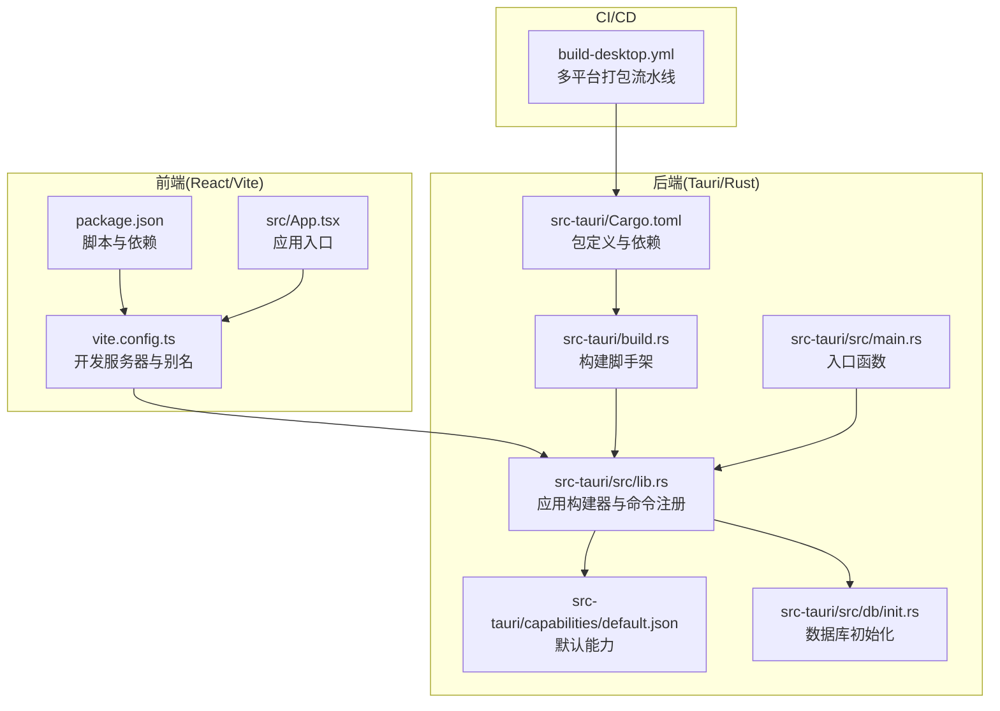
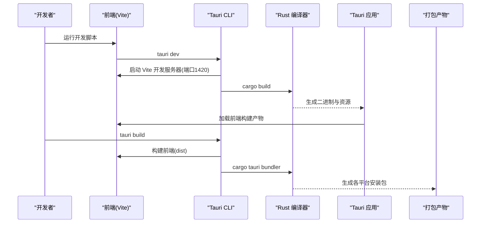
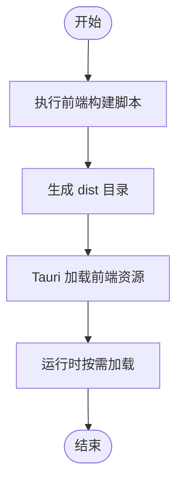
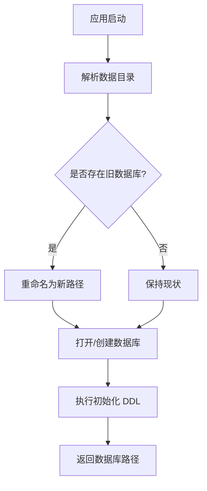
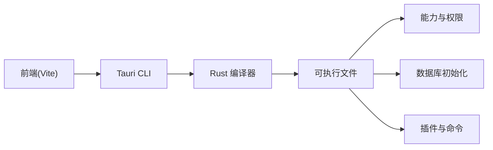

# Tauri 打包流程

<cite>
**本文引用的文件**
- [Cargo.toml](file://src-tauri/Cargo.toml)
- [tauri.conf.json](file://src-tauri/tauri.conf.json)
- [main.rs](file://src-tauri/src/main.rs)
- [lib.rs](file://src-tauri/src/lib.rs)
- [build.rs](file://src-tauri/build.rs)
- [default.json](file://src-tauri/capabilities/default.json)
- [build-desktop.yml](file://.github/workflows/build-desktop.yml)
- [package.json](file://package.json)
- [vite.config.ts](file://vite.config.ts)
- [init.rs](file://src-tauri/src/db/init.rs)
- [App.tsx](file://src/App.tsx)
</cite>

## 目录
1. [简介](#简介)
2. [项目结构](#项目结构)
3. [核心组件](#核心组件)
4. [架构总览](#架构总览)
5. [详细组件分析](#详细组件分析)
6. [依赖关系分析](#依赖关系分析)
7. [性能考虑](#性能考虑)
8. [故障排除指南](#故障排除指南)
9. [结论](#结论)
10. [附录](#附录)

## 简介
本文件面向 DevNexus 的 Tauri 打包流程，系统性阐述从 Rust 后端到前端资源的完整构建链路，涵盖 Cargo.toml 配置与依赖管理、Tauri 配置项、前端资源嵌入机制、原生能力与权限声明、原生依赖处理、构建产物结构以及优化与排错建议。文档以仓库现有配置为依据，避免臆测，确保读者能基于真实代码完成可复现的打包实践。

## 项目结构
DevNexus 采用典型的 Tauri 双端架构：前端位于根目录的 React/Vite 工程，后端位于 src-tauri 下的 Rust 工程；通过 Tauri CLI 在开发与生产阶段协调前后端资源与原生能力。

**图表来源**
- [package.json:1-40](file://package.json#L1-L40)
- [vite.config.ts:1-42](file://vite.config.ts#L1-L42)
- [App.tsx:1-11](file://src/App.tsx#L1-L11)
- [Cargo.toml:1-48](file://src-tauri/Cargo.toml#L1-L48)
- [build.rs:1-4](file://src-tauri/build.rs#L1-L4)
- [main.rs:1-7](file://src-tauri/src/main.rs#L1-L7)
- [lib.rs:1-250](file://src-tauri/src/lib.rs#L1-L250)
- [default.json:1-17](file://src-tauri/capabilities/default.json#L1-L17)
- [init.rs:1-363](file://src-tauri/src/db/init.rs#L1-L363)
- [build-desktop.yml:1-142](file://.github/workflows/build-desktop.yml#L1-L142)

**章节来源**
- [package.json:1-40](file://package.json#L1-L40)
- [vite.config.ts:1-42](file://vite.config.ts#L1-L42)
- [App.tsx:1-11](file://src/App.tsx#L1-L11)
- [Cargo.toml:1-48](file://src-tauri/Cargo.toml#L1-L48)
- [build.rs:1-4](file://src-tauri/build.rs#L1-L4)
- [main.rs:1-7](file://src-tauri/src/main.rs#L1-L7)
- [lib.rs:1-250](file://src-tauri/src/lib.rs#L1-L250)
- [default.json:1-17](file://src-tauri/capabilities/default.json#L1-L17)
- [init.rs:1-363](file://src-tauri/src/db/init.rs#L1-L363)
- [build-desktop.yml:1-142](file://.github/workflows/build-desktop.yml#L1-L142)

## 核心组件
- Rust 包与依赖管理：在 Cargo.toml 中定义包元信息、库类型、构建依赖与运行时依赖，包含 Tauri 框架、常用序列化库、数据库与网络相关 crate。
- Tauri 应用构建器：在 lib.rs 中使用 Builder 初始化插件、注册命令、设置窗口与安全策略，并在 main.rs 中调用 run() 启动应用。
- 前端工程：package.json 提供开发/构建脚本，vite.config.ts 配置固定端口、热更新与别名，React 应用入口由 App.tsx 组织。
- 能力与权限：capabilities/default.json 声明主窗口的能力范围与权限白名单，限制原生 API 使用。
- 数据层：db/init.rs 负责应用数据目录解析、数据库迁移与表结构初始化。
- CI/CD：GitHub Actions 流水线针对 Windows/macOS/Linux 分别安装系统依赖并执行打包。

**章节来源**
- [Cargo.toml:1-48](file://src-tauri/Cargo.toml#L1-L48)
- [lib.rs:1-250](file://src-tauri/src/lib.rs#L1-L250)
- [main.rs:1-7](file://src-tauri/src/main.rs#L1-L7)
- [package.json:1-40](file://package.json#L1-L40)
- [vite.config.ts:1-42](file://vite.config.ts#L1-L42)
- [App.tsx:1-11](file://src/App.tsx#L1-L11)
- [default.json:1-17](file://src-tauri/capabilities/default.json#L1-L17)
- [init.rs:1-363](file://src-tauri/src/db/init.rs#L1-L363)
- [build-desktop.yml:1-142](file://.github/workflows/build-desktop.yml#L1-L142)

## 架构总览
下图展示从开发到打包的关键交互：前端通过 Vite 开发服务器提供页面，Tauri 在启动时注入前端构建产物并建立 IPC 通道；构建阶段由 Tauri CLI 调用 Rust 编译器与前端构建工具，最终生成各平台安装包。

**图表来源**
- [vite.config.ts:20-41](file://vite.config.ts#L20-L41)
- [tauri.conf.json:6-11](file://src-tauri/tauri.conf.json#L6-L11)
- [package.json:6-13](file://package.json#L6-L13)
- [build-desktop.yml:31-32](file://.github/workflows/build-desktop.yml#L31-L32)

**章节来源**
- [vite.config.ts:20-41](file://vite.config.ts#L20-L41)
- [tauri.conf.json:6-11](file://src-tauri/tauri.conf.json#L6-L11)
- [package.json:6-13](file://package.json#L6-L13)
- [build-desktop.yml:31-32](file://.github/workflows/build-desktop.yml#L31-L32)

## 详细组件分析

### Rust 后端编译与 Cargo.toml 配置
- 包元信息与库类型：包名为 devnexus，定义了静态库、动态库与 rlib 多种输出类型，便于跨平台与插件集成。
- 构建依赖：tauri-build 用于在构建时生成权限与命令清单，确保运行期安全。
- 运行时依赖：包含 Tauri 核心、对话框与打开器插件、JSON 序列化、加密与时间戳、数据库驱动、SSH 客户端、AWS SDK、MongoDB、MySQL 异步驱动、消息队列客户端等。
- 特性开关：部分依赖启用特定特性（如 rusqlite 的捆绑特性），以减少运行时对系统库的依赖。

**章节来源**
- [Cargo.toml:1-48](file://src-tauri/Cargo.toml#L1-L48)

### Tauri 配置文件（tauri.conf.json）
- 应用元数据：产品名称、版本号、标识符与 schema 版本。
- 开发与构建：beforeDevCommand 指向前端 dev 脚本，devUrl 固定为 1420；beforeBuildCommand 指向前端 build；frontendDist 指向 dist 目录。
- 窗口配置：主窗口标题、尺寸、最小尺寸与无装饰风格。
- 安全策略：CSP 设为 null，表示不强制 CSP。
- 打包配置：开启打包、targets 为 all，指定多分辨率图标集。

**章节来源**
- [tauri.conf.json:1-39](file://src-tauri/tauri.conf.json#L1-L39)

### 前端资源嵌入与运行时加载
- Vite 配置：固定端口 1420、严格端口模式、可选主机地址与 HMR 设置；忽略 src-tauri 目录监听；测试范围限定在 tests。
- 前端入口：App.tsx 作为 React 根组件包裹 Ant Design 应用外壳。
- 构建产物：package.json 的 build 脚本先执行 TypeScript 编译再进行 Vite 构建，输出至 dist，供 Tauri 在打包时嵌入。

**图表来源**
- [package.json](file://package.json#L8)
- [vite.config.ts:20-41](file://vite.config.ts#L20-L41)
- [tauri.conf.json:9-11](file://src-tauri/tauri.conf.json#L9-L11)
- [App.tsx:1-11](file://src/App.tsx#L1-L11)

**章节来源**
- [package.json](file://package.json#L8)
- [vite.config.ts:20-41](file://vite.config.ts#L20-L41)
- [tauri.conf.json:9-11](file://src-tauri/tauri.conf.json#L9-L11)
- [App.tsx:1-11](file://src/App.tsx#L1-L11)

### 原生能力与权限声明
- 默认能力：default.json 声明主窗口权限，包含窗口基本操作（最小化、最大化、拖拽、关闭）、打开器与对话框插件的默认权限。
- 权限生成：构建时由 tauri-build 自动生成命令级权限清单，确保仅暴露受控 API。

**章节来源**
- [default.json:1-17](file://src-tauri/capabilities/default.json#L1-L17)

### 原生依赖处理与数据库初始化
- 文件系统与路径：db/init.rs 通过 tauri::path 解析应用数据目录，确保跨平台一致的数据位置。
- 数据库迁移：若检测到旧数据库文件，自动重命名迁移至新路径，保证用户数据连续性。
- 表结构初始化：一次性执行大量 DDL，覆盖连接管理、查询历史、SSH、S3、MongoDB、MySQL、网络诊断、消息队列、局域聊天等业务表。

**图表来源**
- [init.rs:28-362](file://src-tauri/src/db/init.rs#L28-L362)

**章节来源**
- [init.rs:1-363](file://src-tauri/src/db/init.rs#L1-L363)

### 构建产物结构与打包目标
- Windows：NSIS 安装程序，产物位于 src-tauri/target/release/bundle/nsis/*.exe。
- macOS：同时产出 .app 与 .dmg，支持 x86_64 与 aarch64，产物路径包含目标三元组与架构后缀。
- Linux：DEB 与 AppImage，产物位于对应 bundle 目录。
- 产物组成：可执行文件、嵌入的前端资源、图标与平台特定资源。

**章节来源**
- [build-desktop.yml:31-38](file://.github/workflows/build-desktop.yml#L31-L38)
- [build-desktop.yml:72-95](file://.github/workflows/build-desktop.yml#L72-L95)
- [build-desktop.yml:126-141](file://.github/workflows/build-desktop.yml#L126-L141)

## 依赖关系分析
- 前端到后端：Vite 开发服务器与 Tauri CLI 协同，通过固定端口与 HMR 实现热更新；构建阶段由 Tauri CLI 触发前端构建并将 dist 注入。
- 后端到原生：lib.rs 中集中注册命令与插件，main.rs 仅负责启动；db/init.rs 作为应用初始化的一部分被 setup 钩子调用。
- 能力到命令：capabilities/default.json 限定可用权限，tauri-build 在构建时生成命令级权限清单，运行期仅允许白名单内的调用。

**图表来源**
- [vite.config.ts:20-41](file://vite.config.ts#L20-L41)
- [tauri.conf.json:6-11](file://src-tauri/tauri.conf.json#L6-L11)
- [lib.rs:10-249](file://src-tauri/src/lib.rs#L10-L249)
- [default.json:1-17](file://src-tauri/capabilities/default.json#L1-L17)
- [init.rs:28-362](file://src-tauri/src/db/init.rs#L28-L362)

**章节来源**
- [vite.config.ts:20-41](file://vite.config.ts#L20-L41)
- [tauri.conf.json:6-11](file://src-tauri/tauri.conf.json#L6-L11)
- [lib.rs:10-249](file://src-tauri/src/lib.rs#L10-L249)
- [default.json:1-17](file://src-tauri/capabilities/default.json#L1-L17)
- [init.rs:28-362](file://src-tauri/src/db/init.rs#L28-L362)

## 性能考虑
- 构建优化
  - 将前端构建与 Rust 构建分离，利用缓存与增量编译提升效率。
  - 在 CI 中按平台并行执行，缩短整体构建时间。
- 运行时优化
  - 通过 capabilities 限制权限，减少不必要的系统调用开销。
  - 数据库初始化采用批量 DDL，降低多次往返成本。
- 资源优化
  - 前端资源统一由 dist 输出，避免重复打包与冗余文件。

[本节为通用指导，无需列出具体文件来源]

## 故障排除指南
- 开发端口冲突
  - 现象：Vite 启动失败或 HMR 不生效。
  - 排查：确认端口 1420 未被占用，检查 strictPort 与 host 配置。
  - 参考
    - [vite.config.ts:24-29](file://vite.config.ts#L24-L29)
- 打包目标缺失
  - 现象：Linux 打包失败或缺少系统依赖。
  - 排查：安装 WebKit、GTK、AppIndicator、SVG、CURL 与 patchelf。
  - 参考
    - [build-desktop.yml:112-121](file://.github/workflows/build-desktop.yml#L112-L121)
- 前端资源未嵌入
  - 现象：应用启动白屏或资源 404。
  - 排查：确认 beforeBuildCommand 与 frontendDist 正确指向 dist；检查 dist 是否存在。
  - 参考
    - [tauri.conf.json:9-11](file://src-tauri/tauri.conf.json#L9-L11)
    - [package.json](file://package.json#L8)
- 权限不足导致功能异常
  - 现象：窗口控制、打开外部链接或对话框失败。
  - 排查：核对 capabilities/default.json 中的权限声明是否包含所需能力。
  - 参考
    - [default.json:6-15](file://src-tauri/capabilities/default.json#L6-L15)
- 数据库迁移失败
  - 现象：启动时报错或数据丢失。
  - 排查：检查数据目录权限、旧文件是否存在、重命名是否成功。
  - 参考
    - [init.rs:21-24](file://src-tauri/src/db/init.rs#L21-L24)

**章节来源**
- [vite.config.ts:24-29](file://vite.config.ts#L24-L29)
- [build-desktop.yml:112-121](file://.github/workflows/build-desktop.yml#L112-L121)
- [tauri.conf.json:9-11](file://src-tauri/tauri.conf.json#L9-L11)
- [package.json](file://package.json#L8)
- [default.json:6-15](file://src-tauri/capabilities/default.json#L6-L15)
- [init.rs:21-24](file://src-tauri/src/db/init.rs#L21-L24)

## 结论
DevNexus 的 Tauri 打包流程以清晰的前后端分工为基础：前端通过 Vite 快速迭代，后端通过 Tauri CLI 与 Cargo 完成跨平台打包。借助 capabilities 权限体系与数据库初始化逻辑，应用在安全性与数据一致性方面具备良好基础。结合 CI 并行流水线，可高效产出 Windows、macOS 与 Linux 的安装包。建议在后续版本中持续完善权限最小化与资源体积优化策略。

[本节为总结性内容，无需列出具体文件来源]

## 附录
- 关键配置要点速览
  - 前端：固定端口 1420、严格端口、HMR 主机可选、忽略 src-tauri 监听。
  - 后端：tauri-build 构建、命令集中注册、macOS 窗口装饰条件开启。
  - 打包：targets=all，Windows NSIS、macOS app/dmg、Linux deb/appimage。
- 建议的扩展方向
  - 引入更细粒度的能力分组，按插件维度拆分权限。
  - 对 dist 资源进行压缩与缓存策略优化。
  - 在 CI 中增加签名与发布步骤。

[本节为补充说明，无需列出具体文件来源]