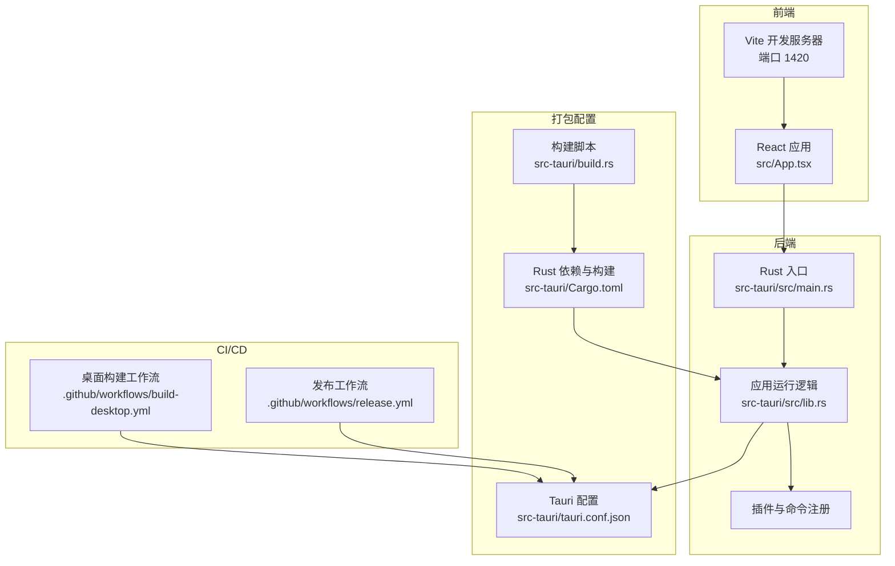
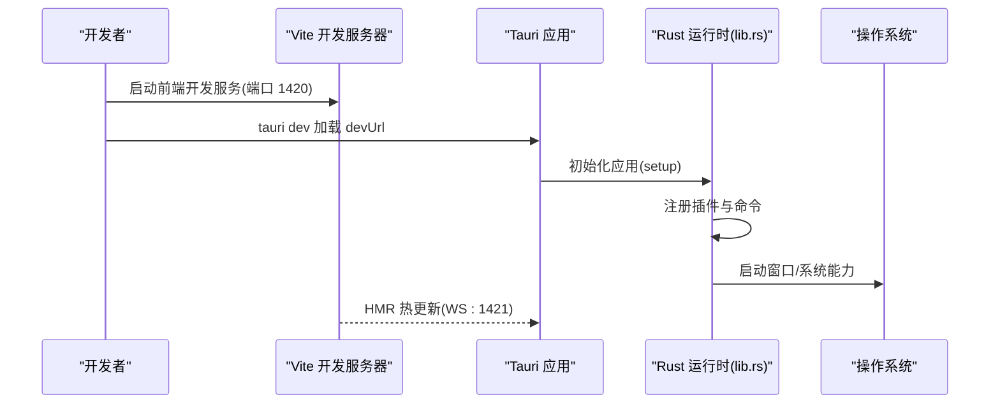
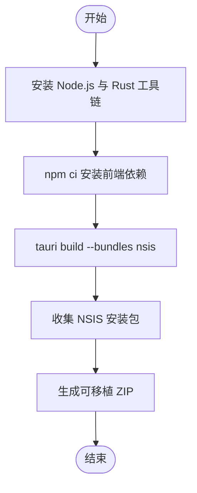
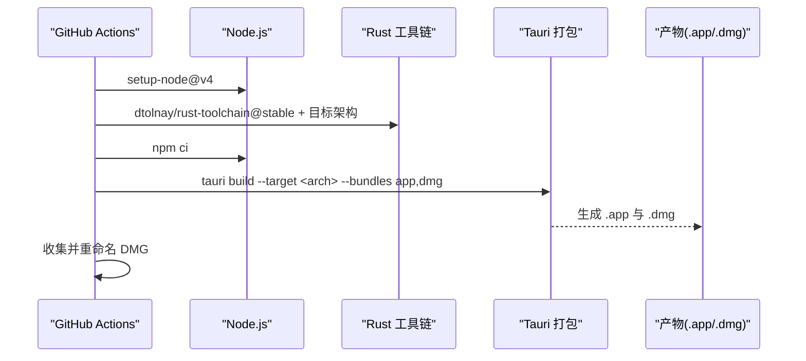
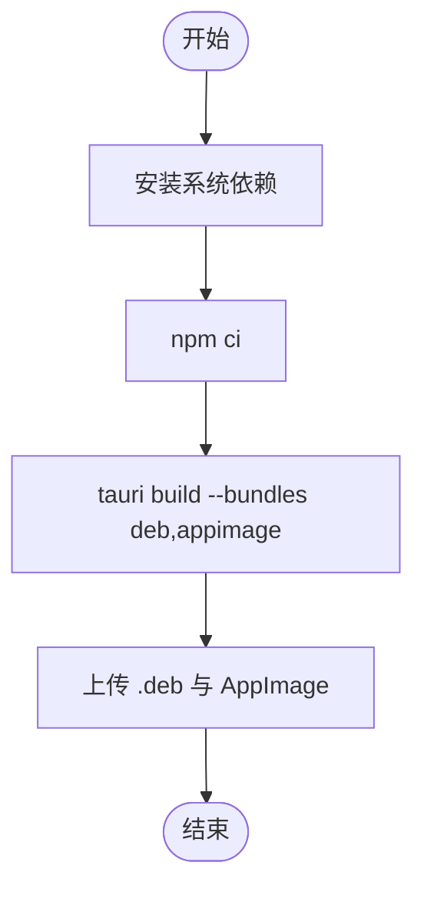
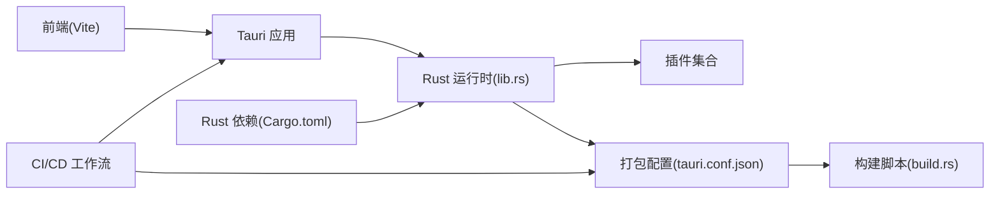

# 多平台构建

<cite>
**本文引用的文件**
- [package.json](file://package.json)
- [vite.config.ts](file://vite.config.ts)
- [tauri.conf.json](file://src-tauri/tauri.conf.json)
- [Cargo.toml](file://src-tauri/Cargo.toml)
- [build.rs](file://src-tauri/build.rs)
- [main.rs](file://src-tauri/src/main.rs)
- [lib.rs](file://src-tauri/src/lib.rs)
- [default.json](file://src-tauri/capabilities/default.json)
- [build-desktop.yml](file://.github/workflows/build-desktop.yml)
- [release.yml](file://.github/workflows/release.yml)
- [App.tsx](file://src/App.tsx)
</cite>

## 目录
1. [简介](#简介)
2. [项目结构](#项目结构)
3. [核心组件](#核心组件)
4. [架构总览](#架构总览)
5. [详细组件分析](#详细组件分析)
6. [依赖关系分析](#依赖关系分析)
7. [性能考量](#性能考量)
8. [故障排查指南](#故障排查指南)
9. [结论](#结论)
10. [附录](#附录)

## 简介
本指南面向 DevNexus 的多平台桌面应用构建，基于 Tauri 2 技术栈与 Vite 前端工程，覆盖 Windows（NSIS 安装包）、macOS（.app/.dmg、代码签名与公证）与 Linux（.deb、AppImage）的完整构建流程与平台差异。文档同时提供开发环境配置、调试技巧、跨平台兼容性测试方法以及常见问题的解决方案。

## 项目结构
DevNexus 采用“前端 + Rust 后端 + Tauri 打包”的分层架构：
- 前端：React + Vite，开发时通过固定端口启动，Tauri 在 dev 模式下加载 devUrl。
- 后端：Rust 应用入口在 main.rs 中调用 lib.rs 的 run 函数，注册插件与命令。
- 打包：Tauri 配置集中于 src-tauri/tauri.conf.json，定义窗口、安全策略、打包目标与图标等。
- 工作流：GitHub Actions 提供跨平台构建与发布流水线，分别支持日常构建与发布版本。

图表来源
- [vite.config.ts:1-42](file://vite.config.ts#L1-L42)
- [main.rs:1-7](file://src-tauri/src/main.rs#L1-L7)
- [lib.rs:1-250](file://src-tauri/src/lib.rs#L1-L250)
- [tauri.conf.json:1-39](file://src-tauri/tauri.conf.json#L1-L39)
- [Cargo.toml:1-48](file://src-tauri/Cargo.toml#L1-L48)
- [build.rs:1-4](file://src-tauri/build.rs#L1-L4)
- [build-desktop.yml:1-142](file://.github/workflows/build-desktop.yml#L1-L142)
- [release.yml:1-178](file://.github/workflows/release.yml#L1-L178)

章节来源
- [package.json:1-40](file://package.json#L1-L40)
- [vite.config.ts:1-42](file://vite.config.ts#L1-L42)
- [tauri.conf.json:1-39](file://src-tauri/tauri.conf.json#L1-L39)
- [Cargo.toml:1-48](file://src-tauri/Cargo.toml#L1-L48)
- [build.rs:1-4](file://src-tauri/build.rs#L1-L4)
- [main.rs:1-7](file://src-tauri/src/main.rs#L1-L7)
- [lib.rs:1-250](file://src-tauri/src/lib.rs#L1-L250)
- [build-desktop.yml:1-142](file://.github/workflows/build-desktop.yml#L1-L142)
- [release.yml:1-178](file://.github/workflows/release.yml#L1-L178)
- [App.tsx:1-11](file://src/App.tsx#L1-L11)

## 核心组件
- 构建脚本与工具链
  - 前端构建：使用 Vite，开发端口固定为 1420，严格端口模式，避免冲突。
  - CLI 脚本：package.json 中提供 tauri 命令，用于本地开发与打包。
- 打包配置
  - Tauri 配置：定义产品名、版本、标识符、窗口属性、安全策略（CSP）、打包目标与图标集。
  - 图标：包含 PNG、ICNS、ICO 多尺寸图标，满足不同平台需求。
- Rust 运行时
  - 入口函数：Windows 发布版隐藏控制台；主运行函数注册插件与大量命令。
  - 插件：对话框、系统打开器等基础能力；数据库初始化与日志记录。
- CI/CD
  - 日常构建：Windows（NSIS）、macOS（x64/arm64，.app/.dmg）、Linux（deb、AppImage）。
  - 发布：按平台收集产物并上传到 GitHub Release。

章节来源
- [package.json:6-14](file://package.json#L6-L14)
- [vite.config.ts:20-41](file://vite.config.ts#L20-L41)
- [tauri.conf.json:1-39](file://src-tauri/tauri.conf.json#L1-L39)
- [main.rs:1-7](file://src-tauri/src/main.rs#L1-L7)
- [lib.rs:10-250](file://src-tauri/src/lib.rs#L10-L250)
- [build-desktop.yml:13-142](file://.github/workflows/build-desktop.yml#L13-L142)
- [release.yml:12-178](file://.github/workflows/release.yml#L12-L178)

## 架构总览
DevNexus 的构建与运行由前端、后端与打包配置协同完成。前端通过固定端口与 Tauri devUrl 对接，后端在 lib.rs 中统一注册插件与命令，Tauri 配置决定打包目标与图标资源，CI/CD 负责跨平台产出物收集与发布。

图表来源
- [vite.config.ts:25-35](file://vite.config.ts#L25-L35)
- [tauri.conf.json:6-11](file://src-tauri/tauri.conf.json#L6-L11)
- [lib.rs:14-24](file://src-tauri/src/lib.rs#L14-L24)

章节来源
- [vite.config.ts:1-42](file://vite.config.ts#L1-L42)
- [tauri.conf.json:1-39](file://src-tauri/tauri.conf.json#L1-L39)
- [lib.rs:1-250](file://src-tauri/src/lib.rs#L1-L250)

## 详细组件分析

### Windows 平台构建（NSIS 安装包）
- 构建目标与命令
  - 使用 GitHub Actions 在 windows-latest 上执行 npm run tauri build -- --bundles nsis。
  - 产物位于 src-tauri/target/release/bundle/nsis/*.exe。
- 安装包生成
  - NSIS 作为 Tauri 目标之一，自动打包可执行程序与依赖。
- 图标与资源
  - tauri.conf.json 中已配置多尺寸图标，确保安装器与桌面图标一致。
- 数字签名与系统集成
  - 当前仓库未包含签名配置与证书注入步骤；建议在企业或发布环境中引入 SignTool 与代码签名工件。
  - 系统集成可通过 Windows 权限与文件关联策略实现，需结合具体需求在打包阶段配置。
- 可移植版本
  - 发布工作流中包含可移植 ZIP 生成步骤，便于无安装场景分发。

图表来源
- [build-desktop.yml:13-40](file://.github/workflows/build-desktop.yml#L13-L40)
- [release.yml:12-61](file://.github/workflows/release.yml#L12-L61)

章节来源
- [build-desktop.yml:13-40](file://.github/workflows/build-desktop.yml#L13-L40)
- [release.yml:12-61](file://.github/workflows/release.yml#L12-L61)
- [tauri.conf.json:27-37](file://src-tauri/tauri.conf.json#L27-L37)

### macOS 平台构建（.app/.dmg、代码签名与公证）
- 多架构支持
  - x64 使用 macos-15-intel runner，arm64 使用 macos-latest runner。
  - 目标分别为 x86_64-apple-darwin 与 aarch64-apple-darwin。
- 构建命令
  - 使用 tauri build -- --target <arch> --bundles app,dmg 生成 .app 与 .dmg。
- DMG 收集与命名
  - 将产物重命名为包含架构后缀，便于区分与归档。
- 代码签名与公证
  - 当前仓库未包含签名与公证步骤；建议在 CI 中注入 Apple 证书与团队信息，并启用 notarization。
- App Store 分发准备
  - 若计划上架 App Store Connect，需遵循 Apple 的分发要求，包括 Info.plist、权限声明与审核所需元数据。

图表来源
- [build-desktop.yml:41-96](file://.github/workflows/build-desktop.yml#L41-L96)
- [release.yml:62-110](file://.github/workflows/release.yml#L62-L110)

章节来源
- [build-desktop.yml:41-96](file://.github/workflows/build-desktop.yml#L41-L96)
- [release.yml:62-110](file://.github/workflows/release.yml#L62-L110)

### Linux 平台构建（.deb、AppImage）
- 系统依赖
  - Ubuntu 22.04 Runner 安装 WebKit、GTK、AppIndicator、SVG、cURL 与 patchelf 等依赖。
- 构建命令
  - 使用 tauri build -- --bundles deb,appimage 生成 .deb 与 AppImage。
- 包管理器集成
  - .deb 可直接分发至 Debian/Ubuntu 用户；AppImage 则提供便携式体验。
- 依赖处理
  - patchelf 用于修复 AppImage 运行时链接问题；WebKit/GTK 保证 WebView 正常渲染。

图表来源
- [build-desktop.yml:97-142](file://.github/workflows/build-desktop.yml#L97-L142)
- [release.yml:111-149](file://.github/workflows/release.yml#L111-L149)

章节来源
- [build-desktop.yml:97-142](file://.github/workflows/build-desktop.yml#L97-L142)
- [release.yml:111-149](file://.github/workflows/release.yml#L111-L149)

### 平台特定配置与差异
- 权限与窗口装饰
  - macOS 在 setup 中开启窗口装饰；Windows 发布版隐藏控制台。
- 窗口与安全策略
  - tauri.conf.json 中定义窗口尺寸、最小尺寸与装饰开关；安全策略允许 CSP 为空（开发用途）。
- 能力与权限
  - capabilities/default.json 为默认窗口分配核心权限与系统打开器、对话框能力。

章节来源
- [lib.rs:14-18](file://src-tauri/src/lib.rs#L14-L18)
- [main.rs:1-7](file://src-tauri/src/main.rs#L1-L7)
- [tauri.conf.json:12-26](file://src-tauri/tauri.conf.json#L12-L26)
- [default.json:1-17](file://src-tauri/capabilities/default.json#L1-L17)

### 开发环境配置与调试技巧
- 前端开发
  - 固定端口 1420，严格端口模式；HMR 使用 WS:1421；忽略 src-tauri 目录监听。
- Tauri 开发
  - 使用 npm run tauri dev 或直接 tauri dev；devUrl 指向 http://localhost:1420。
- 调试要点
  - 关注窗口初始化与插件注册；通过 dev_log 记录应用生命周期事件。
  - 如遇 WebView 渲染异常，检查 GTK/WebKit 依赖是否齐全（Linux）。

章节来源
- [vite.config.ts:20-41](file://vite.config.ts#L20-L41)
- [tauri.conf.json:6-11](file://src-tauri/tauri.conf.json#L6-L11)
- [lib.rs:20-24](file://src-tauri/src/lib.rs#L20-L24)

### 跨平台兼容性测试与问题解决
- 测试方法
  - 在 Windows、macOS 与 Linux 上分别运行 .exe/.app/.deb/AppImage，验证窗口、菜单、文件操作与网络功能。
  - 使用不同分辨率与缩放比例测试窗口适配。
- 常见问题
  - 端口占用：确认 1420/1421 未被占用；必要时调整 host 或关闭冲突进程。
  - Linux 运行时缺失：确保已安装 WebKit/GTK/AppIndicator 等依赖。
  - macOS 签名失败：检查证书与团队信息注入；公证失败时查看 Apple Notary Tool 输出。
  - 图标不显示：核对 tauri.conf.json 中 icon 列表与实际资源路径。

章节来源
- [vite.config.ts:25-35](file://vite.config.ts#L25-L35)
- [build-desktop.yml:112-121](file://.github/workflows/build-desktop.yml#L112-L121)
- [tauri.conf.json:27-37](file://src-tauri/tauri.conf.json#L27-L37)

## 依赖关系分析
- 组件耦合
  - 前端通过固定端口与 Tauri devUrl 通信；Rust 运行时负责窗口与系统能力；打包配置决定最终产物类型。
- 外部依赖
  - Rust 侧包含 Tauri、对话框、系统打开器、数据库、加密、网络与 AWS/MQ 等生态库。
- CI 依赖
  - Actions 使用 setup-node、dtolnay/rust-toolchain、upload-artifact 等标准动作。

图表来源
- [lib.rs:1-250](file://src-tauri/src/lib.rs#L1-L250)
- [tauri.conf.json:1-39](file://src-tauri/tauri.conf.json#L1-L39)
- [build.rs:1-4](file://src-tauri/build.rs#L1-L4)
- [Cargo.toml:1-48](file://src-tauri/Cargo.toml#L1-L48)
- [build-desktop.yml:1-142](file://.github/workflows/build-desktop.yml#L1-L142)
- [release.yml:1-178](file://.github/workflows/release.yml#L1-L178)

章节来源
- [lib.rs:1-250](file://src-tauri/src/lib.rs#L1-L250)
- [tauri.conf.json:1-39](file://src-tauri/tauri.conf.json#L1-L39)
- [Cargo.toml:1-48](file://src-tauri/Cargo.toml#L1-L48)
- [build.rs:1-4](file://src-tauri/build.rs#L1-L4)
- [build-desktop.yml:1-142](file://.github/workflows/build-desktop.yml#L1-L142)
- [release.yml:1-178](file://.github/workflows/release.yml#L1-L178)

## 性能考量
- 构建性能
  - 使用 npm ci 缓存依赖，减少重复安装时间。
  - 并行化多架构 macOS 构建矩阵，缩短整体耗时。
- 运行性能
  - 合理设置窗口最小尺寸与装饰开关，平衡可用性与资源占用。
  - 控制插件数量与命令调用频率，避免主线程阻塞。

## 故障排查指南
- 端口冲突
  - 确认 1420/1421 未被占用；必要时更换 host 或关闭占用进程。
- 依赖缺失
  - Linux 忘记安装 WebKit/GTK/AppIndicator 导致 WebView 异常；按工作流安装清单补齐。
- 打包失败
  - 检查 tauri.conf.json 中 icon 路径与文件是否存在；确认目标架构与工具链匹配。
- CI 失败
  - 查看对应作业日志中的错误堆栈；优先解决依赖安装与签名/公证环节。

章节来源
- [vite.config.ts:25-35](file://vite.config.ts#L25-L35)
- [build-desktop.yml:112-121](file://.github/workflows/build-desktop.yml#L112-L121)
- [tauri.conf.json:27-37](file://src-tauri/tauri.conf.json#L27-L37)

## 结论
DevNexus 的多平台构建以 Tauri 为核心，结合 Vite 前端与 Rust 后端，形成稳定的跨平台桌面应用方案。通过 GitHub Actions 实现自动化构建与发布，覆盖 Windows、macOS 与 Linux 主要发行渠道。建议在企业或正式发布场景中补充代码签名与公证流程，并完善平台特定的权限与系统 API 集成。

## 附录
- 快速开始
  - 安装 Node.js 与 Rust 工具链；执行 npm ci；使用 npm run tauri dev 进行开发。
- 常用命令
  - 开发：npm run tauri dev
  - 构建：npm run tauri build
  - 指定目标：npm run tauri build -- --target <arch> --bundles <type>
- 参考文件
  - [package.json](file://package.json)
  - [vite.config.ts](file://vite.config.ts)
  - [tauri.conf.json](file://src-tauri/tauri.conf.json)
  - [Cargo.toml](file://src-tauri/Cargo.toml)
  - [build.rs](file://src-tauri/build.rs)
  - [main.rs](file://src-tauri/src/main.rs)
  - [lib.rs](file://src-tauri/src/lib.rs)
  - [default.json](file://src-tauri/capabilities/default.json)
  - [build-desktop.yml](file://.github/workflows/build-desktop.yml)
  - [release.yml](file://.github/workflows/release.yml)
  - [App.tsx](file://src/App.tsx)