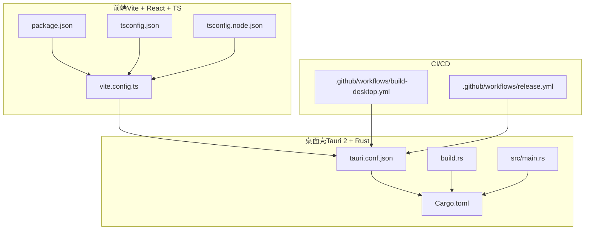
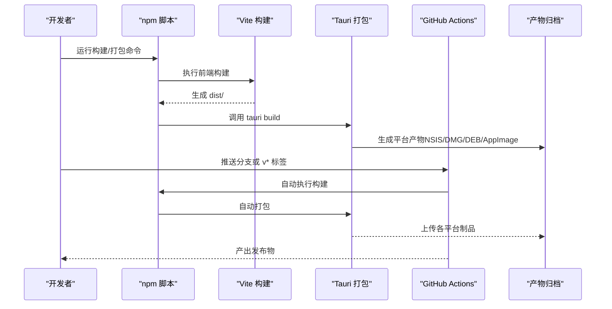
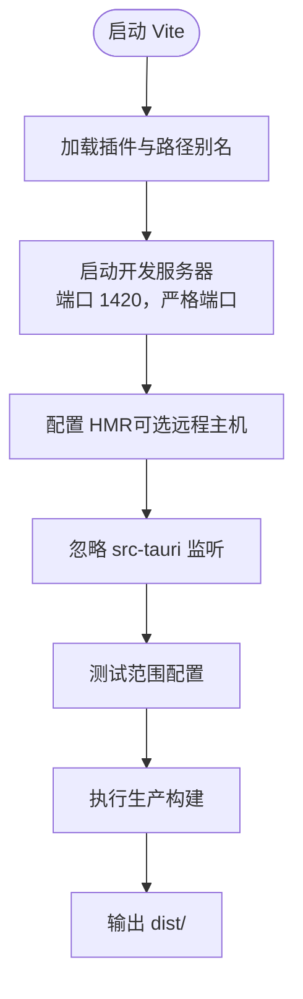
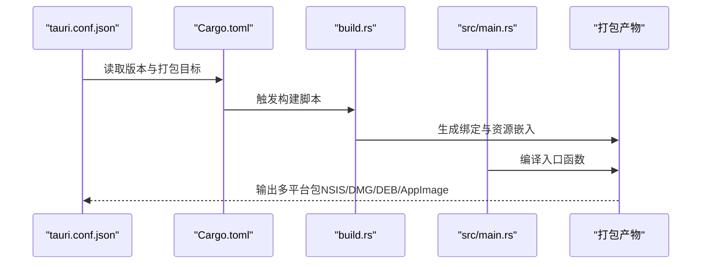
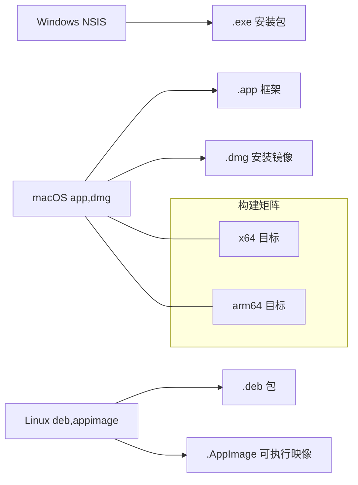
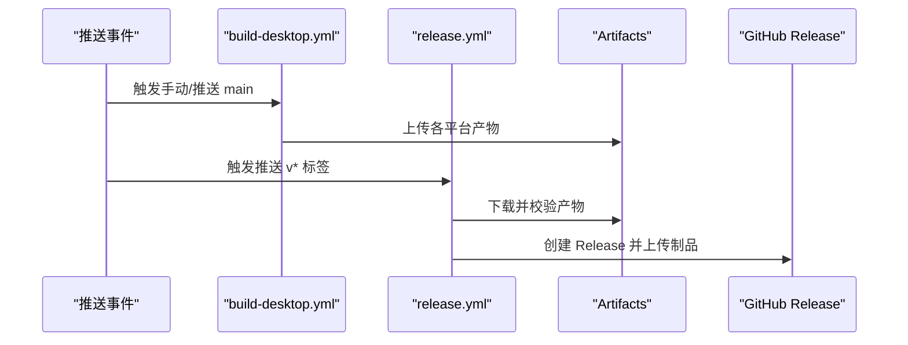
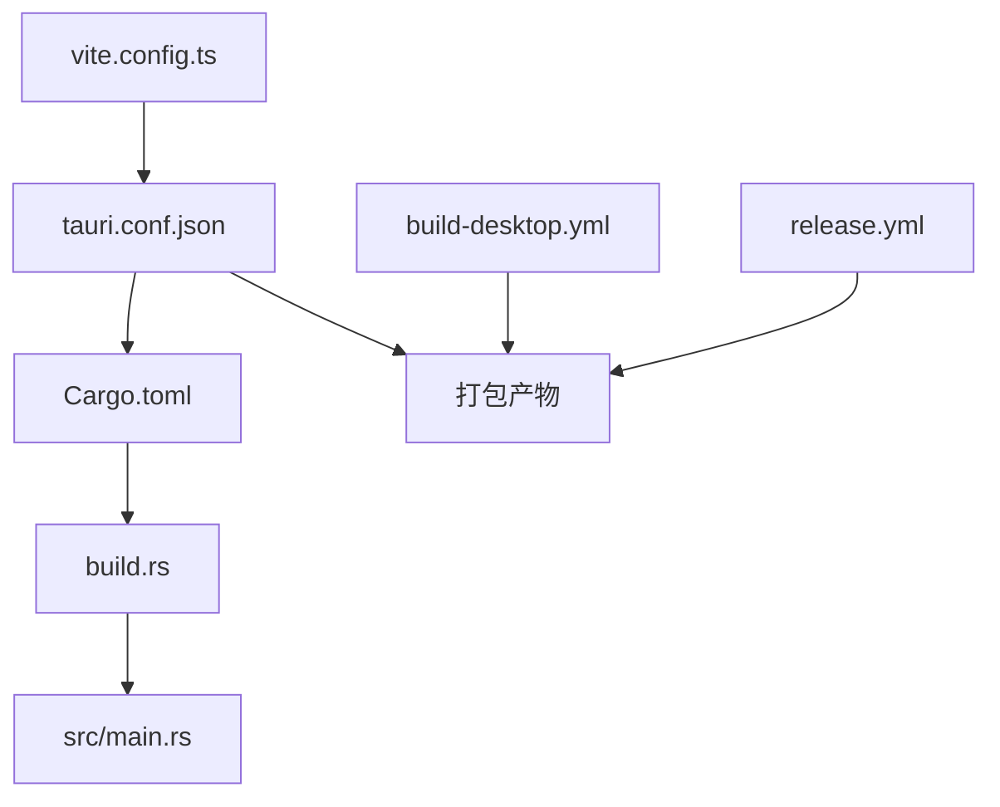

# 构建与部署

<cite>
**本文引用的文件**
- [package.json](file://package.json)
- [vite.config.ts](file://vite.config.ts)
- [tsconfig.json](file://tsconfig.json)
- [tsconfig.node.json](file://tsconfig.node.json)
- [src-tauri/Cargo.toml](file://src-tauri/Cargo.toml)
- [src-tauri/tauri.conf.json](file://src-tauri/tauri.conf.json)
- [src-tauri/build.rs](file://src-tauri/build.rs)
- [src-tauri/src/main.rs](file://src-tauri/src/main.rs)
- [.github/workflows/build-desktop.yml](file://.github/workflows/build-desktop.yml)
- [.github/workflows/release.yml](file://.github/workflows/release.yml)
- [README.md](file://README.md)
- [docs/releases/v0.9.3.md](file://docs/releases/v0.9.3.md)
- [docs/releases/v0.9.2.md](file://docs/releases/v0.9.2.md)
- [tests/app/plugin-registry/registry.test.ts](file://tests/app/plugin-registry/registry.test.ts)
</cite>

## 目录
1. [简介](#简介)
2. [项目结构](#项目结构)
3. [核心组件](#核心组件)
4. [架构总览](#架构总览)
5. [详细组件分析](#详细组件分析)
6. [依赖关系分析](#依赖关系分析)
7. [性能考量](#性能考量)
8. [故障排除指南](#故障排除指南)
9. [结论](#结论)
10. [附录](#附录)

## 简介
本文件为 DevNexus 的构建与部署指南，聚焦以下方面：
- Vite 构建配置：前端资源打包、开发服务器、HMR、别名与测试配置
- Tauri 打包流程：Rust 后端编译、前端资源嵌入、原生依赖与平台目标
- 多平台构建策略：Windows（NSIS 安装包）、macOS（.app + .dmg）、Linux（.deb + .AppImage）
- CI/CD 工作流：GitHub Actions 配置、自动化构建、测试集成与发布
- 版本管理策略：版本号同步、变更日志维护与发布标签管理
- 部署最佳实践：构建优化、资源压缩、缓存策略与性能监控
- 故障排除：常见构建错误、平台兼容性问题与发布失败处理

## 项目结构
DevNexus 采用“前端（Vite + React + TypeScript）+ 桌面壳（Tauri 2 + Rust）”的双层架构。前端通过 Vite 构建，产物由 Tauri 在打包阶段嵌入；Rust 侧负责系统能力与协议实现，并通过 Tauri 暴露给前端调用。

图表来源
- [vite.config.ts:1-42](file://vite.config.ts#L1-L42)
- [package.json:1-40](file://package.json#L1-L40)
- [tsconfig.json:1-30](file://tsconfig.json#L1-L30)
- [tsconfig.node.json:1-11](file://tsconfig.node.json#L1-L11)
- [src-tauri/tauri.conf.json:1-39](file://src-tauri/tauri.conf.json#L1-L39)
- [src-tauri/Cargo.toml:1-48](file://src-tauri/Cargo.toml#L1-L48)
- [src-tauri/build.rs:1-4](file://src-tauri/build.rs#L1-L4)
- [src-tauri/src/main.rs:1-7](file://src-tauri/src/main.rs#L1-L7)
- [.github/workflows/build-desktop.yml:1-142](file://.github/workflows/build-desktop.yml#L1-L142)
- [.github/workflows/release.yml:1-178](file://.github/workflows/release.yml#L1-L178)

章节来源
- [README.md:56-93](file://README.md#L56-L93)
- [vite.config.ts:1-42](file://vite.config.ts#L1-L42)
- [src-tauri/tauri.conf.json:1-39](file://src-tauri/tauri.conf.json#L1-L39)

## 核心组件
- 前端构建与开发服务器
  - 使用 Vite 作为构建工具与开发服务器，启用 React 插件、路径别名、测试范围与严格端口与 HMR 配置
  - 通过环境变量支持远程 HMR 主机，便于跨设备联调
- Tauri 应用配置
  - 定义产品名称、版本、标识符、开发/构建前置命令、前端产物目录与窗口尺寸
  - 启用多目标打包（all），并指定图标集
- Rust 后端与依赖
  - 定义库类型（静态库/动态库/rlib）以适配不同平台
  - 引入 Tauri、序列化、加密、数据库、网络、云存储、消息队列等依赖
- CI/CD 工作流
  - build-desktop.yml：在推送到 main 或手动触发时，构建并上传各平台产物
  - release.yml：在推送 v* 标签时，构建 Windows/macOS/Linux 并创建 GitHub Release

章节来源
- [vite.config.ts:9-42](file://vite.config.ts#L9-L42)
- [src-tauri/tauri.conf.json:1-39](file://src-tauri/tauri.conf.json#L1-L39)
- [src-tauri/Cargo.toml:1-48](file://src-tauri/Cargo.toml#L1-L48)
- [.github/workflows/build-desktop.yml:1-142](file://.github/workflows/build-desktop.yml#L1-L142)
- [.github/workflows/release.yml:1-178](file://.github/workflows/release.yml#L1-L178)

## 架构总览
下图展示从开发到发布的整体流程，包括 Vite 构建、Tauri 打包与多平台产物生成。

图表来源
- [package.json:6-14](file://package.json#L6-L14)
- [vite.config.ts:9-42](file://vite.config.ts#L9-L42)
- [src-tauri/tauri.conf.json:6-11](file://src-tauri/tauri.conf.json#L6-L11)
- [.github/workflows/build-desktop.yml:31-40](file://.github/workflows/build-desktop.yml#L31-L40)
- [.github/workflows/release.yml:30-61](file://.github/workflows/release.yml#L30-L61)

## 详细组件分析

### Vite 构建配置
- 插件与别名
  - 启用 React 插件，设置路径别名为 @，提升导入便捷性
- 开发服务器
  - 固定端口 1420，严格端口模式，避免端口冲突
  - 支持通过环境变量配置 HMR 协议与主机，便于远程 HMR
  - 忽略对 src-tauri 的监听，减少不必要的文件系统开销
- 测试配置
  - 指定测试文件范围，配合 Vitest 进行单元测试
- 类型配置
  - tsconfig.json 采用 bundler 模式，启用 JSX 与严格模式，确保类型安全

图表来源
- [vite.config.ts:9-42](file://vite.config.ts#L9-L42)
- [tsconfig.json:1-30](file://tsconfig.json#L1-L30)
- [tsconfig.node.json:1-11](file://tsconfig.node.json#L1-L11)

章节来源
- [vite.config.ts:9-42](file://vite.config.ts#L9-L42)
- [tsconfig.json:1-30](file://tsconfig.json#L1-L30)
- [tsconfig.node.json:1-11](file://tsconfig.node.json#L1-L11)

### Tauri 打包流程
- 应用配置
  - productName、version、identifier 与 tauri.conf.json 中的版本保持一致
  - beforeDevCommand 指向 npm run dev，devUrl 指向 Vite 1420 端口
  - beforeBuildCommand 指向 npm run build，frontendDist 指向 ../dist
  - 窗口尺寸与最小尺寸、无装饰窗口等 UI 行为
- 打包目标
  - bundle.targets 设为 all，生成多平台产物
  - 图标集包含多分辨率 PNG 与平台专用图标
- Rust 后端
  - crate-type 支持 staticlib、cdylib、rlib，适配不同链接方式
  - build.rs 调用 tauri_build::build，驱动 Tauri 代码生成与资源嵌入
  - main.rs 在非调试模式下设置 Windows 子系统，避免额外控制台窗口

图表来源
- [src-tauri/tauri.conf.json:1-39](file://src-tauri/tauri.conf.json#L1-L39)
- [src-tauri/Cargo.toml:1-48](file://src-tauri/Cargo.toml#L1-L48)
- [src-tauri/build.rs:1-4](file://src-tauri/build.rs#L1-L4)
- [src-tauri/src/main.rs:1-7](file://src-tauri/src/main.rs#L1-L7)

章节来源
- [src-tauri/tauri.conf.json:1-39](file://src-tauri/tauri.conf.json#L1-L39)
- [src-tauri/Cargo.toml:1-48](file://src-tauri/Cargo.toml#L1-L48)
- [src-tauri/build.rs:1-4](file://src-tauri/build.rs#L1-L4)
- [src-tauri/src/main.rs:1-7](file://src-tauri/src/main.rs#L1-L7)

### 多平台构建策略
- Windows（NSIS 安装包）
  - 使用 npm run tauri build -- --bundles nsis
  - 产物上传为 .exe 安装包
- macOS（.app + .dmg）
  - 并行构建 x64 与 arm64 目标
  - 使用 --bundles app,dmg 生成 .app 与 .dmg
  - 收集 DMG 并重命名为包含架构后缀
- Linux（.deb + .AppImage）
  - 安装 WebKit、GTK、AppIndicator、rsvg、curl、patchelf 等系统依赖
  - 使用 --bundles deb,appimage 生成 .deb 与 .AppImage
  - 产物分别上传至 artifacts

图表来源
- [.github/workflows/build-desktop.yml:31-40](file://.github/workflows/build-desktop.yml#L31-L40)
- [.github/workflows/build-desktop.yml:72-96](file://.github/workflows/build-desktop.yml#L72-L96)
- [.github/workflows/build-desktop.yml:126-142](file://.github/workflows/build-desktop.yml#L126-L142)
- [.github/workflows/release.yml:30-61](file://.github/workflows/release.yml#L30-L61)
- [.github/workflows/release.yml:93-110](file://.github/workflows/release.yml#L93-L110)
- [.github/workflows/release.yml:139-149](file://.github/workflows/release.yml#L139-L149)

章节来源
- [.github/workflows/build-desktop.yml:13-142](file://.github/workflows/build-desktop.yml#L13-L142)
- [.github/workflows/release.yml:11-178](file://.github/workflows/release.yml#L11-L178)

### CI/CD 工作流
- build-desktop.yml
  - 触发条件：手动触发或推送到 main 分支
  - 步骤：安装 Node.js 与 Rust、安装前端依赖、构建各平台包、上传产物
- release.yml
  - 触发条件：推送 v* 标签
  - 步骤：Windows/macOS/Linux 分别构建，收集产物，创建 GitHub Release 并上传制品
  - macOS 支持 x64 与 arm64 并行构建，产物重命名与归档

图表来源
- [.github/workflows/build-desktop.yml:1-142](file://.github/workflows/build-desktop.yml#L1-L142)
- [.github/workflows/release.yml:1-178](file://.github/workflows/release.yml#L1-L178)

章节来源
- [.github/workflows/build-desktop.yml:1-142](file://.github/workflows/build-desktop.yml#L1-L142)
- [.github/workflows/release.yml:1-178](file://.github/workflows/release.yml#L1-L178)

### 版本管理策略
- 版本号同步
  - package.json、src-tauri/Cargo.toml、src-tauri/tauri.conf.json 的 version 保持一致
- 变更日志维护
  - docs/releases/ 下按版本命名的 Markdown 文件，记录功能亮点与验证步骤
- 发布标签管理
  - 推送 v* 标签触发 release.yml，自动生成 Release 并附带多平台产物

章节来源
- [package.json:4-4](file://package.json#L4-L4)
- [src-tauri/Cargo.toml:3-3](file://src-tauri/Cargo.toml#L3-L3)
- [src-tauri/tauri.conf.json:4-4](file://src-tauri/tauri.conf.json#L4-L4)
- [docs/releases/v0.9.3.md:1-20](file://docs/releases/v0.9.3.md#L1-L20)
- [docs/releases/v0.9.2.md:1-32](file://docs/releases/v0.9.2.md#L1-L32)
- [README.md:158-178](file://README.md#L158-L178)

### 部署最佳实践
- 构建优化
  - 使用 Vite 的严格端口与 HMR 配置，减少开发期干扰
  - 将 src-tauri 纳入忽略监听，降低文件系统压力
- 资源压缩与缓存
  - 生产构建由 Vite 默认处理；如需进一步优化，可在 Vite 配置中引入压缩插件（建议在企业级部署中评估）
- 性能监控
  - 结合前端性能指标与 Tauri 日志进行端到端监控（建议在企业级部署中接入）

章节来源
- [vite.config.ts:23-40](file://vite.config.ts#L23-L40)
- [README.md:134-135](file://README.md#L134-L135)

## 依赖关系分析
- 前端到桌面壳
  - vite.config.ts 与 tauri.conf.json 协同，确保开发服务器端口与构建产物路径一致
- 桌面壳到后端
  - Cargo.toml 定义依赖与库类型；build.rs 驱动 Tauri 生成；main.rs 作为入口
- CI/CD 到产物
  - build-desktop.yml 与 release.yml 通过上传/下载制品完成跨平台产物归档与发布

图表来源
- [vite.config.ts:9-42](file://vite.config.ts#L9-L42)
- [src-tauri/tauri.conf.json:1-39](file://src-tauri/tauri.conf.json#L1-L39)
- [src-tauri/Cargo.toml:1-48](file://src-tauri/Cargo.toml#L1-L48)
- [src-tauri/build.rs:1-4](file://src-tauri/build.rs#L1-L4)
- [src-tauri/src/main.rs:1-7](file://src-tauri/src/main.rs#L1-L7)
- [.github/workflows/build-desktop.yml:1-142](file://.github/workflows/build-desktop.yml#L1-L142)
- [.github/workflows/release.yml:1-178](file://.github/workflows/release.yml#L1-L178)

章节来源
- [vite.config.ts:9-42](file://vite.config.ts#L9-L42)
- [src-tauri/tauri.conf.json:1-39](file://src-tauri/tauri.conf.json#L1-L39)
- [src-tauri/Cargo.toml:1-48](file://src-tauri/Cargo.toml#L1-L48)
- [src-tauri/build.rs:1-4](file://src-tauri/build.rs#L1-L4)
- [src-tauri/src/main.rs:1-7](file://src-tauri/src/main.rs#L1-L7)
- [.github/workflows/build-desktop.yml:1-142](file://.github/workflows/build-desktop.yml#L1-L142)
- [.github/workflows/release.yml:1-178](file://.github/workflows/release.yml#L1-L178)

## 性能考量
- 构建性能
  - 严格端口与忽略监听可减少热更新与文件系统扫描开销
  - 并行矩阵构建 macOS 目标，缩短整体等待时间
- 运行时性能
  - 插件化架构与虚拟列表、分页加载等前端优化有助于大体量数据浏览
  - 后端使用 tokio 异步运行时与连接池，提升并发与稳定性

章节来源
- [vite.config.ts:23-40](file://vite.config.ts#L23-L40)
- [README.md:37-55](file://README.md#L37-L55)

## 故障排除指南
- 常见构建错误
  - 端口被占用：确认 1420 与 HMR 端口未被占用，或调整严格端口配置
  - 跨设备 HMR 失败：检查 TAURI_DEV_HOST 与 HMR 协议配置
  - 未找到 dist：确认 beforeBuildCommand 与 frontendDist 路径一致
- 平台兼容性问题
  - Windows：确保满足 Tauri 前置依赖；NSIS 安装包生成失败时检查打包参数
  - macOS：x64 与 arm64 目标需分别安装对应 Rust 目标；DMG 产物需核对架构后缀
  - Linux：安装 WebKit/GTK/AppIndicator/curl/patchelf 等系统依赖后再打包
- 发布失败处理
  - 产物缺失：检查上传/下载步骤与路径匹配；确认 artifacts 名称与 glob 模式
  - Release 创建失败：核对标签格式与变更日志路径

章节来源
- [vite.config.ts:25-40](file://vite.config.ts#L25-L40)
- [src-tauri/tauri.conf.json:6-11](file://src-tauri/tauri.conf.json#L6-L11)
- [.github/workflows/build-desktop.yml:31-40](file://.github/workflows/build-desktop.yml#L31-L40)
- [.github/workflows/build-desktop.yml:72-96](file://.github/workflows/build-desktop.yml#L72-L96)
- [.github/workflows/build-desktop.yml:126-142](file://.github/workflows/build-desktop.yml#L126-L142)
- [.github/workflows/release.yml:158-178](file://.github/workflows/release.yml#L158-L178)

## 结论
DevNexus 的构建与部署体系围绕 Vite + Tauri + Rust 形成闭环：前端通过 Vite 高效构建，Tauri 负责跨平台打包与资源嵌入，GitHub Actions 实现自动化构建与发布。遵循版本号同步与变更日志规范，结合多平台矩阵构建与严格的产物归档，可稳定产出高质量桌面应用。

## 附录
- 验证命令与本地开发
  - 运行测试、类型检查与前端构建
  - Rust 后端检查
  - 启动 Vite 前端开发服务与 Tauri 完整开发模式
- 打包命令
  - 默认打包、Windows NSIS、macOS .app/.dmg、Linux .deb/.AppImage

章节来源
- [README.md:120-150](file://README.md#L120-L150)
- [README.md:292-335](file://README.md#L292-L335)